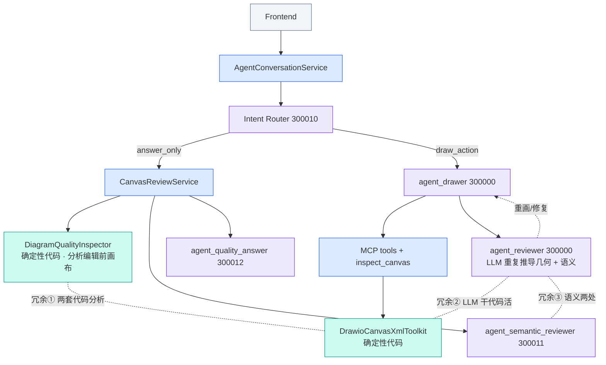
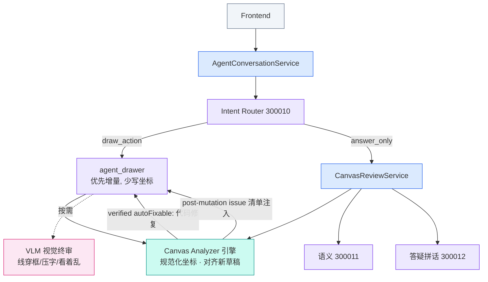

# Draw.io Review 链路重构 — 实现方案（交接文档）

> 目标读者：接手开发者。本文给出 8 个主事项及 1b/1c 两个前置细化事项的实现方案、涉及文件、接口约定、验收标准与落地顺序。
> 编写日期：2026-07-01。分支：`main`。

---

## 0. 背景与目标

当前「审图/质量」相关能力散落在 **6 个组件、2 条链路**上，存在三类冗余：

1. 两套确定性画布分析（`DefaultDiagramQualityInspector` 与 `DrawioCanvasXmlToolkit`）做同一件事。
2. 内联 LLM 评审 `agent_reviewer`(300000) 用大模型重复推导「重叠/校验/几何」——这些代码能算且更准；实测出现过「线穿框」画质问题正源于模型手写坐标。
3. 语义评审同时出现在 `agent_reviewer`(300000) 与 `agent_semantic_reviewer`(300011)。

**重构目标（终态）**：按「每种机制只干它唯一擅长的事」分层：

| 能力 | 承担者 | 说明 |
|------|--------|------|
| 几何/结构/路由（重叠、坏边、坏 XML、边路由归一化） | **确定性引擎（代码，基于规范化画布模型）** | 便宜、精确、能定位 cell id → 部分可自动修 |
| 视觉呈现（线穿框、标签压字、拥挤、"看着乱"） | **VLM（看渲染图）** | 代码抓不到的视觉问题；贵、按需 |
| 语义正确性（缺概念、关系错、领域准确） | **语义 LLM（300011）** | 需语言理解 |
| 把报告拼成用户可读答复 | **答疑 LLM（300012）** | 仅答疑功能用 |

代码引擎与 VLM 在「重叠」上是**互补**（代码判几何精确相交，VLM 判视觉呈现），不是二选一。分工判据是**成本 / 精度 / 可自动修**，不是「重叠 vs 观感」。

终态数量：**3 个 LLM agent → 2 个**（300011 + 300012），**2 套代码分析 → 1 套**；内联 `agent_reviewer`(300000) 退役、`inspect_canvas` 分阶段降级为后端自动注入。

---

## 1. 现状组件与关键文件

模块根：`ai-agent-draw-io/`（Maven 多模块：`-domain` / `-trigger` / `-app` / `-api` / `-types` / `-infrastructure`）。

| 组件 | 类型 | 文件 |
|------|------|------|
| `DrawioCanvasXmlToolkit` | 确定性代码：`inspect` / `detectOverlaps` / `findCells` / `replaceCells` / `routeEdges` / `toGraphModel` | `ai-agent-draw-io-domain/.../service/armory/matter/mcp/server/DrawioCanvasXmlToolkit.java` |
| `DefaultDiagramQualityInspector` | 确定性代码：`inspect(message, diagramType)` / `inspect(snapshot)` → `DiagramQualityReport` | `ai-agent-draw-io-domain/.../service/quality/DefaultDiagramQualityInspector.java`（接口 `IDiagramQualityInspector`） |
| `DrawioCanvasMcpService` | MCP 工具：`create_diagram` / `modify_diagram` / `optimize_diagram` / `inspect_canvas`（`@Tool`），以及一批未暴露的内部方法 | `ai-agent-draw-io-domain/.../service/armory/matter/mcp/server/DrawioCanvasMcpService.java` |
| `DrawioCanvasToolNames` | 工具名常量 + 分组集合 | 同目录 `DrawioCanvasToolNames.java` |
| `DefaultCanvasReviewService` | 答疑评审编排（调 inspector + 300011 + 300012） | `ai-agent-draw-io-domain/.../service/review/DefaultCanvasReviewService.java`（接口 `ICanvasReviewService`） |
| `CanvasReviewContext` | 承载 `qualityReport` + `semanticReview` + `serializedContext` | `ai-agent-draw-io-domain/.../model/valobj/review/CanvasReviewContext.java` |
| `AgentConversationService` | 流式编排：`stream` / `buildRoutedMessage` / `buildReviewContextIfNeeded` / `processFunctionResponses` / `effectiveMaxReviewIterations` / `shouldStopForReviewLimit` | `ai-agent-draw-io-trigger/.../http/service/AgentConversationService.java` |
| `DrawioPromptContextBuilder` | 各 agent 的上下文注入 | `ai-agent-draw-io-trigger/.../http/service/DrawioPromptContextBuilder.java` |
| `DrawioStreamResponseWriter` | SSE 下发 + `sendLocalCellPatch` 合并补丁 | `ai-agent-draw-io-trigger/.../http/service/DrawioStreamResponseWriter.java` |
| Agent 定义 | `agent_drawer`/`agent_reviewer`(300000)、`agent_semantic_reviewer`(300011)、`agent_quality_answer`(300012)、intent(300010)、workflows | `ai-agent-draw-io-app/src/main/resources/agent/agent-draw-io.yml` |

**两条链路**：
- 答疑链路（`intent=answer_only` 且需评审）：`DefaultCanvasReviewService.answer` → inspector(代码) + 300011(LLM) → 300012(LLM)。
- 内联链路（`draw_action`）：ADK 工作流 `sequential_draw_process = [agent_drawer, loop_refinement[agent_reviewer, agent_drawer]]`。

**注入给 `agent_reviewer` 的内容**（开评审时，经 `buildRoutedMessage` 尾部 `reviewContext.getSerializedContext()`）：`[Diagram Quality Report]`(确定性) + `[Semantic Content Review]`(300011)。注意：当前 `DefaultCanvasReviewService.buildReviewContext` 里 `diagramQualityInspector.inspect(command.getMessage(), …)` 分析的是**请求带入的编辑前画布**，不是 drawer 新草稿（详见事项 2）。

---

## 2. 通用约定

- **构建/测试**：`app` 模块 `pom.xml` 硬编码了 `<skipTests>true</skipTests>`。跑测试时临时改为 `<skipTests>${skipTests}</skipTests>`，用 `mvn -pl ai-agent-draw-io-app -am test -Dtest='XxxTest' -DskipTests=false -Dsurefire.failIfNoSpecifiedTests=false`，**跑完还原 pom**。日常编译用 `mvn -pl <module> -am compile -DskipTests`。
- **不破坏对外契约**：MCP 工具名（`create_diagram`/`modify_diagram`/`optimize_diagram`/`inspect_canvas`）、SSE chunk 类型（`drawio_done`/`update_cells`/`review_result`/…）在 M1–M3 改造期间保持兼容，前端无需改。`inspect_canvas` 只在后端自动注入稳定后再从 agent 可见工具中下线。
- **确定性优先**：任何"几何/坐标/重叠/路由"计算一律走代码，禁止让 LLM 手写 waypoint/坐标。
- **坐标基准**：所有确定性 issue 必须基于同一套规范化坐标（含子节点/泳道/容器的绝对坐标），不能混用 `mxGeometry` 局部坐标与 snapshot 绝对坐标。
- **每个事项独立可验收、可回滚**，按第 11 节顺序推进。

---

## 事项 1 — 合并两套确定性画布分析成单一引擎

**目标**：把 `DefaultDiagramQualityInspector`（基于 snapshot）与 `DrawioCanvasXmlToolkit`（基于 XML）在「重叠/校验/布局/可读性」上的重复逻辑，收敛为**一个引擎**，两条链路共用。

**现状问题**：
- `DrawioCanvasXmlToolkit.inspect(xml)` → `CanvasInspection{valid, severity, issues, cells, summary}`；`detectOverlaps(xml)` → `List<OverlapInfo>`（当前仅**节点-节点**重叠）。
- `DefaultDiagramQualityInspector.inspect(...)` → `DiagramQualityReport`，内部另做 `inspectLayout/inspectReadability/inspectEdges/inspectSemantics`。
- 两者对"重叠/布局"各算一套。

**方案**：
1. 新增统一解析/分析层 `CanvasAnalyzer`，以**规范化画布模型**为几何真相源，而不是直接把 `DrawioCanvasXmlToolkit` 当前的 `CellInfo` 当终态。规范化模型必须：
   - 从 `mxGraphModel`/片段解析所有 `mxCell`。
   - 解析并保留 raw XML，供 `replaceCells`/增量修复使用。
   - 解析 vertex/edge/source/target/waypoints。
   - 解析容器/泳道/父子关系，并把节点坐标归一到绝对坐标。
   - 保留当前 `DrawioCanvasSnapshot` 已有的 summary 能力，避免答疑链路退化。
2. `DrawioCanvasXmlToolkit` 继续承担 XML 包装、查找、替换、路由等 XML 操作；其 `inspect`/`detectOverlaps` 后续改为委托 `CanvasAnalyzer`，不要再保留第二套几何判断。
3. 新增统一出参类型 `CanvasAnalysis`（放 `model/valobj/analysis`，不要和旧 `quality` 语义混在一起）：
   ```java
   class CanvasAnalysis {
       boolean valid;
       String severity;              // ok | minor | major | critical
       List<Issue> issues;           // 每条含 type, category, targetCellIds, message, repairability
       CanvasSummaryData summary;    // node/edge 计数、bounds 等
   }
   enum IssueType { INVALID_XML, DUP_ID, MISSING_GEOMETRY, BROKEN_EDGE,
                    NODE_OVERLAP, EDGE_NODE_CROSSING, LABEL_OVERFLOW }  // 见事项 1b
   ```
4. 让 `DefaultDiagramQualityInspector` **只委托结构/几何类判断**：重叠、坏边、坏 XML、缺 geometry、边-节点交叉来自 `CanvasAnalyzer`。现有的可读性、紧密间距、弱对齐、密度、长标签、以及启发式 `semanticHints` 先保留或迁移为 `CanvasAnalysis` 的非结构 issue，直到事项 5 真正由 300011 接管语义。
5. `inspect_canvas` 工具（`DrawioCanvasMcpService.inspectCanvas`）也改为返回同一 `CanvasAnalysis` 适配后的响应。M1 阶段先保持工具名和响应外壳兼容，新增字段以向后兼容方式挂载。

**接口建议**：
```java
public interface ICanvasAnalyzer {
    CanvasAnalysis analyze(String mxGraphModelXml, String diagramType);
}
// 新增 CanvasAnalyzer 实现；DrawioCanvasXmlToolkit.inspect()/detectOverlaps() 委托它。
```

**验收**：
- `DiagramQualityInspector`、`inspect_canvas`、以及后续引擎调用点，结构/几何结果来自同一份 `CanvasAnalyzer`。
- 全量 grep 确认再无第二处独立实现节点重叠、坏边、缺 geometry、XML 校验。
- 对含泳道/容器子节点的图，节点坐标按绝对坐标分析，结果与实际渲染位置一致。
- `DiagramQualityReport` 里原有可读性/密度/长标签类信号没有因为合并几何引擎而消失。

**测试**：新增 `CanvasAnalyzerTest`：给定含重叠/坏边/dup id/缺 geometry/容器子节点的 XML，断言 `issues` 含对应 `IssueType` 与正确 `targetCellIds`。保留并跑通既有 `DiagramQualityInspectorTest` 与 `DrawioCanvasMcpServiceTest`，确保旧质量信号仍在。

**风险**：`DiagramQualityReport` 字段被外部（`CanvasReviewContext` 序列化、300012 prompt）依赖，映射时保持字段语义不变。`severity` 需要明确映射：`CanvasAnalysis.ok/minor/major/critical` → `DiagramQualityReport.ok/low/medium/high`，不得让 `none`、`major`、`critical` 等旧值泄漏到新契约。

---

## 事项 1b（可选增强）— 增加「边-节点交叉」检测

**目标**：`detectOverlaps` 当前只判节点-节点重叠，抓不到「线穿框」（实测画质问题的主因）。补充**边路径 vs 节点矩形**的确定性交叉检测。

**方案**：
- 在 `CanvasAnalyzer` 新增 `List<EdgeCrossing> detectEdgeNodeCrossings(String xml)`：对每条 edge，取其几何路径（source/target 端口 + waypoints 组成的折线段），与每个非端点 node 的绝对坐标矩形做**线段-矩形相交**判定。
- 命中输出 `EdgeCrossing{edgeId, nodeId}`，并入 `CanvasAnalysis.issues`（`IssueType.EDGE_NODE_CROSSING`）。
- 本事项只承诺**检测**。在事项 1c 完成前，`repairability` 标为 `candidate` 或 `manual_reroute`，不要标成稳定 `autoFixable=true`。

**验收**：构造一条 waypoint 落在某 node 矩形内的 XML，`analyze` 能报 `EDGE_NODE_CROSSING` 且 `targetCellIds` 正确；构造容器/泳道内子节点场景，交叉判断仍基于绝对坐标。

**风险**：几何计算需覆盖正交折线；先支持直线段与正交段即可，曲线可暂按折线近似。

---

## 事项 1c — 把 `routeEdges` 升级为可验证避障路由

**目标**：只有当代码修复能被测试证明会消除 `EDGE_NODE_CROSSING` 时，才把边穿框标为 `autoFixable=true`。

**现状**：当前 `DrawioCanvasXmlToolkit.routeEdges` 主要设置正交边样式并在缺少 waypoint 时补中点；`NODE_CLEARANCE` 用在边标签候选评分，不等于节点避障路由。因此不能假设 `routeEdges` 已具备绕开障碍节点的能力。

**方案**：
1. 基于事项 1b 的 `EDGE_NODE_CROSSING` 检测结果，只重算受影响 edge 的路径。
2. 生成候选路径时优先使用 source/target 外侧端口、图形外侧 gutter、以及绕过 blocker 矩形的 L/U 型正交路径。
3. 对每个候选路径重新调用 `CanvasAnalyzer` 的交叉检测；选择不穿过非端点节点、折点数较少、总长度较短的候选。
4. 没有安全候选时，不自动修改 XML，只把 issue 作为 `manual_reroute` 注入后续 drawer/reviewer。

**验收**：给定一条穿过中间节点的 edge，`routeEdges` 后 `analyze` 不再报 `EDGE_NODE_CROSSING`；给定无安全空间的密集布局，`routeEdges` 不产生更坏路径，并保留可解释 issue。

**测试**：新增 `CanvasEdgeRoutingTest`，覆盖单 blocker、多个 blocker、已有 waypoint、容器内子节点、无安全候选五类场景。

---

## 事项 2 — 确定性分析对齐 drawer 的新草稿

**目标**：内联链路里，代码分析应针对 drawer **刚产出的草稿**，而不是编辑前画布。

**现状**：`DefaultCanvasReviewService.buildReviewContext(command)` 里 `diagramQualityInspector.inspect(command.getMessage(), diagramType)`，`command.getMessage()` 来自请求 → 是**编辑前**画布；而 `agent_reviewer` 要审的是 `draft_diagram`（drawer 新输出）。二者错位。

**先决设计**：不能只改 `DefaultCanvasReviewService.buildReviewContext`。当前 `CanvasReviewCommand` 只有 `message`，没有 drawer 新草稿 XML；而流式链路在开始调用 ADK 前就构建了 `CanvasReviewContext`。因此需要新增一个**post-mutation analysis 通道**，让 mutation 工具结果或 workflow state 携带新草稿分析结果。

**方案（推荐）**：
1. 保留答疑链路：`DefaultCanvasReviewService.answer/buildReviewContext` 继续分析当前画布。
2. 内联链路改为：drawer 调用 `create_diagram`/`modify_diagram`/`optimize_diagram` 后，工具层或 stream renderer 对**工具产出的新 XML**跑 `CanvasAnalyzer`。
3. 工具响应新增向后兼容字段，如 `analysis` 或 `validation_result`，包含 `valid/severity/issues/summary`。真实 tool call 场景下，这个字段必须进入 ADK conversation，供后续 `agent_reviewer`/`agent_drawer` 读取；文本 fallback 场景下，`DrawioStreamResponseWriter` 至少要把同样结构发给前端，并在本轮缓存中保存最新分析。
4. `buildRoutedMessage` 开始阶段只注入当前画布的 `[Canvas Issues]`；drawer 产出后的分析不再通过预先构造的 `CanvasReviewContext` 伪装成新草稿报告。
5. 如果后续仍保留 `agent_reviewer`，其 prompt 明确读取“latest validation_result / latest CanvasAnalysis”，而不是只读初始 `[Diagram Quality Report]`。

**注意**：答疑链路（`intent=answer_only`「看看这图有啥问题」）分析当前画布是**正确**的，不要动那条；只修内联链路的取材来源。

**验收**：内联评审/修复轮次拿到的 `validation_result` 或 `CanvasAnalysis` 描述的是 drawer 新草稿的问题（可用日志比对 XML hash/节点数）。答疑链路仍然只分析请求中的当前画布。

---

## 事项 3 — reviewer 信任代码报告，停止重复推导

**目标**：`agent_reviewer` 不再从 XML 里自己找重叠/校验/交叉，改为**消费**引擎给出的最新 `CanvasAnalysis` / `validation_result`。初始 `[Diagram Quality Report]` 只代表当前画布，不代表 drawer 新草稿。

**改动**（`agent-draw-io.yml` 的 `agent_reviewer` 指令，约 355–412 行）：
- 删除/弱化 checklist 中「自行检测 overlaps / edges crossing / malformed XML / missing source-target」等**几何类**条目。
- 增加：「几何/结构问题以注入的最新 `CanvasAnalysis` / `validation_result` 为准（ground truth），不要自行从坐标推导；只在这些报告基础上给出 `fix_strategy` 与 `issues`」。若同时存在初始 `[Diagram Quality Report]` 和 post-mutation `validation_result`，以内联草稿对应的 post-mutation 结果为准。
- 保留其「语义/观感」判断（在事项 4、5 进一步收敛）。

**依赖**：事项 1、2（引擎统一且对齐新草稿）先落地，报告才可信。

**验收**：给一张代码报告已标注重叠、但 reviewer 不再新增/漏报几何问题；`review_result.issues` 的 target 与报告一致。

**风险**：prompt 行为回归——用既有 `AgentConversationServiceTest` / 新增 golden 测试固化。

---

## 事项 4 — 退役内联 `agent_reviewer` 的几何职责

**目标**：几何交给引擎（自动修 + 注入 issue），内联 reviewer 只留「语义/观感」或整体退役。

**方案（分两阶段）**：
1. **阶段一**：drawer 产出草稿后，后端自动跑引擎；只有通过事项 1c 验证的 `autoFixable` 问题才直接用代码修复。未验证稳定的边穿框/拥挤/布局问题只作为 issue 注入回 drawer/reviewer，避免代码自动生成更差路径。
2. **阶段二**：评估内联 `agent_reviewer` 是否还需要。若「观感」暂由 VLM（事项 8）承担、语义由 300011（事项 5）承担，则 `agent_reviewer` 可从 `loop_refinement` 工作流中**移除**（改 `agent-draw-io.yml` 的 `agent-workflows`，约 416–442 行；`sequential_draw_process` 相应简化）。

**注意**：移除 reviewer 会影响 `AgentConversationService` 里 `shouldStopForReviewLimit` / `effectiveMaxReviewIterations` 的语义——需同步梳理"评审轮次"是否还成立，或改为"引擎修复轮次"。

**验收**：一次布局/路由类编辑，不经过 LLM reviewer 即由代码把路由修好；端到端耗时显著下降。

**风险**：这是行为面较大的改动，务必在事项 1–3、6 稳定后进行，并保留开关（可配置是否启用内联 LLM reviewer）以便回滚。

---

## 事项 5 — 语义评审收敛到 300011

**目标**：语义（内容正确性）只由 `agent_semantic_reviewer`(300011) 承担，删除 `agent_reviewer`(300000) 里的内容质量 checklist。

**改动**：
- `agent-draw-io.yml`：从 `agent_reviewer` 指令删除 type-specific 内容质量条目（架构子类型、UML 语义、ER 等）。
- 内联链路需要语义评审时（`needsSemanticReview=true`），复用 `DefaultCanvasReviewService` 的 `reviewSemanticContent`（走 300011），把 `SemanticContentReview` 注入，而不是让 300000 再判一遍。

**依赖**：事项 4（reviewer 职责已收窄）。

**验收**：语义类问题只在 300011 的输出里出现；300000（若仍存在）不再产出内容质量类 issue。

---

## 事项 6 — `inspect_canvas` 从「AI 自调工具」改为「后端自动注入」

**目标**：不再依赖模型判断"要不要看画布"；后端在需要时自动跑引擎并把 issue 清单注入上下文。

**现状**：`inspect_canvas` 是暴露给 drawer 的 `@Tool`；但 drawer 已持有完整 XML，模型常漏调，且多一次 LLM 往返。

**方案**：
1. **阶段 6a（兼容阶段）**：保留 `inspect_canvas` 的 `@Tool` 暴露和 `allowedTools`，但后端同时自动注入 `[Canvas Issues]`。这样 prompt/工具注册/前端兼容不被一次性打破。
2. **编辑前**：`DrawioPromptContextBuilder` 在 drawer 上下文里追加 `[Canvas Issues]`（由引擎对当前画布分析得到的精简 issue 清单，含 cell id、severity、repairability）。
3. **mutation 后**：drawer 产出草稿 → 后端自动 `analyze` → 已验证 `autoFixable` 的 issue 直接修 → 其余 issue 通过事项 2 的 post-mutation analysis 通道注入后续轮次。
4. **阶段 6b（下线阶段）**：当自动注入 + post-mutation 分析稳定后，才去掉 `inspect_canvas` 的 `@Tool` 暴露，并从 `DrawioCanvasToolNames.CONSOLIDATED_TOOL_NAMES`、`AgentConversationService.allowedToolsFor`、`agent-draw-io.yml` 工具说明、相关 prompt tests 中移除。

**验收**：阶段 6a 中 drawer 即使不调用任何"查看"工具也能拿到 issue 清单；日志显示 mutation 后自动分析被触发。阶段 6b 中全量 grep 确认 agent 可见工具清单不再包含 `inspect_canvas`，但内部分析能力仍可被后端调用。

**风险**：注入体积——大图时 issue 清单要截断（给出 top-N + 截断计数），避免 prompt 膨胀。

---

## 事项 7 — 杠杆2：修复走增量（不再重吐整张 mxGraphModel）

**目标**：`route_only` / `layout_optimize` / `append` 类修复不再让 drawer 重发完整 `mxGraphModel`，改为**按 id 的增量操作**（add/update/delete）。

**现状**：`optimize_diagram` 与 `modify_diagram mode=full_xml` 要求传完整 `mxGraphModel`（见 `agent-draw-io.yml` 约 254/282 行；`DrawioCanvasMcpService.optimizeDiagram` = `routeEdges(request.getXml())`）。只有 `modify_diagram mode=patch` 是真增量。

**方案**：
1. 先补一个明确的 `CanvasStateStore` / turn-level canvas state，而不是让 domain 层 `DrawioCanvasMcpService` 直接读 trigger 层 `DrawioStreamResponseWriter.currentCanvasByEmitter`。状态键可来自 sessionId/turnId/tool context；如果当前工具体系拿不到稳定键，则 M4 第一阶段继续要求 `optimize_diagram.xml` 必填。
2. `DrawioStreamResponseWriter` 每次成功发送 `drawio_done` / `update_cells` / local patch merge 后，都要把 `currentCanvasByEmitter` 或新的 `CanvasStateStore` 推进到最新 XML。当前缓存只在流开始时设置，不能作为“最新草稿”的依据。
3. `optimize_diagram` 分两阶段：
   - **7a**：保持 `xml` 参数必填，但后端只返回受影响 edge 的 patch/replace 片段（若前端/renderer 已支持局部合并）。
   - **7b**：在 `CanvasStateStore` 稳定后，新增近乎无参的 `route_current`/`optimize_current` 语义，对后端持有的最新画布运行代码优化。
4. `modify_diagram` 扩展/明确增量语义：`route_only`→仅提交受影响 edge 片段；`append`→仅提交新增 cell 片段；后端用 `replaceCells` 合并。
5. 相应更新 drawer prompt（`agent-draw-io.yml` 约 239/253/254/308 行的 fix_strategy→工具映射），分阶段去掉"pass the complete updated mxGraphModel"的要求，改为"仅提交变更片段/或触发后端当前画布归一化"。

**验收**：一次 `route_only` 修复，drawer 输出的 token 量从"整张 XML"降到"若干 edge 片段"（用 `[diag]` 日志的 chars 对比）；连续两次 mutation 时，第二次优化基于第一次 mutation 后的最新 XML，而不是请求初始画布。

**风险**：`optimize_diagram` 若改为用后端缓存画布，要先解决跨层状态来源与时序。不要让 domain 工具依赖 `ResponseBodyEmitter` 私有缓存；否则非流式调用、真实 MCP tool call、文本 fallback 会出现不一致。

**独立性**：本项与 1–6 相对独立，但配合事项 1（引擎）与事项 2（对齐新草稿）收益最大。

---

## 事项 8 — VLM 视觉终审（视觉层）

**目标**：引入视觉模型，对**渲染后的图**做终审，捕捉代码抓不到的视觉问题：线穿框、标签压字、视觉拥挤、"看着乱"，以及近距离/观感重叠。

**定位**：与代码引擎在"重叠"上**互补**——代码判几何精确相交（便宜、可自动修），VLM 判视觉呈现（最全、但贵、定位模糊）。**按需触发**（optimize / 复杂图 / 代码报告说 OK 但用户仍嫌乱），非每轮。

**方案**：
1. **渲染管线**：把当前 `mxGraphModel` 渲染成 PNG。可选：前端在会话中回传截图（最省，已有画布）；或后端用 draw.io 导出服务/headless 渲染。优先复用前端已渲染的画布截图（通过 SSE/请求回传）。
2. **视觉 endpoint**：需要具备 vision 能力的模型；不要在方案里绑定尚未验证的具体型号。新增独立 agent（如 300013 `agent_visual_reviewer`）或独立服务 `IVisualReviewService`。
3. **产出**：结构化 `VisualReview{issues:[{region/near, problem, suggestedFix}], approved}`。定位模糊时给"靠近哪个元素/哪块区域"，由 drawer 结合 XML 定位到 cell。
4. **触发与预算**：单次为主；仅在 `taskType=optimize_layout`、复杂图、或代码报告无阻断项但请求语义是"整理/优化/看着乱"时触发。
5. **闭环**：VLM issue → 定向增量修复（走事项 7 的增量路径）→ 可选再渲染复核一次（硬上限，防止死循环）。

**依赖**：事项 1（代码先兜住便宜的那部分）、事项 7（增量修复让"多一次视觉往返"可负担）。

**验收**：构造一张"线穿框"或"标签压字"的图，VLM 能指出该问题并驱动一次成功修复；成本受触发条件约束（非每轮渲染）。

**风险**：最大工程量；渲染管线与 vision endpoint 是新依赖，需灰度开关，默认关闭直至稳定。

---

## 11. 落地顺序与里程碑

按依赖 + 性价比推进，每步独立可验收：

| 步 | 事项 | 产出 | 风险 |
|----|------|------|------|
| M1 | **1 + 1b** | 规范化 CanvasAnalyzer + 结构/几何 issue 统一 + 边-节点交叉检测 | 低-中（坐标归一要谨慎） |
| M1.5 | **1c** | `routeEdges` 升级为可验证避障路由，只有通过测试的问题标 `autoFixable` | 中 |
| M2 | **2 + 6a** | post-mutation analysis 通道 + 编辑前 issue 自动注入，暂保留 `inspect_canvas` | 中 |
| M3 | **3 + 6b** | reviewer 信任最新分析报告、不再重复推导；稳定后下线 agent 可见 `inspect_canvas` | 中（prompt 回归） |
| M4 | **7** | CanvasStateStore + 修复走增量，省 token、稳画质 | 中 |
| M5 | **4 + 5** | 退役内联 reviewer 几何职责、语义收敛 300011 | 中-高（行为面，带开关） |
| M6 | **8** | VLM 视觉终审（灰度、按需） | 高（新依赖） |

**最小可用先手**：M1 + M2 完成后，即可获得「代码自动查重叠/边穿框、且对齐新草稿」的核心收益。自动 routeEdges 修复需等 M1.5 通过检测-修复闭环测试后再打开。

---

## 12. 回归测试清单

- `DrawioCanvasMcpServiceTest`、`DrawioPromptContextBuilderTest`、`DefaultIntentRoutingServiceTest`、`AgentConversationServiceTest`（现有，保持绿）。
- 新增：`CanvasAnalyzerTest`（引擎）、容器/泳道绝对坐标用例、边-节点交叉用例、`CanvasEdgeRoutingTest`（检测-修复闭环）、post-mutation analysis 可见性用例、增量修复合并用例、reviewer 信任报告的 golden 测试。
- 端到端（手动，省 token）：
  1. 「把 X 改成 Y」→ 局部 patch，秒回。
  2. 「整理这两条线」→ M1.5 后走确定性 routeEdges，线不穿框；M1/M2 阶段至少能稳定检测并注入 issue。
  3. 「优化整张图布局」→ optimize 增量 + （可选）VLM 一次。
  4. 「这图有什么问题」→ 答疑链路（inspector + 300011 → 300012），不误触发绘图。

---

## 13. 备注

- 终态组件数：确定性引擎 ×1、语义 LLM ×1(300011)、答疑拼话 ×1(300012)、VLM ×1(按需)；`agent_reviewer`(300000) 退役、`inspect_canvas` 分阶段降级为自动注入。
- 原则复述：**杠杆7 负责"省"、引擎(1/1b) 负责"准"、路由修复(1c) 负责"稳"、VLM(8) 负责"美"、语义 LLM(5) 负责"对"**。几何一律代码算，禁止 LLM 手写坐标。

---

## 附录 A — 架构对比（现状 vs 终态）

### A.1 现状（冗余点标注）



### A.2 终态（收敛后）



变化：`agent_reviewer`(300000) 退役；`inspect_canvas` 分阶段降级为引擎自动注入；两套代码分析 → 一个引擎；语义只在 300011。**3 个 LLM → 2 个，2 套代码分析 → 1 套，新增按需 VLM。**

---

## 附录 B — 关键接口签名清单

> 以下为**建议签名**，供实现参考；包名沿用现有结构，命名可按团队规范微调。

### B.1 统一分析引擎（事项 1 / 1b）

```java
// 新增：ai-agent-draw-io-domain/.../service/analysis/ICanvasAnalyzer.java
public interface ICanvasAnalyzer {
    CanvasAnalysis analyze(String mxGraphModelXml, String diagramType);
}

// 新增：ai-agent-draw-io-domain/.../model/valobj/analysis/CanvasAnalysis.java
@Data @Builder
public class CanvasAnalysis {
    private boolean valid;
    private String severity;          // ok | minor | major | critical
    private List<Issue> issues;
    private CanvasSummaryData summary; // 复用现有 snapshot/summary 数据
}

@Data @Builder
public class Issue {
    private IssueType type;
    private String category;           // structure | geometry | readability | semantic_hint
    private List<String> targetCellIds; // 精确定位，供自动修/前端高亮
    private String message;
    private String repairability;       // none | candidate | auto_fixable | manual_reroute
}

public enum IssueType {
    INVALID_XML, DUP_ID, MISSING_GEOMETRY, BROKEN_EDGE,
    NODE_OVERLAP,          // 事项1：节点-节点包围盒相交
    EDGE_NODE_CROSSING,    // 事项1b：边路径穿过非端点节点（线穿框）
    LABEL_OVERFLOW         // 可选：标签溢出/压字（代码可判的部分）
}

// 事项1b：CanvasAnalyzer 新增
public List<EdgeCrossing> detectEdgeNodeCrossings(String xml);
@Data @AllArgsConstructor
public class EdgeCrossing { private String edgeId; private String nodeId; }
```
落点：新增 `CanvasAnalyzer` 作为规范化解析/分析入口；`DrawioCanvasXmlToolkit.inspect()/detectOverlaps()` 委托它；`DefaultDiagramQualityInspector` 只把结构/几何类 issue 委托给它，并保留或迁移现有可读性/密度/语义启发。`DiagramQualityReport` 由 `CanvasAnalysis` 映射得到（保留类型以兼容 `CanvasReviewContext` 序列化）。

### B.2 受影响的既有签名（改动点）

```java
// 事项2 —— 内联链路不得继续用 buildReviewContext 假装分析新草稿
//   答疑链路：DefaultCanvasReviewService.buildReviewContext(command) 继续分析当前画布
//   绘图链路：mutation 工具响应/stream renderer 对 drawer 新草稿 XML 生成 CanvasAnalysis
//   并通过 tool response/workflow state/turn cache 注入后续 reviewer/drawer。
CanvasReviewContext buildReviewContext(CanvasReviewCommand command); // answer_only/current canvas only

// 事项6 —— inspect_canvas 两阶段迁移
//   6a：保留 @Tool/allowedTools，新增编辑前 [Canvas Issues] 自动注入 + mutation 后 CanvasAnalysis。
//   6b：验证稳定后移除 inspect_canvas 的 agent 可见暴露。
//   同步：DrawioCanvasToolNames.CONSOLIDATED_TOOL_NAMES、AgentConversationService.allowedToolsFor、
//         agent-draw-io.yml、prompt tests 分阶段更新。

// 事项6/2 —— DrawioPromptContextBuilder：编辑前注入 issue 清单
String buildDrawingContextMessage(ChatRequestDTO req, IntentRoutingResult routing);
//   在 full_xml 上下文后追加 [Canvas Issues]（引擎分析 + 截断 top-N）

// 事项7 —— optimize_diagram 增量化
//   先建立 CanvasStateStore，并确保每次 drawio_done/update_cells/local patch 后推进最新 XML。
//   7a：optimize_diagram 仍可要求 xml，但返回受影响 edge/cell patch。
//   7b：CanvasStateStore 稳定后再提供 route_current/optimize_current 类近无参语义。
```

### B.3 VLM 视觉终审（事项 8）

```java
// 新增：ai-agent-draw-io-domain/.../service/visual/IVisualReviewService.java
public interface IVisualReviewService {
    VisualReview review(byte[] renderedPng, VisualReviewCommand command);
    boolean shouldTrigger(IntentRoutingResult routing, CanvasAnalysis codeAnalysis);
}

@Data @Builder
public class VisualReview {
    private boolean approved;
    private List<VisualIssue> issues;
}
@Data @Builder
public class VisualIssue {
    private String near;        // 模糊定位："靠近 Backend API 的箭头"
    private String problem;     // "线穿过框" / "标签压住连线" / "整体拥挤"
    private String suggestedFix;
}
```
触发：`shouldTrigger` 仅在 `optimize_layout`/复杂图/「代码报告无阻断项但语义是整理/优化」时返回 true。渲染优先复用前端已渲染画布截图回传；闭环修复走事项7 的增量路径，复核硬上限 1 次。默认灰度关闭。
