# FreeDraw AI CI/CD 实现文档

本文面向第一次为真实项目搭建 CI/CD 的开发者。目标不只是给出几段 YAML，而是说明每个阶段解决什么问题、为什么这样设计、如何在 AWS 和 GitHub 中操作、失败后怎样恢复，以及面试时如何解释。

配套文档：

- [AWS 部署说明](./README.md)：资源创建和手工发布命令。
- [AWS 部署复盘文档](./DEPLOYMENT_REVIEW_GUIDE.md)：ECS、ECR、ALB、RDS、Secrets Manager、SES、CloudWatch 和 Cloudflare 的概念、安全与成本复盘。

> 安全提醒：本文只使用占位符，不包含真实密码、API key、数据库凭据、Secret 内容或个人邮箱。账号 ID、Role ARN、Service 名称需要从自己的 AWS 账号中查询后再配置。

## 1. 最终方案

本项目推荐使用：

- GitHub Actions：执行 CI、构建镜像和触发部署。
- GitHub OIDC + AWS IAM Role：向 GitHub 提供短期 AWS 凭据，不保存长期 Access Key。
- Amazon ECR：保存前端和后端容器镜像。
- Amazon ECS Fargate：运行前端和后端服务。
- ECS rolling deployment + deployment circuit breaker：滚动替换 task，失败时自动回滚。
- Application Load Balancer：健康检查、HTTPS 入口和路径路由。
- Amazon RDS MySQL：独立于应用容器保存用户数据。
- AWS Secrets Manager：保存数据库密码、模型 API key 和加密主密钥。
- CloudWatch：保存日志、指标、Alarm 和部署诊断信息。
- 独立 migration 流程：数据库变更不与普通应用发布混在一起。

第一阶段采用 **Continuous Delivery**：

1. Pull Request 自动检查。
2. 合并 `main` 后自动构建并推送不可变镜像。
3. 生产发布由 `workflow_dispatch` 手动触发。
4. ECS 自动滚动更新和故障回滚。

等这套流程稳定后，再把生产发布触发条件改成 release tag 或自动触发，升级为 **Continuous Deployment**。

```mermaid
flowchart LR
  DEV["feature/* branch"] --> PR["Pull Request"]
  PR --> BCI["Backend CI<br/>Maven test"]
  PR --> FCI["Frontend CI<br/>test + lint + build"]
  BCI --> IMG["Docker build check"]
  FCI --> IMG
  IMG --> MAIN["Merge to main"]
  MAIN --> PUB["Build once<br/>tag sha-GIT_SHA"]
  PUB --> ECR["ECR backend + frontend"]
  ECR --> GATE["Production manual approval"]
  GATE --> DB{"Database migration?"}
  DB -->|"No"| BE["Deploy backend ECS"]
  DB -->|"Yes, completed"| BE
  BE --> BES["Backend smoke test"]
  BES --> FE["Deploy frontend ECS"]
  FE --> FES["Frontend smoke test"]
  BES -->|"Failed"| RB["Rollback previous task definitions"]
  FES -->|"Failed"| RB
```



## 2. 先理解 CI、Delivery 和 Deployment

### Continuous Integration

CI 解决的是“这次代码改动是否可以安全合并”：

- 能否编译。
- 单元测试是否通过。
- 前端 lint 是否通过。
- 前端生产构建是否成功。
- Dockerfile 是否仍能构建镜像。
- 是否意外提交了明显的敏感信息。

CI 不应该拥有生产数据库密码，也不应该访问生产 RDS、SES 或真实 LLM API。

### Continuous Delivery

Continuous Delivery 解决的是“能否随时发布一个已验证的版本”：

- `main` 通过测试后构建镜像。
- 镜像以 Git commit SHA 标识。
- 镜像推送到 ECR 后不再修改。
- 发布生产前保留人工确认。

### Continuous Deployment

Continuous Deployment 会把通过所有检查的版本自动发布到生产。它要求更成熟的测试、staging、自动回滚和监控。当前个人项目先保留生产手动闸门更稳妥。

## 3. 本项目的事实与约束

CI/CD 设计必须服从项目本身，而不是复制一份通用模板。

| 项目部分 | 当前实现 | 对 CI/CD 的影响 |
| --- | --- | --- |
| 后端 | Java 17、Spring Boot、Maven multi-module | CI 使用 Temurin JDK 17 和 Maven cache。 |
| 后端镜像 | `ai-agent-draw-io/Dockerfile` | Dockerfile 构建时跳过测试，所以 CI 必须提前单独运行测试。 |
| 前端 | Next.js、Node.js 22、npm lockfile | CI 使用 Node 22 和 `npm ci`。 |
| 前端测试 | `ai-agent-draw-io-front/tests/*.test.mjs` | 测试会直接 import TypeScript 文件；目前没有统一 `npm test` script，第一版 workflow 使用 Node 22 的 type stripping。 |
| 前端字体 | 使用 `next/font/google` | Production build 需要访问 Google Fonts；若追求完全可重复构建，后续应改为仓库内 self-hosted fonts。 |
| 容器平台 | ECS Fargate `X86_64` | 镜像统一构建为 `linux/amd64`。 |
| 前端端口 | `3000` | 对应 frontend target group。 |
| 后端端口 | `8091` | 对应 backend target group。 |
| 数据库 | 私有 RDS MySQL | GitHub hosted runner 不能直接连接；migration 必须在 VPC 内执行。 |
| 密钥 | Secrets Manager 注入 ECS task | GitHub 只更新 image，不读取应用 Secret 内容。 |
| 域名 | `https://freedrawai.com` | 发布后通过该域名执行 smoke test。 |
| DNS | Cloudflare | 普通应用发布不修改 Cloudflare DNS。 |
| 数据库变更 | `docs/sql/migrations/*.sql` 手工 SQL | 第一阶段使用人工 migration 闸门，后续引入 Flyway。 |

推荐在前端 `package.json` 增加统一命令：

```json
{
  "scripts": {
    "test": "node --experimental-strip-types --test tests/*.test.mjs scripts/*.test.mjs"
  }
}
```

当前部分 `.mjs` 测试会直接 import `.ts` 文件，因此在仍需要显式开关的 Node 22 小版本上必须加 `--experimental-strip-types`。未来升级 Node 并统一测试工具后，可以重新评估是否移除该参数。

这样本地和 CI 都可以统一执行：

```bash
npm test
```

## 4. 分支与发布模型

个人项目建议使用简化的 trunk-based development：

```text
main
  ^
  |
Pull Request
  ^
  |
feature/<short-description>
```

规则：

- `main` 始终保持可构建、可发布。
- 新功能从 `main` 创建 `feature/...`。
- 修复生产问题从 `main` 创建 `hotfix/...`。
- 所有改动通过 Pull Request 合回 `main`。
- 不直接在 `main` 上开发。
- 不把未验证的代码直接 push 到生产。

现阶段不建议额外维护长期 `dev` 分支，因为只有一个 AWS 环境。没有 staging 时，`dev` 很容易变成另一个长期漂移、没人真正验证的分支。

未来增加 staging 后可以改为：

```text
feature/* -> Pull Request -> main -> auto deploy staging
                                      |
                                      +-> release tag / approval -> production
```

关键原则是：**staging 和 production 应部署同一个 image digest，不要在生产阶段重新 build。**

## 5. 分阶段落地

不要一次同时打开测试、AWS 权限和自动生产发布。建议按以下阶段推进。

### Phase 1：只做 CI

- 创建 GitHub workflow。
- 后端执行 Maven tests。
- 前端执行 tests、lint、build。
- PR 执行两个 Docker build。
- 所有检查稳定后，再把它们设为 required checks。

完成标准：错误代码不能合并到 `main`。

### Phase 2：自动发布镜像

- 配置 GitHub OIDC。
- 创建只允许 ECR push 的 IAM Role。
- `main` 通过测试后构建两个镜像。
- 使用 `sha-<40-character-git-sha>` tag 推送 ECR。
- 开启 ECR immutable tags、scan on push 和 lifecycle policy。

完成标准：每个 `main` commit 都对应两个可追溯镜像。

### Phase 3：手动生产部署

- 创建 `production` GitHub Environment。
- 创建只允许 ECS deployment 的 IAM Role。
- 手动输入 release SHA。
- workflow 验证两个镜像都存在。
- 先更新 backend，再更新 frontend。
- 等待 ECS stable 并执行 smoke tests。
- 失败时切回发布前 task definition。

完成标准：不需要手工修改 ECS console 也能发布和回滚。

### Phase 4：数据库 migration 自动化

- 引入 Flyway 或专用 migration runner。
- 创建 ECS one-off migration task definition。
- migration 前创建 RDS snapshot。
- migration 成功后才允许 backend deployment。
- destructive migration 拆成独立发布。

完成标准：数据库变更有版本、有记录、可审计，不依赖复制粘贴 SQL。

### Phase 5：staging 和 Infrastructure as Code

- `main` 自动部署 staging。
- 生产只提升同一 image digest。
- 把 Console 创建的资源逐步 import 到 Terraform、AWS CDK 或 CloudFormation。
- IaC 在 PR 中只执行 plan，apply 需要独立批准。

## 6. 实施前检查

### 6.1 先同步 GitHub 远程仓库

GitHub Actions 只会读取已经 push 到 GitHub 的 commit，不会读取本地未提交文件。

开始前检查：

```bash
git status --short --branch
git log --oneline origin/main..main
```

如果本地 `main` 明显领先远程，先把工作拆到功能分支、确认未提交改动，再通过 Pull Request 同步。不要在工作区仍然混有未确认改动时直接打开生产自动部署。

### 6.2 确认 AWS 资源名称

本文使用以下默认值和占位符：

| 变量 | 建议值 |
| --- | --- |
| AWS Region | `ap-southeast-2` |
| GitHub repository | `ShengboYY/ai_draw_io` |
| ECS cluster | `ai-drawio-cluster` |
| Backend ECR repository | `ai-drawio-backend` |
| Frontend ECR repository | `ai-drawio-frontend` |
| Migration ECR repository | `ai-drawio-db-migrate` |
| Backend task family | `ai-drawio-backend-prod` |
| Frontend task family | `ai-drawio-frontend-prod` |
| Backend ECS service | `<BACKEND_SERVICE_NAME>` |
| Frontend ECS service | `<FRONTEND_SERVICE_NAME>` |
| Production URL | `https://freedrawai.com` |

查询真实 service 名称：

```bash
aws ecs list-services \
  --region ap-southeast-2 \
  --cluster ai-drawio-cluster
```

查询 service 当前 task definition：

```bash
aws ecs describe-services \
  --region ap-southeast-2 \
  --cluster ai-drawio-cluster \
  --services <BACKEND_SERVICE_NAME> <FRONTEND_SERVICE_NAME> \
  --query 'services[].{service:serviceName,taskDefinition:taskDefinition,status:status}'
```

### 6.3 建立可通过的 baseline

在把 CI 设成 required checks 前，本地先运行：

```bash
mvn -B \
  -s ai-agent-draw-io/docker/maven-settings.xml \
  -f ai-agent-draw-io/pom.xml \
  -pl ai-agent-draw-io-app -am test
```

```bash
cd ai-agent-draw-io-front
npm ci
node --experimental-strip-types --test tests/*.test.mjs scripts/*.test.mjs
npm run lint
npm run build
```

如果已有测试或 lint 本来就失败，先记录和修复 baseline。不要通过在 CI 中大量 `continue-on-error` 来制造“绿色但不可信”的流水线。

## 7. 配置 GitHub Repository

### 7.1 创建 production Environment

进入：

```text
GitHub repository
  -> Settings
  -> Environments
  -> New environment
  -> production
```

建议配置：

- Deployment branches：只允许 `main`。
- Required reviewers：账号套餐支持时开启。
- Prevent self-review：团队项目建议开启；个人项目可不启用。
- Environment URL：`https://freedrawai.com`。

GitHub Free 私有仓库可能无法使用全部 required reviewer 功能。此时 `workflow_dispatch` 本身就是第一阶段的人工发布闸门。

### 7.2 Repository variables

进入：

```text
Settings -> Secrets and variables -> Actions -> Variables
```

添加：

| Variable | Value |
| --- | --- |
| `AWS_REGION` | `ap-southeast-2` |
| `AWS_PUBLISH_ROLE_ARN` | Publisher IAM Role ARN |
| `ECR_BACKEND_REPOSITORY` | `ai-drawio-backend` |
| `ECR_FRONTEND_REPOSITORY` | `ai-drawio-frontend` |
| `ECR_MIGRATION_REPOSITORY` | `ai-drawio-db-migrate` |

在 `production` Environment variables 中添加：

| Variable | Value |
| --- | --- |
| `AWS_DEPLOY_ROLE_ARN` | Deployer IAM Role ARN |
| `ECS_CLUSTER` | `ai-drawio-cluster` |
| `ECS_BACKEND_SERVICE` | 真实 backend service 名称 |
| `ECS_FRONTEND_SERVICE` | 真实 frontend service 名称 |
| `ECS_BACKEND_TASK_FAMILY` | `ai-drawio-backend-prod` |
| `ECS_FRONTEND_TASK_FAMILY` | `ai-drawio-frontend-prod` |
| `PRODUCTION_BASE_URL` | `https://freedrawai.com` |

这些资源名称和 Role ARN 不是应用密码，可以作为 GitHub variables。数据库密码、API key、`MODEL_CREDENTIAL_ENCRYPTION_KEY` 等仍然只放在 Secrets Manager。

### 7.3 main branch ruleset

进入：

```text
Settings -> Rules -> Rulesets -> New branch ruleset
```

建议：

- Target branch：`main`。
- Require a pull request before merging。
- Require status checks to pass。
- Required checks：`backend-ci`、`frontend-ci`、`container-check`。
- Block force pushes。
- Block branch deletion。
- Require conversation resolution。

刚创建 workflow 时先运行几次，确认 check 名称和 baseline 稳定，再打开 required checks，避免把自己锁在无法合并的状态。

## 8. GitHub OIDC 与 IAM

### 8.1 为什么不用长期 Access Key

传统方式会在 GitHub Secrets 中保存：

```text
AWS_ACCESS_KEY_ID
AWS_SECRET_ACCESS_KEY
```

这种凭据通常长期有效，一旦泄漏，攻击者可以在 GitHub 之外继续使用。

OIDC 的方式是：

1. GitHub 为当前 workflow 签发短期 identity token。
2. AWS 验证 token 来自指定仓库、分支或 environment。
3. AWS STS 返回短期 Role credentials。
4. Job 完成后凭据失效。

因此不需要创建 CI/CD IAM User，也不需要保存长期 Access Key。

### 8.2 创建 GitHub OIDC provider

在 AWS Console 打开：

```text
IAM -> Identity providers -> Add provider
```

填写：

| Field | Value |
| --- | --- |
| Provider type | `OpenID Connect` |
| Provider URL | `https://token.actions.githubusercontent.com` |
| Audience | `sts.amazonaws.com` |

一个 AWS account 只需要创建一次该 provider。

### 8.3 为什么拆成两个 Role

建议创建：

- `ai-drawio-github-publisher-role`：只能 push ECR。
- `ai-drawio-github-deployer-role`：只能部署指定 ECS service。

拆开后，即使 publisher workflow 被误用，也不能更新生产 ECS；deployer workflow 则不需要获得上传任意镜像之外的权限。

### 8.4 Publisher Role trust policy

把 `<AWS_ACCOUNT_ID>` 替换为自己的账号 ID：

```json
{
  "Version": "2012-10-17",
  "Statement": [
    {
      "Effect": "Allow",
      "Principal": {
        "Federated": "arn:aws:iam::<AWS_ACCOUNT_ID>:oidc-provider/token.actions.githubusercontent.com"
      },
      "Action": "sts:AssumeRoleWithWebIdentity",
      "Condition": {
        "StringEquals": {
          "token.actions.githubusercontent.com:aud": "sts.amazonaws.com",
          "token.actions.githubusercontent.com:sub": "repo:ShengboYY/ai_draw_io:ref:refs/heads/main"
        }
      }
    }
  ]
}
```

这表示只有 `ShengboYY/ai_draw_io` 的 `main` branch workflow 能获得 publisher Role。

### 8.5 Publisher Role permissions policy

```json
{
  "Version": "2012-10-17",
  "Statement": [
    {
      "Sid": "GetEcrAuthorizationToken",
      "Effect": "Allow",
      "Action": "ecr:GetAuthorizationToken",
      "Resource": "*"
    },
    {
      "Sid": "PushOnlyProjectImages",
      "Effect": "Allow",
      "Action": [
        "ecr:BatchCheckLayerAvailability",
        "ecr:BatchGetImage",
        "ecr:CompleteLayerUpload",
        "ecr:DescribeImages",
        "ecr:GetDownloadUrlForLayer",
        "ecr:InitiateLayerUpload",
        "ecr:PutImage",
        "ecr:UploadLayerPart"
      ],
      "Resource": [
        "arn:aws:ecr:ap-southeast-2:<AWS_ACCOUNT_ID>:repository/ai-drawio-backend",
        "arn:aws:ecr:ap-southeast-2:<AWS_ACCOUNT_ID>:repository/ai-drawio-frontend",
        "arn:aws:ecr:ap-southeast-2:<AWS_ACCOUNT_ID>:repository/ai-drawio-db-migrate"
      ]
    }
  ]
}
```

不要给这个 Role 附加 `AdministratorAccess`。

### 8.6 Deployer Role trust policy

生产 job 使用 GitHub Environment 后，OIDC `sub` 不再是 branch 格式，而是 environment 格式：

```json
{
  "Version": "2012-10-17",
  "Statement": [
    {
      "Effect": "Allow",
      "Principal": {
        "Federated": "arn:aws:iam::<AWS_ACCOUNT_ID>:oidc-provider/token.actions.githubusercontent.com"
      },
      "Action": "sts:AssumeRoleWithWebIdentity",
      "Condition": {
        "StringEquals": {
          "token.actions.githubusercontent.com:aud": "sts.amazonaws.com",
          "token.actions.githubusercontent.com:sub": "repo:ShengboYY/ai_draw_io:environment:production"
        }
      }
    }
  ]
}
```

如果这里错误地继续填写 `ref:refs/heads/main`，使用 `environment: production` 的 job 会因为无法 AssumeRole 而失败。

### 8.7 Deployer Role permissions policy

先准备这些真实值：

- `<AWS_ACCOUNT_ID>`
- `<BACKEND_SERVICE_NAME>`
- `<FRONTEND_SERVICE_NAME>`
- `<ECS_TASK_EXECUTION_ROLE_NAME>`
- `<BACKEND_TASK_ROLE_NAME>`
- `<FRONTEND_TASK_ROLE_NAME>`

```json
{
  "Version": "2012-10-17",
  "Statement": [
    {
      "Sid": "ReadReleaseImages",
      "Effect": "Allow",
      "Action": [
        "ecr:DescribeImages",
        "ecr:BatchGetImage"
      ],
      "Resource": [
        "arn:aws:ecr:ap-southeast-2:<AWS_ACCOUNT_ID>:repository/ai-drawio-backend",
        "arn:aws:ecr:ap-southeast-2:<AWS_ACCOUNT_ID>:repository/ai-drawio-frontend"
      ]
    },
    {
      "Sid": "RegisterAndReadTaskDefinitions",
      "Effect": "Allow",
      "Action": [
        "ecs:DescribeTaskDefinition",
        "ecs:RegisterTaskDefinition"
      ],
      "Resource": "*"
    },
    {
      "Sid": "DeployOnlyProjectServices",
      "Effect": "Allow",
      "Action": [
        "ecs:DescribeServices",
        "ecs:UpdateService"
      ],
      "Resource": [
        "arn:aws:ecs:ap-southeast-2:<AWS_ACCOUNT_ID>:service/ai-drawio-cluster/<BACKEND_SERVICE_NAME>",
        "arn:aws:ecs:ap-southeast-2:<AWS_ACCOUNT_ID>:service/ai-drawio-cluster/<FRONTEND_SERVICE_NAME>"
      ]
    },
    {
      "Sid": "PassOnlyEcsTaskRoles",
      "Effect": "Allow",
      "Action": "iam:PassRole",
      "Resource": [
        "arn:aws:iam::<AWS_ACCOUNT_ID>:role/<ECS_TASK_EXECUTION_ROLE_NAME>",
        "arn:aws:iam::<AWS_ACCOUNT_ID>:role/<BACKEND_TASK_ROLE_NAME>",
        "arn:aws:iam::<AWS_ACCOUNT_ID>:role/<FRONTEND_TASK_ROLE_NAME>"
      ],
      "Condition": {
        "StringEquals": {
          "iam:PassedToService": "ecs-tasks.amazonaws.com"
        }
      }
    }
  ]
}
```

`ecs:RegisterTaskDefinition` 通常需要 `Resource: "*"`，但更新 service 和 `iam:PassRole` 仍然可以限制到具体资源。

## 9. ECR 发布策略

### 9.1 Image tag

统一使用：

```text
sha-<full-40-character-git-sha>
```

示例：

```text
ai-drawio-backend:sha-0123456789abcdef0123456789abcdef01234567
ai-drawio-frontend:sha-0123456789abcdef0123456789abcdef01234567
```

两个镜像使用同一个 Git SHA，表示它们来自同一份代码快照。

不要把 `latest` 作为生产 task definition 的 image。`latest` 会改变指向，无法可靠审计和回滚。

### 9.2 开启 immutable tags 和 scan on push

```bash
aws ecr put-image-tag-mutability \
  --region ap-southeast-2 \
  --repository-name ai-drawio-backend \
  --image-tag-mutability IMMUTABLE

aws ecr put-image-tag-mutability \
  --region ap-southeast-2 \
  --repository-name ai-drawio-frontend \
  --image-tag-mutability IMMUTABLE

aws ecr put-image-tag-mutability \
  --region ap-southeast-2 \
  --repository-name ai-drawio-db-migrate \
  --image-tag-mutability IMMUTABLE
```

```bash
aws ecr put-image-scanning-configuration \
  --region ap-southeast-2 \
  --repository-name ai-drawio-backend \
  --image-scanning-configuration scanOnPush=true

aws ecr put-image-scanning-configuration \
  --region ap-southeast-2 \
  --repository-name ai-drawio-frontend \
  --image-scanning-configuration scanOnPush=true

aws ecr put-image-scanning-configuration \
  --region ap-southeast-2 \
  --repository-name ai-drawio-db-migrate \
  --image-scanning-configuration scanOnPush=true
```

第一阶段先让 ECR 生成 findings 并人工处理 Critical/High 问题；等误报和依赖升级流程稳定后，再把 Critical finding 变成强制发布闸门。

### 9.3 Lifecycle policy

建议：

- 未打 tag 的镜像 7 天后删除。
- `sha-` 开头的发布镜像保留最近 30 个。
- 不要只保留 1 个，否则无法快速回滚。

示例 policy：

```json
{
  "rules": [
    {
      "rulePriority": 1,
      "description": "Delete untagged images after 7 days",
      "selection": {
        "tagStatus": "untagged",
        "countType": "sinceImagePushed",
        "countUnit": "days",
        "countNumber": 7
      },
      "action": {
        "type": "expire"
      }
    },
    {
      "rulePriority": 2,
      "description": "Keep the latest 30 Git SHA releases",
      "selection": {
        "tagStatus": "tagged",
        "tagPrefixList": ["sha-"],
        "countType": "imageCountMoreThan",
        "countNumber": 30
      },
      "action": {
        "type": "expire"
      }
    }
  ]
}
```

可以在 ECR Console 的 `Lifecycle policy` 页面使用 Preview 先检查匹配结果，再保存 policy。

## 10. CI 与镜像发布 Workflow

建议创建：

```text
.github/workflows/ci-publish.yml
```

下面示例遵循这些原则：

- PR job 没有 AWS 权限。
- 后端和前端测试并行执行。
- PR 会验证两个 Dockerfile 能否构建。
- 只有 `main` push 才能 Assume publisher Role 并 push ECR。
- 镜像 tag 使用完整 Git SHA。
- main 不重复执行无意义的 container-check，而是在 publish job 中完成实际 build。

> 版本说明：示例使用截至 2026-07 的官方 major tags，便于阅读。生产使用前应评估把 `uses:` 固定到经过验证的完整 commit SHA，并使用 Dependabot 定期升级 GitHub Actions，避免 floating major tag 被供应链变更影响。

```yaml
name: CI and Publish Images

on:
  pull_request:
    branches:
      - main
  push:
    branches:
      - main

permissions:
  contents: read

concurrency:
  group: ci-${{ github.workflow }}-${{ github.ref }}
  cancel-in-progress: true

env:
  AWS_REGION: ap-southeast-2
  ECR_BACKEND_REPOSITORY: ai-drawio-backend
  ECR_FRONTEND_REPOSITORY: ai-drawio-frontend
  ECR_MIGRATION_REPOSITORY: ai-drawio-db-migrate

jobs:
  backend-ci:
    name: backend-ci
    runs-on: ubuntu-latest
    timeout-minutes: 30

    steps:
      - name: Checkout repository
        uses: actions/checkout@v6

      - name: Set up Java 17
        uses: actions/setup-java@v5
        with:
          distribution: temurin
          java-version: "17"
          cache: maven
          cache-dependency-path: ai-agent-draw-io/**/pom.xml

      - name: Run backend tests
        run: >-
          mvn -B
          -s ai-agent-draw-io/docker/maven-settings.xml
          -f ai-agent-draw-io/pom.xml
          -pl ai-agent-draw-io-app -am
          test

  frontend-ci:
    name: frontend-ci
    runs-on: ubuntu-latest
    timeout-minutes: 20
    defaults:
      run:
        working-directory: ai-agent-draw-io-front

    steps:
      - name: Checkout repository
        uses: actions/checkout@v6

      - name: Set up Node.js 22
        uses: actions/setup-node@v6
        with:
          node-version: "22"
          cache: npm
          cache-dependency-path: ai-agent-draw-io-front/package-lock.json

      - name: Install frontend dependencies
        run: npm ci

      - name: Run frontend tests
        run: node --experimental-strip-types --test tests/*.test.mjs scripts/*.test.mjs

      - name: Run frontend lint
        run: npm run lint

      - name: Build frontend
        env:
          NEXT_PUBLIC_API_BASE_URL: /api/v1
        run: npm run build

  container-check:
    name: container-check
    if: github.event_name == 'pull_request'
    needs:
      - backend-ci
      - frontend-ci
    runs-on: ubuntu-latest
    timeout-minutes: 30

    steps:
      - name: Checkout repository
        uses: actions/checkout@v6

      - name: Build backend image
        run: >-
          docker build
          --platform linux/amd64
          --tag ai-drawio-backend:ci
          ai-agent-draw-io

      - name: Build frontend image
        run: >-
          docker build
          --platform linux/amd64
          --tag ai-drawio-frontend:ci
          ai-agent-draw-io-front

      - name: Build database migration image
        run: >-
          docker build
          --provenance=false
          --platform linux/amd64
          --file deploy/aws/database/Dockerfile.20260813
          --tag ai-drawio-db-migrate:ci
          .

  publish-images:
    name: publish-images
    if: github.event_name == 'push' && github.ref == 'refs/heads/main'
    needs:
      - backend-ci
      - frontend-ci
    runs-on: ubuntu-latest
    timeout-minutes: 35
    permissions:
      contents: read
      id-token: write

    steps:
      - name: Checkout repository
        uses: actions/checkout@v6

      - name: Configure temporary AWS credentials
        uses: aws-actions/configure-aws-credentials@v6
        with:
          role-to-assume: ${{ vars.AWS_PUBLISH_ROLE_ARN }}
          aws-region: ${{ env.AWS_REGION }}
          mask-aws-account-id: true
          role-session-name: github-publish-${{ github.run_id }}

      - name: Login to Amazon ECR
        id: login-ecr
        uses: aws-actions/amazon-ecr-login@v2

      - name: Build and push immutable images
        env:
          ECR_REGISTRY: ${{ steps.login-ecr.outputs.registry }}
          IMAGE_TAG: sha-${{ github.sha }}
        run: |
          if aws ecr describe-images \
            --repository-name "$ECR_BACKEND_REPOSITORY" \
            --image-ids imageTag="$IMAGE_TAG" \
            > /dev/null 2>&1; then
            echo "Backend image already exists; immutable tag will be reused."
          else
            docker build \
              --platform linux/amd64 \
              --tag "$ECR_REGISTRY/$ECR_BACKEND_REPOSITORY:$IMAGE_TAG" \
              ai-agent-draw-io

            docker push "$ECR_REGISTRY/$ECR_BACKEND_REPOSITORY:$IMAGE_TAG"
          fi

          if aws ecr describe-images \
            --repository-name "$ECR_FRONTEND_REPOSITORY" \
            --image-ids imageTag="$IMAGE_TAG" \
            > /dev/null 2>&1; then
            echo "Frontend image already exists; immutable tag will be reused."
          else
            docker build \
              --platform linux/amd64 \
              --tag "$ECR_REGISTRY/$ECR_FRONTEND_REPOSITORY:$IMAGE_TAG" \
              ai-agent-draw-io-front

            docker push "$ECR_REGISTRY/$ECR_FRONTEND_REPOSITORY:$IMAGE_TAG"
          fi

          if aws ecr describe-images \
            --repository-name "$ECR_MIGRATION_REPOSITORY" \
            --image-ids imageTag="$IMAGE_TAG" \
            > /dev/null 2>&1; then
            echo "Migration image already exists; immutable tag will be reused."
          else
            docker build \
              --provenance=false \
              --platform linux/amd64 \
              --file deploy/aws/database/Dockerfile.20260813 \
              --tag "$ECR_REGISTRY/$ECR_MIGRATION_REPOSITORY:$IMAGE_TAG" \
              .

            docker push "$ECR_REGISTRY/$ECR_MIGRATION_REPOSITORY:$IMAGE_TAG"
          fi

      - name: Write publication summary
        env:
          ECR_REGISTRY: ${{ steps.login-ecr.outputs.registry }}
          IMAGE_TAG: sha-${{ github.sha }}
        run: |
          {
            echo "## Published release images"
            echo ""
            echo "- Commit: \`${GITHUB_SHA}\`"
            echo "- Backend: \`${ECR_REGISTRY}/${ECR_BACKEND_REPOSITORY}:${IMAGE_TAG}\`"
            echo "- Frontend: \`${ECR_REGISTRY}/${ECR_FRONTEND_REPOSITORY}:${IMAGE_TAG}\`"
            echo "- Migration: \`${ECR_REGISTRY}/${ECR_MIGRATION_REPOSITORY}:${IMAGE_TAG}\`"
          } >> "$GITHUB_STEP_SUMMARY"
```

### 10.1 为什么 PR 不登录 AWS

Pull Request 内容属于待验证输入。如果 PR job 能获得生产 AWS Role，那么一段恶意或误写的 workflow/code 就可能读取凭据或修改资源。

因此：

- PR jobs 只有 `contents: read`。
- OIDC `id-token: write` 只放在 `publish-images` job。
- Publisher Role trust policy 只接受 `main` branch subject。
- 不使用 `pull_request_target` 执行来自 PR 的任意脚本。

### 10.2 为什么 Dockerfile 仍可跳过测试

后端 Dockerfile 当前使用 `-Dmaven.test.skip=true` 构建镜像。流水线已经在 `backend-ci` 中运行完整测试，因此镜像阶段可以只负责产生 artifact。

这叫做职责分离：

- CI test job 证明代码行为。
- Docker build job 证明可打包性。
- ECR 保存经过同一次 commit 验证的 artifact。

不能只运行 Docker build，因为 Docker build 成功不代表测试通过。

### 10.3 首次运行顺序

1. 先只提交 workflow，不开启 branch required checks。
2. 创建一个测试 PR。
3. 查看 `backend-ci`、`frontend-ci`、`container-check`。
4. 修复 baseline 问题。
5. 合并 `main` 前，确认 Publisher Role 和 repository variables 已配置。
6. 合并后确认 ECR 出现两个相同 SHA 的镜像。
7. 最后再开启 required checks。

## 11. ECS 发布前的一次性配置

### 11.1 开启 deployment circuit breaker

先查询 deployment controller：

```bash
aws ecs describe-services \
  --region ap-southeast-2 \
  --cluster ai-drawio-cluster \
  --services <BACKEND_SERVICE_NAME> <FRONTEND_SERVICE_NAME> \
  --query 'services[].{service:serviceName,controller:deploymentController}'
```

应为：

```json
{
  "type": "ECS"
}
```

为 backend service 配置滚动发布：

```bash
aws ecs update-service \
  --region ap-southeast-2 \
  --cluster ai-drawio-cluster \
  --service <BACKEND_SERVICE_NAME> \
  --health-check-grace-period-seconds 120 \
  --deployment-configuration 'minimumHealthyPercent=100,maximumPercent=200,deploymentCircuitBreaker={enable=true,rollback=true}'
```

为 frontend service 做同样配置：

```bash
aws ecs update-service \
  --region ap-southeast-2 \
  --cluster ai-drawio-cluster \
  --service <FRONTEND_SERVICE_NAME> \
  --health-check-grace-period-seconds 120 \
  --deployment-configuration 'minimumHealthyPercent=100,maximumPercent=200,deploymentCircuitBreaker={enable=true,rollback=true}'
```

含义：

- `minimumHealthyPercent=100`：旧 task 在新 task 健康前不应被主动减少。
- `maximumPercent=200`：desired count 为 1 时，发布期间最多临时运行 2 个 task。
- `deploymentCircuitBreaker.enable=true`：task 无法稳定启动时判定 deployment failed。
- `rollback=true`：失败后回到最近一次成功 deployment。
- grace period：给 Spring Boot 和 Next.js 留出初始化时间，避免刚启动就被 ALB 判死。

发布期间可能短暂产生第二个 Fargate task 的费用，这是用较小成本换取低停机发布。

### 11.2 调整 Target Group health checks

Backend target group 建议：

| Setting | Value |
| --- | --- |
| Protocol | HTTP |
| Port | traffic port `8091` |
| Path | `/actuator/health/readiness` |
| Success codes | `200` |
| Interval | 30 seconds |
| Timeout | 5 seconds |
| Healthy threshold | 2 或 3 |
| Unhealthy threshold | 2 |

项目已经启用 Spring Boot Actuator health probes。Target Group 直接访问 backend target 的 8091，不需要把 `/actuator/*` 通过 ALB listener 暴露给公网。

Frontend target group 建议：

| Setting | Value |
| --- | --- |
| Protocol | HTTP |
| Port | traffic port `3000` |
| Path | `/` |
| Success codes | `200-399` |

### 11.3 确认 task definition 安全项

Backend 和 frontend task definition 都应保留：

- `readonlyRootFilesystem: true`
- 非 root `USER`
- Linux capabilities drop `ALL`
- `awslogs` log driver
- 单独 task role 和 execution role
- Secret 通过 `secrets.valueFrom` 引用 Secrets Manager
- 镜像 architecture 与 `linux/amd64` 一致

第一阶段部署 workflow 会从 ECS 下载当前 ACTIVE task definition，只替换 image URI。这样不需要把真实 account ID 和 ARN 写入公开仓库，也不会覆盖已经在 Console 验证过的环境变量和 Secret 引用。

第二阶段再把清理后的 production task definition 提交 Git，使 CPU、memory、environment 和 security options 全部进入 code review。

## 12. Production Deployment Workflow

创建：

```text
.github/workflows/deploy-production.yml
```

该 workflow：

1. 接收完整 commit SHA。
2. 限制 SHA 必须属于 `origin/main`。
3. 验证 ECR 中前后端镜像都存在。
4. 保存发布前两个 service 的 task definition ARN。
5. 下载当前 task definitions 并移除只读字段。
6. 只替换 image URI。
7. 先部署 backend 并做业务 smoke test。
8. 再部署 frontend 并做首页 smoke test。
9. 任一步失败时，把两个 service 切回发布前 revision。

```yaml
name: Deploy Production

on:
  workflow_dispatch:
    inputs:
      release_sha:
        description: Full 40-character Git SHA already published to ECR
        required: true
        type: string
      database_change:
        description: Confirm the database migration state for this release
        required: true
        default: no-database-change
        type: choice
        options:
          - no-database-change
          - migration-completed

permissions:
  contents: read

concurrency:
  group: production
  cancel-in-progress: false

jobs:
  deploy:
    name: deploy-production
    runs-on: ubuntu-latest
    timeout-minutes: 45
    environment:
      name: production
      url: ${{ vars.PRODUCTION_BASE_URL }}
    permissions:
      contents: read
      id-token: write
    env:
      AWS_REGION: ap-southeast-2
      RELEASE_SHA: ${{ inputs.release_sha }}
      IMAGE_TAG: sha-${{ inputs.release_sha }}
      DATABASE_CHANGE: ${{ inputs.database_change }}
      ECR_BACKEND_REPOSITORY: ai-drawio-backend
      ECR_FRONTEND_REPOSITORY: ai-drawio-frontend
      ECS_CLUSTER: ${{ vars.ECS_CLUSTER }}
      ECS_BACKEND_SERVICE: ${{ vars.ECS_BACKEND_SERVICE }}
      ECS_FRONTEND_SERVICE: ${{ vars.ECS_FRONTEND_SERVICE }}
      ECS_BACKEND_TASK_FAMILY: ${{ vars.ECS_BACKEND_TASK_FAMILY }}
      ECS_FRONTEND_TASK_FAMILY: ${{ vars.ECS_FRONTEND_TASK_FAMILY }}
      PRODUCTION_BASE_URL: ${{ vars.PRODUCTION_BASE_URL }}

    steps:
      - name: Validate release input
        shell: bash
        run: |
          if [[ ! "$RELEASE_SHA" =~ ^[0-9a-f]{40}$ ]]; then
            echo "release_sha must be a full lowercase 40-character Git SHA" >&2
            exit 1
          fi

          case "$DATABASE_CHANGE" in
            no-database-change|migration-completed)
              ;;
            *)
              echo "Invalid database_change value" >&2
              exit 1
              ;;
          esac

      - name: Checkout selected release
        uses: actions/checkout@v6
        with:
          ref: ${{ inputs.release_sha }}
          fetch-depth: 0

      - name: Verify release belongs to main
        run: |
          git fetch origin main
          git merge-base --is-ancestor "$RELEASE_SHA" origin/main

      - name: Configure temporary AWS credentials
        uses: aws-actions/configure-aws-credentials@v6
        with:
          role-to-assume: ${{ vars.AWS_DEPLOY_ROLE_ARN }}
          aws-region: ${{ env.AWS_REGION }}
          mask-aws-account-id: true
          role-session-name: github-deploy-${{ github.run_id }}

      - name: Resolve release image URIs
        id: images
        run: |
          ACCOUNT_ID=$(aws sts get-caller-identity --query Account --output text)
          REGISTRY="${ACCOUNT_ID}.dkr.ecr.${AWS_REGION}.amazonaws.com"

          BACKEND_IMAGE="${REGISTRY}/${ECR_BACKEND_REPOSITORY}:${IMAGE_TAG}"
          FRONTEND_IMAGE="${REGISTRY}/${ECR_FRONTEND_REPOSITORY}:${IMAGE_TAG}"

          echo "backend_image=$BACKEND_IMAGE" >> "$GITHUB_OUTPUT"
          echo "frontend_image=$FRONTEND_IMAGE" >> "$GITHUB_OUTPUT"

      - name: Verify both release images exist
        run: |
          aws ecr describe-images \
            --repository-name "$ECR_BACKEND_REPOSITORY" \
            --image-ids imageTag="$IMAGE_TAG" \
            --query 'imageDetails[0].imageDigest' \
            --output text

          aws ecr describe-images \
            --repository-name "$ECR_FRONTEND_REPOSITORY" \
            --image-ids imageTag="$IMAGE_TAG" \
            --query 'imageDetails[0].imageDigest' \
            --output text

      - name: Save current service revisions
        id: previous
        run: |
          PREVIOUS_BACKEND=$(aws ecs describe-services \
            --cluster "$ECS_CLUSTER" \
            --services "$ECS_BACKEND_SERVICE" \
            --query 'services[0].taskDefinition' \
            --output text)

          PREVIOUS_FRONTEND=$(aws ecs describe-services \
            --cluster "$ECS_CLUSTER" \
            --services "$ECS_FRONTEND_SERVICE" \
            --query 'services[0].taskDefinition' \
            --output text)

          if [[ "$PREVIOUS_BACKEND" == "None" || "$PREVIOUS_FRONTEND" == "None" ]]; then
            echo "Unable to resolve current ECS task definitions" >&2
            exit 1
          fi

          echo "backend_task_definition=$PREVIOUS_BACKEND" >> "$GITHUB_OUTPUT"
          echo "frontend_task_definition=$PREVIOUS_FRONTEND" >> "$GITHUB_OUTPUT"

      - name: Download clean task definitions
        run: |
          aws ecs describe-task-definition \
            --task-definition "$ECS_BACKEND_TASK_FAMILY" \
            --query taskDefinition \
            --output json \
            | jq 'del(
                .taskDefinitionArn,
                .revision,
                .status,
                .requiresAttributes,
                .compatibilities,
                .registeredAt,
                .registeredBy
              )' > "$RUNNER_TEMP/backend-task-definition.json"

          aws ecs describe-task-definition \
            --task-definition "$ECS_FRONTEND_TASK_FAMILY" \
            --query taskDefinition \
            --output json \
            | jq 'del(
                .taskDefinitionArn,
                .revision,
                .status,
                .requiresAttributes,
                .compatibilities,
                .registeredAt,
                .registeredBy
              )' > "$RUNNER_TEMP/frontend-task-definition.json"

      - name: Render backend task definition
        id: render-backend
        uses: aws-actions/amazon-ecs-render-task-definition@v1
        with:
          task-definition: ${{ runner.temp }}/backend-task-definition.json
          container-name: backend
          image: ${{ steps.images.outputs.backend_image }}

      - name: Deploy backend
        id: deploy-backend
        uses: aws-actions/amazon-ecs-deploy-task-definition@v2
        with:
          task-definition: ${{ steps.render-backend.outputs.task-definition }}
          cluster: ${{ env.ECS_CLUSTER }}
          service: ${{ env.ECS_BACKEND_SERVICE }}
          wait-for-service-stability: true

      - name: Smoke test backend through ALB
        run: |
          curl \
            --fail \
            --silent \
            --show-error \
            --location \
            --retry 10 \
            --retry-delay 10 \
            --retry-all-errors \
            --user-agent "FreeDrawAI-DeploymentCheck/1.0" \
            "$PRODUCTION_BASE_URL/api/v1/query_ai_agent_config_list" \
            > /dev/null

      - name: Render frontend task definition
        id: render-frontend
        uses: aws-actions/amazon-ecs-render-task-definition@v1
        with:
          task-definition: ${{ runner.temp }}/frontend-task-definition.json
          container-name: frontend
          image: ${{ steps.images.outputs.frontend_image }}

      - name: Deploy frontend
        id: deploy-frontend
        uses: aws-actions/amazon-ecs-deploy-task-definition@v2
        with:
          task-definition: ${{ steps.render-frontend.outputs.task-definition }}
          cluster: ${{ env.ECS_CLUSTER }}
          service: ${{ env.ECS_FRONTEND_SERVICE }}
          wait-for-service-stability: true

      - name: Smoke test frontend through Cloudflare and ALB
        run: |
          curl \
            --fail \
            --silent \
            --show-error \
            --location \
            --retry 10 \
            --retry-delay 10 \
            --retry-all-errors \
            --user-agent "FreeDrawAI-DeploymentCheck/1.0" \
            "$PRODUCTION_BASE_URL/" \
            > /dev/null

      - name: Write successful deployment summary
        run: |
          {
            echo "## Production deployment succeeded"
            echo ""
            echo "- Commit: \`${RELEASE_SHA}\`"
            echo "- Image tag: \`${IMAGE_TAG}\`"
            echo "- Database gate: \`${DATABASE_CHANGE}\`"
            echo "- Previous backend task: \`${{ steps.previous.outputs.backend_task_definition }}\`"
            echo "- Previous frontend task: \`${{ steps.previous.outputs.frontend_task_definition }}\`"
            echo "- URL: ${PRODUCTION_BASE_URL}"
          } >> "$GITHUB_STEP_SUMMARY"

      - name: Roll back both services after a failed deployment or smoke test
        if: ${{ failure() && steps.previous.outputs.backend_task_definition != '' && steps.previous.outputs.frontend_task_definition != '' }}
        env:
          PREVIOUS_BACKEND: ${{ steps.previous.outputs.backend_task_definition }}
          PREVIOUS_FRONTEND: ${{ steps.previous.outputs.frontend_task_definition }}
        run: |
          aws ecs update-service \
            --cluster "$ECS_CLUSTER" \
            --service "$ECS_BACKEND_SERVICE" \
            --task-definition "$PREVIOUS_BACKEND" \
            > /dev/null

          aws ecs update-service \
            --cluster "$ECS_CLUSTER" \
            --service "$ECS_FRONTEND_SERVICE" \
            --task-definition "$PREVIOUS_FRONTEND" \
            > /dev/null

          aws ecs wait services-stable \
            --cluster "$ECS_CLUSTER" \
            --services "$ECS_BACKEND_SERVICE" "$ECS_FRONTEND_SERVICE"

          {
            echo "## Automatic rollback requested"
            echo ""
            echo "- Backend restored to: \`${PREVIOUS_BACKEND}\`"
            echo "- Frontend restored to: \`${PREVIOUS_FRONTEND}\`"
          } >> "$GITHUB_STEP_SUMMARY"
```

### 12.1 关于自动回滚的边界

该 workflow 能自动回滚应用 task definitions，但不能安全地自动撤销数据库 schema。

原因：

- 应用镜像是不可变 artifact，切回旧 revision 通常是可逆操作。
- 数据库 migration 可能已经写入新数据。
- 自动执行 `DROP COLUMN` 或 DOWN migration 可能造成第二次数据破坏。

因此所有上线版本都应保持旧、新应用对 schema 的短期兼容。数据库问题优先 forward-fix；只有严重数据损坏时才从 snapshot 或 point-in-time restore 到新 DB instance。

### 12.2 为什么先 backend 后 frontend

新 frontend 往往依赖新 API。如果先发布 frontend，而 backend 还没有对应接口，用户会立即看到错误。

推荐：

1. 先做向后兼容的 database expand migration。
2. 发布能兼容旧 frontend 的 backend。
3. backend smoke test 通过。
4. 再发布 frontend。

如果是删除旧 API，则必须等旧 frontend 已经完全退出后，在后续版本中再删除。

## 13. Manual Rollback Workflow

ECS circuit breaker 主要处理“task 启动失败或 health check 失败”。如果 deployment 已经成功，但几小时后才发现业务 bug，还需要一个明确的手动回滚入口。

创建：

```text
.github/workflows/rollback-production.yml
```

从上一次 deployment summary 或 ECS deployment history 中复制发布前 task definition ARN，然后运行：

```yaml
name: Roll Back Production

on:
  workflow_dispatch:
    inputs:
      backend_task_definition:
        description: Previous backend task definition ARN or family:revision
        required: true
        type: string
      frontend_task_definition:
        description: Previous frontend task definition ARN or family:revision
        required: true
        type: string
      reason:
        description: Why this rollback is required
        required: true
        type: string

permissions:
  contents: read

concurrency:
  group: production
  cancel-in-progress: false

jobs:
  rollback:
    name: rollback-production
    runs-on: ubuntu-latest
    timeout-minutes: 30
    environment:
      name: production
      url: ${{ vars.PRODUCTION_BASE_URL }}
    permissions:
      contents: read
      id-token: write
    env:
      AWS_REGION: ap-southeast-2
      ECS_CLUSTER: ${{ vars.ECS_CLUSTER }}
      ECS_BACKEND_SERVICE: ${{ vars.ECS_BACKEND_SERVICE }}
      ECS_FRONTEND_SERVICE: ${{ vars.ECS_FRONTEND_SERVICE }}
      ECS_BACKEND_TASK_FAMILY: ${{ vars.ECS_BACKEND_TASK_FAMILY }}
      ECS_FRONTEND_TASK_FAMILY: ${{ vars.ECS_FRONTEND_TASK_FAMILY }}
      PRODUCTION_BASE_URL: ${{ vars.PRODUCTION_BASE_URL }}
      BACKEND_TASK_DEFINITION: ${{ inputs.backend_task_definition }}
      FRONTEND_TASK_DEFINITION: ${{ inputs.frontend_task_definition }}
      ROLLBACK_REASON: ${{ inputs.reason }}

    steps:
      - name: Configure temporary AWS credentials
        uses: aws-actions/configure-aws-credentials@v6
        with:
          role-to-assume: ${{ vars.AWS_DEPLOY_ROLE_ARN }}
          aws-region: ${{ env.AWS_REGION }}
          mask-aws-account-id: true
          role-session-name: github-rollback-${{ github.run_id }}

      - name: Validate task definition families
        run: |
          BACKEND_FAMILY=$(aws ecs describe-task-definition \
            --task-definition "$BACKEND_TASK_DEFINITION" \
            --query 'taskDefinition.family' \
            --output text)

          FRONTEND_FAMILY=$(aws ecs describe-task-definition \
            --task-definition "$FRONTEND_TASK_DEFINITION" \
            --query 'taskDefinition.family' \
            --output text)

          if [[ "$BACKEND_FAMILY" != "$ECS_BACKEND_TASK_FAMILY" ]]; then
            echo "Backend task definition belongs to unexpected family: $BACKEND_FAMILY" >&2
            exit 1
          fi

          if [[ "$FRONTEND_FAMILY" != "$ECS_FRONTEND_TASK_FAMILY" ]]; then
            echo "Frontend task definition belongs to unexpected family: $FRONTEND_FAMILY" >&2
            exit 1
          fi

      - name: Restore previous service revisions
        run: |
          aws ecs update-service \
            --cluster "$ECS_CLUSTER" \
            --service "$ECS_BACKEND_SERVICE" \
            --task-definition "$BACKEND_TASK_DEFINITION" \
            > /dev/null

          aws ecs update-service \
            --cluster "$ECS_CLUSTER" \
            --service "$ECS_FRONTEND_SERVICE" \
            --task-definition "$FRONTEND_TASK_DEFINITION" \
            > /dev/null

          aws ecs wait services-stable \
            --cluster "$ECS_CLUSTER" \
            --services "$ECS_BACKEND_SERVICE" "$ECS_FRONTEND_SERVICE"

      - name: Smoke test restored release
        run: |
          curl --fail --silent --show-error --location \
            --retry 10 --retry-delay 10 --retry-all-errors \
            --user-agent "FreeDrawAI-RollbackCheck/1.0" \
            "$PRODUCTION_BASE_URL/api/v1/query_ai_agent_config_list" \
            > /dev/null

          curl --fail --silent --show-error --location \
            --retry 10 --retry-delay 10 --retry-all-errors \
            --user-agent "FreeDrawAI-RollbackCheck/1.0" \
            "$PRODUCTION_BASE_URL/" \
            > /dev/null

      - name: Write rollback summary
        run: |
          {
            echo "## Production rollback completed"
            echo ""
            echo "- Reason: ${ROLLBACK_REASON}"
            echo "- Backend task: \`${BACKEND_TASK_DEFINITION}\`"
            echo "- Frontend task: \`${FRONTEND_TASK_DEFINITION}\`"
            echo "- Triggered by: \`${GITHUB_ACTOR}\`"
          } >> "$GITHUB_STEP_SUMMARY"
```

回滚后仍然要处理：

- 创建 bug issue 或 incident 记录。
- 保存失败版本的 CloudWatch logs 和 ECS stopped reason。
- 不要删除失败镜像，至少保留到问题定位完成。
- 修复后产生新 commit、新镜像和新 task revision，不覆盖旧 tag。

## 14. 数据库 Migration 方案

### 14.1 为什么数据库不能照搬应用回滚

应用容器是无状态、不可变 artifact；RDS 中保存的是持续变化的真实用户数据。

发布失败时：

- 应用可以切回旧 image。
- 数据库不能简单“切回旧文件”。
- snapshot restore 会创建新的 DB instance，不是普通的 undo。
- schema rollback 可能删除新字段和用户在发布期间写入的数据。

因此数据库发布目标不是“任何 SQL 都能一键向下回滚”，而是通过向后兼容 migration，让旧应用和新应用在发布窗口内都能工作。

### 14.2 当前项目状态

当前 migration 位于：

```text
ai-agent-draw-io/docs/sql/migrations/
```

这些文件是数据库演进记录的雏形，但目前仍缺少：

- 统一的版本命名约束。
- 数据库中的 migration history table。
- checksum 检查。
- 自动判断已执行和未执行 migration。
- CI 中从空数据库验证全部 migration。
- 可复用的生产 migration workflow 和已注册 ECS task definition。

在这些能力完成前，不应该让 application startup 自动扫描并执行整个目录。

2026-07-17 进度：`deploy/aws/database/` 已为首次 SHA 发布提供专用 migration image、30 个文件的依赖顺序、SHA-256 checksum 和 `deployment_schema_history`。它已经从 2026-07-05 旧生产基线在本地 MySQL 8.4 完整执行，并通过第二次运行全部跳过的验证。生产 ECS one-off task、snapshot 和 schema inventory 尚未执行，因此这仍是 release-specific 过渡方案，不等同于完成 Flyway 接入。

### 14.3 Phase 1：人工受控 migration

如果一个 release 包含数据库变更：

1. 在 PR 中单独列出 migration 文件。
2. 说明它是 expand、backfill 还是 contract。
3. 在本地 MySQL 8.4 或 staging 数据库验证。
4. 估算表锁、执行时长和数据量。
5. 生产执行前创建 RDS snapshot。
6. 在 VPC 内通过经过验证的 ECS one-off task 或既有安全运维入口执行。
7. 验证 schema 和关键数据。
8. 在 deployment workflow 中选择 `migration-completed`。
9. 发布 backend，然后 frontend。
10. 观察 CloudWatch、ALB 和 RDS metrics。

创建 snapshot：

```bash
export AWS_REGION=ap-southeast-2
export DB_INSTANCE_IDENTIFIER=<RDS_DB_IDENTIFIER>
export SNAPSHOT_IDENTIFIER=ai-drawio-before-migration-YYYYMMDD-HHMMSS

aws rds create-db-snapshot \
  --region "$AWS_REGION" \
  --db-instance-identifier "$DB_INSTANCE_IDENTIFIER" \
  --db-snapshot-identifier "$SNAPSHOT_IDENTIFIER"

aws rds wait db-snapshot-completed \
  --region "$AWS_REGION" \
  --db-snapshot-identifier "$SNAPSHOT_IDENTIFIER"
```

不要只看到 `create-db-snapshot` API 返回成功就马上执行 migration；要等 snapshot 状态真正变成 `available`。

### 14.4 Expand and Contract

推荐顺序：

```text
Release A: Expand schema
  -> add nullable column / new table / compatible index

Release B: Deploy compatible application
  -> read old and new structure, or start writing both

Backfill:
  -> copy historical data in controlled batches

Release C: Switch reads to new structure

Release D: Contract
  -> remove old column/table only after observation and backup
```

安全程度较高的例子：

```sql
ALTER TABLE user_account
  ADD COLUMN last_login_at DATETIME(3) NULL;
```

需要单独审查的高风险操作：

```sql
ALTER TABLE diagram DROP COLUMN thumbnail_url;
UPDATE large_table SET new_column = expensive_expression(...);
DELETE FROM diagram;
ALTER TABLE account MODIFY COLUMN email VARCHAR(64) NOT NULL;
```

风险包括：

- 数据永久删除。
- 大表长时间锁定。
- 旧 task 仍在运行时找不到字段。
- 字段缩短导致已有值截断。
- backfill 占满 RDS CPU、IOPS 或连接池。

### 14.5 migration PR checklist

每个数据库 PR 至少回答：

- migration 文件名和目的是什么？
- 是否只做 schema，还是会更新真实数据？
- 预计扫描和修改多少行？
- 是否可能锁表？
- 旧 backend 是否仍兼容？
- 新 backend 是否能在 migration 前启动？
- 是否有 snapshot 或 point-in-time recovery？
- 失败时是 forward-fix，还是必须 restore？
- contract 操作为什么现在可以安全执行？

### 14.6 Phase 2：引入 Flyway

推荐最终把 migration 改为 Flyway 风格：

```text
src/main/resources/db/migration/
  V202607170001__add_last_login_at.sql
  V202607170002__create_release_audit.sql
```

Flyway 会维护 schema history，记录 version、description、checksum、执行时间和成功状态。

但是现有数据库已经通过手工 SQL 初始化，不能简单打开 `baselineOnMigrate` 后假设一切正确。第一次接入前必须：

1. 对比生产 schema 与仓库 schema。
2. 明确哪些历史 SQL 已经执行。
3. 选择一个正式 baseline version。
4. 在 RDS snapshot 的恢复副本上演练。
5. 确认 Flyway 不会重复执行历史 create/alter SQL。

推荐使用一个独立 migration task，而不是让每个 backend task 启动时都负责升级数据库：

```text
GitHub production environment
  -> assume migration IAM role
  -> create RDS snapshot
  -> run one ECS Fargate migration task in VPC
  -> wait task stopped
  -> require container exit code 0
  -> allow backend deployment
```

独立 task 的优点：

- migration 只执行一次。
- 失败会阻止应用发布。
- migration 日志单独保存在 CloudWatch。
- migration task role 和数据库账号可以与应用账号分离。
- backend service 不需要 DDL 权限。

### 14.7 数据库账号分权

应用运行账号只需要日常 DML 权限，例如：

```text
SELECT, INSERT, UPDATE, DELETE
```

Migration 账号才需要经过审查的 DDL 权限，例如：

```text
CREATE, ALTER, INDEX
```

不要让日常 backend task 永久持有 `DROP` 或管理员权限。这样即使应用发生 SQL injection 或代码缺陷，数据库结构破坏范围也更小。

### 14.8 Migration workflow 的前置条件

在创建自动 migration workflow 前，必须先有：

- `ai-drawio-db-migrate` 专用镜像。
- `ai-drawio-db-migrate` task definition。
- container 名称 `migration`。
- 专用 migration task role 和 execution role。
- 能访问 RDS 3306 的 migration security group。
- 与 backend 相同或等价的 VPC/subnets。
- Secret 通过 task definition 注入，GitHub 不读取数据库密码。
- migration task 退出码 `0` 表示成功，非 `0` 表示失败。
- CloudWatch log group，例如 `/ecs/ai-drawio/migration`。

不要在 migration container 启动时临时 `yum install mysql` 或从不固定 URL 下载工具。应把固定版本的 Flyway/MySQL client 和 migration SQL 在 image build 阶段放进镜像，避免生产执行时依赖不稳定下载源。

### 14.9 Migration Role 权限边界

Migration workflow 建议使用第三个 OIDC Role：

```text
ai-drawio-github-migration-role
```

它只允许：

- 为指定 RDS instance 创建 snapshot。
- 描述 snapshot 状态。
- 运行指定 migration task definition。
- 描述刚运行的 task。
- Pass 指定 migration task/execution roles。

它不应该拥有：

- 删除 RDS instance。
- 删除 snapshot。
- 修改 VPC 或 Security Group。
- 读取 Secret 明文。
- 更新普通 ECS services。

示例权限骨架：

```json
{
  "Version": "2012-10-17",
  "Statement": [
    {
      "Sid": "CreatePreMigrationSnapshot",
      "Effect": "Allow",
      "Action": "rds:CreateDBSnapshot",
      "Resource": [
        "arn:aws:rds:ap-southeast-2:<AWS_ACCOUNT_ID>:db:<RDS_DB_IDENTIFIER>",
        "arn:aws:rds:ap-southeast-2:<AWS_ACCOUNT_ID>:snapshot:ai-drawio-before-*"
      ]
    },
    {
      "Sid": "WaitForSnapshot",
      "Effect": "Allow",
      "Action": "rds:DescribeDBSnapshots",
      "Resource": "*"
    },
    {
      "Sid": "RunOnlyMigrationTask",
      "Effect": "Allow",
      "Action": "ecs:RunTask",
      "Resource": "arn:aws:ecs:ap-southeast-2:<AWS_ACCOUNT_ID>:task-definition/ai-drawio-db-migrate:*"
    },
    {
      "Sid": "InspectMigrationTask",
      "Effect": "Allow",
      "Action": "ecs:DescribeTasks",
      "Resource": "*"
    },
    {
      "Sid": "PassOnlyMigrationRoles",
      "Effect": "Allow",
      "Action": "iam:PassRole",
      "Resource": [
        "arn:aws:iam::<AWS_ACCOUNT_ID>:role/<MIGRATION_EXECUTION_ROLE_NAME>",
        "arn:aws:iam::<AWS_ACCOUNT_ID>:role/<MIGRATION_TASK_ROLE_NAME>"
      ],
      "Condition": {
        "StringEquals": {
          "iam:PassedToService": "ecs-tasks.amazonaws.com"
        }
      }
    }
  ]
}
```

### 14.10 不要做的数据库自动化

- 每次 backend 启动都执行整个 SQL 目录。
- 先发布依赖新字段的代码，再补 migration。
- 失败后自动运行未经验证的 DOWN SQL。
- 把 RDS master password 放进 GitHub Secrets。
- 让 GitHub hosted runner 通过公开 RDS 3306 执行 SQL。
- 为了 CI/CD 把 RDS `Public access` 改成 Yes。
- 在同一个 release 中新增字段、切换代码并立即删除旧字段。
- 在没有 snapshot/PITR 的情况下执行 destructive migration。

## 15. Secret 与配置边界

### 15.1 GitHub 可以保存什么

GitHub variables 可以保存：

- AWS Region。
- ECR repository 名称。
- ECS cluster/service/family 名称。
- IAM Role ARN。
- Production URL。

这些是部署定位信息，不是业务 Secret。

### 15.2 GitHub 不应该保存什么

- RDS password。
- RDS master credentials。
- `LLM_API_KEY`。
- `MODEL_CREDENTIAL_ENCRYPTION_KEY`。
- SES SMTP password。
- 用户邮箱验证码或 reset token。
- Cloudflare Global API Key。

应用 Secret 继续保存在 Secrets Manager，并由 ECS task definition 的 `secrets` 字段注入。

### 15.3 execution role 与 task role

两者容易混淆：

| Role | 谁使用 | 典型权限 |
| --- | --- | --- |
| ECS task execution role | ECS agent 在 task 启动阶段使用 | Pull ECR image、读取用于注入的 Secret、写 CloudWatch Logs。 |
| Application task role | 容器中的应用代码使用 | 调用 SES、S3 或其他业务 AWS API。 |
| GitHub publisher role | GitHub publish job 使用 | Push 两个 ECR repositories。 |
| GitHub deployer role | GitHub production job 使用 | Register task definition、Update 两个 ECS services。 |
| GitHub migration role | 未来 migration job 使用 | 创建 snapshot、Run migration task。 |

GitHub deployer Role 不需要读取数据库密码；ECS task execution role 才负责在 task 启动时获取 Secret。

### 15.4 Secret 轮换

ECS 通过环境变量注入 Secret 时，运行中的 task 不会自动收到新值。Secret 更新后通常需要 force new deployment，让新 task 重新读取。

但不要随意轮换 `MODEL_CREDENTIAL_ENCRYPTION_KEY`。它可能用于解密数据库中已有的用户模型凭据。轮换这类数据加密主密钥需要专门的双密钥读取、数据重加密和回退方案。

### 15.5 GitHub Actions 供应链安全

- 优先使用 GitHub 官方和 AWS 官方 actions。
- 示例验证后把 action 固定到完整 commit SHA。
- 为 GitHub Actions 配置 Dependabot。
- Job 只声明必要的 `permissions`。
- 不在 `run:` 中直接拼接未经验证的 PR title、branch name 或手动输入。
- 手动输入先放到 `env`，再在 shell 中验证。
- 不在生产 workflow 使用任意第三方 action。
- 不开启不必要的 `pull_request_target`。

建议增加 `.github/dependabot.yml`，让官方 Action 的版本更新也进入 Pull Request 审查：

```yaml
version: 2
updates:
  - package-ecosystem: github-actions
    directory: /
    schedule:
      interval: weekly

  - package-ecosystem: maven
    directory: /ai-agent-draw-io
    schedule:
      interval: weekly

  - package-ecosystem: npm
    directory: /ai-agent-draw-io-front
    schedule:
      interval: weekly
```

Dependabot PR 仍然必须通过正常 CI；不要允许依赖更新绕过 review 直接进入 `main`。

## 16. 可观测性与发布验收

CI/CD 不是以 workflow 显示绿色为结束，而是以新版本在生产环境稳定运行、关键用户路径正常为结束。GitHub Actions 只知道 AWS API 是否返回成功；CloudWatch、ALB 和应用 smoke test 才能说明服务是否真的可用。

### 16.1 日志分层

建议保留以下日志：

| 日志 | 位置 | 主要用途 |
| --- | --- | --- |
| GitHub Actions logs | GitHub workflow run | 测试、构建、OIDC、部署命令失败。 |
| ECS stopped task reason | ECS service/task 页面 | 镜像拉取、Secret 注入、容器启动失败。 |
| Backend application logs | CloudWatch `/ecs/ai-drawio-backend-prod` | Spring 启动、数据库连接、业务异常。 |
| Frontend application logs | CloudWatch `/ecs/ai-drawio-frontend-prod` | Next.js 启动和服务端渲染异常。 |
| ALB access logs | S3，可在稳定后启用 | 请求路径、状态码、延迟和来源分析。 |
| RDS logs/metrics | RDS + CloudWatch | 慢查询、连接数、CPU、磁盘空间。 |
| SES metrics/events | SES + CloudWatch/SNS | Delivery、bounce、complaint。 |

CloudWatch Log Group 必须设置 retention，避免日志无限增长。个人项目可先保留 14 或 30 天：

```bash
export AWS_REGION=ap-southeast-2

aws logs put-retention-policy \
  --log-group-name /ecs/ai-drawio-backend-prod \
  --retention-in-days 30 \
  --region "$AWS_REGION"

aws logs put-retention-policy \
  --log-group-name /ecs/ai-drawio-frontend-prod \
  --retention-in-days 30 \
  --region "$AWS_REGION"
```

不要在日志中打印：

- Authorization header、session cookie 和 reset token。
- 完整邮箱验证码。
- RDS password、LLM API key 和 encryption key。
- Secrets Manager 返回的 Secret JSON。
- 用户绘图内容或 prompt，除非已经明确做了隐私和保留策略。

### 16.2 最小 Alarm 集合

至少创建这些 CloudWatch alarms，并发送到一个 SNS topic：

| 资源 | 指标 | 建议初始条件 | 说明 |
| --- | --- | --- | --- |
| Backend target group | `HealthyHostCount` | 小于 1，持续 2 个周期 | 后端没有健康 task。 |
| Frontend target group | `HealthyHostCount` | 小于 1，持续 2 个周期 | 前端没有健康 task。 |
| ALB | `HTTPCode_Target_5XX_Count` | 5 分钟内大于等于 5 | 应用错误明显增加。 |
| ALB | `TargetResponseTime` | p95 大于 2 秒，持续 10 分钟 | 服务性能退化。 |
| ECS backend/frontend | `CPUUtilization` | 大于 80%，持续 10 分钟 | task 可能需要扩容或诊断。 |
| ECS backend/frontend | `MemoryUtilization` | 大于 80%，持续 10 分钟 | 可能发生 OOM。 |
| RDS | `CPUUtilization` | 大于 80%，持续 10 分钟 | SQL 或容量问题。 |
| RDS | `FreeStorageSpace` | 低于自定义安全线 | 防止存储耗尽。 |
| RDS | `DatabaseConnections` | 接近实例允许上限 | 连接泄漏或连接池过大。 |
| SES | bounce/complaint rate | 接近 SES 告警线前就通知 | 保护发信信誉。 |

先创建通知 topic：

```bash
export ALERT_TOPIC_ARN=$(aws sns create-topic \
  --name ai-drawio-prod-alerts \
  --region "$AWS_REGION" \
  --query TopicArn \
  --output text)

aws sns subscribe \
  --topic-arn "$ALERT_TOPIC_ARN" \
  --protocol email \
  --notification-endpoint '<ALERT_EMAIL>' \
  --region "$AWS_REGION"
```

AWS 会向 `<ALERT_EMAIL>` 发送确认邮件；未确认前不会收到告警。

CloudWatch alarm 的 ALB dimension 不是 ALB ARN，而是 ARN 中 `loadbalancer/` 后面的部分，例如 `app/ai-drawio-alb/abc123`。可以这样查询：

```bash
aws elbv2 describe-load-balancers \
  --names '<ALB_NAME>' \
  --region "$AWS_REGION" \
  --query 'LoadBalancers[0].[LoadBalancerArn,DNSName]' \
  --output table
```

控制台创建 alarm 对第一次操作更直观：进入 **CloudWatch -> Alarms -> Create alarm**，选择对应 namespace、resource 和 metric，再把通知 action 指向 `ai-drawio-prod-alerts`。

### 16.3 每次发布的观察窗口

Production workflow 成功后，至少观察 10 到 15 分钟：

1. ECS 两个 service 的 deployment 都只有一个 primary deployment，`runningCount == desiredCount`。
2. 两个 target group 的 targets 都为 `healthy`。
3. backend 和 frontend 日志没有持续出现新的 error。
4. ALB target 5xx 没有明显增加。
5. RDS connection、CPU 和 free storage 正常。
6. 登录、加载图表、保存图表、发送验证邮件等关键路径至少人工验证一次。

常用命令：

```bash
aws ecs describe-services \
  --cluster '<ECS_CLUSTER>' \
  --services '<BACKEND_SERVICE>' '<FRONTEND_SERVICE>' \
  --region "$AWS_REGION" \
  --query 'services[*].{name:serviceName,running:runningCount,desired:desiredCount,deployments:deployments[*].{status:status,rollout:rolloutState,taskDefinition:taskDefinition}}'

aws elbv2 describe-target-health \
  --target-group-arn '<BACKEND_TARGET_GROUP_ARN>' \
  --region "$AWS_REGION"

aws logs tail /ecs/ai-drawio-backend-prod \
  --since 15m \
  --region "$AWS_REGION"
```

### 16.4 发布成功与回滚标准

**发布成功**应该同时满足：

- ECS service stable。
- target health 正常。
- 自动 smoke test 成功。
- 观察窗口没有错误率和延迟异常。
- 若有 migration，数据完整性抽查通过。

出现以下任一情况应停止继续发布并考虑回滚：

- backend target 连续 unhealthy。
- 登录、读取或保存图表失败。
- 新版本持续产生 5xx。
- 新 task 因 Secret、数据库或配置错误反复退出。
- migration 失败或发现数据不一致。
- RDS 连接数、CPU 或存储在发布后快速恶化。

应用回滚不能修复已经提交的破坏性数据库变更。数据库异常时先停止流量扩大和后续部署，再根据 migration 类型选择 forward fix、恢复 snapshot 或 point-in-time recovery。

## 17. Cloudflare、ACM 与 SES 在 CI/CD 中的边界

Cloudflare、ACM 和 SES 都属于生产系统，但它们通常不需要在每次应用发布时改变。

### 17.1 Cloudflare DNS

当前域名 `freedrawai.com` 在 Cloudflare 管理。应用部署 workflow 不需要 Cloudflare API key，因为 ECS task 更新不会改变 ALB DNS name。

保持以下原则：

- ACM 验证记录保持 `DNS only`，不要删除。
- 指向 ALB 的业务记录可以按当前架构使用 Cloudflare proxy。
- Cloudflare SSL/TLS mode 使用 `Full (strict)`，ALB 443 listener 使用有效 ACM certificate。
- 不要在 GitHub Actions 保存 Cloudflare Global API Key。
- 未来若用 Terraform 管理 DNS，创建只允许编辑该 zone DNS 的 scoped API token。

只有这些变化才需要修改 DNS：

- 更换 ALB。
- 新增 `staging.freedrawai.com`。
- 新增独立 API 子域名。
- ACM 或 SES 要求增加验证记录。

### 17.2 ACM Certificate

ALB 的 HTTPS certificate 由 ACM 管理。只要 DNS validation CNAME 保留，ACM 可以自动续期。CI/CD 不应下载、导出或把证书放进 Docker image。

发布 workflow 只通过 ALB 的 HTTPS URL 做 smoke test，不直接处理证书私钥。

### 17.3 SES

SES 是应用运行时依赖，不是镜像构建依赖：

- CI 单元测试 mock 邮件发送器，不向真实地址发信。
- Production ECS task 使用 application task role 调用 SES。
- SES identity、DKIM、MAIL FROM 和 production access 是一次性/低频配置。
- 发件地址继续使用经过验证域名下的地址，例如 `no-reply@freedrawai.com`。
- bounce 和 complaint 应通过 SES event destination、SNS 或 CloudWatch 监控。

生产 smoke test 不建议每次部署都向个人邮箱发信。更稳妥的做法是：

1. 自动测试只验证邮件发送 adapter 的应用内接口和配置加载。
2. 定期或重大版本人工执行一次真实注册邮件测试。
3. 监控 SES reject、bounce 和 complaint，而不是把“收到邮件”作为每次 ECS 发布的阻塞条件。

## 18. 常见故障与排查顺序

排障时按链路从外到内检查：GitHub -> IAM/OIDC -> ECR -> ECS deployment -> task -> target group -> application -> RDS/SES。不要一开始就同时修改多处配置。

| 现象 | 常见原因 | 首先检查 | 处理方向 |
| --- | --- | --- | --- |
| PR CI 编译失败 | 代码或依赖问题 | 对应 Maven/npm step 的第一条错误 | 本地复现后修代码，不跳过 CI。 |
| OIDC `Not authorized to perform sts:AssumeRoleWithWebIdentity` | trust policy 的 repo、branch 或 environment 不匹配 | Role trust policy 和 workflow `environment` | 修正 `sub`/`aud` 条件。 |
| `AccessDenied` push ECR | Publisher policy repository ARN 不匹配 | role session identity、ECR ARN | 缩小范围后补正确 repository。 |
| `ImageTagAlreadyExistsException` | immutable tag 已经存在 | 该 SHA image 是否已发布 | 本文 workflow 会检测并复用，不应改成 mutable。 |
| `CannotPullContainerError` | image URI/tag/架构或 execution role 错误 | ECS stopped reason | 检查 ECR tag、task CPU architecture 和 pull 权限。 |
| `ResourceInitializationError` | Secret、日志或网络初始化失败 | stopped task reason | 检查 execution role、Secret ARN、subnet 出网和 log group。 |
| task 启动后立即退出 | 应用配置、端口或启动命令错误 | CloudWatch container logs | 修配置并发布新 SHA。 |
| target unhealthy | health path、security group、端口或启动时间错误 | target health reason | 检查 8091/3000、SG source、readiness endpoint。 |
| ALB 502/503 | 无健康 target 或容器连接中断 | target group + ECS events | 先恢复健康 task，再查应用。 |
| backend 访问 RDS timeout | RDS SG 或 subnet/VPC 错误 | SG 3306 source 是否为 backend SG | 不要临时公开 RDS。 |
| backend 数据库认证失败 | Secret 值或 username 不匹配 | 应用日志和 Secret version | 更新正确 Secret 后 force new deployment。 |
| ECS deploy 等待超时 | 新 task 无法达到 steady state | service events/stopped tasks | 修根因或执行 rollback。 |
| smoke test 404 | ALB rule/path 或 endpoint 变化 | listener rule priority 和真实 API | 更新稳定 health/smoke endpoint。 |
| smoke test 403 | Cloudflare/WAF/auth 拦截 | WAF sampled requests、Cloudflare events | 为公开 health endpoint配置最小例外。 |
| migration 失败 | SQL 不兼容、权限或锁 | migration task logs | 停止应用发布，判断可重试、forward fix 或恢复。 |

### 18.1 获取 ECS 最近事件

```bash
aws ecs describe-services \
  --cluster '<ECS_CLUSTER>' \
  --services '<BACKEND_SERVICE>' \
  --region "$AWS_REGION" \
  --query 'services[0].events[0:10]'
```

### 18.2 查看 stopped task 原因

```bash
STOPPED_TASKS=$(aws ecs list-tasks \
  --cluster '<ECS_CLUSTER>' \
  --service-name '<BACKEND_SERVICE>' \
  --desired-status STOPPED \
  --region "$AWS_REGION" \
  --query 'taskArns[0:5]' \
  --output text)

aws ecs describe-tasks \
  --cluster '<ECS_CLUSTER>' \
  --tasks $STOPPED_TASKS \
  --region "$AWS_REGION" \
  --query 'tasks[*].{task:taskArn,stopCode:stopCode,reason:stoppedReason,containers:containers[*].{name:name,reason:reason,exitCode:exitCode}}'
```

如果 `STOPPED_TASKS` 为空，不要执行第二条命令；直接在 ECS console 的 service events 和 running task 中继续检查。

### 18.3 验证实际运行的 image

```bash
TASK_DEFINITION_ARN=$(aws ecs describe-services \
  --cluster '<ECS_CLUSTER>' \
  --services '<BACKEND_SERVICE>' \
  --region "$AWS_REGION" \
  --query 'services[0].taskDefinition' \
  --output text)

aws ecs describe-task-definition \
  --task-definition "$TASK_DEFINITION_ARN" \
  --region "$AWS_REGION" \
  --query 'taskDefinition.containerDefinitions[*].{name:name,image:image}'
```

这可以回答“生产现在到底运行哪个 commit”，也是面试中解释可追溯性的关键。

## 19. 成本控制与停用策略

CI/CD workflow 本身只在执行时消耗 GitHub Actions 时间；真正持续收费的是生产基础设施。停止 workflow 不会停止 AWS 资源。

| 资源 | 是否持续收费 | 暂时不用时怎么处理 | 重要风险 |
| --- | --- | --- | --- |
| ECS Fargate tasks | task 运行时收费 | 两个 service desired count 调成 0 | 网站完全不可用。 |
| ALB | 按小时和 LCU 收费 | 长期停用可删除 | 删除后 DNS 要重配，短暂停用通常保留。 |
| RDS | 实例、存储、备份收费 | 短期 stop；长期 snapshot 后删除 | RDS stop 到期会自动重启；删除前验证 snapshot。 |
| NAT Gateway | 按小时和流量收费 | 若架构使用，长期停用可删除或重构 | 删除会影响 private task 出网。 |
| ECR | 镜像存储收费 | lifecycle 自动清理旧镜像 | 至少保留可回滚版本。 |
| CloudWatch Logs | ingestion 和 storage 收费 | 设置 retention | 不要无上限保留 debug 日志。 |
| Secrets Manager | 每个 Secret 和 API 调用收费 | 只删除确认不再使用的 Secret | 删除有 recovery window；不要删 encryption key。 |
| RDS snapshots | 按存储收费 | 清理过期人工 snapshot | 至少保留满足恢复目标的版本。 |
| SES | 按邮件量等收费 | 不发送就基本没有发送费 | 域名信誉仍要保护。 |
| Cloudflare/domain | 按套餐/年续费 | 按需要关闭付费服务 | 域名过期会失去访问和邮件身份。 |

### 19.1 临时关闭应用

```bash
aws ecs update-service \
  --cluster '<ECS_CLUSTER>' \
  --service '<BACKEND_SERVICE>' \
  --desired-count 0 \
  --region "$AWS_REGION"

aws ecs update-service \
  --cluster '<ECS_CLUSTER>' \
  --service '<FRONTEND_SERVICE>' \
  --desired-count 0 \
  --region "$AWS_REGION"
```

重新开启：

```bash
aws ecs update-service \
  --cluster '<ECS_CLUSTER>' \
  --service '<BACKEND_SERVICE>' \
  --desired-count 1 \
  --region "$AWS_REGION"

aws ecs update-service \
  --cluster '<ECS_CLUSTER>' \
  --service '<FRONTEND_SERVICE>' \
  --desired-count 1 \
  --region "$AWS_REGION"
```

如果 ALB 仍存在，desired count 为 0 时访问域名会返回 503，这是预期现象。

### 19.2 RDS 停止注意事项

RDS 的 stop 适合短期节省 instance compute cost，但：

- 存储和备份仍收费。
- AWS 会在允许的最长停止时间后自动启动实例。
- 启动数据库后，backend task 可能需要重启或等待连接池恢复。
- Multi-AZ、engine 或配置不同可能影响是否支持 stop，应以当前 RDS console 为准。

长期不用时更稳妥的顺序是：

1. 创建手工 snapshot。
2. 等 snapshot `available`。
3. 记录 DB identifier、parameter group、subnet group、security group 和 Secret。
4. 验证恢复流程。
5. 再删除 RDS instance，并保留 final snapshot。

不要为了省费用直接删除数据库而不验证 snapshot。

### 19.3 Budget 不能代替关机

AWS Budget 只负责通知，不会默认停止资源。建议同时设置：

- 月度实际成本告警。
- 月度预测成本告警。
- Cost Anomaly Detection。
- 资源 tag，例如 `Project=ai-drawio`、`Environment=production`、`Owner=<OWNER>`。

## 20. Infrastructure as Code 与 staging 演进

当前资源主要通过 AWS console 和 CLI 创建。它可以工作，但时间久了会出现“控制台里改了什么没人知道”的 configuration drift。

### 20.1 为什么后续引入 IaC

Infrastructure as Code 可以把以下内容放入 Git：

- VPC、subnet、route 和 security group。
- ECR、ECS cluster/service/task definition。
- ALB、target group、listener 和 rules。
- IAM role/policy。
- CloudWatch log group、alarm 和 SNS topic。
- RDS 配置和 Secrets Manager Secret 的容器，但不是 Secret 明文。
- Cloudflare DNS records。

收益：

- 新环境可重复创建。
- 变更先经过 Pull Request review。
- 可以看到计划变更和历史。
- 更容易建立 staging。
- 降低人工点选错误。

### 20.2 工具选择

本项目可以选一种，不要同时维护多套：

| 工具 | 优点 | 适用建议 |
| --- | --- | --- |
| Terraform/OpenTofu | 多云生态成熟，Cloudflare provider 方便 | 如果希望 AWS 与 Cloudflare 一起管理，优先考虑。 |
| AWS CDK | TypeScript/Java 定义 AWS 资源，抽象能力强 | 如果主要专注 AWS 且熟悉 TypeScript。 |
| CloudFormation | AWS 原生、无额外 state backend | 资源多时模板较冗长。 |

第一版 CI/CD 不要求先完成 IaC。先让构建、不可变镜像、受控发布和回滚稳定，再把现有资源逐步 import 到 IaC；不要删除并重建生产 RDS 来追求“一次性整洁”。

### 20.3 staging 环境

下一阶段建议创建 `staging.freedrawai.com`，资源命名增加 `-staging`：

- 单独的 ECS services 和 target groups。
- 单独的 RDS database/instance，绝不复制真实用户敏感数据。
- 单独的 Secrets Manager Secret。
- 单独的 GitHub `staging` environment。
- 可以共用 ECS cluster 和 ALB，也可以按隔离需求拆分。

推荐触发策略：

```text
Pull Request -> CI only
main          -> publish immutable images -> deploy staging automatically
manual/tag    -> approve -> deploy the same image digest to production
```

关键点是 **promote the same artifact**：staging 验证过的 image digest 原样进入 production，不在生产前重新 build。

### 20.4 Task definition 纳入 Git

Phase 1 workflow 从 ECS 下载当前 task definition，只替换 image，优点是迁移风险小。稳定后应把生产 task definition 模板纳入仓库，例如：

```text
deploy/aws/ecs/backend-task-definition.json
deploy/aws/ecs/frontend-task-definition.json
```

敏感值仍使用 Secrets Manager ARN 引用，不写入 JSON。所有 CPU、memory、health、environment、roles 和 log configuration 变更才能通过 PR 审查。

### 20.5 更高级的发布策略

滚动发布稳定后，才考虑：

- ECS blue/green deployment + CodeDeploy。
- Canary traffic shifting。
- 自动性能和错误率判断。
- Image signing、SBOM 和 provenance attestation。
- 多 AZ task、autoscaling 和 Redis-backed session。

个人项目的第一目标不是堆满服务，而是做到版本可追溯、发布可重复、失败可恢复。

## 21. 完整实施清单

按下面顺序落地，避免同时改动 IAM、网络、数据库和应用。

### Phase A：本地 baseline

- [ ] 后端 `./mvnw test` 通过。
- [ ] 前端 lint、测试和 build 通过。
- [ ] 两个 Dockerfile 在本地能 build。
- [ ] backend readiness endpoint 返回 200。
- [ ] 确认前端 container name 为 `frontend`，后端为 `backend`。
- [ ] 确认当前 GitHub default branch 和 remote repository。

### Phase B：GitHub 保护

- [ ] 创建 `production` Environment。
- [ ] 配置 required reviewer 和 prevent self-review。
- [ ] 添加本文列出的 repository/environment variables。
- [ ] 启用 `main` ruleset、required PR 和 required CI checks。
- [ ] 启用 secret scanning 和 push protection（仓库方案支持时）。

### Phase C：AWS 发布身份

- [ ] 创建 GitHub OIDC provider。
- [ ] 创建 publisher Role，trust 只允许 `main`。
- [ ] publisher Role 只允许 push 两个 ECR repositories。
- [ ] 创建 deployer Role，trust 只允许 production environment。
- [ ] deployer Role 只允许目标 task family/services 和必要 `iam:PassRole`。
- [ ] 用 GitHub Actions `aws sts get-caller-identity` 验证身份。

### Phase D：ECR 与 ECS 基线

- [ ] 两个 ECR repositories 开启 immutable tags。
- [ ] 开启 scan on push。
- [ ] 配置 ECR lifecycle policy。
- [ ] ECS service 开启 deployment circuit breaker 和 rollback。
- [ ] 后端 target group 使用 readiness health path。
- [ ] ECS task definition 不含明文 Secret。
- [ ] CloudWatch log groups 设置 retention。

### Phase E：Workflows

- [ ] 添加 `.github/workflows/ci-publish.yml`。
- [ ] Pull Request 验证不会获取 AWS credential。
- [ ] 合并一个测试 PR，确认 `main` 发布两个 `sha-<full-SHA>` images。
- [ ] 添加 `.github/workflows/deploy-production.yml`。
- [ ] 用刚发布的 SHA 手动部署 production。
- [ ] 确认 backend 先于 frontend 发布。
- [ ] 确认 ECS steady state 和两个 smoke tests。
- [ ] 添加 `.github/workflows/rollback-production.yml`。
- [ ] 在非故障场景演练一次回滚再恢复。

### Phase F：数据库与恢复

- [ ] RDS automated backups/PITR 已开启。
- [ ] deletion protection 已开启。
- [ ] 写清每个 migration 的 expand、deploy、contract 顺序。
- [ ] destructive migration 必须独立审批。
- [ ] 发布前 snapshot 命令经过验证。
- [ ] 定期演练从 snapshot 恢复到新 instance。
- [ ] 规划 Flyway baseline 和独立 migration task。

### Phase G：运维

- [ ] 创建 SNS alerts topic 并确认订阅。
- [ ] 创建 ALB、ECS、RDS、SES alarms。
- [ ] 写明 on-call contact 和事故处理步骤。
- [ ] 设置 AWS Budget 和 Cost Anomaly Detection。
- [ ] 给资源添加 Project/Environment/Owner tags。
- [ ] 定期清理旧 images、logs 和 snapshots。

## 22. 面试时如何解释这套设计

### 22.1 两分钟版本

> 我为 FreeDraw AI 设计了一套基于 GitHub Actions 和 AWS ECS Fargate 的 Continuous Delivery 流程。Pull Request 只执行后端 Maven 测试、前端测试/lint/build 和容器构建检查，不持有任何生产 AWS 权限。代码合并到 main 后，workflow 使用 GitHub OIDC 临时承担最小权限 IAM Role，将前后端镜像以完整 Git SHA 的不可变 tag 推送到 ECR。生产部署通过受保护的 GitHub Environment 手动批准，部署 workflow 验证镜像存在，基于当前 ECS task definition 只替换 image，按 backend、smoke test、frontend、smoke test 的顺序滚动发布。ECS deployment circuit breaker 和手动 rollback workflow 提供恢复能力。数据库 migration 独立于应用部署，采用 expand-and-contract、发布前 snapshot 和向后兼容 schema，避免应用回滚时丢失用户数据。CloudWatch、ALB target health、RDS metrics 和 SNS alarms 用于上线验收和故障定位。

### 22.2 常见追问

**为什么使用 Git SHA，而不是 `latest`？**

Git SHA 建立代码、镜像和 ECS revision 的一对一关系。`latest` 会移动，无法可靠审计和回滚。

**为什么 GitHub 不保存 AWS Access Key？**

OIDC 在每次 job 运行时换取短期凭据，Role trust policy 同时限制 repository、branch 或 environment，泄漏窗口和权限范围都更小。

**为什么 publisher 和 deployer Role 分开？**

构建镜像与修改生产服务是不同权限边界。即使 main 的 publish job 出问题，也不能直接修改 ECS production service。

**为什么 production 先保留人工批准？**

这是第一次建立生产流水线，数据库 migration、监控和回滚仍在成熟。Continuous Delivery 先保证随时可发布，再基于运行数据升级为全自动 deployment。

**怎样做到零停机？**

ECS rolling deployment 在新 task 通过 ALB health check 后才逐步停止旧 task；minimum healthy percent 保持可用容量。应用和数据库 schema 还必须向后兼容。

**怎样保证用户数据不丢失？**

用户数据在独立 RDS，而不是 container filesystem。RDS 开启自动备份/PITR、加密和删除保护；migration 使用 expand-and-contract，破坏性操作延后；高风险变更前创建 snapshot 并演练恢复。

**如果发布失败怎么办？**

ECS circuit breaker 会处理无法稳定的新 deployment；workflow 也记录旧 task definition 并回滚。之后检查 ECS events、stopped task reason、CloudWatch logs 和 target health。数据库变更不能盲目 DOWN，优先 forward fix 或按恢复计划处理。

**为什么不用 GitHub runner 直接连 RDS？**

RDS 保持 private，不开放 3306。未来 migration 由 VPC 内的一次性 ECS task 执行，GitHub 只调用 ECS API，并且数据库凭据继续由 Secrets Manager 注入。

**如何证明生产运行的是哪个版本？**

从 ECS service 获取 task definition，再读取 container image URI；image tag 是完整 Git SHA，也可以进一步记录 image digest。GitHub deployment run、ECR image 和 Git commit 因而可以相互追踪。

## 23. 官方参考资料

实施时优先以官方文档为准，因为 GitHub Actions major version、ECS 功能和 AWS console 页面会更新：

- [GitHub Actions documentation](https://docs.github.com/en/actions)
- [GitHub OIDC in AWS](https://docs.github.com/en/actions/how-tos/secure-your-work/security-harden-deployments/oidc-in-aws)
- [Configuring OpenID Connect in AWS](https://docs.aws.amazon.com/IAM/latest/UserGuide/id_roles_providers_create_oidc.html)
- [AWS configure credentials action](https://github.com/aws-actions/configure-aws-credentials)
- [Amazon ECR login action](https://github.com/aws-actions/amazon-ecr-login)
- [Amazon ECS render task definition action](https://github.com/aws-actions/amazon-ecs-render-task-definition)
- [Amazon ECS deploy task definition action](https://github.com/aws-actions/amazon-ecs-deploy-task-definition)
- [Amazon ECR image tag mutability](https://docs.aws.amazon.com/AmazonECR/latest/userguide/image-tag-mutability.html)
- [Amazon ECR lifecycle policies](https://docs.aws.amazon.com/AmazonECR/latest/userguide/LifecyclePolicies.html)
- [Amazon ECS deployment circuit breaker](https://docs.aws.amazon.com/AmazonECS/latest/developerguide/deployment-circuit-breaker.html)
- [Amazon ECS deployment types](https://docs.aws.amazon.com/AmazonECS/latest/developerguide/deployment-types.html)
- [Application Load Balancer target health checks](https://docs.aws.amazon.com/elasticloadbalancing/latest/application/target-group-health-checks.html)
- [Amazon RDS automated backups and point-in-time recovery](https://docs.aws.amazon.com/AmazonRDS/latest/UserGuide/USER_PIT.html)
- [AWS Secrets Manager best practices](https://docs.aws.amazon.com/secretsmanager/latest/userguide/best-practices.html)
- [Amazon SES monitoring](https://docs.aws.amazon.com/ses/latest/dg/monitor-sending-activity.html)
- [CloudWatch alarms](https://docs.aws.amazon.com/AmazonCloudWatch/latest/monitoring/AlarmThatSendsEmail.html)
- [Cloudflare Full strict SSL mode](https://developers.cloudflare.com/ssl/origin-configuration/ssl-modes/full-strict/)

## 24. 最终状态

完成本文 Phase A 到 Phase G 后，这个项目应达到以下状态：

```text
任何代码进入 main 前都有自动检查
main 的每个可发布 commit 都有不可变 ECR images
GitHub 不保存长期 AWS credential
生产发布需要明确批准且只部署已存在的 image
ECS 以健康检查驱动滚动更新
每个生产版本都能追溯到 Git commit
普通应用失败可以快速回滚 task definition
数据库变更有独立 gate、备份和兼容策略
生产日志、指标、告警和成本都有明确归属
```

这是一套适合当前 FreeDraw AI 阶段的生产起步方案。它把高风险部分放在清晰的权限和审批边界内，同时保留了未来扩展 staging、Flyway、IaC、blue/green 和自动 production deployment 的路径。
