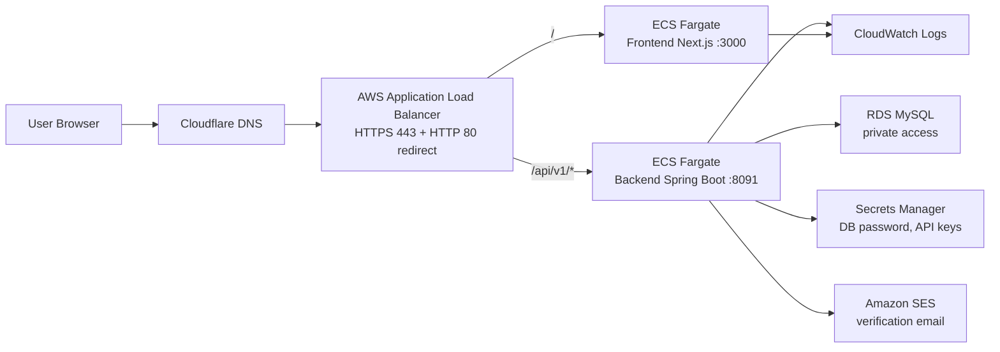

# FreeDraw AI AWS 部署复盘文档

本文是一次从零把 FreeDraw AI 部署到 AWS 的完整复盘。目标不是只记录按钮怎么点，而是把每一步背后的概念、取舍、安全原因和面试表达都讲清楚。

当前部署结果：

- 域名: `https://freedrawai.com`
- 区域: `ap-southeast-2`，Asia Pacific (Sydney)
- 前端: Next.js container on ECS Fargate
- 后端: Spring Boot container on ECS Fargate
- 数据库: Amazon RDS MySQL
- 入口: Application Load Balancer + ACM HTTPS certificate
- 邮件: Amazon SES, domain identity `freedrawai.com`
- 密钥: AWS Secrets Manager
- 日志: CloudWatch Logs
- DNS: Cloudflare

> 安全提醒：本文不会写真实密码、API key、邮箱验证码、模型密钥、数据库密码。资源 ARN、account id、邮箱地址等虽然通常不等于密钥，但如果仓库会公开，也建议用占位符替代。

## 1. 一句话架构

用户访问 `freedrawai.com`，Cloudflare 负责 DNS 解析到 AWS Application Load Balancer。ALB 负责 HTTPS 入口和路径路由：普通页面流量转给前端 ECS service，`/api/v1/*` 转给后端 ECS service。后端在私有网络里访问 RDS MySQL，运行时从 Secrets Manager 读取敏感配置，并用 IAM task role 调 SES 发送注册验证邮件。



## 2. 核心服务详解：是什么，为什么用，怎么用

这一节按面试复习的方式写。你需要能回答三个层次的问题：

- 它是什么：这个服务解决哪类问题。
- 为什么用它：不用它会怎样，用它带来什么收益。
- 在本项目怎么用：它在 FreeDraw AI 的链路中放在哪里。

### ECS Fargate

**是什么**

ECS 是 AWS 的容器编排服务。你可以把应用打成 Docker image，然后告诉 ECS：用哪个镜像、开哪个端口、需要多少 CPU/memory、要跑几个副本、日志送到哪里。ECS 会帮你调度和维持这些容器。

Fargate 是 ECS 的一种运行方式。普通 ECS on EC2 需要你自己创建 EC2 机器、维护 Docker host、升级系统、扩缩容机器；Fargate 则让你只关心 container，不直接管理服务器。

可以把它理解成：

- Docker image: 应用打包产物。
- ECS task definition: 运行容器的说明书。
- ECS task: 按 task definition 真正跑起来的一个容器实例。
- ECS service: 保证长期有指定数量 task 在运行。
- Fargate: AWS 托管底层机器，你不用登录服务器。

**为什么用**

这个项目适合 ECS Fargate，因为：

- 前端和后端都能 Docker 化。
- 个人项目初期不需要 Kubernetes 的复杂度。
- 不需要维护 EC2、Docker daemon、系统补丁。
- ECS service 可以做滚动更新。
- task definition revision 天然支持回滚。
- 可以和 ALB target group、CloudWatch Logs、Secrets Manager、IAM role 集成。

不用 ECS/Fargate 的替代方案：

| 方案 | 优点 | 缺点 |
| --- | --- | --- |
| EC2 手动部署 | 概念直观，成本可能低 | 要自己管服务器、Nginx、Docker、系统补丁、重启恢复 |
| Elastic Beanstalk | 上手快 | 底层抽象较多，精细控制弱一些 |
| Lambda | serverless，按调用计费 | Spring Boot 较重，长连接/streaming/冷启动更复杂 |
| EKS/Kubernetes | 强大、生态完整 | 对个人项目过重，学习和运维成本高 |

**本项目怎么用**

本项目创建了一个 ECS cluster：`ai-drawio-cluster`。里面有两个 service：

- frontend service: 跑 Next.js 容器，container port `3000`。
- backend service: 跑 Spring Boot 容器，container port `8091`。

两个 service 都使用 Fargate。ALB 把浏览器请求转发到对应 service。service 会自动把新 task 注册到 ALB target group，也会在 task 不健康时替换它。

**重要概念**

Task definition 不是正在运行的容器，而是“模板”。每次你改镜像 tag、环境变量、secret、CPU/memory，都会注册一个新的 revision，例如：

```text
ai-drawio-backend-prod:3
ai-drawio-backend-prod:4
```

Service 指向某个 revision。发布新版本时，就是让 service 从旧 revision 滚动更新到新 revision。

**安全点**

- Backend task 不应该暴露公网，只允许 ALB security group 访问。
- ECS task role 只给应用运行时需要的权限。
- ECS execution role 只给拉镜像、读 secret、写日志的权限。
- Secret 不写进 image，而是由 ECS 注入。

**面试怎么说**

> I deployed the frontend and backend as Docker containers on ECS Fargate. ECS service maintains the desired number of tasks and integrates with ALB target groups for health checks and rolling deployments. I chose Fargate because it removes the need to manage EC2 instances while still giving me container-level control.

### ECR

**是什么**

ECR 是 AWS 托管的容器镜像仓库。它类似 Docker Hub，但在 AWS 账号内部，和 IAM/ECS 集成更自然。

应用部署到 ECS 前，需要先有 Docker image。ECR 就是保存这些 image 的地方。

**为什么用**

ECS 运行容器时，需要从某个 registry 拉镜像。用 ECR 的好处是：

- 私有仓库默认安全。
- ECS execution role 可以被授权拉取镜像。
- 支持 image scanning，推送时扫描漏洞。
- 支持 lifecycle policy，清理旧镜像节省成本。
- 和 AWS 区域、账号权限模型一致。

**本项目怎么用**

本项目创建了两个 ECR repository：

- `ai-drawio-backend`
- `ai-drawio-frontend`

发布流程是：

```text
本地代码 -> docker build -> image tag -> docker push ECR -> ECS task definition 引用这个 image
```

示例 image URI 形态：

```text
<account-id>.dkr.ecr.ap-southeast-2.amazonaws.com/ai-drawio-backend:<image-tag>
```

**为什么不要只用 latest**

`latest` 不能清楚表达版本。出了问题时，你很难知道线上到底跑的是哪次构建。

更推荐：

```text
<git-short-sha>-<timestamp>
```

这样可以从 task definition 反推代码版本。

**安全点**

- repository 不公开。
- ECS execution role 只允许拉需要的 repo。
- 开启 scan on push。
- 配置 lifecycle policy 清理旧 tag。

**面试怎么说**

> I used ECR as the private container registry. The CI or local build process pushes versioned images to ECR, and ECS task definitions reference immutable image tags so deployments and rollbacks are traceable.

### ALB

**是什么**

ALB 是 Application Load Balancer，工作在 HTTP/HTTPS 层，也就是常说的七层负载均衡。它是用户进入系统的统一入口。

ALB 由几个核心部分组成：

- Load balancer: 对外入口。
- Listener: 监听端口，例如 HTTP 80、HTTPS 443。
- Rule: 根据 path/host/header 等条件选择转发动作。
- Target group: 后端目标集合，例如 frontend tasks 或 backend tasks。
- Health check: 判断 target 是否健康。

**为什么用**

没有 ALB 时，你可能要让前端和后端各自暴露公网端口，或者自己维护 Nginx/反向代理。ALB 的价值是：

- 提供统一公网入口。
- 集中处理 HTTPS。
- 支持 path-based routing。
- 和 ECS service 自动集成 target 注册/注销。
- 做 health check，只把流量发给健康 task。
- 后续可以接 WAF、access logs、metrics。

**本项目怎么用**

本项目 ALB 做了三件事：

1. HTTP 80 redirect 到 HTTPS 443。
2. HTTPS 443 绑定 ACM certificate。
3. Listener rule 路由：
   - `/api/v1/*` -> backend target group -> backend ECS task `8091`
   - `/*` -> frontend target group -> frontend ECS task `3000`

这样浏览器只访问一个域名：

```text
https://freedrawai.com
```

前端调用 API 可以走同域路径：

```text
https://freedrawai.com/api/v1/...
```

**为什么 ALB 到容器用 HTTP**

外部用户到 ALB 是 HTTPS。TLS 在 ALB 终止，ALB 解密后把请求用 HTTP 转发给 VPC 内部的容器。

这样做的好处：

- 证书只在 ACM/ALB 管。
- 容器不用配置证书和私钥。
- health check 更简单。
- 内部流量在 VPC 里，安全边界由 SG 控制。

如果合规要求内部也加密，可以改成 ALB 到 target 也用 HTTPS，但复杂度会上升。

**为什么 target type 选 IP**

Fargate task 没有固定 EC2 instance ID。每个 task 启动时会有自己的 ENI 和 private IP。所以 target group 应该选：

```text
Target type: IP addresses
```

不是：

```text
Target type: Instances
```

**安全点**

- ALB SG 开 `80/443` 给公网。
- Frontend/Backend SG 只允许 ALB SG 访问。
- HTTP listener 只做 redirect。
- HTTPS listener 使用 ACM certificate。
- 后续可接 AWS WAF。

**面试怎么说**

> I used an Application Load Balancer as the single public entry point. It terminates TLS with an ACM certificate and uses path-based routing: API paths go to the backend target group, and all other paths go to the frontend target group. Since the services run on Fargate, the target groups use IP targets.

### RDS MySQL

**是什么**

RDS 是 AWS 的托管关系型数据库服务。MySQL、PostgreSQL、MariaDB 等都可以跑在 RDS 上。

托管的意思是：AWS 帮你处理很多数据库运维工作，例如：

- 数据库实例创建。
- 存储扩容选项。
- 自动备份。
- 小版本补丁。
- 监控指标。
- Multi-AZ 高可用。
- 故障检测和恢复。

你仍然负责：

- schema 设计。
- SQL 性能。
- 索引。
- 连接池。
- 应用层数据访问。
- 账号权限。

**为什么用**

本项目选择 RDS MySQL，因为：

- 项目已经使用 MySQL schema。
- 后端使用 MyBatis，和 MySQL 兼容。
- 不想自己在 EC2 上维护 MySQL。
- 需要自动备份和基础监控。
- 数据库不应该和应用容器生命周期绑定。

不用 RDS，自己在容器里跑 MySQL 的问题：

- 容器重建时数据持久化复杂。
- 备份、恢复、升级都要自己做。
- 容器服务和数据库生命周期耦合。
- 生产风险高。

**本项目怎么用**

RDS 创建了一个 MySQL DB instance：

- Endpoint 被后端通过 JDBC URL 使用。
- Port 是 `3306`。
- Public access 关闭。
- RDS SG 只允许 backend SG 访问。
- 数据库名使用 `ai_draw_io`。
- 应用用户使用最小权限账号，例如 `ai_drawio_app`。

后端连接配置形态：

```text
SPRING_DATASOURCE_URL=jdbc:mysql://<rds-endpoint>:3306/ai_draw_io?...&sslMode=REQUIRED
SPRING_DATASOURCE_USERNAME=ai_drawio_app
SPRING_DATASOURCE_PASSWORD=<from Secrets Manager>
```

**Single-AZ vs Multi-AZ**

Single-AZ：

- 成本低。
- 适合学习、开发、演示、小项目早期。
- AZ 故障时可用性差。

Multi-AZ：

- 成本更高。
- 有 standby，提高可用性。
- 适合正式生产。

**安全点**

- Public access: No。
- 开启 storage encryption。
- 开启 automated backup。
- 应用用户最小权限。
- RDS inbound 只允许 backend SG。
- 生产建议 deletion protection。

**面试怎么说**

> I used RDS MySQL as a managed relational database. It is placed behind security groups and is not publicly accessible. Only the backend ECS task security group can connect to port 3306. Secrets Manager stores the database password, and the application uses a least-privileged DB user instead of the master account.

### Secrets Manager

**是什么**

Secrets Manager 是 AWS 用来保存和管理敏感信息的服务，例如：

- 数据库密码。
- API key。
- OAuth token。
- 加密 key。
- 第三方服务凭据。

它解决的问题是：不要把 secret 写在代码、配置文件、Docker image、GitHub Actions log 或 task definition 明文里。

**为什么用**

如果不用 Secrets Manager，常见错误是：

- 把 `.env` 提交进 Git。
- 把 API key 写进 Dockerfile。
- 把数据库密码写进 ECS environment 明文。
- 多个人共享同一份明文密钥。

Secrets Manager 的好处：

- IAM 控制谁能读。
- 可以审计访问。
- 可以配合 rotation。
- ECS 支持直接把 secret 注入容器环境变量。
- 密钥不进入 image。

**本项目怎么用**

本项目创建了 app secret，例如：

```text
ai-drawio/prod
```

里面保存：

- `MYSQL_PASSWORD`
- `LLM_API_KEY`
- `MODEL_CREDENTIAL_ENCRYPTION_KEY`
- `BAIDU_SEARCH_API_KEY`
- `SKILL_ADMIN_TOKEN`

ECS task definition 中的 secrets 部分类似：

```json
{
  "name": "MYSQL_PASSWORD",
  "valueFrom": "<secret-arn>:MYSQL_PASSWORD::"
}
```

容器启动时，ECS execution role 读取 Secrets Manager，把值注入为环境变量。应用代码只读取环境变量，不需要知道 secret 存在哪里。

**特别重要：MODEL_CREDENTIAL_ENCRYPTION_KEY**

这个 key 用来加密数据库里的用户模型凭据。它不是普通配置，不能随便换。

如果更换：

- 新数据会用新 key 加密。
- 老数据可能无法解密。
- 用户保存过的模型凭据可能失效。

所以它必须稳定保存、备份、谨慎轮换。

**安全点**

- secret ARN 可以出现在配置里，但 secret value 不可以。
- execution role 只允许读指定 secret。
- 不要在日志打印 secret。
- 不要把 secret 下载到本地文件长期保存。
- 后续可以设计 rotation 流程。

**面试怎么说**

> I used AWS Secrets Manager to keep runtime secrets out of the source code and Docker images. ECS injects selected secret keys into the container as environment variables, and IAM restricts access to only the task execution role that needs them.

### SES

**是什么**

SES 是 Amazon Simple Email Service，用来发送邮件。它适合发：

- 注册验证邮件。
- 密码重置邮件。
- 订单通知。
- 系统通知。
- 营销邮件，前提是有合规退订和投诉处理。

本项目只用 SES 发 transactional emails，也就是用户动作触发的邮件。

**为什么用**

注册系统需要验证邮箱。最开始项目只有 `ConsoleEmailSender`，它会把验证链接打到日志。这适合本地开发，但不适合生产。

生产需要：

- 真正投递邮件。
- 不把 token 写进日志。
- 支持 DKIM，提高可信度。
- 可监控 bounce/complaint。
- 使用 IAM role，不保存 SMTP 密码。

**本项目怎么用**

SES 配置了 domain identity：

```text
freedrawai.com
```

Cloudflare 添加了 SES 给出的 DKIM CNAME records。SES identity 变成 `SUCCESS` 后，可以使用：

```text
no-reply@freedrawai.com
```

作为发件地址。

代码上：

- `IEmailSender`: 邮件接口。
- `ConsoleEmailSender`: 本地默认实现。
- `SesEmailSender`: 生产实现。
- `ACCOUNT_EMAIL_SENDER=ses`: 启用 SES。
- `ACCOUNT_EMAIL_FROM=no-reply@freedrawai.com`: 发件人。

**SES sandbox 是什么**

新 SES 账号默认在 sandbox。sandbox 下限制：

- 只能发给已验证的收件地址或域名。
- 每 24 小时最多 200 封。
- 每秒最多 1 封。

这就是为什么测试时要先验证 Gmail 收件地址。Production access 通过后，才能发给普通真实用户。

**本次踩坑**

我们一开始只给 task role 授权：

```text
ses:SendEmail on identity/freedrawai.com
```

但 sandbox 下发给已验证收件人时，SES 报错说 task role 没有权限访问 recipient identity。于是临时把测试收件 identity 也加入 policy。

Production access 通过后，建议把测试邮箱 identity 从 policy 中移除，只保留发件域名。

**安全点**

- 用 task role 调 SES，不用 SMTP password。
- policy 只给 `ses:SendEmail`。
- 发件 identity 限制到 `freedrawai.com`。
- 生产不记录验证 token。
- 监控 bounce 和 complaint。

**面试怎么说**

> I replaced the local console email sender with an SES adapter for production. The backend calls SES through its ECS task role, so no SMTP credentials are stored. The sending domain is verified with DKIM, and while the account is in the SES sandbox, only verified recipients can receive emails.

### CloudWatch Logs

**是什么**

CloudWatch Logs 是 AWS 的日志服务。ECS 容器把 stdout/stderr 发到 CloudWatch log group，你可以在 AWS console 或 CLI 中查询。

它解决的问题是：容器运行在 Fargate 上，你不能像登录 EC2 那样直接 SSH 进去看本地日志。日志必须集中收集。

**为什么用**

没有集中日志时，线上问题很难查：

- task 重启后本地日志丢失。
- 多个容器日志分散。
- 不能按时间和关键字搜索。
- 不能设置告警。

CloudWatch Logs 可以：

- 查后端异常堆栈。
- 查注册失败、SES AccessDenied。
- 查 ECS 启动日志。
- 配置 metric filter 和 alarm。
- 设置 log retention 控制成本。

**本项目怎么用**

两个 log group：

- `/ecs/ai-drawio/backend`
- `/ecs/ai-drawio/frontend`

ECS task definition 使用 `awslogs` driver，把容器日志送进去。

排错时常用：

```bash
aws logs filter-log-events \
  --region ap-southeast-2 \
  --log-group-name /ecs/ai-drawio/backend \
  --filter-pattern '"register failed" "AccessDenied" "MessageRejected"'
```

**本次真实排错**

注册邮件没收到时，不是盲猜，而是：

1. SES direct test email 能收到，说明 SES 到 Gmail 通道正常。
2. 应用注册接口返回 `register failed`。
3. 查 CloudWatch backend logs。
4. 日志显示 `ses:SendEmail AccessDenied`。
5. 修 IAM policy。
6. 再测试注册邮件，成功收到。

**安全点**

- 不要在日志里打印 secret。
- 不要打印验证码 token。
- 设置 log retention，避免无限保存。
- 限制谁可以读 CloudWatch logs。

**面试怎么说**

> Since the containers run on Fargate, I used CloudWatch Logs as the centralized logging system. It helped me debug production issues, including an SES IAM permission error during email verification testing.

### Cloudflare

**是什么**

Cloudflare 在本项目中主要承担两个角色：

- 域名注册商/管理平台。
- DNS authoritative provider。

也就是说，用户访问 `freedrawai.com` 时，DNS 解析由 Cloudflare 管理。

Cloudflare 也可以提供 CDN、DDoS protection、WAF、proxy、TLS 等功能，但本项目初期主要用它做 DNS。

**为什么用**

我们在 Cloudflare 买了域名 `freedrawai.com`，所以 DNS records 也在那里管理。它需要配合 AWS 做几类记录：

- 把根域名和 `www` 指向 ALB。
- 添加 ACM DNS validation CNAME。
- 添加 SES DKIM CNAME。

没有这些 DNS 记录：

- 用户不知道 `freedrawai.com` 应该访问哪个 ALB。
- ACM 证书无法验证域名所有权。
- SES DKIM 无法通过，邮件可信度下降。

**本项目怎么用**

主要记录：

- `freedrawai.com` -> ALB DNS name
- `www.freedrawai.com` -> ALB DNS name
- `_xxx.freedrawai.com` -> ACM validation target
- `xxx._domainkey.freedrawai.com` -> SES DKIM target

Cloudflare 里有 Proxy status：

- DNS only: 只做 DNS 解析，浏览器直接访问 AWS ALB。
- Proxied: 流量先经过 Cloudflare，再到 AWS ALB。

本项目初期建议 DNS only，因为：

- 排错简单。
- ACM/ALB HTTPS 链路清楚。
- 避免 Cloudflare TLS mode 配错。

**Cloudflare 和 AWS 的边界**

Cloudflare 不是 AWS 服务。它在 AWS 外部。

请求链路是：

```text
Browser -> Cloudflare DNS -> AWS ALB -> ECS services
```

如果开启 Cloudflare proxy，请求链路会变成：

```text
Browser -> Cloudflare edge -> AWS ALB -> ECS services
```

这时要额外考虑：

- Cloudflare SSL/TLS mode。
- ALB 是否仍然要求 HTTPS。
- 真实客户端 IP 怎么传给后端。
- 缓存规则是否影响 API。
- WAF 规则在 Cloudflare 还是 AWS WAF。

**安全点**

- DNS validation CNAME 不包含 secret value，但仍要保持记录正确。
- 不要把 RDS endpoint 暴露成公网 DNS。
- API 不建议被 Cloudflare 静态缓存。
- 如果开 proxy，SSL/TLS mode 建议 Full strict。

**面试怎么说**

> Cloudflare manages the domain and DNS records. The application traffic is resolved to the AWS ALB, while DNS validation records are used for ACM certificates and SES DKIM. I initially kept the ALB records as DNS-only to make TLS and routing easier to debug.

## 3. 资源清单

| 类别 | 本次使用 | 作用 |
| --- | --- | --- |
| Region | `ap-southeast-2` | 所有 AWS 资源尽量在同一区域，降低延迟和配置复杂度 |
| ECR | `ai-drawio-backend`, `ai-drawio-frontend` | 存 Docker 镜像 |
| ECS Cluster | `ai-drawio-cluster` | 容器服务运行环境 |
| ECS Services | backend service, frontend service | 长期运行前后端任务 |
| RDS | MySQL | 业务数据 |
| ALB | `ai-drawio-alb` | 统一公网入口和路径转发 |
| ACM | certificate for `freedrawai.com` | HTTPS 证书 |
| Secrets Manager | `ai-drawio/prod` | 敏感配置 |
| SES | identity `freedrawai.com` | 注册验证和密码重置邮件 |
| CloudWatch Logs | `/ecs/ai-drawio/backend`, `/ecs/ai-drawio/frontend` | 容器日志 |
| Cloudflare | DNS records | 域名解析和 DNS 验证记录 |

## 4. 从零部署流程

### Step 0. AWS 账号基础安全

先做这些，再创建业务资源：

1. 创建 AWS account。
2. Root user 开启 MFA。
3. 不要日常使用 root user。
4. 创建管理员用户或 IAM Identity Center 用户。
5. 创建 Budget，设置月度预算提醒。
6. 选择固定 Region：本项目使用 `ap-southeast-2`。

为什么：

- Root 账号权限最大，只用于账单和账号级操作。
- Budget 防止不熟悉云资源时产生意外账单。
- 固定 Region 可以避免资源分散，减少“为什么找不到资源”的困惑。

### Step 1. 创建 ECR 仓库

创建两个仓库：

- `ai-drawio-backend`
- `ai-drawio-frontend`

推荐：

- 开启 scan on push。
- 镜像 tag 不要只用 `latest`，用 commit hash + timestamp。

示例：

```bash
export AWS_REGION=ap-southeast-2
export AWS_ACCOUNT_ID=<your-account-id>

aws ecr create-repository \
  --repository-name ai-drawio-backend \
  --image-scanning-configuration scanOnPush=true \
  --region "$AWS_REGION"

aws ecr create-repository \
  --repository-name ai-drawio-frontend \
  --image-scanning-configuration scanOnPush=true \
  --region "$AWS_REGION"
```

登录 ECR：

```bash
aws ecr get-login-password --region "$AWS_REGION" \
  | docker login --username AWS --password-stdin \
  "$AWS_ACCOUNT_ID.dkr.ecr.$AWS_REGION.amazonaws.com"
```

### Step 2. 构建并推送镜像

后端：

```bash
cd ai-agent-draw-io
export IMAGE_TAG=$(git rev-parse --short HEAD)-$(date -u +%Y%m%d-%H%M%S)

docker build --platform linux/amd64 \
  -t "$AWS_ACCOUNT_ID.dkr.ecr.$AWS_REGION.amazonaws.com/ai-drawio-backend:$IMAGE_TAG" \
  .

docker push "$AWS_ACCOUNT_ID.dkr.ecr.$AWS_REGION.amazonaws.com/ai-drawio-backend:$IMAGE_TAG"
```

前端类似，只是仓库名换成 `ai-drawio-frontend`。

为什么要 Docker：

- 本地、CI、ECS 运行同一个 artifact。
- 应用依赖被打包进镜像，部署环境更稳定。
- ECS 不直接运行源码，而是运行镜像。

### Step 3. 创建 RDS MySQL

建议配置：

- Engine: MySQL 8.x
- Template:
  - 个人项目/学习: Dev/Test 或 Sandbox
  - 正式生产: Production
- Availability:
  - 学习/低成本: Single-AZ
  - 正式生产: Multi-AZ
- Public access: No
- Storage encryption: Enable
- Automated backup: Enable
- Backup retention: 7 days 起步
- Deletion protection:
  - 学习期可不开，方便清理
  - 生产建议开启
- Master credentials:
  - 可以由 RDS/Secrets Manager 管理

关键安全点：

- RDS 不开放公网。
- RDS security group 只允许 backend ECS security group 访问 `3306`。
- 不要让 ALB、frontend、个人 IP 直接访问生产 RDS。

数据库初始化：

1. 创建数据库，例如 `ai_draw_io`。
2. 导入项目 SQL schema。
3. 创建运行时应用用户，例如 `ai_drawio_app`。
4. 给应用用户最小权限：`SELECT, INSERT, UPDATE, DELETE`。

不要让运行时应用用户长期持有 DBA 权限。

#### 数据库变更发布和用户数据保护

上线后不要用“删除数据库再重建”的方式发布 schema 变更。生产数据库里有真实用户数据，部署时应该只做**向前迁移**，也就是在现有数据库上执行可控的 migration。

本项目现在已经有手写 SQL migration，例如：

- `docs/sql/migrations/2026-07-02-create-model-credential.sql`
- `docs/sql/migrations/2026-07-03-create-usage-counter.sql`
- `docs/sql/migrations/2026-07-03-debug-trace-retention.sql`
- `docs/sql/migrations/2026-07-03-expand-diagram-thumbnail-url.sql`

这说明当前项目已经具备“用 SQL 文件演进数据库”的雏形。后面更成熟的方式是引入 Flyway 或 Liquibase，让应用/部署流程自动记录哪些 migration 已经执行过，避免重复执行或漏执行。

一次安全的数据库变更发布流程：

1. 在本地或 staging 数据库验证 migration。
2. 在生产 RDS 创建 snapshot，确认自动备份开启。
3. 确认 migration 只修改 schema，不会误删用户数据。
4. 先执行兼容旧代码和新代码的 migration。
5. 再发布新版本 ECS backend。
6. 做 smoke test，例如注册、登录、读取 diagram、发送验证邮件。
7. 观察 CloudWatch logs、RDS metrics、ALB target health。

推荐使用“expand and contract”策略：

1. **Expand**：先加新表、新列、新索引，保留旧字段。
2. **Deploy**：发布能同时兼容新旧结构的代码。
3. **Backfill**：如果需要，把旧数据补到新结构里。
4. **Switch**：代码开始使用新结构。
5. **Contract**：确认稳定后，再删除旧列/旧表。

不要在同一次发布里同时做这些高风险动作：

- 删除表。
- 删除列。
- 重命名列。
- 修改字段类型导致旧数据无法转换。
- 清空数据。
- 更换 `MODEL_CREDENTIAL_ENCRYPTION_KEY`。
- 直接把生产 RDS 删除后重新初始化。

更安全的例子：

```sql
-- 安全：新增 nullable 字段，旧代码通常不受影响。
ALTER TABLE user_account ADD COLUMN last_login_at DATETIME NULL;

-- 更谨慎：先加新字段，不马上删除旧字段。
ALTER TABLE diagram ADD COLUMN thumbnail_url_v2 VARCHAR(1024) NULL;
```

高风险例子：

```sql
-- 危险：直接删列可能导致旧代码报错，也会丢数据。
ALTER TABLE diagram DROP COLUMN thumbnail_url;

-- 危险：没有 WHERE 的 DELETE 会清空业务数据。
DELETE FROM diagram;
```

如果数据库变更失败：

- 不要立刻删除数据库。
- 先停止继续发布。
- 查看 migration 执行到哪一步。
- 如果还没有破坏数据，修正 SQL 后继续。
- 如果已经破坏数据，从 RDS snapshot 或 point-in-time restore 恢复到新 DB instance，再切换连接。

面试里可以这样说：

> I would never recreate the production database during deployment. Database schema changes should be handled through versioned migrations. Before applying a migration, I would test it in staging and take an RDS snapshot or rely on point-in-time recovery. I prefer backward-compatible migrations using an expand-and-contract approach, so the old and new application versions can both work during deployment. Destructive changes such as dropping columns are delayed until the new version is stable and data has been verified.

### Step 4. 创建 Secrets Manager secret

创建 `ai-drawio/prod`，内容类似：

```json
{
  "MYSQL_PASSWORD": "replace-with-real-value",
  "LLM_API_KEY": "replace-with-real-value",
  "MODEL_CREDENTIAL_ENCRYPTION_KEY": "base64:replace-with-real-value",
  "BAIDU_SEARCH_API_KEY": "",
  "SKILL_ADMIN_TOKEN": ""
}
```

`MODEL_CREDENTIAL_ENCRYPTION_KEY` 很重要：

- 它用于加密用户模型凭据。
- 不能每次部署都变。
- 丢失或更换后，数据库中已经加密的数据可能无法解密。

### Step 5. 创建 ECS cluster

创建 `ai-drawio-cluster`。

Capacity 选择：

- `Fargate only`

为什么：

- 不需要 EC2。
- AWS 管理底层运行环境。
- 对第一次部署更简单。

如果遇到 ECS service-linked role 错误：

```bash
aws iam create-service-linked-role --aws-service-name ecs.amazonaws.com
```

如果提示 role 已存在，说明不是创建问题，可能是 IAM propagation 或 console 状态延迟，稍等或重新创建 cluster 即可。

### Step 6. 设计 Security Groups

建议至少四个 security group：

| Security Group | Inbound |
| --- | --- |
| ALB SG | `80/443` from `0.0.0.0/0` |
| Frontend SG | `3000` from ALB SG |
| Backend SG | `8091` from ALB SG |
| RDS SG | `3306` from Backend SG |

这里最容易出错的是 Source 类型：

- 如果 Source 是 IP，就填 CIDR，例如 `125.63.8.5/32`。
- 如果 Source 是另一个 security group，就选择 `Security group` 类型，然后选 `sg-...`。
- 不要把 `sg-...` 填到 CIDR 输入框，否则会出现类似 “referenced group id for existing IPv4 CIDR rule” 的错误。

为什么用 SG 引用而不是 IP：

- Fargate task IP 会变化。
- SG 引用表达的是“允许这个服务访问”，不是“允许某个固定 IP 访问”。
- 更适合动态容器环境。

### Step 7. 创建 Target Groups

前端 target group：

- Target type: `IP addresses`
- Protocol: `HTTP`
- Port: `3000`
- Health check protocol: `HTTP`
- Health check path: `/` 或前端可稳定返回 200 的路径

后端 target group：

- Target type: `IP addresses`
- Protocol: `HTTP`
- Port: `8091`
- Health check path: `/api/v1/query_ai_agent_config_list`

为什么注册 targets 时不用手动填 IP：

- 创建 target group 时可以不注册 targets。
- ECS service 创建后会自动把 Fargate task 的 private IP 注册进去。
- 如果手动填 IP，task 重启后 IP 可能变，维护成本高。

### Step 8. 创建 ALB

ALB 配置：

- Scheme: Internet-facing
- IP address type: IPv4
- VPC: 和 ECS/RDS 同一个 VPC
- Subnets: 至少两个 public subnets，跨两个 AZ
- Security group: ALB SG

Listener：

1. HTTP `80`
   - 后续改为 redirect 到 HTTPS `443`
2. HTTPS `443`
   - 绑定 ACM certificate
   - Default action -> frontend target group
   - Rule: path `/api/v1/*` -> backend target group

为什么 ALB 要放 public subnets：

- 用户从互联网访问 ALB。
- ECS backend/RDS 不需要公网入口，放在更受限的网络边界里。

### Step 9. 申请 ACM 证书

在 AWS Certificate Manager 申请：

- `freedrawai.com`
- `www.freedrawai.com`

验证方式选择 DNS validation。

然后去 Cloudflare 添加 ACM 给出的 CNAME 记录。状态变为 `ISSUED` 后，把证书绑定到 ALB HTTPS listener。

为什么用 ACM：

- AWS 管理证书签发和续期。
- ALB 可以直接使用 ACM certificate。
- 应用容器内部不用处理 HTTPS 私钥。

### Step 10. 配置 Cloudflare DNS

添加：

- `freedrawai.com` -> CNAME 到 ALB DNS
- `www.freedrawai.com` -> CNAME 到 ALB DNS

初期建议 Proxy status 选 `DNS only`。

原因：

- 简化排错。
- 让浏览器直接连 AWS ALB。
- ACM/ALB 的 HTTPS 链路更清晰。

后续如果打开 Cloudflare proxy，要确认：

- SSL/TLS mode 使用 Full 或 Full (strict)。
- ALB 证书仍有效。
- 真实客户端 IP、WAF、缓存规则是否符合预期。

### Step 11. 创建 ECS task definitions

后端 task definition 关注：

- Image: ECR backend image
- Port mapping: `8091`
- CPU/memory: 初期可 `1 vCPU / 2GB`
- Task role: `ai-drawio-backend-task-role`
- Execution role: `ecsTaskExecutionRole`
- Secrets: 从 Secrets Manager 注入
- Logs: `/ecs/ai-drawio/backend`
- Env:
  - `SPRING_PROFILES_ACTIVE=prod`
  - `SPRING_DATASOURCE_URL=jdbc:mysql://...`
  - `SPRING_DATASOURCE_USERNAME=ai_drawio_app`
  - `APP_SECURITY_ALLOWED_ORIGINS=https://freedrawai.com,https://www.freedrawai.com`
  - `ACCOUNT_VERIFICATION_BASE_URL=https://freedrawai.com/verify-email`
  - `ACCOUNT_PASSWORD_RESET_BASE_URL=https://freedrawai.com/reset-password/confirm`
  - `ACCOUNT_EMAIL_SENDER=ses`
  - `ACCOUNT_EMAIL_FROM=no-reply@freedrawai.com`
  - `ACCOUNT_EMAIL_REGION=ap-southeast-2`

前端 task definition 关注：

- Image: ECR frontend image
- Port mapping: `3000`
- Logs: `/ecs/ai-drawio/frontend`
- API base URL 指向同域路径，例如 `/api/v1`

Task role vs execution role：

- Execution role: ECS agent 用它拉 ECR 镜像、读 Secrets、写 CloudWatch logs。
- Task role: 应用代码运行时用它访问 AWS 服务，例如 SES。

面试表达：

> I separated the ECS execution role and task role. The execution role is used by ECS to pull images and inject secrets, while the task role is assumed by the application container to call SES at runtime.

### Step 12. 创建 ECS services

创建 backend service：

- Cluster: `ai-drawio-cluster`
- Launch type: Fargate
- Desired tasks: `1`
- Subnets: same VPC subnets
- Security group: Backend SG
- Public IP:
  - 如果 subnet 有 NAT: Disabled
  - 如果没有 NAT 且需要拉镜像/访问公网 API: 需要解决出网，例如 NAT Gateway 或 VPC endpoints
- Load balancer:
  - Target group: backend target group
  - Container port: `8091`

创建 frontend service：

- 类似 backend
- Target group: frontend target group
- Container port: `3000`

为什么 desired count 初期是 1：

- 个人项目控制成本。
- 验证部署链路。
- 后续可扩为 2，提高可用性。

### Step 13. HTTP -> HTTPS redirect

ALB HTTP listener `80` 配置 redirect：

- Protocol: HTTPS
- Port: `443`
- Status code: `HTTP_301`

为什么：

- 用户输入 `http://freedrawai.com` 也会跳到 HTTPS。
- Cookie secure、浏览器安全策略、登录态都更可靠。

### Step 14. SES 邮件配置

1. 在 SES 创建 domain identity: `freedrawai.com`。
2. 把 SES 给出的 DKIM CNAME records 添加到 Cloudflare。
3. 等 SES identity 变成 `SUCCESS`。
4. 在代码中实现 SES email sender。
5. ECS backend task role 添加 `ses:SendEmail` 权限。
6. ECS backend 环境变量启用 SES。

代码设计：

- `IEmailSender` 是接口。
- `ConsoleEmailSender` 用于本地开发。
- `SesEmailSender` 用于生产。
- `account.email.sender` 控制使用哪个实现。

为什么不用 SMTP 密码：

- SMTP credential 是长期密钥，需要保存和轮换。
- ECS task role 是临时凭证，由 AWS 自动注入和轮换。
- IAM 可以精确限制权限范围。

SES sandbox 排错：

- sandbox 下只能发给已验证收件人。
- 如果 IAM policy 只允许发件域名，sandbox 中可能还会因为收件 identity 未授权而失败。
- 本次错误是：

```text
not authorized to perform ses:SendEmail on resource identity/<verified-recipient>
```

解决：

- 临时把已验证的测试邮箱 identity 加进 IAM policy。
- 申请 Production access 后，再把 policy 收回到发件域名即可。

申请 Production access 用例：

```text
FreeDraw AI sends transactional emails only, including account email verification
and password reset emails triggered by user actions on https://freedrawai.com.

We do not send marketing emails, newsletters, purchased-list emails, or unsolicited
messages. Recipients are users who explicitly register or request account recovery.

The sending domain freedrawai.com is verified in Amazon SES with DKIM. We will
monitor bounces and complaints through SES, respect suppression lists, and stop
sending to addresses that bounce or complain.

Initial expected volume is low, under 100 emails per day.
```

### Step 15. 验证线上服务

检查域名：

```bash
curl -I https://freedrawai.com
curl -I https://www.freedrawai.com
curl -I http://freedrawai.com
```

期望：

- HTTPS 返回 200。
- HTTP 返回 301/302 redirect 到 HTTPS。

检查 API：

```bash
curl -sS https://freedrawai.com/api/v1/query_ai_agent_config_list
```

期望：

```json
{
  "code": "0000",
  "info": "成功"
}
```

检查 ECS：

```bash
aws ecs describe-services \
  --region ap-southeast-2 \
  --cluster ai-drawio-cluster \
  --services ai-drawio-backend-service ai-drawio-frontend-service
```

检查日志：

```bash
aws logs filter-log-events \
  --region ap-southeast-2 \
  --log-group-name /ecs/ai-drawio/backend \
  --filter-pattern '"register failed" "AccessDenied" "MessageRejected"'
```

### Step 16. 发布更新

发布流程：

1. 改代码。
2. 本地 build/test。
3. Docker build。
4. Push image to ECR。
5. 注册新的 ECS task definition revision。
6. Update ECS service。
7. 等待 service stable。
8. 测试线上 API。

回滚流程：

1. 找到上一个 task definition revision。
2. Update service 指回旧 revision。
3. 等待 stable。
4. 查看 ALB target health 和 CloudWatch logs。

关键概念：

- Task definition revision 是部署版本。
- Service 保持 desired count。
- ALB health check 决定是否把流量发给新 task。

### Step 17. 本次代码改造点

这次不是只改 AWS console，也改了应用代码，让生产环境真正能发邮件。

关键文件：

| 文件 | 作用 |
| --- | --- |
| `ai-agent-draw-io/ai-agent-draw-io-domain/src/main/java/org/zipp/ai/domain/account/adapter/port/IEmailSender.java` | 邮件发送接口，领域层只依赖接口 |
| `ai-agent-draw-io/ai-agent-draw-io-infrastructure/src/main/java/org/zipp/ai/infrastructure/adapter/port/ConsoleEmailSender.java` | 本地开发默认实现，把链接打日志 |
| `ai-agent-draw-io/ai-agent-draw-io-infrastructure/src/main/java/org/zipp/ai/infrastructure/adapter/port/SesEmailSender.java` | 生产 SES 实现 |
| `ai-agent-draw-io/ai-agent-draw-io-infrastructure/src/main/java/org/zipp/ai/infrastructure/config/SesEmailConfig.java` | 创建 `SesV2Client` |
| `ai-agent-draw-io/ai-agent-draw-io-app/src/main/resources/application.yml` | 增加 `account.email.*` 配置 |
| `ai-agent-draw-io/ai-agent-draw-io-infrastructure/pom.xml` | 增加 AWS SDK SESv2 依赖 |
| `ai-agent-draw-io/Dockerfile` | 生产镜像构建使用 `maven.test.skip=true`，避免旧测试编译问题阻塞镜像 |

为什么用接口：

- 领域服务只关心“发送验证邮件”，不关心 SES/SMTP/console。
- 本地开发可以继续用 console。
- 生产只通过配置切换到 SES。
- 后续如果换 SendGrid、Postmark、SMTP，只需要新增一个 adapter。

为什么不在日志里写验证码链接：

- 验证链接包含一次性 token。
- 如果 CloudWatch logs 权限过宽，看到日志的人就可能替用户完成验证或重置。
- 生产只记录必要错误，不记录 token 和敏感内容。

本地验证：

```bash
mvn -pl ai-agent-draw-io-infrastructure -am \
  -DskipTests=false \
  -Dtest=SesEmailSenderTest \
  -Dsurefire.failIfNoSpecifiedTests=false \
  test

mvn -pl ai-agent-draw-io-app -am -Dmaven.test.skip=true package
```

线上验证：

- ECS backend service 已运行新 task definition revision。
- API health check 返回 200。
- SES direct test email 能到达测试邮箱。
- 应用注册接口能触发 `Verify your FreeDraw AI email`。

### Step 18. 成本意识

AWS 上“创建成功”不等于“免费”。这个项目持续运行时主要成本来自：

- RDS: 只要 DB instance 运行就计费，通常是小项目里最稳定的一笔成本。
- ALB: 按运行时间和 LCU 计费。
- ECS Fargate: 按 vCPU/memory 使用时长计费。
- NAT Gateway: 如果使用，会是明显成本项；个人项目要特别注意。
- Secrets Manager: 按 secret 数量和 API 调用计费。
- CloudWatch Logs: 按日志写入和存储计费。
- SES: 低量 transactional email 成本通常很低，但仍要关注。
- ECR: 镜像存储计费，旧镜像要清理。

你在 RDS 创建页看到的月费估算，通常是按该 DB instance 连续运行一个月估算。停止或删除资源会影响成本，但生产数据库不能随意删除。

个人项目建议：

- Budget 必开。
- RDS 用小规格，Single-AZ 起步。
- Fargate desired count 先用 1。
- ECR lifecycle policy 清理旧镜像。
- CloudWatch log retention 设置 7/14/30 天，不要无限保存。
- 暂时不需要 NAT Gateway 时，优先用 public IP 或 VPC endpoints 方案权衡成本和安全；生产再收紧。

#### 不用时应该关掉什么

这里要分清三种状态：

- **短暂停用**：今晚不用、周末不用、几天不用，但之后还要继续部署。
- **长期停用**：一两周以上不用，希望明显降低账单。
- **完全清理**：这个环境不再需要了，可以删资源，但要保留必要备份。

| 资源 | 短暂停用怎么做 | 长期不用怎么做 | 注意事项 |
| --- | --- | --- | --- |
| ECS Fargate service | 把 frontend/backend service 的 desired count 改成 `0` | 可以保留 service，也可以删除 service | desired count 为 `0` 后容器不跑，Fargate compute 基本不再产生运行费用，但应用会不可访问。 |
| RDS MySQL | Stop temporarily | 先创建 snapshot，再删除 DB instance | RDS 最多只能连续 stop 7 天，之后 AWS 会自动启动；停止后仍会收 storage、backup/snapshot 等费用。 |
| Application Load Balancer | 如果只是短暂停用，可以先保留 | 长期不用建议删除 ALB、listener、target group | ALB 即使没有流量也会有运行时间费用；删掉后域名需要重新指向新的 ALB。 |
| NAT Gateway | 如果存在，且不用出网流量，删除 | 长期不用必须删除 | NAT Gateway 是个人项目里常见的“忘了关但很贵”的资源。你的当前方案如果没有创建 NAT Gateway，就不用处理。 |
| ECR | 不需要关 | 清理旧 image，设置 lifecycle policy | ECR 主要是镜像存储费，旧版本多了会慢慢累积。 |
| CloudWatch Logs | 设置 retention | 删除不需要的 log group | 不建议无限期保存开发日志。 |
| Secrets Manager | 短期保留 | 完全不用时再 schedule deletion | 不要随便删 app secret、RDS master secret、`MODEL_CREDENTIAL_ENCRYPTION_KEY`，否则恢复会很麻烦。 |
| SES | 不用关 | 不需要域名发信时再删除 identity | SES identity 本身通常不是主要成本，主要成本来自发信量。 |
| Route 53 / Cloudflare DNS | 保留 | 不用域名时删除 DNS 记录或停止续费域名 | 域名注册费通常是年费，买了以后不能靠“关机”省掉当年费用。 |
| ACM certificate | 保留 | 如果 ALB 和域名都不用了，可以删除 | 证书和域名绑定，删了之后恢复 HTTPS 要重新签发。 |
| Security Group / VPC / Subnet / IAM Role | 不用关 | 环境完全清理时再删 | 这些通常不是主要计费项，但删错会影响后续恢复。 |

短暂停用推荐顺序：

```bash
# 1. 停 frontend/backend ECS service
aws ecs update-service \
  --region ap-southeast-2 \
  --cluster ai-drawio-cluster \
  --service <frontend-service-name> \
  --desired-count 0

aws ecs update-service \
  --region ap-southeast-2 \
  --cluster ai-drawio-cluster \
  --service <backend-service-name> \
  --desired-count 0

# 2. 停 RDS。DB identifier 以 RDS console 里显示的为准。
aws rds stop-db-instance \
  --region ap-southeast-2 \
  --db-instance-identifier <db-identifier>
```

恢复推荐顺序：

```bash
# 1. 先启动 RDS，并等待状态变成 available
aws rds start-db-instance \
  --region ap-southeast-2 \
  --db-instance-identifier <db-identifier>

# 2. 再启动 ECS service
aws ecs update-service \
  --region ap-southeast-2 \
  --cluster ai-drawio-cluster \
  --service <backend-service-name> \
  --desired-count 1

aws ecs update-service \
  --region ap-southeast-2 \
  --cluster ai-drawio-cluster \
  --service <frontend-service-name> \
  --desired-count 1
```

对于你这个个人项目，最安全的省钱策略是：

1. 晚上/几天不用：ECS frontend/backend desired count 改成 `0`，RDS stop temporarily。
2. 一周以上不用：创建 RDS snapshot，然后考虑删除 RDS；删除 ALB；确认没有 NAT Gateway。
3. 完全不做这个项目了：先导出/备份数据，再删除 ECS service、ALB、target group、RDS、Secrets、ECR image、CloudWatch log group。

不要轻易删除这些：

- RDS DB instance，除非你已经有 snapshot 或确认数据不要了。
- RDS snapshot，除非你确认以后不需要恢复数据库。
- Secrets Manager 里的 app secret 和 RDS master secret。
- `MODEL_CREDENTIAL_ENCRYPTION_KEY`，因为它可能用于解密模型凭证。
- Cloudflare DNS 配置，除非你已经记录好 ALB DNS name 和所有记录。

### Step 19. 分支和发布流程建议

你之前问过公司里是不是 `main` 放生产、`dev` 做开发。一个常见做法是：

- `main`: 生产稳定分支，只放已经验证可发布的代码。
- `dev`: 集成分支，日常多个功能合并后统一测试。
- `feature/...`: 从 `dev` 或 `main` 拉出来做具体功能。
- `hotfix/...`: 从 `main` 拉出来修生产 bug，修完合回 `main` 和 `dev`。

个人项目可以简化：

- `main`: 保持可部署。
- `feature/xxx`: 每个功能独立分支。
- 合并到 `main` 后触发部署。

发布时不要靠“记得点 console”。更成熟的流程是：

1. Pull request review。
2. CI 跑测试和 Docker build。
3. Push image to ECR。
4. Register new ECS task definition。
5. Update ECS service。
6. Smoke test。
7. 如果失败，回滚到上一版 task definition。

## 5. 安全复盘

### 网络安全

做法：

- ALB 是唯一公网入口。
- RDS 不公开访问。
- Backend 只允许 ALB 访问 `8091`。
- RDS 只允许 Backend SG 访问 `3306`。
- 尽量不用个人 IP 直连生产数据库。

为什么：

- 降低暴露面。
- 即使前端被扫描，也不能直接扫到数据库。
- SG 引用比固定 IP 更适合 ECS/Fargate。

### 密钥安全

做法：

- Secrets Manager 存敏感值。
- ECS 通过 secrets 注入环境变量。
- 不把 API key 写入 Git、Dockerfile、task definition 明文。
- SES 使用 IAM role，不使用 SMTP 密码。

### HTTPS 和 Cookie

做法：

- ALB 绑定 ACM 证书。
- HTTP 80 redirect 到 HTTPS 443。
- 生产设置 secure cookie。
- CORS allowed origins 只允许 `freedrawai.com` 和 `www.freedrawai.com`。

### 邮件安全

做法：

- 注册验证 token 不再写入日志。
- SES domain identity 开启 DKIM。
- 申请 Production access 时说明只发 transactional emails。
- 监控 bounce/complaint。

### IAM 最小权限

做法：

- execution role 只用于拉镜像、读 secret、写日志。
- task role 只给应用需要的权限。
- SES policy 初期限制在 `freedrawai.com` 和测试邮箱 identity。
- 通过 Production access 后，建议移除测试邮箱 identity，只保留发件域名。

## 6. 常见问题与本次踩坑

### ECR login 出现空 region

现象：

```text
Invalid endpoint: https://api.ecr..amazonaws.com
```

原因：

- shell 同一行里定义变量又使用变量，展开时变量还是空。

解决：

```bash
aws ecr get-login-password --region ap-southeast-2 \
  | docker login --username AWS --password-stdin \
  <account-id>.dkr.ecr.ap-southeast-2.amazonaws.com
```

### ECS cluster 创建失败，service-linked role 问题

现象：

```text
Unable to assume the service linked role
```

原因：

- ECS service-linked role 不存在或 AWS console 状态未同步。

解决：

```bash
aws iam create-service-linked-role --aws-service-name ecs.amazonaws.com
```

如果提示已存在，稍等后重试。

### Target group 选了 Instances

Fargate 应该选 `IP addresses`。如果选 Instances，是给 EC2 instance target 用的。

### Health check 为什么 HTTP

用户到 ALB 是 HTTPS，ALB 到容器是 HTTP。TLS 已经在 ALB 终止，所以 target group health check 用 HTTP。

### 注册接口返回成功但没收到邮件

原因可能有两个：

1. 这个邮箱已经是已注册/已验证状态，应用为了防枚举会返回同样成功响应，但不再发验证邮件。
2. SES sandbox 或 IAM 权限问题。

排查：

- 直接用 SES 发送测试邮件。
- 查 CloudWatch backend logs。
- 查 SES identity 是否 verified。
- 查 suppression list。

### SES sandbox 下 AccessDenied

现象：

```text
not authorized to perform ses:SendEmail on resource identity/<recipient>
```

原因：

- sandbox 下发给 verified recipient 时，IAM resource 也可能需要覆盖收件 identity。

临时解决：

- IAM policy 加入测试收件 identity。

长期解决：

- 申请 Production access。
- 通过后恢复 policy，只限制发件 identity。

## 7. 面试可以怎么讲

### 版本 1: 30 秒

我把一个前后端分离项目部署到了 AWS。前端 Next.js 和后端 Spring Boot 都容器化后推到 ECR，通过 ECS Fargate 运行。外部入口使用 Application Load Balancer 和 ACM 提供 HTTPS，并用路径规则把 `/api/v1/*` 转发到后端，其余流量转发到前端。数据库使用私有 RDS MySQL，敏感配置放在 Secrets Manager。注册邮件通过 SES 发送，后端通过 ECS task role 调用 SES，不使用长期 SMTP 密码。日志统一进入 CloudWatch，网络访问通过 Security Groups 做最小开放。

### 版本 2: 2 分钟

这个项目使用了 AWS 上比较典型的 containerized web app 架构。我先把前端和后端分别打成 Docker image，存到 ECR。然后创建 ECS Fargate cluster 和两个 service，分别运行 frontend 和 backend。入口层使用 Application Load Balancer，HTTPS 证书由 ACM 管理，HTTP 自动 redirect 到 HTTPS。ALB 的 listener rule 根据 path routing，`/api/v1/*` 转发到 backend target group，其他请求转发到 frontend target group。

数据库层使用 RDS MySQL。RDS 不开放公网，只允许 backend task security group 访问 3306。敏感配置，比如数据库密码、LLM API key 和加密 key，放到 Secrets Manager，由 ECS task definition 以 secrets 的方式注入容器。注册邮件最开始只是打日志，我改成了 SES adapter，生产通过 `ACCOUNT_EMAIL_SENDER=ses` 启用。SES 访问权限放在 backend task role 上，只授予 `ses:SendEmail`，避免长期 SMTP credential。

部署后我通过 ALB health check、ECS service events、CloudWatch logs 和 curl 做验证。过程中遇到过 ECS service-linked role、target group 类型、SES sandbox IAM 这些问题，最后通过最小权限 policy 和 SES identity 验证解决。

### 面试追问：为什么不用 EC2

因为这个项目已经容器化，Fargate 能减少机器运维工作，不需要管理 Docker host、系统 patch、容量池和 EC2 Auto Scaling。对于个人项目和早期产品，Fargate 更简单；如果后续成本或特殊运行时需求很强，可以再迁移到 ECS on EC2 或 EKS。

### 面试追问：为什么不用 Lambda

后端是 Spring Boot 长服务，包含 session、数据库连接池、流式接口和较重依赖。Lambda 可以做无服务器 API，但冷启动、长连接/streaming、运行时限制和部署模型会更复杂。ECS 更贴合已有应用形态。

### 面试追问：怎么保证安全

- Root MFA 和 Budget。
- RDS 私有访问，不能公网直连。
- Security group 按服务引用，不用全开放。
- Secrets Manager 管理敏感值。
- IAM role 最小权限。
- HTTPS by ACM + ALB。
- 生产 cookie secure。
- CORS 限制可信域名。
- CloudWatch 日志排错，但不记录验证 token。
- SES DKIM 和 production access 流程。

### 面试追问：怎么回滚

ECS task definition 每次发布都是一个 revision。回滚时 update service 指向上一个稳定 revision，ECS 会重新拉旧镜像并滚动替换 task。ALB health check 会确保只有健康 target 接流量。

### 面试追问：你怎么定位线上问题

我会按链路分层：

1. DNS: Cloudflare record 是否指向 ALB。
2. TLS: ACM 证书是否 issued，HTTPS 是否正常。
3. ALB: listener/rules/target health。
4. ECS: service events、task 状态、task definition env/secrets。
5. App logs: CloudWatch Logs 关键错误。
6. Database: RDS security group、endpoint、credentials。
7. Third-party AWS service: SES identity、sandbox、IAM policy、suppression list。

这次 SES 问题就是通过 CloudWatch 找到具体 `AccessDenied`，再修正 IAM policy。

## 8. 后续优化路线

短期：

- 申请 SES Production access。
- 通过后移除测试邮箱 identity 的 SES IAM 权限。
- 给 ALB 开 access logs。
- 给 CloudWatch 设置 error alarm。
- 给 RDS 设置 CPU/storage/freeable memory alarm。
- ECR lifecycle policy 清理旧镜像。

中期：

- 用 Terraform/CDK 管理 AWS 资源，避免手动点 console 漏步骤。
- GitHub Actions 自动 build/push/update ECS。
- Backend desired count 调到 2。
- RDS 开 Multi-AZ。
- 加 `/actuator/health` 作为后端健康检查。
- 引入 Spring Session + Redis，支持多副本登录态。

长期：

- AWS WAF 保护 ALB。
- CloudFront 或 Cloudflare cache 静态资源。
- Secrets rotation。
- RDS read replica 或 Aurora。
- 蓝绿部署或 canary deployment。
- 更细粒度的 observability: metrics、tracing、structured logs。

## 9. 术语速查

| 术语 | 解释 |
| --- | --- |
| Region | AWS 地理区域，例如 Sydney |
| AZ | Availability Zone，同一 Region 内相互隔离的数据中心区域 |
| VPC | 你的 AWS 私有网络 |
| Subnet | VPC 内的网段，通常分 public/private |
| Security Group | 有状态防火墙，控制资源入站/出站 |
| ECR | Docker image 仓库 |
| ECS | 容器编排服务 |
| Fargate | 不用管服务器的容器运行方式 |
| Task Definition | ECS 运行容器的蓝图，包含镜像、端口、env、secrets、role |
| Task | task definition 的一次运行实例 |
| Service | 长期保持指定数量 task 运行 |
| ALB | 七层负载均衡器，可做 HTTPS 和路径路由 |
| Target Group | ALB 后端目标集合 |
| ACM | AWS 证书管理 |
| RDS | 托管关系型数据库 |
| Secrets Manager | 托管敏感配置 |
| IAM Role | AWS 权限身份 |
| CloudWatch Logs | AWS 日志服务 |
| SES | 邮件发送服务 |
| Sandbox | SES 新账号默认限制模式，只能发给已验证收件人 |

## 10. 参考官方文档

- [Amazon ECS](https://docs.aws.amazon.com/AmazonECS/latest/developerguide/Welcome.html)
- [Amazon ECR](https://docs.aws.amazon.com/AmazonECR/latest/userguide/what-is-ecr.html)
- [Application Load Balancer](https://docs.aws.amazon.com/elasticloadbalancing/latest/application/introduction.html)
- [Amazon RDS](https://docs.aws.amazon.com/AmazonRDS/latest/UserGuide/Welcome.html)
- [AWS Secrets Manager](https://docs.aws.amazon.com/secretsmanager/latest/userguide/intro.html)
- [AWS Certificate Manager](https://docs.aws.amazon.com/acm/latest/userguide/acm-overview.html)
- [CloudWatch Logs](https://docs.aws.amazon.com/AmazonCloudWatch/latest/logs/WhatIsCloudWatchLogs.html)
- [Amazon SES production access](https://docs.aws.amazon.com/ses/latest/dg/request-production-access.html)
