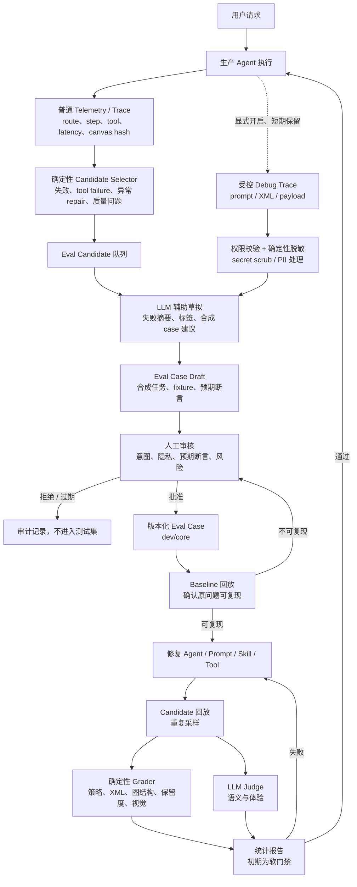

# AI Draw.io Trace-to-Eval 闭环方案（评审稿）

**状态：** Draft，待评审  
**日期：** 2026-07-10  
**范围：** 生产 trace 的候选发现、受控内容读取、LLM 草拟、人工审核和 Eval Case 回流。  
**配套文档：** [AI Draw.io Agent 工业级 Evaluation 方案](2026-07-10-agent-evaluation-design.md) 负责离线 Harness、Grader、统计与发布门禁。  
**非目标：** 本文不定义 TSR@1、图结构/语义 Grader、CI 统计计算或自动修复/自动创建 PR。

## 1. 目的和边界

生产 trace 告诉系统“真实用户在哪里遇到问题”，但它不是可直接信任、可长期保存或可直接执行的测试集。本方案将 trace 变成经审核、脱敏且可复现的 Eval Case，持续补充离线 Evaluation 方案中的 `dev/core` 数据集。

本文只拥有以下外环：

```text
生产 Trace → Candidate → Eval Case Draft → 人工审核 → Approved Eval Case
```

离线 Evaluation 方案拥有以下内环：

```text
Approved Eval Case → Baseline/Candidate 回放 → Grader → 统计与发布结论
```

两者的唯一长期数据交接物是 **Approved Eval Case**。trace、debug payload、候选草稿和人工审核记录都不是 Harness 的直接输入。

## 2. 目标流程



上图中的 `Baseline` 以后均由离线 Evaluation Harness 执行；本方案不实现其 Grader 或统计逻辑。图中从 `M` 回到生产 Agent 表示修复发布后重新产生生产 trace，不表示评测系统直接修改线上 Agent。

## 3. 三个数据区

| 数据区 | 内容 | 用途 | 保留与访问 |
| --- | --- | --- | --- |
| 普通 Telemetry | run、step、LLM/tool 元数据、route、错误类、耗时、token、canvas hash、非敏感摘要 | Candidate Selector、运营监控、定位 run | 现有 retention 与管理员查询；不得保存完整 prompt/XML/API key。任何可还原业务图的缩略图/data URL 按受控内容处理。 |
| 受控 Debug Trace | 完整 prompt、模型输出、选取上下文、XML/payload | 仅用于经授权的草拟与人工调查 | 默认 7 天、管理员权限、按现有 debug-trace control；不得自动延长。 |
| Eval Dataset | 审核通过后的合成任务、fixture、断言、rubric 引用 | 版本化回归与发布评测 | `dev/core` 可进入仓库；不含原始用户内容或可回链的 source run。 |

关键不变量：**普通 trace 不能直接进入 LLM；原始 debug trace 不能直接进入 Git；只有被标记为合成且审核通过的 case 能成为长期 Eval 数据。**

## 4. 模块与 seam

新增一个 `TraceToEvalIntakeModule`。它是一个深模块：调用方只提交候选或审核决定；选择规则、权限检查、脱敏、LLM 草拟、状态迁移和审计都隐藏在 implementation 内。

它的 Interface 保持为三个操作：

```text
discoverCandidates(policyVersion) -> CandidateBatch
prepareDraft(candidateId, actor) -> EvalCaseDraft
reviewAndPromote(draftId, decision, actor) -> PromotionResult
```

Interface 不接受原始 prompt/XML 作为参数，也不允许调用方绕过审核直接创建 Eval Case。

内部 adapter 可以独立替换：

- `CandidateSelectorAdapter`：读取普通 telemetry，产生确定性候选；
- `DebugTraceAccessAdapter`：执行管理员权限、有效期和 scope 检查；
- `SanitizationAdapter`：删除 secrets、标识符、账号、URL、邮件和业务敏感词，必要时拒绝而非猜测；
- `CaseDraftingAdapter`：让 LLM 基于**已脱敏**上下文输出受 schema 约束的草稿；
- `ReviewStoreAdapter`：保存审核决定与审计；
- `CasePublisherAdapter`：将 Approved Case 发布到 dataset 工作区，并返回不可变版本引用。

`AgentConversationService`、canvas 工具和 telemetry 写入链路不调用这个 Module。它通过定时任务和管理端操作消费已落库的 trace，从而不增加用户请求的延迟和故障面。

## 5. Candidate 发现

### 5.1 第一版候选规则

第一版只使用已存在或可由现有 trace 直接推导的确定性信号：

| 规则 | 证据来源 | 默认风险 |
| --- | --- | --- |
| run/step/LLM/tool 失败 | `agent_run`、`agent_run_step`、`agent_llm_call`、`agent_tool_call` | high |
| 非法或失败的画布 mutation | tool status、错误类、trace event | high |
| repair 超过配置预算 | repair phase/trace event 数量 | medium |
| Analyzer critical/major 问题 | 工具输出摘要或画布质量事件 | critical/high |
| mutating route 但 canvas 未变化 | route event + 前后 `canvas_hash`/snapshot | high |
| 手动挑选的 run | 管理端 run 详情页 | reviewer 指定 |

`Undo`、低评分、立即重试、人工大改等属于第二版信号：只有前端先显式记录事件并说明隐私目的后才能进入 Selector。

首版实现只在 run 进入终态后扫描，避免对 RUNNING run 的局部证据提前建立幂等记录。当前普通 telemetry 没有 Analyzer 的逐 issue 明细；因此首版以 `DRAWING_MUTATION.outcome=NEEDS_REPAIR` 表示“阻塞质量问题仍残留”，不能把它解释为精确的 critical/major issue type。待普通 telemetry 增加非敏感 issue count/type 后，再细分该规则，仍不得为此读取 XML 或 debug payload。

### 5.2 Candidate 不是失败事实

每个 candidate 只陈述“为什么值得审核”，不能断言 Agent 一定失败。Selector 的输出至少包括：

```text
candidate_id, source_run_id, source_span_id?, source_phase?, source_agent_id?,
rule_id, evidence_summary, risk, discovered_at, policy_version, status
```

以 `source_run_id + failure_family` 作为幂等键；同一 run 的多个相近规则合并为一个 candidate，并附加所有证据。这样一次异常不会生成多个重复 LLM 草稿或审核任务。

## 6. 受控草拟

### 6.1 Debug Trace 访问

`prepareDraft` 先读取 candidate 的元数据；只有满足以下条件才尝试读取 debug trace：

1. 审核者具备管理员角色；
2. source run 存在、属于该项目且 debug capture 尚未过期；
3. capture scope 允许本次调查；
4. 审核者确认本次用途为“创建合成 Evaluation case”。

不满足时仍可创建 Draft，但只能使用普通 telemetry 证据；系统把它标记为 `NEEDS_MANUAL_RECONSTRUCTION`，不伪造完整输入。

### 6.2 脱敏必须先于 LLM

SanitizationAdapter 在任何 LLM 调用之前运行。至少应：

- 移除 API key、token、cookie、Authorization header、邮件、手机号、账号和内部 URL；
- 用稳定占位符替换可识别实体，例如 `Customer-42`、`Internal-Service-A`；
- 清除不必要的完整对话历史，只保留能复现该回合的最小上下文；
- 对无法可靠脱敏的业务图、机密架构或敏感文本返回 `REQUIRES_MANUAL_SYNTHESIS`；
- 记录 sanitizer version、删除字段类别和审核者，但不把原始内容写回普通 telemetry。

若数据需要长期存入 Eval Dataset，审核者必须把它改写为语义等价的合成案例；仅“打码后的真实图”默认不视为可长期保存。

### 6.3 LLM 草稿输出

LLM 的职责是减少审核者整理工作的成本，不是决定正确性。它只能输出符合 JSON schema 的建议：

```json
{
  "failure_summary": "One concise, non-sensitive description",
  "suspected_failure_family": "routing|tool_policy|artifact|layout|semantic|response",
  "suggested_case": {
    "user_turns": ["Synthetic request"],
    "initial_fixture_hint": "manual-reconstruction-needed",
    "expected_route": "edit_existing",
    "suggested_assertions": ["protected node remains", "new edge exists"]
  },
  "confidence": "low|medium|high",
  "needs_human_review": true
}
```

LLM 不得输出原始 payload、真实用户身份、源 run id、密钥或“自动批准”字段。LLM 超时或不可用时，Draft 仍可由审核者手工创建。

## 7. 人工审核与状态机

### 7.1 状态机

```text
DETECTED → TRIAGED → DRAFT_READY → UNDER_REVIEW → APPROVED → PUBLISHED
                     ↘ NEEDS_MANUAL_RECONSTRUCTION ↗
任意非终态 → REJECTED | EXPIRED | PURGED
```

- `DETECTED`：Selector 创建；
- `TRIAGED`：审核者确认值得投入；
- `DRAFT_READY`：LLM 或人工已提供草稿；
- `UNDER_REVIEW`：审核预期、隐私、风险和 fixture；
- `APPROVED`：内容已成为合成、可复现 case；
- `PUBLISHED`：CasePublisherAdapter 返回 dataset case id/version；
- `REJECTED`：不是产品问题、不可复现、重复或不适合测试；
- `EXPIRED/PURGED`：原始 trace 到期、用户删除或内容不再允许保存。

### 7.2 审核清单

审核者必须逐项确认：

1. 用户意图与失败分类正确；
2. case 已合成，且不含真实身份、内部业务机密或 source run 可回链信息；
3. 初始 fixture 与多轮上下文足以复现；
4. 预期 route、allowed tool、图断言和 protected node 不会把原失败行为误写为标准；
5. case 应进入 `dev/core`，而不是被拒绝或保留为以后封存候选；
6. 归因到的 `agent_id/phase` 仅用于诊断，不替代端到端任务断言。

## 8. 发布到 Evaluation 的交接契约

`CasePublisherAdapter` 发布一个不可变的 `ApprovedEvalCase`，供离线 Harness 使用：

```yaml
case_id: edit-add-payment-service-zh-001
dataset_version: core-v1
origin: trace-derived-synthetic
failure_family: artifact
agent_scope: [intent-router, drawing-agent]
risk: high
input: {}
expected: {}
privacy:
  classification: synthetic
  sanitizer_version: sanitization-v1
provenance:
  source_trace_retained: false
  reviewer: reviewer-id
  approved_at: 2026-07-10T00:00:00Z
```

`source_run_id`、原始 debug payload、真实用户 id 和未经脱敏的截图绝不进入此文件或 Git 历史。受限审计系统可保留最小 provenance 记录；用户删除或数据政策变化时，应能标记关联 Draft/Candidate 为 `PURGED`。

持久化记录必须分层，避免“为了可追溯”把 source run 扩散到长期数据：

- `eval_case_candidate`：受限、短期记录；可保存 `source_run_id`，因为它只用于调查与受现有 user deletion/retention 约束；
- `eval_case_review`：保存审核决定、失败类别、审核者和时间，不保存原始 payload；
- `eval_case_lineage`：只保存 `case_id`、`promotion_id`、reviewer、approved_at、sanitizer version、`origin=trace-derived-synthetic`；**不得保存 `source_run_id`、真实 user id 或原始 payload 引用**；
- Git/受控 Eval Dataset：只保存 `ApprovedEvalCase`，不保存 candidate id、promotion id 或任何可回链 production 数据的键。

因此，source run 只在受限调查记录存活期间可见；发布后的测试 case 不能通过 dataset 或 lineage 回链到生产用户。

离线 Harness 的反馈只回写以下非敏感内容：`baseline_reproduced`、失败分类、candidate 版本结果和 case 健康状态。若 baseline 无法复现，Case 状态回到 `UNDER_REVIEW`，不是直接交给修复流程。

## 9. Agent 适配

同一 trace 可跨越 intent router、drawing、review、repair 和 tool。Candidate 应带 `source_phase` 与 `source_agent_id`，用于分流到相应 owner；但最终 Case 仍可覆盖整条链路。

| Agent / phase | 候选规则举例 | Case 关注点 |
| --- | --- | --- |
| intent router / routing | `review_only` 进入 mutation、错误 diagram type、非法 skill | route、flags、无 mutation、allowed skills |
| drawer / drawing | 必需节点/边缺失、错误工具、canvas 未变化 | graph assertion、tool policy、任务完成 |
| canvas tool | XML 失败、broken edge、patch 失败 | XML integrity、工具输出与幂等性 |
| repair / layout | repair 超预算、major 问题残留、修复扩大影响 | issue residual、保留度、edit scope |
| review / direct answer | 漏报严重问题、宣称已改图、内部信息泄漏 | review recall、truthfulness、language match |

新增 Agent 时，只需配置其 phase、candidate rule 和 case tags；不改变 Intake Module Interface 或 ApprovedEvalCase 契约。

## 10. 权限、审计与失败处理

| 情况 | 处理 |
| --- | --- |
| Debug trace 不存在或已过期 | 不读原始内容；创建 `NEEDS_MANUAL_RECONSTRUCTION` 或拒绝。 |
| LLM 草拟失败 | 保留 candidate，允许人工手工草拟；不能自动通过。 |
| 脱敏器无法确认安全 | 失败关闭，要求人工合成重建。 |
| 审核拒绝 | 保存最小审计原因；不发布 case。 |
| Baseline 不可复现 | 退回审核，修正 case 或标记为不可复现。 |
| 用户删除/政策要求清除 | 依现有删除策略清除 debug 内容；关联未发布 Draft/Candidate 设为 `PURGED`。 |

所有以下操作写入 audit log：读取 debug payload、创建草稿、LLM 草拟、审核、发布、拒绝、清除和访问失败。Candidate Selector 与 LLM 草拟必须异步执行，不能阻塞用户 chat 请求。

## 11. 交付阶段

### P0：人工入口（最小闭环）

- 在管理端 run 详情新增“创建 Eval Candidate”；
- 建立 candidate、review、lineage 的最小持久化记录，并按 §8 的分层规则限制 `source_run_id`；
- 审核者手工重建合成 case 并发布到 `dev/core`；
- 发布的 case 必须使用离线 Evaluation 方案 §5.2 的最终 `ApprovedEvalCase` schema，不能有 P0 专属格式；
- 使用现有 Harness 手动验证 baseline 与 candidate。

P0 的“发布”是人工工作流：审核者将合成 case 以统一 `ApprovedEvalCase` schema 加入受控数据集，运行 Harness 验证后，再由 publication API 记录不可回链 lineage。P0 服务端不自动写工作区或 Git，也不把 source run/candidate/promotion id 写入 case 文件。

### P1：确定性候选队列

- 定时运行 CandidateSelectorAdapter；
- 接入 run/tool failure、repair 预算、Analyzer 问题和 canvas hash 规则；
- 管理端提供筛选、去重、状态迁移和审计记录；
- 仍不自动读取 debug trace 或调用 LLM。

Selector 默认关闭，通过 `ZIPP_EVAL_CANDIDATE_SELECTOR_ENABLED=true` 在一个 scheduler 实例启用；默认每 5 分钟扫描最近 200 个终态 run。部署多个启用实例不会产生重复 case（数据库幂等键兜底），但会制造无效竞争，因此生产只启用一个实例。

### P2：受控 LLM 草拟

- 接入 DebugTraceAccessAdapter 与 SanitizationAdapter；
- 使用 schema constrained LLM 输出 Draft；
- 增加脱敏测试、权限测试和 LLM 输出泄漏测试；
- 保持人工批准为唯一 Publish 门槛。

实现约束：只有 `TRIAGED` candidate 且管理员显式确认 Evaluation 草拟用途时才读取短期 capture。完整 Draw.io XML 直接 fail closed 为 `NEEDS_MANUAL_RECONSTRUCTION`；其余内容先经 `eval-sanitizer-v1` 清理 secret、email、phone 和 URL，再送入专用 Draft Agent。模型输出必须通过严格字段白名单、枚举、`needs_human_review=true` 和生产 ID/PII/secret 泄漏检查后才可持久化为 `DRAFT_READY`。任何读取、模型或 schema 失败都不得自动批准。

### P3：扩展信号与封存集

- Canary 与 case-health 只回写 case/version、baseline reproduced 和健康摘要；不得回写 source run、用户或原始 payload。
- Undo、低评分、立即重试和人工大改必须先获得隐私审批并定义 retention/deletion，再进入普通 telemetry Selector；它们仍只是候选信号，不是自动失败标签。

- 在得到隐私审批后接入 Undo、反馈、重试和人工大改信号；
- 将成熟的 case 发布到封存 release 集的受控工作流；
- 仅在高价值 Finding 上增加只读 RCA，关联 git SHA、prompt/skill version，不自动修改代码或创建 PR。

## 12. 待评审决策

1. `origin: trace-derived-synthetic` 的长期保存、访问与用户删除政策；
2. 可读取 debug trace 的角色与审批方式；
3. P0 是否只允许人工合成，禁止任何 LLM 访问 debug trace；
4. Candidate 规则的初始阈值，例如 repair 次数和延迟异常窗口；
5. 审核 SLA、owner、拒绝原因词表与过期时间；
6. `dev/core` 发布是 Git PR 还是受控 dataset repository；
7. P3 中是否需要封存集和只读 RCA，以及其 token/成本预算。

## 13. 参考

- [TraceRoot Detector 两阶段设计](https://traceroot.ai/docs/detectors/introduction)：低成本 LLM Detector 命中后再执行昂贵 RCA 的分层思路；本方案在其后增加人工审核与 Eval Case 发布。
- [TraceRoot threat model](https://raw.githubusercontent.com/traceroot-ai/traceroot/main/THREAT_MODEL.md)：trace payload 在进入 AI prompt 前需要系统化脱敏，且应审计敏感操作。
