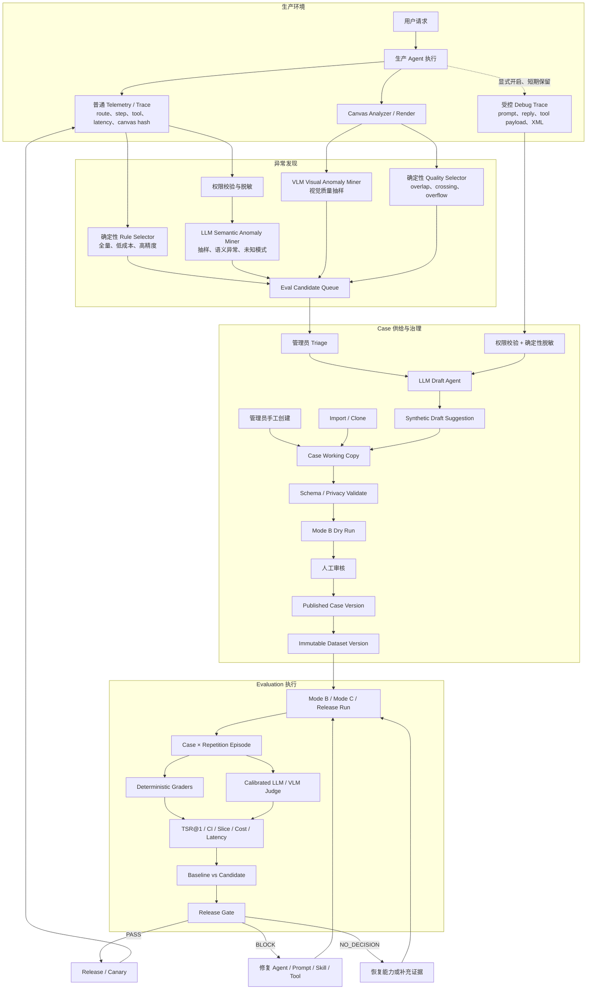
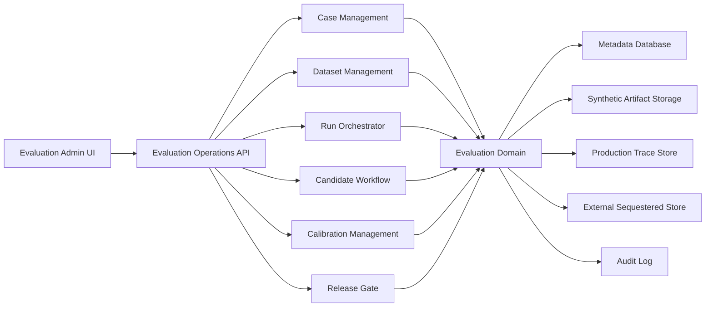
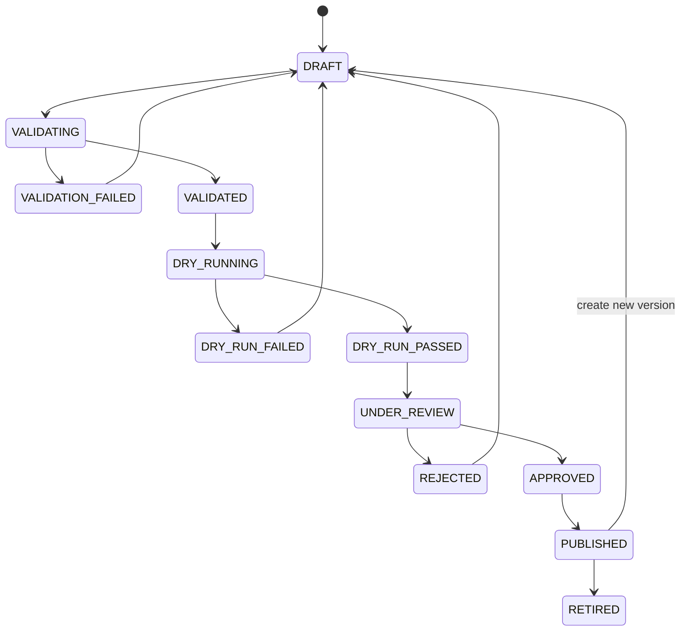

# AI Draw.io Agent Evaluation Control Plane 与管理员控制台完整方案

**状态：** 目标方案与实施规划  
**日期：** 2026-07-13  
**适用范围：** Intent Router、Drawing Agent、Answer/Clarify Agent、Tool/Repair 链路，以及后续新增 Agent

相关文档：

- [工业级 Evaluation 设计](2026-07-10-agent-evaluation-design.md)
- [Trace-to-Eval 闭环设计](2026-07-10-trace-to-eval-closed-loop-design.md)
- [当前实施状态](2026-07-11-implementation-status.md)

## 1. 结论

目标系统不是只读 Dashboard，而是一套可操作的 **Evaluation Control Plane**，完整覆盖：

1. 测试资产供给：管理员手工创建、导入/Clone、生产 Trace 回流；
2. 异常发现：确定性规则、LLM 语义异常发现、VLM 视觉异常发现；
3. Case 治理：编辑、隐私校验、Dry Run、审核和版本化发布；
4. Dataset 治理：dev/core/sequestered 分层、不可变版本和覆盖率；
5. 实验执行：Mode B、Mode C、Release Run、重复采样和错误隔离；
6. 质量判断：确定性 Grader、LLM/VLM Judge、统计比较；
7. 发布决策：PASS、BLOCK、NO_DECISION；
8. 线上反馈：Canary、Case Health 和 Trace-to-Eval 回流。

管理员能力不会替换 Harness、Trace 或 Release Gate。Case Studio 负责“测什么”，Runner 负责“怎么执行”，Grader/Judge 负责“如何判断”，Gate 负责“能否发布”。

## 2. 目标、非目标与不变量

### 2.1 目标

- 管理员无需修改 Java 或手写仓库文件就能创建并验证 Eval Case；
- 每次测评都能定位到 Dataset、Case、Episode、Trace、Grader 和证据；
- 新增 Agent 时只增加 adapter、tags、selector policy 和 grader profile；
- 确定性信号覆盖全量低成本发现，模型信号补充语义和视觉盲区；
- 重复 @1 采样估计随机模型稳定性，不使用 best-of-N；
- 基础设施失败与 Agent 失败严格分离；
- 生产数据不能未经脱敏进入长期 Eval Dataset；
- 所有发布判断可复现、可审计、可解释。

### 2.2 非目标

- 第一版不建设通用 BI、任意图表编辑器或 Prompt Playground；
- 不用 LLM 代替确定性 XML、策略和性能判断；
- 不让 LLM/VLM 自动批准 Case 或直接 BLOCK 发布；
- 不在产品仓库内保存 sequestered Case 内容；
- 不保存模型隐藏的 chain-of-thought；
- 不把生产 Debug Trace 当成永久测试资产。

### 2.3 核心不变量

1. `Candidate != Confirmed Failure`；
2. `LLM Draft != ApprovedEvalCase`；
3. Published Case 不可原地修改，只能生成新版本；
4. Published Dataset 是不可变快照；
5. Eval Run 启动后执行配置不可修改；
6. `ERROR/UNAVAILABLE` 不计入 TSR 成功或失败；
7. Critical deterministic failure 不能被平均分掩盖；
8. Judge 未校准或必需证据缺失时必须 `NO_DECISION`；
9. Trace-to-Eval 的长期交接物只能是 synthetic `ApprovedEvalCase`；
10. sequestered 内容默认不可在普通报告和 UI 中展开。

## 3. 完整系统可视化

### 3.1 两条闭环与管理员操作层



### 3.2 Control Plane 模块边界



Production Trace Store、长期 Synthetic Eval Artifact 和外置 Sequestered Store 必须是三个独立数据区。

## 4. 异常发现体系

异常发现采用并行通道，而不是“只有规则发现，LLM 只整理”。

| 通道 | 输入 | 发现内容 | 扫描策略 | 能否直接 hard fail |
| --- | --- | --- | --- | --- |
| 确定性 Rule Selector | 普通 Trace metadata | error、tool failure、无 mutation、repair、策略、耗时 | 全量 | 只有可证明的 deterministic failure |
| Canvas Analyzer | XML 几何与结构 | overlap、overflow、dangling edge、crossing | drawing 全量或高比例 | 可按已校准 severity hard fail |
| LLM Semantic Miner | 脱敏 prompt/reply/trace summary | false success、意图偏离、无效澄清、未知语义模式 | 定向 + 随机抽样 | 否，只产生 Candidate |
| VLM Visual Miner | 受控 before/after render | 层级、可读性、分组、视觉语义 | 高风险 + 随机抽样 | 否，只产生 Candidate |
| 用户行为信号 | Undo、低评分、重试等 | 用户不满意的弱标签 | 获得隐私批准后 | 否，只产生 Candidate |

### 4.1 确定性规则与性能异常

第一层应覆盖：run/step/LLM/tool error、mutating tool failure、canvas hash 未变化、repair 超预算、Analyzer blocking issue、route/tool policy、XML integrity 和 latency regression。

耗时异常不需要 LLM 判断。Trace 应逐层记录：

```text
end_to_end_latency
route_latency
agent_latency
model_latency
tool_latency
repair_latency
canvas_apply_latency
time_to_first_token
time_to_first_canvas_change
time_to_task_completion
```

性能阈值按 route 和图复杂度分层，并同时使用绝对体验上限、相对 baseline 和同类历史分布。

### 4.2 LLM Semantic Anomaly Miner

Semantic Miner 是独立能力，不等于 Draft Agent。它读取通过权限和脱敏后的可观察内容，输出固定 Candidate schema：

```json
{
  "isPotentialAnomaly": true,
  "confidence": 0.94,
  "failureFamily": "FALSE_SUCCESS",
  "evidence": [
    "run status is SUCCESS",
    "assistant says the canvas could not be loaded",
    "canvas did not change"
  ],
  "suggestedRisk": "high",
  "requiresHumanReview": true
}
```

推荐扫描规则无法归因、success 但无 mutation、repair/tool call 较多、高风险 Canary、用户负反馈和少量随机样本。模型发现只能进入 Candidate Queue，不能自动批准、发布或 BLOCK。

### 4.3 VLM Visual Anomaly Miner

VLM 输入必须是受控渲染图，而不是图片 URL 字符串或未经处理的生产 XML。它用于识别主流程不明显、视觉层级混乱、整体难读、分组/颜色/形状语义不一致、连线难追踪等问题。第一版优先处理 Analyzer major/critical、复杂图、高风险 route、负反馈和随机质量样本，不全量运行。

### 4.4 模型职责分离

| 能力 | 目的 | 输出 |
| --- | --- | --- |
| LLM Semantic Miner | 判断潜在语义异常 | Candidate signal |
| VLM Visual Miner | 判断潜在视觉异常 | Candidate signal |
| LLM Draft Agent | 将已 triage Candidate 转为合成建议 | Draft suggestion |
| LLM Judge | 评价 Eval episode 文本语义与体验 | Judge result |
| VLM Judge | 评价 Eval episode 真实像素质量 | Judge result |

每类能力分别维护 model、prompt、input projection、schema、calibration 和成本版本。

## 5. Debug Trace 的角色

普通 Trace 回答“发生了什么”，受控 Debug Trace 帮助还原“Agent 当时实际看到了什么、输出了什么”。Debug Trace 可能包含 prompt、assistant reply、router reply、tool arguments/result 和 XML，只能显式开启、短期保留、权限访问并完整审计。

- 无 Debug Trace：Candidate 可由 metadata 发现，管理员手工重建 synthetic Case；
- 有 Debug Trace：先脱敏，再让 Draft Agent 生成更完整的 synthetic suggestion；
- 包含完整生产 XML：当前策略 fail closed，转人工合成，不能长期保存。

禁止保存模型隐藏 chain-of-thought；只保存系统本来可观察的输入、输出、工具和状态变化。

## 6. Admin Console 信息架构

```text
Evaluation
├── Overview
├── Eval Runs
│   ├── Running
│   ├── Completed
│   └── Baseline Comparison
├── Cases
│   ├── Working Copies
│   ├── Published
│   ├── Flaky / Stale
│   └── Retired
├── Datasets
│   ├── dev
│   ├── core
│   └── sequestered metadata
├── Candidates
│   ├── Rule Detected
│   ├── Model Detected
│   ├── Draft Ready
│   └── Under Review
├── Calibration
├── Release Gates
└── Audit Logs
```

现有 `/admin/runs` 是生产 Agent Run/Trace 页面，不应与新的 `/admin/eval-runs` 混为同一概念。

`Audit Logs` 是现有通用 `admin_audit_log` 的 Evaluation 过滤视图，不建设第二套审计存储。

### 6.1 Overview 与 Eval Run

Overview 展示最近 PR/Nightly/Release Run、TSR@1/CI、baseline delta、hard failure、ERROR/UNAVAILABLE、待处理 Candidate/Case 和 Gate 结论。

Run Detail 的核心是 Case Matrix：

| Case | Agent | Route | Risk | Runs | Route | XML | Graph | Preserve | Visual | Judge | Delta | Result |
| --- | --- | --- | --- | ---: | --- | --- | --- | --- | --- | --- | --- | --- |

点击 Case/Repetition 后展示 input/expected、canvas render、baseline/candidate、semantic diff、EvalTrace waterfall、tool/repair、grader/judge evidence、latency/token/cost 和 failure classification。

### 6.2 Cases 与 Datasets

Case Studio 支持 Manual、From Candidate、Import YAML 和 Clone Published Case，提供表单/YAML 双视图、Validate、Mode B Dry Run、版本 Diff、提交审核和发布。

Dataset 分为：

- `dev`：高频开发验证；
- `core`：稳定 PR/Nightly 回归集；
- `sequestered`：外置受控发布集，普通管理员只看健康元数据。

## 7. Case Studio 设计

### 7.1 Case 状态机



### 7.2 Case 内容

- 基础：case id/version、owner、risk、language、tags、target agent、route、diagram type；
- 输入：single/multi-turn request、initial fixture、execution profile；
- Mode B：router reply、agent reply、tool calls、repair signals、turn-level canvas state；
- Expected：route、tool policy、task outcome、XML、graph、preservation、visual、performance、Judge rubric；
- Privacy：classification、sanitizer version、source trace retained flag。

### 7.3 Validate、Dry Run 与发布

Validate 检查 schema、synthetic classification、secret/PII/production ID/XML 泄漏、fixture/version、replay/turns、graph assertions、alias map、expected coverage、grader/judge availability 和版本冲突。

Dry Run 必须按当前 working copy 的 input、fixture、replay 和 expected 真实运行 Mode B，输出 trace、canvas diff、grader evidence 和报告，不得使用跨 Case 共享硬编码脚本。

Draft 可编辑；Review 展示完整 diff、隐私检查和 Dry Run 证据；高风险/core/sequestered 使用 four-eyes；Published Case 不可 update，修改时 Clone 新版本。

## 8. Case、Dataset 与 Health 契约

Manual、Import、Trace-derived 和 Clone 最终都产生现有 `EvalCaseDefinition`/`ApprovedEvalCase`，不能出现多套格式。

现有 `eval_case_draft` 是受控 LLM suggestion，不应直接扩展成可发布完整 Case。建议新增 `eval_case_working_copy` 保存管理员编辑的完整 synthetic draft，维持 Draft Agent 与发布资产之间的安全 seam。

Dataset 发布遵循：

```text
core-v1 + approved case changes = core-v2
```

Dataset version 固定 content hash、case/version 成员、审核者和发布时间。Case Health 使用 `HEALTHY`、`FLAKY`、`STALE_REVIEW`、`BROKEN_FIXTURE`、`BROKEN_BASELINE`、`ALWAYS_PASS_REVIEW`、`UNSCORABLE`、`RETIRED`。退休 Case 仍保留历史结果。

## 9. Evaluation 执行模式

| 模式 | 用途 | 模型 | 数据集 | 重复 | 门禁 |
| --- | --- | --- | --- | ---: | --- |
| PR / Mode B | 确定性代码回归 | stubbed | core fast slice | 1 | deterministic hard gate |
| Nightly / Mode C | 真实模型稳定性 | production profile | core | 按风险 | soft/relative gate |
| Release | 正式发布判断 | baseline + candidate | core + sequestered | 多次 | three-state gate |

Mode B 验证 router 后处理、tool policy、XML toolkit、patch/merge、repair/analyzer 等确定性链路；Prompt 和真实模型质量必须在 Mode C/Release 中验证。

管理员创建 Run 时固定 Dataset/version、baseline/candidate、repetitions、execution profile、model/prompt/skill/tool-policy version、Judge/Grader version、timeout 和预算。启动后不可修改。

### 9.1 Run 状态

```text
CREATED → QUEUED → RUNNING → COMPLETED
                     ├─────→ CANCELLED
                     └─────→ INFRA_ERROR
```

Run 执行状态与 Gate outcome 分离。`COMPLETED` 只表示编排完成，不代表 `PASS`。

### 9.2 Episode 与错误隔离

每个 `Case × Repetition` 是独立 Episode，状态为：

```text
PASS
FAIL
ERROR
UNAVAILABLE
```

只有明确基础设施异常允许自动重试；Agent `FAIL` 不重试。一个坏 Case 必须记录 ERROR 并继续同批其他 Case。

## 10. Grader、Judge 与统计

### 10.1 确定性 Grader

- route/tool policy；
- XML integrity；
- graph assertions；
- semantic-identity preservation；
- visual analyzer；
- no mutation；
- multi-turn state；
- performance budget。

Graph hard match 只使用 exact normalized label 和 reviewed canonical alias map；模糊、embedding 或 LLM match 只能作为 soft evidence。Preservation 按 label、type 和 neighborhood 语义身份匹配，不依赖 cell id。

### 10.2 Judge

- Text Judge：answer/clarify 的任务完成、helpfulness、语言和 side effect；
- VLM Judge：真实 before/after 像素的可读性、层级、布局和视觉语义；
- 未校准 Judge 或 provider 不可用返回 `UNAVAILABLE`；
- diagram case 在真实 VLM adapter 完成前不能生成视觉 Judge 分数。

Judge model、prompt、rubric、input projection、schema 和 calibration approval 都进入 `judgeVersion`。

### 10.3 TSR@1

对 Case `i` 重复 `N_i` 次：

```text
p_hat_i = successful eligible episodes / eligible episodes
TSR@1 = mean(p_hat_i over cases)
```

Case 等权聚合；重复采样用于估计单次成功概率，不做 best-of-N。CI 使用 case-cluster bootstrap。ERROR/UNAVAILABLE 单独进入 availability，不进入 TSR 分母。

### 10.4 性能统计

按 route、Agent 和图复杂度报告 median、P90、P95、max、timeout rate，以及 model/tool/repair/canvas apply 分解。Gate 同时使用：

- 绝对用户体验上限；
- candidate 相对 baseline 的 paired delta；
- 同 route、同复杂度历史分布。

供应商 429、网络、数据库或队列异常标记为 `ERROR/INFRA_UNAVAILABLE`，不算 Agent 质量 FAIL。

### 10.5 Release Gate

```text
BLOCK:
  confirmed deterministic hard failure
  or calibrated paired regression crossing allowed tolerance

PASS:
  all hard gates pass
  required Judge/calibration/sequestered evidence available
  and candidate is within approved relative tolerance

NO_DECISION:
  insufficient eligible cases
  infrastructure availability too low
  Judge unavailable or uncalibrated
  sequestered set missing
```

## 11. 权限、隐私和审计

### 11.1 RBAC

| 操作 | Eval Editor | Eval Reviewer | Eval Admin | Release Owner |
| --- | ---: | ---: | ---: | ---: |
| 创建/编辑 working copy | 是 | 是 | 是 | 是 |
| Validate / Dry Run | 是 | 是 | 是 | 是 |
| 审核 | 否 | 是 | 是 | 是 |
| 发布 dev/core | 否 | 否 | 是 | 是 |
| 查看 sequestered 内容 | 否 | 否 | 否 | 是 |
| 执行/override Release Gate | 否 | 否 | 否 | 是 |
| 退休 Case | 否 | 否 | 是 | 是 |

### 11.2 Published Case 禁止内容

- source run/span/candidate/debug capture/user id；
- 原始生产 prompt/reply/payload；
- 真实客户、公司、人员、账号和内部项目实体；
- email、phone、URL、Authorization、Cookie、secret；
- 未经处理的生产 XML 或 render。

业务实体转换成稳定合成占位符，例如 `Customer-42`、`Service-A`、`Order-17`。

### 11.3 审计

复用现有 `admin_audit_log`、`AdminAuditLogService` 和 `IAdminAuditLogStore`，为 Case、Dataset、Eval Run、Calibration 和 Gate 扩展 target type/action。现有表已记录 actor、action、target、outcome、request metadata 和时间；若 Control Plane 需要 before/after version 或 reason，则给现有表增加严格白名单的 nullable `reason_code`/`metadata_json`，或在 review/gate domain 表保存理由并由 audit target 引用。审计元数据不得包含 Case body、prompt、XML 或 Debug payload。成功、拒绝和系统错误均审计，不新增平行的 Evaluation 审计表。

## 12. 建议持久化模型

### 12.1 保留现有表

- `eval_case_candidate`；
- `eval_case_draft`：仅保存 LLM suggestion；
- `eval_case_review`；
- `eval_case_lineage`；
- `eval_case_health`；
- `admin_audit_log`：继续承载所有 Evaluation 管理操作审计。

### 12.2 新增 Control Plane 表

```text
eval_case_working_copy
  id, case_id, case_version, draft_json, source_type
  candidate_id_nullable, status, owner, revision, created_at, updated_at

eval_case_version
  case_id, case_version, content_hash, artifact_ref
  approved_by, published_at, retired_at

eval_dataset
  id, name, class, owner

eval_dataset_version
  dataset_id, version, content_hash, status, published_at

eval_dataset_member
  dataset_id, dataset_version, case_id, case_version

eval_run
  id, mode, dataset_id, dataset_version
  baseline_ref, candidate_ref, execution_profile_hash
  status, created_by, started_at, completed_at

eval_episode
  id, eval_run_id, case_id, case_version, repetition
  status, trace_ref, artifact_refs, latency_ms, tokens, estimated_cost

eval_grader_result
  episode_id, grader_name, grader_version
  status, severity, score_nullable, evidence_json

eval_judge_result
  episode_id, judge_version, calibration_version
  status, score_json, evidence_json

eval_gate_decision
  eval_run_id, gate_version, outcome, reasons_json, decided_at
```

其中 `eval_grader_result`、`eval_judge_result` 和 `eval_gate_decision` 不是新建第二套领域概念，而是为已有 `EvalGraderResult`、`EvalJudgeResult` 和 `EvalReleaseGateService` 输出增加持久化映射，使现有 JSON/Markdown 报告结果可以被 Control Plane 查询、比较和展示。

Artifact Storage 只保存 synthetic fixture、render 和报告；生产 Debug Artifact 继续由短期 Debug Store 管理。

## 13. 建议 API

### 13.1 Cases

```text
POST /admin/eval-case-working-copies
PUT  /admin/eval-case-working-copies/{id}
POST /admin/eval-case-working-copies/{id}/clone
POST /admin/eval-case-working-copies/{id}/validate
POST /admin/eval-case-working-copies/{id}/dry-runs
POST /admin/eval-case-working-copies/{id}/submit-review
POST /admin/eval-case-working-copies/{id}/approve
POST /admin/eval-case-working-copies/{id}/reject
POST /admin/eval-case-working-copies/{id}/publish
GET  /admin/eval-cases
GET  /admin/eval-cases/{caseId}/versions
POST /admin/eval-cases/{caseId}/clone
POST /admin/eval-cases/{caseId}/retire
```

两个 Clone 端点语义不同：`/eval-case-working-copies/{id}/clone` 复制尚未发布的工作副本，用于草稿分支；`/eval-cases/{caseId}/clone` 从指定已发布 Case Version 创建新的 Working Copy，原已发布版本保持不可变。

Working Copy 的 validate、dry-run、review 和 approve 属于 Phase A/CP2；`publish` 端点虽然以 Working Copy 为操作对象，但依赖 Phase C/CP3 的不可变 Case Artifact Store 和 Dataset Version，实际在 CP3 实现。

### 13.2 Datasets

```text
POST /admin/eval-datasets
POST /admin/eval-datasets/{id}/clone
PUT  /admin/eval-datasets/{id}/members
POST /admin/eval-datasets/{id}/validate
POST /admin/eval-datasets/{id}/dry-runs
POST /admin/eval-datasets/{id}/publish
GET  /admin/eval-datasets/{id}/coverage
```

### 13.3 Eval Runs 与 Gate

```text
POST /admin/eval-runs
GET  /admin/eval-runs
GET  /admin/eval-runs/{id}
GET  /admin/eval-runs/{id}/episodes
GET  /admin/eval-runs/{id}/comparison
POST /admin/eval-runs/{id}/retry-errors
POST /admin/eval-runs/{id}/cancel
GET  /admin/eval-runs/{id}/gate
POST /admin/eval-runs/{id}/gate/evaluate
POST /admin/eval-runs/{id}/gate/override
```

Gate override 必须要求 Release Owner、理由和审计，且不能把缺失证据改写成真实证据。

## 14. 当前实现与目标差距

以下以 [实施状态](2026-07-11-implementation-status.md) 和当前代码为准。

| 能力 | 当前状态 | 仍需完成 |
| --- | --- | --- |
| Mode B Harness、12 个异构 Case | 已实现 | 扩到 250–350，并建设高价值真实回归集 |
| EvalTrace、XML/Graph/Preservation/Visual Grader、多轮 Mode B | 已实现 | performance grader 和更丰富 visual/preservation assertions |
| 确定性 Candidate Queue | 已实现 | 结构化 Analyzer issue、latency selector 和获批用户行为信号 |
| Debug Trace + sanitizer + LLM Draft Agent | 已实现 | Draft suggestion 接入完整 Case Studio working copy |
| LLM 直接语义异常发现 | 平台代码已实现、默认关闭 | 提供 50–80 条人工校准 Trace、批准固定 model/prompt/schema version 并接入真实成本单价 |
| VLM 直接视觉异常发现 | 未实现 | render capture、multimodal provider、隐私策略和校准 |
| Mode C runner、统计和成本模型 | 平台代码已实现 | 真实凭据、baseline、多轮受控运行和运营调度 |
| Text Judge provider | 已实现但未批准运行 | 60–80 个双人标注校准 Case、固定模型版本 |
| Diagram VLM Judge | 未实现 | before/after pixel adapter 和校准 |
| Release Gate service/report | 已实现 | CI/CD 接线、真实 core/sequestered 输入 |
| Sequestered loader | 已实现 | 外置受控 Dataset 和权限运营 |
| Canary/Case Health service | 已实现 | 部署平台接线、定期任务和真实运营数据 |
| Admin Candidate 页面 | 已实现 | 完整 review/publish Case 操作体验 |
| Admin Case Studio | 未实现 | working copy、编辑器、Validate、Dry Run、Diff、审批 |
| Dataset 管理 UI/API | 未实现 | Dataset draft/version/coverage/publish |
| Eval Run Control Plane | 未实现 | eval_run/episode 持久化、orchestrator、progress、case matrix |
| Calibration UI | 未实现 | calibration dataset、版本、agreement/critical recall 和 readiness 页面 |
| Release Gate UI | 未实现 | Gate evidence、三态结论、reason、CI/CD adapter 和 override 审计 |
| Audit Logs UI | 未实现 | 复用 `admin_audit_log` 的 Evaluation resource/action 过滤视图 |

当前 `/admin/runs` 展示生产 Agent Run；它不是 Eval Experiment Run 管理界面。现有 report writer 和 service class 也不等于一键可运行的管理员链路。

## 15. 后续实施计划

为避免与已完成的 Evaluation Phase 0–8 混淆，本设计使用 A–F 表示粗粒度能力阶段；配套 [实施计划](2026-07-13-evaluation-control-plane-implementation-plan.md) 使用 CP0–CP10 拆成可独立交付的工程阶段。两者映射如下：

| 设计阶段 | 实施计划阶段 | 关系 |
| --- | --- | --- |
| — | CP0 | 跨阶段契约和存储边界前置工作 |
| Phase A：Case Studio MVP | CP1 + CP2 | Working Copy 后端、Case Studio、Validate 和 Dry Run；不可变发布交给 Phase C/CP3 |
| Phase B：Eval Run Control Plane | CP4 + CP5 | Mode B Run 持久化/编排与可视化 |
| Phase C：Dataset Governance | CP3 | Case/Dataset 不可变发布和版本治理 |
| Phase D：Live/Release Operations | CP6 + CP7 | 已有后端接线，以及真实 baseline、校准和封存集运营准备 |
| Phase E：Semantic Anomaly Discovery | CP8 | LLM Semantic Miner |
| Phase F：Visual Discovery/Judge | CP9 | VLM Miner、VLM Judge 与视觉校准 |
| — | CP10 | Canary、Case Health 和持续运营收口 |

设计文档按能力关系保留 A–F；实际交付顺序按实施计划执行 CP0 → CP1 → CP2 → CP3 → CP4 → CP5 → CP6/CP7，不按设计阶段字母顺序直接施工。

依赖顺序不是简单的功能清单：Phase B 先提供 `eval_run`/`eval_episode` 及确定性 `EvalGraderResult` 的持久化；Phase C 提供可选择的不可变 Dataset；Phase D 必须依赖 B 和 C，才能增加 `EvalJudgeResult`/Gate 持久化，并把已有 Mode C、统计、Gate 和 Canary 服务的输出落库、展示并用于真实 Release Run。Phase E/F 可以在 B 的 Candidate/Run 基础上开发，但进入 Release Gate 前仍需 D 的校准、权限和运营条件。

### Phase A：Admin Case Studio MVP

实现：

- `eval_case_working_copy` 和 optimistic revision；
- Manual、Import YAML、Clone；
- 表单/YAML 双视图；
- schema/privacy/fixture Validate；
- 单 Case Mode B Dry Run；
- Draft → Review → Approve/Reject；
- 批准 synthetic Case 并交给 Phase C/CP3 做不可变发布；
- RBAC、CSRF 和审计。

验收：

- 管理员无需修改代码即可创建 Case；
- 非 synthetic、泄漏字段、坏 fixture 无法发布；
- Dry Run 使用当前 Case 自身 replay；
- Published Case 不能原地修改；
- Trace LLM suggestion 可安全转为 working copy，但不能直接批准。

### Phase B：Eval Run Control Plane

实现 `eval_run`、`eval_episode`，并为已有 `EvalGraderResult` 增加持久化映射；接入 Mode B orchestrator、Run 进度/取消、Case Matrix、Episode Drawer、per-case ERROR retry 和报告关联。`EvalJudgeResult` 与 Gate decision 的持久化由 Phase D/CP6 在 Mode C/Release 接线时增加。

验收：管理员可选择 Dataset 启动 Mode B；坏 Case 不掀翻 Batch；每个结果可追到 case/grader/git/execution profile；UI 明确区分 FAIL、ERROR、UNAVAILABLE。

### Phase C：Dataset Governance

实现 Dataset draft/member/immutable version、dev/core promotion、slice coverage、Case Health、Clone/Retire 和 fixture compatibility 提示。

验收：历史 Run 可按原 Dataset 重放；Dataset 发布后不可修改；管理员能看到 agent/route/risk/language/diagram type 覆盖缺口。

### Phase D：Live Evaluation 与 Release Operations

**依赖：** Phase B 的 Run/Episode/Result 持久化与 Phase C 的不可变 Dataset。

已有后端能力接线：

- 将现有 `LiveEvalRunner`/`ProductionLiveEvalAdapter` 接入新的 Eval Run orchestrator；
- 将已有 repetition、`EvalStatisticsService` 的 TSR@1/CI/cost/latency 和 paired comparison 映射到 Run/Episode 持久化；
- 将已有 `EvalReleaseGateService`、`EvalCanaryService` 和报告 writer 接入 Admin UI、CI adapter 和部署指标输入。

真正新增或运营前置：

- Calibration、Sequestered readiness 和 Release Gate 页面；
- 真实 provider credential、baseline 和多轮 live session 接线；
- 60–80 个双人标注校准 Case；
- 外置 sequestered Dataset 挂载；
- real canary metrics、Release Owner override 和审计。

验收：真实 baseline 可复现；required Judge/封存集缺失时 `NO_DECISION`；hard failure `BLOCK`；报告不泄漏 sequestered 内容。

### Phase E：LLM Semantic Anomaly Discovery

实现脱敏 trace projection、独立 `ISemanticAnomalyMiner`、fixed schema、定向/随机 sampling、Candidate dedupe/evidence merge、50–80 条人工校准集，以及 precision/recall/接受率/成本监控。

验收：可发现 `SUCCESS + 无法加载/未完成` 等 false success；原始 payload 不进入模型或长期 Candidate；Miner 不能自动发布或 Gate；不可用时安全降级且不影响用户请求主链路。

### Phase F：VLM Visual Discovery 与 Judge

实现受控 XML→image render、retention/access policy、VLM Miner/Judge 独立 adapter、before/after pixel input、visual calibration、sampling budget 和 visual Candidate→synthetic reconstruction。

验收：图质量问题能产生 Candidate 和 synthetic suggestion；未授权生产图不长期保留；text-only provider 不能生成 visual score；VLM 未校准时 Release `NO_DECISION`。

## 16. 管理员操作手册

### 16.1 手工增加 Case

```text
Cases → New Case → 填写任务/fixture/replay/assertions
→ Validate → Mode B Dry Run → Submit Review
→ Approve → Publish Case → Publish dev/core Dataset Version
```

### 16.2 从 Trace 创建 Case

```text
Candidates → Triage → Prepare sanitized draft
→ Open in Case Studio → 合成 fixture/修正 assertions
→ Validate → Baseline Dry Run → Review → Publish
```

### 16.3 执行回归与 Release

```text
Eval Runs → New Run → 选择 Mode/Dataset/baseline/candidate
→ 查看 Case Matrix → 下钻 FAIL/ERROR/UNAVAILABLE
→ 修复或恢复能力 → paired comparison
→ Release Gate → PASS/BLOCK/NO_DECISION
```

## 17. 运营指标

### 17.1 平台健康

- Run completion/availability；
- ERROR、UNAVAILABLE、retry rate；
- queue wait、episode duration、token 和 cost；
- report/artifact completeness；
- Judge/calibration/sequestered readiness。

### 17.2 Case 资产健康

- 每 slice 数量和最小样本；
- baseline reproduction；
- flaky/stale/broken fixture；
- 重复 Case 与 defect detection history；
- candidate→approved conversion；
- 生产问题发现到回归 Case 发布的 lead time。

### 17.3 Miner 质量

- precision、recall、Macro-F1；
- 人工接受率；
- failure family 分布与新模式发现数；
- 重复 Candidate 率；
- 单个有效 Candidate 成本；
- PII/privacy rejection rate。

## 18. 参考产品模式

- [Arize Phoenix](https://github.com/Arize-ai/phoenix)：Trace、Dataset、Evaluation 和 Experiment 统一闭环；
- [LangSmith Experiment Analysis](https://docs.langchain.com/langsmith/analyze-an-experiment)：Case table、repetition、baseline compare 和 trace 下钻；
- [Langfuse Dataset Run Comparison](https://langfuse.com/changelog/2024-11-18-dataset-runs-comparison-view)：Dataset Run 并排比较；
- [Braintrust Experiment Comparison](https://www.braintrust.dev/foundations/comparing-experiments)：不可变 Experiment 和逐 Case 对比；
- [OpenTelemetry GenAI Semantic Conventions](https://github.com/open-telemetry/semantic-conventions-genai)：GenAI span、metric 和 event 命名参考。

优先借鉴不可变 Experiment、Dataset version、逐 Case 下钻、baseline comparison 和统一 trace/evaluator evidence；暂不建设通用 Playground、任意 Dashboard Builder 或全量 OTEL ingestion 重写。

## 19. 最终完成定义

只有满足以下条件，系统才可称为完整工业级 Evaluation Control Plane：

1. 管理员可创建、验证、Dry Run、审核和版本化发布 Case/Dataset；
2. Mode B/Mode C/Release 可从 UI/API 创建不可变 Eval Run；
3. 每个 Episode 可下钻到 trace、artifact、grader/judge evidence；
4. 确定性、LLM 和 VLM 异常发现均有明确边界与人工门槛；
5. TSR@1、CI、latency、cost、availability 和 paired comparison 可复现；
6. Release Gate 正确输出 PASS/BLOCK/NO_DECISION；
7. core/sequestered、Judge calibration 和权限审计真实可用；
8. Canary 和 Case Health 持续回流新的生产问题；
9. 生产隐私数据不会进入长期 synthetic Dataset；
10. 文档能力与 UI 实际可操作状态一致，不把未接线 service 标记为可用。
