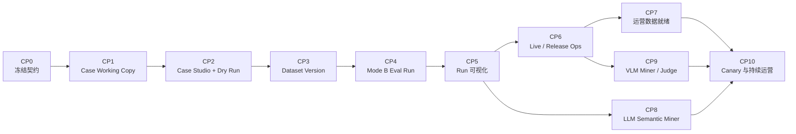

# Evaluation Control Plane 实施计划

**日期：** 2026-07-13  
**依据：** [完整方案](2026-07-13-evaluation-control-plane-and-admin-console-design.md)  
**当前基线：** [实施状态](2026-07-11-implementation-status.md)

## 1. 实施结论

当前仓库不是从零开始。Mode B Harness、Trace Candidate Queue、受控 LLM Draft、Mode C/统计、Release Gate 和 Canary/Case Health 的领域服务已经存在。后续工作的主线是把这些能力变成管理员可以操作、结果可以持久化和下钻的 Control Plane，并补齐真实数据与模型运营。

推荐顺序：



关键里程碑：

- CP2 完成：管理员可以创建、校验和单 Case Dry Run；
- CP5 完成：管理员可以启动 Mode B Dataset Run 并下钻失败；
- CP7 完成：Release Gate 才具备真实 PASS/BLOCK/NO_DECISION 运营条件；
- CP9 完成：图质量具备真实 VLM 发现和评判能力；
- CP10 完成：生产问题可以持续回流并验证发布质量。

## 2. 实施原则

1. 每个阶段必须形成可运行的垂直切片，不只增加空接口；
2. 每个阶段完成后对照完整方案逐条审查并独立 commit；
3. Published Case、Dataset Version 和 Eval Run 均不可变；
4. 现有 `eval_case_draft` 保持 LLM suggestion 语义，不承载最终可发布 Case；
5. 新的 Admin API 使用独立 `EvaluationAdminController`，不继续膨胀现有生产 Trace `AdminController`；
6. 后端领域逻辑放在 domain，持久化 adapter 放 infrastructure，HTTP/Job 放 trigger；
7. Model/VLM 不进入默认 PR 测试；Mode B 和所有确定性测试继续进入 `mvn clean test`；
8. ERROR、UNAVAILABLE、FAIL 从存储到 UI 全链路不混淆；
9. 未校准或未配置能力显示 `UNAVAILABLE/NO_DECISION`，不伪造零分或 PASS；
10. 不在服务端自动写产品仓库 Git；通过不可变 Case/Dataset 存储接口发布；
11. 复用现有 `admin_audit_log`/`AdminAuditLogService`，不建设 Evaluation 专用平行审计表。

## 3. 模块落点

### 3.1 后端

建议在现有 evaluation 包下增加 Control Plane 子域：

```text
ai-agent-draw-io-domain
└── .../evaluation/controlplane
    ├── model
    ├── port
    └── service

ai-agent-draw-io-infrastructure
└── .../repository/evaluation/controlplane

ai-agent-draw-io-trigger
├── .../http/EvaluationAdminController.java
├── .../evaluation
└── .../job
```

复用而不是复制：

- `EvalCaseDefinition`、`EvalCaseLoader`；
- `EvalBatchRunner`、`DefaultEvalHarness`；
- `LiveEvalRunner`、`ProductionLiveEvalAdapter`；
- `EvalStatisticsService`；
- `EvalReleaseGateService`；
- `EvalCanaryService`、`EvalCaseHealthService`；
- `TraceToEvalDraftService` 和现有 Candidate workflow。

### 3.2 前端

```text
ai-agent-draw-io-front/src/app/admin
├── eval-runs/
├── eval-cases/
├── eval-datasets/
├── eval-calibration/
├── eval-release-gates/
└── eval-audit/
```

现有 `/admin/runs` 继续表示生产 Agent Run/Trace；新的实验页面使用 `/admin/eval-runs`。

### 3.3 数据与迁移

SQL migration 继续放在：

```text
ai-agent-draw-io/docs/sql/migrations/
```

所有新表显式建立唯一键、状态/时间索引和 foreign key/应用层引用约束；JSON 字段必须保存 schema version 和 content hash。

## 4. CP0：冻结 Control Plane 契约

**目标：** 在编码前固定边界，避免后续 Case、Dataset 和 Run 三次返工。  
**预计：** 1–2 个工程日。

### 实现内容

- 固定 `CaseWorkingCopy`、`CaseVersion`、`DatasetVersion`、`EvalRun`、`EvalEpisode`、`GraderResultRecord`、`GateDecisionRecord` 状态和字段；
- 固定 Case Working Copy 与现有 `EvalCaseDefinition` 的转换规则；
- 固定发布内容存储 port：`IEvalCaseArtifactStore`、`IEvalDatasetStore`；
- 决定本地/test adapter 与生产不可变存储 adapter 的责任；
- 固定 `/admin/eval-*` 路由和错误码；
- 固定 RBAC：Editor、Reviewer、Admin、Release Owner；
- 固定现有 `admin_audit_log` 的 Evaluation resource type/action；
- 决定是否给现有审计表增加白名单 `reason_code`/`metadata_json`，禁止保存 Case body、prompt、XML 或 Debug payload；
- 固定乐观锁 `revision` 和幂等键。

### 测试/验证

- serialization round-trip；
- 状态机单元测试；
- `EvalCaseDefinition` conversion contract test；
- 文档与代码枚举对照。

### 验收

- LLM suggestion 与完整 working copy 是不同对象；
- Published Case/Dataset/Run 无 update 接口；
- `/admin/runs` 和 `/admin/eval-runs` 语义无冲突；
- 所有后续阶段都能引用同一组 ID/version/status。

### Commit

```text
docs(eval): freeze control plane contracts
```

## 5. CP1：Case Working Copy 后端

**目标：** 管理员可以安全保存一个完整、可编辑、尚未发布的 Case。  
**预计：** 3–5 个工程日。

### 数据库

新增：

```text
eval_case_working_copy
```

关键字段：case id/version、source type、candidate id nullable、draft JSON、status、owner、revision、created/updated time。

Working Copy 操作审计复用现有 `admin_audit_log`，不新增 `eval_case_working_copy_audit`。

### Domain

- `EvalCaseWorkingCopy`；
- `EvalCaseWorkingCopyStatus`；
- `IEvalCaseWorkingCopyStore`；
- `EvalCaseWorkingCopyService`；
- Manual/Create、Import、Clone、From Draft Suggestion；
- optimistic update；
- 状态机与 ownership/RBAC policy。

### API

```text
POST /admin/eval-case-working-copies
GET  /admin/eval-case-working-copies
GET  /admin/eval-case-working-copies/{id}
PUT  /admin/eval-case-working-copies/{id}
POST /admin/eval-case-working-copies/{id}/clone
```

该 Clone 只复制尚未发布的 Working Copy。CP3 的 Published Case Clone 是另一条接口：它以不可变 Case Version 为源创建新的 Working Copy，不修改原版本。

### 测试

- service 状态机和 revision conflict；
- Import YAML 使用真实 `EvalCaseLoader`；
- Trace Draft suggestion 转换不复制 source run/debug ID；
- controller RBAC、CSRF、错误隔离；
- repository round-trip 和唯一键。

### 验收

- 管理员可以 Manual、Import、Clone、From Candidate Draft；
- 并发修改返回 conflict，不静默覆盖；
- 非 synthetic 内容只能保存为 invalid draft，不能进入审核；
- 审计包含成功、拒绝和错误。

### Commit 建议

```text
feat(eval): add case working copy persistence
feat(eval): expose case working copy admin api
```

## 6. CP2：Case Studio、Validate 与单 Case Dry Run

**目标：** 管理员不改代码即可创建、验证并真正运行一个 Case。  
**预计：** 5–8 个工程日。

### 后端

- `EvalCaseValidationService`：schema、privacy、fixture、replay、graph、version 检查；
- `EvalCaseDryRunService`：直接复用 Mode B `EvalBatchRunner`/ExecutionFactory seam；
- 工作副本转临时 `EvalCaseDefinition`；
- Dry Run result 持久化或短期记录；
- Submit Review、Approve、Reject；
- 单管理员阶段允许创建者审批自己的 Case；仍要求 Reviewer/Admin/Release Owner 角色、审核理由和审计记录。

CP2 到 `APPROVED` 为止；`publish` 依赖 CP3 的不可变 Case Artifact Store 和 Dataset Version，因此在 CP3 实现。

API：

```text
POST /admin/eval-case-working-copies/{id}/validate
POST /admin/eval-case-working-copies/{id}/dry-runs
POST /admin/eval-case-working-copies/{id}/submit-review
POST /admin/eval-case-working-copies/{id}/approve
POST /admin/eval-case-working-copies/{id}/reject
```

### 前端

- `/admin/eval-cases` 列表；
- `/admin/eval-cases/new`；
- `/admin/eval-cases/[workingCopyId]` Case Studio；
- 表单视图 + YAML 预览；
- Validate evidence；
- Dry Run progress/result；
- Canvas before/after、trace、grader evidence；
- Review diff 和审核动作。

第一版表单只覆盖当前 schema，不能为未来字段搭通用 form builder。

### 测试

- validation 每一类拒绝路径；
- 真实磁盘 Case import → dry-run；
- 异构 create/edit/answer Case；
- 一个坏 Case 返回可读 validation/error；
- 前端页面状态、权限、操作按钮和 error rendering；
- `npm run lint`、`npm run build`。

### 验收

- Case Studio 创建的 Case 经真实 Mode B 执行；
- Dry Run 输入来自该 working copy，不使用共享硬编码脚本；
- 未 Validate/Dry Run 不能 Submit Review；
- 具备 Reviewer/Admin/Release Owner 角色的创建者可以完成审批，满足当前单管理员运行模式；
- UI 明确区分 validation failure、eval FAIL 和 infrastructure ERROR。

### Milestone

CP2 后管理员已经能使用 Case Studio，但 Published Dataset 和批量 Eval Run 尚未接通。

### Commit 建议

```text
feat(eval): validate and dry run case working copies
feat(admin): add evaluation case studio
```

## 7. CP3：不可变 Case 与 Dataset Version

**目标：** 将通过审核的 Case 发布为不可变版本，并组成可复现 Dataset。  
**预计：** 4–6 个工程日。

### 数据库

```text
eval_case_version
eval_dataset
eval_dataset_version
eval_dataset_member
```

### 后端

- `IEvalCaseArtifactStore` 本地/test adapter；
- `EvalCasePublisherService`；
- content hash 与幂等 publish；
- Dataset Draft、Clone、member edit、Validate、Publish；
- `dev/core` promotion；
- sequestered 只保存外部 reference/health metadata；
- loader 支持不可变 Dataset source，同时保留磁盘 core-v1 回归测试。

Published Case Clone 读取指定不可变 Case Version，并创建新的 Working Copy；它不同于 CP1 中复制未发布草稿的 Working Copy Clone。

### 前端

- Published Cases + version history；
- `/admin/eval-datasets`；
- Dataset member editor；
- route/agent/risk/language/diagram type coverage；
- Publish confirmation 和 diff。

### 测试

- 发布后 update 被拒绝；
- 同 content 幂等，同 version 不同 content 冲突；
- Dataset member 固定到 case version；
- 历史 Dataset 可重放；
- sequestered 内容不出现在普通 API/report。

### 验收

- `core-v1 + approved changes = core-v2`；
- 旧 Eval 仍能读取 core-v1；
- 服务端不写产品仓库 Git；
- Dataset coverage 可以暴露缺口但不伪造 F1。

### Commit 建议

```text
feat(eval): publish immutable case versions
feat(eval): add versioned evaluation datasets
feat(admin): add dataset management
```

## 8. CP4：Mode B Eval Run 编排与持久化

**目标：** 管理员能够启动一个 Dataset 级确定性 Eval Run。  
**预计：** 5–7 个工程日。

### 数据库

```text
eval_run
eval_episode
eval_grader_result
```

`eval_grader_result` 是现有 `EvalGraderResult` 的持久化映射，不新建第二套 grader 领域模型。`eval_judge_result` 和 `eval_gate_decision` 在 CP6 随 Mode C/Release 接线创建。

### Domain/Trigger

- `EvalRunOrchestrator`；
- Mode B execution adapter 复用真实 Case replay；
- per-case/repetition episode；
- 进度和取消；
- ERROR 隔离与 infrastructure-only retry；
- run manifest、报告和 artifact reference；
- 定时/异步 job，不占用管理员 HTTP 请求线程；
- 幂等 start key。

### API

```text
POST /admin/eval-runs
GET  /admin/eval-runs
GET  /admin/eval-runs/{id}
GET  /admin/eval-runs/{id}/episodes
POST /admin/eval-runs/{id}/cancel
POST /admin/eval-runs/{id}/retry-errors
```

### 测试

- 12 个现有 core Case 经新 orchestrator；
- loader/factory/harness error 逐 Case 记录；
- cancel 不留下 RUNNING episode；
- retry 只重跑 ERROR，不重跑 FAIL；
- run manifest 固定 dataset/git/config/grader version。

### 验收

- 一次 API 请求产生不可变 Run；
- 一个坏 Case 不影响其他 Case；
- completed 不等于 PASS；
- PR 仍不调用真实模型。

### Commit 建议

```text
feat(eval): persist and orchestrate mode b evaluation runs
```

## 9. CP5：Eval Run 可视化

**目标：** 管理员知道整条测评链路当前怎么样，并能解释每个失败。  
**预计：** 4–6 个工程日。

### 页面

- `/admin/eval-runs`：mode、dataset、版本、进度、cost/latency、outcome；
- `/admin/eval-runs/[evalRunId]`：summary + Case Matrix；
- Episode Drawer：input/expected、trace waterfall、canvas、semantic diff、grader evidence；
- FAIL/ERROR/UNAVAILABLE、agent/route/risk/language filters；
- baseline/candidate placeholder 只在数据存在时显示。

### API projection

为 UI 提供专用 read model，避免前端拼接 domain/storage 对象；大 XML 和 render 使用受控 artifact endpoint，不内联到列表。

### 测试

- 前端列表、filter、progress 和状态映射；
- Case Matrix 每个 grader status；
- Episode Drawer trace/artifact permission；
- sequestered detail 默认隐藏；
- production build。

### 验收

- 管理员从 Run → Case → Episode → Evidence 四层下钻；
- ERROR 与 Agent FAIL 在颜色、文案和统计中均不同；
- blocking reason 不依赖人工读原始 JSON；
- 页面不泄漏 Debug/sequestered payload。

### Milestone

CP5 完成后，Mode B Evaluation Control Plane 的管理员闭环可正式投入使用。

### Commit 建议

```text
feat(admin): add evaluation run control plane
```

## 10. CP6：Mode C、统计与 Release Gate Operations

**目标：** 把现有 Live/Statistics/Gate service 接成可操作、可持久化的真实模型运行。  
**预计：** 6–10 个工程日，不含数据标注。

**依赖：** CP3 的不可变 Dataset、CP4 的 Run/Episode/Result 持久化和 CP5 的运行详情 read model。这里不是重写 `LiveEvalRunner`、`EvalStatisticsService` 或 `EvalReleaseGateService`，而是接入、持久化和暴露已有能力。

### 数据库

新增：

```text
eval_judge_result
eval_gate_decision
```

两张表分别持久化现有 `EvalJudgeResult` 和 `EvalReleaseGateService` 的输出，不引入新的 Judge/Gate 领域概念。

### 后端

- Mode C/Release execution adapter 接入 `EvalRunOrchestrator`；
- repetition 与 execution profile；
- `EvalSampleResult` → episode/grader/judge records；
- 将已有 `EvalStatisticsService` 和 paired comparison 输出持久化；
- `EvalReleaseGateService` 读取真实 Run evidence；
- Gate report 与 Run 关联；
- budget、timeout、provider credential 检查；
- 多轮 live session adapter，未支持时明确 ERROR。

### UI

- New Eval Run：Mode、Dataset、baseline/candidate、repetitions、budget；
- TSR@1、CI、availability、cost、latency；
- baseline/candidate case-level delta；
- Calibration/Sequestered readiness；
- Release Gate PASS/BLOCK/NO_DECISION reasons；
- Release Owner override + audit。

### 测试

- fake live provider 的 repetition/ERROR retry；
- baseline/candidate paired cases；
- Judge uncalibrated、sequestered missing、case insufficient 均 NO_DECISION；
- deterministic critical failure BLOCK；
- evidence complete 且阈值满足 PASS；
- 报告不泄漏 sequestered content。

### 验收

- Gate 不以 service 单元测试结果冒充真实发布证据；
- 所有 Gate reason 可追到 Run evidence；
- provider/config 不可比时 NO_DECISION；
- 管理员可以区分平台不可用和模型回归。

### Commit 建议

```text
feat(eval): orchestrate live and release evaluation runs
feat(admin): expose statistics and release gate decisions
```

## 11. CP7：运营数据就绪

**目标：** 让 Release Gate 有真实作出决定的数据，而不是长期 NO_DECISION。  
**预计：** 2–4 周，可与 CP4–CP6 部分并行，主要是数据和运营工作。

### 工作包

- 将 core 从 12 扩到第一批 50，再逐步到 250–350；
- 每个关键 agent/route/risk 最低样本检查；
- 至少一个真实 bug 的 baseline FAIL → candidate PASS；
- 60–80 个双人标注 Text Judge calibration cases；
- 固定 Judge provider model snapshot；
- 外置 20+ sequestered Cases；
- 生成第一份真实 Mode C baseline；
- 记录实际 token/cost/latency；
- Nightly/RC schedule 与预算；
- CI/CD adapter 调 Gate，但不自动扩大授权范围。

### 验收

- calibration 达到批准的 agreement 和 critical recall；
- core/sequestered 满足 minimumCases；
- baseline/candidate 可按同 Case/config 比较；
- 一次受控 Release Run 能合理产生三态结论；
- 所有真实 Case 通过隐私和 leakage review。

### Commit/交付

数据集与配置分别提交，不把大量 Case 混进功能代码 commit：

```text
test(eval): expand curated core dataset
docs(eval): record judge calibration approval
chore(eval): wire release evaluation pipeline
```

## 12. CP8：LLM Semantic Anomaly Miner

**目标：** LLM 直接发现规则难以表达的语义异常，而不只整理既有 Candidate。  
**预计：** 5–8 个工程日 + 校准数据。

### 实现

- `ISemanticAnomalyMiner` 独立 port；
- sanitized trace projection；
- strict output schema；
- model/prompt/schema version；
- 定向和随机 sampling policy；
- 异步 job，不进入用户请求链路；
- Candidate source/model evidence/dedupe；
- quota、cost、timeout 和 failure isolation；
- 管理端显示 MODEL_DETECTED 与 model evidence。

### 校准

- 50–80 条异常/正常 Trace；
- 按 false success、intent mismatch、clarification、trajectory waste 分层；
- precision、recall、Macro-F1、人工接受率和单有效 Candidate 成本；
- 低置信结果不自动入高风险队列。

### 验收

- 能发现 success 但回复“无法加载”等矛盾；
- 无 raw payload/source ID 泄漏；
- 模型故障不影响生产 Agent；
- Miner 不能直接 Approve/Publish/Gate。

### Commit 建议

```text
feat(eval): add calibrated semantic anomaly discovery
```

## 13. CP9：VLM Visual Miner 与 Diagram Judge

**目标：** 处理确定性 Analyzer 无法可靠判断的主观图质量。  
**预计：** 8–12 个工程日 + 校准数据。

**依赖：** CP6 的 Live/Release Run、Judge result 持久化和 Gate readiness；不依赖 CP7 的文本 Judge 校准数据。CP9 自己必须完成独立的视觉校准集和 VLM calibration approval。

### 实现

- 受控 XML → PNG/SVG render adapter；
- image artifact access/TTL/deletion policy；
- `IVisualAnomalyMiner` 与 `IVisualEvalJudge` 分离；
- before/after pixels + structured analyzer evidence；
- visual issue/rubric fixed schema；
- sampling、quota、cost 和 fallback；
- Candidate → synthetic reconstruction suggestion；
- Episode Drawer before/after/diff；
- calibration version 和 readiness Gate。

### 测试

- 本地固定图片的 contract tests；
- provider 接收真实 pixels，而非字符串引用；
- 未授权生产图拒绝；
- text-only provider 不得产生 visual score；
- VLM unavailable/uncalibrated → UNAVAILABLE/NO_DECISION；
- privacy deletion 和 audit。

### 验收

- “无重叠但难读”等 Case 能形成 Candidate；
- VLM Miner 和 VLM Judge 版本/权限/结果完全分离；
- 生产 render 不进入长期 Dataset；
- 发布 Case 使用 synthetic fixture。

### Commit 建议

```text
feat(eval): add controlled diagram rendering
feat(eval): add visual anomaly miner and vlm judge
```

## 14. CP10：Canary、Case Health 与持续运营

**目标：** 把离线 Gate、线上 Canary 和新 Case 回流接成持续闭环。  
**预计：** 4–6 个工程日，取决于部署平台。

### 实现

- Release Gate → deployment/canary adapter；
- Canary window metrics 进入 `EvalCanaryService`；
- CONTINUE/HALT_RECOMMENDED/NO_DECISION 页面；
- nightly Case Health job；
- flaky/stale/broken baseline queue；
- 获批后采集 Undo、低评分、立即重试等用户信号；
- Candidate → Case → fix → rerun lineage dashboard；
- 告警和 runbook。

### 验收

- 平台只给 recommendation，不越权自动回滚；
- 低流量/高 infra error 返回 NO_DECISION；
- critical canary finding 优先 HALT_RECOMMENDED；
- Case Health 不保存 user/run/payload；
- 新生产问题可在管理员控制台形成并发布回归 Case。

### Commit 建议

```text
feat(eval): connect canary and case health operations
```

## 15. 每阶段统一审查清单

每完成一个 CP 阶段，必须执行：

### 15.1 方案对照

- 本阶段方案条目是否全部有代码或明确延后原因；
- UI 是否把未实现能力标记为不可用；
- 是否引入第二套 Case/Trace/Result schema；
- 是否破坏 Published/Run 不可变性；
- 是否混淆 FAIL、ERROR、UNAVAILABLE、NO_DECISION。

### 15.2 安全

- admin authorization、CSRF、RBAC；
- debug/sequestered artifact 权限；
- audit 成功/拒绝/错误；
- production ID、PII、secret、XML 泄漏测试；
- retention/deletion。

### 15.3 测试

后端聚焦测试：

```text
mvn -pl ai-agent-draw-io-app -am \
  -Dtest=<本阶段测试类> \
  -Dsurefire.failIfNoSpecifiedTests=false test
```

后端完整测试：

```text
mvn clean test
```

前端：

```text
node --test tests/<本阶段页面测试>.test.mjs
npm run lint
npm run build
```

### 15.4 Commit

- `git diff --check`；
- 只提交本阶段文件；
- migration、domain、adapter、API、UI、test 均在相应原子 commit 中；
- 更新 [实施状态](2026-07-11-implementation-status.md)；
- commit message 不把平台骨架描述成已完成真实运营。

## 16. 时间与优先级

假设一名熟悉仓库的工程师，功能代码估算如下；不含大规模 Case 编写和人工标注：

| 阶段 | 估算 | 优先级 | 交付价值 |
| --- | ---: | --- | --- |
| CP0 | 1–2 天 | P0 | 防止后续返工 |
| CP1 | 3–5 天 | P0 | Case 可持久编辑 |
| CP2 | 5–8 天 | P0 | 管理员可创建和 Dry Run |
| CP3 | 4–6 天 | P0 | Case/Dataset 可版本化发布 |
| CP4 | 5–7 天 | P0 | Dataset 可批量执行 |
| CP5 | 4–6 天 | P0 | 结果可视化和下钻 |
| CP6 | 6–10 天 | P1 | Live/Release 可操作 |
| CP7 | 2–4 周 | P1 | 真实 Gate 证据就绪 |
| CP8 | 5–8 天 | P2 | LLM 主动发现语义异常 |
| CP9 | 8–12 天 | P2 | VLM 视觉发现和评分 |
| CP10 | 4–6 天 | P1 | 线上持续闭环 |

第一阶段产品目标应锁定 CP0–CP5。它能形成真实可用的确定性 Evaluation Control Plane，并为 Live、LLM 和 VLM 提供稳定的资产、执行和观察底座。

## 17. 当前第一步

从 CP0 开始，不直接写 UI。第一批具体工作为：

1. 固定 `CaseWorkingCopy`、`CaseVersion`、`DatasetVersion`、`EvalRun`、`EvalEpisode` 契约；
2. 决定不可变 Case/Dataset artifact store adapter；
3. 固定状态机、RBAC 和 API error codes；
4. 添加 contract tests；
5. 对照完整方案评审后提交 CP0；
6. 再进入 CP1 的 migration 和 working-copy service。
