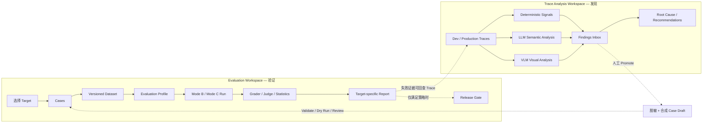
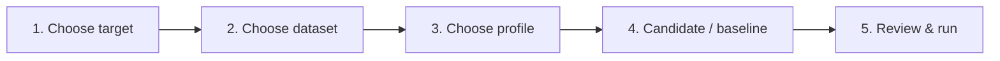
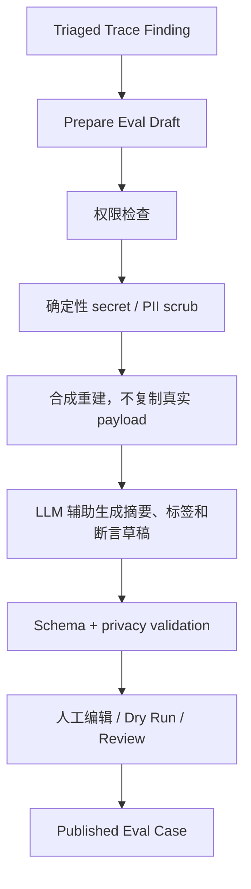

# Evaluation Targets 与 Trace Analysis 双工作台重构方案

> 状态：已评审设计基线（实施进度见 `2026-07-11-implementation-status.md`）
> 日期：2026-07-13
> 最近修订：2026-07-14
> 适用范围：AI Draw.io Agent 管理端、Evaluation Control Plane、Trace 分析能力
> 相关文档：
> - `2026-07-10-agent-evaluation-design.md`
> - `2026-07-10-trace-to-eval-closed-loop-design.md`
> - `2026-07-13-evaluation-control-plane-and-admin-console-design.md`
> - `2026-07-13-evaluation-control-plane-implementation-plan.md`

## 1. 结论

系统应当明确拆成两个可以独立使用的工作台：

1. **Evaluation**：用版本化 Case 和 Dataset 可重复地验证 Agent、Router、Drawing 等能力，输出可比较的指标；只有这条链路可以参与 Release Gate。
2. **Trace Analysis**：分析开发或生产 Trace，使用确定性规则、LLM 和 VLM 发现问题、解释原因并提出优化建议；其结论是调查线索，不直接作为发布阻断事实。

两者不是一条强制串行流水线，只保留一个可选桥接动作：

> Trace Finding → 人工选择“转为 Eval Case Draft” → 脱敏/合成 → Validate/Dry Run → 发布 Case

Evaluation 内部再按**测评目标（Evaluation Target）**分离。第一批正式支持：

- Full Agent
- Intent Router
- Drawing Quality

Tool Policy 和 Response Quality 预留为后续目标。Latency、cost、reliability 是所有目标都能使用的横切指标，不应被建模成目标。

本轮评审后冻结以下设计决策：

- Run 级 `EvaluationProfile` 是执行配置的唯一权威；每个 Run 必须保存解析后的 canonical config 快照和 hash。
- Trace Finding 继续由现有 Candidate 生命周期承载；`TraceFindingView` 只是查询投影，不建立第二套可写状态机。
- Draft 审核期允许在受限 Trace 权限域内回查原 Trace；Published Case artifact 和公开 lineage 必须彻底断链。
- 现有 Case 级 `executionProfile` 仅作为 `LegacyCaseExecutionConfig` 兼容读取，不与 Run 级 Profile 共用语义。
- 历史 Case 的 Target 先按现有元数据推断并输出迁移报告，只把歧义项交给管理员确认，不统一回填为 `FULL_AGENT`。
- Drawing 复用 Full Agent 产物属于 R5 之后的可选派生 Run；第一版只运行独立 Drawing 链路。
- 小样本指标必须显示 count-only/unavailable；延迟样本达到 Profile 阈值后才显示 p95。
- non-required target 失败只形成 warning 和审计记录，不改变总体 Gate；required target 仍按组合规则阻断或产生 `NO_DECISION`。
- Analysis Job 必须复用现有 Miner 调用能力并补持久化编排、预算、幂等、重试和 per-trace 错误隔离。

## 2. 为什么要拆成两条线

### 2.1 Evaluation 回答的问题

- 这个候选版本在固定任务上是否比 baseline 更好？
- Router 的 Accuracy、Macro-F1 和稳定性是多少？
- Drawing 的 XML、图语义、保留度和视觉质量是否达标？
- 完整 Agent 的 TSR@1、延迟、成本和错误率是否满足发布条件？

它要求输入、预期结果、模型配置、重复次数和 Grader/Judge 版本均可追溯。

### 2.2 Trace Analysis 回答的问题

- 最近的开发 Trace 中出现了哪些异常？
- 哪些 success 状态实际上可能是用户失败，例如“回复无法加载”或 edit 后 canvas hash 未变化？
- 慢在哪里、工具失败在哪里、repair 是否异常？
- LLM/VLM 认为可能的语义或视觉问题是什么？应该优先调查什么？

它允许探索性分析和不完整结论，但必须展示证据、置信度和分析器版本。

### 2.3 必须保持的不变量

1. Trace LLM/VLM Finding 不等于 Eval FAIL。
2. Trace Analysis 不直接修改发布 Gate。
3. 只有版本化、可回放的 Eval Case 才能进入 Dataset。
4. 从 Trace 转 Case 前必须先脱敏或合成，发布资产不得保留 `source_run_id`、原始 prompt、真实 XML 或可回链用户的信息。
5. Evaluation 不依赖线上流量；Trace Analysis 没有运营数据时也可分析开发 Trace。
6. 两个工作台共用登录、审计和基础 UI，但 Trace Finding 不能进入 Evaluation Run/Gate 状态机。可选桥接由显式 Promotion orchestrator 协调 Candidate 与 Working Copy 各自的状态；二者仍由各自模块拥有，不能互相直接改写。

## 3. 完整系统视图



虚线是可选协作，不是两条链路的必经步骤。

## 4. Evaluation 的核心领域模型

### 4.1 五个正交概念

| 概念 | 回答的问题 | 示例 |
|---|---|---|
| Target | 测什么能力 | `INTENT_ROUTER` |
| Case | 一道题及其 gold expectation | 用户输入 + 期望 route |
| Dataset Version | 用哪些固定题目测 | `router-core-v3` |
| Evaluation Profile Version | 怎么执行、评分和判定 | real-model、5 repetitions、Macro-F1 |
| Run | 何时用哪个候选版本跑哪套配置 | candidate SHA + dataset + profile |

其中 `EvaluationProfile` 是 Run 级深模块：调用方只选择一个版本化 Profile，内部隐藏 runner adapter、grader 组合、judge 策略、统计和 gate 参数。新增 Agent 时优先新增 Target adapter 和 EvaluationProfile，不复制 Case/Dataset/Run 管理链路。

### 4.2 Evaluation Target

第一批枚举：

```text
FULL_AGENT
INTENT_ROUTER
DRAWING_QUALITY
```

后续可增加：

```text
TOOL_POLICY
RESPONSE_QUALITY
```

不建议第一版把所有内部 Agent 都变成枚举。只有当一个能力拥有独立输入契约、执行 adapter、gold expectation 和指标时，才升级为正式 Target。

### 4.3 Target 与横切维度

以下不是 Target：

- latency
- cost
- timeout/error rate
- stability
- privacy/safety

它们是每个 Run 都可采集的横切维度，由 Profile 决定是否展示或参与 Gate。

### 4.4 Evaluation Profile

建议增加版本化 Profile：

```yaml
profileId: router-release
version: 3
target: INTENT_ROUTER
runnerAdapter: router_live
mode: C
repetitions: 5
graders:
  - route_exact_match@2
metrics:
  - accuracy
  - macro_f1
  - confusion_matrix
  - invalid_route_rate
  - median_latency_ms
  - max_latency_ms
gatePolicy:
  minSamplesPerClass: 20
  minLatencySamplesForP95: 100
  maxAccuracyRegression: 0.01
  maxInvalidRouteRate: 0.005
```

EvaluationProfile 应不可变发布；修改产生新版本。内置 preset 的配置发生任何执行语义变化时也必须递增 version，不能让同一个 `profile_id + profile_version` 指向两份配置。每个 Run 在启动时必须保存解析默认值后的 canonical config JSON 快照及 SHA-256，后续执行和报告只读取 Run 快照，不能重新解释当前代码中的 preset。快照记录 model/version、temperature、runner adapter、grader/judge 版本、prompt/skill/tool policy hash、repetitions、timeout、预算、统计和 Gate 参数；credential 只记录 alias/version，禁止保存密钥。

即使第一版 Profile 是代码中的只读 preset，也必须遵守上述快照规则。`profile_id + profile_version` 用于识别人类可读版本，`profile_snapshot_json + profile_config_hash` 用于历史 Run 的真实还原和完整性校验。

第一批内置 preset：

| Profile | Target | 目的 |
|---|---|---|
| `full-agent-smoke` | FULL_AGENT | 少量 Case、单次运行、开发反馈 |
| `full-agent-release` | FULL_AGENT | 重复采样、Judge、统计与 Gate |
| `router-deterministic` | INTENT_ROUTER | Mode B 验证路由后处理和策略代码 |
| `router-live` | INTENT_ROUTER | Mode C 测真实模型意图识别 |
| `drawing-structure` | DRAWING_QUALITY | XML、graph、preservation、analyzer |
| `drawing-visual` | DRAWING_QUALITY | 在结构检查上增加 VLM Judge |

### 4.5 Case 契约

所有 Target 共用 Case 生命周期和外壳，Target 决定 `input/replay/expected` 的内部 schema：

```yaml
caseId: router-edit-existing-001
version: 1
target: INTENT_ROUTER
title: Edit an existing API node
tags: [router, edit_existing, en]
privacy:
  classification: synthetic
input:
  turns:
    - role: user
      content: Rename API to Gateway
  initialCanvasFixture: simple-api.xml
replay:
  routerReplyFixture: router-edit-existing.json
expected:
  routeType: edit_existing
  mustNotMutateCanvas: true
```

约束：

- Published Case 不可原地修改；修改生成新版本。
- Dataset 默认只能包含同一 Target 的 Case。
- 不允许靠 tag 猜 Target；迁移期可推断，正式契约必须显式存储。
- FULL_AGENT Dataset 可以覆盖多种 route，但它仍然只有一个 Target。
- 跨 Target 的发布总览由 Suite 组合多个 Dataset/Run，不用混合 Dataset 破坏指标语义。

### 4.6 现有 Case 级 ExecutionProfile 的迁移

现有 `EvalCaseDefinition.executionProfile` 包含 model、temperature、credential、prompt/skill/tool policy hash 和价格信息，与本方案的 Run 级 EvaluationProfile 同名但含义不同。不能把它简单解释成提示，也不能让两者静默覆盖。

统一术语和迁移规则：

- 新 Run 级概念统一称为 `EvaluationProfile`，它是执行配置的唯一权威来源。
- 现有 Case 字段在领域和 UI 中称为 `LegacyCaseExecutionConfig`；迁移期可以继续读取序列化字段名 `executionProfile`，但新 Case 不再允许写入 model、credential、temperature 或价格。
- 旧 Case 在没有显式 EvaluationProfile 时，可以把 legacy config 转换成一次性 EvaluationProfile 快照。
- 如果旧 Case 配置与显式选择的 EvaluationProfile 冲突，Run 创建失败并返回 `PROFILE_CASE_CONFLICT`，不允许静默覆盖。
- 历史 Case 迁移完成后删除 legacy 字段；Mode B 的录制回复继续属于 `replay`，不迁入 EvaluationProfile。

## 5. 三类目标怎样执行和评分

### 5.1 Full Agent

执行 adapter：真实完整 Agent，或 Mode B 的 stubbed-model 回放。

输入：多轮用户请求、初始 canvas fixture、可选 replay fixture。
输出：最终 canvas、规范化 EvalTrace、assistant response、tool outcomes、latency/cost。
主要指标：

- TSR@1 及置信区间
- route/tool/task 分阶段通过率
- graph assertion、preservation、XML integrity、visual quality
- response Judge（适用时）
- error/unavailable rate
- latency/cost

Full Agent 报告应提供 funnel：Route → Tool → Mutation → Structure → Semantics/Experience，帮助定位失败阶段。

### 5.2 Intent Router

执行 adapter：

- Mode B：注入录制的 router reply，运行真实后处理/校验/补偿代码。
- Mode C：调用真实 router 模型，读取规范化 route decision。

输入：用户 turns、可选 canvas 摘要。
gold：routeType，以及可选 diagramType/clarification requirement。
主要指标：

- Accuracy
- Macro-F1（只有达到每类最小样本数才报告）
- confusion matrix
- invalid/unparseable route rate
- per-route recall/precision
- 同 Case 多次采样稳定性
- latency/cost

Latency 分位数遵守最小样本规则：每个 Case 只有 5 次采样时只展示 median/max；Run 的 eligible latency 样本达到 Profile 的 `minLatencySamplesForP95`（默认 100）后才展示 p95，并始终同时展示样本数。

Router 页面必须直接显示最常见混淆对，例如 `edit_existing → create_new`，并允许点击进入对应 Episodes。

### 5.3 Drawing Quality

第一版执行 adapter 只运行独立 drawing 链路。复用 Full Agent Episode 最终产物做只读重评分属于 R5 之后的可选优化；启用时必须把 Run 建模为派生 Run，并保存 `source_run_id/source_episode_id`，不在 R4 扩大执行模型。

输入：任务、初始 canvas fixture、可选 tool/LLM replay。
输出：最终 XML、渲染图、变更摘要。
主要指标分层：

1. XML integrity：可解析、唯一 id、无悬空边。
2. Graph assertions：必需/禁止节点和边，严格 canonical map；soft match 只进入 Judge 证据。
3. Preservation：按语义身份匹配，而不是只按 cell id。
4. Deterministic visual analyzer：既有 issue → critical/major/minor 映射。
5. VLM Judge：布局、可读性、层次、遮挡和任务符合度；仅在启用并校准后参与 Gate。

报告采用 before/after 并排预览、结构问题列表、语义断言和视觉评分四个区域。没有 VLM 时仍然是完整可用的结构质量测评，而不是空页面。

## 6. Mode B、Mode C 与目标的关系

Mode 是执行方式，不是 Target：

| Target | Mode B | Mode C |
|---|---|---|
| Full Agent | 固定模型回复，测确定性链路 | 真实模型，测端到端行为 |
| Intent Router | 固定 router reply，测解析/补偿/策略 | 真实 router，测意图识别质量 |
| Drawing Quality | 固定 tool cells/回复，测 XML/patch/analyzer | 真实 drawing 模型，测实际产图质量 |

用户创建 Run 时先选 Target，再选 Dataset/Profile；Mode 由 Profile 预设，Advanced 区域才允许覆盖。这样默认路径简单，同时保留专家能力。

## 7. Evaluation Workspace 信息架构

### 7.1 一级导航

```text
Overview
Evaluation
Trace Analysis
Operations
```

普通 Trace 浏览归入 Trace Analysis，不再把 Candidates 放进 Evaluation 导航。

### 7.2 Evaluation 二级导航

```text
Evaluation Overview
Suites
Cases
Datasets
Runs
Reports
```

`Operations` 保留 Release Gates、Calibration、Canary、Case Health 和 Audit，不与日常跑测入口混合。

### 7.3 Evaluation Overview

首页用能力卡而不是强制流程条：

| 卡片 | 主动作 | 摘要 |
|---|---|---|
| Full Agent | Run smoke suite | TSR@1、最近变化、失败阶段 |
| Intent Router | Run router suite | Accuracy、Macro-F1、最大混淆 |
| Drawing Quality | Run drawing suite | 结构通过率、critical/major、VLM 状态 |

每张卡显示：最近一次 Run、baseline delta、数据量、是否可用于 Gate、一个明确主动作。无数据时展示“创建首个 Case / 使用 synthetic starter dataset”，不展示假的 0%。

### 7.4 Suites

Suite 是面向管理员的使用入口，不一定第一版就新增数据库实体。它可先由“Target + 默认 Dataset + 默认 Profile”组成的前端/配置 preset 实现。

后续若需要跨目标发布检查，再升级为版本化 Composite Suite：

```text
agent-release-suite-v4
  ├─ router-core-v3 + router-live@3
  ├─ drawing-core-v2 + drawing-visual@2
  └─ full-agent-core-v5 + full-agent-release@4
```

### 7.5 创建 Run 向导



默认只展示必要选择：

- Target
- Dataset
- Profile
- Candidate version

重复次数、temperature、judge model、超时和预算收进 Advanced，并展示 Profile 默认值。

Advanced override 必须进入最终 `profile_snapshot_json` 并产生新的 config hash，Run 标记为 `CUSTOMIZED`。如果 override 改变了 Gate 关键参数，而 Profile 未明确允许，则该 Run 只能用于诊断，Gate 输出 `NO_DECISION`。

### 7.6 Target-specific Reports

Run 使用统一详情页外壳，但由 `target` 选择报告 projection：

- `FullAgentReport`
- `RouterReport`
- `DrawingReport`

这些是同一 Run 数据的不同投影，不复制 Run 领域模型。状态必须区分 PASS、FAIL、ERROR、UNAVAILABLE、NO_DECISION；ERROR/UNAVAILABLE 不进入质量分母。

## 8. Trace Analysis Workspace

### 8.1 二级导航

```text
Trace Runs
Findings
Analysis Jobs
Recommendations
```

第一版可以把 Analysis Jobs 和 Recommendations 合并进 Findings 详情，减少页面数量。

### 8.2 Trace Runs

保留现有 timeline、step、tool、latency、canvas hash 和受控 debug payload 查看能力，并增加：

- “Analyze this trace”
- 分析器选择：Deterministic / LLM / VLM
- 当前分析状态与最近 Findings
- 仅在有权限且保留期内显示 debug payload

### 8.3 Findings Inbox

Finding 是“带证据的假设”，不是 Eval 结果。后端继续以现有 `EvalCaseCandidate` 及 `EvalCandidateStatus` 作为唯一事实来源，不新建一套含义重叠的 `trace_finding` 状态机。Trace Analysis UI 使用只读 `TraceFindingView` 投影，把 candidate、deterministic/LLM/VLM evidence 和 review history 组合成管理员看到的 Finding；所有 triage、dismiss 和 promote 写操作仍进入现有 Candidate 生命周期。

现有状态到 UI 分组的固定映射：

| UI 分组 | `EvalCandidateStatus` |
|---|---|
| New | `DETECTED` |
| Triaged | `TRIAGED` |
| Drafting | `DRAFT_READY`、`NEEDS_MANUAL_RECONSTRUCTION` |
| In review | `UNDER_REVIEW` |
| Approved | `APPROVED` |
| Dismissed | `REJECTED`、`EXPIRED`、`PURGED` |
| Promoted | `PUBLISHED` |

Candidate 负责 `DETECTED → TRIAGED → DRAFT_READY/NEEDS_MANUAL_RECONSTRUCTION` 的发现和草拟阶段。创建 Working Copy 后，详细的 Validate/Dry Run/Review/Publish 状态以 `EvalCaseWorkingCopyStatus` 为权威；Candidate 只保存 `UNDER_REVIEW/APPROVED/PUBLISHED/REJECTED` 的粗粒度 Inbox 投影，并由同一编排事务随 Working Copy 关键状态更新，不能由 UI 独立推进两套状态。

`triage`、`dismiss` 和 `promote` 端点必须调用 Candidate/Promotion orchestrator 写入现有状态机；`TraceFindingView` adapter 只能读取 Candidate、Evidence、Working Copy 和 Review history。“Finding 是只读投影”不代表 Findings 页面只读，而是所有写操作都回到已有事实来源，不能写入投影本身。

Finding View 至少投影：

```text
candidate_id
source_run_id
analyzer_type: DETERMINISTIC | LLM | VLM
analyzer_version
failure_family
severity
confidence
summary
evidence_refs
recommendation
candidate_status
ui_status_group
created_at
reviewed_by / reviewed_at
```

列表支持：severity、analyzer、route、agent、status、时间和 latency 区间过滤。详情必须把“模型判断”和“原始证据”分栏展示，避免管理员把语言流畅的摘要误认为事实。

### 8.4 分析职责

| 分析器 | 擅长发现 | 不应做的事 |
|---|---|---|
| Deterministic | tool error、timeout、repair、hash 未变、状态矛盾 | 判断开放式语义/美观 |
| LLM Semantic | 回复与用户意图矛盾、假成功、遗漏、异常交互 | 直接发布 Case、直接改 Gate |
| VLM Visual | 遮挡、布局、层次、视觉退化 | 读取未授权原始 payload |

LLM 可以主动在采样 Trace 上找异常，不必等确定性规则先报警；但需要预算、采样策略、置信度和人工复核。推荐两种入口同时存在：

1. deterministic-triggered：成本低，优先分析已知异常。
2. sampled-discovery：对随机/分层 Trace 直接做 LLM/VLM 分析，用于发现规则未知的问题。

### 8.5 Analysis Job 执行模型

Analysis Job 是持久化异步聚合任务，不是一次长连接 HTTP 模型调用。一个 Job 的 scope 明确为 `SINGLE_TRACE` 或 `SAMPLE_BATCH`，并包含一个或多个 `TraceAnalysisItem`；每个 Item 只对应一个 `source_run_id + analyzer`，独立记录状态、attempt、成本和 Finding。底层复用现有 Semantic/Visual Miner call executor 的独立有界线程池、有限队列和 hard timeout，再由 Analysis Job orchestrator 提供：

- 状态：`QUEUED → RUNNING → SUCCEEDED | PARTIAL | FAILED | CANCELLED`
- single-trace idempotency key：`source_run_id + analyzer_type + analyzer_config_hash`
- sample-batch idempotency key：`sample_definition_hash + trace_snapshot_at + analyzer_type + analyzer_config_hash`
- 入队前预算检查和预算预留
- 并发/队列上限，队列满返回明确的 unavailable/retryable 结果
- 仅对 429、timeout、网络错误等基础设施失败做有限重试；语义结果不自动重试
- per-trace 错误隔离，一个失败样本不翻掉整个 sampling job
- 持久化 analyzer/model/prompt 版本、配置 hash、耗时、成本、attempt 和错误类别

`PARTIAL` 只适用于 `SAMPLE_BATCH`：至少一个 Item 成功且至少一个失败；`SINGLE_TRACE` 只能结束为 `SUCCEEDED/FAILED/CANCELLED`。Batch 的预算、进度和最终状态由 Item 聚合，不能把一个 source_run_id 填进批量 Job 的幂等键冒充整个 sampling snapshot。

已有 Miner executor 只负责单次模型调用隔离，并不等于完整 Job 系统；R6 是在其上接入持久化编排，不重新实现模型 adapter。

### 8.6 优化建议

Recommendation 应尽量结构化：

- suspected layer：router / prompt / skill / tool / XML / UI
- evidence
- expected impact
- suggested experiment
- related findings count
- confidence

它是开发输入，不自动修改 prompt、Agent、Skill 或 Tool。

## 9. 两条工作台之间的桥接契约

### 9.1 Promote 流程



推荐顺序是先确定性脱敏/合成，再把允许的信息交给 LLM。LLM 永远只能生成 Working Copy，不能 publish。

状态顺序固定为：管理员先把 `DETECTED` Finding 标记为 `TRIAGED`，再运行脱敏/合成和 LLM 草拟得到 `DRAFT_READY`，随后打开 Case Studio 创建 Working Copy。`APPROVED` 表示 Working Copy 已通过审核，不是开始草拟的前置状态。

Review 阶段不应盲审。受 Trace Analysis 权限、审计和保留期保护的 Candidate/Finding 可以保留 `source_run_id`；现有 Working Copy 的 `candidate_id` 在 Draft 期提供关联，Reviewer 可从 Working Copy 返回 Finding/Trace 对照任务语义和失败证据，也可由 Findings Inbox 通过 `candidate_id` 查询当前 Working Copy。发布事务把关联转存到 Trace 权限域的受限 promotion link 后，清空 Working Copy 的 `candidate_id`；Published Case artifact 本体始终断链。

### 9.2 Bridge DTO

Trace Analysis 交给 Evaluation 的不是完整 Trace，而是最小 `EvalCaseDraftSeed`：

```json
{
  "target": "DRAWING_QUALITY",
  "syntheticTask": "Rename API to Gateway while preserving all other nodes",
  "syntheticFixtureRef": "fixture://simple-api-v2",
  "suggestedExpected": {
    "requiredLabels": ["Gateway"],
    "forbiddenLabels": ["API"],
    "preserveUnmentioned": true
  },
  "failureFamily": "edit_result_not_loadable",
  "privacyClassification": "synthetic",
  "sanitizerVersion": "3"
}
```

Promote 必须幂等：复用现有 `eval_case_working_copy.candidate_id` 作为 Draft 期的唯一关联方向，并增加可空唯一约束 `UNIQUE(candidate_id)` 及 `findByCandidateId` 查询。第一次 Promote 原子创建 Working Copy；Draft 期重复 Promote 返回已有 Working Copy；并发插入命中唯一约束后回查。现有 `(source_run_id, failure_family)` 唯一约束继续避免同类 Finding 重复入队。不要在 Candidate 侧再增加反向 Working Copy id，避免 Draft 期的双重事实来源。

发布时由 Promotion orchestrator 在同一事务中：校验 artifact 隐私 → 写入受限 `eval_candidate_promotion_link` → 发布 Case Version → 清空 Working Copy `candidate_id` → 把 Candidate 更新为 `PUBLISHED`。之后重复 Promote 返回 `ALREADY_PUBLISHED` 及既有 case/version，不创建新 Draft；`REJECTED/EXPIRED/PURGED` Candidate 返回明确冲突。

Published Case artifact 及其公开 lineage 只记录不可回链 provenance，例如 origin=`trace-derived-synthetic`、sanitizerVersion、reviewer 和 approvedAt；不得保存 source_run_id、candidate id、原始 payload 或真实用户信息。Candidate/Finding 一侧的受限关联可以在权限域和保留期内继续存在，用于审计与问题复盘。

## 10. 持久化模型调整

### 10.1 复用现有模型

继续使用现有：

- Eval Case Working Copy / Published Case
- Dataset / Dataset Version
- Eval Run / Episode / Grader / Judge / Gate records
- Eval Candidate / lineage
- `admin_audit_log`

不新建第二套审计表，也不复制已存在的 result value object。

### 10.2 必要新增字段

建议通过向后兼容迁移增加：

- `eval_case_working_copy.evaluation_target`
- `eval_case_version.evaluation_target`
- `eval_dataset.evaluation_target`
- `eval_run.evaluation_target`
- `eval_run.profile_id`
- `eval_run.profile_version`
- `eval_run.profile_snapshot_json`
- `eval_run.profile_config_hash`
- `UNIQUE eval_case_working_copy(candidate_id)`，并补 `findByCandidateId`

`profile_config_hash` 可以在迁移期复用现有 `execution_profile_hash` 的存储和比较语义，但必须与 canonical `profile_snapshot_json` 同时生成；只有 hash 不能满足历史还原要求。Draft 回链继续使用现有 Working Copy 的 `candidate_id`；发布事务把关联转存到受限 promotion link 后再清空，不在 Candidate 表增加反向 id。

Target 字段的权威和派生顺序必须固定，不能由四张表各自编辑：

1. Draft 阶段以 Working Copy definition 的 Target 为权威。
2. 发布时校验并复制到不可变 Case artifact/`eval_case_version` 快照；发布后 Case Version 是成员 Target 的权威。
3. Dataset 的 Target 从成员 Case Version 推导并在发布时快照，所有成员必须一致，管理员不能单独改值。
4. Run 的 Target 从 Dataset Version 与 EvaluationProfile 共同推导；两者不一致即拒绝创建，成功后在 Run manifest 快照。

因此重复字段用于不可变历史查询和一致性校验，不是四个可独立修改的事实来源。

历史 Target 不统一写成 `FULL_AGENT`。迁移程序根据 tags、diagramType、expected、replay 和现有 runner 信息做一次性推断，并输出逐条迁移报告：高置信记录直接写入 `INFERRED` 结果，歧义记录标记 `AMBIGUOUS` 交给管理员确认。确认完成后字段改为 NOT NULL；无法推断且未确认的数据不能进入新的 Run。

### 10.3 Profile 表

```text
eval_profile
  profile_id
  target
  display_name
  status

eval_profile_version
  profile_id
  version
  runner_adapter
  execution_mode
  config_json
  created_by
  created_at
```

第一版可以只提供内置只读 Profile，不必立即做通用 Profile 编辑器。内置 preset 仍需拥有稳定的 `profile_id/version`；创建 Run 时解析全部默认值，将 canonical config JSON 和 hash 落到 `eval_run`。后续以新 version 修改 preset 时，历史 Run 仍只读取自己的快照，不会改变既有执行语义。等 preset 稳定后再开放管理员 Clone/Edit/Publish，避免过早建设复杂配置 UI。

### 10.4 Trace Analysis 数据

现有 `eval_case_candidate`、review、lineage 和完整状态机继续作为 Trace Finding 的唯一写模型，不新建平行 `trace_finding` 表。前端和查询层使用 `TraceFindingView` adapter 投影管理员需要的名称、状态分组及多分析器证据；adapter 只负责读取组合，不拥有第二套状态。

若单条 candidate 的 `model_evidence_json` 无法容纳多个 analyzer/attempt 的证据，再增加仅追加的 `eval_candidate_evidence` 子表，外键指向 candidate，记录 analyzer/version/config hash/evidence/status/cost/latency；Candidate 的状态和写操作仍留在原表。这样扩展的是证据集合，不是第二个 Inbox。

发布后的审计回链保存在受限 Trace Analysis 表，不进入公开 Case lineage：

```text
eval_candidate_promotion_link
  candidate_id                 PK
  working_copy_id              UNIQUE
  case_id
  case_version
  promoted_at
  retention_expires_at
```

该表和 Candidate 一样受 Trace 权限、审计和保留期控制，禁止序列化进 Case artifact、Dataset、Eval report 或 Git。Draft 期的关联权威是 Working Copy `candidate_id`；发布后关联权威转移为 promotion link，两者不会同时作为可编辑事实。

### 10.5 Analysis Job 表

R6 复用现有 Miner call executor，但持久化编排需要明确落点：

```text
trace_analysis_job
  id
  scope                         SINGLE_TRACE | SAMPLE_BATCH
  analyzer_type
  analyzer_config_hash
  sample_definition_json        SAMPLE_BATCH only
  trace_snapshot_at             SAMPLE_BATCH only
  idempotency_key               UNIQUE
  status
  total_items / succeeded_items / failed_items
  reserved_cost / actual_cost
  created_by / created_at / started_at / completed_at

trace_analysis_item
  id
  job_id
  source_run_id
  analyzer_type
  status
  attempt
  candidate_id                  nullable
  latency_ms / estimated_cost
  error_class / error_message
  UNIQUE(job_id, source_run_id, analyzer_type)
```

Job 是预算、进度和聚合状态的权威；Item 是单 Trace 执行、retry 和错误隔离的权威；Candidate/Finding 仍是被发现问题的权威。Job/Item 属于受限 Trace 数据区，不进入 Evaluation Dataset 或 Gate。

## 11. 建议接口

### 11.1 Evaluation

```text
GET  /admin/evaluation-targets
GET  /admin/eval-profiles?target=INTENT_ROUTER
GET  /admin/eval-profiles/{profileId}/versions

GET  /admin/eval-cases?target=INTENT_ROUTER
POST /admin/eval-case-working-copies
POST /admin/eval-case-working-copies/{id}/validate
POST /admin/eval-case-working-copies/{id}/dry-run

GET  /admin/eval-datasets?target=INTENT_ROUTER
POST /admin/eval-runs
GET  /admin/eval-runs?target=INTENT_ROUTER
GET  /admin/eval-runs/{runId}/report
GET  /admin/eval-runs/{runId}/router-report
GET  /admin/eval-runs/{runId}/drawing-report
```

`POST /admin/eval-runs` 的最小请求：

```json
{
  "datasetId": "router-core",
  "datasetVersion": 3,
  "profileId": "router-live",
  "profileVersion": 3,
  "candidateVersion": "git-sha-or-model-version",
  "baselineRunId": "optional"
}
```

服务端从 Dataset 和 Profile 推导 Target，并拒绝不一致组合，不能信任客户端重复传来的 target。

客户端不提交 Profile snapshot/hash。服务端解析 versioned Profile、应用被允许的 override、生成 canonical snapshot/hash 后原子写入 Run manifest，避免客户端伪造可复现配置。

### 11.2 Trace Analysis

```text
GET  /admin/traces
POST /admin/traces/{runId}/analysis-jobs
POST /admin/trace-analysis-jobs
GET  /admin/trace-analysis-jobs/{jobId}
GET  /admin/trace-findings
GET  /admin/trace-findings/{findingId}
POST /admin/trace-findings/{findingId}/triage
POST /admin/trace-findings/{findingId}/dismiss
POST /admin/trace-findings/{findingId}/promote-to-eval-draft
```

`POST /admin/traces/{runId}/analysis-jobs` 是创建 `SINGLE_TRACE` Job 的便捷入口；`POST /admin/trace-analysis-jobs` 使用显式 sampling definition/filter 和 `trace_snapshot_at` 创建 `SAMPLE_BATCH`。两者进入同一个 Analysis Job orchestrator 和 Item 存储。

旧 `/admin/eval-candidates` 接口可在迁移期保留，由前端新 Trace Analysis 页面调用；路由命名的清理不应阻塞 UI 分离。

## 12. Release Gate 组合方式

每个 Profile 自己定义是否具备 Gate 资格。开发 smoke、未校准 Judge、样本不足或缺封存集时输出 `NO_DECISION`，而不是 PASS。

完整发布可以组合多个目标：

```text
Router Gate       PASS
Drawing Gate      PASS
Full Agent Gate   PASS
Infrastructure    ELIGIBLE
----------------------
Release Decision  PASS
```

组合原则：

- 任一 hard deterministic failure → BLOCK。
- 任一 required target BLOCK → BLOCK。
- required target 缺失或 NO_DECISION → 总体 NO_DECISION。
- non-required target FAIL/BLOCK 不改变总体 Gate 决策，但必须作为 non-blocking warning 展示并进入审计；不得静默忽略。
- ERROR/UNAVAILABLE 剔除质量分母，但超过基础设施阈值时使 Run INELIGIBLE。
- Trace Finding 数量不直接进入 Gate；只有先固化成 Case 并在 Run 中复现才可参与。

## 13. 无真实运营数据时的使用方式

当前阶段推荐优先级：

1. 使用 synthetic Case 建立 Router、Drawing 和 Full Agent 的核心 Dataset。
2. 每次功能开发先跑 Mode B，验证确定性代码和 Grader。
3. 使用小规模 Mode C smoke 测真实模型，不要求 canary 数据。
4. 用开发环境 Trace 运行 deterministic + LLM sampled discovery，积累 Findings。
5. 只把高价值、可合成、可复现的 Finding Promote 为 Case。
6. 暂不把 Canary 和真实 release baseline 作为日常使用前提。

第一批建议数据规模：

- Router：每个主要 route 20 个 synthetic Case；稀有 route 未达到样本下限时只报计数。
- Drawing：20–30 个覆盖 create/edit/layout/preservation/XML 问题的 Case。
- Full Agent：10–20 个关键 happy path + 已知失败回归 Case。
- Trace Analysis：先对开发 Trace 手工/分层抽样，不追求生产代表性。

## 14. 分阶段实施计划

### R0：冻结术语和契约

目标：明确 Target、EvaluationProfile、Dataset、Run、Candidate/Finding View 的含义和不变量。

交付：

- 枚举和 schema 草案
- 当前路由/API/表到新概念的映射
- `EvalCaseDefinition.executionProfile` → `LegacyCaseExecutionConfig` 的兼容和移除规则
- EvaluationProfile 与 Case legacy config 冲突时的 `PROFILE_CASE_CONFLICT`
- Candidate 是 Finding 唯一写模型、TraceFindingView 只读投影
- Working Copy → Case Version → Dataset → Run 的 Target 权威、派生和快照顺序
- Target 自动推断、迁移报告和歧义人工确认规则
- `EvaluationProfileSnapshot` 在 R0 只是 schema 契约，不承担 JSON 脱敏；R3 resolver 完成 canonicalization、credential alias/version 投影和 secret 拒绝之前，禁止把调用方直接构造的快照写入 Run manifest
- 不改运行行为

验收：设计文档、实现状态文档和新增代码使用同一套术语；现有 UI 的 legacy 文案形成明确迁移清单，由不改变运行行为的 R1 统一替换，R0 不提前混入页面重构。

### R1：前端拆成两个工作台

目标：先修正用户心智模型，不改后端行为。

交付：

- 一级导航拆分 Evaluation / Trace Analysis
- Evaluation workflow 移除 Trace Inbox
- `/admin/evaluations` 恢复 Overview，不再重定向 Cases
- Candidate/Miners 迁入 Trace Analysis 导航
- 旧 URL 保留兼容

测试：导航映射、active state、桌面/移动端、空状态、旧深链接。

### R2：Evaluation Target 正式化

目标：Case、Dataset、Run 显式知道自己测什么。

交付：

- 数据库字段和迁移
- DTO/domain validation
- Case Studio Target selector
- Cases/Datasets/Runs target filter
- Dataset 成员同 Target 校验
- Target 推断迁移器及 `INFERRED/AMBIGUOUS` 报告

测试：可推断/歧义旧数据迁移、未确认数据禁止运行、target mismatch、不可变发布、API 权限/CSRF。

### R3：Profile 与内置 Suites

目标：把“怎么测”从页面参数和硬编码中收口到版本化 Profile。

交付：

- Profile domain/port/adapters
- 六个内置只读 Profile
- Run 创建向导
- Overview 三张目标卡
- Profile 与 Dataset Target 一致性校验
- Run 保存 canonical `profile_snapshot_json + profile_config_hash`
- 内置 preset 的执行语义变更必须递增 Profile version
- 内置 preset 发布新 version 后，历史 Run 仍读取原快照
- credential 快照只保存 alias/version，不保存密钥

第一版不做任意 Profile 编辑器。

### R4：Target execution adapters

目标：真正做到按目标只执行所需链路。

交付：

- `FullAgentEvalAdapter`
- `RouterEvalAdapter`
- `DrawingEvalAdapter`
- Mode B/Mode C adapter 选择
- 统一 Episode artifact 与错误隔离
- Drawing 第一版仅独立执行，不引入 source Episode/派生 Run

测试：每个 adapter 至少一个磁盘 Case 端到端跑通；不是只测手写 in-code Case。

### R5：Target-specific metrics 与报告

目标：不同目标展示真正有意义的指标。

交付：

- Router confusion matrix、Accuracy、Macro-F1、稳定性
- Drawing 分层 grader、before/after、issue severity
- Full Agent failure funnel、TSR@1/CI/cost/latency
- 点击指标下钻到 Episodes
- eligible latency 样本不足时只展示 median/max，达到阈值后再展示 p95
- 可选的 Drawing 派生重评分另行设计 `source_run_id/source_episode_id`，不作为 R5 必交付

验收：不使用假数据；样本不足明确显示 unavailable/count-only。

### R6：Trace Analysis UX 重构

目标：Trace 能被确定性规则、LLM 和 VLM 独立分析，并形成可审查 Findings。

交付：

- Trace Runs → Analyze action
- Findings Inbox + evidence/detail
- deterministic-triggered 与 sampled-discovery
- Recommendations
- 现有 Candidate 状态机 + TraceFindingView 只读 projection
- Findings 写操作全部委托 Candidate/Promotion orchestrator，不写入 projection
- `trace_analysis_job/item` 迁移和 repository
- 复用现有 Miner executor 的持久化 Analysis Job 编排、预算、幂等、有限重试和错误隔离

验收：success 状态但“无法加载”、latency 异常、视觉问题均能作为 Finding 展示，不把它们伪装为 Eval FAIL。

### R7：受控 Promote 桥接

目标：把有价值的 Finding 安全地变成可回归 Case。

交付：

- Promote to Eval Draft
- 权限、脱敏、合成、LLM draft、schema/privacy validation
- 现有 Working Copy `candidate_id` 的唯一约束、按 Candidate 查询和并发幂等
- 发布事务写入受限 `eval_candidate_promotion_link` 后清空 Working Copy backlink
- Reviewer 从受限 Finding 回查 Trace 的审查入口
- 人工 Validate/Dry Run/Publish
- 不可回链 lineage

验收：Draft 期重复 Promote 返回同一 Working Copy，发布后重复 Promote 返回 `ALREADY_PUBLISHED`；LLM 不能自动 publish；Reviewer 在权限和保留期内可对照原 Trace；Published Case artifact 不含 source_run_id、candidate id、真实用户信息或原始 payload。

### R8：组合 Release 与运营收口

目标：按目标组合 Gate，并接入已有统计、calibration、sequestered 和 Canary 能力。

交付：

- Composite Suite/required targets（只有出现真实需求时才持久化）
- target gate composition
- calibration/sequestered UI
- CI adapter
- 有真实流量后再启用 Canary 运营指标

## 15. 测试策略

### 15.1 单元测试

- Target/Profile/Dataset 组合验证
- Profile canonical snapshot/hash、preset 变更后的历史还原和 credential redaction
- legacy Case execution config 冲突检测
- Router metric aggregation 和最小样本规则
- latency p95 样本阈值
- Drawing grader 分层
- required/optional target Gate composition
- Candidate → Finding View 状态映射和 privacy validation
- Candidate/Working Copy 分阶段状态所有权和编排同步
- Working Copy `candidate_id` 单向关联、promotion link 转存、发布清空和并发 Promote 幂等

### 15.2 集成测试

- 每个 Target 的磁盘 Case → adapter → grader → persisted episode → report
- Mode B 与 Mode C（Mode C 使用测试模型 adapter）
- 每个 case 错误隔离，不因一个非法 Case 翻掉 batch
- SINGLE_TRACE/SAMPLE_BATCH Job 幂等、预算、聚合状态、retryable/non-retryable 错误和 per-trace 隔离
- Finding → sanitized draft → publish，Draft 期重复 Promote 不重复创建 Working Copy，发布后返回已有结果

### 15.3 前端测试

- 工作台导航分离
- Target filter 和 Run wizard
- 三类报告 projection
- PASS/FAIL/ERROR/UNAVAILABLE/NO_DECISION
- 空数据、样本不足、Judge/VLM 未配置
- 手机和桌面布局

### 15.4 端到端验收场景

1. 管理员创建 Router Case，发布到 router Dataset，运行 Mode C，看到 confusion matrix。
2. 管理员创建 Drawing Case，运行 structure Profile，查看 XML/graph/preservation 结果和 before/after。
3. 管理员运行 Full Agent smoke，点击 funnel 失败阶段进入 Episode。
4. 管理员对开发 Trace 发起 LLM 分析，收到 Finding 和优化建议。
5. 管理员将 Finding Promote 为 synthetic Draft，经 Dry Run 后发布，再跑 regression。
6. 未校准 Judge 或缺封存集时 Gate 显示 NO_DECISION；hard failure 仍然 BLOCK。

## 16. 当前代码到目标结构的最小迁移

| 当前 | 目标 | 策略 |
|---|---|---|
| Evaluation workflow 包含 Trace Inbox | Trace Analysis 独立工作台 | R1 只改导航/页面组合 |
| `/admin/evaluations` 重定向 Cases | Evaluation Overview | R1 恢复 overview |
| Candidates 属于 Evaluation active section | Findings 属于 Trace Analysis | Candidate 保持唯一写模型，TraceFindingView 负责 UI 投影 |
| Case/Dataset/Run 无正式 Target | 显式 `evaluation_target` | R2 向后兼容迁移 |
| Case 级 `executionProfile` | `LegacyCaseExecutionConfig` | R0 冻结冲突规则，R3 迁移到 Run 快照 |
| Run 参数分散且只有 hash | EvaluationProfile version + resolved snapshot/hash | R3 内置 preset 收口并保证历史还原 |
| 统一结果展示 | Target-specific projections | R5 复用同一 Run 数据 |
| Trace miner/candidate 已有后端 | Trace Findings UX | R6 接线，不重建已有能力 |

这次重构应保持手术式：先分导航和用户心智，再补 Target/Profile 契约，最后增加专用执行与报告。不要为了页面分组复制后端领域模型，也不要把 Trace Finding 强行塞进 Evaluation Run。

## 17. 完成定义

满足以下条件时，本方案完成：

- 管理员能清楚区分“测评验证”和“Trace 调查”。
- Router、Drawing、Full Agent 各有独立入口、Case 约束、Profile、指标和报告。
- 新增 Target 时只需增加 target schema、execution adapter、Profile 和 report projection，不复制 Case/Dataset/Run 平台。
- Trace 可由 deterministic、LLM、VLM 主动发现问题并给出证据/建议。
- Trace 与 Evaluation 可独立使用，也可通过受控 Promote 形成闭环。
- 只有 Evaluation 的版本化结果参与 Release Gate。
- 无线上流量时仍能通过 synthetic Dataset、Mode B、少量 Mode C 和开发 Trace 获得有效反馈。
