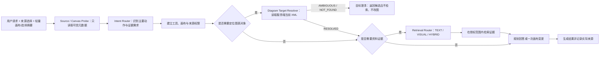

# 多模态资料库与图表册 PRD

> 状态：Review 基线已确认，进入技术设计
>
> 文档位置：`docs/multimodal-library-chartbook`
>
> 日期：2026-07-18
>
> 需求事实来源：本次产品讨论会话
>
> 文档边界：描述产品需求、行为规则、首版范围和验收口径；具体技术实现方案在独立技术开发文档中研究与设计。

> **规范覆盖（2026-07-26）**：本文仍是产品范围、owner/scope、lifecycle/retention、citation persistence 与 target resolution 的历史需求基线。其 turn/source sequencing 与来源选择语义已被 [ADR 0013](../adr/0013-freeze-turn-context-source-execution-contract.md) 取代；实现顺序以 [Wayfinder](./2026-07-25-context-memory-source-wayfinder.md) 为准。本文中旧的 `AUTO/EXPLICIT/EXPLICIT_ONLY/NONE`、逐消息 source selection、Personal Library 自动纳入、Router 前置 Source Probe/snapshot、断流取消产品 turn 和无 claim 的执行顺序均不得继续实现。当前合同改用 current-message attachment binding、typed source demand、Resolver/Pre-Planner、条件 Probe、source-aware plan 后 snapshot，以及 disconnect-only detach；Required fail closed，Optional fallback 必须由 Planner 签发。

## 1. 文档目的

本文档整理本次会话中已经确认的多模态、资料库、图表册、检索、引用追踪、版本管理和降级需求，作为后续技术方案与实施拆分的产品依据。

本文档采用以下标记：

- **已确认**：本次会话中已经达成一致，后续设计应满足。
- **评审确认项**：不阻断需求成稿，但需要在 Review 时最终确认。
- **规划参考**：用于容量或运营预估，不构成对用户的产品承诺。

仓库中其他既有文档可能未及时更新，不作为本 PRD 的需求事实来源。若其他文档与本文冲突，应先回到本次会话和本 PRD Review 结论进行确认。

## 2. 背景与问题

当前产品的核心能力是用户通过自然语言让 AI 创建、修改或审查图表。新的需求希望把图片和 PDF 变成一等输入，使 AI 不仅能根据用户的一句话绘图，还能基于用户提供的真实资料完成以下任务：

- 对一篇或多篇文章进行归纳、整理，并转换成流程图、思维结构图或其他图表。
- 从一篇提到 Agile Development 的文章中抽取 Agile 流程，并绘制有来源依据的流程图。
- 理解 PDF 中的正文、图片、表格和已有图表，避免只读取文字而遗漏重要信息。
- 将一次性上传的资料保存为可长期复用的个人资料，并在之后的绘图或问答中自动检索。
- 在多个相关图表之间共享同一组资料，同时保留每张图自己的引用版本和证据。
- 对 AI 使用过的个人资料或第二阶段加入的联网资料进行明确标注，使用户可以追溯图表结论来自哪里。

这不只是“增加文件上传”。产品需要同时解决资料作用域、长期与临时存储、多模态解析、自动与指定检索、来源可信度、版本固定、删除生命周期、模型能力差异，以及检索服务故障时不影响普通文本绘图等问题。

## 3. 产品目标

### 3.1 首版目标

1. 支持用户上传 PDF 和常见图片，并让 AI 基于其中的文字与高价值视觉内容绘图或回答问题。
2. 提供独立的“资料库”入口，支持长期资料的上传、搜索、管理和复用。
3. 提供“图表册”，让一个主题下的多张图表共享资料和上下文，但不引入多人协作。
4. 同时支持“指定引用”和“自动引用”，并让用户知道本次实际使用了哪些来源。
5. 建立从图表元素到文件版本、页码、区域和证据片段的来源追踪能力。
6. 保证已有纯文本绘图路径是基础能力；多模态或向量检索故障不能拖垮普通文本绘图。
7. 支持资料版本、回收站、临时资料过期和正在读取时的安全清理。
8. 支持用户在当前图表对话中围绕图表整体、节点或连线进行有来源依据的追问，默认不修改画布。
9. 在首版控制复杂度：不做视觉风格搜索、不做多人协作、不把产品扩展成 PDF/OCR 编辑器或独立的通用 RAG 聊天产品。

### 3.2 第二阶段目标

1. 增加默认关闭的联网补充能力，并保留查询脱敏、实际使用来源记录和严格来源模式禁止联网等约束。
2. 增加 PDF 和图片的引用增强导出，包括 PDF 参考资料页、图片短来源列表和独立引用报告。Draw.io 文件内可恢复的来源元数据仍属于首版。

### 3.3 非目标

- 不要求 AI 对所有复杂表格、工程图或手写内容做到完全准确。
- 不建立企业级合规、组织权限或团队协作体系。
- 不在本 PRD 中确定完整的服务拆分、数据库表、消息队列、索引结构或模型供应商实现。
- 不让资料内容参与系统权限或工具授权决策。

## 4. 核心产品原则

### 4.1 资料有明确边界

资料始终归用户所有，但“在哪里可被检索”由其作用域决定：本图、图表册、个人资料库或临时会话。关联不等于复制，解除关联不等于删除原资料。

### 4.2 自动检索应有感知、可控制

对需要事实或知识的绘图请求，系统可以主动检索用户资料；对纯样式、移动和布局请求不检索。用户可以指定资料、限制只能使用所选资料，也可以关闭当前任务的自动检索。

### 4.3 来源透明，不制造引用

只有实际参与答案或图表生成的来源才能被标注。个人资料、第二阶段加入的联网资料和 AI 常识必须明确区分。来源冲突、不可用或用户语义修改造成的当前引用解除不能被隐藏。

### 4.4 旧图稳定，新图前进

已有图表继续使用其创建时固定的资料版本；新图默认使用最新版本。升级旧图必须由用户明确触发。

### 4.5 多模态是增强能力，不是单点故障

当检索、多模态解析或视觉模型不可用时，系统按请求约束降级。普通文本绘图继续可用；“仅使用所选资料”的请求则宁可停止，也不能无依据生成。

### 4.6 来源内容不可信

上传文件和第二阶段加入的网页内容只能作为知识证据，不能改变意图路由、工具权限、系统策略或数据访问边界。

## 5. 目标用户与核心场景

### 5.1 目标用户

首版面向个人用户，主要处理个人学习资料、公开资料和普通工作文档。用户规模预计较小，不以团队或企业部署为首要目标。

### 5.2 核心场景

#### 场景 A：一次性根据文章绘图

用户在绘图界面上传一篇 PDF，要求“总结整篇文章并画成流程图”。资料默认服务于当前图或当前会话。系统解析正文，并抽取少量高价值图片、表格或已有图表参与总结，最后展示实际使用的页码与证据。

#### 场景 B：长期复用权威指南

用户通过“资料库”上传《Agile Practice Guide》。之后用户只说“画一张 Agile 流程图”，未显式指定资料。系统自动检索资料库，发现该指南与请求相关，使用它作为依据并标明来源；首版没有相关资料时按来源策略决定是否使用并明确标记 AI 常识，第二阶段才允许联网补充。

#### 场景 C：指定资料且禁止其他来源

用户选择若干文件，并开启“仅使用所选资料”。系统只能基于这些文件回答或绘图。若资料不足、未解析完成或不可用，系统必须说明问题并停止相关生成，不能偷偷使用其他资料或 AI 常识补齐；第二阶段加入联网后也不得使用网页内容补齐。

#### 场景 D：一个主题包含多张图

用户创建一个“Agile 转型”图表册，其中包含总览图、迭代流程图和角色职责图。图表册中的共享资料可被这些图共同检索；每张图仍保存自己实际使用的资料版本和证据。

#### 场景 E：PDF 中本身包含图表

指南 PDF 中包含流程图、表格或关系图。上传时系统生成可检索的正文块、页面信息、图片/图表区域、标题说明和位置关联。查询时由请求决定使用文本、视觉或混合检索，而不是每次强制使用所有模态。

#### 场景 F：资料更新但旧图不漂移

一张已创建的图引用资料 V1。用户上传同一资料的 V2 后，旧图继续使用 V1，并收到“有新版本可用”的非阻断提醒；新图默认使用 V2。用户可以查看影响并主动升级旧图。

#### 场景 G：围绕当前图表进行资料问答但不绘图

系统根据资料绘制流程图后，用户选择或明确提到其中的“Product Owner”节点，并追问“这里为什么由 Product Owner 负责？”。系统结合当前图表语义、该节点已有来源和当前允许的资料范围给出带引用回答，但不修改画布。首版资料问答服务于当前 Draw.io 图表及其对话，不提供独立的通用 RAG 聊天入口。

#### 场景 H：检索系统暂时不可用

用户只输入“画一个番茄钟流程图”，没有要求使用资料。系统绕过或降级不可用的检索能力，继续走普通文本绘图，并提示本次未使用外部资料。若用户要求“仅根据已选 PDF 绘图”，则停止生成并提示资料暂不可用。

## 6. 领域模型与归属边界

### 6.1 核心对象

| 对象 | 定义 | 关键边界 |
|---|---|---|
| 图表 | 一张独立画布及其对话、来源引用和版本固定信息 | 可独立存在，也可以且最多属于一个图表册 |
| 图表册 | 用户围绕一个主题创建的多图容器 | 包含多张图；资料可在册内图表之间共享；不代表多人共享 |
| 资料 | 用户上传或保存的逻辑文档/图片 | 归用户所有，可拥有多个版本，可被多个作用域关联 |
| 资料版本 | 一次内容确定、不可变的资料快照 | 已有图表固定具体版本；新图默认最新版本 |
| 资料关联 | 资料与图表、图表册或个人资料库之间的关系 | 解除关联不删除资料，不重复解析相同版本 |
| 证据单元 | 可用于支持结论的文本、图片、图表或表格片段 | 关联资料版本、页码、区域、摘录和模态 |
| 来源引用 | 图表元素或回答结论与证据单元之间的关系 | 只记录实际使用的来源，并具有验证状态 |
| 临时资料 | 仅跟随一个图表会话、到期自动清理的资料 | 默认不进入长期资料库，可由用户主动保存 |

### 6.2 资料作用域

| 作用域 | 可被谁使用 | 典型入口 | 默认行为 |
|---|---|---|---|
| 本图资料 | 当前图表及其当前、后续对话 | 绘图界面选择“保存为本图资料” | 随图表保留，但不自动进入个人资料库 |
| 图表册共享资料 | 同一图表册中的图表 | 图表册内上传或从资料库添加 | 图表册上传默认只进入共享资料；“同时保存到资料库”默认不勾选 |
| 个人资料库 | 用户后续的独立图表或图表册 | 独立“资料库”入口，或从临时/局部资料主动保存 | 可被自动检索，也可由用户显式选择 |
| 临时会话资料 | 当前图表会话 | 临时上传 | 24 小时滑动过期，除非主动保存为长期资料 |

### 6.3 归属与关联规则

- 资料的所有权属于上传用户，不属于图表册。
- 在图表册内上传的资料默认成为“图表册共享资料”，不会默认进入个人资料库。
- 图表册上传时提供“同时保存到资料库”选项，默认不勾选。
- 个人资料库中的资料可以按引用方式添加到一个或多个图表册，不复制原文件、不重复解析。
- 从图表册移除资料只解除册内关联，不删除个人资料库中的资料。
- 图表册外的独立图表可以自动或显式引用个人资料库。
- 在全局入口创建的新图默认独立存在；在图表册中创建的新图默认属于该图表册；后续允许移动。
- 图表迁出图表册后，原图表册共享资料立即退出该图后续的自动检索范围；已经生成的来源链、固定版本和历史引用继续保留，系统不自动改写图表。若之后仍需使用该资料，用户应将它关联到新图表册、本图或个人资料库。
- 同一份逻辑资料可以有多个版本，也可以同时被多个图表或图表册引用。

## 7. 信息架构与入口

### 7.1 资料库入口

产品提供独立的“资料库”入口，支持：

- 上传 PDF 或图片作为长期资料。
- 查看处理状态、版本、大小、页数、更新时间和被引用情况。
- 按名称、标签、类型、处理状态和更新时间筛选。
- 关键词搜索、全文搜索和语义搜索。
- 预览解析结果，重新处理或排除页面。
- 将资料添加到一个或多个图表册。
- 查看引用该资料或版本的图表。
- 移入回收站、恢复或永久删除。

首版资料组织采用扁平结构配合标签和筛选，不提供嵌套文件夹。

### 7.2 绘图界面入口

绘图界面提供轻量的资料入口：

- 上传到当前图表上下文，并明确区分“临时使用（仅当前 session）”与“保存为本图资料”，不得将两种生命周期混为同一选项；具体默认项见评审确认项。
- 从个人资料库选择资料。
- 查看当前图已固定的来源和版本。
- 控制“自动检索资料库”。
- 选择“仅使用所选资料”。
- 根据当前请求允许或禁止联网搜索（第二阶段）。
- 将本图资料主动保存到个人资料库。

长期保存不应被强制。以下情形适合主动加入资料库：

- 预计会跨会话、跨图表或跨图表册重复使用。
- 资料是稳定、权威或需要持续引用的依据。
- 用户希望保留版本、来源追踪或之后进行资料问答。
- 同一主题将产生多张图，资料值得在图表册内共享。

一次性阅读、短期草稿或用户不希望长期保留的内容，默认留在本图或临时会话范围。

### 7.3 图表册入口

图表册详情至少包含：

- 图表列表。
- 共享资料列表。
- 从个人资料库添加资料。
- 在册内上传资料。
- 册内默认联网搜索偏好（第二阶段）。
- 资料更新及受影响图表提醒。

“共享资料”仅表示图表册内多张图共享，不表示多人协作或公开分享。

## 8. 功能需求

### 8.1 上传与文件支持

| ID | 需求 |
|---|---|
| FR-UP-001 | 首版支持数字 PDF、PNG、JPEG 和 WebP。 |
| FR-UP-002 | 扫描 PDF 采用 OCR/视觉理解的尽力处理，并向用户显示质量提示。 |
| FR-UP-003 | 上传接口应快速确认接收；解析、OCR 和索引可异步完成。 |
| FR-UP-004 | 用户离开页面后，后台处理仍可继续。 |
| FR-UP-005 | 在会话内上传资料后，依赖它的当前请求进入“等待资料”状态，并在同一消息流中持续显示处理阶段或进度；所有必需资料达到可用状态后才自动进入检索和生成，不能只使用已就绪部分或假装已经使用全部资料。用户可随时停止当前回复。 |
| FR-UP-006 | 系统保留不可变原始文件，并生成可重建的派生内容。 |
| FR-UP-007 | 超出限制时明确拒绝或提示处理方式，不能静默截断页数、文件或图片。 |
| FR-UP-008 | 对复杂表格、工程图和手写内容明确提示首版准确性边界。 |
| FR-UP-009 | 从资料库或图表册资料入口上传的资料与单个对话请求解耦；依赖请求发现资料尚未就绪时，不进入等待型对话，也不使用部分结果，而应显示准确的当前阶段与“资料仍在处理中，请完成后重试”等提示。文件字节已接收后不得继续显示为“未完成上传”。 |
| FR-UP-010 | 会话内上传进入“等待资料”后，用户点击“停止”只取消当前回复以及尚未执行的检索、生成和画布变更，不取消资料的后台解析与索引。若需终止资料处理，用户必须单独移除该资料；被停止的回复不得产生回答或修改画布。 |

### 8.2 解析与多模态派生内容

上传并不意味着每次查询都要读取整份 PDF。系统在资料处理阶段建立可检索结构，包括：

- 页面和页码。
- 语义文本块及其页内坐标。
- OCR 文本及质量信息。
- 页面图片。
- 检测到的图片、图表或表格区域及裁剪结果。
- 图片/表格标题和邻近正文。
- 文本与视觉区域之间的双向关联。
- 用于检索的文本和视觉表示。

| ID | 需求 |
|---|---|
| FR-IN-001 | 数字 PDF 应优先保留原生文本和结构；扫描页再使用 OCR/视觉处理。 |
| FR-IN-002 | PDF 中的重要图表、表格和图片应作为独立证据单元，而不是只保留整页截图。 |
| FR-IN-003 | 文本命中时可扩展到附近图片/表格；视觉命中时可扩展到标题和周围正文。 |
| FR-IN-004 | “总结整份文档”应自动检查少量高价值视觉内容，即使正文看似足够。 |
| FR-IN-005 | 不要求每次将所有页面发送给视觉模型，应按请求和价值选择有限内容。 |
| FR-IN-006 | 用户可预览解析结果、重新处理资料或排除指定页面。 |
| FR-IN-007 | 首版不提供逐字 OCR 编辑器。 |

### 8.3 处理状态

用户可见的资料处理状态包括：

1. 上传中。
2. 提取中。
3. OCR/视觉处理中（如适用）。
4. 索引中。
5. 已就绪。
6. 部分就绪。
7. 处理失败。

“部分就绪”是处理已经结束但部分页面或模态不可用的终态，必须说明缺失范围。依赖它的请求不得自动继续，应暂停并让用户选择重试失败部分、明确使用已就绪部分继续或停止当前回复。失败后允许重试；系统重试不重复向用户计量。

| ID | 需求 |
|---|---|
| FR-PS-001 | 资料内容未变化时，因重新处理、排除页面或 OCR、解析器、Embedding、视觉模型变化产生的新结果应创建内部“处理修订”，不得创建新的资料版本。 |
| FR-PS-002 | 每个处理修订都是不可变结果；新修订达到可用状态后才可原子切换为后续检索使用的活动修订，失败或未完成的修订不得影响当前活动修订。 |
| FR-PS-003 | 新检索默认使用活动处理修订；已有来源引用继续固定到生成时使用的资料版本和处理修订，直到用户主动重新验证。 |
| FR-PS-004 | 会话内上传进入“部分就绪”后必须结束自动等待并暂停当前回复，向用户提供“重试失败部分”“使用已就绪部分继续”和“停止回复”，不得自动跳过失败页面或模态。 |
| FR-PS-005 | 用户明确选择使用已就绪部分继续时，回答或图表必须展示未覆盖的页码或模态，且不得声称已经覆盖整份资料。 |

### 8.4 资料版本

| ID | 需求 |
|---|---|
| FR-VE-001 | 资料的每个版本是不可变快照。 |
| FR-VE-002 | 在同一所有权范围内，普通上传内容哈希相同的文件时应复用已有版本，并只增加目标作用域所需的资料关联，避免创建无意义版本和重复处理；不得通过命中结果、响应时序或派生物复用泄露其他用户是否拥有相同文件。 |
| FR-VE-003 | 只有用户从已有资料明确执行“上传新版本”且内容发生变化时，才在同一逻辑资料下创建新版本。 |
| FR-VE-004 | 已有图表继续使用其固定版本，不因最新版本变化而自动漂移。 |
| FR-VE-005 | 新图默认使用资料最新可用版本。 |
| FR-VE-006 | 旧图出现新版本时提供非阻断站内提醒，显示受影响图表，并提供查看差异、升级或忽略。 |
| FR-VE-007 | 旧图升级版本必须由用户明确触发，并重新验证受影响证据。 |
| FR-VE-008 | 普通上传的文件即使与已有资料同名，只要内容不同，也应创建独立逻辑资料；系统不得仅凭文件名推断版本关系。 |

### 8.5 临时资料与 24 小时规则

临时资料逻辑上跟随单个图表对话/会话，但不能依赖浏览器 HTTP Session 或单机内存作为持久身份。它需要稳定的临时会话标识，以支持后台处理和服务重启后的访问控制。

| ID | 需求 |
|---|---|
| FR-TM-001 | 临时资料采用 24 小时滑动有效期，并以服务端 UTC 时间计算。 |
| FR-TM-002 | 对临时会话而言，上传、选择/移除资料，以及真正使用资料的提问/追问，属于有效用户活动；资料被移除后立即退出当前会话，不因这次操作延长该资料自身的可用期。 |
| FR-TM-003 | 状态轮询、后台解析、心跳、浏览器页面保持打开，不延长有效期。 |
| FR-TM-004 | 每次访问先检查是否过期，定时清理只是补充机制，不能成为唯一过期判断。 |
| FR-TM-005 | 对象存储生命周期规则作为最终兜底，不代替应用层权限和到期判断。 |
| FR-TM-006 | 用户可以在到期前将临时资料保存到本图或个人资料库；该操作完成生命周期转换并终止临时 TTL，而不是刷新临时 TTL。 |
| FR-TM-007 | 到期后不接受新任务，但已经取得有效读取租约的 AI 任务可以完成。 |
| FR-TM-008 | 登录用户的临时资料到期后先进入回收站，立即停止新检索和新租约；已有读取租约完成后再完成迁移。 |
| FR-TM-009 | 匿名临时资料到期后不进入回收站且不可恢复；系统立即阻断新检索和新租约，已有读取租约完成或超时后，自动永久删除原文件、派生物、Pinecone 投影和其他资料内容。 |
| FR-TM-010 | 登录用户从回收站恢复临时资料时，应恢复到原图表会话的临时作用域，并从恢复时刻重新获得 24 小时有效期；不得自动转换为本图资料或个人资料库资料，但应提供显式转换入口。 |

### 8.6 回收站、删除与读取租约

| ID | 需求 |
|---|---|
| FR-DE-001 | 长期资料被用户删除、登录用户的临时资料被移除或到期时，默认先进入回收站并保留 30 天；匿名临时资料不进入回收站。 |
| FR-DE-002 | 进入回收站后立即从新检索中排除，但在永久删除前可恢复。 |
| FR-DE-003 | 回收站显示预计永久删除时间。 |
| FR-DE-004 | 永久删除前显示受影响的图表册、图表和固定版本，并要求明确确认。 |
| FR-DE-005 | 永久删除清理原文件、全文、派生图片、OCR、向量和引用材料化数据。 |
| FR-DE-006 | 后台清理遇到正在被 AI 读取的资料时，应跳过具有有效租约的对象。 |
| FR-DE-007 | 删除/到期后不再颁发新租约；已有租约完成或超时后再清理。 |
| FR-DE-008 | 从图表册移除资料仅解除关联，不进入资料回收站。 |
| FR-DE-009 | 资料进入已过期、回收站或删除中状态后，任何迟到的解析、OCR、嵌入或索引任务都不得重新写回并使资料“复活”；永久删除只有在无有效租约且派生数据清理完成后才算完成，失败时保留删除标记并继续重试。 |
| FR-DE-010 | 永久删除后，历史图表及引用关系保持可查看，但引用只保留不可恢复内容的墓碑：引用 ID、资料/版本不透明 ID、版本序号、删除时间和“来源不可用”状态；原文件名、摘录、页码/区域、预览及其他资料内容必须删除。 |
| FR-DE-011 | 永久删除资料不自动改写已生成的图表内容；用户若需清除图表中已经生成的内容，应另行编辑或删除图表。 |

> **历史章节标记**：以下来源模式和“用户选择资料”要求只保留为旧产品讨论记录。它们与 ADR 0013 冲突的部分不再验收；普通任务的 zero-source 约束、Project AUTO 不包含 Personal Library、Direct current-attachment authority 和 strict grounding 以 ADR 0013 为准。

### 8.7 自动引用与指定引用（历史语义，已被 ADR 0013 取代）

产品支持两种并存的资料使用方式：

- **指定引用**：用户明确选择文件、版本、本图资料或图表册资料。
- **自动引用**：系统根据任务检索当前允许范围内的相关资料。它既可以在用户未指定资料时独立工作，也可以在非严格模式下补充用户指定资料；指定资料始终优先。

| ID | 需求 |
|---|---|
| FR-RE-001 | 对带知识内容的绘图、内容修改或资料问答，自动资料检索默认开启。 |
| FR-RE-002 | 对纯样式、位置、大小、颜色或布局操作，不调用资料检索。 |
| FR-RE-003 | 指定资料的优先级高于自动发现的资料。 |
| FR-RE-004 | 自动检索只注入与当前请求相关的有限证据，不能将整个资料库塞入模型上下文。 |
| FR-RE-005 | 用户可以关闭当前任务/图表的自动资料检索；该操作不默认修改全局偏好。 |
| FR-RE-006 | “仅使用所选资料”禁止个人资料库自动补充和 AI 常识补齐；第二阶段加入联网后也禁止联网搜索。 |
| FR-RE-007 | 首版没有找到资料时，可使用 AI 常识，但必须标记“无外部引用”。 |
| FR-RE-008 | 第二阶段的联网搜索默认关闭，可为当前请求开启，并可在图表册中设置偏好。 |
| FR-RE-009 | 第二阶段的联网搜索只应提交安全、概括后的查询，不能泄露私有文档正文。 |
| FR-RE-010 | 有效来源策略的覆盖顺序从高到低固定为：权限、过期与删除等硬性安全约束；当前请求的显式选择；当前对话继承的来源上下文；当前图表设置；所属图表册偏好；用户全局偏好；系统默认值。 |
| FR-RE-011 | 高层设置覆盖低层设置，但任何产品设置都不能放宽权限或生命周期约束；“仅使用所选资料”一经生效，不允许个人资料库补充或 AI 常识兜底，第二阶段也不允许联网兜底。 |
| FR-RE-012 | 当前请求的临时选择默认只影响本次请求；成为对话来源上下文的资料范围和固定版本可供追问继承，直到用户清除、改选或开始新对话。新对话不得继承旧对话的临时来源选择。 |
| FR-RE-013 | 在非严格模式下资料证据不足时，AI 常识可以补充结果，但必须在结论级单独标记“无外部引用”，不得挂到文件或网页引用之下。 |
| FR-RE-014 | 结果的关键结论同时包含外部证据和 AI 常识时，整个回答或图表应显示“部分有依据”；“仅使用所选资料”模式下证据不足必须停止并说明缺口。 |

产品行为上的引用策略可表达为：

| 模式 | 含义 | 允许回退 |
|---|---|---|
| NONE | 当前任务不需要资料，例如纯样式修改 | 不检索 |
| AUTO | 系统自动选择相关资料 | 首版可回退到 AI 常识；第二阶段可按允许范围联网补充 |
| EXPLICIT | 优先使用用户所选资料，必要时可按设置补充 | 首版取决于自动资料检索设置；第二阶段再加入联网设置 |
| EXPLICIT_ONLY | 仅使用所选资料 | 不允许任何外部补充 |

默认来源查找顺序为：

1. 用户显式选择的资料与版本。
2. 当前图表的本图资料。
3. 当前图表册的共享资料。
4. 个人资料库中的相关资料。
5. 联网搜索（第二阶段，仅在允许时）。
6. AI 常识（仅在未要求严格依据时）。

该顺序表示候选优先级，不意味着每次都必须逐层查询。系统应在已有高质量证据足够时停止扩展。

### 8.8 意图识别、检索路由与安全顺序（历史顺序，已被 ADR 0013 取代）

> 本节的“意图识别前 Source/Canvas Probe”和“先建立来源权限再路由”顺序已废止。新顺序为 sticky assignment → atomic claim/binding → Base Context → Semantic Router 与 restricted-input Demand Interpreter → Resolver/Pre-Planner → 条件 Probe → typed Planner → source snapshot。

检索路由器位于意图识别之后；在意图识别前只允许进行轻量的资料探测。

Source Probe 只可读取以下可信元数据：

- 用户显式选择的资料 ID。
- 权限和作用域。
- 固定版本与最新版本信息。
- 处理是否就绪。
- 标题、MIME 类型、页数。
- 是否检测到图片/表格。
- OCR 质量概况。

Source Probe 不读取正文、图片内容，不调用视觉模型，不联网搜索，也不让资料内容参与意图和工具权限判断。

Intent Router 可以接收是否存在画布、选择数量和已校验 cell 类型等轻量摘要，但其模型输入不得包含完整 Draw.io XML。需要定位当前图表对象时，由权限建立后的 Diagram Target Resolver 读取服务端保存的当前版本 XML：已选 cell ID 优先精确定位；没有选择时再根据用户文字和图表结构解析。客户端提交的 cell ID 与画布版本必须由服务端重新校验。

检索路由行为：

| 路由 | 适用情况 | 典型证据 |
|---|---|---|
| NONE | 闲聊、产品帮助、纯样式/布局操作 | 无 |
| TEXT | 定义、职责、规则、段落事实，以及明确限定于所选段落/章节且无需理解图表的文本摘要 | 原生文本或 OCR 文本 |
| VISUAL | 用户明确询问某张图/表、箭头关系、扫描页或 OCR 质量差 | 图片、图表、表格区域 |
| HYBRID | 整份文档总结、文字与图相互补充、路由不确定、单模态证据不足 | 有限文本与高价值视觉证据 |

当路由器无法可靠判断只用文本还是视觉时，自动选择受限的混合检索，不打断用户，并在结果中说明使用了哪些模态和页面。

### 8.9 复合请求与多意图

面向用户称为“复合请求”，表示一个目标包含多个有先后关系的步骤。

| ID | 需求 |
|---|---|
| FR-MI-001 | 一个用户回合最多执行一次主要画布变更，避免多次不可控修改。 |
| FR-MI-002 | “先总结，再绘图”可自动顺序执行，并复用同一组已验证证据。 |
| FR-MI-003 | “不要修改画布，但请把节点改成……”存在直接冲突时，应询问用户。 |
| FR-MI-004 | 同时要求“新建一张图”和“修改当前图”时，应拆分或澄清。 |
| FR-MI-005 | 一次请求要求创建多张图时，先给出图表册/图表计划并确认，再分别执行。 |
| FR-MI-006 | 文本总结成功但绘图失败时，保留成功的总结和引用，只重试绘图步骤。 |
| FR-MI-007 | 单次画布变更应保持原子性，失败不能留下半完成结构。 |

### 8.10 资料问答与对话继承

| ID | 需求 |
|---|---|
| FR-QA-001 | 首版支持当前图表对话内的图表证据问答，用户可围绕图表整体、节点或连线及其关联资料追问；回答带来源且默认不修改画布，不提供独立的通用 RAG 聊天入口。 |
| FR-QA-002 | 普通闲聊或产品帮助保持原有直接回答行为，无需资料检索。 |
| FR-QA-003 | 对话追问继承当前允许的资料作用域和已固定版本。 |
| FR-QA-004 | 每个追问仍根据新问题重新检索，不简单复用上一轮文本上下文。 |
| FR-QA-005 | 用户可以清除来源范围、改选资料或明确切换到最新版本。 |
| FR-QA-006 | 凡要求依据资料的问答，Intent Router 只识别问答意图和证据需求，不直接生成最终答案；请求必须经过 Retrieval Router，再由有依据的回答阶段根据实际证据生成答案和引用。仅普通闲聊和产品帮助允许直接回答。 |
| FR-QA-007 | 用户选择或明确提到图表节点或连线后追问时，系统应把对应语义 cell、当前图表语义和该引用单位的现有来源作为问题上下文；除非用户同时明确要求修改，否则该回合不得产生画布变更。 |
| FR-QA-008 | 节点或连线的现有证据不足以回答时，非严格模式按当前来源策略继续检索本图、图表册和个人资料库，并在回答中明确区分原引用与补充来源；“仅使用所选资料”模式不得越过所选范围，证据仍不足时停止并说明缺口。 |
| FR-QA-009 | 对标记为“人工内容”的节点或连线追问时，其当前语义只能作为检索问题上下文，不能作为支持回答的事实证据。找到资料证据时只生成带引用回答，不自动修改画布或重新绑定该引用单位；没有证据时明确说明当前内容无法从允许资料中验证。只有用户明确要求按证据更新图表时，才进入画布变更流程并建立新的来源引用。 |
| FR-QA-010 | 目标明确选中时按经服务端校验的 cell ID 定位；没有选择但文字和图表结构能够唯一定位时可自动解析。存在多个候选或无法定位时，系统必须在检索和画布变更前请求目标澄清，并返回候选节点/连线供界面高亮，不得猜测。 |

### 8.11 来源追踪与引用展示

来源链路应支持：

> 图表节点/连线或回答结论 → 来源引用 → 证据单元 → 资料版本 → 页码/区域 → 摘录

| ID | 需求 |
|---|---|
| FR-CI-001 | 只有实际支持结果的来源才进入引用列表。 |
| FR-CI-002 | 点击图表节点或连线时，在侧边栏展示来源，不在画布上堆叠长引用。 |
| FR-CI-003 | 文件来源展示文件名、版本、页码/区域和短摘录。 |
| FR-CI-004 | 第二阶段的联网来源展示标题、URL、访问日期和实际支持具体结论的短摘录。 |
| FR-CI-005 | AI 常识必须显示“无外部引用”，不能伪装成文件或网页来源。 |
| FR-CI-006 | 不同来源对同一对象、时间和适用范围给出无法同时成立的结论时，不能静默合并，也不能仅依据检索分数、文件时间或模型判断选择其中一项；默认以并列分支、颜色或说明展示各自结论及引用。 |
| FR-CI-007 | 只有当用户要求唯一结论，且冲突会决定核心结构并无法合理并列时，系统才在生成前询问用户；否则不得因可并列展示的来源冲突中断任务。“仅使用所选资料”模式遵循同一规则，但不得搜索所选范围之外的补充来源。 |
| FR-CI-008 | 用户改变节点或连线的语义后，系统不要求复核，而是解除该引用单位的当前引用并将其标记为“人工内容”；原引用只保留在图表版本历史中。只移动位置或修改普通样式不改变当前引用；撤销到原图表版本时随版本历史恢复原引用。 |
| FR-CI-009 | 资料版本或处理修订被主动切换时，用户可以触发重新验证受影响的引用。 |
| FR-CI-010 | 首版图表以节点或连线对应的语义 cell 为引用单位，一个引用单位可以绑定多个证据；纯装饰元素、背景和只承担布局作用的元素不建立引用。 |
| FR-CI-011 | 回答文本以独立结论或段落为引用单位，并在相应位置展示引用；不得仅在回答末尾给出无法对应具体结论的来源集合。 |
| FR-CI-012 | 首版不提供节点文字内部的逐句或逐字引用。若一个节点包含无法由同一组来源共同支持的多个独立结论，生成阶段应将其拆分为多个节点。 |
| FR-CI-013 | 第二阶段不保存完整网页快照；联网证据保存原始及规范化 URL、标题、访问时间、实际使用的短摘录、抓取内容哈希、搜索提供方记录标识及其支持的引用单位。重新验证时重新访问网页并创建新的联网证据记录，不覆盖历史记录。 |

来源状态包括：

- **已验证**：当前图表语义与所固定证据一致。
- **需要复核**：资料版本或处理修订被主动切换后，原证据关系尚未重新验证；用户语义修改不进入此状态。
- **人工内容**：由用户直接添加，或由用户修改后已解除原有当前引用，当前没有外部证据。
- **无外部引用**：由 AI 常识补充且没有使用外部证据，不得与人工内容混为一类。
- **来源不可用**：原资料已永久删除、权限丢失或证据无法读取。

当一个回答或图表同时包含有外部证据支持和“无外部引用”的关键结论时，结果级证据覆盖状态为“部分有依据”。

### 8.12 导出

首版只要求 Draw.io 文件保留可恢复的来源元数据；PDF 和图片的引用增强导出在第二阶段实现。

| ID | 需求 |
|---|---|
| FR-EX-001 | Draw.io 导出保留可恢复的来源元数据。 |
| FR-EX-002 | 第二阶段的 PDF 导出可选择附加“参考资料”页。 |
| FR-EX-003 | 第二阶段的图片导出可选择短来源列表，或同时生成独立引用报告。 |
| FR-EX-004 | 导出内容不得包含用户未实际使用的候选资料。 |

### 8.13 模型能力差异

产品需要识别当前所选模型是否具备文本、图片、文件、向量或足够上下文能力。

当用户选择的模型只能处理文本，而任务必须理解视觉证据时：

1. 首次向用户说明并请求允许使用平台视觉模型提取证据。
2. 用户选定的模型仍负责总体规划和绘图；平台视觉模型只生成视觉证据描述。
3. 用户可以仅同意一次，也可记住为当前图表册偏好。
4. 用户拒绝后，系统尝试 OCR/文本降级，并明确提示可能遗漏视觉信息。

## 9. 联网搜索规则（第二阶段）

- 联网搜索默认关闭。
- 用户可以为当前请求开启，也可以在图表册中保存偏好。
- 联网结果只是候选，只有真正参与生成的网页才标注为参考来源。
- 引用至少包含标题、URL、访问日期和使用片段。
- 联网搜索不得发送私有资料原文、个人文件名或能够还原敏感内容的查询。
- 联网内容与个人资料冲突时适用相同的冲突展示规则。
- 当用户选择“仅使用所选资料”时，联网搜索必须被禁止。

## 10. 故障与降级规则

| 场景 | 产品行为 | 是否允许修改画布 |
|---|---|---|
| 自动检索不可用，用户未要求依据资料 | 继续普通文本路径，使用用户输入/AI 常识，并提示本次未使用资料 | 允许 |
| 显式选择的资料不可用，但允许补充 | 告知所选资料不可用；由用户设置决定是否继续使用其他来源 | 条件允许 |
| EXPLICIT_ONLY 的资料不可用或不足 | 停止相关任务，说明原因，不补写事实 | 不允许 |
| 视觉处理失败，但文本证据足够 | 以文本证据继续，并提示可能遗漏视觉内容 | 允许 |
| 视觉处理失败且问题只存在于图表/图片 | 停止或要求用户重试/换模型 | 不允许无依据修改 |
| 第二阶段联网搜索失败 | 使用已授权本地资料；若也没有资料，按引用模式决定使用常识或停止 | 条件允许 |
| 会话内刚上传的资料尚在处理 | 当前回复保持“等待资料”并展示处理进度；所有必需资料可用后自动继续，用户可随时停止当前回复 | 等待期间不允许 |
| 从资料库或图表册选择的资料尚在处理 | 停止当前请求，显示准确处理阶段并提示资料完成后重试，不排队等待也不使用部分结果 | 不允许 |
| 资料版本已删除或来源不可用 | 旧图保持可查看，并将相关引用标为“来源不可用” | 不自动重写 |
| 纯样式/布局请求 | 完全绕过资料与向量检索 | 允许 |

检索、多模态和向量服务的健康状态不得成为整个应用启动或普通文本绘图可用性的硬依赖。

## 11. 文件、容量与使用限制

### 11.1 首版默认限制（已确认）

| 项目 | 限制 |
|---|---|
| 单个 PDF | 50 MB，最多 200 页 |
| 单张图片 | 15 MB，最多 25 MP |
| 单次批量上传 | 最多 10 个文件 |
| 每账户原始资料存储 | 2 GB |

限制应可配置。超出限制必须明确提示，不能静默裁剪。

匿名临时上传采用较轻量但独立的首版限制：

| 项目 | 匿名限制 |
|---|---|
| 单个 PDF | 20 MB，最多 100 页 |
| 单张图片 | 10 MB，最多 20 MP |
| 单次上传 | 1 个文件 |
| 每匿名工作区同时保留 | 最多 3 个临时文件 |
| 每匿名工作区处理并发 | 1 个文件 |
| 每匿名工作区上传速率 | 每小时最多 10 次 |
| 每来源 IP 上传速率 | 每小时最多 30 次；只用于限流，不作为身份 |

首版不默认启用验证码或设备指纹。系统必须提供新的匿名上传全局开关、成本告警和熔断能力；达到配置预算或检测到异常时，可以拒绝新的匿名上传，但不得影响登录用户、已开始的安全任务和普通文本绘图。

### 11.2 使用量口径

- AI 绘图和资料问答继续计入正常 AI 使用额度。
- 文件处理页数采用独立的月度计量口径。
- 原始资料按实际存储字节计量。
- 检索包含在产品能力内，不因同一资料被多次检索而重复按上传计量。
- 视觉模型调用先作为内部成本指标跟踪。
- 处理失败和系统自动重试不向用户重复计量。
- 完全相同的内容哈希应复用已有处理结果。
- 新版本因内容不同而计入新的处理和存储用量。
- 使用自有模型密钥不免除资料存储与处理限制。

### 11.3 Pinecone Starter 容量规划参考

本次会话已选择 Pinecone 作为首版向量服务，原因是预期用户数量较少、希望减少自建运维。以下数字仅记录本次讨论时的规划参考，技术设计阶段必须重新核对供应商最新条款：

- 本地开发可使用免费的 Pinecone Local，但它是内存型、非生产环境，规划上限约 100,000 条记录，不能据此推断线上可靠性。
- 小规模线上环境从 Pinecone Starter 免费额度起步；是否持续免费取决于实际用量和供应商届时条款。
- 约 2 GB 向量索引存储。
- 每月约 1M Read Units、2M Write Units。
- 最多 5 个索引，每个索引最多 100 个 namespace。
- 资源额度按组织/项目共享，不是每个用户各有一份。
- 以 1536 维向量和约 500 B 元数据估算，官方量级约 30 万条记录；考虑文本、视觉、版本和稀疏检索余量，产品规划宜按约 18 万至 22 万有效记录评估。

粗略文件容量仅用于预警，不是承诺：

| 资料形态 | 规划估算 |
|---|---|
| 20 页 PDF | 约 1,000–2,000 份 |
| 50 页 PDF | 约 450–900 份 |
| 100 页 PDF | 约 220–450 份 |
| 200 页 PDF | 约 110–220 份 |
| 简单图片 | 约 40,000–80,000 张 |

实际容量会受切块数量、图片/表格数量、向量维度、元数据大小和版本保留影响。达到容量或读写额度前应预警，具体阈值列入评审确认项。

## 12. 性能目标

以下均为首版产品目标，具体测量环境和压测方案在技术设计阶段定义：

| 场景 | 目标 |
|---|---|
| 上传接收确认 | 小于 2 秒 |
| 20 页数字 PDF 就绪 | P95 小于 30 秒 |
| 200 页数字 PDF 就绪 | 小于 5 分钟 |
| 20 页扫描 PDF 就绪 | 小于 2 分钟 |
| 已就绪资料的检索 | 小于 3 秒 |
| AI 生成进度开始展示 | 小于 5 秒 |

对于异步任务，用户应看到进度或当前阶段，而不是只等待一个没有反馈的长时间阻塞请求。依赖资料的对话在等待期间不得先进入检索或生成。

上传安全检查属于资料就绪耗时的一部分，性能测量不得从上述目标中排除恶意软件扫描或结构校验。

## 13. 隐私与安全

### 13.1 首版数据定位

首版面向普通个人、学习和公开文档，不宣称满足企业、医疗或法律行业合规要求。

### 13.2 数据保护要求

- 原文件、全文、派生内容和向量均按用户数据处理。
- 数据传输和静态存储均需加密。
- 常规日志不得记录原始正文、页面图片、完整文件名、查询证据或用户敏感内容。
- 每次模型调用只发送完成任务所需的最少证据。
- 产品应披露参与解析、OCR、嵌入和模型处理的外部供应商。
- 永久删除必须覆盖所有派生数据，而不只是删除资料列表记录。
- 每次检索和证据读取都要验证当前用户、作用域、版本状态和过期状态。
- 共享向量资源中的租户作用域只能由后端依据当前身份生成，客户端不能指定或覆盖；检索结果在读取正文或证据前还要以业务事实源重新校验所有权、版本和生命周期。
- 第二阶段加入的联网搜索不能泄露私有资料内容。
- 匿名工作区必须由服务端签发的高强度秘密凭证证明控制权；可由客户端声明、猜测或替换的 workspace ID 不能作为图表、资料、证据或读取租约的访问证明。
- 匿名凭证不得以明文持久化到业务数据库，浏览器端应采用防脚本读取和跨站滥用的安全保存方式；后端每次访问都从已验证凭证派生匿名工作区范围。
- 用户登录并认领匿名内容时，必须在同一所有权迁移流程中轮换匿名凭证，避免旧凭证继续访问已迁移内容。
- 所有上传先进入隔离状态；必须完成真实文件类型、大小、页数/像素、PDF 结构、压缩比例、主动内容和恶意软件检查后，才能预览、解析、发送给模型或建立 Pinecone 投影。
- 首版拒绝加密或密码保护 PDF、嵌入附件、脚本和其他主动内容，并提供明确错误；不得尝试在主 API 进程中执行或解析这些内容。
- 恶意软件扫描与结构校验在受资源限制、默认无外网访问的独立摄取 worker 中运行。首版复用该 worker 内的开源 ClamAV 和结构校验工具，不启用产生独立用量账单的 GuardDuty Malware Protection for S3；扫描引擎必须保留可替换边界。

### 13.3 Pinecone 跨区域约束（已确认）

- 首版 Pinecone Starter 使用 `us-east-1`。
- 向量和完成检索所需的最少元数据可以进入该区域。
- 原文件和全文继续保存在用户现有 AWS 区域内，不存入 Pinecone。
- 向量并非“无敏感性的数学数据”，仍按用户数据对待。
- 产品需要向用户披露跨区域处理。
- Pinecone 中只保留不透明资料/版本/证据/页码标识及必要过滤字段，不存原始文件或完整正文。

## 14. 已确认的技术约束（非具体实现方案）

以下只记录已确定边界，以防后续技术方案偏离；不在本 PRD 内展开实现：

- 主业务继续使用 Java/Spring，并部署在 AWS。
- 现有业务数据存储不因多模态需求被强制整体迁移。
- 原文件与全文的事实源保留在业务控制的数据存储中。
- Pinecone 仅作为可重建的向量检索投影，不是资料所有权、版本、权限或引用的事实源。
- 向量能力通过可替换边界接入，以便未来迁移其他向量服务。
- 本地开发可使用 Pinecone Local 或等价的替身；本地能力不代表生产可用性承诺。
- 多模态处理宜异步执行，但队列、Worker、索引结构和数据表设计留到技术方案阶段。

### 14.1 向量服务决策背景

本次讨论中的“托管服务”是指由供应商负责运行、扩缩容、升级和基础维护，产品通过 API 使用，而不是团队自行部署和运维向量数据库。

- pgvector 是有效候选，但仅为了向量检索而迁移现有业务存储，或额外长期运维一套数据库，不符合当前小用户量下的简化目标。
- Chroma 适合本地验证或轻量原型，但本次没有选择它作为首版线上向量服务。
- Pinecone 因低用户量、可使用 Starter 起步和较低的自运维负担被选为首版方向。
- 该选择不改变“向量索引是可重建派生数据”的边界，也不排除未来在容量、成本或数据区域要求变化时迁移。

## 15. 验收标准

### 15.1 端到端核心验收

1. 用户可以从绘图界面上传一份含正文和流程图的 PDF，请求总结并绘图；结果同时使用必要正文与高价值图表，并能追溯到页码/区域。
2. 用户可以从独立“资料库”入口上传长期资料，之后在未显式选择它的情况下发起相关绘图；自动检索找到该资料，并在结果中说明实际引用。
3. 用户可以显式选择资料并开启“仅使用所选资料”；当资料不足或不可用时系统停止，不使用其他资料或常识补齐；第二阶段加入联网后也不得使用网页内容补齐。
4. 用户可以创建图表册、添加多张图、上传册内共享资料，并让各图使用共享资料；解除关联不删除个人资料。
5. 独立图表可以引用个人资料库，不要求先放入图表册。
6. 同一资料产生 V2 后，引用 V1 的旧图不自动变化并收到提醒；新图默认使用 V2；用户可主动升级旧图。
7. 用户手工改变带来源节点或连线的语义后，当前引用自动解除且内容标记为“人工内容”，不要求复核；原引用只保留在图表版本历史中。只改变样式和位置时仍保留当前引用。
8. 系统根据资料生成图表后，用户可以选择或明确提到某个节点或连线继续追问；回答优先使用该引用单位的现有证据，证据不足时非严格模式按来源策略补充检索并标明补充来源，严格模式不越界，且画布不发生变化。若该元素已是“人工内容”，其语义只能用于构造问题，系统不会让它自证为事实或自动恢复引用。两个同名元素都符合指代且用户未选择目标时，系统在检索前返回并高亮两个候选，等待用户确认。
9. 用户导出并重新打开 Draw.io 文件后，节点和连线的可恢复来源元数据仍然存在。
10. 用户可以把符合保留条件的资料移入回收站并恢复；进入回收站后不可用于新检索；30 天后永久清理。
11. 临时资料的 24 小时过期只被有意义的用户活动延长；轮询和后台处理不延长。
12. 清理任务遇到有效读取租约时不会删除正在使用的数据；过期后不允许新的 AI 读取。
13. 登录用户的临时资料过期或被移除后先进入回收站且不再参与新检索；恢复后仍为原图表会话的临时资料并重新获得 24 小时有效期。匿名临时资料过期后不进入回收站，在已有租约结束或超时后自动永久删除且不可恢复。
14. 迟到的解析或索引任务不能把已过期、已进回收站或正在永久删除的资料重新变为可检索状态。
15. 向量或多模态服务不可用时，普通纯文本绘图仍可完成；严格指定资料的请求不会无依据生成。
16. 超过文件、页数、像素、批量或账户存储限制时，用户收到明确错误，系统不静默截断。

### 15.2 安全验收

1. 用户不能检索或预览不属于自己的资料、版本或证据。
2. 回收站、过期或永久删除状态在颁发读取权限前被检查。
3. 上传的文档提示词不能改变 Intent Router 的工具权限或发起越权操作。
4. 常规日志不出现原始正文、图片或完整文件名；第二阶段加入联网后也不得记录私有搜索查询。
5. “仅使用所选资料”在所有失败路径下都不会回退到个人资料库或 AI 常识；第二阶段加入联网后也不得回退到联网搜索。
6. 永久删除后，可重建存储中的对应派生内容也被清理。
7. 相同内容的跨用户上传不会通过去重命中、响应差异或共享向量过滤暴露其他用户资料。

### 15.3 兼容性验收

1. 不上传资料的普通文本新建图、编辑图、布局优化和样式修改，保持原有可用行为。
2. 纯样式/布局请求不会产生资料检索或视觉处理调用。
3. 检索服务故障不会使应用整体健康检查失败或阻止普通文本请求进入生成流程。

### 15.4 第二阶段验收

1. 用户可以查看联网搜索实际使用的网页标题、URL、访问日期和片段；未使用的搜索结果不出现在引用中。
2. 用户可以在 PDF 导出中选择附加参考资料页，也可以为图片导出生成短来源列表或独立引用报告；两类导出都只包含实际使用的来源。

## 16. 首版不包含

- 多人协作、团队资料库、组织空间和复杂角色权限。
- 公开图表册或对外分享权限体系。
- 视觉风格、配色、版式或相似图搜索。
- 音频和视频资料。
- 对手写内容、复杂工程图和复杂表格的完整准确性保证。
- 逐字 OCR 编辑器或完整 PDF 编辑器。
- 嵌套资料文件夹。
- 企业、医疗、法律等合规承诺。
- 一回合任意创建或修改多张画布。
- 联网搜索和网页证据补充；相关规则与安全边界保留为第二阶段需求。
- PDF 参考资料页、图片短来源列表和独立引用报告；Draw.io 文件内可恢复的来源元数据仍属于首版。
- 完整付费订阅和账单系统；首版仅定义用量口径。
- 生产级向量高可用迁移方案和供应商切换实施。
- pgvector、Chroma 或其他向量服务的并行生产实现。
- 具体数据库表、API、队列、索引、Embedding 模型、OCR/VLM 供应商和部署拓扑设计。

## 17. 评审确认项

这些问题不阻断当前 PRD，但建议在 Review 时逐项确认：

1. **匿名临时上传（已确认进入首版）**：匿名用户可以上传临时资料，但不能创建本图资料、个人资料库资料或图表册共享资料；如需长期保留，必须在临时资料到期前登录并完成生命周期转换。匿名上传使用服务端签发凭证以及独立、可配置的文件、并发与速率限制；首版不默认启用验证码或设备指纹，但保留全局开关、成本告警和熔断能力。客户端声明的匿名工作区标识不能作为文件访问凭证。
2. **图表册归属基数（已确认）**：图表可以不属于任何图表册，也可以且最多属于一个图表册；一个图表册可以包含多张图。若未来需要同一图出现在多个册中，版本、共享资料范围和默认检索边界需要重新定义。
3. **小规模 Beta 限额**：本次只确认用户数量很少，尚未确认邀请用户数和单用户最大已索引页数。可在技术设计阶段根据 Pinecone 实测容量提出方案。
4. **容量预警阈值**：建议在 Pinecone 存储、RU 或 WU 任一达到 70% 时预警，但该阈值尚未最终确认。
5. **回收站到期前提醒**：已确认显示删除时间和版本更新提醒；是否额外在永久删除前发送一次站内提醒/邮件尚未最终确认。
6. **具体 UI 文案**：入口名称“资料库”和“图表册”已确认，其他开关、状态和提示语在交互设计阶段定稿。
7. **绘图界面上传的默认生命周期（已确认）**：绘图界面上传默认选择“临时使用”，按 24 小时滑动过期；界面必须将其与“本图资料”明确区分，并清晰提供“保留在本图”和“加入资料库”的生命周期转换入口。资料库和图表册入口的上传仍按对应长期作用域保存。

## 18. 后续阶段

本 PRD 已形成用户确认的 Review 基线，现进入具体技术方案研究。技术方案至少需要覆盖：

- 现有意图路由与新检索路由的代码接入点。
- 文件上传、对象存储、异步处理、OCR/PDF/视觉解析链路。
- 业务元数据、版本、关联、引用和租约的数据模型。
- Pinecone 的索引/namespace/metadata 设计和容量验证。
- 文本、视觉和混合检索策略及评测集。
- 引用材料化、首版 Draw.io 文件内来源元数据和人工编辑后的验证机制；PDF/图片引用增强导出在第二阶段设计。
- 降级、超时、熔断、重试、清理和可观测性。
- 安全、跨区域披露、删除证明和成本测算。
