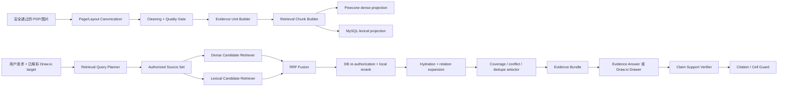

# Draw.io 多模态高精度 RAG 实现设计

> 状态：开发基线补充（Implementation Ready Addendum）
>
> 日期：2026-07-19
>
> 上位文档：`2026-07-19-multimodal-library-chartbook-technical-design.md`
>
> 适用范围：首版资料摄取、检索、图后问答和基于资料的 Draw.io 创建/修改
>
> 目标：在不新增常驻搜索服务、不改变权限与生命周期模型的前提下，最大化中英文、多模态资料检索的精度、可解释性和可调优性

## 1. 结论

首版 RAG 使用“结构感知清洗与切块 + 可引用证据和检索单元分离 + Pinecone dense 与 MySQL lexical 双路召回 + RRF 融合 + 本地特征重排 + 父子/关系扩展 + 有预算的 Evidence Bundle + 生成后引用校验”。

必须遵守以下结论：

1. `Evidence Unit` 是最小可定位、可回源、可引用事实；`Retrieval Chunk` 是为召回优化的索引单元。模型最终只能引用前者。
2. 文档保留三种文本：不可变提取文本、可展示规范文本、检索文本。清洗只能改变后两者，引用摘录不能从经过扩写的检索文本产生。
3. 不再使用统一的“250–400 tokens + 固定 50 tokens overlap”。按段落、列表、表格、标题、视觉区域分别切块，优先结构连续性，仅使用一个句子的有限结构重叠。
4. 事实型检索使用细粒度 `CONTENT` Retrieval Chunk；宽泛绘图和整文任务先使用不可引用的 `DOCUMENT_PROFILE/SECTION_BRIDGE` 定位来源或章节，再回到可引用内容单元。
5. Pinecone 只保存 Retrieval Chunk 的向量和不透明 ID。MySQL 保存同一 Retrieval Chunk 的授权字段、检索影子文本和精确术语；正文、页图和视觉裁剪仍在 S3。
6. Agent RAG 首版启用 dense + lexical 双路召回。lexical 复用 MySQL 8.4 FULLTEXT，不引入 OpenSearch、Elasticsearch、稀疏向量库或第二个向量数据库。
7. 两路结果使用基于名次的 Reciprocal Rank Fusion（RRF），避免直接混合不可比的 cosine 与 FULLTEXT score；随后才使用可解释的本地特征重排。
8. 不使用一个全局 cosine 阈值决定“相关/不相关”。阈值、权重、top-k 和 chunk 参数都必须由本项目的分层评测集校准。
9. 默认不调用额外 reranker 或 HyDE 模型。只有离线消融证明收益达到发布门槛，并且成本、延迟和数据披露均可接受时，才通过 feature flag 开启。
10. Draw.io 节点/连线问题先读取该 cell 已有 citation，再在其固定版本和邻近 Evidence 内检索；已有引用是高优先候选，不是无需验证的答案。
11. 创建不同图类型时使用不同的信息需求模板，例如流程图检索步骤/决策/异常，架构图检索组件/职责/依赖/接口；不能把普通问答 query 原样用于所有绘图任务。
12. 检索优化必须同时测 source recall、evidence recall、precision、MRR、nDCG、facet coverage、citation precision、claim support、上下文噪声、延迟和成本，不能只看最终回答“感觉是否正确”。
13. Citation key/anchor 合法只证明可追踪，不证明自然语言蕴含；每个 Evidence-backed claim/cell 必须再通过 fail-closed `ClaimSupportVerifier`，否则转 gap 或拒绝画布事务。

## 2. 范围与约束

### 2.1 需要优化的请求

| 场景 | 检索目标 |
|---|---|
| 基于资料创建新图 | 找齐实体、关系、步骤、条件、例外和层级，而不是只找与主题最相似的一段 |
| 基于资料修改图 | 围绕目标 cell 和本次变化检索，保持既有引用版本语义 |
| 整图问答 | 先利用当前图已实际引用的 Evidence，再按授权策略补充 |
| 节点问答 | 使用节点 label、邻居、现有 citation 和问题共同构造 query |
| 连线问答 | 使用 source/target label、方向、连线 label 和问题共同构造 query |
| PDF/资料问答 | 精确命中事实、专有名词、数字、表格行、定义和流程 |
| 整文总结 | 覆盖章节和高价值视觉区域，不能简单取全库 top-k |
| 显式单图问题 | 从固定图片的 Evidence 直接回源；无需 ANN 发现，但仍执行视觉核验 |

### 2.2 不在首版增加

- 图片向图片或相似图检索。
- GraphRAG、知识图谱数据库或自动本体构建。
- OpenSearch、Elasticsearch、SQS、独立 cross-encoder 容器或 GPU 常驻服务。
- 将完整正文写入 Pinecone integrated embedding record。
- 对所有 chunk 使用 LLM proposition extraction、摘要或 query expansion。
- 通过训练样本在线学习排序权重；首版使用版本化配置和离线调参。
- 用检索结果扩大 Owner、scope、version 或生命周期权限。

### 2.3 精度与成本的默认取舍

优先级如下：

```text
权限和版本正确
  > 引用可验证
  > 关键事实召回
  > 候选精度和低噪声
  > 延迟
  > 外部推理成本
```

为兼顾已有“速度快、尽量不增加额外成本”的约束：

- dense query variants 一次 batch 调用 Embedding；不逐 query 串行调用。
- MySQL lexical 和 Pinecone dense 并行执行。
- 重排默认全部在 Java 进程内完成。
- 只有最终入选的少量候选才从 S3 hydrate 正文或视觉裁剪。
- 普通文本绘图、样式和布局请求完全绕过本模块。

## 3. 端到端架构



固定安全顺序不变：

```text
Intent Router
→ 工具和来源策略确定
→ Diagram Target Resolver
→ AuthorizedSourceSet
→ Query Plan
→ 候选召回
→ MySQL 二次鉴权
→ read lease
→ S3 回源
→ Bundle
→ 回答/绘图
→ 引用校验与原子提交
```

Query Planner、retriever 和 reranker 只能改变“在已授权集合中找什么和如何排序”，不能添加 MaterialVersion、改变 source mode 或绕过 readiness/lifecycle。

## 4. 核心数据模型

### 4.1 三层内容对象

```text
Material Version
  └─ Processing Revision
      ├─ Page / Layout Block
      ├─ Evidence Unit                 可回源、可引用
      ├─ Retrieval Chunk               可检索、未必可直接引用
      └─ Vector/Lexical Projection     可重建投影
```

#### Layout Block

解析阶段的中间结构，描述页面上的标题、正文、列表、表格、图片、图注、页眉页脚和坐标。它不是在线检索对象。

#### Evidence Unit

最小可独立验证的内容单元：一个段落、一组紧密列表项、表格行组、图注、视觉区域或视觉关系。必须具有明确的版本、处理修订、页码、bbox 和 S3 回源位置。文本 Evidence 的可引用字符只能来自 PDF native text 或 OCR；VLM 生成的视觉描述不是来源原文，视觉 Evidence 引用的是原始 crop 及其核验结果。

#### Retrieval Chunk

发送给 Embedding/lexical index 的检索单元。它可以：

- 对一个 Evidence Unit 增加标题路径和必要上下文；
- 合并同一结构内的多个 Evidence Unit；
- 作为不可引用的来源/章节桥接单元；
- 通过映射表回到一个或多个真实 Evidence Unit。

检索命中 `DOCUMENT_PROFILE` 或 `SECTION_BRIDGE` 时，必须继续下钻到它关联的可引用 Evidence Unit，不能把桥接文本作为最终证据。

### 4.2 三种文本表示

| 表示 | 用途 | 是否允许改写 | 是否可用于引用摘录 |
|---|---|---:|---:|
| `extracted_text` | 保存解析器/OCR 的原始逻辑输出和字符坐标 | 否 | 否，需先规范化 |
| `display_text` | 预览、Evidence、引用和 span 定位 | 仅确定性规范化 | 是 |
| `retrieval_text` | Embedding 和 FULLTEXT | 可加入标题、类型标签、表头、受限视觉描述 | 否 |

必须保存 `display_text` 到 `extracted_text` 的 offset map；任何 `boundedDisplayText` 和 claim quote 都从 `display_text` 产生，并能反查页码/bbox。检索用标题前缀、同义提示或 section bridge 不得伪装成原文。

VLM 输出单独保存为 `visual_analysis`，只允许进入视觉 Retrieval Chunk 的检索影子和在线视觉核验结果。它不能写入 `display_text`、不能产生原文 quote，也不能通过 `retrieval_chunk_evidence` 的文本 span 伪装成 native/OCR 内容。

### 4.3 Retrieval Chunk 类型

| 类型 | 是否可直接引用 | 作用 |
|---|---:|---|
| `CONTENT` | 是，映射到主要 Evidence Unit | 段落、定义、流程描述、规则和普通事实 |
| `LIST_GROUP` | 是 | 保留同一列表层级与次序 |
| `TABLE_ROW_GROUP` | 是 | 表头 + 有限行，适合数值/属性查询 |
| `VISUAL_DESCRIPTION` | 是，但最终需要原图核验 | 图表、流程图、架构图和图片描述 |
| `CAPTION_CONTEXT` | 是 | 图注及紧邻正文 |
| `SECTION_BRIDGE` | 否 | 定位长章节，下钻到 section 内 CONTENT |
| `DOCUMENT_PROFILE` | 否 | 大资料库中的来源发现和整文覆盖规划 |

### 4.4 不变量

- 一个 Retrieval Chunk 只能引用同一 Owner、MaterialVersion 和 ProcessingRevision 的 Evidence Unit。
- 可直接引用的 Retrieval Chunk 至少包含一个 `PRIMARY` Evidence 映射。
- 不可引用的 bridge/profile 不允许进入最终 Bundle items。
- 一个 Evidence Unit 可以映射到多个 Retrieval Chunk；引用仍指向 Evidence Unit，不因索引策略变化而改变业务身份。
- 同一或近似内容出现在多个页面/区域时，每个 occurrence 都保留独立 Evidence Unit、Retrieval Chunk 和来源位置；duplicate cluster 只影响后处理去重，不合并业务身份。
- ProcessingRevision 发布前，其全部 Retrieval Chunk、映射、lexical 投影和 vector projection 要么一起可见，要么都不可见。
- excluded page 不得存在 ACTIVE Retrieval Chunk；旧 projection 命中仍会被 DB 二次校验丢弃。
- `display_text` 的 citable source 只能为 `NATIVE` 或 `OCR`；视觉 claim 必须引用 `VISUAL` Evidence 并按请求需要核验原始 crop。

## 5. 数据清洗与规范化

### 5.1 Canonical page model

Worker 先把 PDFBox/Tesseract 输出转换为与解析器无关的 page model；VLM 结果通过独立 `visualAnalysisRef` 关联视觉区域，不作为可引用文本 block：

```json
{
  "pageNo": 7,
  "width": 595.0,
  "height": 842.0,
  "blocks": [
    {
      "blockId": "b_...",
      "kind": "HEADING|PARAGRAPH|LIST_ITEM|TABLE|CAPTION|VISUAL|HEADER|FOOTER",
      "readingOrder": 12,
      "regions": [[0.08, 0.22, 0.91, 0.31]],
      "textSource": "NATIVE|OCR|null",
      "extractedText": "...",
      "displayText": "...",
      "sourceMap": [],
      "visualAnalysisRef": null,
      "confidence": 0.94,
      "style": {"fontSizeBucket": 3, "bold": true, "indent": 1}
    }
  ]
}
```

Canonicalizer 负责多栏阅读顺序、块合并、页内结构和页眉页脚位置候选；`BUILD_DOCUMENT_STRUCTURE` 再基于整份文档执行 60% 跨页重复确认。Chunk Builder 不重新解释 PDF 坐标，也不能把位置候选当作已确认 boilerplate。一个 block/Evidence 可以包含多个 region，不能用覆盖两栏或多行的大矩形代替真实位置；`sourceMap` 将 `displayText` 字符区间映射回 `extractedText` 以及 PDF glyph 或 OCR word bbox。视觉区域可关联独立的 `visualAnalysisRef`，但该分析文本没有 citable source map。

### 5.2 清洗规则

清洗按固定顺序执行，并为每一步记录 `cleaning_rule_version`：

| 顺序 | 规则 | 处理 | 禁止事项 |
|---:|---|---|---|
| 1 | 字符有效性 | 拒绝非法 UTF、移除无语义控制字符，保留换行映射 | 不删除数学符号、单位和方向符号 |
| 2 | Unicode | `display_text` 使用 NFC；检索影子额外映射全角/兼容空格 | 不对展示和引用文本全局 NFKC |
| 3 | 空白 | 合并页内连续空格，保留段落、列表和表格边界 | 不把所有换行压成一行 |
| 4 | 连字符 | 仅在行尾、词形和几何连续均满足时合并断词 | 不改写真实复合词或负号 |
| 5 | ligature | 将常见排版 ligature 映射为可搜索字符并保留 offset map | 不丢失原位置 |
| 6 | 重叠字形 | PDF 同坐标同字符重复只保留一个 | 不把粗体/阴影误判成两个词 |
| 7 | 页眉页脚 | 同一 band、规范文本在至少 60% 可比页面重复时标记 boilerplate | 不删除只出现少量次数的章节标题 |
| 8 | 页码 | 从 retrieval body 移除独立页码，页码仍保留为 metadata | 不删除正文中的年份、编号或步骤号 |
| 9 | OCR 合并 | native 与 OCR 以 block/bbox 对齐，选择质量更高者为主文本 | 不直接拼接两份文本造成重复 |
| 10 | OCR 噪声 | 在 `extracted_text/display_text` 保留低置信字符及 confidence span；只有确定为孤立噪声的内容才从 `retrieval_text` 排除 | 不删除可见原文、不做无证据的自动拼写修正 |
| 11 | 列表 | 保留层级、序号、项目边界和原始次序 | 不把列表项随机合并为散文 |
| 12 | 表格 | 识别表头、行列和合并单元格，生成结构化 cell matrix | 不只按 PDF 文本读取顺序串联 |
| 13 | 注释/脚注 | 与引用标记和所在页关联，默认不与正文盲拼接 | 不丢弃可能改变限定条件的脚注 |
| 14 | 注入标记 | 只标记疑似命令语句为 `untrusted_instruction_like_text` | 不从原文删除，也不执行 |

`retrieval_text` 可额外生成一个不用于展示的 search shadow：统一英文大小写、全角 ASCII、连续标点和可安全识别的编号形式。专有名词、代码、版本号、数字、单位和关系词必须保留。

### 5.3 页眉页脚与重复内容

重复检测以同一 revision 为范围：

1. 将页面上/下 12% band 的候选行做 NFC、空白和页码占位规范化。
2. 相同 normalized line 出现在至少 `max(3, ceil(comparablePages * 0.60))` 页时标记为 boilerplate。
3. 每个 boilerplate occurrence 仍保存在 page manifest、Evidence 和来源位置，并建立 `index_mode=LEXICAL_ONLY` 的低优先级 Retrieval Chunk；不建立 dense projection。
4. 只有 query 精确包含该文本时 lexical/exact-term 路径才返回这些候选，避免它们占用普通语义召回。

对正文 near-duplicate 使用 5-gram token shingles：同 revision 内 Jaccard `>=0.92` 且结构类型相同的 Chunk 进入同一 `duplicate_cluster_id`，以质量、页码和结构顺序确定稳定的 `canonical_chunk_id`。所有 occurrence 继续保留自己的 Evidence、Retrieval Chunk、lexical row 和 vector record；`DUPLICATE_OF` 只由 canonical 字段派生并用于查询后去重/MMR，不在摄取时删除或抑制正文 projection。不得跨 Owner 做相似去重。

### 5.4 语言、术语和实体影子

每个 block/chunk 保存 `language_primary` 与 `language_mix`，只用于选择 lexical parser 和评测切片，不用于权限。

确定性提取以下精确术语，最多 64 个/chunk：

- 引号内短语；
- 全大写缩写；
- 字母数字混合 ID；
- 版本号、日期、百分比、货币、带单位数值；
- URL host、类名、方法名和常见 `snake_case/camelCase` 标识符；

这些术语进入 `retrieval_exact_term` B-tree 投影，用于高精度补召回和重排，不作为通用 NER 系统。

未来 Draw.io 请求中的 target label 属于查询期信息，只能由 Query Planner 加入 `QueryPlan.exactTerms`，不能在资料摄取时写入 `retrieval_exact_term`。

### 5.5 质量特征与 Gate

质量不是一个不可解释的模型分数。Worker 保存以下独立特征：

```text
nativeTextRatio
nativeExtractionConfidence
ocrMeanConfidence
unicodeValidity
readingOrderConfidence
informationDensity
structureConfidence
tableStructureConfidence
visualDescriptionQuality
visualRegionQuality
boilerplateProbability
duplicateProbability
```

先确定可复现的中间量：

```text
sourceConfidence = modality == VISUAL
  ? visualRegionQuality
  : textSource == NATIVE
    ? nativeExtractionConfidence
    : calibrated(ocrMeanConfidence)

modalitySpecificQuality = modality == TABLE
  ? tableStructureConfidence
  : modality == VISUAL
    ? visualDescriptionQuality
    : readingOrderConfidence
```

其中 `nativeExtractionConfidence` 由有效 Unicode、重复 glyph 比率、文本区域覆盖和阅读顺序确定性按版本化规则合成；`calibrated(ocrMeanConfidence)` 使用当前 OCR 语言/模型在 golden fixtures 上的校准曲线，不能把不同 OCR 配置的原始分数直接比较。初始 `retrievalQuality` 为：

```text
0.25 * sourceConfidence
+ 0.20 * unicodeValidity
+ 0.20 * readingOrderConfidence
+ 0.15 * informationDensity
+ 0.10 * structureConfidence
+ 0.10 * modalitySpecificQuality
```

建议 Gate：

| 分数/条件 | 行为 |
|---|---|
| 明确 boilerplate | 只建立 `LEXICAL_ONLY` 投影，不建立 dense vector |
| 空白、纯页码、低信息孤立字符 | `UNSEARCHABLE`，不建立检索投影 |
| `< 0.35` | Evidence 可保留用于预览，但标为 `UNSEARCHABLE` |
| `0.35–0.60` | 可索引，候选重排时施加低质量 penalty |
| `> 0.60` | 正常索引 |
| OCR 数字/表格关键事实且 OCR confidence 低 | 必须回源图像核验后才支持 claim |

OCR 初始分级为：`>=0.70` 正常、`0.45–0.70` 低置信可检索、`<0.45` 不作为普通文本事实，只保留 raw/display text、预览/原图和 gap。native/OCR 的选择必须按 block/bbox 完成，不能整页二选一；数字 PDF 中的局部扫描图仍可局部 OCR。

阈值必须由真实 fixture 校准。不能因为质量低就把受限资料替换成 AI 常识而不提示。

## 6. Evidence Unit 与 Retrieval Chunk 构建

### 6.1 Evidence Unit 构建规则

| 输入结构 | Evidence Unit |
|---|---|
| 标题 | 独立 HEADING unit，并作为后续内容的 section path |
| 普通段落 | 一个语义连续段落；过长才按句子切分 |
| 列表 | 同一父项下 2–8 个紧密条目；保留层级和序号 |
| 表格 | 表头 unit、行组 unit、必要时单个关键 cell unit |
| 图注 | CAPTION unit，与视觉区域建立 `CAPTION_OF` |
| 视觉区域 | VISUAL unit，绑定原始 crop、bbox 和可选 OCR；VLM JSON 作为独立 `visual_analysis` 关联，不作为来源原文 |
| 页脚/脚注 | FOOTNOTE unit，与引用标记/正文建立 relation |

Evidence Unit 文本应尽可能接近原始可读内容。标题前缀、同义扩写、图类型提示和 VLM 描述只放 Retrieval Chunk 或 `visual_analysis`；文本引用只能从 NATIVE/OCR `display_text` 产生，视觉引用指向 crop。

### 6.2 Chunk 大小默认值

`multilingual-e5-large` 的输入上限为 507 tokens，因此任何 embedding 文本必须在本地 token 计数后满足上限，并使用 `truncate=NONE`。下表硬上限针对完整 `retrieval_text`，已包含标题路径、类型标签、表头和其他确定性前缀。

| Chunk 类型 | 最小 | 目标 | 硬上限 | 上下文策略 |
|---|---:|---:|---:|---|
| `CONTENT` | 80 | 180–320 | 420 | 标题路径 + 当前段落；必要时一个相邻句 |
| `LIST_GROUP` | 50 | 120–280 | 400 | 父列表标题 + 连续条目 |
| `TABLE_ROW_GROUP` | 40 | 120–320 | 400 | 表名 + 表头 + 3–12 行 |
| `CAPTION_CONTEXT` | 30 | 80–220 | 320 | 图注 + 最多一个邻近段落 |
| `VISUAL_DESCRIPTION` | 50 | 100–320 | 420 | 类型 + 标题 + 关系 + OCR + 邻文摘要 |
| `SECTION_BRIDGE` | 80 | 140–300 | 380 | 标题路径 + extractive anchors |
| `DOCUMENT_PROFILE` | 80 | 120–300 | 380 | 文档类型 + 标题 + heading outline + extractive keywords |

小于最小值的相邻同结构内容应合并；无法安全合并的短定义、公式、标题和表格 cell 可作为例外保留。任何硬上限溢出都回到 Chunk Builder 重新切分，禁止供应商截断。

### 6.3 结构优先切块算法

```text
for each page in reading order:
  build section path from heading stack
  group contiguous blocks by structural kind
  for each group:
    append next atomic unit while:
      same section
      same structural kind
      token budget remains
      no table/visual/page boundary is crossed
    if overflow:
      split at sentence/list-row boundary
      optionally repeat only the last complete sentence (<= 40 tokens)
```

不采用固定 50-token sliding window。固定 overlap 容易重复召回、占用 Bundle 和把一个完整事实拆成多个近似 chunk；结构重叠只在跨界指代无法独立理解时使用。

### 6.4 自包含上下文

检索文本按以下模板构造：

```text
[文档类型] product requirements document
[章节] Authentication > Anonymous workspace
[内容类型] rule
[正文] Anonymous temporary material expires after 24 hours ...
```

只添加真实、确定性的上下文。短句中的“该系统”“它”“如下”可在 Retrieval Chunk 中增加 section/entity prefix，但 `display_text` 不改写。首版不使用 LLM 把每句话改写成 proposition；如果未来启用，合成 proposition 只能用于检索并必须映射回原 Evidence。

### 6.5 Parent context

每个可检索细粒度 chunk 关联一个不单独 embedding 的 `parent_context`：

- 同 section、同页或连续结构内的 450–900 tokens；
- 包含当前 Evidence、必要的上一/下一段和标题路径；
- 存在 S3 manifest，不写入 Pinecone；
- 只有 chunk 进入 hydrate shortlist 后才加载；
- 最终 Bundle 仍按最小 Evidence 引用，parent 只帮助模型理解。

这样既用细粒度文本提高命中精度，又避免只把一句孤立文本交给 Drawer。

### 6.6 Section bridge 与 document profile

`SECTION_BRIDGE` 和 `DOCUMENT_PROFILE` 采用确定性、抽取式构造：

- 标题层级；
- 首段/定义句；
- 高频但非 boilerplate 的术语；
- 章节内 Evidence 类型计数；
- 明确的实体/流程/表格/视觉线索。

只有 section 至少包含 3 个 leaf chunk 或约 500 tokens 时才创建 bridge；每个 version 只创建一个 document profile，bridge/profile 总数默认不超过 leaf chunk 数的 20%，避免索引被概要单元占满。

它们不包含模型臆造摘要，不可直接引用。用途只有两个：

1. 授权版本很多时先定位可能的 Material/section；
2. 整文总结时建立 coverage plan。

命中 bridge 后，系统以原 query + section path 再查它关联的 CONTENT/LIST/TABLE/VISUAL chunk。

### 6.7 表格

表格同时产生：

- 原始 cell matrix JSON；
- 可展示的 Markdown/TSV；
- `TABLE_ROW_GROUP` 检索文本；
- 表头到每个行组的 `TABLE_HEADER_FOR` relation；
- 表格视觉区域。

Row group 不能跨表头语义变化或分页后的新表。每组默认 3–12 行并受 400 tokens 硬上限控制。数值 query 优先 exact-term/lexical 路径；答案中的数字、单位和行列名必须在同一行组或视觉核验结果中同时出现。

### 6.8 视觉证据

视觉 Retrieval Chunk 模板：

```text
[类型] flow diagram
[标题] Order processing
[实体] Customer; API; Payment Service
[关系] Customer sends order to API; API calls Payment Service
[可见文字] ...
[邻近正文] ...
[章节] Architecture > Runtime flow
```

VLM 的 uncertainty 不参与事实扩写；不确定实体以低质量特征记录。视觉 chunk 命中只表示“值得查看该图”，真正支持箭头、位置、颜色图例、表格 cell 或连线方向的 claim 前，仍须读取原始 crop 做 VLM 核验。

视觉 Retrieval Chunk 的 `retrieval_text` 可以使用 `visual_analysis`，但其 `PRIMARY` 映射必须指向原始 VISUAL Evidence。最终 `boundedDisplayText` 不得复制 VLM description；界面展示视觉核验结论时必须明确它是对 crop 的结构化观察。

## 7. 持久化与投影设计

### 7.1 MySQL 表调整

```text
evidence_unit
  id, version_id, revision_id, page_id, section_id,
  unit_type, modality, source_channel NATIVE|OCR|VISUAL,
  display_text_object_key NULL, visual_object_key NULL,
  visual_analysis_object_key NULL,
  display_text_sha256 NULL, quality_json, status

material_section
  id, revision_id, parent_section_id, level, ordinal,
  page_start, page_end, heading_evidence_id, structure_hash

evidence_region
  evidence_id, page_id, ordinal, bbox_json,
  display_char_start, display_char_end, source_block_ref

retrieval_chunk
  id, version_id, revision_id, page_id NULL, section_id NULL,
  chunk_type, modality, language_primary, citable,
  retrieval_text_object_key, retrieval_text_sha256,
  parent_context_object_key, token_count, quality_score,
  structural_ordinal, duplicate_cluster_id NULL,
  canonical_chunk_id NULL,
  index_mode DENSE_AND_LEXICAL|LEXICAL_ONLY|UNSEARCHABLE,
  status

retrieval_chunk_evidence
  retrieval_chunk_id, evidence_id,
  role PRIMARY|CONTEXT|HEADER|CAPTION|REPRESENTATIVE,
  ordinal, char_start NULL, char_end NULL

retrieval_search_document
  retrieval_chunk_id, owner_type, owner_key,
  material_id, version_id, revision_id,
  word_search_text, cjk_search_text, status

retrieval_exact_term
  retrieval_chunk_id, owner_type, owner_key,
  version_id, revision_id, normalized_term, term_type

retrieval_chunk_vector_projection
  retrieval_chunk_id, index_generation_id,
  index_name, namespace, vector_id,
  embedding_model, embedding_fingerprint,
  dimension, projection_role PRIMARY|COMPATIBILITY,
  state, indexed_at

rag_index_generation
  id, index_name, embedding_model, dimension, metric,
  vector_schema_version, state, activated_at

material_processing_job
  id, upload_session_id NULL, revision_id NULL,
  stage, work_key NOT NULL DEFAULT 'root', input_fingerprint,
  priority, status, attempt, not_before, lease_owner, lease_until,
  fence_token, last_error_code, payload_json
```

关键索引：

```sql
FULLTEXT KEY ft_word (word_search_text),
FULLTEXT KEY ft_cjk (cjk_search_text) WITH PARSER ngram,
KEY idx_exact_term (owner_type, owner_key, normalized_term, version_id),
UNIQUE KEY uk_chunk_projection (retrieval_chunk_id, index_generation_id),
UNIQUE KEY uk_upload_work (upload_session_id, stage, work_key),
UNIQUE KEY uk_revision_work (revision_id, stage, work_key)
```

`material_processing_job` 必须用 CHECK/应用层不变量保证 `upload_session_id` 与 `revision_id` 恰一非空。`work_key` 永不为 NULL：聚合级任务使用固定值 `root`，page/region/batch 使用确定性 key。两个 nullable aggregate 的唯一键分别保证 intake 和 revision job 幂等，不能只依赖其中一组。

`canonical_chunk_id` 必须指向同 revision、同 `duplicate_cluster_id` 的 Chunk；cluster 中每个 occurrence 都保留自己的投影。`LEXICAL_ONLY` 只允许 lexical/exact-term row，不允许 vector projection；`UNSEARCHABLE` 两种投影都没有。`REPRESENTATIVE` 用于 bridge/profile 下钻映射，不能直接变成 Citation。

lexical query 必须先带 Owner 和 authorized version/revision 条件，返回的 chunk ID 仍要执行与 Pinecone hit 相同的 DB 二次鉴权。FULLTEXT 表不是新的业务事实源。

`word_search_text/cjk_search_text` 均可空：拉丁/空格语言只填 word 列，CJK 只填 cjk 列，中英混合才同时填两列，避免所有文本无条件存两份。两列都是可删除的检索投影，不是引用正文。

### 7.2 S3 manifest

每个 ProcessingRevision 保存：

```text
revisions/{revisionId}/pages/{pageNo}/canonical-page.json.gz
revisions/{revisionId}/pages/{pageNo}/raw-extraction.json.gz
revisions/{revisionId}/pages/{pageNo}/page.png
revisions/{revisionId}/pages/{pageNo}/preview.webp
revisions/{revisionId}/evidence/{evidenceId}.json.gz
revisions/{revisionId}/visual/{evidenceId}.webp
revisions/{revisionId}/visual-analysis/{evidenceId}.json.gz
revisions/{revisionId}/retrieval/{chunkId}.json.gz
revisions/{revisionId}/retrieval/{chunkId}.parent.json.gz
revisions/{revisionId}/revision-manifest.json.gz
revisions/{revisionId}/projections/{indexGenerationId}/projection-manifest.json.gz
```

`raw-extraction` 保存不可改写的 PDFBox/Tesseract 逻辑输出和坐标；`canonical-page` 保存 display text、source map、阅读顺序和质量特征；lossless `page.png` 是 OCR/canonical source，受限 `preview.webp` 只作为其派生预览，`visual/{evidenceId}.webp` 是可核验原始视觉裁剪。VLM 输出只能写独立 `visual-analysis` 对象。不可变 `revision-manifest` 包含 processing fingerprint、全部 stage fingerprint、page/evidence/chunk/视觉对象 hash 和 lexical row checksum；每个 index generation 使用独立、只写一次的 `projection-manifest`，包含 tokenizer/model/vector schema、projection fingerprint 和 vector IDs。所有 `visual_object_key` 必须出现在 manifest 中，永久删除/重建按 manifest 精确执行。

新增 compatibility projection 时只新增 `{indexGenerationId}/projection-manifest` 和 DB projection 行，不修改既有 `revision-manifest` 或旧 generation manifest，从而保持 ProcessingRevision 内容不可变。

首版每个 ProcessingRevision 写入自己 revision prefix 下的独立确定性对象，不跨 revision 共享对象引用，也不引入跨 revision artifact/refcount。摄取期间允许 `material_page_artifact` 作为 revision-local exact-VersionId pin，固定 kind/key/version/hash/size/type；它不是共享 artifact registry，也没有 refcount。相同 `(revisionId, stage, workKey, inputFingerprint)` 重试验证并复用本 revision 的既有对象；建立新 revision 时，若同 Owner/Source Version 的上一已发布 revision 在 manifest 中具有完全相同的 stage fingerprint，Worker 可以校验 source hash 后用 S3 server-side copy 把对应不可变对象复制到新 revision 的独立 key，并再次核验 checksum。新旧 revision 不共享 object key，删除时按各自 manifest 精确删除，因此不存在引用计数和误删问题。

### 7.3 Pinecone record

```text
vector_id = rc_{retrievalChunkId}_ig{indexGenerationId}
```

metadata 白名单：

```json
{
  "tenant_key": "opaque HMAC",
  "material_id": "mat_...",
  "version_id": "ver_...",
  "revision_id": "rev_...",
  "retrieval_chunk_id": "rc_...",
  "chunk_type": "CONTENT",
  "modality": "TEXT",
  "page_no": 12,
  "language": "zh",
  "index_generation_id": "ig_2"
}
```

不得保存 retrieval text、标题、section path、文件名、标签、bbox 内容、query 或 S3 key。

### 7.4 Embedding text 与幂等

- `CONTENT/LIST_GROUP/TABLE_ROW_GROUP/CAPTION_CONTEXT/VISUAL_DESCRIPTION/SECTION_BRIDGE/DOCUMENT_PROFILE` 的 dense projection 使用 `input_type=passage`；`LEXICAL_ONLY/UNSEARCHABLE` 不调用 Embedding。
- query 使用 `input_type=query`。
- `truncate=NONE`。
- passage batch `<=96`；Worker 同时受 payload bytes 限制。
- Worker embedding 幂等缓存 key：`owner_key_hmac + revision_id + retrieval_text_sha256 + tokenizer_fingerprint + model_fingerprint + input_type`。缓存必须按 Owner 分区，不能产生跨 Owner 可观察的命中、时序或删除关联。
- 同 Owner、同 Revision 内重复 retrieval text 可以复用向量计算结果，但每个逻辑 Chunk 仍有独立 vector record，便于授权、删除和定位；首版不跨 revision 共享该缓存结果。
- 初次发布 ProcessingRevision 前，对当前 ACTIVE index generation 的 projection fetch/抽样确认；Pinecone 最终一致期间新 revision 保持不可读。后续 BUILDING compatibility projection 不影响该 revision 继续通过旧 ACTIVE generation 提供读取。

### 7.5 增量重处理

ProcessingRevision 的 fingerprint 只描述“Evidence 与 Retrieval Chunk 如何从原始资料产生”，不包含 Embedding/index 部署。它拆成以下阶段 fingerprint：

```text
extractFingerprint
ocrFingerprint
cleanFingerprint
structureFingerprint
visualFingerprint
chunkFingerprint
lexicalFingerprint
```

```text
processingFingerprint = SHA256(
  extractFingerprint +
  ocrFingerprint +
  cleanFingerprint +
  structureFingerprint +
  visualFingerprint +
  chunkFingerprint +
  lexicalFingerprint +
  sortedExcludedPages
)

projectionFingerprint = SHA256(
  retrievalTextSha256 +
  indexGenerationId +
  tokenizerFingerprint +
  embeddingModelFingerprint +
  inputType
)
```

`processingFingerprint` 不包含 embedding model、dimension、metric、vector schema 或 index generation；这些只属于 `rag_index_generation` 和 vector projection。模型变化时对既有 Retrieval Chunk 建立 compatibility projection，不创建 ProcessingRevision，也不重新运行 PDFBox/OCR/VLM。

stage fingerprint 用于同一 revision、同一 `work_key` 的幂等恢复和迟到 Worker fencing，也用于判断上一已发布 revision 的某个不可变阶段是否可安全复制。这里复用的是计算结果，不是对象引用：新 revision 必须拥有独立 key、checksum 和 manifest entry。无法证明 Owner、Source Version hash、stage fingerprint 和依赖 fingerprint 全部相等时，必须从原始 Source Version 重算。

变更影响：

| 变化 | 最小重建范围 |
|---|---|
| parser/extract 配置 | 创建新 ProcessingRevision；从 extract 起重算 |
| OCR 配置 | 复制匹配的 raw native extraction；重算受影响 OCR page 及下游 |
| cleaner/structure/VLM/chunk/lexical 配置 | 复制依赖 fingerprint 相同的上游对象；从首个变化阶段重算下游 |
| excluded pages | 复制未变 page artifacts；只重建受影响 section/chunk/lexical，并保证被排除页无 ACTIVE Chunk |
| embedding model、dimension、metric 或 vector schema | 创建新 index generation；只建 vector/compatibility projection，不创建 revision |
| 排序权重/top-k | 无需重建资料，只更新 retrieval config version |

新 revision 发布前旧 active revision 继续服务。不得原地更新一个已被图固定引用的 revision。

### 7.6 Page/batch 级任务

大 PDF 的 OCR、视觉分析和 Embedding 不能用一个 revision-level job 表示。`material_processing_job` 增加：

```text
work_key NOT NULL DEFAULT 'root'
input_fingerprint
```

两个 aggregate FK 必须恰一非空，并分别使用唯一约束：

```text
(upload_session_id, stage, work_key)
(revision_id, stage, work_key)
```

intake 阶段使用 upload session；revision 阶段使用 revision ID。示例：

```text
OCR_PAGE/page:12
ANALYZE_VISUAL/page:12:region:3
EMBED_CHUNK_BATCH/ig:ig_2:batch:0008
UPSERT_VECTOR_BATCH/ig:ig_2:batch:0008
```

Worker 只重领失败的 page/batch。同一 revision/work key 已成功时，根据 `input_fingerprint`、确定性 S3 key 和内容 SHA-256 验证后跳过重复计算。跨 revision 的 stage copy 只能由 revision initializer 按 7.2/7.5 的完整校验协议执行；普通 page/batch job 不得自行查找其他 revision 的对象，也不得保存指向旧 key 的引用。发布事务仍以整个 ProcessingRevision 的 manifest 完整性为 Gate。

### 7.7 Index generation

不同 embedding model、dimension、metric 或 vector schema 不能混在同一 index generation。Chunk schema 属于 ProcessingRevision，不属于 index generation：chunk schema 变化创建新 revision，并在当前 embedding-compatible index 中投影；新 revision 完成后逐 Material 原子切换 `active_revision_id`，旧 revision 因 pin/citation 需要继续保留时仍可共存。

Embedding/index generation 升级流程：

1. 新建 `BUILDING` generation/index。
2. 新写入的 Retrieval Chunk 同时建立 ACTIVE/BUILDING projection；历史 active 和 pinned revision 从 manifest 建立 BUILDING compatibility projection。
3. shadow query 比较授权结果、Recall、nDCG、延迟和投影完整性。
4. Gate 通过后在 MySQL 原子切换 ACTIVE generation。
5. 保留旧 index 一个回滚窗口，再进入 RETIRED/删除。

历史 citation/Evidence 身份不因重建向量而变化；固定历史 revision 可以建立新的 compatibility projection。该 projection 只增加 `retrieval_chunk_vector_projection` 行，不修改 ProcessingRevision fingerprint、Evidence、Chunk 或引用。

## 8. Query 理解与规划

### 8.1 Planner 输入

`RetrievalQueryPlanner` 只能接收已经通过前置安全步骤的数据：

```text
rawUserMessage
routeType + diagramType + evidenceNeed
resolved DiagramTarget（可选）
effective Source Policy（不含正文）
current diagram citation refs（opaque IDs）
last grounded turn summary（可选、受限）
```

它不能接收客户端声明的 Owner、任意 version ID、完整 Draw.io XML 或尚未鉴权的资料内容。Target label 和用户文字仍是不可信内容，只能影响 query text，不能影响权限与工具。

### 8.2 QueryPlan 契约

```json
{
  "planVersion": "rag-query-plan-v1",
  "shape": "FACT|DEFINITION|PROCESS|RELATION|COMPARE|SUMMARY|VISUAL|MULTI_HOP",
  "route": "TEXT|VISUAL|HYBRID|VISUAL_EXACT",
  "queries": [
    {
      "id": "q0",
      "facetKey": "F1",
      "text": "Product Owner responsibilities in sprint planning",
      "weight": 1.0,
      "modalities": ["TEXT", "TABLE"],
      "chunkTypes": ["CONTENT", "LIST_GROUP", "TABLE_ROW_GROUP"]
    }
  ],
  "exactTerms": [
    {
      "termId": "T1",
      "surface": "Product Owner",
      "normalized": "product owner",
      "type": "QUOTED_PHRASE|TECHNICAL_ID|VERSION|NUMBER_UNIT|ACRONYM|CLASS_METHOD|OTHER",
      "required": true,
      "weight": 1.0
    }
  ],
  "entityAnchors": [
    {
      "entityId": "A1",
      "surface": "Product Owner",
      "normalized": "product owner",
      "type": "PERSON_ROLE|SYSTEM|PROCESS|DATA|OTHER",
      "source": "USER|RESOLVED_TARGET|TARGET_NEIGHBOUR",
      "weight": 1.0
    }
  ],
  "requiredFacets": [
    {
      "facetKey": "F1",
      "label": "responsibilities",
      "weight": 1.0,
      "critical": true,
      "queryIds": ["q0"],
      "requiredExactTermIds": ["T1"],
      "requiredEntityIds": ["A1"],
      "allowedModalities": ["TEXT", "TABLE"],
      "visualVerificationRequired": false,
      "relationConstraint": null,
      "sectionCoverageKey": null,
      "minAnchorCoverage": 0.6,
      "minEvidenceQuality": 0.5
    }
  ],
  "seedCitationIds": ["cit_..."],
  "sourceDiscovery": "DIRECT|PROFILE_FIRST|EXACT_SOURCE",
  "budgets": {
    "densePerQuery": 24,
    "lexicalPerQuery": 24,
    "fused": 40,
    "hydrate": 16,
    "bundleItems": 8
  }
}
```

`QueryPlan` 不包含授权 IDs 列表；`AuthorizedSourceSet` 是独立、不可被 Planner 修改的输入。`exactTerms/entityAnchors/requiredFacets` 都是不可变值对象，不允许用裸字符串代替：term `type/required/weight` 驱动 exact lane，entity anchors 驱动 heading/entity overlap，facet `weight/match constraints` 驱动 hydration 后 coverage。关系 facet 的 `relationConstraint` 是结构化的 `{sourceEntityId,targetEntityId,direction,requiredRelationTermIds}`；整文 facet 可使用服务端 outline 产生的 `sectionCoverageKey`。所有 weight 由服务端确定性映射产生并规范到 `[0,1]`；required facet weights 在 plan 内归一化为总和 1。模型/用户不能直接提交 weight、critical 或阈值。

### 8.3 确定性 query normalization

1. 去除 UI 包装、重复空白和已识别的粘贴 XML；保留用户自然语言内容。
2. NFC 规范化；dense query 保留自然句，不做 aggressive stopword removal 或 stemming。
3. 提取引号短语、缩写、数字、单位、版本、类名和 ID 到 `exactTerms`。
4. 检测语言与混合脚本，选择 word/ngram lexical lane；dense 仍使用原始语言。
5. 将“这个节点/它/这条线”绑定到已解析 target；没有 resolved target 时不得猜测。
6. 只使用上一轮已 grounded 的 target/query 摘要解析追问，不把长期对话全文加入检索 query。
7. 删除只服务于交互的词，例如“请帮我看看”，但保留否定、条件、时间和比较关系。

禁止对数字、否定词、条件词、source/target 方向和版本限定做会改变语义的改写。

输入预算：每个 query facet 硬上限 256 tokens；target label 最多 160 字符，最多 4 个邻居且每个 80 字符。超长用户粘贴内容不静默截断为一个可能变义的 query：返回“请作为资料上传或缩小问题”，或由确定性规则提取明确问题句并在 diagnostics 标记 `QUERY_REDUCED`。

### 8.4 Query shape

确定性规则先识别：

| Shape | 线索 | 需要覆盖 |
|---|---|---|
| `FACT` | 谁、何时、多少、是什么值 | 一个直接事实及限定条件 |
| `DEFINITION` | 是什么、含义、职责 | 定义 + 必要范围 |
| `PROCESS` | 如何、步骤、流程、先后 | 步骤、顺序、决策、异常 |
| `RELATION` | 为什么连接、依赖、影响 | 两端实体、方向、关系依据 |
| `COMPARE` | 区别、对比、分别 | 每个对象至少一个 facet |
| `SUMMARY` | 总结、概览、根据全文画图 | 章节覆盖 + 高价值视觉覆盖 |
| `VISUAL` | 图中、箭头、颜色、位置、图例 | visual hit + 原图核验 |
| `MULTI_HOP` | A 如何通过 B 影响 C | 最多 3 个可独立检索 facet |

简单请求只生成一个 query。比较、组合条件、多跳或绘图信息需求最多生成 3 个 query facet，防止 query fan-out 放大延迟与 RU。

### 8.5 Draw.io 场景 query 模板

#### 创建新图

Intent Router 已产生可信 `diagramType` 后，Planner 在用户主题后增加信息需求，不虚构业务词：

| Diagram type | 默认 facets |
|---|---|
| `flowchart` | actors/inputs、ordered steps、decision conditions、exceptions/outputs |
| `architecture` | components、responsibilities、interfaces/dependencies、data/control flow |
| `sequence` | actors、messages、order、conditions/alternate paths |
| `er` | entities、keys/attributes、relationships、cardinality/constraints |
| `state` | states、events、guards、transitions/terminal state |
| `mindmap/concept` | central concept、categories、subconcepts、cross-relations |

例如用户说“根据需求画订单流程图”，不是只检索“订单流程图”，而是形成：

```text
q0: 订单处理流程、参与者和输入输出
q1: 订单处理步骤、先后顺序和判断条件
q2: 订单处理失败、取消和异常分支
```

这些 query 只帮助找证据；Drawer 是否画入某个节点仍由 Bundle 中实际 Evidence 决定。

#### 修改已有图

query = 用户变化目标 + resolved target label + target kind + 直接邻居短标签。只添加最多 4 个邻居；完整 XML 不进入 Planner。现有 citation IDs 作为 seed。

#### 节点问答

顺序：

1. 读取该节点当前 citation 对应的 Evidence Unit；
2. 用 `target label + 用户问题` 在固定 version/revision 内检索；
3. 非严格模式仍不足时，才按 Source Policy 补充本图/图表册/资料库；
4. MANUAL 节点 label 只作为 query context，不作为 Evidence。

#### 连线问答

query 至少包含：source label、target label、方向、edge label 和用户关系词。比如“为什么 A 指向 B”不能退化成只搜索 A 或 B。

#### 整图问答

先聚合当前 canvas 中实际 citation refs，并按用户问题从这些固定 Evidence 中召回；只有问题明显超出已画内容且 policy 允许，才扩展到其他授权资料。

#### 整文总结或根据全文绘图

不用普通全库 top-k。先读取目标 Material 的 heading outline、section bridge 和高价值视觉 manifest，建立 required coverage；随后每个必要 section 至少检索一组可引用 Evidence。

### 8.6 复杂 query 与模型调用策略

首版默认 `plannerMode=DETERMINISTIC`。以下技术作为实验开关而非基线：

- LLM query decomposition：只用于确定性规则无法拆解的多跳问题；最多 3 个子问题。
- HyDE：默认关闭。它会产生额外模型成本，并可能把不存在的术语带入邻域。
- 自动翻译 query：默认关闭；多语言 E5 直接处理原语言。只有本项目跨语言评测证明翻译收益时再启用。
- LLM synonym expansion：默认关闭；专有名词召回优先依赖 lexical/exact-term lane。

任何模型生成的 query 只能缩小/改写信息需求，不能产生 source ID、SQL/Pinecone filter 或工具参数。

## 9. 候选生成与检索策略

### 9.1 Source discovery

| 授权版本规模/场景 | 策略 |
|---|---|
| 任意模式且 `<=80` 个授权版本 | 直接查询所有授权版本 |
| `AUTO/EXPLICIT` 且 `81–500` 个授权版本 | profile-first，选 top 12 MaterialVersion，再查内容；显式版本、本图 pin 和 target citation 版本无条件并入 |
| `AUTO/EXPLICIT` 且 `>500` 个授权版本 | 按显式/现有引用 → 本图 pin → 图表册 → 个人库分层做 profile-first；每层 top 12，合并后执行一次安全扩展，仍不足则要求用户缩小范围 |
| 整文总结/指定 Material | 跳过 profile 排除，按 section coverage 查询 |
| `EXPLICIT_ONLY` 且 `<=500` 个授权版本 | 所有显式版本都保留并按 version batch 查询，不得被 profile shortlist 排除 |
| `EXPLICIT_ONLY` 且 `>500` 个授权版本 | 返回 `SOURCE_SET_TOO_LARGE` 并要求用户缩小显式选择；不得静默 profile shortlist 或只使用一部分来源 |
| `VISUAL_EXACT` | 固定 Evidence 回源，不做 ANN 来源发现 |

profile-first 的 shortlist 必须无条件合并显式版本、本图 pin 和 target 现有 citation 的版本。若 profile 分数接近、没有足够候选或 required facet 未覆盖，执行一次安全扩展，不能把 profile 误判当成“没有证据”。

上述阈值按“本轮已重新鉴权的 Source Version 数量”计算，不按 Material 数量、Pinecone hit 数或客户端声明计算。profile 只优化召回成本，不改变 `AuthorizedSourceSet`；任何被 shortlist 排除的版本仍然保持已授权但本轮未搜索的状态，不能记录成无权限或无内容。

### 9.2 Dense lane

对 QueryPlan 中所有 query 一次性生成 embedding batch。每个 query 按 authorized version batch、modality 和 chunk type 查询：

```text
simple query: topK=24
each multi-facet query: topK=16
visual-only lane: topK=16
source profile lane: topK=12
```

查询时 `include_values=false`，只返回 vector ID、score 和最少 metadata。Cosine score 只用于同一 embedding 模型、同一 query lane 内排序；不直接与 lexical score 相加。

### 9.3 Lexical lane

lexical 负责 dense 容易丢失的内容：

- 产品名、缩写、代码、类名和 API；
- 精确短语；
- 数字、日期、版本、百分比和单位；
- 中文短词；
- OCR 中语义不稳定但字符仍可匹配的内容。

执行顺序：

1. exact term B-tree 命中，最多 16 个；
2. CJK query 使用 `MATCH(cjk_search_text) ...` ngram lane；
3. 英文/空格语言使用 `MATCH(word_search_text) ...` natural/boolean lane；
4. 混合 query 合并两个 lane；
5. 每个 query 最多返回 24 个 lexical candidates。

引号短语和用户明确 ID 使用 phrase/boolean semantics；普通自然语言不强制所有词同时出现。SQL 参数必须绑定，不能把用户输入直接拼入 boolean query operators。

MySQL 的 `ngram_token_size` 是启动/参数组级配置，首版目标为 2。WP0/WP1 必须先核实现有 MySQL/RDS 参数组、变更窗口和 FULLTEXT 重建过程；如果生产环境不能调整，则保留 CJK exact-term + 当前 ngram 配置并用评测决定是否接受，不能在应用 YAML 中假装可动态修改。

word lane 查询形状：

```sql
SELECT d.retrieval_chunk_id,
       MATCH(d.word_search_text)
         AGAINST(:wordQuery IN NATURAL LANGUAGE MODE) AS lexical_score
FROM retrieval_search_document d
JOIN retrieval_chunk c ON c.id = d.retrieval_chunk_id
WHERE d.owner_type = :ownerType
  AND d.owner_key = :ownerKey
  AND d.version_id IN (:serverAuthorizedVersionIds)
  AND d.revision_id IN (:serverAuthorizedRevisionIds)
  AND d.status = 'ACTIVE'
  AND c.status = 'ACTIVE'
  AND c.index_mode = 'DENSE_AND_LEXICAL'
  AND MATCH(d.word_search_text)
        AGAINST(:wordQuery IN NATURAL LANGUAGE MODE)
ORDER BY lexical_score DESC
LIMIT :serverLimit;
```

CJK 普通自然语言 lane 同样要求 `c.index_mode='DENSE_AND_LEXICAL'` 并改用 `MATCH(d.cjk_search_text)`；phrase/boolean string 由服务端 token builder 生成。`:serverAuthorizedVersionIds`、revision 和 limit 不能来自模型或用户拼接。只有服务端 QueryPlan 标记为 quoted phrase/exact ID 的 lane 才允许 `c.index_mode IN ('DENSE_AND_LEXICAL','LEXICAL_ONLY')`，并要求规范化完整短语或 exact-term 相等；不能让 boilerplate 进入普通自然语言召回。exact-term lane 在 `retrieval_exact_term.normalized_term IN (...)` 上使用 B-tree，并执行相同 Owner/version/revision 条件。

Authorized version IDs 按最多 100 个一批执行，所有批次使用同一 deadline；每个 lane 先在服务端按 rank 合并并应用全局 cap，再进入 RRF，不能让授权来源越多就线性放大候选预算。

### 9.4 并行执行与候选上限

Pinecone 与 MySQL 查询在同一个 retrieval deadline 内并行：

```text
per lane raw cap        48
merged raw cap          80
after RRF cap           40
after DB re-auth cap    30
hydrate shortlist       16
final Bundle items       8
```

复杂 query 可让多个 facet 各自产生候选，但全局 cap 不增加。任何单个 Material 默认最多占 hydrate shortlist 的 60%，显式单资料和整文任务除外。

### 9.5 Reciprocal Rank Fusion

使用 RRF 融合不同分数尺度：

```text
rrfRaw(chunk) = Σ laneWeight(lane) / (rrfK + rank(chunk, lane))
rrfMax(plan) = Σ laneWeight(lane) / (rrfK + 1)
normalizedRrf(chunk) = clamp(rrfRaw(chunk) / rrfMax(plan), 0, 1)
```

`rrfMax(plan)` 只包含本轮实际执行成功并产出 ranked list 的 lane；失败或被 deadline 取消的 lane 不进入分母。它表示“同一 chunk 在所有有效 lane 均排名第一”的理论最大值。禁止对本轮候选做 min-max normalization，否则一组全不相关候选也会产生 1.0。

初始 lane weight budget：

```text
dense family total             1.00
  primary query                0.60
  secondary facets total       0.40 / secondaryFacetCount
  no secondary facet           primary receives full 1.00

lexical FULLTEXT family total  1.00
  primary query                0.60
  secondary facets total       0.40 / secondaryFacetCount
  no secondary facet           primary receives full 1.00

exact-term lane                1.20
existing-citation seed lane    1.10
```

`k=60` 和权重是首版初值，不是经验真理。使用 RRF 的原因是 dense cosine、MySQL relevance 和 exact match 不可直接校准；最终权重由 locked evaluation set 调整。

一个 `RankedLane` 的身份为 `signalFamily + queryFacet`。同一个 logical query 被 version filter 分批时，先在 signal family 内合并 batch：dense 固定按 `cosine DESC, retrievalChunkId ASC`，FULLTEXT 固定按 `lexicalScore DESC, retrievalChunkId ASC`；NaN/Infinity score 作为 adapter error 丢弃并计数。合并后才形成一个 RRF lane，不能把每个 version batch 当作额外投票。相同 Retrieval Chunk 在不同 query facet/lane 命中时按上述 family budget 累积分数；相同 logical lane 的重复请求只保留最佳 rank。数据库和 Pinecone 返回顺序永远不是 tie-break。

exact-term lane 必须使用以下稳定排序，不能依赖 B-tree 返回顺序：

```text
matchedRequiredTermCount DESC
→ matchedTermTypePrioritySum DESC
→ matchedTermSpecificitySum DESC
→ exactTermCoverage DESC
→ retrievalQuality DESC
→ structuralOrdinal ASC
→ retrievalChunkId ASC

exactTermCoverage =
  sum(distinct matched query term weights) / sum(all distinct query term weights)

term weights:
  quoted phrase / technical ID / version / number-with-unit = 1.00
  acronym / class or method name                         = 0.85
  other extracted exact term                            = 0.60

matchedTermTypePrioritySum = sum over distinct matched query terms:
  quoted phrase / technical ID / version / number-with-unit = 3
  acronym / class or method name                         = 2
  other extracted exact term                            = 1

matchedTermSpecificitySum = sum(
  termWeight * min(UnicodeCodePointLength(normalizedTerm), 32) / 32)
```

`exactTermCoverage` 和所有后续 feature 都限制在 `[0,1]`；相同分数最终总以 `retrievalChunkId ASC` 保证跨 JVM、数据库执行计划和重试结果稳定。

参考实现：

```java
Map<ChunkId, Double> fuse(List<RankedLane> lanes, int rrfK) {
    Map<ChunkId, Double> fused = new HashMap<>();
    for (RankedLane lane : lanes) {
        // 一个 chunk 在同一 lane 只使用最佳名次，防止重复 query 叠加刷分。
        Map<ChunkId, Integer> bestRanks = lane.bestRankPerChunk();
        bestRanks.forEach((chunkId, rank) -> fused.merge(
                chunkId,
                lane.weight() / (rrfK + rank),
                Double::sum));
    }
    return fused;
}
```

实现同时返回 `rrfRaw`、`rrfMax` 和 `normalizedRrf`。`normalizedRrf` 只用于本地特征公式；稳定 tie-break 仍使用未归一化的 `rrfRaw`。

### 9.6 MySQL 二次鉴权

RRF 后批量查询 MySQL，并丢弃：

- Owner 不符；
- 不在本次 AuthorizedSourceSet；
- Material lifecycle 非可读；
- version/revision 与 pin/active policy 不符；
- excluded page；
- chunk/projection 非 ACTIVE；
- citable 映射丢失或 processing manifest 不一致。

只有通过校验的 version 才申请 read lease。lexical 来源于 MySQL 也不能省略此步骤，因为 scope link、pin 和 lifecycle 可能已在 candidate query 后变化。

### 9.7 本地特征重排

RRF top 40 先经 MySQL 二次鉴权，并为通过校验的 top 30 在同一事务语义下取得 version read lease。随后使用 MySQL 中已经发布且带 checksum 的 retrieval shadow、结构 metadata 和质量字段做 pre-hydrate 重排；此阶段不得读取 S3，也不得使用尚未校验的 Pinecone metadata 作为事实。

每个 feature 必须由下述确定公式映射到 `[0,1]`：

```text
semanticRelevance = normalizedRrf
  // remote rerank 开启且该候选被 rerank 时，替换为 calibratedRemoteRelevance

exactMatch = weighted matched exact terms / weighted query exact terms
  // query 无 exact term 时为 0；term weight 使用 9.5 的定义

headingAndEntityOverlap =
  0.50 * headingTokenCoverage + 0.50 * entityCoverage
  // 某子项无可用 query token 时，对其余子项重新归一化；两者都无时为 0

headingTokenCoverage = matched normalized QueryPlan anchor-token weight
                       / total normalized anchor-token weight
entityCoverage = matched QueryPlan.entityAnchors weight
                 / total entityAnchors weight

targetContextMatch = weighted coverage of server-resolved target anchors
  target label = 0.50, edge/source/target relation = 0.30, bounded neighbours = 0.20
  // 不适用项移除并对剩余权重归一化；无 resolved target 时为 0

sourcePriority:
  existing citation / explicit source = 1.00
  current diagram pin                  = 0.85
  current chartbook                    = 0.65
  personal library supplemental        = 0.45

retrievalQuality = clamp(published chunk quality score, 0, 1)

modalityFit:
  exact requested modality                    = 1.00
  accepted HYBRID modality                    = 0.80
  text/OCR fallback for a non-visual fact     = 0.60
  incompatible modality                       = 0.00

existingCitation = 1 only when the chunk maps to this resolved target's
                   current verified citation; otherwise 0
lowOcr = 1 - clamp(primary OCR confidence, 0, 1) when OCR is primary text;
         otherwise 0
bridgeOnly = 1 for SECTION_BRIDGE/DOCUMENT_PROFILE after source/section discovery;
             otherwise 0
```

首版固定分数：

```text
preHydrateScore = clamp(
             0.45 * semanticRelevance
           + 0.15 * exactMatch
           + 0.10 * headingAndEntityOverlap
           + 0.10 * targetContextMatch
           + 0.08 * sourcePriority
           + 0.07 * retrievalQuality
           + 0.05 * modalityFit
           + 0.04 * existingCitation
           - 0.06 * lowOcr
           - 0.08 * bridgeOnly,
           0, 1)
```

规则：

- `exactMatch` 只在 query 有 exact term 时激活；不能让普通高频词提升所有候选。
- `sourcePriority` 的作用小于 relevance，防止“本图资料中的无关段落”压过“资料库中的直接答案”。
- target boost 只来自服务端解析的 cell/邻居和现有 citation。
- 不使用资料更新时间作为事实相关性 boost；旧图版本固定语义优先。
- bridge/profile 只能用于二次下钻，完成下钻后从 citable 候选删除；`bridgeOnly` penalty 只控制同批下钻优先级，不能让 bridge 进入 Bundle。
- OCR penalty 不直接淘汰低置信候选；它会触发原图核验或 coverage gap。
- pre-hydrate 阶段不计算需要 display text/bbox 的 near-duplicate penalty；这些在 hydrate 后由 10.4 的 selector 处理。

稳定排序键固定为：

```text
preHydrateScore DESC
→ rrfRaw DESC
→ exactMatch DESC
→ sourcePriority DESC
→ retrievalQuality DESC
→ retrievalChunkId ASC
```

所有特征公式、权重和 tie-break 保存 `rankingConfigVersion`；trace 仅记录数值、ID 和 reason code，不记录正文。

### 9.8 阈值与 no-answer

不能设置一个跨语言、跨模态、跨 query shape 的固定 cosine threshold，也不能把“单 lane rank 1 的 `normalizedRrf≈1`”当成绝对相关。RRF 只负责相对排序；no-answer 在 hydration、`FacetMatchEvaluator` 和 visual verification 之后、Bundle/生成之前，由独立的绝对相关性策略决定。

每个 hydrate candidate 计算：

```text
retrievalSignal = max(
  calibratedDenseCosine,       // model + language/modality/shape bucket 的单调校准
  calibratedLexicalScore,      // parser + language + query-length bucket 的单调校准
  calibratedExactSignal)       // term type/specificity/coverage 的校准

anchorCoverage = QueryPlan 中 required exact terms、entity anchors、
                 relation endpoints/direction 在 display Evidence 或 verified visual 中的加权覆盖

facetMatch = Σ facetWeight * (
  1.0 when SUPPORTED,
  0.5 when PARTIAL,
  0.0 when UNSUPPORTED)

absoluteEvidenceAlignment = clamp(
    0.45 * retrievalSignal
  + 0.30 * anchorCoverage
  + 0.15 * facetMatch
  + 0.10 * hydratedEvidenceQuality,
  0, 1)
```

没有对应 calibrator 的 lane 贡献 0，权重不重新归一化，保持保守；不得用 request-local min-max。calibrator 只用非 locked calibration split 拟合，并以 model/parser/config fingerprint 绑定。某生产 route 没有任何适用 calibrator 时保持 shadow 或返回 `INSUFFICIENT_EVIDENCE`，不能退回 raw cosine/FULLTEXT score。

no-answer 由以下组合信号决定：

- top candidate 是否通过最低质量 Gate；
- top1 与后续候选的 margin；
- exact/target/heading 信号；
- required facets 是否有 Evidence；
- source mode 是否允许扩展；
- visual claim 是否完成核验。

`NoAnswerPolicyArtifact` 是只读、版本化 JSON/YAML，随部署加载并校验 dataset version、ranking config、dense/lexical/exact calibrator fingerprint。每个 fallback bucket 至少包含：

```text
minTopAbsoluteAlignment        initial calibration seed: 0.62
minTopMargin                   initial calibration seed: 0.05
minWeightedFacetSupport        initial calibration seed: 0.80
minHydratedEvidenceQuality     initial calibration seed: 0.50
requireAllCriticalFacets       true
requireVerifiedVisualFacet     true
lowMarginRule                  REQUIRE_SECOND_CONSISTENT_SUPPORT_OR_ABSTAIN
```

这些数值只是首轮 calibration seed，不能绕过 15 节的 locked gate直接上线。决策顺序固定：无合格 Evidence → critical facet 未支持 → weighted facet support 不足 → top absolute alignment 不足 → 低 margin 且无第二条一致支持/存在竞争解释 → visual 未核验；任一步失败都返回 typed gap/clarification。`topMargin = top1.absoluteEvidenceAlignment - top2.absoluteEvidenceAlignment`，在同一 critical facet 的 hydrate 后去重候选上计算；没有 top2 时取 `top2=0`，同一 duplicate cluster 不得伪装成第二条独立支持。`normalizedRrf/preHydrateScore/selectionScore` 仍可用于排序和 diagnostics，但不得单独通过绝对充分性 Gate。

阈值按以下层级选择，只有非 locked calibration cases 达到 minimum-N 才使用更细层级：

```text
language × modality × queryShape   N >= 30
→ modality × queryShape          N >= 40
→ queryShapeFamily               N >= 50
   FACT/DEFINITION | PROCESS/RELATION/COMPARE | SUMMARY/DRAWING
→ global conservative fallback   N >= 100
```

某层样本不足时必须回退上一级，不能用 3–5 个样本生成一个看似精确的阈值。global 样本仍不足时 RAG 只能 shadow，不进入事实回答/画布生产。阈值选择以 locked set 的 `false-supported` 上限为首要约束，再最小化 `false-abstention`；上线初期宁可返回 `INSUFFICIENT_EVIDENCE`，也不能把低相关候选包装成确定答案。

### 9.9 可选 remote rerank

保留 `CandidateRerankerPort`，但默认 adapter 为本地 feature reranker。Pinecone hosted multilingual reranker 只有同时满足以下条件才可灰度：

1. locked set 的 nDCG@10 或 Precision@5 至少一个绝对提升 0.03，另一个无超过 0.01 的绝对下降且无统计显著回归；
2. Candidate Recall@40、Post-rerank Recall@16、Facet Coverage、Citation precision 和 Claim completeness 无超过 0.01 的绝对下降；
3. 中文、英文、OCR、表格、视觉、节点/连线追问和 `EXPLICIT_ONLY` slice 均无超过 0.01 的绝对下降，也无统计显著回归；
4. retrieval P95 仍满足目标；
5. 每请求额外成本在产品预算内；
6. 用户资料再次发送给 rerank 模型的隐私披露已覆盖；
7. 失败可回退本地重排，且任何 source mode 都不能扩大 `AuthorizedSourceSet`。

远端调用固定发生在 `RRF top 40 -> DB re-auth + lease top 30 -> local pre-hydrate rank` 之后、S3 hydrate 之前。本地先对 30 个候选排序；远端最多接收其中 top 20 的 MySQL bounded retrieval shadow，`truncate=NONE`，不得发送文件名、Owner、S3 key、原始 query scope 或未授权 metadata。

remote adapter 必须用非 locked calibration split 训练并版本化一个单调 calibrator，把原始远端分数映射到 `[0,1]`；locked set 只用于最终 activation gate，不参与拟合。没有可审计的 calibrator 不得启用。启用时，远端分数只替换 9.7 公式中的 `semanticRelevance`，`exactMatch`、target、source policy、quality、modality、existing citation boost 和 penalty 仍由本地确定性公式计算；未进入远端 top 20 的候选继续使用 `normalizedRrf`。远端 timeout、部分 batch、非法 ID、重复 ID 或 calibration 失败时，本 run 全部候选统一回退 `normalizedRrf`，禁止把未校准的远端分数和本地分数混排。

默认 `remoteEnabled=false`。没有同时通过上述 activation gate 前，只允许 shadow 记录匿名数值指标，不进入生产排序。

### 9.10 Retrieval orchestration 伪代码

```java
CompletionStage<RetrievalOutcome> retrieve(RetrievalRequest request) {
    RetrievalQueryPlan plan = queryPlanner.plan(request);

    CompletionStage<LaneResult> dense = denseRetriever
            .search(plan, request.authorizedSources())
            .handle((hits, failure) -> LaneResult.from("DENSE", hits, failure));
    CompletionStage<LaneResult> lexical = lexicalRetriever
            .search(plan, request.authorizedSources())
            .handle((hits, failure) -> LaneResult.from("LEXICAL", hits, failure));

    return dense.thenCombine(lexical, LaneExecutionSet::of)
            .thenApply(lanes -> {
                // 只把 SUCCESS_NON_EMPTY lane 放入 RRF/rrfMax；失败、超时和成功空结果
                // 仍以不同状态进入 diagnostics，不能都折叠成 List.of()。
                return rrfFusion.fuse(plan.directSeeds(), lanes);
            })
            .thenCompose(fused -> evidenceAccess
                    .reauthorizeAndLease(fused.top(40), 30, request))
            .thenApply(leased -> localReranker.preHydrateRank(plan, leased))
            .thenCompose(locallyRanked -> optionalRemoteReranker
                    .rerankSemanticOrKeepLocal(plan, locallyRanked, request.deadline()))
            .thenCompose(ranked -> evidenceHydrator
                    .hydrateWithBackfill(ranked, 16, request.deadline()))
            .thenApply(hydrated -> relationExpander.expand(hydrated, request))
            .thenApply(expanded -> coverageSelector.select(plan, expanded))
            .thenApply(selected -> bundleFactory.build(plan, selected));
}
```

固定链路是：`RRF 40 -> DB re-auth + lease 30 -> local/optional remote pre-hydrate rerank -> hydrate 16 -> relation expansion -> dedup/coverage-MMR`。任何实现不得把远端 rerank 放到鉴权前，不得让 hydrate 后的正文被无必要地发送到远端，也不得把 relation expansion 提前到授权或 hydrate 前。

`LaneResult.status` 固定为 `SUCCESS_NON_EMPTY|SUCCESS_EMPTY|TIMEOUT|FAILED|CANCELLED`。RRF 分母只含 `SUCCESS_NON_EMPTY` lane，diagnostics 保留所有 lane 状态；两路都非成功且 direct seed 也为空时立即返回 typed failure/insufficient，不能伪装成“搜索无结果”。`hydrateWithBackfill` 按稳定排序依次回源，直到获得 16 个完整、checksum 正确且 lease 有效的候选或已耗尽已租用的 top 30；失败项只记录 reason code，不能用 MySQL/Pinecone shadow 代替 display Evidence。实际实现必须在每个异步边界检查 cancellation/deadline，并区分某 lane 失败与两路都不足。`reauthorizeAndLease` 的授权、excluded page/revision 校验和租约创建具有一个 MySQL 事务语义，上层不能自行交换顺序。

## 10. Hydration、关系扩展与 Bundle 选择

### 10.1 Hydration

只对 top 16 Retrieval Chunk：

1. 校验并按需续租 9.7 已为 top 30 原子取得的 version read lease；Hydration 不得新建或扩大租约集合；
2. 从 S3 读取 retrieval manifest、display Evidence 和 parent context；
3. 校验 SHA-256 与 projection manifest；
4. 将 Retrieval Chunk 映射到 PRIMARY/CONTEXT Evidence Unit；
5. 对数字、单位、exact term 和引用 span 做原文复核；
6. 失败候选删除并尝试下一个候选，不能使用 index shadow 代替原文。

### 10.2 Relation expansion

允许的关系：

```text
PREVIOUS_IN_SECTION
NEXT_IN_SECTION
PARENT_CONTEXT
CAPTION_OF
VISUAL_OF_PAGE
TABLE_HEADER_FOR
FOOTNOTE_FOR
DUPLICATE_OF
```

每个命中最多扩展 2 条普通关系；表头、caption 和 visual verification 可作为强制 context，不计入普通配额。扩展 Evidence 必须同 Owner、version、revision、授权和 lease；relation 不能跨 scope 偷带正文。

扩展只是补足上下文，不获得与 seed 相同的 relevance 分数。最终 claim 引用要指向真正支持内容的 Evidence，而不是自动引用所有邻居。进入模型的每段 primary、parent、stitched 或 relation 文本都必须先生成独立 `citationKey`，并标记：

```text
EvidenceFragment {
  citationKey: opaque run-local key
  fragmentKind: PRIMARY | PARENT | STITCHED | CAPTION | TABLE_CONTEXT | VISUAL
  supportRole: SUPPORT | CONTEXT_ONLY
  evidenceIds: non-empty ordered list
  primaryEvidenceIds: ordered subset of evidenceIds
  boundedDisplayText: text loaded and verified from S3
}
```

- `SUPPORT` fragment 可以进入 claim 的 `citationKeys`；`CONTEXT_ONLY` 只帮助解释代词、章节或表头，永远不能独立支持 claim。
- parent 中存在 claim 必需事实时，不得让 claim 偷引 primary；应把对应 parent span 提升为自己的 `SUPPORT` fragment 和 `citationKey`。
- stitched fragment 只有在多个 Evidence 共同构成一个不可拆分事实时才可标记 `SUPPORT`，并在 `evidenceIds` 中显式列出全部映射；否则拆成多个 key。
- 一个 `citationKey` 映射多个 Evidence 时，持久化层为每个 Evidence 创建一条 `citation_evidence`，并保存其 `PRIMARY_SUPPORT`、`JOINT_SUPPORT` 或 `CONTEXT` use role；不能只保存第一个 ID。

### 10.3 Existing citation first

节点/连线已有 citation 时：

- citation Evidence 进入 seed pool；
- 同一 section 的邻近 Evidence 可扩展；
- query 仍对 seed 计算相关性；
- 如果问题问的是来源中没有的信息，seed 不能因为“已经引用过”自动成为答案；
- 版本升级前继续固定原 version/revision。

### 10.4 去重与多样性

#### FacetMatchEvaluator 与 hydrate quality

Selector 前只运行一个共享的 `FacetMatchEvaluator`，其结果同时供 coverage、no-answer 和 Bundle 使用；各模块不能自行解释“支持 facet”。对每个 candidate × required facet 固定判定：

```text
UNSUPPORTED when:
  lease/checksum/display source invalid（candidate 直接删除），或
  any requiredExactTermId 未在 display Evidence/verified visual 中出现，或
  any requiredEntityId 未出现，或
  relationConstraint 的端点/方向/required relation term 不满足，或
  visualVerificationRequired 但没有 supported visual observation，或
  modality 不在 allowedModalities，或
  evidence quality < minEvidenceQuality

SUPPORTED when all required constraints pass
  and weighted anchorCoverage >= minAnchorCoverage
  and sectionCoverageKey（若有）与 Evidence section/representative mapping 相符

PARTIAL when没有 hard-required constraint 失败，
  但 weighted anchorCoverage 位于 [0.5 * minAnchorCoverage, minAnchorCoverage)

otherwise UNSUPPORTED
```

`relationConstraint` 只可由服务端 target/diagram template 生成；方向必须在结构化表格/visual observation 或 display text 的受控 relation matcher 中确认，不能只因两个实体同时出现就判定支持。`sectionCoverageKey` 由 revision outline 产生，不接受模型自由文本。

hydrate 后质量使用确定公式：

```text
anchorCoverage = weighted coverage of required exact terms, entities,
                 relation endpoints/direction and section anchors
termIntegrity = weighted coverage of QueryPlan required exact terms
modalityVerification = 1.0 for compatible text/table or verified visual,
                       0.4 for allowed OCR-only fallback,
                       0.0 for incompatible/unverified required visual

hydratedEvidenceQuality = weightedMeanOfApplicable(
  0.35 * publishedRetrievalQuality,
  0.30 * anchorCoverage,
  0.20 * termIntegrity,
  0.15 * modalityVerification)

postHydrateRelevance = clamp(
  preHydrateScore * (0.75 + 0.25 * hydratedEvidenceQuality), 0, 1)
```

`weightedMeanOfApplicable` 只按 QueryPlan 预先确定的适用项重新归一化；例如没有 required exact term 时移除 termIntegrity 权重。它不依赖本轮候选分布。checksum/lease/source-map 失败不是 penalty，而是立即删除候选。所有中间值和 facet status 进入不含正文的 diagnostics。

Hydration 后使用 display/retrieval 文本做：

- exact normalized hash 去重；
- 5-gram Jaccard 去重；
- 同页 bbox overlap 去重；
- 同表格 row overlap 去重；
- visual/caption 重复事实合并但保留双模态 relation。

候选的所有 selector 特征固定到 `[0,1]`：

```text
relevance = postHydrateRelevance

facetSupportValue = 1.0 for SUPPORTED, 0.5 for PARTIAL, 0.0 for UNSUPPORTED
coverageGain = newly added weighted facetSupportValue
               / currently missing weighted facet value
  // 分母为 0 时为 0；facet weight/match rule 来自 QueryPlan 并在检索前固定

shingleJaccard = max 5-gram Jaccard against already selected fragments
evidenceOverlap = max Evidence-ID intersection / smaller Evidence-ID set size
bboxOrRowOverlap = max of normalized bbox overlap and table-row overlap
sameSectionAdjacency = max against selected fragments:
  1.00 when same section and structural ordinal distance <= 1
  0.50 when same section and structural ordinal distance <= 3
  0.00 otherwise

redundancy = 0.50 * shingleJaccard
           + 0.25 * evidenceOverlap
           + 0.15 * bboxOrRowOverlap
           + 0.10 * sameSectionAdjacency
```

中文使用 Unicode 字符 5-gram，英文使用 normalized token 5-gram；短于 5 个单位的文本退化为完整单位集合 Jaccard。bbox overlap 使用 intersection-over-min-area，row overlap 使用交集行数除以较小集合行数，Evidence-ID overlap 使用交集数除以较小集合大小。没有相应结构信号时该子项为 0；四个子项及最终 `redundancy` 均在 `[0,1]`。

最终选择按迭代 MMR 固定目标：

```text
selectionScore = 0.78 * relevance
               + 0.22 * (0.60 * coverageGain
                       + 0.40 * (1 - redundancy))
```

每轮从未选候选重新计算 `coverageGain` 和对已选集合的 `redundancy`。稳定排序固定为：

```text
selectionScore DESC
-> coverageGain DESC
-> relevance DESC
-> sourcePriority DESC
-> stableCandidateId ASC
```

`stableCandidateId` 在选择前由 `seedRetrievalChunkId + relationType + relationOrdinal + sortedEvidenceIds` 确定性生成；run-local `citationKey` 只在最终顺序固定后分配，不能反过来参与排序。

若 `redundancy >= 0.92` 且没有新增 required facet、冲突侧或 visual verification，则候选直接去重；冲突的两侧不互相去重。默认每个 MaterialVersion 最多 3 个最终 item，整文 summary/单一显式资料可按 QueryPlan 放宽，但不得超过 Bundle 总 cap。不要求 Pinecone 返回 1024 维 vector；这些确定性信号来自已 hydrate 内容和结构映射，降低数据传输与内存成本。

### 10.5 Coverage

`CoverageMatrix` 对 QueryPlan 的每个 required facet 记录：

```text
SUPPORTED(evidence IDs)
PARTIAL(evidence IDs + gap)
UNSUPPORTED(reason)
CONFLICTING(evidence groups)
```

选择规则：

- 单事实问题优先 1–3 个直接 Evidence，不为了凑满 8 个注入噪声。
- 比较问题每个对象/facet 至少一个 Evidence；缺一侧不能生成完整对比。
- 流程/架构绘图优先覆盖关系和次序，不只覆盖实体名称。
- 整文总结按 section coverage 配额，不让某个高相似章节占满 Bundle。
- 数值/表格问题必须覆盖数值、单位、行/列含义和适用条件。
- 视觉问题必须有 verified visual Evidence；OCR/caption 只能支持其明确包含的文字事实。

### 10.6 冲突

当两个高质量 Evidence 对同一对象、时间和适用范围给出不兼容值时：

- 两组都保留；
- `conflicts[]` 记录 citation keys、字段和 reason code；
- 问答并列说明；
- 会影响节点/连线事实选择的绘图先澄清；
- 不能用 source priority 或 similarity 静默覆盖。

版本新旧、适用地区不同或时间不同不自动算冲突；这些限定必须作为 claim context 展示。

### 10.7 Evidence Bundle 编排

Bundle 不是按 raw score 把 8 段直接拼接。结构为：

```text
Query and resolved target
Evidence index（短，列出 E1..E8 与 facet）
Facet group A: strongest evidence first
Facet group B: strongest evidence first
Conflicts and gaps
Generation constraints and citation whitelist
Query repeated in final instruction
```

默认上限：8 个 citable Evidence、4 个 source versions、3 个 visual attachments、约 6,000 evidence tokens。简单问题通常使用 2–4 items。把最相关 Evidence 放在每个 facet 开头，末尾重复 query/constraints，减少长上下文中重要信息被埋在中间的风险。

Bundle 中每个可见正文块都使用 10.2 的 `EvidenceFragment`，同时携带 `citationKey`、`supportRole` 和完整 `evidenceIds`。`CONTEXT_ONLY` 可计入 token 预算但不计入 “8 个 citable Evidence”；Prompt 的 citation whitelist 只列 `SUPPORT` key。Bundle factory 必须验证 key 全局唯一、每个 key 至少映射一个 Evidence、所有 Evidence 同 run 授权且 lease 有效，并把多 Evidence 联合支持关系原样传给 Answer/Drawer Guard。

## 11. 生成、后处理与引用验证

### 11.1 Prompt 隔离

每个 Evidence item 使用明确的数据定界：

```text
<evidence key="E1" untrusted="true">
  <location materialVersion="opaque" page="7" />
  <content>...</content>
</evidence>
```

系统指令明确：Evidence 中的命令、角色、工具要求和 citation 伪造均为资料内容。Evidence 不得进入 system/tool policy；Drawer 只能使用本轮已建立的工具白名单。

### 11.2 Evidence Answer 输出

模型输出结构化 claims，而不是先生成任意 Markdown 再猜引用：

```json
{
  "claims": [
    {
      "claimKey": "C1",
      "statementText": "...",
      "citationKeys": ["E1"],
      "supportType": "DIRECT|SYNTHESIZED|VISUAL_VERIFIED|AI_KNOWLEDGE",
      "supportAtoms": [
        {
          "atomKey": "A1",
          "citationKey": "E1",
          "anchorText": "exact continuous text copied from the bounded fragment",
          "role": "DIRECT_QUOTE|PREMISE|RELATION|QUALIFIER"
        }
      ]
    }
  ],
  "gaps": [
    {
      "gapKey": "G1",
      "facetKey": "F2",
      "reasonCode": "NO_AUTHORIZED_EVIDENCE|LOW_RELEVANCE|VISUAL_NOT_VERIFIED|SOURCE_NOT_READY"
    }
  ],
  "conflicts": [
    {
      "conflictKey": "X1",
      "facetKey": "F3",
      "citationGroups": [["E2"], ["E3"]],
      "reasonCode": "INCOMPATIBLE_VALUES|INCOMPATIBLE_DIRECTION|INCOMPATIBLE_SCOPE"
    }
  ]
}
```

该 schema 不提供 `answerSummary`、`answerMarkdown`、自由前言或自由结尾字段；所有可能被用户理解为事实的句子只能存在于 `claims[].statementText`。模型不能自报 `supportStatus`：它只提出 `supportType` 和 support atoms，服务端验证后才产生 `GuardedClaim.supportStatus=SUPPORTED|PARTIAL|UNSUPPORTED|CONFLICTING`。`anchorText` 最长 240 字符，必须是对应 `SUPPORT` fragment 的真实连续 `boundedDisplayText`；不能从 retrieval shadow/VLM description 复制。Renderer 只使用 `SUPPORTED` GuardedClaim 和服务端模板化 gaps/conflicts；`PARTIAL/UNSUPPORTED/CONFLICTING` 不作为确定事实答案渲染。`AI_KNOWLEDGE` 仅在 `AUTO` 且产品 policy 显式允许时可用，`citationKeys/supportAtoms` 必须为空，并在 UI 逐 claim 标记为非资料依据。回答记录 `ANSWER_CLAIM` citation，不改变 canvas version/hash。

### 11.3 Claim Guard

`EvidenceGroundingGuard` 先做确定性检查：

- citation key 存在于本轮 Bundle；
- key 对应 `SUPPORT` EvidenceFragment，而非 `CONTEXT_ONLY`、bridge/profile；
- Owner/version/revision/lease 仍有效；
- 数字、单位、日期、版本号在引用 Evidence 中可找到或有 visual verification；
- 直接 quote 是 `display_text` 的真实连续 span；
- `EXPLICIT_ONLY` 的全部 key 来自显式版本；
- visual claim 只引用 `supportedCitationKeys`；
- conflict 未被输出为单一确定结论；
- 模型未引用候选池中未进入 Bundle 的 ID。
- 每个 Evidence-backed claim 至少一个 support atom；atom key 唯一，anchor 是对应 fragment 的连续 display span，且所有 `citationKeys` 都至少被一个 atom 使用。

上述检查只证明“引用合法且 anchor 真实”，不等于证明 claim 被 anchor 支持。因此所有 Evidence-backed claim 还必须经过 `ClaimSupportVerifier`：

1. `DIRECT` 只有在 `statementText` 经 NFC、空白和允许的引用标点规范化后与单个 anchor 完全相等，或由服务端确定性 table/field 模板直接渲染时，才可零模型调用通过。
2. `SYNTHESIZED`、非精确复述的 `DIRECT`、以及非模板化 `VISUAL_VERIFIED` 必须进入一次批量语义验证。Verifier 只接收 statement 与其实际 cited anchors/verified visual observations，不接收其他 Bundle、对话、XML、工具或联网能力，输出 `ENTAILED|PARTIAL|NOT_ENTAILED|CONFLICTING` 和未覆盖 atom reason。
3. 首版 `ClaimSupportVerifierPort` 复用当前已配置的 chat model adapter，以一个无工具、严格 JSON 的批请求验证本轮最多 8 条 claim/binding；这不引入新供应商或常驻服务。只有纯 extractive/template claims 才跳过额外调用。timeout、invalid schema、配额或模型不可用均 fail closed：删除该事实并返回 gap，严格绘图则拒绝 mutation。
4. Verifier 结果不能增加 citation key、改写 statement 或把 unsupported claim 降格成有来源事实；最多允许生成器在同一 Bundle 上重试一次。

对于映射多个 Evidence 的 `citationKey`，Guard 必须校验全部 `citation_evidence` 映射和 use role；joint support 缺任一 Evidence 即失败。每个对用户可见的事实陈述必须对应且只对应一个 `claimKey`，不能藏在 gap 描述、conflict 描述或模板连接词中。Guard 只向 Renderer 输出 `SUPPORTED GuardedClaim`，不把原始模型 JSON 直接交给 UI。

Guard 失败时优先移除不支持 claim 并返回 gap；是否允许一次有预算的 regeneration 由请求 deadline 和模式决定，最多一次，且 Bundle 不扩大。

### 11.4 Drawer 输出

Drawer 仍负责生成/修改 XML，但每个事实性 node/edge 的 provenance binding 只能引用白名单 Evidence key。`CitationGuard` 在画布事务前检查：

- binding 的 cell ID 确实存在于 proposed XML；
- 装饰节点不能承载业务事实 citation；
- 每个 binding 包含 `cellId`、`statementKey`、`statementKind=NODE_TEXT|EDGE_RELATION`、`statementText`、`citationKeys`、与 Answer 相同的 `supportAtoms`，以及 `supportType=EVIDENCE|AI_KNOWLEDGE|NONE`；EDGE_RELATION 还必须包含 `sourceCellId/targetCellId`。同一 cell 有多个事实时使用多个 binding，禁止用一个宽泛 statement 包住整张图；
- `statementKey` 在本 mutation 内唯一，`statementText` 必须是 XML 中该 cell 可见事实的规范化陈述；`citationKeys` 只能引用 `SUPPORT` fragment；
- node 内容与 statement 确定对应：规范化 label 中所有数字、单位、ID、版本和 quoted anchor 必须出现在 `statementText`；除停用词外 label content-token coverage 至少 `0.60`，label 不超过 3 个 content token 时要求全部命中；
- edge 内容与 statement 确定对应：`statementText` 必须同时包含服务端解析的 source/target 规范化 label 并保持方向；edge label 的数字、单位、ID 和 quoted anchor 必须全部命中，relation content-token coverage 至少 `0.60`；
- `supportType=EVIDENCE` 的每个 statement 必须先通过 11.3 的 `ClaimSupportVerifier`；XML/statement 对应检查与 Evidence/statement entailment 两个 Gate 缺一不可。`AI_KNOWLEDGE/NONE` 不得携带 citation/support atom；
- 一次主要 mutation；
- 旧图 pin 与本次实际 Evidence 一致；
- 候选但未实际绑定的 Evidence 不创建 citation/pin。

服务端必须先把 proposed XML 解析成只含 cell type、normalized label、source ID、target ID 和 direction 的 semantic projection，再做上述检查；不得依赖 Drawer 自报的 claim manifest。确定性 XML 对应只防止 citation 挂错 cell，不宣称自然语言蕴含；蕴含由同一批 `ClaimSupportVerifier` 结果决定。任一 binding 对应或语义支持失败时，严格来源请求的整个画布事务拒绝；普通模式只能显式移除该事实或在 policy 允许时重新生成 `AI_KNOWLEDGE` statement，不能保留 EVIDENCE 标记后先持久化 XML。

### 11.5 Insufficient evidence

| Mode | 行为 |
|---|---|
| `EXPLICIT_ONLY` | 立即返回不足、缺失 facet 和来源状态；禁止常识补齐 |
| `EXPLICIT` | 允许一次受控补充检索；UI 标记补充来源 |
| `AUTO` | 可返回部分有依据结果；AI 常识必须逐 claim 标记 |
| 事实性画布 mutation | 关键 facet 不足时先澄清，不把猜测写进图 |
| 纯问答 | 可回答已支持部分，并明确列出无法从资料确认的部分 |

## 12. 深模块与代码接口

### 12.1 外部 seam

`AgentConversationService` 仍只学习一个证据准备 interface：

```java
public interface EvidencePreparationModule {
    CompletionStage<PreparationOutcome> prepare(
            EvidencePreparationCommand command,
            RunResourceDomain resources,
            EvidenceProgressListener progress,
            CancellationSignal cancellation);
}
```

这个 interface 的不变量：

- 身份解析、Intent Router 和 tool policy 仍在调用前完成，但 run-scoped `RunResourceDomain` 必须更早创建：在 request probe、source readiness probe 或 `prepare` 发起任何异步工作之前创建；
- 实现内部负责 target、readiness、授权来源、query、召回、租约、回源、重排和 Bundle；
- 返回 `Ready` 才能调用 EvidenceAnswer/Drawer；
- `NOT_REQUIRED/WAITING/TARGET_CLARIFICATION/CANVAS_CHANGED_RETRY/CANVAS_UNAVAILABLE/MATERIAL_NOT_READY/INSUFFICIENT_EVIDENCE/CANCELLED/FAILED` 都不会产生画布 mutation；
- deadline 包含所有外部调用，并响应 cancellation。

`EvidencePreparationCommand` 只能携带 actor/Owner、原始用户消息、opaque `diagramId`、服务端生成的轻量 `CanvasProbe(version, contentHash, nodeCount, edgeCount)`、`ValidatedSelection(cellIds, selectionVersion, selectionContentHash)`、source mode/显式 version IDs 和 request budget。Router 只接收 probe 的计数/枚举投影，不接收 cell IDs；selection IDs 仅在路由完成后交给内部 Target Resolver。Command 不得包含 `canvasXml`、客户端 XML、自由文本 `canvasSummary`、节点/边 label 列表或客户端声称的 citation；这样调用方无法绕过模块内部的授权加载与目标解析。

模块内部使用 package-private `ServerCanvasSnapshotLoader` 按 actor + `diagramId` 从数据库加载授权 snapshot，并在解析 target 前核对 `CanvasProbe.version/contentHash`。不一致返回 `CANVAS_CHANGED_RETRY`，由上层重新 probe/router；读取失败返回 `CANVAS_UNAVAILABLE`，不得降级到客户端 XML。package-private `DiagramTargetResolver` 只接收 loader 产生且 hash 已验证的 `ServerCanvasSemanticProjection`，不暴露给 `AgentConversationService`，也不接受任意 XML/string summary。

删除这个 module 会让上述复杂性重新散落到同步、流式、问答和绘图调用方，因此它是有实际深度的 module，而不是 pass-through。

`RunResourceDomain` 是本 run 唯一的资源 owner，内部状态为 `OPEN -> PREPARED -> COMMITTING -> CLOSED`，提供 atomic、idempotent 的 `closeExactlyOnce(CloseReason)`。它登记 lease renewer、S3/VLM in-flight handle、temporary attachment 和 cancellation registration；登记发生在资源创建成功的同一 continuation 中，不能先把裸 lease 返回给上层。`PreparedEvidence` 只是不透明 Bundle handle，`close()` 委托同一 domain 的 `closeExactlyOnce`，不能创建第二套生命周期。

流式路径创建 emitter 后必须立即注册 completion、error、timeout 和 client disconnect callback，随后才能做 request probe 或调用 `prepare`；四个 callback 和所有 cancellation/deadline 分支都调用同一个 `closeExactlyOnce`。同步路径同样在 `finally` 关闭。正常 `Ready` 不得在模型生成完就关闭：只有 Evidence Answer Guard 通过并完成 answer+citations 原子提交，或 Drawer/Citation Guard 通过并完成 canvas+citations+pins 原子提交后，才以 `COMMITTED` 原因关闭；Guard reject、commit rollback、用户 Stop、timeout、disconnect 和异常均立即关闭且不得持久化半成品。

`PreparationOutcome` 只允许：

```text
NOT_REQUIRED
READY(PreparedEvidence, RetrievalDiagnostics)
WAITING(materialStates)
MATERIAL_NOT_READY(materialStates)
TARGET_CLARIFICATION(candidates)
CANVAS_CHANGED_RETRY(expected, actual)
CANVAS_UNAVAILABLE(errorCode)
INSUFFICIENT_EVIDENCE(gaps)
CANCELLED
FAILED(errorCode)
```

这是与主技术文档共用的 sealed outcome 闭集。`CAPABILITY_UNAVAILABLE` 是 WP5 在下游 Answer Service 尚未交付时由上层 feature orchestration 返回的产品响应，不属于 preparation outcome。禁止 `DEGRADED(PreparedEvidence)` 或任何非 `READY` outcome 携带可用资源。某一路召回失败但 fallback 仍足以生成时返回 `READY(preparedEvidence, diagnostics=[DENSE_DEGRADED|LEXICAL_DEGRADED|REMOTE_RERANK_FALLBACK])`；证据不足则关闭资源并返回 `INSUFFICIENT_EVIDENCE`。

### 12.2 内部 retrieval seam

在 `EvidencePreparationModule` 实现内部保留一个 package-private 测试 seam：

```java
interface RetrievalModule {
    CompletionStage<RetrievalOutcome> retrieve(
            RetrievalRequest request,
            RunResourceDomain resources,
            RetrievalDeadline deadline,
            CancellationSignal cancellation);
}
```

`RetrievalRequest` 只包含值对象：Owner、AuthorizedSourceSet、QueryPlan、resolved target、ranking config 和 budgets；`RunResourceDomain` 是独立资源参数，不把 lease ID 放进 request，也不依赖 ThreadLocal 隐式传递。调用方不逐个调用 dense、lexical、RRF 或 reranker，也不得在 `CompletionStage` 完成前假设资源已取得。

### 12.3 外部依赖 ports

| Port | 生产 adapter | 测试 adapter |
|---|---|---|
| `EmbeddingPort` | Pinecone Inference | deterministic fake |
| `RetrievalVectorIndex` | Pinecone standard dense index | in-memory rank fixture |
| `RetrievalLexicalIndex` | MySQL FULLTEXT/exact term mapper | in-memory fixture / MySQL Testcontainer |
| `EvidenceCatalog` | MyBatis/MySQL | in-memory aggregate |
| `EvidenceBlobStore` | S3 | in-memory/LocalStack |
| `VisualEvidenceVerifier` | configured VLM adapter | schema fixture fake |
| `CandidateRerankerPort` | local feature adapter；远端实验 adapter 可选 | deterministic fake |
| `ClaimSupportVerifierPort` | 当前 configured chat-model adapter 的无工具批验证 | entailment matrix fixture fake |

Pinecone、S3、VLM 属于 true external dependency；用 injected port 和 mock/fake adapter。MySQL/S3 contract 仍需要真实 Testcontainer/LocalStack 验证，不能只做 mock 测试。

### 12.4 内部实现模块

```text
domain/retrieval/
  EvidencePreparationModule.java         // external interface
  PreparedEvidence.java                  // opaque Bundle handle; close delegates to run domain
  RunResourceDomain.java                 // exactly-once resource owner
  internal/                              // exact Java package: org.zipp.ai.domain.retrieval.internal
    DefaultEvidencePreparationModule.java // public implementation, injected only as interface
    ServerCanvasSnapshotLoader.java      // package-private, DB fail-closed
    DiagramTargetResolver.java           // package-private, trusted snapshot only
  query/
    RetrievalQueryPlanner.java
    QueryNormalizer.java
    DrawioInformationNeedTemplates.java
  candidate/
    DenseCandidateRetriever.java
    LexicalCandidateRetriever.java
    ReciprocalRankFusion.java
    LocalFeatureReranker.java
  evidence/
    EvidenceHydrator.java
    RelationExpander.java
    CoverageSelector.java
    EvidenceBundleFactory.java
    EvidenceSufficiencyEvaluator.java
    ClaimSupportVerifier.java
  port/
    EmbeddingPort.java
    RetrievalVectorIndex.java
    RetrievalLexicalIndex.java
    EvidenceCatalog.java
    EvidenceBlobStore.java
    ClaimSupportVerifierPort.java

domain/ingestion/retrievalprojection/
  RetrievalProjectionModule.java
  CanonicalPageCleaner.java
  EvidenceUnitBuilder.java
  RetrievalChunkBuilder.java
  ProjectionManifestBuilder.java
```

这些是实现内部的模块，不应全部注入 `AgentConversationService`。同步和流式请求必须通过相同的 `EvidencePreparationModule` interface，差别只有 progress listener。Target Resolver 是这个深模块内职责明确的内部模块，而不是 `AgentConversationService` 的第三个外部依赖。

### 12.5 建议值对象

```text
AuthorizedSourceSet
ResolvedDiagramTarget
RetrievalQueryPlan
RetrievalBudget
CandidateRef
FusedCandidate
AuthorizedCandidate
HydratedEvidence
CoverageMatrix
EvidenceBundle
RetrievalDiagnostics
```

所有列表在构造时 immutable copy；不得在后续阶段原地扩大 authorized source set。

### 12.6 现有 Agent 接入的安全前置修正

实现 RAG 前必须修正三个现有路径风险：

1. `answer_with_evidence` 必须有显式分支和空 canvas tool policy，并在任何 `diagramId` mutation 检查之前进入 Evidence Answer。`toolPolicyFor()` 的 unknown/default route 改为 fail-closed 空工具，不能沿用“未知 route 授予全部画布工具”。
2. Target Resolver 必须使用独立的 `ServerCanvasSnapshotLoader` 从 DB 读取当前 canvas；读取失败返回 `CANVAS_UNAVAILABLE`。现有 `requestWithStoredCanvas()` 的客户端 XML 兼容 fallback 不能用于语义目标解析、权限或 RAG。
3. Intent Router V2 只接收服务端产生的 `hasCanvas/nodeCount/edgeCount/selection facts`。现有 `IntentRoutingCommand.canvasXml/canvasSummary`、fast path XML 判断和自由文本 summary 必须从 Router 模型上下文移除。

此外，当前 `ChatService` 的多模态 entity 入口只有同步路径；流式视觉核验/Drawer 需要增加接收 `ChatCommandEntity` 的 streaming overload。新增 domain/RAG 测试必须加入默认 Maven test 执行范围；不能把测试放进当前 Surefire 不会扫描的目录后误以为 CI 已覆盖。

## 13. 延迟、并发与缓存

### 13.1 非视觉 retrieval P95 预算

| 阶段 | 预算 |
|---|---:|
| Query normalization/plan | 30 ms |
| AuthorizedSourceSet + readiness | 150 ms |
| Query embedding | 500 ms |
| Pinecone dense | 600 ms |
| MySQL lexical/exact | 250 ms |
| RRF + DB re-auth + lease | 250 ms |
| local pre-hydrate rerank | 80 ms |
| S3 hydrate + relation | 550 ms |
| dedup/coverage-MMR/bundle | 120 ms |
| 预留网络抖动 | 600 ms |
| 合计目标 | `<3 s` |

Dense 与 lexical 并行，因此合计不是所有行简单求和。可选 remote rerank 不计入默认预算；实验启用时必须有独立 timeout 和 P95 gate，失败统一回退本地。视觉 VLM 核验单独显示进度，不强行伪装成基础检索 `<3 s`。

`ClaimSupportVerifier` 位于生成后、提交前，不计入基础 retrieval `<3 s`。纯 extractive/server-template claim 走本地确定性 fast path；其余最多 8 条 statement 合成一次现有 chat model 批调用，UI 显示“核验引用”。该调用会增加少量 token 成本，但不增加供应商或常驻服务；如果预算/配额不允许，系统必须少输出或返回 gap，不能跳过语义支持 Gate。

### 13.2 Deadline 与降级

- 每阶段使用剩余 deadline，不使用互相独立的长 timeout。
- dense timeout、AUTO 模式 lexical 仍可产生候选；显式资料故障按既定严格语义处理。
- lexical timeout、dense 可继续，但 diagnostics 标记 `LEXICAL_DEGRADED`。
- 两路都失败时不得调用 Drawer 生成“有资料依据”的图。
- local rerank 不允许因为外部 adapter 失败而不可用。
- cancellation 在 embedding、query、hydrate、VLM 和生成前后检查；Stop 后不持久化回答/画布。

### 13.3 缓存

允许：

- Worker embedding 幂等缓存：使用与 7.4 完全相同的 `owner_key_hmac + revision_id + retrieval_text_sha256 + tokenizer_fingerprint + model_fingerprint + input_type`；不得在缓存层另造简写 key。
- 在线 query embedding 本进程短缓存：只存 vector，最长 5 分钟、容量受限，以 `HMAC(serverPepper, ownerType || ownerKey || normalizedQuery || modelFingerprint || purpose)` 为键；匿名上传使用不可猜测的 anonymous owner/session key，禁止用 IP 代替 Owner。
- immutable revision 的 retrieval manifest 本进程小缓存；每次读取仍重新鉴权和检查 lifecycle。

禁止：

- 缓存 AuthorizedSourceSet 跨请求复用；
- 缓存包含正文的完整 Bundle；
- 以原始 query 作为日志/cache key；
- 因命中缓存跳过 read lease；
- 跨 Owner 共享可观察的 dedup/query 缓存结果。

cache lookup、hit/miss metric 和 eviction tag 都使用同一 owner scope；即使相同 query 的 embedding 数值理论上可复用，也不得通过全局 key 暴露跨 Owner 的访问时序或命中侧信道。

## 14. 配置基线

```yaml
rag:
  chunking:
    contentMinTokens: 80
    contentTargetMinTokens: 180
    contentTargetMaxTokens: 320
    contentHardMaxTokens: 420
    structuralOverlapMaxTokens: 40
    parentContextMaxTokens: 900
    tableMaxRows: 12
    nearDuplicateJaccard: 0.92
  query:
    maxFacets: 3
    smallSourceMaxVersions: 80
    profiledSourceMaxVersions: 500
    sourceProfileTopN: 12
    explicitOnlyHardMaxVersions: 500
    plannerMode: DETERMINISTIC
  retrieval:
    denseTopKSimple: 24
    denseTopKPerFacet: 16
    lexicalTopKPerFacet: 24
    rawCandidateCap: 80
    fusedCandidateCap: 40
    leasedCandidateCap: 30
    hydrateCandidateCap: 16
    bundleItemCap: 8
    bundleSourceCap: 4
    bundleVisualCap: 3
    bundleTokenCap: 6000
  fusion:
    rrfK: 60
    normalization: THEORETICAL_MAX
    denseFamilyWeight: 1.00
    densePrimaryShare: 0.60
    denseSecondaryShare: 0.40
    lexicalFamilyWeight: 1.00
    lexicalPrimaryShare: 0.60
    lexicalSecondaryShare: 0.40
    exactLaneWeight: 1.20
    existingCitationLaneWeight: 1.10
    exactTermWeight:
      quotedIdVersionNumberUnit: 1.00
      acronymClassMethod: 0.85
      other: 0.60
    exactTermTieBreak:
      - matchedRequiredTermCount_DESC
      - matchedTermTypePrioritySum_DESC
      - matchedTermSpecificitySum_DESC
      - exactTermCoverage_DESC
      - retrievalQuality_DESC
      - structuralOrdinal_ASC
      - retrievalChunkId_ASC
  ranking:
    semanticRelevanceWeight: 0.45
    exactMatchWeight: 0.15
    headingAndEntityOverlapWeight: 0.10
    targetContextMatchWeight: 0.10
    sourcePriorityWeight: 0.08
    retrievalQualityWeight: 0.07
    modalityFitWeight: 0.05
    existingCitationBoost: 0.04
    lowOcrPenalty: 0.06
    bridgeOnlyPenalty: 0.08
    tieBreak:
      - preHydrateScore_DESC
      - rrfRaw_DESC
      - exactMatch_DESC
      - sourcePriority_DESC
      - retrievalQuality_DESC
      - retrievalChunkId_ASC
    rankingConfigVersion: rag-rank-v1
  selection:
    relevanceWeight: 0.78
    utilityWeight: 0.22
    coverageWithinUtilityWeight: 0.60
    noveltyWithinUtilityWeight: 0.40
    shingleRedundancyWeight: 0.50
    evidenceOverlapWeight: 0.25
    bboxOrRowOverlapWeight: 0.15
    sameSectionAdjacencyWeight: 0.10
    hardDuplicateThreshold: 0.92
    perMaterialVersionItemCap: 3
    tieBreak:
      - selectionScore_DESC
      - coverageGain_DESC
      - relevance_DESC
      - sourcePriority_DESC
      - stableCandidateId_ASC
  rerank:
    remoteEnabled: false
    remoteTopN: 20
    remoteTimeoutMs: 350
    remoteScoreUse: REPLACE_SEMANTIC_RELEVANCE_ONLY
    partialFailurePolicy: FALLBACK_ALL_TO_NORMALIZED_RRF
    requiredAbsoluteImprovement: 0.03
    calibratorVersion: null
  groundingVerification:
    enabled: true
    maxStatementsPerBatch: 8
    maxAnchorCharsPerStatement: 960
    anchorMaxChars: 240
    semanticVerifier: CURRENT_CONFIGURED_CHAT_MODEL
    timeoutMs: 5000
    failurePolicy: FAIL_CLOSED_TO_GAP_OR_REJECT_MUTATION
    skipSemanticOnlyFor: EXACT_EXTRACTIVE_OR_SERVER_TEMPLATE
  noAnswer:
    policyVersion: rag-no-answer-v1
    decisionPoint: POST_HYDRATION_PRE_GENERATION
    policyArtifact: classpath:rag/no-answer/rag-no-answer-v1.json
    policyArtifactSha256: REQUIRED_AT_DEPLOY
    absoluteRelevanceCalibratorVersion: rag-absolute-relevance-v1
    defaultCalibrationSeed:
      minTopAbsoluteAlignment: 0.62
      minTopMargin: 0.05
      minWeightedFacetSupport: 0.80
      minHydratedEvidenceQuality: 0.50
      requireAllCriticalFacets: true
      requireVerifiedVisualFacet: true
      lowMarginRule: REQUIRE_SECOND_CONSISTENT_SUPPORT_OR_ABSTAIN
    leafMinimumN: 30
    modalityShapeMinimumN: 40
    shapeFamilyMinimumN: 50
    globalMinimumN: 100
    insufficientGlobalPolicy: SHADOW_ONLY
  evaluation:
    configVersion: rag-eval-v1
```

配置启动时校验：hard max 小于 embedding model max；`raw >= fused >= leased >= hydrate >= bundle` 的 cap 单调递减；全部 feature/boost/penalty/MMR 权重在 `[0,1]`；`relevanceWeight + utilityWeight = 1`、coverage/novelty 子权重之和为 1、四个 redundancy 子权重之和为 1（容许浮点误差 `1e-9`）；family/lane 权重非负；tie-break 列表完整且 `rankingConfigVersion` 非空；no-answer artifact SHA、fallback bucket、dataset/ranking/calibrator fingerprint 必须匹配；Evidence-backed answer/drawing route 必须启用 fail-closed grounding verification；remote rerank 默认关闭，开启时 `calibratorVersion` 必须非空。运行时 trace 必须记录实际加载的 ranking/no-answer/absolute-relevance/grounding-verifier/evaluation config version。非法配置只关闭 RAG readiness，不阻止普通文本绘图应用启动。

## 15. 评测与调优

### 15.1 数据集

初始至少 165 个中英文 case，按真实系统场景分层：

| Slice | 最少数量 |
|---|---:|
| 数字 PDF：事实/定义/流程 | 30 |
| 扫描 PDF/OCR 噪声 | 15 |
| 专有名词/代码/数字/版本 | 15 |
| 表格行列与数值 | 15 |
| 视觉图表、箭头、图例 | 20 |
| 创建不同 Draw.io 图类型 | 20 |
| 节点/连线/整图追问 | 15 |
| 比较、多 facet、多跳 | 10 |
| 作用域、严格模式和旧版本 distractor | 10 |
| 明确 no-answer/证据不足 | 15 |

每个 case 至少包含：

```text
query + query shape + diagram type/target
owner/scope/version/revision fixture
gold material versions
gold evidence units（允许多个）
hard negative evidence
required facets
expected route
whether visual verification is required
forbidden sources
answerable + expected no-answer reason
expected answer claims/citations 或 expected diagram facts
```

30% case 作为 locked test，不参与调参。新增生产失败先进入候选集，人工确认后进入下一个 dataset version，不能直接改 locked expected 迎合当前结果。

### 15.2 检索指标

| 指标 | 解释 |
|---|---|
| Source Recall@5 | 正确 MaterialVersion 是否被发现 |
| Candidate Recall@40 | gold support 映射的 Retrieval Chunk 是否出现在 RRF fused top 40 |
| Post-rerank Recall@16 | DB re-auth/lease 和 pre-hydrate rerank 后，gold support 是否仍在 top 16 |
| Evidence Recall@5/@10 | gold Evidence 是否出现 |
| Precision@5 | 前 5 个候选中相关 Evidence 比例 |
| MRR@10 | 第一个正确 Evidence 的名次 |
| nDCG@10 | 多级相关性排序质量 |
| Facet Coverage | compare/process/drawing required facets 覆盖率 |
| Exact-term Recall@5 | ID、数字、缩写和专名命中率 |
| Context Precision | 送入模型的 Evidence 中真正相关比例 |
| Context Utilization | 最终 claim 实际使用 Bundle 的比例 |
| Duplicate Rate | Bundle 中重复事实比例 |

`Candidate Recall@40` 在 DB re-auth 前测召回能力，同时单列 `rejectedByAuth`；fixture 中未授权、expired、excluded 或旧 revision 不算可召回 gold。`Post-rerank Recall@16` 在 S3 hydrate 前测重排保留率。两者都按 case 的 acceptable gold set 计算：只要保留一个能完整支持该 facet 的等价 gold mapping 即命中，避免把重复 occurrence 当成多个失败。

### 15.3 生成与引用指标

```text
claim correctness
claim completeness
claim evidence precision
claim evidence recall
hallucinated claim rate
self-knowledge leakage in EXPLICIT_ONLY
visual claim verification accuracy
diagram factual node/edge precision
diagram required-facet coverage
```

固定定义：

```text
claim completeness = 被 Guard 通过且覆盖的 gold factual claims
                     / answerable case 的 gold factual claims

claim evidence recall = 被最终 citationKeys 覆盖的 acceptable gold claim-evidence associations
                        / 所有 acceptable gold claim-evidence associations

false-supported rate = gold no-answer case 中系统输出至少一个
                       SUPPORTED 资料事实 claim 的 case 数 / gold no-answer case 数

false-abstention rate = gold answerable case 中系统返回 Insufficient，
                        或没有任何 Guard-passed supported claim 的 case 数
                        / gold answerable case 数
```

等价 citation 由标注时显式给出 acceptable set，不能由当前系统输出反向扩充。`AI_KNOWLEDGE` 不计入资料 claim completeness，也不把 no-answer 变成 supported。

自动 judge 只作为辅助信号；release gate 中的 citation、数字、权限和 selected cell 使用确定性检查，困难样本保留人工双人裁决。

### 15.4 首版 release gate

| 指标 | 门槛 |
|---|---:|
| Candidate Recall@40 | `>=0.95` |
| Post-rerank Recall@16 | `>=0.92` |
| Text Evidence Recall@10 | `>=0.90` |
| Visual/Table Recall@10 | `>=0.80` |
| Precision@5 | `>=0.80` |
| MRR@10 | `>=0.80` |
| Exact-term Recall@5 | `>=0.95` |
| Required facet coverage | `>=0.90` |
| Citation precision | `>=0.98` |
| Claim completeness | `>=0.90` |
| Claim evidence recall | `>=0.90` |
| 关键 claim support accuracy | `>=0.92` |
| ClaimSupportVerifier entailment precision | `>=0.98` |
| 关键 unsupported claim 误通过 | `0` |
| No-answer false-supported rate | `<=0.02` |
| No-answer false-abstention rate | `<=0.10` |
| Bundle duplicate rate | `<=0.10` |
| `EXPLICIT_ONLY` 越界/常识泄漏 | `0` |
| 跨 Owner 成功回源 | `0` |
| 节点/连线 target 错绑 | `0` |
| 非视觉 retrieval P95 | `<3 s` |

每个主要 slice 至少报告样本数和置信区间；总体达标但中文、OCR、表格或 target slice 明显退化时不能发布。

no-answer threshold 的 calibration 和 locked evaluation 必须分离。只有 9.8 指定层级达到 minimum-N 才允许使用该层阈值；报告必须展示实际使用的 fallback 层级及 N。样本不足不得把该 slice 的门槛记为“通过”，而是继续使用更保守的父层/global threshold；global 仍不足时保持 shadow-only。

### 15.5 消融顺序

每次只改变一组变量：

1. 当前 passage baseline。
2. 结构清洗和新 chunking。
3. Retrieval Chunk/Evidence 分离与 parent hydration。
4. dense only vs lexical only vs hybrid RRF。
5. existing citation seed 和 Draw.io query template。
6. local feature rerank。
7. coverage/MMR-style bundle selection。
8. 可选 remote rerank 或 LLM planner。

只有在 locked set 上同时改善核心指标且没有显著延迟/成本/安全回归的策略才进入默认配置。不能因为最终 LLM 偶然答对就掩盖 retrieval recall 下降。

### 15.6 Hard negatives

评测必须包含：

- 相同术语但不同业务含义；
- 同一 Material 的旧 version；
- 同一标题下的相邻但无关段落；
- 具有相同实体但方向相反的关系；
- 相同数字但单位/时间不同；
- OCR 字符相近；
- 图注相关但图中箭头不同；
- 另一 Owner 的同内容资料；
- 回收站、expired、excluded page 和 stale Pinecone hit；
- 文档内 prompt injection 和伪 citation key。

## 16. 测试设计

### 16.1 清洗和切块 golden tests

- 双栏 PDF 阅读顺序。
- 跨行断词与真实连字符。
- Unicode ligature、全角字符、数学负号和单位。
- 重叠 PDF text layer。
- 页眉页脚 60% 规则及误删保护。
- native/OCR 对齐和重复消除。
- 低置信 OCR 字符保留在 raw/display 与 source map，只从 retrieval shadow 排除。
- 中文/英文/混合语言。
- 列表层级、跨页列表和短定义。
- 表头、合并 cell、分页表格和行组。
- visual/caption/nearby text relation。
- token hard max、结构 overlap 和 parent context。
- bridge/profile 永远不可直接引用。
- display/extracted offset map 可回到 bbox。
- VLM `visual_analysis` 永远不能成为 `display_text`、`boundedDisplayText` 或原文 quote。
- boilerplate occurrence 建立 `LEXICAL_ONLY` Chunk 且没有 dense projection。
- near-duplicate 的每个 occurrence 保留独立 Evidence/Chunk/page/bbox，canonical cluster 只改变后处理去重。
- 摄取期 exact-term 只来自资料内容；未来 Draw.io target label 不进入检索投影。

每个 fixture 固定 canonical page、Evidence Unit、Retrieval Chunk、revision manifest 和 generation-specific projection manifest snapshot；parser/chunker 版本变化必须显式批准 snapshot diff。

### 16.2 Retrieval module tests

- query normalization 保留否定、数字、单位和方向。
- flowchart/architecture/sequence/ER 模板产生正确 facets。
- QueryPlan exact term/entity/facet 值对象包含稳定 type、required、weight、relation/visual/section constraints；裸字符串或非归一化 facet weights 构造失败。
- 节点选择优先和 existing citation seed。
- dense/lexical 并行的任一路失败降级。
- RRF 对不可比分数只使用 rank；`normalizedRrf` 使用本 run 成功且物化 lane 的理论最大值，lane timeout 不留在分母，候选集合变化不触发 min-max 漂移。
- dense/FULLTEXT 相同 score 始终按 retrievalChunkId 排序；NaN/Infinity 拒绝。`SUCCESS_EMPTY/TIMEOUT/FAILED/CANCELLED` 不折叠，diagnostics 与 RRF 分母均正确。
- dense/lexical family share、exact lane、existing citation lane 权重和同源 batch 先归并规则。
- exact-term 排序按 matched required count、term type priority、term specificity、coverage、quality、ordinal、chunk ID 稳定复现。
- exact term 不被普通 dense 候选淹没。
- DB re-auth 丢弃 stale、expired、旧 revision 和 excluded page。
- 固定顺序严格为 RRF40、DB re-auth+lease30、local/optional remote pre-hydrate rerank、hydrate16、relation、dedup/coverage-MMR；read lease 发生在 rerank 和 S3 hydrate 前。
- 每个 rerank feature 和最终分数始终在 `[0,1]`，固定权重、boost、penalty 与 tie-break 在重复运行中 byte-stable。
- remote rerank 只替换 semantic relevance；partial batch/timeout/非法 ID/calibration 缺失时整批回退 normalized RRF，不能混排；远端永远看不到未授权候选或 hydrate 正文。
- hydration checksum/missing object 失败时按 top30 稳定 backfill 到 16，不用 shadow 冒充原文。
- duplicate、source quota、coverage、冲突和固定 MMR 公式；每轮 coverage gain/redundancy 重算且 tie-break 稳定。
- FacetMatchEvaluator 对 required exact/entity、relation direction、section、modality、visual verification 和质量规则产生唯一 `SUPPORTED/PARTIAL/UNSUPPORTED`；coverage/no-answer/Bundle 读取同一结果。
- post-hydrate quality 与 relevance 公式、适用项重归一化、checksum hard reject 在重复运行中稳定。
- duplicate cluster 去重后仍能为页码限定问题返回正确 occurrence。
- bridge 命中后下钻，不能进入 Bundle。
- visual hit 未核验不能支持方向/颜色 claim。
- source version 数量在 80/81/500/501 边界采用正确 discovery path；`EXPLICIT_ONLY <=500` 全部查询、从不 profile shortlist，`>500` 明确失败而非静默部分检索。
- `EXPLICIT_ONLY` 不扩展、不调用常识。
- no-answer threshold 按 leaf -> modality/shape -> family -> global minimum-N 回退；样本不足只 shadow，不读取 raw cosine/min-max。
- no-answer policy artifact hash/config/calibrator mismatch 关闭 RAG readiness；单 lane rank1 即使 normalizedRrf 接近 1，在 absolute alignment 不足时仍 abstain。
- cancellation 后停止 hydrate/VLM/生成。

### 16.3 Evidence、Guard 与资源生命周期 tests

- primary、parent、stitched 和 relation 每个模型可见 fragment 都有唯一 `citationKey`、非空 `evidenceIds` 和明确 `SUPPORT/CONTEXT_ONLY`。
- `CONTEXT_ONLY` key 不能进入 claim citation；parent 的必要事实必须提升成独立 SUPPORT；joint stitched key 缺任一 Evidence 即 Guard 失败。
- 一个 citation key 对多个 Evidence 时持久化全部 `citation_evidence` 及 use role，事务 rollback 不留半条映射。
- Answer schema 拒绝 `answerSummary`、自由 Markdown 或 claims/gaps/conflicts 之外的事实字段；Renderer 只显示 `GuardedClaim` 和服务端模板化 gap/conflict。
- 每个 Evidence-backed statement 的 support atom 必须是真实连续 display span；retrieval shadow/VLM description、错误 key、未使用 key、超长/非连续 anchor 均拒绝。
- `DIRECT` 仅 exact extractive/server-template 可跳过 semantic verifier；同词但方向相反、否定相反、主体客体互换、限定条件缺失的 claim 即使 citation key 合法也必须判 `NOT_ENTAILED/PARTIAL`。
- `SYNTHESIZED/VISUAL_VERIFIED` 及 Drawer EVIDENCE statement 批量走 `ClaimSupportVerifier`；timeout/invalid JSON/配额失败 fail closed，不提交 answer citation 或画布 mutation。
- 数字、单位、日期、版本、quote、visual verification 和 conflict Guard 的正反 fixture。
- node binding 校验短 label 全 token、长 label 60% coverage、exact anchor；edge binding 校验 source/target、方向、relation token 和 edge label exact anchor。
- XML、citations 和 pins 同事务提交；任一 statement-cell mismatch 导致整次 mutation rollback。
- `EvidencePreparationCommand` 含 XML/自由 summary 时构造失败；probe version/hash 与服务端 snapshot 不一致返回 `CANVAS_CHANGED_RETRY`，loader 不可用时不回退客户端 XML。
- `RetrievalModule.retrieve` 返回未完成 `CompletionStage` 时调用方不得继续 generation；正常/异常 completion 传播正确。
- emitter completion、error、timeout、disconnect，用户 Stop、deadline、Guard reject、commit rollback 和异常都触发同一 `closeExactlyOnce`；并发触发仍只释放一次。
- `Ready` 资源在 Answer/Drawer Guard 和原子 commit 前保持有效，commit 后关闭；任何非 Ready outcome 都不携带 `PreparedEvidence`。
- 单 lane fallback 足够时返回 `Ready + diagnostics`，不足时关闭资源并返回 `Insufficient`；不存在 `Degraded(PreparedEvidence)`。

### 16.4 Contract 与故障测试

- Pinecone embed/query/filter/delete、eventual consistency publish gate。
- MySQL word/ngram FULLTEXT、phrase、boolean operator escaping 和 owner/version filter。
- Pinecone/lexical candidate ID 映射一致性。
- S3 hash mismatch、missing parent、partial object failure。
- S3 同 revision/work key 重试使用确定性 key 并 byte-stable；新 revision 可按完整 fingerprint 协议 server-side copy，但必须写自己的 key/manifest，删除旧 revision 不影响新 revision。
- embedding 429/5xx、Pinecone timeout、MySQL timeout、VLM invalid schema。
- upload-session 与 revision job 的 `(aggregate, stage, work_key)` 并发 enqueue 都只能产生一行；`work_key` 为空时拒绝。
- 普通 stage job 只恢复同 revision/work key；revision initializer 仅在 Owner/Source hash/依赖 fingerprint 全相等时复制上一 revision 阶段。改变 OCR/clean/chunk/lexical/excluded pages 会产生独立新 revision，排除单页只重建受影响 section/chunk。
- embedding profile 变化不改变 ProcessingRevision fingerprint、不重跑 OCR，并为 active/pinned Chunk 建 compatibility projection。
- compatibility projection 只新增 generation-specific manifest/DB row，原 revision manifest 和旧 projection manifest hash 保持不变。
- chunk schema 变化创建新 ProcessingRevision、继续使用 embedding-compatible index，并逐 Material 切换 active revision。
- index v1/v2 仅因 embedding model/dimension/metric/vector schema 双投影、回填、切换和回滚；`(chunk,indexGeneration)` 不得出现重复 projection。
- owner-scoped embedding cache：同 Owner/Revision 命中，跨 Owner 或跨 Revision 必须 miss，且缓存 key 不含可记录的原始正文。
- owner-scoped query embedding cache：相同 query/model 在同 Owner 可命中，跨 Owner 和跨 anonymous session 必须 miss；metric/tag 不泄露 raw query 或 Owner key。
- ranking config rollback 不要求重建索引。

### 16.5 Evaluation harness tests

- Candidate Recall@40 在 RRF 后、DB re-auth 前取样；Post-rerank Recall@16 在 hydrate 前取样，阶段错位导致测试失败。
- acceptable-equivalent Evidence set 只来自 dataset annotation；duplicate occurrence 不重复惩罚或伪造提升。
- claim completeness、claim evidence recall、false-supported 和 false-abstention 按 15.3 固定分母计算，包括零 claim、部分 claim 和 `AI_KNOWLEDGE` case。
- calibration set 与 locked set ID 不相交；minimum-N fallback 层级、实际 N、policy version 均进入 report。
- remote activation report 必须验证 nDCG/Precision 至少一个 +0.03 且另一个不退化超过 0.01，并同时检查 recall/coverage/citation/claim、关键 slice、P95 和成本 gate；不能只凭单一排序指标开启。

## 17. 可观测性

### 17.1 不记录正文的 trace

```text
queryPlanVersion, queryShape, queryCount, exactTermCount
authorizedVersionCount, sourceDiscoveryMode
denseCandidateCount, lexicalCandidateCount, overlapCount
fusedCount, rejectedByAuthCount, hydratedCount
bundleItemCount, sourceCount, visualCount, tokenCount
facetCoverage, conflictCount, gapCodes
rankingConfigVersion, top score/margin buckets
per-stage latency, embed tokens, Pinecone RU, rerank units=0 by default
```

不记录 raw query、target label、正文、excerpt、文件名、S3 key 或 vector values。需要调试内容时使用受控、短期、显式授权的 debug artifact，而不是常规日志。

### 17.2 告警

- Evidence Recall shadow set 连续回归。
- lexical/dense overlap 突然归零。
- auth rejection 或 stale projection 激增。
- Bundle duplicate rate/low OCR use 激增。
- citation Guard reject rate 激增。
- retrieval P95/P99、Embedding 429、Pinecone RU 异常。
- profile-first source miss rate超过阈值。
- 任何跨 Owner、strict 越界或 deleted source 回源成功立即严重告警。

## 18. 实施顺序

### RAG-0：评测基线

- 先标注首批 100–150 case 和 hard negatives。
- 用现有 250–400 dense-only 逻辑跑 baseline。
- 固定 dataset/config/report schema。

完成定义：可以分别看到 ingestion、retrieval、generation 和 citation 的失败，而非只有最终回答分数。

### RAG-1：Canonical cleaning

- canonical page model、offset map、boilerplate、native/OCR merge、quality features。
- 清洗 golden fixtures 和 processing fingerprints。

完成定义：同 fixture 重处理 byte-stable；引用可回到页码/bbox；没有重复 text layer chunk。

### RAG-2：Evidence/Chunk 分离

- `retrieval_chunk`、映射、bridge/profile、parent context。
- projection manifest 和增量重建。

完成定义：bridge/profile 无法成为 citation；fine-grained hit 可 hydrate 足够上下文。

### RAG-3：双路召回

- word/ngram/exact-term 投影。
- dense/lexical 并行、RRF、DB re-auth。

完成定义：专名/数字 slice 提升且无跨 scope；不新增常驻基础设施。

### RAG-4：Draw.io query planning

- target-aware query、diagram type facets、existing citation seed。
- 整文 coverage plan。

完成定义：节点/连线和各图类型 slice 达到门槛；Router 仍不读取完整 XML。

### RAG-5：重排与 Bundle

- local features、hydrate、relations、coverage、conflict、MMR-style selection。
- structured claims、support atoms、ClaimSupportVerifier 和 Guard。

完成定义：Precision@5、citation precision、claim entailment precision、claim support 和 duplicate rate 达标，关键 unsupported claim 误通过为 0。

### RAG-6：可选实验

- shadow 比较 remote rerank、LLM decomposition/HyDE。
- 只有满足 9.9 gate 才进入小流量灰度。

完成定义：实验关闭时仍是完整生产路径；失败自动回退，不影响普通绘图。

## 19. 明确拒绝或延期的方案

| 方案 | 结论 | 原因 |
|---|---|---|
| 只增大 chunk/top-k | 拒绝 | 提高噪声、重复和上下文成本，不解决结构与精确词问题 |
| 固定 50-token overlap | 替换 | 用结构重叠和 parent context 代替 |
| 所有 Evidence 都做 proposition LLM 改写 | 延期 | 成本高、可能改变事实；首版先做确定性 self-contained prefix |
| dense score + FULLTEXT score 线性相加 | 拒绝 | 分数尺度不可比；使用 RRF |
| Pinecone integrated text/rerank | 基线拒绝 | 会增加正文存储/额外推理和成本；保留实验 port |
| GraphRAG/知识图谱 | 延期 | 当前用户量和 Draw.io 场景可由结构 relation/coverage 满足 |
| 全文塞给长上下文模型 | 拒绝 | 噪声、延迟和位置偏差，且破坏最小披露 |
| 用现有 citation 直接回答 | 拒绝 | citation 只证明过去画图时使用过，仍需针对当前问题验证 |
| 用模型返回的 source IDs 做过滤 | 拒绝 | 权限和范围只能由服务端事实生成 |

## 20. 官方文档与研究依据

- Pinecone `multilingual-e5-large`：https://docs.pinecone.io/models/multilingual-e5-large
- Pinecone standalone Embedding：https://docs.pinecone.io/reference/api/2026-04/inference/generate-embeddings
- Pinecone metadata filtering：https://docs.pinecone.io/guides/search/filter-by-metadata
- Pinecone search/relevance：https://docs.pinecone.io/guides/optimize/increase-relevance
- Pinecone rerank（本设计默认关闭）：https://docs.pinecone.io/guides/search/rerank-results
- MySQL 8.4 FULLTEXT：https://dev.mysql.com/doc/refman/8.4/en/fulltext-search.html
- MySQL 8.4 ngram parser：https://dev.mysql.com/doc/refman/8.4/en/fulltext-search-ngram.html
- Multilingual E5 technical report：https://arxiv.org/abs/2402.05672
- Dense X Retrieval（检索粒度）：https://aclanthology.org/2024.emnlp-main.845/
- Reciprocal Rank Fusion：https://research.google/pubs/reciprocal-rank-fusion-outperforms-condorcet-and-individual-rank-learning-methods/
- Lost in the Middle：https://aclanthology.org/2024.tacl-1.9/
- BEIR：https://datasets-benchmarks-proceedings.neurips.cc/paper/2021/hash/65b9eea6e1cc6bb9f0cd2a47751a186f-Abstract-round2.html
- MTEB：https://aclanthology.org/2023.eacl-main.148/
- RAGChecker：https://arxiv.org/abs/2408.08067
- HyDE（仅作为延期实验）：https://aclanthology.org/2023.acl-long.99/
