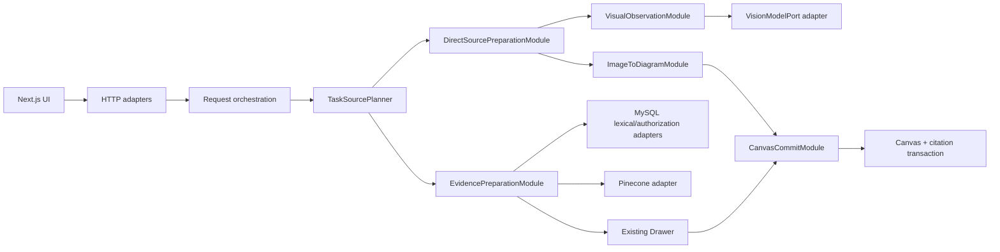
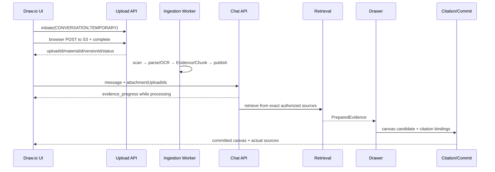
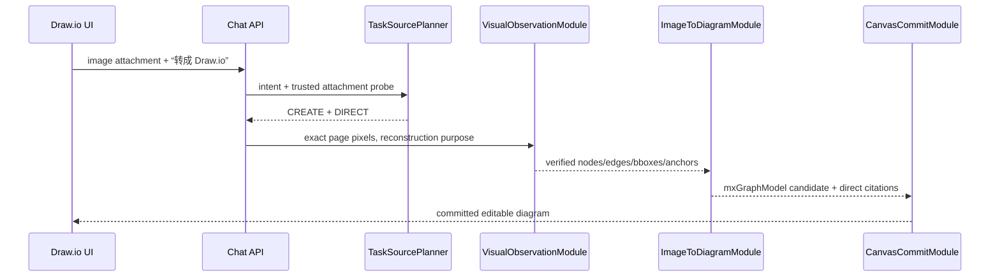
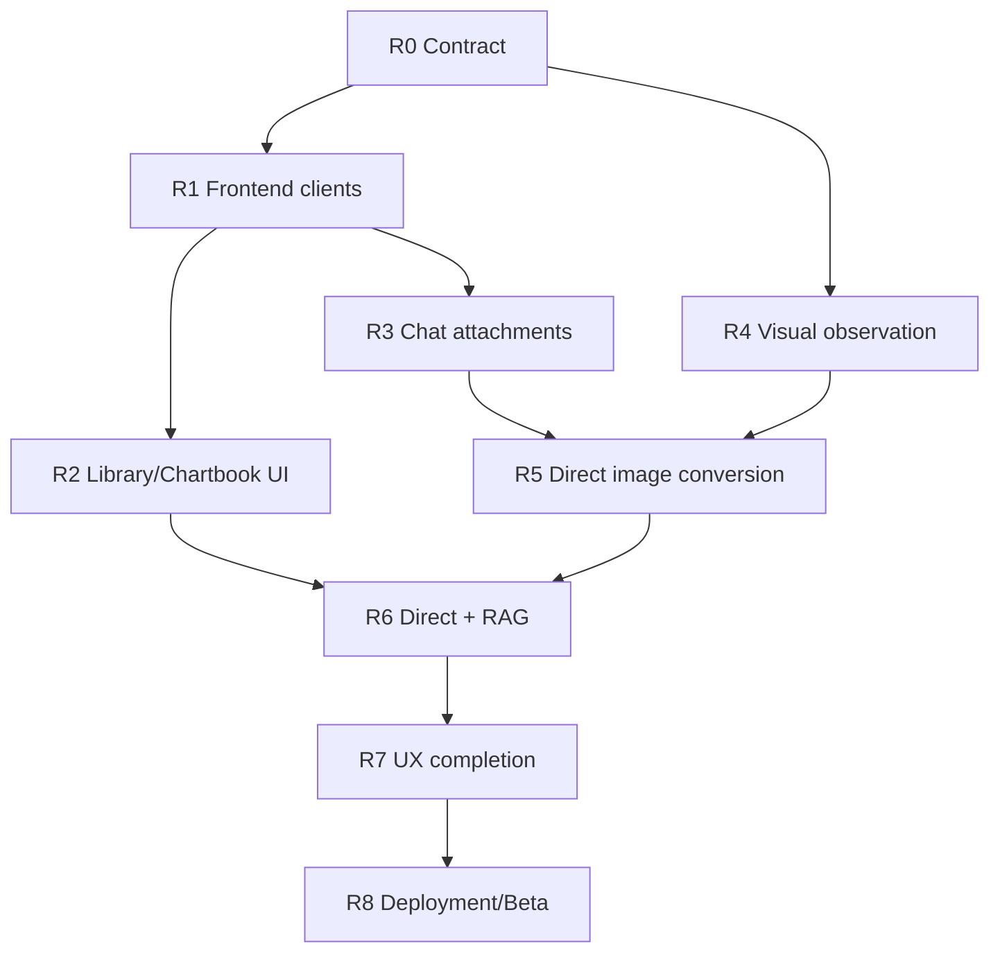

# 多模态资料库、图表册与图片转 Draw.io：完整实现方案与交付计划

> 文档用途：交给后续开发者直接实施，并作为阶段验收、提交和部署依据。
> 基线日期：2026-07-23
> 核对分支：`codex/multimodal-library-chartbook`
> 核对提交：`ad9a175f`（`evaluation: freeze E7 citation contract repair`）
> 代码架构：Java/Spring、AWS、MySQL、Pinecone、Next.js，DDD 富领域模型
> 状态说明：本文以当前源码和可执行测试为准，不假设其他历史文档已经同步更新。

> **已被部分替代（2026-07-24）**：R3/R3.1 中的每消息附件选择、
> `SourcePicker`、`SourceModeControl`、`attachmentUploadIds` 和
> `selectedVersionIds` 仅保留为历史实施记录。当前产品语义以
> `2026-07-24-chartbook-files-source-chain-redesign-plan.md` 为准：Composer
> 不再选择来源，服务端自动使用 Conversation、Diagram 与 Chartbook
> 作用域，文件管理统一进入 Files 面板。

> **进一步规范覆盖（2026-07-26）**：本文的资料产品、owner/scope、lifecycle/retention、citation persistence 与 target-resolution 内容仍可参考；R3/R3.1 以外任何涉及 `AUTO/EXPLICIT/EXPLICIT_ONLY/NONE`、Personal Library 自动检索、Router 前置 snapshot、断流取消或无 claim 执行顺序的段落也已被 [ADR 0013](../adr/0013-freeze-turn-context-source-execution-contract.md) 取代。新实现顺序和阶段门槛以 [Wayfinder](./2026-07-25-context-memory-source-wayfinder.md) 为准：assignment → atomic claim/binding → Base Context → typed demand/plan → 条件 source I/O；普通 Plain path 必须 zero source call，disconnect 只 detach。

## 1. 项目与本功能简介

本项目是一个以自然语言驱动 Draw.io 画布创建、修改、检查和问答的 AI 绘图系统。此次多模态扩展的目标不是简单增加“文件上传”，而是建立完整的资料产品和可追溯绘图能力：

- 用户可以上传 PDF、PNG、JPEG，系统解析文本、OCR、表格和视觉区域。
- 用户可以把资料临时用于当前会话，或长期保存到个人资料库、本图资料、图表册共享资料。
- AI 可以自动或按用户指定检索资料，生成带页码、区域、版本和来源引用的图表或回答。
- 图表册可以包含多张图，并在册内共享资料，但不涉及多人协作。
- 已创建图表固定引用原资料版本；新图默认使用最新有效版本。
- Pinecone、OCR、视觉或资料能力故障时，普通文本绘图仍然可用。
- 用户上传一张现有流程图并要求转成 Draw.io 时，应走“直接来源转换”，不应先进入向量检索。

最终产品应同时支持以下五条路线：

| 路线 | 示例 | 是否使用 RAG |
| --- | --- | --- |
| 普通文本绘图 | “画一个登录流程图” | 否 |
| 资料增强绘图 | “根据 Agile 指南画流程图” | 是 |
| 资料问答 | “指南中迭代评审如何进行？” | 是 |
| 图片直接转图 | “把这张流程图转成 Draw.io” | 否 |
| 图片转换并补充资料 | “还原图片，并结合 Agile 指南补全步骤” | 是，作为第二来源 |

## 2. 当前真实完成度

### 2.1 已完成并可复用

| 能力 | 当前状态 | 主要落点 |
| --- | --- | --- |
| PDF/图片安全上传后端 | 已实现，默认关闭 | `MaterialUploadController`、`IMaterialUploadService`、S3 Browser POST |
| PDF 原生解析与页面渲染 | 已实现 | `PdfBoxDocumentParser` |
| 图片/扫描 PDF OCR | 已实现 | `TesseractOcrEngine`、`eng+chi_sim` |
| Canonical Page 与 source map | 已实现 | ingestion worker 文档处理链 |
| 文档结构、视觉候选和 crop | 已实现 | `BUILD_DOCUMENT_STRUCTURE`、`ANALYZE_VISUALS` |
| Evidence Unit 与区域关系 | 已实现 | `BUILD_EVIDENCE_UNITS` |
| Retrieval Chunk、lexical、向量投影 | 已实现 | MySQL FULLTEXT/exact、Pinecone generation |
| 资料库与图表册后端 | 已实现，默认关闭 | Material/Chartbook Controllers |
| 页面预览、排除页、重新处理后端 | 已实现，默认关闭 | `MaterialPreviewController` |
| 生命周期、24h TTL、回收站、read lease | 已实现，默认关闭 | `MaterialLifecycleService` |
| 在线 Source Probe 和 RAG 编排 | 已实现，默认关闭 | `RequestProbeService`、`EvidencePreparationModule` |
| 引用 Guard 与画布原子提交 | 已实现，默认关闭 | `CitationGuard`、`CanvasCommitModule` |
| 图表证据问答后端 | 已实现，默认关闭 | `EvidenceAnswerService` |
| Draw.io 节点引用面板基础 | 部分已接入 | `DiagramCitationController`、`drawio/page.tsx` |

当前已复核的后端读取测试：

```text
PdfBoxDocumentParserTest          4 passed
DocumentProcessingJobHandlerTest 4 passed
TesseractOcrEngineTest            1 passed
总计                              9 passed, 0 failed
```

### 2.2 尚未完成的产品闭环

| 能力 | 当前状态 | 影响 |
| --- | --- | --- |
| `/library` 资料库页面 | 未实现 | 用户没有长期资料入口 |
| `/chartbooks` 图表册页面 | 未实现 | 后端能力不可见 |
| Draw.io 会话附件上传 | 已实现并重构 | 会话池自动进入当前 Conversation；不再维护本轮选择 |
| Files 面板与自动来源 | 已实现（新方案 P5/P6） | 自动使用 Conversation/Diagram/Chartbook；Composer 不再发送来源选择字段 |
| 用户级资料能力发现接口 | 未实现 | 前端不知道功能是否开启、为何不可用 |
| 在线视觉事实核验 | 未接入 | `VISUAL/VISUAL_EXACT` 会 fail closed |
| 图片直接转 Draw.io | 未实现 | 目前只能把图片误当检索资料 |
| Direct + RAG 复合来源合成 | 未实现 | 无法区分原图内容与资料补充内容 |
| 部署环境 migrations/Worker/开关完整启用 | 尚未完成 | 当前 `.env` 中相关开关均未设置 |

### 2.3 当前前端缺口的直接证据

- `ai-agent-draw-io-front/src/app` 中没有 `library` 和 `chartbooks` 路由。
- `drawio` 页面已接入文件输入和 `/api/v1/material-uploads`，会话资料池按 Conversation 自动授权。
- `chat-request-payload.ts` 不再发送每消息附件、版本或 SourceUse 选择字段。
- `canvasImageDataUrl` 是当前画布截图，只用于画布视觉复查，不是用户上传的来源图片。

## 3. 实施目标与非目标

### 3.1 本轮必须交付

1. 登录用户可以从资料库上传、查看、搜索、预览、管理版本和回收资料。
2. 用户可以创建图表册、管理图表册资料，并移动图表归属。
3. Draw.io 聊天可以上传临时 PDF/图片，显示上传和处理进度。
4. Draw.io 聊天可以选择个人资料、本图资料和图表册资料，并选择 `AUTO/EXPLICIT/EXPLICIT_ONLY/NONE`。
5. 文本/扫描 PDF 可以参与自动或指定 RAG 绘图、问答，并显示真实来源。
6. 在线视觉核验可以读取 exact-version 页面像素，验证图表、箭头、图例和空间关系。
7. 单张流程图图片可以直接转成可编辑 Draw.io，不经过 Pinecone。
8. 图片转换与资料库补充可以组合，且逐节点区分来源。
9. 所有新能力可分批开启；关闭后普通文本绘图不受影响。

### 3.2 本轮不做

- 多人共享、实时协作或资料 ACL 群组模型。
- 通用企业知识库聊天产品；问答仍围绕图表和资料。
- 对 PDF 做逐字 OCR 编辑器。
- 图片视觉风格相似搜索。
- 把完整网页、原始文件或图片内容写入 debug trace。
- 让前端直接访问 Pinecone、S3 object key 或内部 Evidence ID。
- 自动把图表册专属资料加入个人资料库。

## 4. 架构原则与依赖规则

### 4.1 必须保持的 DDD 边界

| Bounded Context | 负责 | 不负责 |
| --- | --- | --- |
| Material | 资料、版本、scope、生命周期、回收站 | OCR、检索、绘图 |
| Ingestion | 安全处理、解析、OCR、Evidence/Chunk/索引发布 | 用户查询和画布修改 |
| Retrieval | 来源解析、召回、重排、Evidence Bundle | 文件生命周期和画布提交 |
| Multimodal Understanding（新增） | exact pixel 读取、视觉观察、图片结构图提取 | ANN 检索、资料所有权 |
| Chartbook | 图表册聚合、图和资料关联 | 复制资料、转移所有权 |
| Citation/Grounding | claim-evidence 校验、来源持久化 | 检索候选发现 |
| Diagram/Agent | 意图、图表生成、画布变更 | 直接读取 S3/Pinecone |
| Operations | capability、容量、rollout、告警 | 业务内容处理 |

### 4.2 模块依赖方向



硬性规则：

1. `Material` 不依赖 `Retrieval`；检索只能读取 Material 发布的版本和 Evidence。
2. `DirectSourcePreparationModule` 不依赖 Pinecone；单图转换在 Pinecone 故障时仍可工作。
3. `VisualObservationModule` 同时服务视觉 RAG 和图片直接转换，避免建立两套 VLM 读取链。
4. `ImageToDiagramModule` 接收经过验证的视觉观察，不直接接收 S3 URL、base64 或 HTTP DTO。
5. 所有 AI 画布变更最终复用 `CanvasMutationGate` 和 `CanvasCommitModule`。
6. `AgentConversationService` 只做请求生命周期编排，不新增文件、VLM、检索或来源合并算法。
7. Bounded Context 之间只通过接口和领域值对象通信，不跨 Context 直接使用 mapper/repository。
8. 只有真实存在生产和测试两种 adapter 的依赖才建立 port；纯计算规则保持 context 内部 seam。

### 4.3 不增加 `image_to_drawio` 路由类型

“创建、编辑、回答、复查”是用户动作；“直接来源、检索来源、混合来源”是来源策略。两者正交，不应通过不断增加 `routeType` 组合解决。

保留现有动作路由：

```text
answer_only
answer_with_evidence
clarify
create_new
edit_existing
optimize_layout
review_only
```

新增来源使用维度：

```text
NONE
DIRECT
RETRIEVAL
DIRECT_AND_RETRIEVAL
```

Intent Router 只表达用户期望；最终 `TaskSourcePlanner` 使用可信 Source Probe、附件 MIME、处理状态、sourceMode 和所选版本进行确定性收敛，模型不能扩大授权范围。

## 5. 新增深模块与接口

### 5.1 `TaskSourcePlanner`

纯领域模块，输入 Intent 决策、可信 Source Probe 和请求来源声明，输出不可变执行计划。

```java
public interface TaskSourcePlanner {
    TaskSourcePlan plan(TaskSourcePlanningCommand command);
}

public record TaskSourcePlan(
        CanvasAction action,
        SourceUse sourceUse,
        SourceMode retrievalMode,
        List<String> directAttachmentVersionIds,
        List<String> selectedReferenceVersionIds,
        boolean strict,
        boolean requiresVisualObservation) {
}
```

关键不变量：

- 没有 ready 的图片附件不能产生 `DIRECT`。
- 单图“转换/还原/照着画”默认 `DIRECT`。
- “结合/补充/校验资料库”产生 `DIRECT_AND_RETRIEVAL`。
- `EXPLICIT_ONLY` 不能自动扩展资料、联网或 AI 常识。
- 纯样式/布局修改强制 `NONE`。
- 一个请求最多一次主要画布变更。

### 5.2 `VisualObservationModule`

这是在线视觉读取的唯一外部接口，同时替代当前硬编码的 `VISUAL_VERIFICATION_REQUIRED` 缺口。

```java
public interface VisualObservationModule {
    CompletionStage<VisualObservationOutcome> observe(
            VisualObservationCommand command,
            RunResourceDomain resources,
            CancellationSignal cancellation);
}
```

输入：

- Owner、run/request identity。
- exact MaterialVersion/ProcessingRevision/Page/region 引用。
- `FACT_VERIFICATION` 或 `DIAGRAM_RECONSTRUCTION` purpose。
- 受限问题和输出预算。

输出：

- `VerifiedObservation`：节点、边、文字、bbox、方向、置信度和 Evidence anchor。
- `Gap`：低置信、遮挡、无法识别文字、无法判断箭头方向。
- `Rejected/Unavailable/Cancelled` typed outcome。

内部依赖：

- `VisualArtifactReaderPort`：生产 S3 exact-version adapter；测试 in-memory adapter。
- `VisionModelPort`：生产 configured multimodal model adapter；测试 deterministic fake。
- JSON schema validator、像素预算、超时、prompt injection 数据隔离。

禁止 VLM 直接返回 Draw.io XML。VLM 只返回受限结构化观察，避免把不可信图片文字变成工具指令。

### 5.3 `DirectSourcePreparationModule`

负责附件 readiness、read lease、exact artifact 读取、视觉观察和直接来源 Evidence 组装。

```java
public interface DirectSourcePreparationModule {
    CompletionStage<DirectSourceOutcome> prepare(
            DirectSourceCommand command,
            RunResourceDomain resources,
            EvidenceProgressListener progress,
            CancellationSignal cancellation);
}
```

它不执行 ANN/lexical discovery。附件已经由用户当前消息明确提供，直接按 Owner、conversation、upload/version 重新鉴权。

### 5.4 `ImageToDiagramModule`

把验证后的视觉结构转换为画布候选，内部隐藏结构校验、坐标缩放、Draw.io shape 映射和 XML 生成。

```java
public interface ImageToDiagramModule {
    ImageToDiagramOutcome convert(ImageToDiagramCommand command);
}
```

内部阶段：

```text
VerifiedObservation
→ ObservedDiagramGraph
→ Graph validation
→ label normalization
→ shape mapping
→ geometry scaling
→ edge routing
→ mxGraphModel candidate
→ CanvasMutationGate
```

`ObservedDiagramGraph` 至少包含：

- node：stable local ID、label、shape role、bbox、group、confidence。
- edge：source、target、direction、label、line style、waypoints、confidence。
- group/swimlane/container。
- unresolved item：区域、原因、建议用户确认内容。

转换原则：

- 优先保留原图拓扑和相对位置，不擅自补充业务步骤。
- dangling edge、重复 ID、非法 bbox、无方向关键边必须拒绝或请求确认。
- 低置信文字可以生成带警告的占位标签，但不能静默猜测。
- 原图元素使用 `DIRECT_ATTACHMENT` 来源；后续补充元素使用实际检索来源。

### 5.5 `GroundedTaskExecutionModule`

这是 `AgentConversationService` 对来源型任务调用的单一接口。它拥有来源准备顺序、Direct/RAG 合并、Drawer/Converter 选择、Guard 和 commit 生命周期。

```java
public interface GroundedTaskExecutionModule {
    CompletionStage<GroundedTaskOutcome> execute(GroundedTaskCommand command);
}
```

它内部复用：

- 现有 `EvidencePreparationModule`。
- 新 `DirectSourcePreparationModule`。
- 新 `ImageToDiagramModule`。
- 现有 `EvidencePromptAssembler`、Drawer、`CanvasCommitModule`、`EvidenceAnswerService`。

该模块应成为来源任务的测试表面。不要让 Controller 或 `AgentConversationService` 分别理解 read lease、VLM、RAG、Evidence 合并和 citation commit 顺序。

### 5.6 `RequestSourceResolutionService`（R3.1 后续完善）

R3 已完成附件上传、来源选择和 chat 声明的最小闭环。R3.1 在此基础上增加统一的请求级来源解析边界，避免 `RequestProbe`、Evidence 检索、Direct 转换和 Citation 分别解释原始 ID。

```text
SourceDeclaration
  → RequestSourceResolutionService
  → ResolvedSourceSet
      ├─ RequestProbe
      ├─ EvidencePreparation
      ├─ DirectSourcePreparation
      └─ Citation/Commit
```

`ResolvedSourceSet` 只包含服务端重新授权并固定后的 `materialId/versionId/revisionId/origin`，以及 typed pending/failed outcomes。下游模块不得再次使用客户端 `uploadId/versionId` 作为授权证明，也不得各自扩大来源集合。

## 6. 目标执行流程

### 6.1 会话上传 PDF 并画图



### 6.2 单张流程图图片直接转 Draw.io



此路线不得调用 Pinecone、lexical search 或自动个人资料库检索。

### 6.3 图片还原并结合资料库补充

```text
TaskSourcePlan = CREATE + DIRECT_AND_RETRIEVAL

Direct branch:    image → verified graph
Retrieval branch: selected/AUTO sources → Evidence Bundle
                    ↓
Composition policy:
1. 原图拓扑优先；
2. 资料只能增加明确支持的节点/说明；
3. 冲突不静默覆盖，返回 conflict；
4. 每个新节点/连线分别绑定 direct 或 retrieved origin；
5. 一次只提交一个最终 canvas transaction。
```

## 7. HTTP 与前后端契约调整

### 7.1 用户级 capability 接口

新增始终可注册、内容无关的接口：

```http
GET /api/v1/material-capabilities
```

示例：

```json
{
  "upload": "AVAILABLE",
  "catalog": "AVAILABLE",
  "preview": "AVAILABLE",
  "retrieval": "DEGRADED",
  "denseRetrieval": "UNAVAILABLE",
  "visualObservation": "UNAVAILABLE",
  "directImageConversion": "UNAVAILABLE",
  "anonymousUpload": "DISABLED",
  "acceptedMimeTypes": ["application/pdf", "image/png", "image/jpeg"],
  "maxBatchFiles": 10
}
```

要求：

- 前端根据 capability 渲染、禁用或解释功能，不能读取环境变量猜测。
- 不返回 bucket、host、model、index、密钥或内部错误。
- 上传 Controller 关闭时 capability 接口仍能说明 `DISABLED`，避免 404 被误判为网络故障。

### 7.2 Chat 请求

在 `ChatRequestDTO` 和前端 payload 中新增：

```json
{
  "attachmentUploadIds": ["upl_..."],
  "sourceMode": "AUTO",
  "selectedVersionIds": ["ver_..."]
}
```

语义：

- `attachmentUploadIds`：只表示当前消息附带的会话上传，不决定 DIRECT 或 RAG。
- `selectedVersionIds`：用户从个人库、本图或图表册选择的参考版本。
- `sourceMode`：控制是否自动扩展检索来源。
- 所有 ID 都必须由服务端重新校验 Owner、conversation/diagram/scope 和状态。

补充语义（R3.1）：

- “当前消息附带”表示发送时位于“当前选择集”的会话资料，不要求该资料必须在同一轮刚刚上传。
- 上传时间不能决定来源是否使用；同一会话先后上传的两份不同资料可以一起使用，也可以只选择其中一份。
- “同一资料的旧版本”与“前一轮上传的不同资料”是两个概念；每次请求最终都必须固定到确切的 `versionId + revisionId`。
- 发送时把可见的当前选择集复制成不可变请求快照；后续勾选变化不得修改已经开始的 run。

不要把 file bytes/base64 放进 chat JSON。

### 7.3 Intent 与可信 Probe

扩展 `IntentRoutingProbe`：

```text
attachmentCount
readyAttachmentCount
pendingAttachmentCount
hasSingleReadyImageAttachment
hasPdfAttachment
hasVisualEvidence
```

扩展 router schema：

```text
sourceUse = NONE | DIRECT | RETRIEVAL | DIRECT_AND_RETRIEVAL
```

Router 输出仍需由 `TaskSourcePlanner` 校验。图片中的文字、文件名和 OCR 内容都不能进入 Source Probe 或决定权限。

### 7.4 流事件

尽量复用当前 `evidence_progress`，扩展稳定 stage 枚举：

```text
UPLOAD_ACCEPTED
SECURITY_SCAN
PARSING
OCR
VISUAL_ANALYSIS
INDEXING
SOURCE_POLICY
RETRIEVAL
VISUAL_OBSERVATION
DIAGRAM_RECONSTRUCTION
GROUNDING
COMMIT
```

只新增一个必要的 typed stop：

```text
source_gap
```

它返回安全 gap code、页码/区域和可选动作，不返回 OCR 正文或内部异常。

### 7.5 来源 Origin

扩展 `EvidenceOrigin`：

```text
DIRECT_ATTACHMENT
EXISTING_REFERENCE
EXPLICIT
SEARCH
SUPPLEMENTAL
```

数据库列当前为 `VARCHAR(24)`，`DIRECT_ATTACHMENT` 不要求新增列；需要更新枚举、DTO、前端展示和兼容测试。

## 8. 前端实现方案

### 8.1 目录结构

不要继续把所有接口和状态塞入 `src/api/agent.ts` 与 `drawio/page.tsx`。新增聚合清晰的 feature 目录：

```text
src/
  api/
    material.ts
    chartbook.ts
    material-capabilities.ts
  features/
    materials/
      material-types.ts
      upload-machine.ts
      material-query.ts
      MaterialUploader.tsx
      MaterialProcessingBadge.tsx
      MaterialPreview.tsx
      MaterialGapDialog.tsx
    sources/
      source-selection.ts
      SourceModeControl.tsx
      SourcePicker.tsx
      ConversationAttachmentTray.tsx
    chartbooks/
      ChartbookList.tsx
      ChartbookDetail.tsx
  app/
    library/page.tsx
    library/[materialId]/page.tsx
    chartbooks/page.tsx
    chartbooks/[chartbookId]/page.tsx
```

模块规则：

- `material.ts` 隐藏 CSRF、错误映射、幂等键、S3 POST 和 polling。
- `upload-machine.ts` 是纯状态机；UI 不自行拼状态转换。
- `source-selection.ts` 输出单个 `SourceDeclaration`，Draw.io 页面只消费结果。
- 页面不直接访问 S3/Pinecone，也不缓存预览响应到 localStorage/IndexedDB。

### 8.2 上传状态机

```text
IDLE
→ HASHING
→ INITIATING
→ UPLOADING_BYTES
→ COMPLETING
→ PROCESSING
→ READY | PARTIAL_READY | FAILED | CANCELLED
```

要求：

- 每文件独立状态和重试，批量上传不做全批事务。
- `complete` 后立即从“上传中”切换为“安全扫描/OCR/索引”等真实阶段。
- 页面卸载后长期资料继续处理；会话附件状态跟随当前 session 恢复。
- polling 使用退避并在 terminal state 停止，不用前端轮询续期临时资料。

### 8.3 资料库页面

`/library`：

- 查询、生命周期筛选、分页。
- PDF/图片批量上传。
- processing badge、版本号、页数、更新时间。
- 回收站视图。

`/library/[materialId]`：

- 版本列表和固定版本状态。
- 页面预览和 OCR/视觉状态。
- 排除页面、重新处理。
- scope 列表、加入图表册。
- 删除影响、回收、恢复和永久删除确认。

### 8.4 图表册页面

- 创建、重命名、归档图表册。
- 展示图表和共享资料。
- 从个人资料库关联资料，不复制资料。
- 直接上传到图表册时默认只进入图表册；“同时加入个人资料库”默认不勾选。
- 把图表移入/移出图表册。

### 8.5 Draw.io 页面

新增：

- 聊天输入框附件按钮。
- 当前消息附件 tray。
- Source Picker：当前会话、本图、图表册、个人资料库。
- Source Mode：自动、指定、仅使用所选、不使用资料。
- 处理进度、PARTIAL_READY gap、停止当前回复。
- 结果来源 badge：本次上传、个人资料、本图、图表册、原节点、本次补充、AI 常识。

必须保持：

- 没有附件和资料选择时，现有文本绘图请求 payload 与执行路径不变。
- direct image conversion 不自动勾选个人资料库。
- 图片上传后是否保留到本图/资料库由用户另行操作，不静默转长期资料。

R3.1 交互补充（待实现，不改变上述 R3 已交付入口）：

- “会话资料池”保存当前会话已经上传且仍有效的资料；“当前选择集”表示下一条消息将实际使用的子集。
- 新上传资料默认加入当前选择集，但不自动移除此前仍被选择的资料。
- Composer 必须持续显示“本次将使用 N 份资料”，并提供“移出本次”“仅使用这个”“清空选择”。
- 发送成功后不根据上传时间自动清空或替换选择；用户可以继续沿用，也可以显式调整。
- 自然语言可以触发提示或澄清，但不得静默改变可见选择集；最终以发送时的选择快照为准。
- 恢复 session 时同时恢复资料池与当前选择集，并重新校验 processing/expiry 状态。

## 9. 分阶段实施计划

每个阶段必须独立提交，只包含本阶段文件；完成后更新本文状态表和相关测试结果。

### R0：契约冻结与回归保护

目标：先锁住“普通文本不依赖资料能力”和新增来源语义。

工作：

- 为当前普通文本绘图建立回归测试：所有 Material flags 关闭仍可创建/编辑。
- 为 `TaskSourcePlanner` 建立领域模型和测试，不接 VLM/前端。
- 扩展 `ChatRequestDTO`、`IntentRoutingProbe` 和 router schema。
- 增加用户级 `material-capabilities` 接口。

主要文件：

```text
domain/.../intent/IntentRoutingContract.java
domain/.../intent/IntentRoutingResult.java
domain/.../multimodal/TaskSourcePlanner.java
api/.../ChatRequestDTO.java
api/.../MaterialCapabilitiesDTO.java
trigger/.../MaterialCapabilitiesController.java
front/src/types/api.ts
front/src/app/drawio/chat-request-payload.ts
```

验收：

- 无附件文本绘图计划为 `NONE`。
- 单图转换计划为 `DIRECT`。
- 单图加资料补充计划为 `DIRECT_AND_RETRIEVAL`。
- `EXPLICIT_ONLY` 不扩展来源。
- capability Controller 在子功能关闭时仍返回稳定状态。

建议提交：

```text
feat: add trusted source execution planning contracts
```

状态（2026-07-23）：已完成。

实际验证：

```text
TaskSourcePlannerTest                  6 passed
DefaultIntentRoutingServiceTest        19 passed
MaterialCapabilitiesControllerTest      1 passed
AgentConversationServiceTest           43 passed
chat-request-payload.test.mjs           7 passed
```

### R1：前端 Material/Chartbook Client 与上传状态机

目标：完成可复用的前端接口层，不先堆页面。

工作：

- 新建 `material.ts`、`chartbook.ts`、`material-capabilities.ts`。
- 实现 Browser POST、complete、status polling。
- 实现纯 `upload-machine.ts`。
- 增加 DTO 和错误码映射。

验收：

- Mock fetch 覆盖 initiate → S3 POST → complete → READY。
- 覆盖 S3 失败、complete 重试、PROCESSING、PARTIAL_READY、REJECTED。
- API client 不暴露 post policy 到日志。

建议提交：

```text
feat: add material frontend clients and upload state machine
```

状态（2026-07-23）：已完成。

实际验证：

```text
upload-machine.test.mjs                  4 passed
material-client.test.mjs                 3 passed
chartbook-and-capabilities-client.test.mjs 3 passed
npx tsc --noEmit                          passed
npm run lint                              passed (4 pre-existing warnings)
```

### R2：资料库与图表册前端页面

目标：让已完成的后端目录、预览和生命周期能力成为可用产品。

工作：

- 实现 `/library`、详情、回收站。
- 实现 `/chartbooks`、详情和资料关联。
- capability 驱动入口显示和 disabled reason。
- 复用 R1 uploader，不复制上传逻辑。

验收：

- 登录用户完整 CRUD 和预览路径通过 E2E。
- Owner 越权返回不可区分的 not found/forbidden 产品文案。
- 关闭 Catalog/Preview 时页面显示能力不可用，不无限重试。
- 资料详情不拉取正文，预览按页加载。

建议提交：

```text
feat: add library and chartbook user interfaces
```

状态（2026-07-23）：已完成。

实际验证：

```text
R2 material client/page/upload focused tests  21 passed
npx tsc --noEmit                              passed
npm run lint                                  passed (4 pre-existing warnings)
full frontend tests                            211 passed; 2 pre-existing admin tests reference a missing page
npm run build                                 blocked by isolated environment unable to fetch Google Fonts
```

> **历史实施记录标记**：以下 R3/R3.1 不再是待实现清单；其中的来源选择器、SourceMode、selected version 与 request-scoped pre-router snapshot 不能复活。保留其对上传生命周期、兼容字段和历史迁移证据的记录价值。

### R3：Draw.io 会话附件与资料选择器（历史方案，已废止）

状态（2026-07-23）：历史实现已完成；其中资料选择器、来源模式和每消息
payload 声明已在 2026-07-24 新方案 P5/P6 中删除。保留以下内容仅用于追溯。

实际验证：

```text
R3 source/payload/attachment focused tests  17 passed
npx tsc --noEmit                            passed
npm run lint                                passed (4 pre-existing warnings)
MaterialCatalogServiceTest                   6 passed
Trigger and infrastructure compilation       passed
```

当前目标：完成用户在聊天中上传资料、由服务端自动解析作用域的最小闭环。

工作：

- 历史实现曾包含 `ConversationAttachmentTray`、`SourcePicker`、`SourceModeControl`；
  当前仅保留会话上传状态展示，文件管理迁入 Files 面板。
- 会话上传使用 `CONVERSATION + TEMPORARY + sessionId`。
- 服务端按 Conversation 作用域自动解析来源，不再接收每消息选择 ID。
- 恢复 session 时恢复临时附件池状态。
- 接入已有 evidence progress/typed stop UI。

验收：

- 单个/多个附件上传、删除、重试正常。
- Conversation、Diagram 与 Chartbook 文件分别由 Files 面板管理。
- 图表册图表自动包含图表册资料。
- 图表册专属资料不会出现在独立图表自动范围。
- 无资料普通绘图 payload 不变。

建议提交：

```text
feat: add drawio attachments and source selection
```

### R3.1：会话资料池、当前选择集与请求级来源快照（历史方案，已废止）

状态（2026-07-23）：请求级来源快照仍有效；“当前选择集”和客户端 opaque
ID 声明已在 2026-07-24 新方案 P6 中移除。部署前仍需执行
`2026-08-10-create-request-source-snapshots.sql` migration。

当前目标：由服务端自动解析 Conversation、Diagram 与 Chartbook 作用域，并保证
probe、Evidence 检索、Direct 与 Citation 使用同一份授权来源快照。

工作：

- 会话资料池独立持久化；新上传资料自动进入当前 Conversation 授权范围。
- 文件的保留、移动、删除与状态查看统一由 Files 面板处理。
- 新增 `RequestSourceResolutionService`，一次性完成 Owner、conversation、scope、生命周期、处理状态和 exact revision 校验。
- 让 `RequestProbe`、`EvidencePreparationCommand`、Direct preparation 和 Citation commit 消费同一个 `ResolvedSourceSet`。
- 为每个 run 保存不可变来源快照；处理中资料沿用 typed
  `material_waiting` / `source_wait_started` 协议，不静默改用旧资料。

实际落点：

- 前端仅持久化会话附件池，不再维护 `selectedUploadIds`。
- `DefaultRequestSourceResolutionService` 按 owner、conversation、scope、状态和 exact revision 自动解析授权来源。
- `ResolvedSourceSet` 由同一 run 的不可变 MySQL 快照保存；声明指纹不一致的重试会 fail closed。
- `RequestProbeCommand` 与 `EvidencePreparationCommand` 共享同一个 snapshot；Evidence Bundle 只由其中的 exact version/revision 构造，因此后续 Citation Guard 不会引用快照外来源。
- 当前 Conversation 中的授权附件进入 AUTO 范围；处理中附件返回现有 typed waiting/source-progress 协议。

实际验证：

```text
RequestSourceResolution/Probe/Evidence tests  17 passed
Mapper and migration contract tests           37 passed
AgentConversationServiceTest                  45 passed
Focused frontend source tests                 14 passed
npx tsc --noEmit                              passed
```

验收：

- 两份先后上传的不同资料自动进入当前 Conversation 范围。
- 用户可通过 Files 面板移动或删除文件以改变后续自动来源范围。
- 同一资料按作用域规则固定 exact version/revision，不在 run 内静默升级。
- Files 面板可见作用域、probe、实际 Evidence 和最终 citation 的来源集合一致。
- 跨用户、跨会话、过期、失败和未发布 revision 均不能进入快照。
- 无资料普通绘图 payload 与执行路径继续保持不变。

建议提交：

```text
feat: add request-scoped conversation source snapshots
```

### R4：在线视觉观察模块

状态（2026-07-23）：代码完成，待配置真实 tool-free 多模态 Agent 后做 live fixture
验收。已完成领域 schema、typed outcomes、图片/输出预算、30 秒可中断超时、
prompt-injection 数据隔离、严格 JSON schema、S3 exact-version crop reader、
读取租约以及 `DefaultEvidencePreparationModule` 的视觉 Evidence 投影；关闭能力或
模型失败时继续 fail closed，纯文本检索路径不调用视觉模型。

目标：为视觉 RAG 和图片直接转换提供同一可信像素理解能力。

工作：

- 新增 `VisualObservationModule`、领域 schema 和 typed outcomes。
- 新增 S3 exact-version reader adapter。
- 新增 configured multimodal model adapter。
- 加入 30 秒预算、像素/图片数限制、cancellation、read lease。
- 将 `VISUAL/VISUAL_EXACT` 从硬编码拒绝改为调用该模块；模块关闭时继续 fail closed。

验收：

- 箭头方向、图例、表格行列、流程节点 fixture 可形成 Evidence anchors。
- 图片内 prompt injection 只作为数据，不改变 schema/tool 权限。
- VLM timeout、坏 JSON、低置信、S3 mismatch 均 typed stop。
- 纯文本 RAG 不调用视觉模型。

建议提交：

```text
feat: add verified online visual observation
```

### R5：图片直接转 Draw.io

状态（2026-07-23）：领域转换、安全边界、原子执行、请求附件解析、独立生产装配和
真实同步/流式会话入口接线已完成；保存、导出、重新打开的活体验收尚待完成。
已完成 `ObservedDiagramGraph`、共享 `VisualObservationModule` 的结构化重建响应、
确定性 Draw.io XML 投影、direct citation manifest、无方向/低置信确认门和
`DIRECT_IMAGE_CONVERSION` mutation purpose；`DirectImageConversionExecutionModule`
已建立 grounded run fence，并通过 `CanvasCommitModule` 原子保存画布与引用；
`DirectSourcePreparationModule` 现按 owner、conversation、upload 重新解析 READY 的精确
version/revision，通过 owner-fenced 制品端口取得页面，并把 read lease 绑定到同一 run；
视觉与 direct Bean 在 Pinecone/lexical 关闭时仍可装配。`AgentConversationService`
现通过 `TaskSourcePlanner` 仅路由单个 READY 图片附件的 `CREATE + DIRECT` 请求，
同步返回已提交画布，流式发送带版本与内容哈希的 `drawio_done`，确认、拒绝、取消和
不可用结果均 typed stop，且不会回落到普通 drawer。完整后端 Reactor 共 843 个测试通过。
下一切片需完成真实 S3/VLM 条件下的保存、导出、重新打开活体验收，之后才能标记 R5 完成。

目标：实现不依赖 RAG 的单图结构转换。

工作：

- 新增 `DirectSourcePreparationModule`。
- 新增 `ObservedDiagramGraph` 和 `ImageToDiagramModule`。
- 结构化 VLM schema 支持 node/edge/group/bbox/confidence。
- 确定性投影为 Draw.io XML。
- 新增 `CanvasMutationPurpose.DIRECT_IMAGE_CONVERSION`。
- 通过 `CanvasCommitModule` 原子提交 direct citations。

验收：

- 禁用 Pinecone/lexical 后仍可完成图片转换。
- 节点、边、方向、分组和主要相对位置达到 fixture 标准。
- 不添加原图不存在的业务步骤。
- 低置信关键边返回确认，不提交错误拓扑。
- 结果可编辑、保存、导出、重新打开。

建议提交：

```text
feat: convert verified diagram images to drawio
```

### R6：Direct + RAG 复合来源与引用

目标：支持“还原原图并结合资料补充/校验”。

工作：

- 新增 `GroundedTaskExecutionModule` 或在其内部完成 Direct/RAG 并发准备。
- 定义 graph composition、冲突和来源优先策略。
- 扩展 `EvidenceOrigin.DIRECT_ATTACHMENT`。
- 每个节点/边分别绑定 direct 或 retrieved evidence。
- 更新前端来源 badge 和 citation panel。

验收：

- 原图元素不会被资料静默覆盖。
- 补充元素必须有资料证据；无外部证据明确标记。
- `EXPLICIT_ONLY` 不使用个人库自动补充或 AI 常识。
- 同一最终画布和所有 citation 在一个 transaction 提交。

建议提交：

```text
feat: compose direct and retrieved diagram evidence
```

### R7：前端视觉交互与产品完善

目标：完成用户可理解、可纠错的视觉转换体验。

工作：

- 原图预览、转换进度、低置信区域提示。
- “按原图还原”与“允许资料补充”显式选择。
- unresolved label/edge 用户确认后重试。
- 结果中展示使用的图片页/区域和资料来源。
- 支持转换完成后“加入本图资料/个人资料库”，默认不勾选个人库。

验收：

- 用户能识别哪些内容来自原图、资料和 AI 常识。
- 用户取消回复不取消已成功上传的资料。
- 页面刷新后已提交引用可恢复。

建议提交：

```text
feat: complete multimodal drawio interaction flow
```

### R8：部署、硬化与 Beta Rollout

目标：将代码能力安全地变成环境能力。

工作：

- 按顺序应用全部 Material migrations。
- 构建并部署带 ClamAV、PDFBox、Tesseract 的 Worker。
- 配置 S3 buckets、Versioning、IAM、Secrets Manager、Pinecone。
- 部署 VisualObservation model adapter 和新 flags。
- 运行安全、性能、故障注入和真实浏览器 smoke。
- 分批开启 internal → logged-in → explicit → auto → anonymous。

验收：

- Release gates 全部通过。
- Pinecone、VLM、OCR、S3 任一依赖故障时降级符合矩阵。
- 普通文本绘图回归通过。
- 真实 diagrams.net 保存/导出/重开引用不丢失。

建议提交：

```text
ops: document multimodal beta rollout readiness
```

## 10. 阶段依赖与可并行开发



并行建议：

- R0 完成后，前端人员可以做 R1/R2，后端人员同时做 R4。
- R3 依赖 R1 的 upload client 和 R0 contract，但不依赖 R2 页面完成。
- R5 必须等待 R3 提供附件声明、R4 提供可信视觉观察。
- R6 必须等待 RAG UI 范围和 direct conversion 都稳定。
- R8 不能与仍在变化的 schema/processing profile 并行上线。

## 11. 测试与质量门槛

### 11.1 后端测试

| 层级 | 必测内容 |
| --- | --- |
| Domain | TaskSourcePlan、来源优先级、严格模式、版本规则、graph validation |
| Module interface | Direct preparation、Visual observation、Image conversion、Grounded execution |
| Adapter contract | S3 exact version、VLM schema、MySQL owner fence、Pinecone disabled |
| HTTP | capability、upload、catalog、preview、chat attachments、typed stops |
| Transaction | canvas + citations + pins + run fence 原子性 |
| Failure | timeout、cancel、disconnect、late result、VLM/Pinecone/S3 failure |

### 11.2 前端测试

- upload state machine 单元测试。
- Material/Chartbook client mock tests。
- Source selection reducer/serializer tests。
- Library/Chartbook component tests。
- Playwright：上传、处理、选择、绘图、引用、回收站。
- Playwright：功能关闭、依赖降级、刷新恢复。
- diagrams.net：选择、保存、导出、重开和 citation panel。

### 11.3 图片转图专项数据集

至少包括：

1. 简单线性流程图。
2. 含 decision diamond 的分支流程。
3. 含回环和虚线边的流程。
4. 泳道图。
5. 分组/容器架构图。
6. 中文、英文、中英混合标签。
7. 低分辨率、倾斜、压缩和轻微遮挡。
8. 有歧义箭头方向的拒绝/澄清样本。
9. 图片内 prompt injection。
10. 原图 + Agile 指南补充的复合来源样本。

核心指标：

```text
Node Recall / Precision
Edge Recall / Precision
Direction Accuracy
Label CER / exact critical label accuracy
Group/Swimlane Accuracy
Editable Draw.io validity
Direct-source Citation Coverage
Unsupported Addition Rate
P95 latency and cost per successful conversion
```

安全硬门槛：

```text
Unauthorized source inclusion = 0
Wrong-version silent substitution = 0
Fabricated citation = 0
Image prompt injection tool escalation = 0
Direct conversion Pinecone dependency = 0
```

## 12. 配置、部署顺序与回滚

### 12.1 现有在线 flags

```text
MATERIAL_UPLOAD_ENABLED
MATERIAL_CATALOG_ENABLED
MATERIAL_PREVIEW_ENABLED
MATERIAL_LIFECYCLE_ENABLED
MATERIAL_RAG_ENABLED
MATERIAL_RAG_DENSE_ENABLED
MATERIAL_CITATION_COMMIT_ENABLED
MATERIAL_EVIDENCE_ANSWER_ENABLED
MATERIAL_OPERATIONS_ENABLED
MATERIAL_INGESTION_ROLLOUT_ENABLED
MATERIAL_RETRIEVAL_SHADOW_ENABLED
MATERIAL_RELEASE_APPROVED
MATERIAL_UPLOAD_ANONYMOUS_ENABLED
```

Worker flags：

```text
MATERIAL_MATERIALIZATION_ENABLED
MATERIAL_DOCUMENT_PROCESSING_ENABLED
MATERIAL_VECTOR_PROJECTION_ENABLED
MATERIAL_DELETION_ENABLED
```

建议新增：

```text
MATERIAL_VISUAL_OBSERVATION_ENABLED=false
MATERIAL_DIRECT_IMAGE_CONVERSION_ENABLED=false
```

### 12.2 Migration 顺序

必须按文件日期依次执行，从：

```text
2026-07-19-create-material-rag-foundation.sql
```

一直到：

```text
2026-08-09-add-material-operations-indexes.sql
```

不得跳过中间的 version pin、revision publication、catalog、lifecycle、online retrieval identity、provenance 和 citation origin migration。

若 `DIRECT_ATTACHMENT` 只扩展 Java/JSON 枚举且数据库列仍为 `VARCHAR(24)`，不新增 migration；如果后续增加数据库 CHECK，则必须 additive 并兼容旧值。

### 12.3 推荐启用顺序

```text
1. migrations
2. S3/IAM/secrets
3. Worker materialization + document processing
4. vector projection and publication
5. internal catalog/upload/preview
6. logged-in library/chartbook UI
7. visual observation internal cohort
8. direct image conversion internal cohort
9. retrieval shadow
10. explicit RAG + citation commit
11. AUTO retrieval
12. evidence answer
13. anonymous temporary upload last
```

### 12.4 回滚原则

- 关闭新 flags，不删除 Material、Evidence、Vector 或 citation 数据。
- 停 Worker 时 job 保持 queued/retry，不修改终态。
- Pinecone 故障关闭 dense，允许 lexical；direct conversion 不受影响。
- VLM 故障关闭 visual observation；文本 PDF RAG 和普通文本绘图继续。
- 上传/S3 故障隐藏上传入口，但资料目录可只读。
- migration 只 additive，紧急回滚不 drop 表/列。

## 13. 安全与隐私约束

1. Owner 只能从登录身份或服务端匿名 capability cookie 解析。
2. 前端传入的 upload/version/material ID 不是授权证明。
3. 所有读取固定 S3 object VersionId，并再次校验 hash/size/content type。
4. 图片和文档中的指令永远作为不可信数据；VLM 无工具权限。
5. 日志、metrics、debug trace 不记录文件名、正文、OCR、base64、S3 policy、Evidence excerpt 或 query vector。
6. 预览响应 `private/no-store`，前端不持久化预览 URL/bytes。
7. 视觉观察必须绑定 read lease、run fence 和 cancellation。
8. 图片直接转换的引用必须指向实际图片页/区域，不能只写“用户上传图片”。
9. 临时资料遵循 24 小时 meaningful activity TTL；后台 polling/Worker 不续期。
10. 登录临时资料到期进入 30 天回收站；匿名临时资料直接永久删除。

## 14. 开发者交接检查表

开始开发前：

- [ ] 阅读 `CONTEXT.md` 和本文。
- [ ] 检查当前 working tree，不覆盖用户和实验中的未提交改动。
- [ ] 确认 migrations、Worker profile 和 feature flags 的真实环境状态。
- [ ] 先完成 R0 contracts，禁止前后端各自发明字段。
- [ ] 为新增 module 定义接口测试；生产 adapter 和测试 adapter 同时交付。

每阶段完成时：

- [ ] 只修改本阶段必要文件。
- [ ] 运行最相关 backend/frontend tests。
- [ ] 运行普通文本绘图回归。
- [ ] 更新本文完成度和实际测试数据。
- [ ] 检查日志无内容泄露。
- [ ] 提交单一、可回滚 commit。
- [ ] 汇报部署者需要执行的 migration、环境变量和 smoke test。

Beta 发布前：

- [ ] 资料库、图表册、会话附件、资料选择、视觉观察、图片转换全部具备真实 E2E。
- [ ] 视觉/RAG/Direct 三类来源在 UI 和 citation 中可区分。
- [ ] 所有安全硬门槛为零违规。
- [ ] Pinecone/VLM/OCR/S3 故障矩阵通过。
- [ ] 普通文本绘图在所有 Material flags 关闭时通过。
- [ ] `MATERIAL_RELEASE_APPROVED=true` 只在固定 release report 通过后设置。

## 15. 最终完成定义

本功能只有同时满足以下条件才能宣称“完成”：

1. 后端能够安全处理 PDF/图片并发布可追溯 Evidence。
2. 前端存在资料库、图表册、会话附件和资料选择完整入口。
3. 文本、OCR、视觉事实分别按其实际能力处理，不伪装模态。
4. 单图转换走 Direct 路线且不依赖向量数据库。
5. Direct + RAG 能够组合并保留逐元素来源。
6. 图表和问答只显示真正使用的来源，并固定版本。
7. 所有画布与引用通过同一原子提交模块。
8. 部署环境完成 migration、Worker、AWS、Pinecone、VLM 和 flags 配置。
9. 安全、召回、视觉结构、延迟、成本和故障降级评测通过。
10. 普通文本绘图始终保持独立可用。
