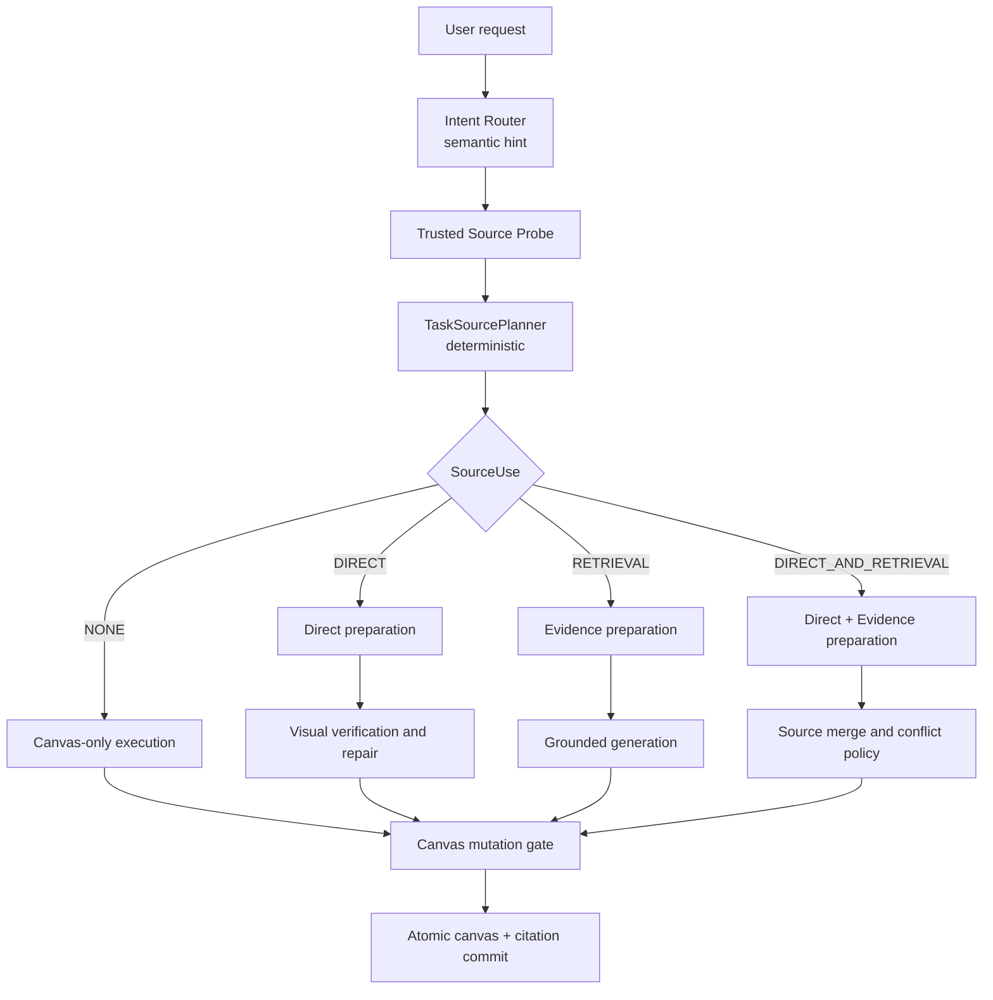

# Chartbook 文件作用域、持久化与绘图来源链路重构方案

> 状态：Accepted，P0 已冻结，P1–P4 已实施，等待 P5–P6
>
> 日期：2026-07-24
>
> 适用分支：`codex/multimodal-library-chartbook`
>
> 术语约定：产品和代码统一使用 **Chartbook**，不在 UI 中改称 Project
>
> 本文用途：作为 Conversation Files、Chartbook Shared Files、Retrieval、Direct 和前端 Files 面板的统一实施依据
>
> 重要说明：本文替代旧方案中“会话附件按消息勾选”和“所有临时资料长期写入 Pinecone”的部分，不替代既有授权、版本固定、引用、取消和原子提交安全约束。
>
> 决策记录：[ADR 0012：持久索引 Chartbook 证据并保持 Conversation 证据临时](../adr/0012-persist-chartbook-evidence-and-keep-conversation-evidence-temporary.md)

## 1. 介绍

本项目通过自然语言和资料帮助用户创建、编辑和验证 Draw.io 图表。随着文件上传、RAG、图片直转、Chartbook 和引用能力逐步加入，当前实现已经具备大量底层能力，但文件的产品语义仍沿用了早期技术实现：

- 上传附件需要在每条消息中勾选；
- 临时附件、资料库文件、Chartbook 文件和图片直转来源在多个模块中分别解释；
- “文件是否保存”“是否完成解析”“是否进入向量库”“是否能够 Direct 读取”被压缩成接近同一个状态；
- 自动资料范围仍包含个人资料库，却排除了本 Conversation 中之前上传的附件；
- Direct 主要只识别本轮请求中恰好一张就绪图片；
- 图片已经可以读取时，仍可能因为索引处理状态而阻塞；
- provider 或系统生成失败可能被显示成用户附件无效。

这些问题不是单个 UI bug，而是文件作用域和来源链路没有形成统一语义造成的。此次重构的目标，是让产品行为与用户对 ChatGPT/Codex 类文件交互的直觉一致：

1. 文件上传后自然属于当前 Conversation，不需要逐条消息重复选择；
2. 用户主动加入 Chartbook 后，文件才成为 Chartbook 内长期共享资料；
3. Chartbook Shared Files 可以被持久检索，方便串联同一 Chartbook 内的多张图；
4. Direct 读取原始图片，不依赖向量库；
5. Retrieval 只在请求确实需要资料事实时运行；
6. 系统自动决定来源链路，普通用户不需要理解 Direct、Retrieval 或 RAG。

## 2. 前因后果

### 2.1 早期设计为什么会变复杂

早期设计同时服务以下目标：

- 临时附件也能进行长文档检索；
- 用户可以严格控制每一条消息使用哪些附件；
- 个人资料库、Diagram 和 Chartbook 都能成为资料来源；
- 所有检索统一走 MySQL + Pinecone；
- 图片转图与 RAG 共用尽可能多的资料处理能力。

因此系统逐渐形成了：

```text
上传
→ 处理
→ 生成 Retrieval Chunk
→ 建立向量投影
→ 用户本轮勾选
→ 请求解析选择项
→ Router 决定来源用途
```

这个模型在权限和可追踪性上比较严格，但在画图产品中带来了不必要的用户操作和耦合：

- 用户上传后还要决定本轮是否勾选；
- 同一 Conversation 的下一轮不能自然继续使用附件；
- 图片 Direct 也容易被“是否完成检索索引”影响；
- Chartbook 已经承担项目资料空间的角色，个人资料库再自动加入会扩大来源范围；
- 文件加入 Chartbook 需要分别理解生命周期和 Chartbook scope，调用方承担了过多规则。

### 2.2 用户已经确定的新产品规则

本方案锁定以下决定：

1. **Conversation Files**
   - 只属于当前 Conversation；
   - 在当前 Conversation 的所有后续请求中自动可用；
   - 不显示 checkbox，也不存在“本轮选择集”；
   - 默认临时保存，按 TTL 清理；
   - 可以通过 `Add to Chartbook` 转成 Chartbook Shared File。

2. **Chartbook Shared Files**
   - 属于当前 Chartbook；
   - 在该 Chartbook 内的 Diagram 和 Conversation 中自动可用；
   - 长期保存原文件、解析结果和检索索引；
   - 不需要每条消息重复选择；
   - 可以预览、下载、移出 Chartbook 和重试索引。

3. **没有 Chartbook 的 Diagram**
   - Files 面板只显示 Conversation Files；
   - 不显示空的 Chartbook Shared Files 区域。

4. **上传入口**
   - 左侧保留现有 `+` 和 Diagram History；
   - 增加独立 Files 按钮；
   - Files 面板中的 Upload 始终先上传到 Conversation；
   - 不直接上传到 Chartbook，以免一次上传同时承担临时和长期语义。

5. **自动来源**
   - 普通用户不再手动选择 `DIRECT`、`RETRIEVAL` 或 `DIRECT_AND_RETRIEVAL`；
   - Router 表达语义意图；
   - 确定性 Planner 根据授权文件、状态和歧义情况收敛执行计划。

### 2.3 新决定带来的链路变化

旧链路以“本轮选择的附件 ID”为核心；新链路以“当前请求可访问的文件作用域快照”为核心。

```text
旧：本轮 checkbox → selected IDs → source resolution

新：Conversation + Diagram + Chartbook scopes
    → immutable source snapshot
    → deterministic planning
```

因此这次不能只改前端 checkbox，还必须同步修改生命周期、自动来源查询、Direct 主图选择、请求快照、索引资格和状态展示。

## 3. 目标与非目标

### 3.1 本次目标

1. 建立一致的 Conversation/Chartbook 文件生命周期。
2. 上传始终先进入 Conversation 临时作用域。
3. `Add to Chartbook` 一次操作完成保留、Chartbook scope 和持久索引调度。
4. AUTO 来源默认包含当前 Conversation、当前 Diagram 和当前 Chartbook。
5. AUTO 不再包含整个 Personal Library。
6. Direct 可以从当前 Conversation 或当前 Chartbook 中确定一张主图片。
7. Direct 不依赖 Pinecone，也不等待向量索引完成。
8. Retrieval 仅在语义上需要资料时运行。
9. 文件可读状态和索引状态分别展示。
10. 保留请求级 exact version/revision 快照、授权、引用和原子提交。
11. 前端使用独立 Files 面板管理文件，不在 composer 中放置复杂资料选择器。

### 3.2 本次非目标

- 不实现多人共享或 Chartbook 成员 ACL。
- 不实现跨 Chartbook 自动检索。
- 不把整个 Personal Library 自动加入当前请求。
- 不实现多图片自动拼图。
- 不实现 PDF 任意页自动识别为 Direct 主图；首版仍要求指定页后再进入 Direct。
- 不重写现有摄取、OCR、Evidence、Chunk 或向量投影体系。
- 不为每个类补一套重复单元测试。
- 不重新运行与本次产品链路无关的完整研究评测。
- 不要求本地开发连接真实 AWS 或 Pinecone 才能验证核心行为。

## 4. 统一术语与核心不变量

### 4.1 术语

| 术语 | 含义 |
| --- | --- |
| Material | 用户拥有的文件逻辑实体 |
| Material Version | 一次不可变的原文件版本 |
| Processing Revision | 由某一处理配置产生的解析版本 |
| Conversation File | 带当前 Conversation scope 的临时文件 |
| Chartbook Shared File | 带当前 Chartbook scope 的长期文件 |
| Original Artifact | PDF/PNG/JPEG 原始字节，位于 local 或对象存储 |
| Retrieval Chunk | 可用于词法或向量检索的派生片段 |
| Vector Projection | Retrieval Chunk 在某个 embedding/index generation 中的向量投影 |
| Source Snapshot | 某次 run 固定下来的 exact version/revision 和授权来源集合 |
| Direct Candidate | 当前请求有权读取、可用于视觉还原的图片版本 |
| Primary Direct Image | Planner 为当前请求确定的唯一主图片 |

### 4.2 不变量

1. 上传到 Draw.io 的文件首先是 Conversation File。
2. `TEMPORARY` 文件必须有 `CONVERSATION` scope。
3. `CHARTBOOK` scope 只能属于 `RETAINED` 文件。
4. 加入 Chartbook 不复制 Material、Version、Revision 或原文件。
5. 文件持久化不等于向量化；向量化也不等于文件可被 Direct 读取。
6. Direct 使用 exact original/visual artifact，不以向量搜索结果作为主图片。
7. Retrieval 只能从当前 source snapshot 中召回证据。
8. Pinecone 返回结果不能单独授予访问权；MySQL scope 和 owner 始终是事实源。
9. 一个 run 的 source snapshot 一旦保存，重试不得漂移到新版本。
10. 用户移除文件或 TTL 到期后，新 run 不得继续获得该文件；已开始且持有有效 read lease 的 run 按既有规则完成或取消。
11. 纯布局、样式或画布局部整理不读取任何文件。
12. Personal Library 只在明确操作中使用，不加入普通 AUTO。

## 5. 目标产品体验

### 5.1 左侧 Files 面板

保留现有左侧 rail：

```text
+
History
Files   ← 新增
```

History 与 Files 分别打开独立面板，同一时间只展开一个。

有 Chartbook 时：

```text
Files
  Upload

  CHARTBOOK SHARED FILES
    requirements.pdf      Searchable
    architecture.png      Searchable

  CONVERSATION FILES
    screenshot.png        Ready
    meeting-notes.pdf     Processing
```

没有 Chartbook 时：

```text
Files
  Upload

  CONVERSATION FILES
```

### 5.2 文件操作

所有文件：

- Preview
- Download
- 查看处理/索引状态

Conversation Files：

- Add to Chartbook
- Remove from Conversation
- Retry Processing

Chartbook Shared Files：

- Remove from Chartbook
- Retry Indexing

不提供：

- checkbox；
- “本轮使用”开关；
- composer 内重复文件列表；
- 普通用户可见的 Direct/Retrieval 选择器。

Composer 只可短暂显示刚上传文件的状态 chip，Files 面板是文件管理事实入口。

## 6. 文件生命周期与索引语义

### 6.1 上传

所有 Draw.io 上传统一创建：

```text
retentionClass = TEMPORARY
scopeType      = CONVERSATION
scopeKey       = currentConversationId
```

上传完成后，worker 继续进行现有：

```text
安全扫描
→ 原件物化
→ PDF/图片解析
→ OCR/页面/视觉产物
→ Evidence/Chunk
```

Conversation File 不创建长期 Pinecone 投影。为了避免重写现有解析链，允许保留 MySQL 中 TTL 受控的 Evidence、Chunk 和词法派生物；到期时与文件一起清理。

对于当前 Conversation 的长文档，首版优先使用：

1. 已存在的 MySQL lexical/exact 检索；
2. 小文档直接读取相关解析片段；
3. 暂不为了临时文件强制写入长期 Pinecone。

如果以后证明临时语义检索确有必要，可以增加 TTL-bound transient vector adapter，但不应恢复成默认长期 Pinecone 写入。

### 6.2 Add to Chartbook

用户点击 `Add to Chartbook` 时，由一个深模块完成：

```text
校验 owner 与 Chartbook
→ 校验 Material 属于当前 Conversation 或 owner
→ TEMPORARY 时转成 RETAINED
→ 增加 CHARTBOOK scope
→ 保留原 Conversation scope 供历史引用
→ 根据现有 Revision 判断是否需要持久索引
→ 幂等返回最终文件视图
```

同一文件在 UI 中只显示一次。显示优先级：

```text
CHARTBOOK > DIAGRAM > CONVERSATION > LIBRARY
```

因此文件保留历史 Conversation scope 时，Files 面板仍只在 Chartbook Shared Files 中展示。

### 6.3 持久索引

Chartbook Shared File 的长期索引规则：

- 已有可兼容且完整的向量投影：复用，不重新 embedding；
- 已有 Chunk 但没有当前 generation 投影：只生成缺失的向量投影；
- 解析仍在进行：先显示 `Processing`，完成后自动调度索引；
- 向量失败但 lexical 可用：显示 `Search limited`，允许词法检索与重试索引；
- 原文件已可读但索引未完成：Direct 仍可使用。

Personal Library 和 Diagram durable scope 的既有数据继续兼容，但：

- Draw.io 新上传不直接进入这些 scope；
- Personal Library 不参与 AUTO；
- 旧 durable 文件不强制重新处理；
- 后续是否保留独立 Library 产品入口另行决定。

### 6.4 移出与删除

`Remove from Chartbook` 只移除 Chartbook scope，不直接删除 Material。

处理规则：

1. 还有其他 durable scope：保留文件和索引；
2. 只剩 Conversation scope，且原 Conversation 仍有效：可以恢复成临时语义，并按 TTL 清理长期投影；
3. 没有任何有效 scope：进入现有删除/回收流程；
4. 既有引用继续保留版本和 tombstone 语义，不破坏历史引用。

## 7. 文件状态模型

不要继续用一个状态同时表达上传、处理和索引。对 UI 输出三个可独立判断的维度：

### 7.1 Storage Status

```text
UPLOADING
SCANNING
STORED
REJECTED
```

### 7.2 Processing Status

```text
PENDING
PROCESSING
READY
PARTIAL_READY
FAILED
```

### 7.3 Search Status

```text
NOT_APPLICABLE   // Conversation File 或不需要长期索引
NOT_INDEXED
INDEXING
SEARCHABLE
LEXICAL_ONLY
INDEX_FAILED
```

首版优先从现有 upload、revision 和 vector projection 表推导这些状态，不新增一套重复状态机。只有现有投影无法可靠表达时，才增加最小 projection status 字段。

关键行为：

| 状态组合 | Direct | Retrieval |
| --- | --- | --- |
| Stored + Processing + Not applicable | 图片原件可读时可开始视觉观察 | 等待可检索解析结果 |
| Stored + Ready + Not applicable | 可用 | Conversation lexical/exact 可用 |
| Stored + Ready + Indexing | 可用 | lexical 可用，dense 暂不可用 |
| Stored + Ready + Searchable | 可用 | lexical + dense 可用 |
| Rejected | 不可用 | 不可用 |
| Processing failed but original image readable | 可尝试 Direct，并明确不提供文档检索 | 不可用 |

## 8. 目标请求链路

### 8.1 总体链路



### 8.2 Intent Router

Router 可以继续使用 LLM 识别：

- 创建、编辑、布局、问答或复查；
- 用户是否要求按图还原；
- 是否要求参考资料、补充事实或引用；
- 是否点名某个文件。

Router 不能决定：

- 用户是否真的有权访问文件；
- 某文件当前是否 ready；
- 多张图片中任意选择一张；
- 扩大到其他 Chartbook 或整个 Library；
- 跳过 source snapshot、read lease 或引用约束。

### 8.3 Trusted Source Probe

Probe 从服务器事实构造：

```text
currentConversationFiles
currentDiagramSources
currentChartbookSharedFiles
newlyUploadedFiles
namedFileMatches
readyDirectImageCandidates
retrievalReadySources
pendingSources
```

不再以“本轮 checkbox 选择集”作为主要事实。

### 8.4 TaskSourcePlanner

Planner 根据 Router hint 和 Probe 生成确定性计划。

| 请求 | 计划 |
| --- | --- |
| “把刚上传的图片按原图画出来” | DIRECT |
| “把 incident.png 画出来” | DIRECT，使用点名文件 |
| “根据需求文档画架构图” | RETRIEVAL |
| “按图片还原，并根据需求补充错误分支” | DIRECT_AND_RETRIEVAL |
| “把当前图布局整理一下” | NONE |
| “根据这个 PDF 回答问题” | RETRIEVAL |
| “把 PDF 第 3 页的图还原” | 指定页渲染完成后 DIRECT |

Primary Direct Image 的确定顺序：

1. 本轮只有一张新上传且可读的图片；
2. 用户点名一个唯一文件；
3. 当前 Conversation 只有一个 ready image candidate；
4. 仍有多张且无唯一答案时，返回简短澄清；
5. 不允许随机选择，也不允许静默降级成 Retrieval。

### 8.5 RequestSourceResolution

AUTO 的授权候选范围：

```text
1. 本轮刚上传的文件
2. 当前 Conversation Files
3. 当前 Diagram 固定资料
4. 当前 Chartbook Shared Files
```

Personal Library 不加入 AUTO。

解析后对同一 version 去重，并固定 exact revision。优先级只决定来源展示和冲突处理，不代表把所有内容完整放入 prompt。

### 8.6 Direct

Direct：

- 读取 Primary Direct Image 的 exact original/visual artifact；
- 获取 read lease；
- 进行受限视觉观察；
- 输出结构化 ObservedDiagramGraph；
- 投影为 Draw.io XML；
- 验证拓扑、标签、方向、分组和安全 XML；
- 对可恢复问题执行有限自动修复；
- 完成画布和引用原子提交。

Direct 不调用：

- Pinecone ANN；
- 自动 Library 检索；
- 与主图片无关的资料 discovery。

### 8.7 Retrieval

Retrieval：

- 只对 source snapshot 中有检索产物的版本搜索；
- Chartbook Shared Files 使用 lexical + dense；
- Conversation Files 首版使用 lexical/exact 或受限直接片段读取；
- 先授权再召回，回源时再次核对 owner/scope/version/revision；
- 将证据包交给 grounded generation；
- 对事实性节点和边保存引用。

### 8.8 Direct + Retrieval

组合链路中：

- Direct 是原图事实的基础层；
- Retrieval 只补充用户要求的资料事实；
- 原图 cell 默认不可被检索结果静默改写；
- 重复标签和重复关系自动去重；
- 几何重叠由布局修复处理；
- 未绑定引用的 Retrieval 新增内容拒绝提交；
- 真正的语义冲突保留 Direct 内容并询问用户，不把系统冲突显示成附件无效。

## 9. 深模块与接口

本次通过三个核心深模块集中规则，避免 Controller、前端和编排代码分别理解生命周期和来源语义。

### 9.1 `ChartbookFileModule`

接口示意：

```java
public interface ChartbookFileModule {
    ChartbookFileResult add(AddChartbookFileCommand command);
    ChartbookFileResult remove(RemoveChartbookFileCommand command);
}
```

`add` 内部隐藏：

- owner/Chartbook/Material 验证；
- temporary → retained；
- CHARTBOOK scope；
- 幂等操作；
- revision/index eligibility；
- 索引调度；
- 最终文件状态投影。

调用方不再先调用 promote，再调用 addMaterial。

### 9.2 `RequestSourceResolutionService`

继续作为请求来源解析的唯一接口，但修改实现语义：

- 自动包含 Conversation；
- 移除自动 Library；
- 合并 Diagram/Chartbook；
- 固定 exact version/revision；
- 保存不可变 run snapshot；
- 输出 Direct candidates 和 Retrieval sources 所需事实。

不要在 Controller、Router 和 Direct 模块中分别重新查询 scope。

### 9.3 `TaskSourcePlanner`

Planner 继续保持纯领域模块：

- 接收 Router hint 和 trusted probe；
- 决定 NONE/DIRECT/RETRIEVAL/组合；
- 确定唯一 Primary Direct Image；
- 对多图片歧义返回 clarification；
- 不执行 I/O。

将现有：

```text
readyAttachmentVersionIds
hasSingleReadyImageAttachment
```

逐步替换为：

```text
directCandidateVersionIds
newlyUploadedDirectCandidateVersionIds
namedDirectCandidateVersionId
primaryDirectVersionId
```

### 9.4 `GroundedTaskExecutionModule`

现有 grounded execution 保留为统一执行入口，内部按 plan 调用 Direct、Retrieval 或二者。它负责：

- 执行顺序；
- cancellation；
- read lease；
- progress；
- 验证和自动修复；
- 画布与引用提交；
- 所有 terminal path 的资源释放。

## 10. 后端修改点

### 10.1 Material 生命周期

修改：

- `MaterialLifecycleService.promote` 允许 `MaterialScopeType.CHARTBOOK`；
- 保持注册用户、目标归属和幂等校验；
- `MaterialScopePolicy` 继续要求 durable scope 必须是 retained；
- `ChartbookCatalogService.addMaterial` 通过 `ChartbookFileModule` 完成临时文件提升与 scope 添加；
- 已 retained 的文件只增加 scope，不重复 promote；
- 不复制 Material 或 Revision。

### 10.2 自动来源 SQL

修改 `online_retrieval_mapper.xml`：

```text
INCLUDE:
  CONVERSATION = currentConversationId
  DIAGRAM      = currentDiagramId
  CHARTBOOK    = currentDiagram.chartbookId

EXCLUDE FROM AUTO:
  LIBRARY
```

去重优先级：

```text
new attachment
→ conversation
→ diagram pin/scope
→ chartbook
```

必须继续使用 owner、active lifecycle、retention/expiry 条件。

### 10.3 Request Source Resolution

修改 `DefaultRequestSourceResolutionService.addAutomatic`：

- 删除排除 `CONVERSATION` 的旧 filter；
- 删除“会话附件按消息 opt-in”的旧注释和语义；
- 保留 ready、processing、unavailable 计数；
- 保留 source snapshot fingerprint 和 replay。

### 10.4 索引资格

修改向量 projection eligibility：

- 新的 Conversation temporary revision 不创建长期 Pinecone projection；
- 有 Chartbook durable scope 的 retained revision 可以创建长期 projection；
- 既有 Library/Diagram retained 数据保持兼容；
- promote 时优先复用当前 generation 中已有 projection；
- TTL/移除后的 projection 由现有 deletion maintenance 清理。

### 10.5 Direct 来源

修改 Probe、Intent contract、Planning command 和 Planner：

- 不再只看本轮 upload IDs；
- 支持 current Conversation 和 current Chartbook 中点名图片；
- exact version 必须属于 source snapshot；
- 对多个候选做确定性歧义处理；
- Direct availability 只依赖原始视觉产物可读，不依赖 dense index。

### 10.6 Direct 验证与错误分类

保留并完善：

```text
observe
→ graph validation
→ projection
→ direct visual verification
→ bounded repair
→ commit
```

错误分类：

| 类别 | 行为 |
| --- | --- |
| 文件损坏、格式不支持、无权限 | 用户可理解的输入错误 |
| provider schema/JSON 错误 | 内部自动重试，最终显示服务暂不可用 |
| 坐标轻微越界、几何重叠 | 自动修复 |
| XML/拓扑可恢复问题 | 重新投影或有限重画 |
| 多图片无法确定主图 | 询问用户 |
| 关键文字或方向确实看不清 | 询问用户 |
| malware/主动内容 | 明确拒绝 |

`IllegalArgumentException` 不再统一映射为 `INVALID_DIRECT_VISUAL_INPUT`。

### 10.7 资源释放

所有成功、拒绝、澄清、取消、断流和异常路径必须释放：

- active routed run；
- Draw.io tool session；
- material read lease；
- stream resource；
- cancellation registration。

避免再次出现 `Canvas session already has an active routed run`。

## 11. HTTP 契约

优先复用现有接口，只增加缺失的深行为入口。

### 11.1 文件列表

```http
GET /api/v1/materials/scopes/CONVERSATION/{conversationId}
GET /api/v1/materials/scopes/CHARTBOOK/{chartbookId}
```

复用现有 `listScope`，返回 File Card 所需状态。不要让前端先获取 Chartbook material IDs，再逐个请求详情。

### 11.2 当前 Diagram 的 Chartbook

```http
GET /api/v1/diagrams/{diagramId}/chartbook
```

返回：

```json
{
  "chartbookId": "chartbook-1",
  "name": "Incident Response"
}
```

没有 Chartbook 时返回空结果，而不是 500。

### 11.3 Add to Chartbook

推荐统一为：

```http
POST /api/v1/chartbooks/{chartbookId}/files/{materialId}
Idempotency-Key: ...
```

该接口内部调用 `ChartbookFileModule.add`。旧：

```text
POST /materials/{id}/promote
POST /chartbooks/{id}/materials
```

暂时保留兼容，但新 UI 不进行两步调用。

### 11.4 Remove from Chartbook

```http
DELETE /api/v1/chartbooks/{chartbookId}/files/{materialId}
Idempotency-Key: ...
```

返回文件最终 scope、retention 和 search status，方便 UI 移动分组。

### 11.5 下载

新增：

```http
GET /api/v1/materials/{materialId}/versions/{versionId}/download
```

要求：

- owner/scope 鉴权；
- exact version；
- 安全 `Content-Disposition`；
- 不暴露 local path、S3 key 或 presigned object identity；
- local 与 S3 adapter 对前端保持同一行为。

### 11.6 Chat 请求兼容

前端停止发送 checkbox 形成的 `selectedVersionIds` 和旧附件选择集。后端为兼容旧客户端可暂时接受这些字段一个版本，但：

- 不再把它们作为 AUTO 的唯一来源；
- 不允许借此扩大授权范围；
- 新 UI 不显示 Source Mode 和 Source Use 控件；
- 后续在独立清理阶段删除废弃字段。

## 12. 前端修改点

### 12.1 移除旧交互

- 移除 `ConversationAttachmentTray` 中的 checkbox；
- 移除 `selectedUploadIds` 和 toggle selection 状态；
- 移除 `SourceUseControl` 的普通用户入口；
- 移除 composer 上方独立的资料范围大面板；
- 保持 composer 和聊天记录处于同一视觉区域，但聊天滚动区域不能延伸到 composer 下方。

### 12.2 新增 Files rail 与面板

Files 面板负责：

- 查询当前 Diagram 的 Chartbook；
- 查询 Conversation scope；
- 查询 Chartbook scope；
- scope precedence 去重；
- Upload；
- Preview/Download；
- Add to Chartbook；
- Remove/Retry。

### 12.3 状态文案

面向用户只显示：

```text
Uploading
Checking
Processing
Ready
Indexing
Searchable
Search limited
Failed
Rejected
```

Direct 执行进度显示：

```text
Reading image
Reconstructing
Validating
Repairing
Saving
Done
```

不显示：

- `INVALID_DIRECT_VISUAL_INPUT`
- `VISUAL_PROVIDER_OUTPUT_INVALID`
- Pinecone namespace
- revision ID
- local/S3 object key
- 内部 Router 枚举。

## 13. 数据与兼容迁移

### 13.1 ADR 处理

`docs/adr/0001-index-temporary-and-long-term-evidence-in-pinecone.md` 与新决定冲突。实施第一阶段新增 superseding ADR：

```text
Persist Chartbook evidence in the long-term vector index;
keep Conversation evidence temporary and out of long-term Pinecone.
```

旧 ADR 保留历史记录，但状态改为 superseded，并链接新 ADR。

### 13.2 既有临时向量

迁移步骤：

1. 先修改 projection eligibility，阻止新的 Conversation temporary projection；
2. 查询既有 temporary + Conversation projection；
3. 标记为 cleanup candidate；
4. 复用 deletion worker/read lease 安全删除；
5. 不删除仍属于 durable Chartbook/Diagram/Library scope 的 projection；
6. 不阻塞应用启动，不执行大事务一次性删除。

### 13.3 既有 Chartbook 文件

后台校验：

- CHARTBOOK scope 对应 Material 是否 retained；
- Chartbook membership 与 material scope link 是否一致；
- 缺少当前 generation projection 时排队补建；
- 已完整 projection 不重新 embedding。

### 13.4 请求快照

既有 run snapshot 保持不可变。新规则只影响新 run：

- 老 run 按保存的 version/revision 重放；
- 新 run 使用 Conversation + Diagram + Chartbook AUTO 范围；
- 不批量改写历史快照。

### 13.5 数据库改动原则

首版尽量不新增核心表：

- scope 使用现有 `material_scope_link`；
- retention 使用现有 Material 字段；
- processing 使用现有 revision；
- search status 从现有 projection 表推导；
- idempotency 使用现有 lifecycle/operation 机制。

只有确认无法可靠表达统一 Add to Chartbook 操作时，才新增最小的 operation record，而不是新增第二套文件模型。

## 14. 实施阶段

### P0：冻结产品语义与 ADR

交付：

- 本文评审通过；
- 新 ADR 替代临时资料长期 Pinecone 决策；
- 确认 AUTO 范围和 scope precedence；
- 确认兼容窗口。

不改运行代码。

### P1：生命周期与 Add to Chartbook

修改：

- `MaterialLifecycleService`
- `ChartbookCatalogService`
- 新 `ChartbookFileModule`
- HTTP endpoint
- 现有 Material client

完成标准：

- Conversation temporary file 可以一次操作加入 Chartbook；
- 不复制原文件/版本/revision；
- 重复请求幂等；
- 已 retained 文件可直接增加 Chartbook scope。

### P2：自动来源与持久索引资格

修改：

- `online_retrieval_mapper.xml`
- `DefaultRequestSourceResolutionService`
- projection eligibility/cleanup
- source status projection

完成标准：

- 当前 Conversation 自动可用；
- 当前 Chartbook 自动可用；
- Personal Library 不自动加入；
- temporary Conversation 不再创建长期 Pinecone projection；
- promote 后缺失索引自动补建。

### P3：Router/Planner 与 Direct 主图

修改：

- Intent probe/contract
- `TaskSourcePlanningCommand`
- `DefaultTaskSourcePlanner`
- Direct source preparation

完成标准：

- 图片可来自本轮、当前 Conversation 或点名的 Chartbook file；
- 多图歧义会询问，不随机选择；
- Direct 不依赖 dense index；
- 纯布局保持 NONE。

### P4：Direct 验证、修复和错误分类

修改：

- Direct visual verification
- bounded retry/redraw
- projection/geometry repair
- typed errors
- terminal cleanup

完成标准：

- provider/投影问题不再归因用户；
- 可恢复问题自动修复后重画；
- 真实坏输入仍正确拒绝；
- terminal path 不残留 active routed run。

### P5：Files 面板与简化 Composer

修改：

- 左侧 Files rail button/panel
- Conversation/Chartbook file list
- Upload/Preview/Download/Promote/Remove/Retry
- 删除 checkbox 和 SourceUseControl
- 状态文案

完成标准：

- 有 Chartbook 时显示两个分组；
- 无 Chartbook 时只显示 Conversation Files；
- 上传后无需选择即可在当前 Conversation 使用；
- composer 保持简洁；
- History 不受影响。

### P6：兼容清理

在新前后端稳定后：

- 删除废弃的 per-message selected attachment 状态；
- 删除旧 SourceUse UI；
- 清理兼容 DTO 字段；
- 清理 temporary Pinecone projections；
- 更新旧实现计划中的 R3/R3.1 描述。

## 15. 精简测试方案

原则：只测试跨 seam 的产品行为、关键 SQL 范围和真实用户闭环；不为内部每个类重复测试同一规则。

### 15.1 必须增加或修改的测试

1. **ChartbookFileModule 接口测试**
   - temporary Conversation file 加入 Chartbook 后变成 retained；
   - 添加 CHARTBOOK scope；
   - 相同 idempotency key 重试不重复 scope 或索引任务。

2. **RequestSourceResolutionService 参数化测试**
   - AUTO 包含 Conversation、Diagram、Chartbook；
   - AUTO 不包含 Library；
   - 同一 version 去重；
   - snapshot replay 不漂移。

3. **自动来源 SQL 集成测试**
   - 使用最小 MySQL fixture 验证 scope/owner/expiry 条件；
   - 只测一组代表性数据，不复制所有领域测试。

4. **TaskSourcePlanner 参数化测试**
   - 单个新图片 → Direct；
   - 点名 Chartbook 图片 → Direct；
   - 多图歧义 → clarification；
   - 资料请求 → Retrieval；
   - 图片加资料 → Direct + Retrieval；
   - 纯布局 → None。

5. **Direct 错误分类测试**
   - provider 输出错误进入 retry/unavailable；
   - 用户坏文件才进入 rejected；
   - 可恢复投影问题不会立即返回用户无效。

6. **Files 面板前端测试**
   - 无 checkbox；
   - 无 SourceUseControl；
   - 无 Chartbook 时不显示共享分组；
   - Add to Chartbook 后文件移动到共享分组且不重复。

7. **下载授权 HTTP 测试**
   - owner 可下载 exact version；
   - 非 owner/非 scope 不可下载；
   - 响应不暴露存储路径。

8. **两个端到端冒烟测试**
   - 上传图片 → 当前 Conversation 自动 Direct → 画布成功保存并可重新打开；
   - 上传 PDF → Add to Chartbook → 新 Conversation 自动 Retrieval → 返回引用。

### 15.2 不做的测试

- 不为每个 Controller 和 adapter 重复相同 scope 规则；
- 不对 Tailwind class 和每个像素做 snapshot；
- 不为每个状态组合编写独立 E2E；
- 不要求本地测试连接真实 S3/Pinecone；
- 不重新运行完整 450-case RAG 研究集；
- 不为 UI 文案的每个字符编写测试；
- 不因内部方法拆分增加白盒测试；
- 不重复现有 owner fence、read lease、XML 安全和引用 Guard 测试，除非本次修改触及对应行为。

### 15.3 回归执行范围

每阶段只运行：

```text
受影响 module 的领域测试
+ 受影响 adapter 的一个集成测试
+ 前端相关测试
```

P5 完成后再运行一次：

```text
后端相关模块测试
+ 前端 test/build
+ 2 个关键 E2E smoke
```

不把完整研究评测作为本次功能开发的日常阻塞条件。

## 16. 验收标准

### 文件与 UI

- [ ] 上传文件立即出现在 Conversation Files；
- [ ] 不需要 checkbox；
- [ ] 当前 Conversation 后续请求自动可以使用文件；
- [ ] Add to Chartbook 后文件只显示在 Shared 分组；
- [ ] 新 Chartbook Conversation 自动可以检索 Shared Files；
- [ ] 无 Chartbook 时不显示共享分组；
- [ ] 可以预览和安全下载 exact version。

### 生命周期与索引

- [ ] Conversation File 是 temporary，有 TTL；
- [ ] Chartbook Shared File 是 retained；
- [ ] promote 不复制原文件或 revision；
- [ ] Conversation File 不进入长期 Pinecone；
- [ ] Chartbook File 可以达到 Searchable；
- [ ] Direct 不等待 Searchable；
- [ ] 移出 Chartbook 不破坏历史引用。

### 请求链路

- [ ] Router hint 不能扩大文件授权；
- [ ] AUTO 包含 Conversation/Diagram/Chartbook；
- [ ] AUTO 不包含 Personal Library；
- [ ] 单图请求自动 Direct；
- [ ] 资料请求自动 Retrieval；
- [ ] 图片加资料自动 Direct + Retrieval；
- [ ] 多图歧义不随机选择；
- [ ] 纯布局不读取资料；
- [ ] 每个 run 固定 exact source snapshot。

### 稳定性

- [ ] provider 错误不显示成用户附件无效；
- [ ] 可恢复视觉/投影问题自动重试；
- [ ] 所有 terminal path 释放 run、lease 和 stream；
- [ ] 画布和引用仍原子提交；
- [ ] local storage 模式无需 AWS 即可完成核心 smoke。

## 17. 风险与控制

| 风险 | 控制 |
| --- | --- |
| Conversation 文档不写 Pinecone 后，长文档召回下降 | 首版保留 lexical/exact；通过真实使用数据决定是否增加 TTL transient vector |
| scope precedence 导致 UI 重复 | 服务端返回 scopes，前端按 Material/version 去重并以 Chartbook 优先 |
| promote 与索引任务重复 | 使用 idempotency key 和现有 projection uniqueness |
| 旧客户端仍发送 selected IDs | 一个版本兼容读取，但新 AUTO 不依赖它们 |
| 移出 Chartbook 后文件无 durable scope | 在模块内根据剩余 scope 决定临时恢复或删除流程 |
| Router 误判 Direct | Planner 通过 trusted probe 收敛；多图歧义必须询问 |
| 向量服务失败阻塞 Direct | Direct 不依赖 Pinecone；Retrieval 降级 lexical |
| 一次改动范围过大 | 按 P1–P6 分阶段，每阶段保持可运行和可回滚 |

## 18. 回滚策略

- P1 可通过禁用新 Add to Chartbook endpoint 回到旧两步接口；
- P2 可回滚自动来源 SQL，但不得恢复未授权范围；
- temporary vector eligibility 改动独立开关，回滚时不自动重建已清理向量；
- P3/P4 可关闭 Direct conversion，普通文本和 Retrieval 保持可用；
- P5 可隐藏 Files rail，保留现有后端数据；
- 数据清理始终最后进行，且使用现有 read lease/deletion worker，不做不可恢复的一次性删除。

## 19. 推荐的实际开发顺序

最短可交付路径：

```text
P1 生命周期
→ P2 AUTO 来源
→ P3 Direct 主图
→ P5 Files 面板
→ P4 Direct 自动修复
→ P6 清理
```

P4 放在基本产品闭环之后，是因为当前首先要解决的是“文件能否自然进入正确链路”。但已有的安全修复、provider 错误分类和 active run 清理不能回退。

每阶段提交应保持单一目的，避免把现有工作区中的品牌、评测或无关管理页面改动混入本功能提交。

## 20. 最终结论

本次重构不是移除 RAG，而是让 RAG 回到适合它的位置：

- Conversation 提供当前对话上下文；
- Chartbook 提供长期项目知识与跨图共享；
- Retrieval 从这些授权范围中寻找相关事实；
- Direct 从 exact 原始视觉资料还原图；
- Planner 自动组合它们；
- 用户只需要上传文件、组织 Chartbook 和描述想画什么。

最终应形成以下简单产品心智：

```text
上传 = 当前对话可用
加入 Chartbook = 长期共享并可检索
要求按图画 = Direct
要求参考资料 = Retrieval
两者都需要 = 自动组合
```

复杂的生命周期、索引、授权、版本、重试和引用规则全部隐藏在深模块内部，不再暴露给普通用户或散落到多个调用方。
