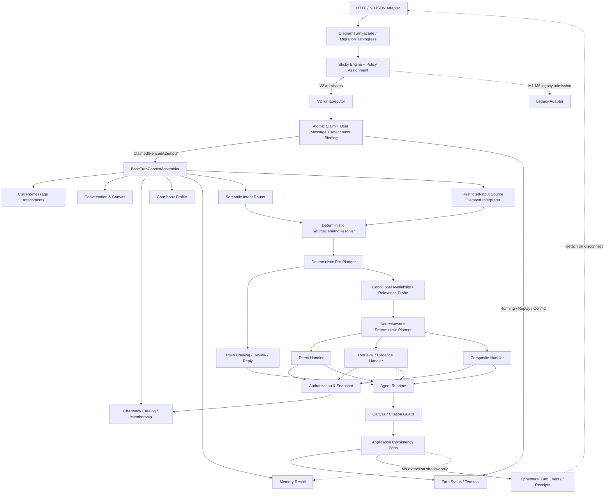
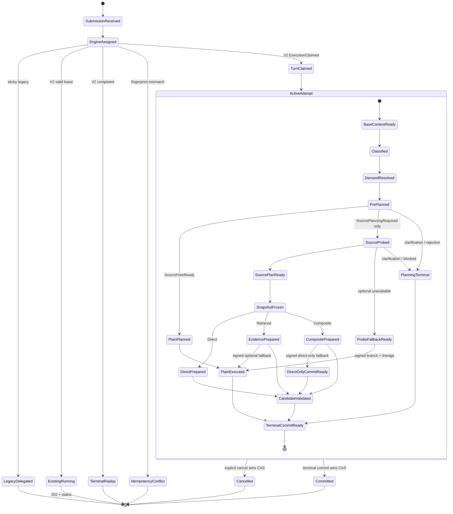

# FreeDraw Context、Memory 与资料链路低耦合架构方案

> 状态：Proposed
>
> 日期：2026-07-25
>
> 目标：让普通画图、Project-like Chartbook Context、资料检索、Evidence 与 Memory 具有清晰边界；让资料基础设施故障不再扩大到普通画图；让同步和流式共用同一套业务语义。
>
> 关联路线图：[2026-07-25 Context / Memory / Source Wayfinder](./2026-07-25-context-memory-source-wayfinder.md)
>
> 规范优先级：本文覆盖旧文档中的 turn sequencing、source demand、requiredness、fallback 与 snapshot 时点。
>
> 旧文档不再定义 turn/source sequencing：
> [Source Chain Redesign](./2026-07-24-chartbook-files-source-chain-redesign-plan.md)、
> [ADR 0012](../adr/0012-persist-chartbook-evidence-and-keep-conversation-evidence-temporary.md)、
> [ADR 0007](../adr/0007-separate-intent-routing-from-diagram-target-resolution.md)。
>
> 在 M0 的 superseding ADR 合并前，它们只继续约束 owner、scope、lifecycle、retention、citation persistence 与 target resolution。

## 0. 目标态方案结论

除明确标注“当前实现”的段落外，本文接口和代码块均为 **Target contract**，不是对现状的描述；生产能力只在对应迁移阶段验收后成立。

采用一套“**一个深 Facade + 模块化单体 + 类型化执行计划 + 按需资料能力**”的架构：

1. 目标态 HTTP 调用方只面对 `DiagramTurnFacade.execute(...)`；迁移与 legacy drain 期间仅保留一个显式 `MigrationTurnIngress` 做 sticky legacy/V2 分发。
2. 同步与流式接口消费同一条 `TurnEvent` 流，不再维护两套业务分支。
3. 每个已 atomic claim 的 V2 turn，在两个模型 port 前组装不含资料内容的 `BaseTurnContext`。
4. Semantic Router 与 restricted-input Demand Interpreter 只提出语义结果，不决定授权、exact revision、Evidence 或 fallback。
5. Planner 产出 closed、类型化的 `TurnPlan`。
6. `PlainDrawPlan` 在依赖图上不认识 Material、Snapshot、Retrieval、Evidence 或 Citation。
7. 只有 deterministic Pre-Planner 产出的 `SourcePlanningRequired` 才调用只读 availability probe；只有最终 source-aware plan 才冻结 immutable source snapshot。
8. Context、Profile、Memory、Source Snapshot、Evidence 使用不同类型和不同 authority。
9. Memory v1 只做同一 Chartbook 内、用户明确保存并确认过的 `CONTEXT_ONLY` 工作决策。
10. ADK session 只作为运行时缓存；每轮必须能从持久数据完整重建模型上下文。
11. Chartbook Profile 先于 Memory 建设，Memory 不得变成第二套 Project 设置。
12. 当前同库的 grounded canvas + citation 原子提交先保留；不为“形式上的完全解耦”过早改成 saga。
13. 迁移期每个 unseen turn 先持久化 sticky engine/policy assignment；source demand 在 claim 后判定，并由 decision checkpoint 固定。重试不能被动态 flag 改道。
14. 每个 V2 turn 必须在 Router/LLM 前原子 claim；只有当前 fenced attempt 可以执行或提交。
15. 网络断流只 detach transport subscriber；只有显式取消或服务端 deadline 才取消产品 turn。
16. v1 不恢复历史进度事件；重复 RUNNING 请求返回 202 + owner-fenced status endpoint。

最重要的实施顺序：

```text
Legacy source resolve/freeze 后移止血
→ Application module + sticky engine assignment
→ Turn claim/fence + terminal-only/response commit
→ detach/status/explicit-cancel contract
→ 双模型路由 + 普通画图 source 零调用
→ Server-owned Context + durable conversationId
→ Typed Plan + plan 后 snapshot
→ OPTIONAL/REQUIRED 与 Direct/Composite 收口
→ sync/stream event engine 收口
→ Chartbook Profile
→ Memory v1
→ 自动 Memory extraction
```

## 1. 目标、非目标与关键假设

### 1.1 目标

- 普通创建、编辑、样式和布局不依赖资料系统的运行状态。
- 用户无需理解 Direct、Retrieval、RAG、SourceMode 等技术概念。
- 上传或 Chartbook 中存在文件只表示“可访问”，不表示本轮必须使用。
- Context 在服务端统一组装，Router、Drawer、Review 和 Answer 不再各自读取不同历史。
- Chartbook 具备类似 Project 的 instructions、goal、glossary 和 default style。
- Memory 有作用域、来源、确认、冲突、版本、删除和禁用能力。
- 外部事实只能由当前有效 Evidence 支持，不能由 Memory 冒充。
- 同步、流式、重试、取消和服务重启保持一致行为。
- 改造可以按小切片灰度，不要求一次性重写现有 ingestion、RAG、Direct 和 citation。

### 1.2 非目标

- 不在本阶段拆成多个微服务。
- 不恢复逐消息 source checkbox 或 Direct/Retrieval 技术模式选择器。
- 不把 Personal Library 加入普通 AUTO。
- 不实现跨 Chartbook 自动检索。
- 不在 Memory v1 中实现跨 Chartbook 用户画像。
- 不让自动 extraction 结果直接成为 confirmed memory。
- 不让 Router 读取完整画布 XML 或文件正文。
- 不立即替换现有 grounded canvas/citation 原子事务。
- 不用一个通用 `Map<String, Object>` 表示所有 Context。

### 1.3 关键假设

- Java 17 的 sealed interface 和 record 可以使用。
- 当前仍是单体部署，Canvas、Conversation、Citation 等主要写模型共享 MySQL。
- Chartbook 仍是产品名称，不改名为 Project。
- Conversation File、Diagram source 和 Chartbook Shared File 的 scope 规则继续遵守 ADR 0012。
- 前端会经历一个兼容发布周期，旧字段期间只能缩小行为，不能扩大授权。

### 1.4 当前实现中的直接证据

- `AgentConversationService` 的同步和流式入口都在 Router 前调用 `resolveRequestSources`，资料 snapshot 仍是普通请求的前置依赖。
- 同步入口明确拒绝 Direct + Retrieval，而流式入口继续执行，两类接口的能力不一致。
- `resolveRequestSources` 硬编码 `SourceMode.AUTO`，并将 attachment upload ids 传为 `List.of()`，本轮附件身份丢失。
- `DefaultTaskSourcePlanner` 会把不支持的 `EDIT + DIRECT` 静默降为 NONE 或 Retrieval。
- Evidence Answer command 当前传入 `aiKnowledgeAllowed=true`。
- 前端仍把 `conversationMessages` 和 `selectedLibraryVersionIds` 放入每轮请求，并在响应后异步保存普通 Conversation。
- `ChatService` 使用 `InMemoryRunner`，runtime session 重启后不可恢复。
- `DrawioStreamResponseWriter` 通过 emitter-keyed map 保存 Canvas/Evidence/citation commit 状态，传输适配器承担了领域职责。
- `Chartbook` 目前只有名称、Diagram membership 和 shared materials，没有 Project Profile。
- 生产代码没有长期 Memory aggregate、store、冲突或用户控制能力。

因此本方案不是重新设计已经稳定的 RAG 底层，而是修复上层编排、上下文权威性和能力边界。

## 2. 先冻结术语与事实归属

| 概念 | 真正含义 | 权威事实源 | 是否可支持 citation |
| --- | --- | --- | --- |
| Current Request | 用户本轮明确要求 | 当前已认证请求 | 否 |
| Canvas Context | 当前可信画布、版本、hash、selection | 服务端 Canvas store | 否 |
| Conversation Log | 原始聊天记录 | 服务端 Conversation store | 否 |
| Conversation Summary | 可重建的压缩历史 | 由原始消息派生 | 否 |
| Chartbook Profile | 用户显式维护的项目设置 | Versioned Profile store | 否 |
| Memory | 用户确认过的长期工作决策 | Memory store | 否 |
| Source Availability | 本轮可能有权使用哪些资料的无正文摘要 | Source Authorization | 否 |
| Source Snapshot | 本轮固定的 exact version/revision 和授权范围 | Snapshot store | 否 |
| Evidence | 从本轮 snapshot 中读取并验证的支持内容 | Evidence module | 是 |
| Runtime Session | ADK/模型运行缓存标识 | Runtime adapter | 否 |

必须长期保持以下边界：

1. **可访问不等于必须使用。**
2. **Conversation history 不等于 Memory。**
3. **Conversation summary 不等于 Memory。**
4. **Chartbook Profile 不等于 Memory。**
5. **Source Snapshot 不等于 Evidence。**
6. **Memory 不等于 Evidence。**
7. **Evidence 不授予 source 权限；Snapshot 也不证明 claim 被支持。**
8. **Runtime Session 不得成为 Conversation 或 Project Context 的事实源。**

### 2.1 信息优先级

指令类信息：

```text
平台安全与工具策略
> 当前用户明确请求
> Chartbook Profile instructions
> confirmed Memory
> Conversation summary
```

事实类信息不使用同一优先级模型：

```text
当前有效 Evidence 决定外部事实是否受支持。
用户请求、Profile 或 Memory 与 Evidence 冲突时必须披露冲突，
不能通过“更高指令优先级”覆盖事实。
```

只有通过设置页保存的 Chartbook instructions 属于 instruction tier。由聊天提取出来的 Memory 永远作为 data/context，不能改变工具权限或系统策略。

## 3. 三种接口方案及取舍

### 3.1 方案 A：最小 Turn Facade

外部只提供一个执行入口：

```java
public interface DiagramTurnFacade {
    TurnSubmission execute(
            AuthenticatedActor actor,
            UserTurnCommand command,
            TurnEventSink events
    );
}
```

`TurnSubmission` 区分新执行、terminal replay、已有 RUNNING、幂等冲突和过期 legacy retry。Facade 仍只有一个入口，但不会用进程内 `TurnHandle` 冒充 durable handle。

优点是 Controller、同步/流式适配器和测试的调用面最小。风险是如果 Facade 自己实现所有细节，它会变成新的 `AgentConversationService`。

视觉修复使用独立、非公开的 application port：

```java
interface DrawerContinuationExecutor {
    DrawerContinuationOutcome continueDrawing(
            FencedAttempt attempt,
            DrawerContinuationCommand command,
            TurnEventSink events,
            CancellationSignal cancellation
    );
}
```

该 port 只能继续同一个已 claim turn，不能自行创建 attempt。任何新的用户动作必须重新经过 `DiagramTurnFacade` 和 `TurnStartCommitPort`。

### 3.2 方案 B：Bounded Context + Ports

将 Conversation/Canvas、Chartbook Profile、Source Authorization/Snapshot、Retrieval/Evidence、Memory、Agent Execution 分成独立边界，只允许应用层 Orchestrator 与 path handlers 按职责组合 published ports。

优点是职责和数据归属最清晰，未来可以独立演进。风险是如果立即新增大量 Maven module、outbox 和 saga，会把一次单体内部重构变成分布式系统工程。

### 3.3 方案 C：Sealed Plan + Capability

使用 sealed plan 表达合法执行路径，使用不可由 Controller/模型构造的 capability 表达“已授权”“Evidence 已准备”“citation 已验证”：

```java
public sealed interface TurnPlan
        permits SourceFreePlan, SourceAwarePlan {
}
```

优点是 `LAYOUT + Retrieval`、`EDIT + Direct`、`Evidence Answer + Optional` 等非法组合无法静默进入执行器。风险是如果为每个内部状态都建立泛型和令牌，Java 代码会迅速过度设计。

### 3.4 推荐合成

推荐组合三者，而不是选择其中一个极端：

- 对外采用方案 A 的一个深 Facade。
- 内部采用方案 B 的 bounded context 和 published ports，但先保持模块化单体。
- 只在 Plan、Authorization、Evidence Guard 和 Commit 这些高风险边界使用方案 C 的 sealed type/capability。
- 模块内部继续使用普通 record 和直接方法调用。
- 继续保留运行时授权、CAS、事务、read lease 和 exactly-once cleanup；类型系统不能替代这些防线。

不采用以下做法：

- 不创建通用 workflow engine。
- 不建立动态 handler registry 或 service locator。
- 不把所有 Context 放进一个 mutable Map。
- 不为了彻底消除跨域事务而立刻引入 grounded commit saga。
- 不让普通路径调用 `sourceResolver.resolve(mode=NONE)`；它必须根本不持有该依赖。

## 4. 目标架构



### 4.1 依赖规则

`TurnOrchestrator` 只负责跨 path 的 route/plan/dispatch；每个 path handler 可以编排该 path 明确列出的 published ports。

domain port 之间不互调，各域之间不直接读取彼此的 repository、PO 或 aggregate。`CompositePreparationCoordinator` 只在 Required/Optional Composite handlers 内可见，不能成为第二个顶层 Facade。

目标 turn slice：

```text
ai-agent-draw-io-application
  → domain / types

trigger.http.turn
  → api / application

infrastructure
  → application / domain

app
  → trigger / infrastructure

plain path
  ✕ material
  ✕ retrieval
  ✕ grounding
  ✕ citation

memory
  ✕ material
  ✕ retrieval
  ✕ grounding
  ✕ citation
```

M1 新增一个 `ai-agent-draw-io-application` Maven module，但仍保持单体部署。Facade、Orchestrator、Plan、handlers 和 application-owned ports 放在该 module。

M1 过渡 module graph：

```text
application → domain / types
trigger     → api / application / domain / types
infrastructure → application / domain
app         → trigger / infrastructure
```

现有 trigger 还有 legacy 和非 turn controllers，因此 M1 不声称整个 trigger module 只依赖 application。

Maven Enforcer 锁 `application ✕ trigger/infrastructure/app`；ArchUnit 锁 `trigger.http.turn → api/application`。

现有 `ai-agent-draw-io-app` 继续只做 Spring Boot bootstrap/composition。若未来要在 Maven 层锁整个 HTTP turn slice，应另拆 turn-trigger module；这不是 M1 前置条件。

### 4.2 Bounded Context 职责

| 边界 | 负责 | 明确不负责 |
| --- | --- | --- |
| Conversation & Canvas | 消息、summary、画布、selection、version/hash、CAS | Profile、资料授权、Memory、Evidence claim |
| Chartbook Catalog | identity、status、Diagram membership | Profile 正文、文件 scope、检索、Memory |
| Chartbook Profile | instructions、goal、glossary、default style、stable constraints、version | membership、文件正文、检索、Memory |
| Source Authorization & Snapshot | owner/scope/TTL、availability、exact snapshot、artifact lease | 判断用户意图、RAG、citation |
| Retrieval & Evidence | snapshot 内召回、sufficiency、claim/citation guard | 扩大授权、普通 Drawer、Memory |
| Memory | confirmed working decisions、冲突、版本、管理 | 聊天历史、Profile、外部事实、citation |
| Agent Execution | Context projection、Router、Planner、模型执行、事件 | 成为任一领域数据的事实源 |
| Turn Execution Control | sticky engine assignment、request fingerprint、claim、message-attachment binding、attempt fence、pinned policy/decision、status/terminal | Canvas 内容、文件正文、transport subscriber |

Membership 只有一份 authority：

- Chartbook Catalog 唯一拥有 Diagram membership，只有 Catalog command port 可以修改。
- v1 统一使用同步、owner-fenced `ChartbookMembershipQueryPort`，不允许实现者在同步 query 与 eventual projection 之间任选。
- query 返回 `MembershipRef(chartbookId, membershipRevision, chartbookStatusRevision)`。
- Context Assembler 每轮读取一次；Source freeze 必须同步重验同一 revision 和 ACTIVE status。
- revision/status 变化返回 `MEMBERSHIP_REVISION_CHANGED_RETRY`，不能让 Profile 来自 Chartbook A 而 sources 来自 Chartbook B。
- Source Authorization 不读取 Profile 正文。
- Canvas 只能持有 chartbook reference projection，不写 membership。
- Chartbook Shared File 的 scope grant 归 Source Authorization/Material；现有 `Chartbook.sharedMaterialIds` 在兼容期作为投影保留，随后退役，不能成为第二份授权事实。

### 4.3 当前类的目标去向

| 当前类 | 目标边界 |
| --- | --- |
| `AgentConversationService` | migration mode 允许时接收新 legacy assignment；`ALL_V2` 后仅服务 sticky 存量，retention gate 后删除 |
| `DrawioPromptContextBuilder` | 拆成 `BaseTurnContextAssembler` + consumer-specific `ContextProjector` + `PromptRenderer` |
| `DrawioStreamResponseWriter` | 只保留 `TurnEvent` 序列化；disconnect 只 detach，不持有 execution resource |
| `IChatService` / `ChatService` | legacy 内部 adapter；目标态由 path-specific runtime ports 取代；session 只是 cache hint |
| `DefaultTaskSourcePlanner` | 替换为 typed deterministic planner |
| `DefaultRequestSourceResolutionService` | Source Snapshot 深模块，且只在 plan 后调用 |
| `EvidencePreparationModule` | Retrieval/Evidence published port |
| `EvidenceAnswerService` | strict grounded answer path |
| `CanvasCommitModule` / grounded commit adapter | 保留为明确的 integration transaction seam |
| `Chartbook` / Catalog | 唯一管理 identity、status、Diagram membership |
| 新 Profile aggregate | 独立管理 versioned project settings |

## 5. 顶层 Turn 合同

### 5.1 请求合同

```java
public record UserTurnCommand(
        String turnId,                      // 稳定幂等标识
        String responseMessageId,
        String agentId,
        String conversationId,              // 持久产品标识
        String runtimeSessionId,             // 可为空，仅作 ADK cache hint
        String diagramId,
        String userMessage,
        ExpectedCanvas expectedCanvas,
        SelectionDeclaration selection,
        TurnDeclarations declarations,
        String modelCredentialId
) {
}

public record ExpectedCanvas(
        Long version,
        String contentHash
) {
}

public record SelectionDeclaration(
        List<String> cellIds,
        Long canvasVersion,
        String contentHash
) {
}

public record TurnDeclarations(
        List<OpaqueConversationFileRef> currentTurnAttachments,
        ClarificationReplyDeclaration clarificationReply,
        List<UntrustedLegacyVersionDeclaration> legacySelectedSources,
        MemoryWriteDeclaration memoryWrite
) {
}

public record OpaqueConversationFileRef(String value) {
}

public sealed interface ClarificationReplyDeclaration
        permits NoClarificationReply, ReplyToClarification {
}

public record NoClarificationReply()
        implements ClarificationReplyDeclaration {
}

public record ReplyToClarification(
        ClarificationId clarificationId
) implements ClarificationReplyDeclaration {
}

public sealed interface MemoryWriteDeclaration
        permits NoMemoryWrite, RememberDecisionDeclaration {
}

public record NoMemoryWrite()
        implements MemoryWriteDeclaration {
}

public record RememberDecisionDeclaration(
        int schemaVersion,
        MemoryWriteRuleVersion ruleVersion,
        MatchedInstructionSpan matchedSpan,
        MemoryWriteSemanticDigest digest
) implements MemoryWriteDeclaration {
}
```

边界条件：

- `UserTurnCommand` 不含 owner。Controller/auth decorator 从认证态创建唯一的 `AuthenticatedActor` 参数；请求体 `userId` 永远忽略。
- `turnId` 对同一 owner + conversation 唯一，用于幂等。
- `attemptId` 由 V2 Facade 在 admission 后创建并进入 `FencedAttempt`；`runId` 仅是 telemetry 兼容别名。客户端提交的两者都必须忽略。
- `conversationId` 与 `runtimeSessionId` 必须拆开。
- 不接受客户端权威 `canvasXml`、`canvasSummary` 或 `conversationMessages`。
- 不接受用户可选 `SourceMode`、`SourceUse`、`evidenceNeed`。
- 不提供 Direct、Retrieval、Project AUTO 或“是否使用资料”的产品按钮。
- 点击 composer `+` 只创建 Conversation File；UI 必须保留返回的 opaque ref，发送消息时再放入 `currentTurnAttachments`。
- 上传成功但未发送消息，只增加 Conversation File availability，不形成 current-message attachment。
- 发送前移除附件 chip，不得写 message-attachment binding。
- `currentTurnAttachments` 进入 request fingerprint，但不是文件正文授权；Probe、freeze 和 artifact read 仍各自 owner-fence。
- `ReplyToClarification` 只携带 durable clarification id。用户仍用自然语言回答“第二张”等内容，不提交 option id、candidate id 或技术模式。
- `legacySelectedSources` 只由 compatibility mapper 填充。它自动产生 legacy-only admission signal，但本身仍不构成 demand 或授权。
- `memoryWrite` 只能来自 versioned deterministic current-instruction extractor；Router/模型不能创建或删除它。
- `RememberDecisionDeclaration` 只表达写入意图，不把 Memory 变成 Evidence，也不允许外部事实绕过 proposal validation。

`RequestFingerprintV1` 使用 versioned canonical JSON，字段集合固定：

```text
include
  stable owner/conversation/diagram/turn scope
  agentId
  userMessage（Unicode NFC + LF；保留大小写与有意义空白）
  expected Canvas version/hash
  selection cell ids（排序去重）+ Canvas version/hash
  current-turn attachment opaque refs（保留用户顺序；重复 ref 拒绝）
  reply-to clarification id，或明确的 none variant
  untrusted legacy source declarations（规范化后排序去重）
  memory-write declaration schema/rule/semantic digest

exclude
  responseMessageId
  runtimeSessionId
  attemptId / requestId / runId
  sync/stream/delivery fields
  modelCredentialId、credential secret 或 cache hint
  feature flags、policy hash、lease/heartbeat 与 server timestamps
```

fingerprint canonicalizer 保留 attachment 顺序，只规范化 ref/clarification id 的编码。它不读取文件正文、option、Source/Catalog 或 live feature flag。

`TurnStartCommitPort` 以 authenticated actor + canonical conversation owner-fence attachment refs，并原子保存 user message 与 `conversation_message_attachment`。

它只读取本地 durable file identity/status，不读取 artifact body、索引或 Evidence。attachment invalid/stale 返回 typed rejection；不能保存一条悬空 message link。

V2 claim 只校验并复制 assignment 的 fingerprint/policy，并固定 attachment binding digest。已有 turn 的 retry/replay 始终比较首次值。

application 从同一无 I/O canonical input 计算 `VersionedRequestFingerprintSet`：包含 current schema，以及 retry/replay horizon 内仍受支持的每个历史 schema digest。

`assignOrReuse` 先查 existing row：已有 assignment 使用 row 保存的 schema 选择候选 digest；unseen 才使用 current schema。缺少历史 canonicalizer 时 fail closed 为 schema unavailable，不能误报 409。

policy snapshot 与 request fingerprint 分栏保存。

旧 fingerprint canonicalizer 必须保留到最长 retry/replay horizon 结束。

兼容期从 `ChatRequestDTO` 映射，但以下字段逐步 deprecated：

```text
userId                    → 认证态 owner
sessionId                 → runtimeSessionId + server-resolved immutable conversation alias
canvasXml/canvasSummary   → 服务端 Canvas store
conversationMessages      → 服务端 Conversation store
selectedLibraryVersionIds → HTTP 只映射成 UntrustedLegacyVersionDeclarations；
                            application compatibility translator 仅在
                            SourcePlanningRequired 分支重新 owner-fence
```

HTTP mapper 不访问 Source Authorization，也不根据附件或文件存在性推断 source demand。

在 fingerprint/assignment 前，Facade 必须把新 `conversationId` 或旧 session alias 解析为同一个 canonical `ConversationRef`。

`StableTurnScope` 只保存 canonical conversation id。alias 永远不进入 TurnKey、assignment、execution 或 tombstone unique key。

M1 建立 immutable alias binding；同一 turn 用旧 alias 或新 id retry 必须命中同一 assignment。无法唯一解析时在 claim 前 fail closed。

#### 5.1.1 迁移期 Engine Assignment

M1–M6 使用一个可删除的 sticky assignment seam，避免同一 turn 因 flag 切换在 legacy/V2 之间改道：

```java
public interface TurnEngineAssignmentPort {
    AdmissionWriteOutcome assignOrReuse(
            TurnEngineAssignmentCommand command
    );
}

public interface TurnEngineMigrationStatePort {
    MigrationStateSnapshot current();
    MigrationSwitchOutcome switchMode(MigrationSwitchCommand command);
}

public interface SingleActiveInstanceLock {
    InstanceLockOutcome acquire(InstanceBootId bootId);
}

public record InstanceBootId(String value) {
}

public interface SingleActiveInstanceLockHandle extends AutoCloseable {
    InstanceBootId bootId();
    CompletionStage<Void> lost();
}

public interface AdmissionBarrier {
    AdmissionDrainOutcome pauseAndDrain();
    void resume(MigrationStateSnapshot state);
}

public sealed interface InstanceLockOutcome
        permits InstanceLockAcquired, InstanceLockUnavailable {
}

public record InstanceLockAcquired(SingleActiveInstanceLockHandle handle)
        implements InstanceLockOutcome {
}

public record InstanceLockUnavailable()
        implements InstanceLockOutcome {
}

public sealed interface AdmissionDrainOutcome
        permits AdmissionDrained, AdmissionDrainTimedOut {
}

public record AdmissionDrained()
        implements AdmissionDrainOutcome {
}

public record AdmissionDrainTimedOut()
        implements AdmissionDrainOutcome {
}

public sealed interface AdmissionWriteOutcome
        permits AdmissionDecided, MigrationGenerationChanged {
}

public record AdmissionDecided(
        TurnEngineAssignment decision
) implements AdmissionWriteOutcome {
}

public record MigrationGenerationChanged(
        MigrationStateSnapshot current
) implements AdmissionWriteOutcome {
}

public record MigrationSwitchCommand(
        long expectedGeneration,
        TurnEngineMigrationMode target
) {
}

public sealed interface MigrationSwitchOutcome
        permits MigrationModeSwitched, MigrationSwitchRejected,
                MigrationSwitchUnavailable {
}

public record MigrationModeSwitched(
        MigrationStateSnapshot current
) implements MigrationSwitchOutcome {
}

public record MigrationSwitchRejected(
        MigrationStateSnapshot current,
        TurnFailureCode code
) implements MigrationSwitchOutcome {
}

public record MigrationSwitchUnavailable(
        TurnFailureCode code,
        Duration retryAfter
) implements MigrationSwitchOutcome {
}

public record MigrationStateSnapshot(
        String stateName,
        long generation,
        TurnEngineMigrationMode mode
) {
}

public enum TurnEngineMigrationMode {
    LEGACY,
    V2_CANARY,
    ALL_V2,
    RETIRED
}

public record VersionedRequestFingerprintSet(
        FingerprintSchemaVersion currentSchema,
        Map<FingerprintSchemaVersion, RequestFingerprint> candidates
) {
}

public record TurnEngineAssignmentCommand(
        StableTurnScope scope,
        VersionedRequestFingerprintSet fingerprints,
        MigrationStateSnapshot expectedMigration,
        ExecutionPolicySnapshot proposedPolicy,
        LegacyCompatibilitySignals legacySignals,
        MemoryWriteDeclaration memoryWrite
) {
}
```

`TurnEngineAssignmentCommand` 不携带 source demand、模型输出或关键词分类结果。engine selection 只依赖 migration mode、stable cohort、legacy compatibility shape 和 existing assignment。

`memoryWrite` 也进入 assignment semantic fingerprint。相同 TurnKey 的 declaration schema/rule/digest 不一致返回 idempotency conflict；retry/takeover 只使用首次保存值。

`NoMemoryWrite` 的成功 turn 必须产生 `NoMemoryProposal` 且 proposal row 数为零。remember declaration 仍须经过 terminal 前 sanitizer，不能因声明存在就保证写入 proposal。

LEGACY mode 不运行 V2 Semantic Router、Demand Interpreter、Resolver 或 source planning，也不声称已有 V2 decision。

```java
public enum LegacyRoutingReason {
    LEGACY_MODE,
    CANARY_NOT_ELIGIBLE,
    LEGACY_COMPATIBILITY_SIGNAL,
    EXISTING_LEGACY_ASSIGNMENT
}

public sealed interface LegacyRoutingEvidence
        permits UnevaluatedLegacyRouting,
                EvaluatedLegacyRoutingEvidence {
}

public record UnevaluatedLegacyRouting()
        implements LegacyRoutingEvidence {
}

public record EvaluatedLegacyRoutingEvidence(
        LegacyRoutingReason reason
) implements LegacyRoutingEvidence {
}

public record LegacyCompatibilitySignals(
        Set<LegacyCompatibilityReason> reasons
) {
}

public enum LegacyCompatibilityReason {
    LEGACY_SELECTED_SOURCE_SEMANTICS,
    LEGACY_IMPLICIT_ATTACHMENT_SEMANTICS,
    LEGACY_UNSUPPORTED_REQUEST_SHAPE
}

public interface TurnEngineAdmissionService {
    TurnEngineAssignment assign(
            AuthenticatedActor actor,
            UserTurnCommand command
    );
}

public interface V2TurnExecutor {
    TurnSubmission execute(
            AuthenticatedActor actor,
            UserTurnCommand command,
            V2TurnAdmission admission,
            TurnEventSink events
    );
}

public sealed interface TurnEngineAssignment
        permits V2TurnAdmission, LegacyTurnAdmission,
                TurnAdmissionConflict, LegacyRetryExpiredAdmission,
                TurnAdmissionRejected, TurnAdmissionUnavailable {
}

public record V2TurnAdmission(
        StableTurnScope scope,
        FingerprintSchemaVersion fingerprintSchema,
        RequestFingerprint fingerprint,
        MigrationStateSnapshot migration,
        ExecutionPolicySnapshot policy,
        MemoryWriteDeclaration memoryWrite
) implements TurnEngineAssignment {
}

public record LegacyTurnAdmission(
        MigrationStateSnapshot migration,
        ExecutionPolicySnapshot policy,
        LegacyRoutingEvidence routingEvidence
) implements TurnEngineAssignment {
}

public record TurnAdmissionConflict(
        TurnFailureCode code
) implements TurnEngineAssignment {
}

public record LegacyRetryExpiredAdmission(
        TurnFailureCode code
) implements TurnEngineAssignment {
}

public record TurnAdmissionRejected(
        TurnFailureCode code
) implements TurnEngineAssignment {
}

public record TurnAdmissionUnavailable(
        TurnFailureCode code,
        Duration retryAfter
) implements TurnEngineAssignment {
}

public enum SelectedTurnEngine {
    LEGACY,
    V2
}
```

`TurnEngineAdmissionService` 只负责 stable scope、fingerprint、migration policy、stable cohort 与 assignment command 组装。

普通 assignment 的唯一写 seam 是 `TurnEngineAssignmentPort`。`TurnEngineMigrationStatePort.current()` 只提供候选 generation/mode；最终分类仍在 assignment 事务内完成。

`V2TurnAdmission` 是跨 application/trigger 的 public immutable view，不是授权 capability。

`V2TurnExecutor` 是迁移期 published application contract，只有 turn route dispatcher 可以调用。`admissionGuard` 重验持久 assignment 与 actor/command binding，因此伪造 view 没有效力。

assignment 在 Router/LLM 和任何 source planning 前完成。admission 不能读取 prompt 语义、附件正文、Profile/Memory、source availability 或模型输出。

没有 UI source button 后，多语言 demand 只能在 claim 后由 restricted-input Demand Interpreter 判断。因此迁移不能再按 prompt 把 Plain 与 Source 分配给不同 engine。

```text
existing V2 or executable LEGACY       → reuse saved engine/policy
existing expired LEGACY               → atomically tombstone + Gone
new + LEGACY                           → LEGACY
new + V2_CANARY + stable eligible      → V2 for every path
new + V2_CANARY + noneligible          → LEGACY
new + ALL_V2                           → V2 for every path
new + legacy-only shape before ALL_V2  → LEGACY
new + legacy-only shape in ALL_V2      → typed UPGRADE_REQUIRED rejection
```

`V2_CANARY` 只允许在 singleton lock、admission barrier、Plain/source-aware commits 和 boundary evals 全部就绪后启用。

stable cohort 只使用 authenticated account/org key、allowlist 与 rollout salt/version。它不读取 prompt、language、attachment、source demand 或模型输出。

关闭 canary 只停止新的 V2 assignment。已保存 V2/LEGACY engine 继续 sticky；回滚 artifact 必须保留已签发 V2 executor。

mode=`ALL_V2` 后，unseen request 只能选择 V2。generation 不匹配只重建 command，不进入 Router/Source。

`turn_engine_assignment` 以 `TurnKey` 唯一，保存 migration generation/mode、request fingerprint、selected engine 和完整 policy snapshot/hash。

assignment 不保存 demand envelope。Demand Interpreter proposal、Resolver result、Optional Discovery query 和最终 Plan 统一由 `TurnDecisionCheckpoint` first-writer CAS 固定。

V2 admission 进入 `TurnStartCommitPort`。该事务校验 assignment，复制 migration/policy，并原子写 execution、唯一 user message 与 current-message attachment bindings。

若进程在 assignment 后、claim 前崩溃，retry 仍进入相同 engine。若 claim 已提交，retry 读取已固定的 message/attachment binding，不能重建另一组输入。

Legacy admission 只提供迁移期 sticky route，不宣称 V2 status/replay/exactly-once。legacy adapter 不能创建 V2 `turn_execution`。

M6 cutover 前建立 durable migration singleton row，并在 admission pause 期间补齐 retry horizon 内的 legacy assignment/tombstone。

无法安全补齐的历史 key 写最小 `legacy_turn_tombstone`，明确返回 `410 LEGACY_RETRY_EXPIRED`。

mode=`ALL_V2` 后，可执行期内的已有 LEGACY assignment 仍按保存 engine 执行。

每条 LEGACY assignment 在插入时固定 `legacy_retry_policy_version`。

adapter 用数据库时钟和该版本的 retention duration 计算 `legacy_retry_eligible_until`；客户端时间、live flag 或进程 wall clock 均不能参与。

mode switch 的 pause window 内按 legacy first-seen/last-accepted DB timestamp 与 versioned policy backfill。

admission 已暂停，因此无需处理并发 legacy insert。restart 和 policy 后续变化不能改写已有 horizon。

超过 `legacy_retry_eligible_until` 的 existing LEGACY 必须在 assignment transaction 内变成 `EXPIRED_GONE`、upsert tombstone并返回 410。

该判断发生在 fingerprint conflict 和普通 existing reuse 之前；过期 key 不能继续调用 legacy executor。

retirement job 只在 tombstone 已 durable 后把 `EXPIRED_GONE` 行归档/删除。后续请求先命中 tombstone，绝不能重分类为 unseen V2。

无 assignment 但命中 legacy evidence/tombstone 的请求只返回 410，不能动态补成 LEGACY 或 V2。

无任何旧证据的 key 才是 unseen turn，并创建 V2 assignment。

当前部署采用 single-active-instance profile。部署策略必须禁止两个 serving process 重叠；数据库 singleton lock 是第二道运行时断言。

进程在专用数据库会话上持有该 lock 直到退出；未取得或运行中失去 lock 时，必须关闭 admission、标记 not-ready，并终止进程，由部署平台安全重启。

只要该部署约束成立，迁移控制不需要 durable dispatch lease、跨实例 heartbeat、coverage barrier 或 `LegacyDispatchPermitPort`。

`TurnEngineAdmissionService` 仍先读取 migration generation，再调用 `assignOrReuse`。该短事务是 assignment 的唯一线性化点：

1. 锁定 migration singleton row，读取 generation/mode；
2. existing assignment 按保存 fingerprint 和 engine 重放；
3. expired legacy 原子转 Gone 并写 tombstone；
4. unseen 校验 generation，按当前 mode 插入唯一 assignment；
5. generation 改变时有界重建 command，不暴露业务 conflict。

切换 migration mode 时，进程内 `AdmissionBarrier.pauseAndDrain()` 先停止接收新 turn，并等待本实例的 legacy in-flight registry 归零。

drain 超时或 backfill 失败时不得调用 `switchMode`；保持旧 generation/mode，并在 lock 仍有效时按旧 snapshot 恢复 admission。

singleton lock 丢失时始终关闭 admission 并终止进程，不得恢复。

pause window 先完成 legacy backfill/expiry scan。随后一个短数据库事务只锁定 migration row、校验 expected generation、递增 generation 并切换 mode；提交后再恢复 admission。

允许的主路径是 `LEGACY → V2_CANARY → ALL_V2 → RETIRED`。

`ALL_V2` 前可从 `V2_CANARY` 回退 `LEGACY`。进入 `ALL_V2` 后不再创建新 legacy assignment；只能部署兼容该 generation 的 V2 artifact，或暂停 admission。

`RETIRED` 不可逆。

进程崩溃后本地 in-flight 自然归零。新进程取得 singleton lock 后，必须先把前一 instance epoch 的非终态执行标记为 `ORPHANED_RETRYABLE` 或按公开策略终止，再开放 admission。

existing assignment 的 sticky engine、request fingerprint、retry horizon 与 Gone tombstone 仍保留。

单实例只删除 migration 专用的 legacy dispatch lease；V2 turn 的 attempt lease、幂等、execution epoch、原子 claim 与 terminal CAS 继续保留。

如果未来允许滚动发布重叠、水平扩容或两个实例同时接流，必须恢复 distributed profile 的 durable dispatch permit、heartbeat、write fence 与 coverage barrier。

mode=`ALL_V2` 后，scanner 用 DB time 把到期 legacy row 转成 `EXPIRED_GONE`。删除 executor 前仍要证明 inventory 为零、retry horizon 已结束且 Gone 可用。

进入 `RETIRED` 前必须再次 pause admission、drain 此时的本地 legacy in-flight、运行最终 scanner 并重验 inventory；不能依赖切到 `ALL_V2` 时的那次 drain。

HTTP、feature decorator 和 admission 不实现 source 关键词规则。legacy-only signals 只来自旧 DTO/request shape compatibility translator。

附件、Conversation Files 与 Chartbook Files 的存在性不影响 engine selection。附件 metadata 只在 V2 claim 后进入 Demand Interpreter；文件存在性只由 Probe 读取。

### 5.2 提交、执行、断流与取消

```java
public interface DiagramTurnFacade {
    TurnSubmission execute(
            AuthenticatedActor actor,
            UserTurnCommand command,
            TurnEventSink events
    );
}

public sealed interface TurnSubmission
        permits TurnStarted, TurnTerminalReplay,
                TurnAlreadyRunning, TurnSubmissionConflict,
                TurnSubmissionGone, TurnSubmissionRejected,
                TurnSubmissionUnavailable {
}

public record TurnStarted(
        TurnHandle handle
) implements TurnSubmission {
}

public record TurnTerminalReplay(
        TurnOutcome outcome
) implements TurnSubmission {
}

public record TurnAlreadyRunning(
        TurnStatusRef status
) implements TurnSubmission {
}

public record TurnSubmissionConflict(
        TurnFailureCode code
) implements TurnSubmission {
}

public record TurnSubmissionGone(
        TurnFailureCode code
) implements TurnSubmission {
}

public record TurnSubmissionRejected(
        TurnFailureCode code
) implements TurnSubmission {
}

public record TurnSubmissionUnavailable(
        TurnFailureCode code,
        Duration retryAfter
) implements TurnSubmission {
}

public interface TurnHandle {
    FencedAttempt attempt();
    CompletionStage<AttemptCompletion> completion();
}

public sealed interface AttemptCompletion
        permits PersistedTerminal, AttemptOwnershipLost,
                AttemptSelfAborted, AttemptDeliveryUnavailable {
}

public record PersistedTerminal(
        TurnOutcome outcome
) implements AttemptCompletion {
}

public record AttemptOwnershipLost(
        TurnStatusRef status
) implements AttemptCompletion {
}

public record AttemptSelfAborted(
        TurnStatusRef status
) implements AttemptCompletion {
}

public record AttemptDeliveryUnavailable(
        TurnStatusRef status,
        TurnFailureCode code,
        Duration retryAfter
) implements AttemptCompletion {
}

public enum AttemptInterruptionCause {
    PRODUCT_CANCEL_ALREADY_PERSISTED,
    ATTEMPT_DEADLINE_CANCEL_ALREADY_PERSISTED,
    LEASE_FENCE_LOST,
    LEASE_SAFETY_ABANDONMENT
}

public interface AttemptWriteGate {
    WriteGateAcquire tryAcquire();

    CompletionStage<WriteGateDrainOutcome> disableAndDrain(
            AttemptInterruptionCause cause
    );
}

public sealed interface WriteGateAcquire
        permits WritePermitGranted, WritePermitDenied {
}

public record WritePermitGranted(
        AttemptWritePermit permit
) implements WriteGateAcquire {
}

public record WritePermitDenied(
        AttemptInterruptionCause cause
) implements WriteGateAcquire {
}

public interface AttemptWritePermit extends AutoCloseable {
    void complete(AttemptCompletion completion);
}

public sealed interface WriteGateDrainOutcome
        permits NoWriterCanCommit, ActiveWriterCompleted {
}

public record NoWriterCanCommit()
        implements WriteGateDrainOutcome {
}

public record ActiveWriterCompleted(
        AttemptCompletion completion
) implements WriteGateDrainOutcome {
}

public interface TurnStatusQueryPort {
    TurnStatusView get(
            AuthenticatedActor actor,
            TurnStatusQuery query
    );
}

public record TurnStatusQuery(TurnKey turn) {
}

public record TurnStatusRef(TurnKey turn) {
}

public sealed interface TurnStatusView
        permits TurnRunningStatus, TurnTerminalStatus,
                TurnTerminalStatusUnavailable, TurnStatusNotFound {
}

public record TurnRunningStatus(
        TurnStatusRef status,
        Instant leaseExpiresAt
) implements TurnStatusView {
}

public record TurnTerminalStatus(
        TurnStatusRef status,
        TurnOutcome outcome
) implements TurnStatusView {
}

public record TurnTerminalStatusUnavailable(
        TurnStatusRef status,
        TurnFailureCode code,
        Duration retryAfter
) implements TurnStatusView {
}

public record TurnStatusNotFound()
        implements TurnStatusView {
}

public interface ExplicitTurnCancellationPort {
    CancelTurnOutcome cancel(
            AuthenticatedActor actor,
            CancelTurnCommand command
    );
}

public record CancelTurnCommand(
        TurnKey turn,
        CancelReason reason
) {
}

public sealed interface CancelTurnOutcome
        permits CancelPersisted, CancelAlreadyTerminal,
                CancelNotFound, CancelUnavailable {
}

public record CancelPersisted(
        TurnOutcome.Cancelled outcome
) implements CancelTurnOutcome {
}

public record CancelAlreadyTerminal(
        TurnOutcome persistedOutcome
) implements CancelTurnOutcome {
}

public record CancelNotFound()
        implements CancelTurnOutcome {
}

public record CancelUnavailable(
        TurnFailureCode code,
        Duration retryAfter
) implements CancelTurnOutcome {
}

public interface AttemptDeadlineCancellationPort {
    DeadlineCancelOutcome cancel(
            FencedAttempt attempt,
            AttemptDeadlineReason reason
    );
}

public enum AttemptDeadlineReason {
    EXECUTION_DEADLINE_EXCEEDED
}

public sealed interface DeadlineCancelOutcome
        permits DeadlineCancelled, DeadlineFenceLost,
                DeadlineAlreadyTerminal, DeadlineTerminalUnavailable {
}

public record DeadlineCancelled(TurnOutcome.Cancelled outcome)
        implements DeadlineCancelOutcome {
}

public record DeadlineFenceLost(TurnStatusRef status)
        implements DeadlineCancelOutcome {
}

public record DeadlineAlreadyTerminal(TurnOutcome outcome)
        implements DeadlineCancelOutcome {
}

public record DeadlineTerminalUnavailable(
        TurnStatusRef status,
        TurnFailureCode code,
        Duration retryAfter
) implements DeadlineCancelOutcome {
}
```

客户端 explicit cancel 只提交当前稳定 `TurnKey` 和 reason，不提交 attempt id/epoch。

port 以 authenticated actor owner-fence 查询当前 execution，并在数据库内对当前 attempt 做 terminal CAS。

`CancelPersisted` 与 `CancelAlreadyTerminal` 返回 200 的 durable outcome；跨 owner 与不存在统一映射 `CancelNotFound`，避免存在性泄漏。

`CancelUnavailable` 映射 `503 + Retry-After`。客户端断流、writer error 或本地 lease abandonment 都不能构造 `CancelTurnCommand`。

`TurnHandle` 只属于首次成功 claim 的当前进程，不是 durable handle。重复请求看到 RUNNING 时返回 `TurnAlreadyRunning`，HTTP 映射为 `202 Accepted + statusUrl + Retry-After`。

迁移期 `IngressGone` 与长期 Facade 的 `TurnSubmissionGone(LEGACY_RETRY_EXPIRED)` 都固定映射 HTTP 410。

删除 `MigrationTurnIngress` 后，最终 `DiagramTurnFacade` 仍先执行 migration/Gone guard，直到公开 API retry horizon 结束。

admission reject 使用 `IngressRejected` / `TurnSubmissionRejected`。malformed attachment ref、invalid clarification id 或 `ALL_V2` 后的 legacy-only shape 映射 422，并给出安全重试提示。

缺历史 canonicalizer 或 migration generation 连续变化使用 `IngressUnavailable` / `TurnSubmissionUnavailable`，映射 `503 + Retry-After`。这些都发生在 claim 前，不能伪造 persisted terminal。

同步 HTTP 使用 `BufferingTurnEventSink`；流式 HTTP 使用可 detach 的 `NdjsonTurnEventSink`。两者不得调用不同业务方法。

v1 不承诺附着或重放历史进度事件。重连只查询 owner-fenced status/terminal；以后确有产品需求时，再单独设计 `eventSeq`、cursor 和有界保留窗口。

断流与取消是两种不同操作：

- NDJSON disconnect、writer failure 或 serialization failure 只 detach transport subscriber。
- detach 不调用任何 cancellation port，不关闭执行资源，也不改变 `turn_execution`。
- 显式取消来自独立、认证过的 cancel command/API。
- 服务端 execution deadline 只能通过携带 `FencedAttempt` 的内部 port 取消；旧 epoch timer 必须失败。

取消与 commit 的线性化规则：

- explicit cancel CAS 先成功：持久化 `Cancelled`，向当前 fenced attempt 发 cancellation signal。
- deadline cancel 只有 expected attempt id + epoch 仍为 current 时才能持久化 `Cancelled`。
- 任一 fenced terminal CAS 先成功：唯一 outcome 是已持久化的 `Completed` 或 terminal-only outcome；后到 cancel、断流或 final-frame failure 都不能覆盖。
- 旧 attempt 或 fence mismatch 不能续租、取消、提交或改写 terminal。
- writer 失败不能回写/改写产品 terminal state。
- 客户端用同一 `turnId` 重试时，从 `turn_execution.terminal_payload_ref` 读取已保存 outcome。
- `NdjsonTurnEventSink` 只序列化非终态事件；completion mapper 只有看到 `PersistedTerminal` 才写唯一 final frame。
- `AttemptOwnershipLost` / `AttemptSelfAborted` 不是产品终态。
- `AttemptDeliveryUnavailable` 也不是产品终态；它只表示当前 artifact 无法解码 durable terminal。
- 同步响应在尚未提交 headers 时映射为 `202 + statusUrl`。
- delivery unavailable 在同步 headers 前映射 `503 + Retry-After + statusUrl`。
- 流式响应结束当前 delivery，客户端改查 status，不得伪造 rejection/cancel/final frame。
- stream 已开始时，delivery unavailable 只结束/detach 并给出 status 指引，不发送伪造 final。

attempt deadline timer 是 attempt-scoped writer，必须取得同一个 `AttemptWriteGate` permit 并持有到 cancellation CAS 返回。

若 deadline permit 先取得并赢得 CAS，drain 返回 persisted `Cancelled`；若 lease-safety drain 先关闭 gate，timer 被拒绝且不能调用 deadline port。

explicit user cancel 以整轮 authenticated TurnKey 为 authority，不受进程内 attempt gate 限制；它仍与 commit 在数据库 terminal CAS 上线性化。

### 5.3 Terminal Outcome

```java
public sealed interface TurnOutcome
        permits TurnOutcome.Completed, TurnOutcome.NeedsUserInput,
                TurnOutcome.Rejected, TurnOutcome.Conflict,
                TurnOutcome.Cancelled {

    record Completed(TurnReceipt receipt, TurnPayload payload)
            implements TurnOutcome {
    }

    record NeedsUserInput(
            ClarificationId clarificationId,
            String safeMessage,
            ClarificationPayload clarification
    ) implements TurnOutcome, TerminalOnlyOutcome {
    }

    record Rejected(
            TurnFailureCode code,
            boolean retryable,
            String safeMessage
    ) implements TurnOutcome, TerminalOnlyOutcome {
    }

    record Conflict(
            TurnFailureCode code,
            String safeMessage
    ) implements TurnOutcome, TerminalOnlyOutcome {
    }

    record Cancelled(CancelReason reason)
            implements TurnOutcome, TerminalOnlyOutcome {
    }
}

public sealed interface TerminalOnlyOutcome
        permits TurnOutcome.NeedsUserInput, TurnOutcome.Rejected,
                TurnOutcome.Conflict, TurnOutcome.Cancelled {
}

public sealed interface ClarificationOption
        permits GenericClarificationOption,
                DirectCandidateClarificationOption {
}

public sealed interface ClarificationPayload
        permits GenericClarification,
                DirectCandidateClarification {
}

public record GenericClarification(
        GenericClarificationKind kind,
        GenericClarificationOptionSet optionSet
) implements ClarificationPayload {
}

public record DirectCandidateClarification(
        DirectCandidateClarificationOptionSet optionSet
) implements ClarificationPayload {
}

public record GenericClarificationKind(
        ClarificationKind value
) {
    // Constructor rejects DIRECT_CANDIDATE_SELECTION.
}

public sealed interface ClarificationOptionSet
        permits GenericClarificationOptionSet,
                DirectCandidateClarificationOptionSet {
}

public record GenericClarificationOptionSet(
        List<GenericClarificationOption> options
) implements ClarificationOptionSet {
}

public record DirectCandidateClarificationOptionSet(
        ClarificationSetDigest digest,
        Instant expiresAt,
        NonEmptyList<DirectCandidateClarificationOption> options
) implements ClarificationOptionSet {
}

public record GenericClarificationOption(
        ClarificationOptionId optionId,
        String safeLabel,
        String actionTemplate
) implements ClarificationOption {
}

public record DirectCandidateClarificationOption(
        ClarificationOptionId optionId,
        OpaqueDirectCandidateRef candidate,
        ObservationFingerprint observation,
        String safeLabel
) implements ClarificationOption {
}

public record ClarificationId(String value) {
}

public record ClarificationOptionId(String value) {
}

public record ClarificationSetDigest(String value) {
}

public record OpaqueDirectCandidateRef(String value) {
}
```

`DirectCandidateClarification` 的 transport kind 固定为 `DIRECT_CANDIDATE_SELECTION`。

它不能携带 generic option set；`GenericClarificationKind` 构造器也拒绝该 kind，因此 generic payload 不能冒充 Direct candidate authority。

每轮只能发出一个 terminal outcome。流断开不允许 writer 自行决定 fallback 或 commit。

`Completed` 只能由提交业务结果的 path consistency port 产生。

Direct option-set digest 覆盖 clarification id、expiry 与按 option id 排序的 candidate/observation payload。

Planner/presenter 在 commit 前一次生成；同一个 typed set 同时进入 terminal response 与 durable option rows，adapter 不得重算另一份。

无 Canvas/Evidence mutation 的 clarification、rejection、conflict 与 fenced cancellation 必须通过 terminal-only consistency port 持久化，不能只在内存中返回。

### 5.4 Turn Events

```java
public sealed interface TurnEvent
        permits TurnAccepted, RuntimeSessionChanged, ContextReceiptEvent,
                PlanSelected, ProgressEvent, EnrichmentSkipped {
}
```

`TurnEvent` 只表达非终态进度。新执行只有 `PersistedTerminal.outcome()` 能产生终态；terminal replay 直接来自持久化的 `TurnSubmission`。

HTTP adapter 不能从事件流或 attempt-level detach 生成第二份 terminal truth。

事件只服务当前 transport subscriber。v1 不持久化进度事件，也不宣称后端重启可以恢复活动流；持久恢复边界仅包含 turn status、terminal outcome 和业务 Context。

`TurnEventSink.publish` 遇到 writer/serialization failure 时必须原子 detach，并返回 `Detached` 或成为 no-op。delivery error 不能抛回 runner、触发 terminal-only failure或关闭 execution resource。

前端只展示语义化 receipt：

- 使用了当前画布；
- 应用了 Chartbook 指令；
- 使用了两份 Chartbook 资料；
- 应用了三条已确认项目记忆；
- 可选资料增强失败，本轮按普通画图完成；
- Project Context 暂时不可用，本轮未应用。

前端不展示 `AUTO`、`DIRECT_AND_RETRIEVAL`、Pinecone 或内部 plan fingerprint。

## 6. Server-owned Context

### 6.1 Base Context 不包含 Source Body、Snapshot 或 Evidence

```java
public record TurnExecutionScope(
        AuthenticatedActor actor,
        FencedAttempt attempt,
        ExecutionPolicySnapshot policy,
        MemoryWriteDeclaration memoryWrite,
        ModelExecutionConfig model,
        RuntimeSession runtimeSession
) {
}

public record BaseTurnContext(
        CurrentRequestContext request,
        CurrentMessageAttachmentsContext attachments,
        ContextRead<ActiveClarificationView> activeClarification,
        ContextRead<TrustedCanvasContext> canvas,
        ContextRead<ValidatedSelectionContext> selection,
        ContextRead<ConversationContext> conversation,
        ContextRead<ChartbookMembershipContext> membership,
        ContextRead<ChartbookProfileContext> chartbook,
        ContextRead<MemoryContext> memory,
        ContextDiagnostics diagnostics
) {
}

public record CurrentMessageAttachmentsContext(
        AttachmentBindingDigest digest,
        List<CurrentMessageAttachmentView> values
) {
}
```

```java
public sealed interface ContextRead<T>
        permits AvailableContext, TruncatedContext, DegradedContext,
                AbsentContext, StaleContext, ConflictingContext {
}

public record AvailableContext<T>(
        T value,
        ContextProvenance provenance
) implements ContextRead<T> {
}

public record TruncatedContext<T>(
        T value,
        ContextProvenance provenance,
        TruncationReceipt truncation
) implements ContextRead<T> {
}

public record DegradedContext<T>(
        ContextDiagnostic diagnostic
) implements ContextRead<T> {
}

public record AbsentContext<T>(
        ContextAbsentReason reason
) implements ContextRead<T> {
}

public record StaleContext<T>(
        ContextProvenance provenance,
        ContextDiagnostic diagnostic
) implements ContextRead<T> {
}

public record ConflictingContext<T>(
        ContextConflictRef conflict
) implements ContextRead<T> {
}
```

这里不是一个 `Optional + status` 的笛卡尔积。每个 sealed variant 只携带该状态合法的数据，因此不能构造 `AVAILABLE + empty`、`ABSENT + value` 或“冲突但仍偷偷注入”的对象。状态语义为：

```text
AVAILABLE
ABSENT
DEGRADED
STALE
CONFLICTING
TRUNCATED
```

`TurnExecutionScope` 由 Facade/decorator 管理认证、配额、credential、telemetry 和 runtime session；这些运行配置不进入 Context。

current-message attachment metadata 只用于 Demand Interpreter/Planner。它不包含正文、chunk、相关性结果或 citation，不能支持最终 claim。

Base Context 不提供 source availability summary。Demand Interpreter 只判断任务是否值得查资料；资料是否存在、是否相关统一由 conditional Probe 回答。

Source Snapshot 和 Evidence 在 plan 后单独绑定，不修改 `BaseTurnContext`，避免形成一个贯穿所有阶段的 mutable mega-envelope。

### 6.2 Context Assembler

```java
public interface ChartbookMembershipQueryPort {
    ContextRead<ChartbookMembershipContext> findForDiagram(
            AuthenticatedActor actor,
            String diagramId
    );
}

public record MembershipRef(
        String chartbookId,
        long membershipRevision,
        long chartbookStatusRevision
) {
}

public interface BaseTurnContextAssembler {
    ContextAssemblyOutcome assemble(
            TurnExecutionScope execution,
            UserTurnCommand command
    );
}

public interface ContextAssemblyCoordinator {
    ContextPreparationOutcome prepareBeforeRouter(
            TurnExecutionScope execution,
            UserTurnCommand command
    );
}

public sealed interface ContextPreparationOutcome
        permits ContextReady, ContextPreparationTerminal,
                ContextPreparationFenceLost,
                ContextPreparationUnavailable {
}

public record ContextReady(BaseTurnContext context)
        implements ContextPreparationOutcome {
}

public record ContextPreparationTerminal(TerminalOnlyOutcome outcome)
        implements ContextPreparationOutcome {
}

public record ContextPreparationFenceLost(TurnStatusRef status)
        implements ContextPreparationOutcome {
}

public record ContextPreparationUnavailable(
        TurnStatusRef status,
        TurnFailureCode code,
        Duration retryAfter
) implements ContextPreparationOutcome {
}
```

它可以读取：

- 服务端 Canvas state；
- 服务端 Conversation messages 和 summary；
- 通过 Chartbook Catalog port 读取 Diagram → Chartbook membership；
- Chartbook Profile；
- confirmed Chartbook Memory；
- 不读取模型凭证、配额或 telemetry 配置。

它绝不能依赖：

- `RequestSourceResolutionService`；
- `RequestSourceSnapshotStore`；
- `SourceAvailabilityProbe`；
- `EvidencePreparationModule`；
- Pinecone/S3 evidence adapter；
- `RunResourceDomain`；
- citation commit port。

Assembler 只加载并标记 `AVAILABLE/ABSENT/STALE/DEGRADED`，不在 Router 前猜测 action requiredness。加载顺序：

1. Facade 已完成认证、stable turn scope 解析和原子 claim；Assembler 必须收到 `FencedAttempt`。
2. existing read set 直接按版本 materialize；首次 assembly 才读取 candidate，并在继续前通过 `ContextReadSetCommitPort` 固定。
3. diagram/conversation binding、current request 和 persisted user message 是 REQUIRED。
4. Canvas 和 selection 尽可能加载、校验并标记状态。
5. Planner/具体 handler 在 action、target need 已知后判断 Canvas/selection 是否 REQUIRED。
6. Conversation、Profile、Memory 各自有独立 timeout 和 diagnostics。
7. 只有存在 Chartbook membership 时才并行加载 Profile 与 Memory；standalone turn 不建立无意义的远程/no-op 调用。
8. 普通 self-contained turn 中 membership/Catalog 读取是 BEST_EFFORT；失败时跳过 Profile/Memory 并发 receipt，不能误伤 Plain。
9. Base Context 的 membership 只用于组装，不授予资料权限；source-aware plan 必须由 Source Authorization 再次校验。

#### 6.2.1 Context Read Set 必须在 Router 前固定

```java
public record ContextReadSet(
        ConversationWindowPin conversation,
        MembershipContextPin membership,
        ProfileContextPin profile,
        MemoryContextPin memory,
        ContextReadSetDigest digest
) {
}

public record ConversationWindowPin(
        long messageHighWater,
        SummaryPin summary
) {
}

public sealed interface SummaryPin
        permits NoSummaryPin, PinnedSummaryVersion {
}

public record NoSummaryPin(ContextAbsentReason reason)
        implements SummaryPin {
}

public record PinnedSummaryVersion(
        SummaryId id,
        long version,
        long coveredMessageSequence,
        SourceDigest sourceDigest
) implements SummaryPin {
}

public sealed interface MembershipContextPin
        permits NoMembershipContextPin, PinnedMembershipContext {
}

public record NoMembershipContextPin(
        ContextDiagnosticFingerprint diagnostic
) implements MembershipContextPin {
}

public record PinnedMembershipContext(
        MembershipRef membership
) implements MembershipContextPin {
}

public sealed interface ProfileContextPin
        permits NoProfileContextPin, PinnedProfileVersion {
}

public record NoProfileContextPin(ContextAbsentReason reason)
        implements ProfileContextPin {
}

public record PinnedProfileVersion(
        ProfileId id,
        long version,
        ContentDigest digest
) implements ProfileContextPin {
}

public sealed interface MemoryContextPin
        permits NoMemoryContextPin, PinnedMemoryRecall {
}

public record NoMemoryContextPin(ContextAbsentReason reason)
        implements MemoryContextPin {
}

public record PinnedMemoryRecall(
        long settingVersion,
        List<MemoryEntryVersionRef> entries,
        MemoryRecallDigest digest
) implements MemoryContextPin {
}

public sealed interface ContextReadSetOutcome
        permits ContextReadSetPinned, ContextReadSetRetry,
                ContextReadSetFenceLost, ContextReadSetUnavailable,
                ContextReadSetRevoked {
}

public record ProposedContextReadSet(ContextReadSet value) {
}

public record ContextReadSetPinned(ContextReadSet value)
        implements ContextReadSetOutcome {
}

public record ContextReadSetRetry()
        implements ContextReadSetOutcome {
}

public record ContextReadSetFenceLost(TurnStatusRef status)
        implements ContextReadSetOutcome {
}

public record ContextReadSetUnavailable(
        TurnStatusRef status,
        TurnFailureCode code,
        Duration retryAfter
) implements ContextReadSetOutcome {
}

public record ContextReadSetRevoked(
        ContextRevocationReason reason
) implements ContextReadSetOutcome {
}

public sealed interface ContextReadSetLoadOutcome
        permits ContextReadSetFound, ContextReadSetMissing,
                ContextReadSetLoadFenceLost,
                ContextReadSetLoadUnavailable,
                ContextReadSetLoadRevoked {
}

public record ContextReadSetFound(ContextReadSet value)
        implements ContextReadSetLoadOutcome {
}

public record ContextReadSetMissing()
        implements ContextReadSetLoadOutcome {
}

public record ContextReadSetLoadFenceLost(TurnStatusRef status)
        implements ContextReadSetLoadOutcome {
}

public record ContextReadSetLoadUnavailable(
        TurnStatusRef status,
        TurnFailureCode code,
        Duration retryAfter
) implements ContextReadSetLoadOutcome {
}

public record ContextReadSetLoadRevoked(
        ContextRevocationReason reason
) implements ContextReadSetLoadOutcome {
}

public interface ContextReadSetQueryPort {
    ContextReadSetLoadOutcome loadPinned(FencedAttempt attempt);
}

public interface ContextReadSetCommitPort {
    ContextReadSetOutcome pinFirst(
            FencedAttempt attempt,
            ProposedContextReadSet proposal
    );
}
```

coordinator 必须先调用 `loadPinned`。Found 直接走 immutable version store；只有 Missing 才允许读取 live candidate。

Missing 后调用 `pinFirst`。adapter 在短事务中重验 membership、summary、Profile、Memory versions，再保存 read set；任一变化返回 bounded retry。

并发首次 attempt 的 CAS loser 必须重新 `loadPinned`，不能继续使用自己的 proposal。

initial retry 与 takeover 在 Found 时不访问 live Profile/Memory current rows；它们按保存的 exact versions 重建同一 Base Context。

summary/Profile/Memory immutable versions与 recall entry versions 至少保留到 turn retry/takeover horizon 结束。

普通 edit/supersede 不改变已 pinned turn；hard delete、owner revocation 或 membership inactive 会把 pin 标记 revoked，并在 Router/模型前 fail closed。

`No*Pin` 也属于 read set，避免第一次 BEST_EFFORT 缺失后 takeover 悄悄注入新 Profile/Memory。

Canvas/selection 继续由 request 中 expected version/hash 约束；conversation 继续由 claim 保存的 server message high-water 约束。

`ContextAssemblyCoordinator` owns candidate read → pin/load → exact materialization 的 bounded retry loop。

它把 revoked/required-context failure 映射为 `ContextPreparationTerminal`，fence lost 映射 ownership lost，decoder/version unavailable 映射 attempt delivery unavailable。

上述任一非-ready outcome 都在两个模型 port、Probe 或生成模型调用前返回。

### 6.3 Consumer-specific Context Projection

不能把整个 Base Context 原样发送给所有模型：

```java
public interface SemanticRouterContextProjector {
    SemanticRouterInput forRouter(BaseTurnContext base);
}

public interface RestrictedSourceDemandInputFactory {
    RestrictedSourceDemandInput create(
            BaseTurnContext base,
            TurnInputBindingDigest inputBinding
    );
}

// 其余 projection 由对应 handler 私有拥有：
// PlainPromptRenderer
// DirectObservationInputFactory
// GroundedPromptRenderer
// EvidenceAnswerInputFactory
```

这样新增或修改 Direct/Evidence Answer 不要求修改一个了解所有 path 的中央 projector。

consumer 可见性由 typed renderer 和 package boundary 保证；token budget 也由 renderer 执行，不再同时维护运行时 `allowedConsumers`。

| Context | Semantic Router | Demand Interpreter | Planner | 普通 Drawer | Direct Vision | Grounded Drawer | Evidence Answer |
| --- | --- | --- | --- | --- | --- | --- | --- |
| Current request | 是 | 是 | 是 | 是 | 最小必要 | 是 | 是 |
| Current-message attachment metadata | 否 | 是 | 是 | 否 | 按 plan | 按 plan | 按 plan |
| Active clarification safe labels | 否 | 是 | 经验证 option | 否 | 按 plan | 按 plan | 按 plan |
| Chartbook membership identity | 是 | 是 | 是 | 否 | 否 | 按 plan | 按 plan |
| Canvas probe/summary | 是 | 否 | action/target | 是 | 否 | 是 | 有 target 时 |
| Full canvas XML | 否 | 否 | 否 | EDIT/LAYOUT | 否 | EDIT 时 | 否 |
| Recent conversation | 有界 | 否 | 否 | 有界 | 否 | 有界 | 有界 |
| Conversation summary | 有界 | 否 | 否 | 是 | 否 | 是 | 是 |
| Chartbook instructions | 是 | 否 | 否 | 是 | 否 | 是 | 仅措辞/术语 |
| Confirmed Memory | 工作决策 | 否 | 否 | 是 | 否 | context-only 决策 | 不支持 claim |
| Probe availability/relevance facts | 否 | 否 | `SourcePlanningRequired` 后 | 否 | 按 plan | 按 plan | 按 plan |
| Evidence | 否 | 否 | 否 | 否 | 否 | 是 | 是 |

Semantic Router 与 Source Demand Interpreter 是两个独立 port。它们可以并行调用，但使用不同 renderer；Demand Interpreter 看不到 Conversation、Profile、Memory、source availability 或 source body。

最终 resolution 只接受绑定当前 instruction 的 evidence span、current-message attachment binding 和 durable clarification state。

Profile、Memory 和 Conversation 不能替代 source-demand evidence。Demand Interpreter 只能提出 Optional Discovery；文件是否存在、是否实际相关由 Probe 判断。

### 6.4 Token Budget

初始建议值应配置化并通过评测调整：

| Slice | 初始限制 | 截断规则 |
| --- | --- | --- |
| Current request | 2,000 tokens | 超限拒绝或安全截断附件文本，不截断动作主体 |
| Recent conversation | 最近 8 turns / 4,000 tokens | 从旧到新裁剪，保留未解决 clarification |
| Conversation summary | 1,500 tokens | 按 section 裁剪，保留 unresolved decisions |
| Chartbook Profile | 2,000 tokens | instructions > goal > glossary > style > summary |
| Confirmed Memory | 最多 8 条 / 1,200 tokens | 作用域、状态、相关度、最近确认顺序 |
| Full canvas XML | 按现有上限 | 仅 Drawer 的 EDIT/LAYOUT 路径 |
| Evidence | 独立预算 | 不占用普通 Context 预算，不进入 Router |

不得把 token 截断结果回写成新的 Memory，也不得让 summary 替代原始消息。

### 6.5 Conversation 与 Session 连续性

采用“**持久 Context 为真、ADK session 为缓存**”：

- 每轮 Router/Drawer 输入可以只依赖 MySQL 中的 recent turns + summary + canvas/profile/memory。
- `InMemoryRunner` session 丢失时创建新的 runtime session，不影响语义连续性。
- NDJSON meta 和同步响应都返回实际 `runtimeSessionId`。
- 前端可以缓存 runtime session，但不得把它当作 Conversation scope key。
- 后端重启后不重放无限聊天全文，只加载 summary high-water mark 后的最近 turns。

target architecture 不向 application 发布 generic `AgentRuntimePort`。模型入口按能力拆成：

```java
public interface PlainGenerationPort {
    PlainGenerationOutcome generate(
            ModelInvocationAuthority authority,
            PlainModelInput input,
            CancellationSignal cancellation
    );
}

public interface GroundedGenerationPort {
    GroundedGenerationOutcome generate(
            ModelInvocationAuthority authority,
            GroundedModelInput input,
            CancellationSignal cancellation
    );
}

public interface EvidenceAnswerGenerationPort {
    EvidenceAnswerGenerationOutcome generate(
            ModelInvocationAuthority authority,
            EvidenceAnswerModelInput input,
            CancellationSignal cancellation
    );
}

public interface ReviewGenerationPort {
    ReviewGenerationOutcome generate(
            ModelInvocationAuthority authority,
            ReviewModelInput input,
            CancellationSignal cancellation
    );
}

public record ModelInvocationAuthority(
        TurnKey turn,
        ContextReadSetDigest contextReadSet,
        int modelInputSchemaVersion,
        ModelInputDigest renderedInput,
        Optional<RuntimeSessionHint> cacheHint
) {
}
```

`PlainGenerationPort`、`DirectVisionPort`、`GroundedGenerationPort`、`EvidenceAnswerGenerationPort` 与 `ReviewGenerationPort` 都由 application factory 绑定 sealed execution profile。

v1 profile 的 tool registry 为空，尤其不能注入 Source、Material、Retrieval、Memory-management 或任意通用 tool。文档/Evidence正文只能进入 typed renderer 后的 tool-free输入。

若未来某 path 需要 tool-enabled agent，必须新增独立 port/profile 和 capability review；不能给 generic runtime 动态塞 tool。

每次 invocation 的权威输入是 canonical rendered input + TurnKey + ContextReadSet digest + model-input schema。runtime 自动 history/tool state 不得进入下一 turn。

cache key 至少绑定 actor、canonical conversation、message high-water、ContextReadSet 与 rendered-input digest。任一 mismatch、未知/无法验证的 session state 都丢弃，并返回新的 `runtimeSessionId`。

takeover/restart 可以得到不同 runtime session，但相同 checkpoint/read set 必须产生相同 model input digest。客户端 session id 永远只是 hint，不能覆盖任何 Context slice。

建议新增持久 `conversationId`。现有数据不批量改写 Material scope 或历史 snapshot，而是先增加一个窄兼容端口：

```java
public interface ConversationScopeKeyResolver {
    ConversationScopeKeys readableScopeKeys(
            AuthenticatedActor actor,
            ConversationRef conversation
    );

    String newWriteScopeKey(ConversationRef conversation);
}

public record ConversationScopeKeys(
        String canonicalKey,
        List<String> boundedLegacyAliases
) {
}

public interface ConversationCatalogPort {
    ConversationRef findOrCreateDefault(
            AuthenticatedActor actor,
            String diagramId
    );

    ConversationRef requireActiveBinding(
            AuthenticatedActor actor,
            String conversationId,
            String diagramId
    );

    ConversationRef resolveLegacyAlias(
            AuthenticatedActor actor,
            String legacySessionId,
            String diagramId
    );
}
```

canonical conversation identity、active binding 与 legacy alias resolution 是 M1 admission foundation。

M3 才负责 recent turns/summary 重建，以及用 `ConversationScopeKeyResolver` 迁移 source/upload/lifecycle/files/message consumers；两者不能倒置。

迁移规则：

1. 首次迁移按 `(owner, diagramId)` 创建一个 default durable conversation，保持当前按用户+图合并的可见历史；不能按会随重启变化的 ADK session 拆分。
2. 新增 `conversation_legacy_alias(conversation_id, legacy_session_id)`；一个 durable conversation 可对应多个旧 runtime session。
3. `diagram_conversation_message.session_id` 仅保留兼容和审计。
4. 新 Conversation File 只写 durable `conversationId` scope key。
5. 兼容期所有 scope 消费者都通过同一个 resolver 双读：
   - source resolution、upload/session ownership、Add to Chartbook；
   - lifecycle/TTL cleanup、Files panel listing、conversation message query。
6. 历史 snapshot 保留首次冻结时的原 scope key，永不批量改写。
7. v1 的 `conversationId` 由打开/创建 Diagram 的服务端响应签发；turn intake 必须验证 `(owner, conversationId, diagramId, ACTIVE)`，不接受任意客户端拼接。
8. “同一 Diagram 多 Conversation”只对未来新建 API 生效，不反向猜测历史边界。
9. 当旧数据完成自然过期或受控迁移后，再移除双读。

resolver 只能从 server mapping 返回该 canonical conversation 的完整 bounded immutable alias set，不能相信 caller 传入某一个 raw alias。

alias collision、跨 owner mapping 或超过上限都 fail closed。两个以上历史 alias 的对象在重启后仍必须可读；新写永远只用 canonical key。

Conversation 表示一条聊天线程，不等同于 Diagram。一个 Conversation 绑定一个 Diagram；数据模型可以允许同一 Diagram 存在多条 Conversation。

任何历史、文件 scope 和消息查询都必须按 owner + conversationId 隔离，不能继续只按 diagramId 合并。

### 6.6 Conversation 持久化

当前普通消息由前端在收到响应后异步调用保存接口，不能继续作为权威链路。目标行为：

1. Facade 先计算 canonical request fingerprint 与 proposed execution policy。
2. `TurnStartCommitPort` 在 Router/LLM 前原子 claim execution、保存唯一 user message，并绑定 current-message attachments。
3. terminal replay、RUNNING 和 idempotency conflict 都不能重复 append user message。
4. Terminal outcome 后，服务端保存 assistant message 或 structured failure/clarification。
5. Evidence Answer 继续保持 answer + claims + citations 原子写入。
6. 前端只读取服务端 Conversation，不再回写完整消息数组。
7. 客户端 message id 只用于幂等，不决定内容事实。

上传成功但未发送的文件只存在于 Conversation File scope。只有 `conversation_message_attachment` 才能证明该文件属于某条 user message。

建议新增可重建 summary：

```text
diagram_conversation_summary
  owner_key
  conversation_id
  diagram_id
  covered_message_id
  covered_message_sequence
  summary_text
  schema_version
  prompt_version
  model_id
  source_digest
  version
  created_at / updated_at
```

summary 必须能从原始消息重建、失效和回滚，不能与 Memory 共表。

## 7. Router、Planner 与类型化 TurnPlan

本节中简短的 `record` 用于展示代数数据类型的字段形状；生产 visibility 一律采用 7.3 所示的 public final view + package-private constructor 模式，保证跨 package 可读但只有 Planner factory 可构造。

### 7.1 Semantic Router 与 Source Demand Interpreter

```java
public interface SemanticIntentRouterPort {
    SemanticIntentOutcome route(
            SemanticRouterInput input,
            CancellationSignal cancellation
    );
}

public interface SourceDemandInterpreterPort {
    SourceDemandProposalOutcome interpret(
            RestrictedSourceDemandInput input,
            CancellationSignal cancellation
    );
}

public record SemanticRouterInput(
        CurrentInstruction instruction,
        RouterCanvasView canvas,
        RouterConversationView conversation,
        RouterProfileView profile,
        RouterMemoryView memory
) {
}

public record RestrictedSourceDemandInput(
        CurrentInstruction instruction,
        CurrentInstructionDigest instructionDigest,
        CurrentMessageAttachmentsContext attachments,
        ProjectSourceScopeFacts projectScope,
        Optional<ActiveClarificationView> activeClarification
) {
}

public sealed interface SemanticIntentOutcome
        permits SemanticIntentReady, SemanticIntentUnavailable {
}

public record SemanticIntentReady(SemanticIntent intent)
        implements SemanticIntentOutcome {
}

public record SemanticIntentUnavailable(TurnFailureCode code)
        implements SemanticIntentOutcome {
}

public sealed interface SourceDemandProposalOutcome
        permits SourceDemandProposalReady,
                SourceDemandInterpreterUnavailable {
}

public record SourceDemandProposalReady(SourceDemandProposal proposal)
        implements SourceDemandProposalOutcome {
}

public record SourceDemandInterpreterUnavailable(TurnFailureCode code)
        implements SourceDemandProposalOutcome {
}

public record SemanticIntent(
        TurnAction action,
        OutputIntent outputIntent,
        TargetNeed targetNeed,
        String diagramType,
        String skillName
) {
}
```

Semantic Router 可以判断：

- CREATE、EDIT、LAYOUT、REVIEW、ANSWER、DIRECT_REPLY；
- 是否需要选中画布目标；
- follow-up 与 Canvas target。

Source Demand Interpreter 可以提出：

- 当前任务明确要求资料；
- 当前任务可能从 Chartbook 资料中受益；
- 当前消息附件是 Direct 或 exact Retrieval referent；
- 自然语言 clarification reply 可能对应哪个 durable option。

两个模型 port 都不能：

- 直接触发 Direct、Retrieval、Probe、Snapshot 或 RAG；
- 决定用户是否有权访问某个版本；
- 决定 exact version/revision；
- 扩大到其他 Chartbook 或 Personal Library；
- 把“有文件”当成实际相关性；
- 跳过 snapshot/read lease；
- 判断 Evidence 是否充分；
- 决定 citation 是否有效；
- 直接决定 fallback 已经发生。

Semantic Router 输入包含 current request、Conversation、Canvas、Profile 和 confirmed Memory。

Source Demand Interpreter 只接收 current instruction、current-message attachment metadata/binding digest、当前 Chartbook membership identity 和 active clarification 的安全 option labels。

两个模型 port 都不接收 source availability、文件列表、搜索结果、citation 或 snapshot。

Demand Interpreter 可以提出“值得检查登录相关资料”，但不能声称“已经找到登录文档”。实际存在性与相关性只能由后续 Probe 判断。

#### 7.1.1 意图与授权分层

资料需求判定分成两层。它们性质不同，必须用不同手段：

| 问题 | 性质 | 手段 | 判错的后果 |
| --- | --- | --- | --- |
| 用户这轮是否明确要求资料，或是否值得自动检查资料 | 多语言语义，天然模糊 | restricted-input model proposal + deterministic resolution | grounding 正确性、成本与体验 |
| 这个 actor 对这些 exact source **有没有权限** | 安全边界 | 服务端确定性 owner-fence，访问时执行 | 越权 |

**核心不变量**：授权层在每一次 Probe、freeze、artifact 读取与 Evidence 准备时无条件执行，且不接收任何来自意图层的信任。

授权隔离只能保证不跨 owner/scope，不能保证结果遵守用户的 grounding 要求。意图判错仍可能造成：

- **过宽**：读取了用户有权访问但本轮未要求的资料，产生成本、相关性与意外披露风险。
- **过窄**：忽略明确 Required demand，可能产生未经资料支持的结果。

因此模型只产生非可信 proposal。`SourceDemandResolver` 必须验证 current-instruction evidence、referent、requiredness、confidence bucket 和 fallback eligibility。

模型可以提出 Required candidate，但不能直接执行。没有确定性关键词 floor，也不维护中英 source phrase parser。

#### 7.1.2 两个模型 Port，合并为一个 TurnClassification

```java
public record TurnClassification(
        SemanticIntent intent,
        SourceDemandProposal demandProposal
) {
}

public sealed interface SourceDemandProposal
        permits NoSourceDemandProposal, TypedSourceDemandProposal,
                ClarificationSelectionProposal,
                AmbiguousSourceDemandProposal {
}

public record NoSourceDemandProposal(
        Confidence confidence,
        String safeReason
) implements SourceDemandProposal {
}

public record TypedSourceDemandProposal(
        SourceDemandSpec demand,
        ProposalEvidence evidence,
        String safeReason
) implements SourceDemandProposal {
}

public record ClarificationSelectionProposal(
        ClarificationId clarificationId,
        ClarificationOptionId proposedOption,
        Confidence confidence,
        String safeReason
) implements SourceDemandProposal {
}

public record AmbiguousSourceDemandProposal(
        ClarificationKind kind,
        String safeReason
) implements SourceDemandProposal {
}

public record ProposalEvidence(
        NonEmptyList<CurrentInstructionSpan> currentInstructionSpans,
        Confidence confidence,
        Optional<RelevanceQuery> relevanceQuery
) {
}

public record CurrentInstructionSpan(
        int startInclusive,
        int endExclusive,
        InstructionSpanDigest digest
) {
}

public record RelevanceQuery(String value) {
}
```

- Semantic Router 与 Source Demand Interpreter 是独立调用，可在 Base Context pin 后并行执行。
- `TurnClassification` 只是 application 层合并结果，不表示同一次模型调用。
- 两个 port 各自严格 decode；字段缺失、非法或模型失败都返回对应 typed unavailable，不能构造 sentinel 后继续。
- Demand Interpreter 使用独立 renderer，物理上不接收 Conversation、Profile、Memory 或 source availability。
- source proposal 的 evidence span 必须来自当前指令。Profile、Memory、Conversation 或文件 availability 不能替代该 evidence。
- `OptionalSourceDiscoveryDemand` 的 span 只需支持当前任务主题，不要求出现“资料”关键词；实际相关性由 Probe 判断。
- `safeReason` 是给用户看的一句话（“用了你刚上传的架构图”），不是内部 debug 文本，也不进入 prompt。
- Demand Interpreter prompt 使用 `DemandModelVersion`；Resolver 使用独立 `DemandResolutionPolicyVersion`，二者随 checkpoint 持久化。
- 判定结果由 `TurnDecisionCheckpoint` 固定。retry、restart 与 takeover 复用同一判定，不重跑两个模型 port。

该设计多一次小型语义模型调用，但不是 RAG，也不读取资料。两个模型 port 可并行；Demand Interpreter 可使用更小的多语言模型和独立评测集。

不把两者重新合并，是为了让 Profile、Memory 和历史消息在物理输入上无法把普通任务升级成 Required source demand。

`SourceDemandProposal` 与 `SemanticIntent` 同级，均为非可信模型输出。只有 resolver 接受后的 typed demand 才能进入 Pre-Planner。

#### 7.1.3 确定性 Demand Resolution

模型提议之后、Pre-Planner 之前，resolver 只做语言无关的结构与策略校验：

```java
public interface SourceDemandResolver {
    SourceDemandResolution resolve(
            SourceDemandProposal proposal,
            SemanticIntent intent,
            CurrentTurnInputFacts inputFacts,
            Optional<ActiveClarificationView> clarification,
            DemandResolutionPolicy policy
    );
}

public sealed interface SourceDemandResolution
        permits ResolvedSourceDemand, NeedsSourceClarification,
                SourceDemandUnavailable {
}

public record ResolvedSourceDemand(
        SourceDemandDecision decision,
        List<DemandResolutionReason> reasons
) implements SourceDemandResolution {
}

public record NeedsSourceClarification(
        ClarificationKind kind,
        List<DemandResolutionReason> reasons
) implements SourceDemandResolution {
}

public record SourceDemandUnavailable(
        TurnFailureCode code,
        Duration retryAfter
) implements SourceDemandResolution {
}

public record CurrentTurnInputFacts(
        int schemaVersion,
        CurrentInstructionDigest instructionDigest,
        AttachmentBindingDigest attachmentBinding,
        List<CurrentMessageAttachmentView> attachments,
        ProjectSourceScopeFacts projectScope,
        ClarificationReplyDeclaration clarificationReply
) {
}

public record ProjectSourceScopeFacts(
        Optional<MembershipRef> chartbookMembership
) {
}

public record CurrentInstructionDigest(String value) {
}

public record AttachmentBindingDigest(String value) {
}

public record TurnInputBindingDigest(String value) {
}

public record CurrentMessageAttachmentView(
        OpaqueConversationFileRef file,
        SafeDisplayName displayName,
        SafeMediaType mediaType,
        int attachmentOrder
) {
}

public record DemandResolutionPolicy(
        DemandResolutionPolicyVersion version,
        DemandModelVersion approvedModel,
        Set<Confidence> acceptedRequiredConfidence,
        Set<Confidence> acceptedOptionalConfidence
) {
}
```

规则按顺序执行：

1. 任一模型 port 字段缺失、非法或 unavailable 时返回 typed unavailable，不能伪装成 Plain。
2. 每个 evidence span 必须边界合法、digest 匹配当前 instruction；不能引用 Profile、Memory 或历史消息。
3. Direct 或 exact Retrieval attachment proposal 只能引用 `attachmentBinding` 内的 current-message attachment；Conversation File availability 不可替代。
4. Required proposal 必须使用 policy 已批准的 model/version/confidence，并具有明确 referent；否则 clarification。
5. Optional Discovery 必须有非空 relevance query、当前 Chartbook membership 和已签发的 self-contained Plain fallback。没有 membership 时转 `SourceFreeReady`，不调用 Probe。
6. NoSource proposal 只有在 approved model/version 下才能接受；有 active clarification reply 或未解析 attachment referent 时不得静默 Plain。
7. exact/named scope 不能扩大为 Project AUTO；Personal Library 永远不是 AUTO 候选。
8. clarification selection 必须绑定请求声明的 clarification id；服务端再逐值验证 proposed option。
9. `LayoutAction` /纯 style edit 可以是 SourceFree；“按附件样式修改”等 unsupported Direct edit 仍 clarification/rejection。
10. Named referent 的唯一化和真实 relevance 判断都留给 Probe。

```java
public record DemandResolutionReason(
        int ruleNumber,
        DemandResolutionCode code
) {
}

public enum DemandResolutionCode {
    PLAIN_ONLY_ACTION,
    CURRENT_INSTRUCTION_EVIDENCE_VERIFIED,
    ATTACHMENT_BINDING_VERIFIED,
    REQUIRED_PROPOSAL_ACCEPTED,
    OPTIONAL_DISCOVERY_ACCEPTED,
    CLARIFICATION_SELECTION_VERIFIED,
    PROPOSAL_LACKS_CURRENT_INSTRUCTION_EVIDENCE,
    ATTACHMENT_NOT_BOUND_TO_MESSAGE,
    NO_PROJECT_SOURCE_SCOPE,
    OPTIONAL_FALLBACK_SIGNED,
    LOW_CONFIDENCE,
    SOURCE_DEMAND_INTERPRETER_UNAVAILABLE
}

public enum Confidence {
    LOW,
    MEDIUM,
    HIGH
}
```

confidence 不是安全证明。只有通过多语言标注集阈值的 model/prompt version 才能进入 accepted policy；运行时 bucket 只在该固定 policy 内参与分支。

Profile、Memory、Conversation 可以帮助理解任务，但不能提供 source-demand evidence。Optional Discovery 的语义依据只来自当前任务 span。

每次 resolution 都记录规则序号与原因，进入 trace 与用户可见 receipt。

#### 7.1.4 Typed Demand 与 Referent

```java
public sealed interface SourceDemandDecision
        permits NoSourceDemand, AcceptedSourceDemand,
                AmbiguousSourceDemand {
}

public record NoSourceDemand()
        implements SourceDemandDecision {
}

public record AcceptedSourceDemand(
        SourceDemandSpec demand,
        DemandProvenance provenance
) implements SourceDemandDecision {
}

public record AmbiguousSourceDemand(
        ClarificationKind kind
) implements SourceDemandDecision {
}

public sealed interface SourceDemandSpec
        permits RequiredDirectDemand, RequiredRetrievalDemand,
                OptionalSourceDiscoveryDemand,
                OptionalRetrievalDemand, CompositeSourceDemand {
}

public record RequiredDirectDemand(
        DirectSourceReferent target
) implements SourceDemandSpec {
}

public record RequiredRetrievalDemand(
        RetrievalSourceReferent scope
) implements SourceDemandSpec {
}

public record OptionalSourceDiscoveryDemand(
        ProjectAutoRetrievalReferent scope,
        RelevanceQuery relevanceQuery
) implements SourceDemandSpec {
}

public record OptionalRetrievalDemand(
        RetrievalSourceReferent scope
) implements SourceDemandSpec {
}

public record CompositeSourceDemand(
        DirectSourceReferent direct,
        RetrievalRequirement retrievalRequirement,
        RetrievalSourceReferent retrievalScope
) implements SourceDemandSpec {
}

public sealed interface DirectSourceReferent
        permits CurrentMessageAttachmentsReferent,
                NamedDirectSourcesReferent,
                ConfirmedDirectCandidateReferent {
}

public record CurrentMessageAttachmentsReferent(
        NonEmptyList<OpaqueConversationFileRef> attachments
) implements DirectSourceReferent {
}

public record NamedDirectSourcesReferent(
        NonEmptyList<NormalizedDisplayName> names
) implements DirectSourceReferent {
}

public record ConfirmedDirectCandidateReferent(
        OpaqueDirectCandidateRef selectedCandidate,
        ObservationFingerprint observation,
        ClarificationId originalClarificationId,
        ClarificationOptionId originalOptionId,
        ClarificationSetDigest optionSetDigest
) implements DirectSourceReferent {
}

public sealed interface RetrievalSourceReferent
        permits CurrentMessageAttachmentsRetrievalReferent,
                NamedRetrievalSourcesReferent,
                ProjectAutoRetrievalReferent {
}

public record CurrentMessageAttachmentsRetrievalReferent(
        NonEmptyList<OpaqueConversationFileRef> attachments
) implements RetrievalSourceReferent {
}

public record NamedRetrievalSourcesReferent(
        NonEmptyList<NormalizedDisplayName> names
) implements RetrievalSourceReferent {
}

public record ProjectAutoRetrievalReferent()
        implements RetrievalSourceReferent {
}

public enum RetrievalRequirement {
    OPTIONAL,
    REQUIRED
}

public enum DemandProvenance {
    CURRENT_INSTRUCTION,
    CURRENT_MESSAGE_ATTACHMENT,
    AUTO_RELEVANCE_DISCOVERY,
    CLARIFICATION_REPLY
}
```

resolver 必须产出 demand、requiredness 和 typed referent。Pre-Planner 只按下表投影 declaration，不能重解析 raw text：

| Typed referent | 唯一投影 |
| --- | --- |
| `CurrentMessageAttachmentsReferent` | claim 已固定的 message-attachment bindings |
| `CurrentMessageAttachmentsRetrievalReferent` | 同一 bindings 的 exact retrieval scope |
| `Named*SourcesReferent` | resolver 已规范化的 names |
| `ConfirmedDirectCandidateReferent` | clarification resolver 从 durable row 解析出的 candidate ref + observation |
| `ProjectAutoRetrievalReferent` | `ProjectAutoScopeDeclaration` |

缺少所需 attachment、named referent 或 project scope 时进入 clarification；不得改成更宽的 Project AUTO。

#### 7.1.5 自然语言 Clarification Reply

用户不提交 option/candidate id。UI 只把 terminal 中的 clarification id 作为隐藏 reply metadata 带回，用户正文仍是“第二张”等自然语言。

```java
public interface ClarificationReplyResolutionPort {
    ClarificationReplyResolutionOutcome resolve(
            AuthenticatedActor actor,
            TurnExecutionScope execution,
            ReplyToClarification reply,
            ClarificationSelectionProposal proposal
    );
}

public sealed interface ClarificationReplyResolutionOutcome
        permits ClarificationReplyVerified,
                ClarificationReplyStale,
                ClarificationReplyUnavailable {
}

public record ClarificationReplyVerified(
        ConfirmedDirectCandidateReferent referent
) implements ClarificationReplyResolutionOutcome {
}

public record ClarificationReplyStale(
        ClarificationKind kind
) implements ClarificationReplyResolutionOutcome {
}

public record ClarificationReplyUnavailable(
        TurnFailureCode code,
        Duration retryAfter
) implements ClarificationReplyResolutionOutcome {
}
```

该 port 读取 Turn Execution clarification rows，不读取 Source/Material。Demand Interpreter 只提出 option mapping，port 才加载 authority row 并逐值校验。

expiry 使用 execution 首次 claim 的数据库时间判定，而不是当前进程 wall clock。这样 crash-before-checkpoint 的 retry 不会仅因重算时间不同而改变结果。

stale/cross-owner/expired 返回 clarification terminal；store unavailable 返回 typed unavailable。模型不得提供 candidate ref 或 observation。

verified referent 或 stale terminal 都进入同一个 `TurnDecisionCheckpoint` first-writer CAS；store unavailable 不伪造 checkpoint 或业务 terminal。

```text
clarification 产生时
  → terminal-only commit 原子保存 clarification id、immutable option set + digest、
    每个 option 的 opaque candidate ref 与 observation、owner/scope、expiresAt
用户自然语言回复“第二张”
  → 请求携带正文 + hidden clarificationId
Demand Interpreter 提出 optionId
服务端加载 authority row并逐值校验
  → owner/scope 属于当前 actor
  → clarificationId 属于当前 conversation
  → optionId 属于该 option set
  → 未过期
  → 通过后从行中读取 observation 与 set digest
```

任一不匹配返回 stale clarification，不能改选另一个候选。

#### 7.1.6 边界与标注集

- 当前消息附件与 Conversation File 必须分开标注。
- “还原这张图”“根据资料”“如果有帮助可参考”分别覆盖 Direct、Required Retrieval 和 Optional Discovery。
- “画一个用户登录流程”在 Chartbook turn 中可以提出 Optional Discovery；Probe 再判断是否存在相关登录文档。
- “继续”只有绑定 active clarification 才能选 option；不能自动继承上一轮 Retrieval。
- “不要参考资料”必须得到 `NoSourceDemand`。
- “文档节点”“资料框”等技术词不能误触 source。

维护多语言标注集，覆盖主要用户语言、口语、错别字、否定、技术词同名、附件未引用、弱指代和 clarification reply。

分别统计 Required 漏判、Optional Discovery 误触发、NoSource 误判和澄清率。任一超阈值时停止新的 V2 canary assignment。

标注集是 rollout gate，不是运行时词表。生产 Resolver 不枚举自然语言关键词。

### 7.2 两阶段 Planning

```text
Current instruction + attachment refs + clarification reply metadata
→ sticky engine assignment（不读取 prompt 语义）
→ V2 atomic claim + user message + attachment binding
→ Base Context
→ load pinned decision
→ Semantic Intent Router || Restricted-input Source Demand Interpreter
→ deterministic SourceDemandResolver（验证 evidence/referent/policy）
    ├─ ResolvedSourceDemand
    ├─ NeedsSourceClarification
    └─ SourceDemandUnavailable
→ deterministic Pre-Planner
    ├─ SourceFreeReady：直接得到合法 Plan
    ├─ SourcePlanningRequired：才允许调用 Availability/Relevance Probe
    ├─ PrePlanClarification
    └─ PrePlanRejected
→ Source-aware deterministic Planner（仅第二个分支）
→ SourcePlanReady / ProbeFallbackReady / Clarification / Unsupported
→ pin-first TurnDecisionCheckpoint
→ handler dispatch
```

资料调用边界固定为：

| Demand decision | Probe | Vector/Retrieval | Snapshot/Evidence |
| --- | --- | --- | --- |
| `NoSourceDemand` | 否 | 否 | 否 |
| Required Direct | exact identity/readiness | 否 | exact artifact snapshot |
| Optional Discovery | relevance Probe | 仅相关命中后 | 仅最终 source-aware plan |
| Optional/Required Retrieval | 是 | 是 | 仅最终 source-aware plan |

两个语义模型调用都不属于 RAG，因为它们不读取文件列表、chunk、artifact 或 Evidence。

`SemanticIntent` 是模型产生的非可信平铺分类，仍可能表达 `LAYOUT + Retrieval`、`EvidenceAnswer + Optional` 等非法组合。

因此绝不能调用 `intent.mayNeedSources()`。先由无 I/O 的 Pre-Planner 归一化并执行确定性 plan validation：

```java
public sealed interface PrePlanDecision
        permits SourceFreeReady, SourcePlanningRequired,
                PrePlanClarification, PrePlanRejected {
}

record SourceFreeReady(
        SourceFreePlan plan,
        ContextRequirements requirements,
        List<PlanningReceipt> receipts
) implements PrePlanDecision {
}

record SourcePlanningRequired(
        SourcePlanningIntent intent,
        ContextRequirements requirements,
        List<PlanningReceipt> receipts,
        PlanningLineageFingerprint lineageFingerprint
) implements PrePlanDecision {
}

record PrePlanClarification(
        ClarificationKind kind,
        List<ClarificationOption> options
) implements PrePlanDecision {
}

record PrePlanRejected(
        String reasonCode
) implements PrePlanDecision {
}

public sealed interface SourcePlanningIntent
        permits DirectPlanningIntent, RequiredRetrievalPlanningIntent,
                OptionalSourceDiscoveryPlanningIntent,
                OptionalRetrievalCompositePlanningIntent,
                RequiredRetrievalCompositePlanningIntent,
                EvidenceAnswerPlanningIntent {
    DemandProvenance provenance();
}

record DirectPlanningIntent(
        CreateAction action,
        RequiredDirectCandidates directCandidates,
        DemandProvenance provenance
) implements SourcePlanningIntent {
}

record RequiredRetrievalPlanningIntent(
        EvidenceGroundableAction action,
        RetrievalScopeDeclaration scope,
        DemandProvenance provenance
) implements SourcePlanningIntent {
}

record OptionalSourceDiscoveryPlanningIntent(
        ProjectAutoScopeDeclaration scope,
        RelevanceQuery relevanceQuery,
        ValidatedPlainFallback validatedProbeFallback,
        DemandProvenance provenance
) implements SourcePlanningIntent {
}

record OptionalRetrievalCompositePlanningIntent(
        CreateAction action,
        RequiredDirectCandidates directCandidates,
        RetrievalScopeDeclaration retrievalScope,
        DemandProvenance provenance
) implements SourcePlanningIntent {
}

record RequiredRetrievalCompositePlanningIntent(
        CreateAction action,
        RequiredDirectCandidates directCandidates,
        RetrievalScopeDeclaration retrievalScope,
        DemandProvenance provenance
) implements SourcePlanningIntent {
}

record EvidenceAnswerPlanningIntent(
        Question question,
        RetrievalScopeDeclaration scope,
        DemandProvenance provenance
) implements SourcePlanningIntent {
}

public record RequiredDirectCandidates(
        NonEmptyList<DirectCandidateDeclaration> values
) {
}

public sealed interface DirectCandidateDeclaration
        permits CurrentMessageAttachmentCandidate,
                NamedProjectFileCandidate, ConfirmedDirectCandidate {
}

record CurrentMessageAttachmentCandidate(
        OpaqueConversationFileRef attachment
) implements DirectCandidateDeclaration {
}

record NamedProjectFileCandidate(
        NormalizedDisplayName displayName
) implements DirectCandidateDeclaration {
}

record ConfirmedDirectCandidate(
        OpaqueDirectCandidateRef candidate,
        ObservationFingerprint observation,
        ClarificationId clarificationId,
        ClarificationOptionId optionId,
        ClarificationSetDigest optionSetDigest
) implements DirectCandidateDeclaration {
}

public sealed interface RetrievalScopeDeclaration
        permits CurrentMessageAttachmentScopeDeclaration,
                NamedSourceScopeDeclaration,
                ProjectAutoScopeDeclaration, LegacyExactScopeDeclaration {
}

record CurrentMessageAttachmentScopeDeclaration(
        NonEmptyList<OpaqueConversationFileRef> attachments
) implements RetrievalScopeDeclaration {
}

record NamedSourceScopeDeclaration(
        NonEmptyList<NormalizedDisplayName> names
) implements RetrievalScopeDeclaration {
}

record ProjectAutoScopeDeclaration()
        implements RetrievalScopeDeclaration {
}

record LegacyExactScopeDeclaration(
        NonEmptyList<UntrustedLegacyVersionDeclaration> sources
) implements RetrievalScopeDeclaration {
}
```

只有携带明确 demand provenance 的 `SourcePlanningRequired` 是 Source Probe 的合法输入。任一 raw model 输出、Profile 文本和 Memory 都不能直接触发 Probe。

Pre-Planner 在 Probe 前一次性签发 `lineageFingerprint`，后续 Planner 只能复制，不能重新计算。

即使两个模型 port 组合出非法 `LAYOUT + Retrieval`，也必须在任何资料调用前变成 source-free plan、clarification 或 rejection。

message attachment binding 只证明文件与当前 user message 的持久关联，不代替 Probe/freeze 的 owner、status、revision 校验。

Pre-Planner 把 current-message attachments 或 normalized names 全量投影为 candidate set，不得在 Probe 前挑第一项。

Probe owner-fence 并返回逐 candidate facts；Planner 只能在唯一化成功后签发 selector，否则返回 typed multi-image/name clarification。

Direct 与 Composite intent 复用同一个 candidate-set 类型，不能让 Composite 暗中退回单候选。

`LegacyExactScopeDeclaration` 仅由 compatibility translator 产生，绝不能进入最终 `RetrievalScope`。

Optional Discovery 在第一次 source I/O 前携带 relevance query 与 `validatedProbeFallback`；其他 intent 类型的 Probe failure 一律 terminal。

requiredness 与 fallback 不再是两个可任意组合的字段，因此不能构造“Required intent + Plain fallback”。

这与“每轮先 AUTO snapshot 再 Router”有本质区别。Availability/Relevance Probe：

- 只返回 owner-fenced metadata、opaque candidate handle、display name、readiness counts；
- Optional Discovery 可以查询 metadata/vector index，判断是否存在与 relevance query 相关的候选；
- Probe 结果只用于 planning，不能作为回答 Evidence 或 citation；
- 不把文件正文、chunk 或搜索 snippet 注入 Router/Drawer；
- 不创建 snapshot；
- 不获取 read lease；
- 不执行 grounded generation；
- 失败时由 requested requiredness 决定 fallback 或 fail closed。

`SourceFreeReady` 才是物理零 source-call 的 Plain。Optional Discovery 无命中后虽然执行普通画图，但该 turn 已调用 Relevance Probe，必须记录为 `ProbeFallbackReady`。

### 7.3 Sealed TurnPlan

```java
public sealed interface TurnPlan
        permits SourceFreePlan, SourceAwarePlan {
}

public sealed interface SourceFreePlan extends TurnPlan
        permits PlainDrawPlan, PlainAnswerPlan, ReviewPlan {
}

public sealed interface SourceAwarePlan extends TurnPlan
        permits DirectDrawPlan, RequiredRetrievalDrawPlan,
                OptionalRetrievalDrawPlan, CompositeDrawPlan,
                EvidenceAnswerPlan {
}

record PlainDrawPlan(
        DrawAction action
) implements SourceFreePlan {
}

record DirectDrawPlan(
        CreateAction action,
        RequiredDirect direct
) implements SourceAwarePlan {
}

record RequiredRetrievalDrawPlan(
        EvidenceGroundableAction action,
        RequiredRetrieval retrieval
) implements SourceAwarePlan {
}

record OptionalRetrievalDrawPlan(
        OptionalRetrieval retrieval,
        ValidatedPlainFallback validatedFallback
) implements SourceAwarePlan {
}

public sealed interface CompositeDrawPlan extends SourceAwarePlan
        permits OptionalRetrievalCompositeDrawPlan,
                RequiredRetrievalCompositeDrawPlan {
}

record OptionalRetrievalCompositeDrawPlan(
        OptionalRetrieval retrieval,
        DirectSourceReusePolicy reusePolicy,
        ValidatedDirectOnlyFallback validatedDirectOnlyFallback
) implements CompositeDrawPlan {
}

record RequiredRetrievalCompositeDrawPlan(
        CreateAction action,
        RequiredDirect direct,
        RequiredRetrieval retrieval,
        DirectSourceReusePolicy reusePolicy
) implements CompositeDrawPlan {
}

record PlainAnswerPlan(
        Question question
) implements SourceFreePlan {
}

record EvidenceAnswerPlan(
        Question question,
        RequiredRetrieval retrieval
) implements SourceAwarePlan {
}

record ReviewPlan(
        ReviewTarget target
) implements SourceFreePlan {
}

record ValidatedPlainFallback(
        EvidenceGroundableAction action,
        FallbackBranchId branchId
) {
}

record ValidatedDirectOnlyFallback(
        CreateAction action,
        RequiredDirect direct,
        FallbackBranchId branchId
) {
}

record FallbackLineage(
        PlanningLineageFingerprint root,
        FallbackBranchId branchId,
        FallbackReasonCode reason
) {
}
```

上面的 record 是字段形状简写，不是最终 visibility 实现；省略的 `public` 不能解释为 package-private 合同。

任何出现在 public accessor、published port、sealed `permits` 或 visitor 中的类型都必须 public。

带签发权的 Plan、intent、scope 和 selector 使用 `application.turn.plan` 中的 **public final class + package-private constructor + public read-only accessor**。

Planner factory 与 constructor 同 package；handlers 只能读取、不能 `new`。只有无需签发权的普通 value object 才可使用 public record。

生产代码不能用 public record 暴露 Plan canonical constructor。例如：

```java
public final class PlainDrawPlan implements SourceFreePlan {
    private final DrawAction action;

    // Package-private: only planner package can construct a legal plan.
    PlainDrawPlan(DrawAction action) {
        this.action = Objects.requireNonNull(action);
    }

    public DrawAction action() {
        return action;
    }
}
```

`SourcePlanReady`、`BoundSourcePlan`、`SourcePlanIdentity`、`SourceExecutionEntry`、`ProbeFallbackReady`、SourcePlanningIntent 和 fallback branch 使用同一模式。

ArchUnit 禁止 Controller、DTO、Router model 和 handler 调用 plan/identity/entry constructor；source handler 无权创建、改写或重算它们。

`ValidatedPlainFallback` / `ValidatedDirectOnlyFallback` 是根 Plan 内的 executable branch，不是嵌套第二个 `TurnPlan`。

Optional Plan 不重复保存 action/direct：主路径也从 fallback branch 的只读字段取得同一对象。

Plain/Direct handler 提供 package-internal `executeFallback(...)`，只消费该 branch；不会重新构造 Plan。根 fingerprint 覆盖 branch id 和字段。

所有进入 plan/fingerprint 的 collection 在 constructor 中 `List.copyOf/Map.copyOf`，拒绝 null element，并按 canonical key 排序。

调用方原始 mutable list 不能影响已签发 plan。receipts、opaque refs、cell ids 和 role map 都要有确定性序列化测试。

Action 也使用 closed hierarchy：

```java
public sealed interface DrawAction
        permits PlainOnlyAction, EvidenceGroundableAction {
}

public sealed interface PlainOnlyAction extends DrawAction
        permits LayoutAction, StyleEditAction {
}

public sealed interface EvidenceGroundableAction extends DrawAction
        permits CreateAction, SemanticEditAction {
}
```

因此：

- Direct v1 只能持有 `CreateAction`。
- Retrieval draw 只能持有 `CreateAction` 或确实需要外部事实的 `SemanticEditAction`。
- `LayoutAction` 和 `StyleEditAction` 只能进入 `PlainDrawPlan`。
- Evidence Answer 只能持有 `RequiredRetrieval`。
- Optional plan 必须携带 Planner 已验证的 fallback branch；该 branch 是 action/direct 的唯一存储位置。handler 无权临时创建、重路由或改写 Plan。

### 7.4 Direct 与 Retrieval Policy

最终执行计划中 Direct 只有 `RequiredDirect`。v1 对“有图片就参考”采用保守且语义稳定的规则：

- self-contained 请求：直接得到 `PlainDrawPlan` + `optional_direct_not_attempted` planning receipt，且 **不调用 Source Probe**；
- 非 self-contained 请求：clarification；
- Optional Direct + Retrieval：明确 clarification/unsupported；
- 不把 Optional Direct 带入运行时，避免四种 Composite requirement 组合。

这条规则与当前是否刚好存在一张图片无关。不能先把 Optional Direct 升级为 Required，再让 artifact/VLM 故障阻断原本可独立完成的请求。

未来若要真正支持 Optional Direct，应新增携带 signed Plain fallback 的独立 Plan，而不是放宽 `RequiredDirect`。

```java
public final class RequiredDirect {
    private final DirectSelector selector;

    RequiredDirect(DirectSelector selector) {
        this.selector = Objects.requireNonNull(selector);
    }

    public DirectSelector selector() {
        return selector;
    }
}

public sealed interface DirectSelector
        permits CurrentUploadDirectSelector, NamedSourceDirectSelector,
                OpaqueSourceDirectSelector, ConfirmedDirectSelector {
    DirectExactIdentity exactIdentity();
    ObservationFingerprint observation();
}

public sealed interface DirectExactIdentity
        permits ResolvedUploadIdentity,
                ResolvedSourceVersionIdentity {
}

public record ResolvedUploadIdentity(
        AuthorizedUploadRef upload
) implements DirectExactIdentity {
}

public record ResolvedSourceVersionIdentity(
        OpaqueContextRef version
) implements DirectExactIdentity {
}

public record CurrentUploadDirectSelector(
        ResolvedUploadIdentity exactIdentity,
        ObservationFingerprint observation,
        ValidatedUploadId declaredUpload
) implements DirectSelector {
}

public record NamedSourceDirectSelector(
        ResolvedSourceVersionIdentity exactIdentity,
        ObservationFingerprint observation,
        NormalizedDisplayName requestedName
) implements DirectSelector {
}

public record OpaqueSourceDirectSelector(
        ResolvedSourceVersionIdentity exactIdentity,
        ObservationFingerprint observation,
        OpaqueContextRef declaredSource
) implements DirectSelector {
}

public record ConfirmedDirectSelector(
        DirectExactIdentity exactIdentity,
        ObservationFingerprint observation,
        OpaqueDirectCandidateRef confirmedCandidate,
        ClarificationId clarificationId,
        ClarificationOptionId optionId,
        ClarificationSetDigest optionSetDigest
) implements DirectSelector {
}
```

映射是 exhaustive：

| Pre-plan candidate | 唯一 final mapping |
| --- | --- |
| `CurrentTurnUploadCandidate` | `CurrentUploadDirectCandidateFact → CurrentUploadDirectSelector` |
| `NamedProjectFileCandidate` | `NamedSourceDirectCandidateFact → NamedSourceDirectSelector` |
| `OpaqueSourceCandidate` | `OpaqueSourceDirectCandidateFact → OpaqueSourceDirectSelector` |
| `ConfirmedDirectCandidate` | `ConfirmedDirectCandidateFact → ConfirmedDirectSelector` |

任一 candidate set 在 owner-fence 后仍有多个可用项，就只能产生 durable Direct clarification option set。

confirmed option 的 candidate/observation/set digest 任一不匹配时返回 stale clarification，不能选另一个。

name 与 generic opaque ref 只存在于对应 selector variant 的 declaration proof。

final selector 的 authority 是 immutable exact identity + observation；variant 排除了 upload identity + named proof 等非法 Cartesian product。

Planner 的唯一 factory 只能从同 origin 的 verified candidate fact 构造对应 selector。plan fingerprint 覆盖 variant 及全部字段。

freeze 只消费 exact identity，不得再次按 name/ref 解析。

`AuthorizedUploadRef`、`NormalizedDisplayName`、`OpaqueContextRef`、`ObservationFingerprint` 都是经过授权/格式校验的 value object。

它们拒绝 blank、超长、未规范化名称和越权内部 id。raw DTO 字符串不能进入 Plan。

Retrieval 保留两种 requiredness：

```java
public sealed interface RetrievalDemand
        permits OptionalRetrieval, RequiredRetrieval {
    RetrievalScope scope();
}

public final class OptionalRetrieval implements RetrievalDemand {
    private final RetrievalScope scope;

    OptionalRetrieval(RetrievalScope scope) {
        this.scope = Objects.requireNonNull(scope);
    }

    @Override
    public RetrievalScope scope() {
        return scope;
    }
}

public final class RequiredRetrieval implements RetrievalDemand {
    private final RetrievalScope scope;

    RequiredRetrieval(RetrievalScope scope) {
        this.scope = Objects.requireNonNull(scope);
    }

    @Override
    public RetrievalScope scope() {
        return scope;
    }
}

public sealed interface RetrievalScope
        permits ExactScope, ProjectAutoScope {
}

public final class ExactScope implements RetrievalScope {
    private final NonEmptyList<OpaqueContextRef> sources;

    ExactScope(NonEmptyList<OpaqueContextRef> sources) {
        this.sources = immutableNonEmptyCopyOf(sources);
    }

    public NonEmptyList<OpaqueContextRef> sources() {
        return sources;
    }
}

public final class ProjectAutoScope implements RetrievalScope {
    private final MembershipRef membership;

    ProjectAutoScope(MembershipRef membership) {
        this.membership = Objects.requireNonNull(membership);
    }

    public MembershipRef membership() {
        return membership;
    }
}
```

`ProjectAutoScope` 固定为：

```text
current Conversation Files
+ current Diagram sources
+ current Chartbook Shared Files
```

永不包含 Personal Library。

当前消息上传的文件在持久化后也是 Conversation File，因此不会从 Project AUTO 丢失。message binding 只额外证明“这条消息明确携带了它”，不把同一文件重复加入 scope。

边界：

- `ExactScope` 与 `ProjectAutoScope` 不能静默合并。
- 用户明确点名文件时使用 exact。
- 用户明确说“这个文件和整个项目资料”时，v1 返回简短澄清，让用户选择 exact 或 project-wide；不新增隐式 union scope。
- 旧 `selectedLibraryVersionIds` 只能形成 exact scope，不能与 AUTO 自动混搜。
- `ExactScope` 不能为空；所有 opaque ref 必须在 Source Authorization 再次 owner-fence。

Composite 还必须明确 Direct 主图是否可同时作为 Retrieval evidence：

```java
public enum DirectSourceReusePolicy {
    EXCLUDE_PRIMARY_FROM_RETRIEVAL,
    ALLOW_PRIMARY_AS_EVIDENCE
}
```

默认 `EXCLUDE_PRIMARY_FROM_RETRIEVAL`。只有当前请求明确要求同一图片也作为文字/事实依据时，Planner 才能选择 `ALLOW_PRIMARY_AS_EVIDENCE`。

### 7.5 PlanDecision

Planner 不返回“半合法 plan + reason string”：

```java
public sealed interface PlanDecision
        permits SourcePlanReady, ProbeFallbackReady,
                NeedClarification, UnsupportedIntent, UnsafeIntent,
                PlanningBlocked {
}

record SourcePlanIdentity(
        PlanningLineageFingerprint lineageFingerprint,
        PlanFingerprint planFingerprint
) {
}

public sealed interface SourceExecutionEntry
        permits PrimarySourceEntry, SignedDirectOnlyEntry {
}

record PrimarySourceEntry()
        implements SourceExecutionEntry {
}

record SignedDirectOnlyEntry(
        FallbackBranchId branchId,
        FallbackReasonCode reason
) implements SourceExecutionEntry {
}

record BoundSourcePlan(
        SourceAwarePlan plan,
        SourcePlanIdentity identity,
        SourceExecutionEntry entry,
        ContextRequirements requirements,
        List<PlanningReceipt> receipts
) {
}

record SourcePlanReady(
        BoundSourcePlan bound
) implements PlanDecision {
}

record ProbeFallbackReady(
        ValidatedPlainFallback fallback,
        ContextRequirements requirements,
        List<PlanningReceipt> receipts,
        FallbackLineage lineage
) implements PlanDecision {
}

record ContextRequirements(
        Requirement canvas,
        Requirement selection,
        Requirement conversation,
        Requirement profile,
        Requirement memory
) {
}

enum Requirement {
    UNUSED,
    BEST_EFFORT,
    REQUIRED
}

record PlanningReceipt(
        PlanningReceiptCode code
) {
}

public record FallbackExecutionReceipt(
        FallbackReasonCode reason,
        FallbackBranchId branchId
) {
}

record NeedClarification(
        ClarificationKind kind,
        List<ClarificationOption> options
) implements PlanDecision {
}

record UnsupportedIntent(String reasonCode)
        implements PlanDecision {
}

record UnsafeIntent(String reasonCode)
        implements PlanDecision {
}

record PlanningBlocked(
        BlockReason reason,
        boolean retryable
) implements PlanDecision {
}

```

已持久化取消不属于 `PlanDecision`，也不进入 decision checkpoint。cancellation port 获胜后，coordinator 只返回 decoded already-terminal outcome。

decoder 不可用时 cancellation boundary 返回 `AttemptDeliveryUnavailable`。lease fence/safety interruption在 runner 边界直接成为 attempt completion。

`SourcePlanningRequired` 分支在任何 Source Probe 前先检查 requirements；`SourcePlanReady`/`ProbeFallbackReady` 在 Drawer/VLM/commit 前再次检查。

`REQUIRED` 只接受 `AvailableContext`；其他 valid state 产生 clarification 或 closed failure。

`BEST_EFFORT` 只能使用完整 `AvailableContext`，或完整读取后因 token budget 产生的 `TruncatedContext`。

generic `DegradedContext` 只携带 diagnostic，不可渲染。若未来 Conversation/Canvas 需要 partial，必须新增带 completeness certificate 的 slice-specific variant。

Memory/Profile 中途读取失败必须零注入；不能把不完整集合包装成 truncated。`UNUSED` 不读取该 slice。

Router 已在这之前执行，因此 Router projection 只能使用可安全降级的 slice。

Source-aware Planner 必须把 `SourcePlanningRequired.requirements` 原值带入最终 decision；availability 不能新增或加强 Context requirement。

requirements fingerprint 进入根 planning lineage，两个阶段不一致返回 `PLANNING_REQUIREMENT_CONFLICT`。

`PlanningReceipt` 是 plan 输入的一部分并进入 fingerprint；运行期产生的 `FallbackExecutionReceipt` 只追加到最终 `TurnReceipt`，绝不能反向改变 root fingerprint。

`SourcePlanIdentity` 只能由 source-aware Planner 签发。它原样复制 `SourcePlanningRequired.lineageFingerprint`，再加入 resolved graph 计算 `planFingerprint`。

`SourcePlanReady` 必须以完整 `BoundSourcePlan` 交给 Orchestrator。后续各层只能透传并读取 identity，不能从 Plan 或 Base Context 重算。

`SignedDirectOnlyEntry` 只能引用 `OptionalRetrievalCompositeDrawPlan.validatedDirectOnlyFallback()` 中已签发的 branch id，不能凭空创造 fallback。

Profile/Memory 的 requiredness 只由当前用户明确措辞产生，例如“严格按照项目设置”“必须使用你记住的决定”。

Profile 只能约束指令、术语、样式和稳定约束；Memory 只能提供已确认工作决策：

- source requiredness 只能来自当前请求和显式 source declaration；
- free-form Profile/Memory 不能触发 Retrieval、扩大 scope 或改变 Optional/Required；
- 若未来支持 project-wide grounding default，必须是独立 typed setting，并在产品层明确展示，不能从 instructions 文本推断。

Plan 构造器不对非法组合做静默改写。

### 7.6 强制不变量

1. `PlainDrawPlan` 不包含 source ref、source policy 或 citation capability。
2. 没有明确 source referent 的 LAYOUT 和纯 style edit 永远 source-free；“按附件图片样式修改”进入显式 Direct-style 能力或返回暂不支持。
3. Direct v1 只支持 CREATE/reconstruction。
4. `EDIT + Direct` 返回 `UNSUPPORTED_DIRECT_EDIT`，不能降成普通 EDIT 或 Retrieval。
5. Evidence Answer 永远 Retrieval REQUIRED。
6. Required Retrieval 的任何 source/evidence 失败都 fail closed。
7. Optional Retrieval 只在原请求 self-contained 时成立。
8. Optional fallback 只能执行 Plan 内的 `validatedFallback`，不得重跑两个模型 port 或 Planner。
9. Optional fallback 后必须销毁 Evidence capability、清空 citations。
10. Optional Direct v1 永远不尝试 Direct；不会因 availability 改成 Required。
11. Exact 与 Project AUTO 不静默混用。
12. Router/模型不能直接构造 Plan。
13. Source availability 不能单独触发 Retrieval。
14. Plan fingerprint 必须进入 source snapshot fingerprint。
15. Profile/Memory 不得改变 source demand 或授权范围。
15a. **意图判定层的任何输出都不构成授权。** 授权只在 Probe、freeze、artifact 读取与 Evidence 准备的访问点由服务端确定性执行，且不接收来自判定层的信任。
15b. `SourceDemandResolver` 只接受 current-instruction evidence、已绑定 attachment/clarification 和 policy 允许的 confidence；模型不能直接触发 I/O 或扩大 scope。
16. 任何 Plan implementation、selector 和 scope 都不能包含未经校验的 raw id/blank value。
17. 除 Optional Composite 外，所有 source-aware plan 只能使用 `PrimarySourceEntry`；`SignedDirectOnlyEntry` 必须匹配该 Optional Composite 内已签发的 fallback branch。
18. `SourcePlanIdentity` 从 Planner 到 freeze/prepare/commit 必须逐值相同，任一层缺失或重算都 fail closed。

Pre-Planner 在 Probe 前计算 `PlanningLineageFingerprint`。它覆盖 typed source intent、probe fallback、requirements 和 declarations，并进入 `SourcePlanningRequired`。

Probe 成功后，Planner 计算 `PlanFingerprint = hash(lineageFingerprint + resolved immutable execution graph)`。

resolved graph 包含主路径、initial entry、signed fallback、exact selector/scope、reuse policy 和 receipts；两种 fingerprint 一起封装成 `SourcePlanIdentity`。

执行期 fallback 不生成第二个 plan fingerprint，只记录 branch transition。Probe 失败则把同一 lineage 复制到 `ProbeFallbackReady`，不能伪装成 `SourceFreeReady`。

### 7.7 两个模型 Port 与 Planner 结果必须 checkpoint

```java
public record TurnDecisionCheckpoint(
        int schemaVersion,
        ContextReadSetDigest contextReadSet,
        TurnInputBindingDigest inputBinding,
        CheckpointedDemandDecision demand,
        CheckpointedExecutionDecision decision,
        TurnDecisionDigest digest
) {
}

public record CheckpointedDemandDecision(
        DemandModelVersion modelVersion,
        SourceDemandMode mode,
        DemandResolutionPolicyVersion resolutionPolicy,
        CurrentTurnInputFacts inputFacts,
        SourceDemandProposal proposal,
        SourceDemandResolution resolution
) {
}

public sealed interface CheckpointedExecutionDecision
        permits CheckpointedSourceFree, CheckpointedSourceAware,
                CheckpointedProbeFallback, CheckpointedTerminal {
}

public record CheckpointedSourceFree(
        SourceFreePlan plan,
        ContextRequirements requirements,
        List<PlanningReceipt> receipts
) implements CheckpointedExecutionDecision {
}

public record CheckpointedSourceAware(
        BoundSourcePlan plan
) implements CheckpointedExecutionDecision {
}

public record CheckpointedProbeFallback(
        ProbeFallbackReady fallback
) implements CheckpointedExecutionDecision {
}

public record CheckpointedTerminal(
        CheckpointableTerminalDecision decision
) implements CheckpointedExecutionDecision {
}

public sealed interface CheckpointableTerminalDecision
        permits CheckpointedNeedsUserInput, CheckpointedUnsupported,
                CheckpointedUnsafe, CheckpointedBlocked {
}

public record CheckpointedNeedsUserInput(
        NeedClarification value
) implements CheckpointableTerminalDecision {
}

public record CheckpointedUnsupported(
        UnsupportedIntent value
) implements CheckpointableTerminalDecision {
}

public record CheckpointedUnsafe(
        UnsafeIntent value
) implements CheckpointableTerminalDecision {
}

public record CheckpointedBlocked(
        PlanningBlocked value
) implements CheckpointableTerminalDecision {
}

public interface TurnPlanCheckpointQueryPort {
    TurnPlanCheckpointLoadOutcome loadPinned(FencedAttempt attempt);
}

public sealed interface TurnPlanCheckpointLoadOutcome
        permits TurnPlanCheckpointFound, TurnPlanCheckpointMissing,
                TurnPlanCheckpointLoadFenceLost,
                TurnPlanCheckpointLoadUnavailable {
}

public record TurnPlanCheckpointFound(TurnDecisionCheckpoint value)
        implements TurnPlanCheckpointLoadOutcome {
}

public record TurnPlanCheckpointMissing()
        implements TurnPlanCheckpointLoadOutcome {
}

public record TurnPlanCheckpointLoadFenceLost(TurnStatusRef status)
        implements TurnPlanCheckpointLoadOutcome {
}

public record TurnPlanCheckpointLoadUnavailable(
        TurnStatusRef status,
        TurnFailureCode code,
        Duration retryAfter
) implements TurnPlanCheckpointLoadOutcome {
}

public interface TurnPlanCheckpointCommitPort {
    TurnPlanCheckpointPinOutcome pinFirst(
            FencedAttempt attempt,
            ProposedTurnDecisionCheckpoint proposal
    );
}

public record ProposedTurnDecisionCheckpoint(
        TurnDecisionCheckpoint value
) {
}

public sealed interface TurnPlanCheckpointPinOutcome
        permits TurnPlanCheckpointPinned, TurnPlanCheckpointRetry,
                TurnPlanCheckpointPinFenceLost,
                TurnPlanCheckpointPinUnavailable {
}

public record TurnPlanCheckpointPinned(TurnDecisionCheckpoint value)
        implements TurnPlanCheckpointPinOutcome {
}

public record TurnPlanCheckpointRetry()
        implements TurnPlanCheckpointPinOutcome {
}

public record TurnPlanCheckpointPinFenceLost(TurnStatusRef status)
        implements TurnPlanCheckpointPinOutcome {
}

public record TurnPlanCheckpointPinUnavailable(
        TurnStatusRef status,
        TurnFailureCode code,
        Duration retryAfter
) implements TurnPlanCheckpointPinOutcome {
}

public interface TurnDecisionCoordinator {
    TurnDecisionPreparationOutcome preparePinned(
            TurnExecutionScope execution,
            BaseTurnContext context
    );
}

public sealed interface TurnDecisionPreparationOutcome
        permits PinnedTurnDecisionReady, TurnDecisionFenceLost,
                TurnDecisionAlreadyTerminal, TurnDecisionUnavailable {
}

public record PinnedTurnDecisionReady(
        TurnDecisionCheckpoint checkpoint
) implements TurnDecisionPreparationOutcome {
}

public record TurnDecisionFenceLost(TurnStatusRef status)
        implements TurnDecisionPreparationOutcome {
}

public record TurnDecisionAlreadyTerminal(
        TurnOutcome persistedOutcome
) implements TurnDecisionPreparationOutcome {
}

public record TurnDecisionUnavailable(
        TurnStatusRef status,
        TurnFailureCode code,
        Duration retryAfter
) implements TurnDecisionPreparationOutcome {
}
```

`NeedsSourceClarification` 在任何 source I/O 前映射为 `CheckpointedNeedsUserInput`。`SourceDemandUnavailable` 不伪造业务 terminal，delivery 返回 status + retry information。

Context ready 后先 `loadPinned`。Found 时必须跳过 clarification reply resolution、Semantic Router、Demand Interpreter、Resolver、Probe 与 Planner，直接按 checkpoint dispatch。

只有 Missing 才并行运行 Semantic Router 与 Demand Interpreter，再执行 Resolver、clarification reply resolution、Pre-Planner、Probe 与 Planner。

closed decision 在 handler、freeze、下游模型或 mutation 前 `pinFirst`。

CAS loser 重新 load winner；不能执行自己的 plan。crash-before-checkpoint 可以重算，crash-after-checkpoint 与 takeover 必须复用相同 decision。

canonical payload 覆盖 input facts/binding、proposal evidence、resolution policy/reasons、Plan、requirements、fallback 与完整 `SourcePlanIdentity`。

两个模型 port 本身都不保证逐次一致。checkpoint 固定聚合结果；同一 turn 的 retry、restart 与 takeover 永远读取首次 winner。

checkpoint 的 context/input binding digest 必须与 execution 已保存值相同。decoder/canonicalizer 与 payload至少保留到 retry/takeover horizon；缺失时 typed unavailable。

`TurnDecisionCoordinator` 封装唯一的 load-first/CAS/reload 流程。

Orchestrator 不能先调 Router/clarification resolver 再查询 checkpoint，也不能直接持有 Resolver、Source Probe 或 Planner 来绕过该流程。

`CheckpointableTerminalDecision` 在类型上排除 Cancelled。若 cancellation 在模型 port、Probe 或 Planner 期间获胜，coordinator 返回 `TurnDecisionAlreadyTerminal`。

此时不得 pin terminal checkpoint 或再次 commit。

## 8. Source-aware Application Ports

### 8.1 不建立新的 Source God Module

Source-aware handlers 在 application 层组合三个独立 outbound ports：

```java
public record SourceProbeBinding(
        TurnKey turn,
        PlanningLineageFingerprint lineage,
        SourceDeclarationDigest declarations
) {
}

public final class SourceProbeCommand {
    private final SourceProbeBinding binding;
    private final SourcePlanningIntent intent;

    SourceProbeCommand(
            SourceProbeBinding binding,
            SourcePlanningIntent intent
    ) {
        this.binding = Objects.requireNonNull(binding);
        this.intent = Objects.requireNonNull(intent);
    }

    public SourceProbeBinding binding() {
        return binding;
    }

    public SourcePlanningIntent intent() {
        return intent;
    }
}

public interface SourceAuthorizationPort {
    SourceProbeOutcome probe(SourceProbeCommand command);
    FreezeSourcesOutcome freeze(FreezeSourcesCommand command);
    FreezeSourcesOutcome freezeDirectOnly(
            FreezeDirectOnlyCommand command
    );
    ArtifactLease openDirectArtifact(OpenDirectArtifact command);
}

public record SourceFreezeBinding(
        TurnKey turn,
        SourcePlanIdentity plan,
        SourceExecutionEntry entry
) {
}

public record FreezeSourcesCommand(
        SourceFreezeBinding binding,
        ResolvedFreezeScope scope
) {
}

public record ResolvedFreezeScope(
        SourceDeclarationDigest declarations,
        SnapshotRoleMapDigest roleMap
) {
}

public record FreezeDirectOnlyCommand(
        SourceFreezeBinding binding,
        SignedDirectOnlyEntry entry,
        DirectSelector selector
) {
}

public sealed interface FreezeSourcesOutcome
        permits SourcesFrozen, FreezeDependencyUnavailable,
                FreezeMembershipChanged, FreezeTerminal, FreezeCancelled {
    SourceFreezeBinding binding();
}

public record SourcesFrozen(
        SourceFreezeBinding binding,
        AuthorizedSourceSnapshot snapshot
) implements FreezeSourcesOutcome {
}

public record FreezeDependencyUnavailable(
        SourceFreezeBinding binding,
        SourceDependencyFailure reason
) implements FreezeSourcesOutcome {
}

public record FreezeMembershipChanged(
        SourceFreezeBinding binding,
        MembershipRevision expected,
        MembershipRevision actual,
        TurnFailureCode code
) implements FreezeSourcesOutcome {
    // code is fixed to MEMBERSHIP_REVISION_CHANGED_RETRY
}

public record MembershipRevision(String value) {
}

public record FreezeTerminal(
        SourceFreezeBinding binding,
        SourceFreezeTerminalReason reason
) implements FreezeSourcesOutcome {
}

public record FreezeCancelled(
        SourceFreezeBinding binding,
        CancelReason reason
) implements FreezeSourcesOutcome {
}

public enum SourceDependencyFailure {
    SNAPSHOT_STORE_UNAVAILABLE,
    MATERIAL_CATALOG_UNAVAILABLE,
    ARTIFACT_STORE_UNAVAILABLE
}

public enum SourceFreezeTerminalReason {
    AUTHORIZATION_VIOLATION,
    DECLARATION_MISMATCH,
    PLAN_BINDING_MISMATCH,
    REQUIRED_SOURCE_UNAVAILABLE
}

public interface DirectVisionPort {
    DirectSourceOutcome observe(
            DirectObservationCommand command,
            CancellationSignal cancellation
    );
}

public interface EvidencePreparationPort {
    CompletionStage<RequiredEvidenceOutcome> prepareRequired(
            RequiredEvidenceRequest request,
            CancellationSignal cancellation
    );

    CompletionStage<OptionalEvidenceOutcome> prepareOptional(
            OptionalEvidenceRequest request,
            CancellationSignal cancellation
    );
}

interface CompositePreparationCoordinator {
    CompletionStage<RequiredCompositeOutcome> prepareRequired(
            RequiredCompositePreparationCommand command,
            TurnResourceScope resources,
            CancellationSignal cancellation
    );

    CompletionStage<OptionalCompositeOutcome> prepareOptional(
            OptionalCompositePreparationCommand command,
            TurnResourceScope resources,
            CancellationSignal cancellation
    );
}
```

这些 command/outcome/fact 类型属于 `ai-agent-draw-io-application`，因为它们引用 application-owned planning intent 与 lineage。

infrastructure adapter 实现这些 port，并在内部调用 domain-owned Catalog、lifecycle、artifact 与 Evidence ports。

domain 不能引用 application 的 command、candidate fact 或 selector；否则 Maven dependency 会反向成环。

职责：

- `SourceAuthorizationPort` 隐藏 owner/scope/lifecycle/TTL、availability、exact snapshot、artifact lease。
- 所有 freeze outcome 必须逐值回显 command 的 `SourceFreezeBinding`。binding 不匹配是 terminal capability violation，不能 fallback。
- Required `freeze` 没有 partial success。Optional Composite 的 direct-only snapshot 只能经 `freezeDirectOnly`，且 command 必须携带 Planner 签发的 `SignedDirectOnlyEntry`。
- 只有 Optional + 已签 fallback 可以把 `FreezeDependencyUnavailable` 映射为 fallback；terminal/cancelled 与 Required dependency failure均 fail closed。
- `FreezeMembershipChanged` 对所有 source-aware path 都映射为可重试终态 `MEMBERSHIP_REVISION_CHANGED_RETRY`，永不 fallback，也不冻结 partial snapshot。
- `SourceProbeCommand` 只能由 application factory 从完整 `SourcePlanningRequired` 构造；不能只传其 `intent`。
- `DirectVisionPort` 只隐藏 tool-free visual observation，不查询 Retrieval。
- `EvidencePreparationPort` 只在给定 snapshot 内完成 lexical/dense/exact retrieval 和 sufficiency；Required 与 Optional 使用不同方法和不同 closed outcome。
- `CompositePreparationCoordinator` 是 application 内部协调器，不是 domain/source God module；它只组合前述三个 published ports。
- `DirectDrawingHandler`、Required/Optional Retrieval handlers、Required/Optional Composite handlers 在 application 层组合各自端口。
- `PlainDrawingHandler` 的构造器不能注入任一 source-aware port。

域端口不接收 `TurnEventSink`，也不决定 terminal/fallback 文案。Handler 将领域 outcome 映射为非终态进度和最终 `TurnOutcome`。

### 8.2 Required、Optional 与 Composite Outcome

不使用一个带 `Optional<direct/evidence>` 的总返回值，因为它会重新抹掉 Required/Optional 边界。首版继续复用现有 `PreparedEvidence`、`DirectSourceOutcome`，只在风险分叉处定义 focused outcome：

这些 outcome variant 是跨 domain/application package 的 public immutable view；每个 record 在独立文件（或作为 sealed interface 的 nested public record），compact constructor 执行 non-null/`List.copyOf` 校验。

```java
public sealed interface SourceProbeOutcome
        permits SourceAvailable, SourceUnavailable,
                SourceProbeTerminal, SourceProbeCancelled {
    SourceProbeBinding binding();
}

public record SourceAvailable(
        SourceProbeBinding binding,
        SourceAvailability availability
) implements SourceProbeOutcome {
}

public sealed interface SourceAvailability
        permits SingleRoleAvailability, CompositeAvailability {
}

public record SingleRoleAvailability(
        RoleAvailability role
) implements SourceAvailability {
}

public record CompositeAvailability(
        RoleAvailability requiredDirect,
        RoleAvailability retrieval
) implements SourceAvailability {
    // Compact constructor also verifies DIRECT and RETRIEVAL role tags.
}

public sealed interface RoleAvailability
        permits DirectRoleAvailable, RetrievalRoleAvailable,
                RoleUnavailable {
    SourceRole role();
}

public record DirectRoleAvailable(
        NonEmptyList<DirectCandidateFact> candidates
) implements RoleAvailability {
    @Override
    public SourceRole role() {
        return SourceRole.DIRECT;
    }
}

public record RetrievalRoleAvailable(
        NonEmptyList<AuthorizedRetrievalCandidateFact> candidates
) implements RoleAvailability {
    @Override
    public SourceRole role() {
        return SourceRole.RETRIEVAL;
    }
}

public record RoleUnavailable(
        SourceRole role,
        RoleUnavailability reason
) implements RoleAvailability {
}

public sealed interface DirectCandidateFact
        permits CurrentUploadDirectCandidateFact,
                NamedSourceDirectCandidateFact,
                OpaqueSourceDirectCandidateFact,
                ConfirmedDirectCandidateFact {
    SourceProbeBinding binding();
    DirectExactIdentity exactIdentity();
    ObservationFingerprint observation();
    OpaqueDirectCandidateRef clarificationRef();
}

public record CurrentUploadDirectCandidateFact(
        SourceProbeBinding binding,
        ResolvedUploadIdentity exactIdentity,
        ObservationFingerprint observation,
        OpaqueDirectCandidateRef clarificationRef,
        ValidatedUploadId declaredUpload
) implements DirectCandidateFact {
}

public record NamedSourceDirectCandidateFact(
        SourceProbeBinding binding,
        ResolvedSourceVersionIdentity exactIdentity,
        ObservationFingerprint observation,
        OpaqueDirectCandidateRef clarificationRef,
        NormalizedDisplayName requestedName
) implements DirectCandidateFact {
}

public record OpaqueSourceDirectCandidateFact(
        SourceProbeBinding binding,
        ResolvedSourceVersionIdentity exactIdentity,
        ObservationFingerprint observation,
        OpaqueDirectCandidateRef clarificationRef,
        OpaqueContextRef declaredSource
) implements DirectCandidateFact {
}

public record ConfirmedDirectCandidateFact(
        SourceProbeBinding binding,
        DirectExactIdentity exactIdentity,
        ObservationFingerprint observation,
        OpaqueDirectCandidateRef clarificationRef,
        ClarificationId clarificationId,
        ClarificationOptionId optionId,
        ClarificationSetDigest optionSetDigest
) implements DirectCandidateFact {
}

public record AuthorizedRetrievalCandidateFact(
        SourceProbeBinding binding,
        OpaqueContextRef exactVersion,
        ObservationFingerprint observation
) {
}

public enum SourceRole {
    DIRECT,
    RETRIEVAL
}

public record SourceUnavailable(
        SourceProbeBinding binding,
        SourceUnavailability reason
) implements SourceProbeOutcome {
}

public record SourceProbeTerminal(
        SourceProbeBinding binding,
        ProbeTerminalReason reason
) implements SourceProbeOutcome {
}

public record SourceProbeCancelled(
        SourceProbeBinding binding,
        CancelReason reason
) implements SourceProbeOutcome {
}

public enum ProbeTerminalReason {
    AUTHORIZATION_VIOLATION,
    INVALID_DECLARATION,
    INVARIANT_BREACH,
    UNKNOWN_INTERNAL
}

public sealed interface RequiredEvidenceOutcome
        permits RequiredEvidenceReady, RequiredEvidenceBlocked,
                RequiredEvidenceClarification, RequiredEvidenceCancelled {
}

public record RequiredEvidenceReady(
        PreparedEvidence evidence
) implements RequiredEvidenceOutcome {
}

public record RequiredEvidenceBlocked(
        BlockReason reason
) implements RequiredEvidenceOutcome {
}

public record RequiredEvidenceClarification(
        ClarificationKind kind
) implements RequiredEvidenceOutcome {
}

public record RequiredEvidenceCancelled(
        CancelReason reason
) implements RequiredEvidenceOutcome {
}

public sealed interface OptionalEvidenceOutcome
        permits OptionalEvidenceReady, OptionalEvidenceFallbackEligible,
                OptionalEvidenceTerminal, OptionalEvidenceCancelled {
}

public record OptionalEvidenceReady(
        PreparedEvidence evidence
) implements OptionalEvidenceOutcome {
}

public record OptionalEvidenceFallbackEligible(
        FallbackReason reason
) implements OptionalEvidenceOutcome {
}

public record OptionalEvidenceTerminal(
        TerminalReason reason
) implements OptionalEvidenceOutcome {
}

public record OptionalEvidenceCancelled(
        CancelReason reason
) implements OptionalEvidenceOutcome {
}

public sealed interface RequiredCompositeOutcome
        permits RequiredCompositeReady, RequiredCompositeBlocked,
                RequiredCompositeClarification, RequiredCompositeCancelled {
}

public record RequiredCompositeReady(
        PreparedDirectObservation direct,
        PreparedEvidence evidence
) implements RequiredCompositeOutcome {
}

public record RequiredCompositeBlocked(
        BlockReason reason
) implements RequiredCompositeOutcome {
}

public record RequiredCompositeClarification(
        ClarificationKind kind,
        List<ClarificationOption> options
) implements RequiredCompositeOutcome {
}

public record RequiredCompositeCancelled(
        CancelReason reason
) implements RequiredCompositeOutcome {
}

public sealed interface OptionalCompositeOutcome
        permits OptionalCompositeReady, DirectOnlyReady,
                OptionalCompositeBlocked, OptionalCompositeClarification,
                OptionalCompositeCancelled {
}

public record OptionalCompositeReady(
        PreparedDirectObservation direct,
        PreparedEvidence evidence
) implements OptionalCompositeOutcome {
}

public record DirectOnlyReady(
        PreparedDirectObservation direct,
        FallbackExecutionReceipt fallbackReceipt
) implements OptionalCompositeOutcome {
}

public record OptionalCompositeBlocked(
        BlockReason reason
) implements OptionalCompositeOutcome {
}

public record OptionalCompositeClarification(
        ClarificationKind kind,
        List<ClarificationOption> options
) implements OptionalCompositeOutcome {
}

public record OptionalCompositeCancelled(
        CancelReason reason
) implements OptionalCompositeOutcome {
}
```

command factory 对 canonical declarations 计算 `SourceDeclarationDigest`，并把 turn、Pre-Planner 已签发的 lineage 和 digest 一起写入 binding。

Probe adapter 必须逐值回显 command binding。Planner 在读取 availability 前，把 outcome binding 与当前 turn、`SourcePlanningRequired.lineageFingerprint` 及其 declarations digest 比较。

每个 candidate fact 的 binding 也必须与 outcome binding 相同；授权 identity、observation、origin declaration 与 opaque clarification ref 是同一原子 tuple。

swapped、stale 或缺失 binding 一律是 `INVARIANT_BREACH`。

只有验证通过的 outcome 才能进入 fallback、selector factory、scope resolution 或 `SourcePlanIdentity`。

语义：

- Source Authorization 只报告 factual `Available/Unavailable/Terminal/Cancelled`，不使用 `FallbackEligible` 这类 policy 词。
- `SourceAvailable` 表示 Probe 成功返回事实，不保证每个 role 都有候选；`RoleUnavailable` 保留逐 role 的 no-match/processing/dependency facts。
- `SourceUnavailable` 只表示 Probe 整体不可用、无法形成可信的逐 role facts；未知或 invariant 错误必须是 `Terminal`。
- 只有纯 `OptionalSourceDiscoveryPlanningIntent` 可把 `SourceUnavailable` 或 no-match 规划为 `ProbeFallbackReady`；其他 intent 变成 `PlanningBlocked`。
- Composite 必须返回 `CompositeAvailability(requiredDirect, retrieval)`，不能把两个 role 折叠成一个布尔值。
- Optional Composite 中 Direct available + Retrieval unavailable 可产生带 `SignedDirectOnlyEntry` 的 plan；Direct unavailable 则 clarification/terminal。
- Required Composite 的任一 required role unavailable 都 fail closed。
- Required evidence 永远没有 skipped/fallback variant。
- Optional evidence 的 `FallbackEligible` 只能执行 `OptionalRetrievalDrawPlan.validatedFallback()`。
- Optional composite 的 `DirectOnlyReady` 只能执行 Plan 中的 `validatedDirectOnlyFallback()`。
- Required composite 的返回类型中不存在 `DirectOnlyReady`。
- Direct 多图/重名等用户可解决歧义使用 typed `*CompositeClarification`，不能塞进 `BlockReason` 后由 handler 猜 terminal 还是 clarification。
- cancellation、认证失败、unsafe、幂等冲突、Canvas CAS 冲突和 capability binding mismatch 永远 terminal，不能转 fallback。
- handler 负责把 outcome 映射为 plan 已授权的下一步；它不能重新 Router、重新 Planner 或自行创建 Plan。

首版 failure taxonomy 是 closed set：

```text
FallbackEligible
  SOURCE_UNAVAILABLE
  SOURCE_NO_MATCH
  SNAPSHOT_DEPENDENCY_UNAVAILABLE
  EVIDENCE_INSUFFICIENT
  RETRIEVAL_DEPENDENCY_FAILURE
  GROUNDED_CITATION_REJECTED_BEFORE_COMMIT

AdmissionTerminal
  LEGACY_RETRY_EXPIRED

AdmissionRejected
  SOURCE_ACTION_INVALID
  SOURCE_ACTION_EXPIRED
  DIRECT_CONFIRMATION_STALE

AdmissionUnavailable
  FINGERPRINT_SCHEMA_UNAVAILABLE
  SOURCE_ACTION_SCHEMA_UNAVAILABLE
  ADMISSION_COVERAGE_INCOMPLETE
  ADMISSION_EPOCH_UNSTABLE

AlwaysTerminal
  CANCELLED
  AUTHORIZATION_VIOLATION
  UNSAFE_OUTPUT
  IDEMPOTENCY_CONFLICT
  CANVAS_CAS_CONFLICT
  CAPABILITY_SCOPE_MISMATCH
  MEMBERSHIP_REVISION_CHANGED_RETRY
  PLANNING_REQUIREMENT_CONFLICT
  PLAN_SNAPSHOT_CONFLICT
  SNAPSHOT_IDENTITY_MISMATCH
  INVARIANT_BREACH
  UNKNOWN_INTERNAL
```

未知错误默认归 `AlwaysTerminal`；不能为了提高成功率自动加入 fallback 集合。

### 8.3 只保留必要的 Opaque 类型

首版只新增三个高风险 opaque boundary：

```text
AuthorizedSourceSnapshot
PreparedEvidence（复用现有类型并收紧构造边界）
ValidatedCitationManifest
```

Canvas CAS、Direct observation、普通 XML validation 继续使用普通 command/result 和运行时 guard。只有签发模块可以构造 opaque 类型；它们不得暴露 S3 key、lease id 或内部 token。

三个 opaque 值共享同一个 root binding，并各自收紧 role/subset/candidate：

```java
public record RootCapabilityBinding(
        TurnId turnId,
        SourcePlanIdentity planning,
        SnapshotRef snapshot
) {
}

public record CapabilityScope(
        RootCapabilityBinding root,
        CapabilityRole role,
        SourceSubsetDigest sourceSubset,
        SourceReuseConstraint reuseConstraint
) {
}

public enum CapabilityRole {
    AUTHORIZATION,
    DIRECT,
    RETRIEVAL
}

public enum SourceReuseConstraint {
    NOT_APPLICABLE,
    EXCLUDE_PRIMARY,
    ALLOW_PRIMARY_AS_EVIDENCE
}

public record EvidenceBinding(
        CapabilityScope retrievalScope,
        EvidenceDigest evidenceDigest
) {
}

public record CandidateBinding(
        RootCapabilityBinding root,
        CandidateId candidateId,
        CandidateDigest candidateDigest,
        CandidateBase base
) {
}

public sealed interface CandidateBase
        permits CanvasCandidateBase, AnswerCandidateBase {
}

public record CanvasCandidateBase(
        CanvasVersion version,
        ContentHash hash
) implements CandidateBase {
}

public record AnswerCandidateBase(
        String conversationId,
        ConversationVersion version
) implements CandidateBase {
}

public record CitationBinding(
        EvidenceBinding evidence,
        CandidateBinding candidate
) {
}

public record PreparedDirectObservation(
        CapabilityScope directScope,
        StructuredVisualGraph graph,
        VisualProvenanceRef provenance
) {
}
```

绑定规则：

- binding record 是可比较元数据，不是 bearer authorization；只有 opaque issuer/store validation 能赋予能力。
- `AuthorizedSourceSnapshot` 携带 `RootCapabilityBinding + SnapshotRoleMapDigest`。
- `PreparedEvidence` 携带 `EvidenceBinding`，role 必须是 `RETRIEVAL`。
- Direct success 只能暴露携带 `DIRECT` scope 的 `PreparedDirectObservation`；failure 不能装入 Ready outcome。
- `ValidatedCitationManifest` 携带 `CitationBinding`，同时绑定 Evidence digest 与最终 candidate id/digest/base。
- Grounded Draw 使用 `CanvasCandidateBase`；无 canvas target 的 Evidence Answer 使用 `AnswerCandidateBase`，不会被迫依赖 Canvas。
- freeze command 从 `BoundSourcePlan.identity()` 取得 planning identity；签发 snapshot 后，prepare/compose/guard/commit 继续使用同一 identity，任何一层都不得重算。
- compose/guard/commit 先校验 root 的 turn/planning/snapshot 相同，再校验各 role 的 source subset 被 snapshot role map 允许。
- `ALLOW_PRIMARY_AS_EVIDENCE` 必须同时出现在 root Plan fingerprint、snapshot item role map 和 reuse constraint；否则 Direct source 不能被当作 Retrieval evidence。
- Direct-only fallback 可以复用同一 root 下的 DIRECT scope，但必须匹配 Plan 中的 fallback branch id；Plain fallback 销毁所有 source/evidence capability。

任何跨 turn、跨 plan、跨 snapshot、跨 role/subset，或 candidate/evidence digest 错配都返回 terminal `CAPABILITY_SCOPE_MISMATCH`，不能 fallback。

Prompt 数据同时区分“上下文”与“事实支持”：

```java
public sealed interface PromptFragment
        permits ContextOnlyFragment, SupportFragment {
}

public sealed interface ContextOnlyFragment extends PromptFragment
        permits UserContextFragment, ProfileFragment, MemoryFragment {
}

public sealed interface SupportFragment extends PromptFragment
        permits EvidenceFragment {
}
```

`EvidenceFragment` 只能由持有 `PreparedEvidence` 的 renderer 构造；`ValidatedCitationManifest` 只能从 `SupportFragment` 产生。User/Profile/Memory 只携带 context provenance，不能重绑定成 Evidence。

Grounded coverage policy 固定为：

```text
Required Retrieval  → STRICT_FACTUAL_COVERAGE
Optional success    → EVIDENCE_AUGMENTED
```

`STRICT_FACTUAL_COVERAGE` 要求所有外部 factual statement 都被当前 snapshot Evidence 支持。

`EVIDENCE_AUGMENTED` 只允许 Evidence 派生的 statement 绑定 citation；普通请求和 context-only 内容不能假装“来自资料”。

应用层 `TurnResourceScope` 是 cancellation propagation 和 close-once 的唯一 owner：

- Source Authorization/Material 创建并验证 lease；
- Direct/Evidence 返回 lease handle；
- handler 将 handle 注册到 `TurnResourceScope`；
- 域模块不持有 NDJSON emitter 或总体 `TurnEventSink`。
- transport disconnect 不关闭该 scope，也不传播 cancellation。

### 8.4 Availability、Snapshot、Evidence 的顺序



硬约束：

- `PlainPlanned` 不允许进入 `SourceProbed` 或 `SnapshotFrozen`。
- 只有 `TurnClaimed(FencedAttempt)` 可以进入 Base Context、Router 或任何模型。
- disconnect 只 detach transport，不是本状态机中的 product transition。
- Probe 只能在 deterministic Pre-Planner 返回 `SourcePlanningRequired` 后读取 metadata；Snapshot 只能在 source-aware Plan 之后创建。
- Snapshot 固定“可访问 exact sources”；Evidence 决定“哪些 claim 被支持”。

### 8.5 Snapshot 合同

建议扩展现有 snapshot fingerprint：

```text
owner
+ durable conversationId
+ diagramId
+ turnId
+ SourcePlanIdentity.lineageFingerprint
+ SourcePlanIdentity.planFingerprint
+ membershipRevision / chartbookStatusRevision
```

freeze 必须直接读取 Planner 签发的完整 `SourcePlanIdentity`，不能从 plan kind、selector、scope 或 declarations 重新拼 fingerprint。

这样 fallback branch、receipts、reuse policy 与 immutable execution graph 都被同一 identity 覆盖。

重试规则：

- 先按 owner + turn 查找已有 snapshot；存在时直接校验原始 request/plan declaration fingerprint，并重放首次冻结结果。
- `scopeRevision` 作为首次冻结的 snapshot metadata 保存，不在重试时读取当前 revision 重新计算 fingerprint。
- 同 turn、同 declaration fingerprint：重放原 snapshot。
- 同 turn、不同 fingerprint：`PLAN_SNAPSHOT_CONFLICT`。
- 新 turn：根据当前授权重新创建，不复用旧授权。
- 已删除/过期 source：新 turn 不可获得；持有有效 lease 的已开始 turn 按既有规则完成或取消。

现有 snapshot header/items、exact revision、owner fence 和 replay 逻辑继续保留。

## 9. 六条执行链

六条链共享同一个前置步骤，后续小节只展示 claim 后的 path：

```text
authenticate + owner-fenced stable turn scope
→ canonical request fingerprint
→ sticky legacy/V2 engine/policy assignment
→ atomic claim turn + unique user message + attachment bindings
→ ExecutionClaimed(FencedAttempt)
→ assemble Base Context
```

RUNNING、terminal replay 和 idempotency conflict 在这里返回，不进入两个模型 port。disconnect 只 detach subscriber；execution resource 只在业务终态、显式取消或 deadline 时 close。

### 9.1 普通 CREATE

```text
Semantic Router || Demand Interpreter(NoSource)
→ SourceDemandResolver
→ Pre-Planner(SourceFreeReady)
→ PlainDrawPlan(Create)
→ PlainDrawingHandler
→ Drawer
→ XML/structure validation
→ Canvas CAS commit
→ assistant message + receipt
```

零调用验收：

```text
sourceProbeCalls = 0
sourceSnapshotCalls = 0
materialCatalogCalls = 0
retrievalCalls = 0
evidenceCalls = 0
citationGuardCalls = 0
```

即使 Snapshot DB、Material DB、Pinecone、S3 Evidence 全部故障，普通 CREATE 仍应成功。

### 9.2 普通 EDIT / LAYOUT

```text
load trusted Canvas + validate expected version/hash
→ validate selection when referenced
→ Semantic Router || Demand Interpreter(NoSource)
→ SourceDemandResolver
→ Pre-Planner(SourceFreeReady)
→ PlainDrawPlan(Edit/Layout)
→ Drawer receives full XML only here
→ validate candidate
→ CAS commit
```

边界：

- Canvas 缺失：EDIT/LAYOUT 停止，CREATE 可以继续。
- selection stale/ambiguous：clarification，不调用 Retrieval，不修改画布。
- 没有显式 source referent 的纯 style/layout 永远 source-free，即使 Chartbook 有大量文件；“按附件图片样式修改”在 v1 明确返回 Direct-style 暂不支持，不能偷换成普通 style edit 或 Retrieval。
- Current request self-contained 时 Conversation/Profile/Memory 失败可以降级。
- 模糊 follow-up 且 Conversation 不可用时必须 clarification，不能猜。

### 9.3 Direct 图片还原

```text
Semantic Router(Create) || Demand Interpreter(Required Direct)
→ SourceDemandResolver
→ Pre-Planner validates Required Direct
→ SourceAvailabilityProbe
→ Planner selects unique DirectSelector
→ freeze exact snapshot
→ open original/visual artifact lease
→ tool-free visual observation
→ structured graph projection
→ topology/XML validation + bounded repair
→ Canvas CAS + direct provenance commit
→ terminal 后由 TurnResourceScope close lease
```

边界：

- “有图片就参考”的 Optional Direct 在 Pre-Planning 阶段固定变成 Plain + receipt，不进入本链、不调用 Probe。
- 原件可读即可，不等待 dense/vector index。
- 0 个匹配图片：`DIRECT_SOURCE_MISSING`。
- 多图片无唯一答案：`AMBIGUOUS_DIRECT_IMAGE` clarification。
- 点名文件重名：clarification。
- stale clarification reply、version/fingerprint 不匹配：拒绝。
- Direct reader 必须 tool-free。
- Direct v1 不支持 EDIT；明确返回不支持。
- Direct 不产生“外部资料事实 citation”；只记录 opaque visual provenance。
- current-message attachment refs 必须进入请求并绑定 user message，不能把历史唯一图片伪装成本轮附件。

### 9.4 Retrieval 绘图

```text
Semantic Router(Draw) || Demand Interpreter(Retrieval/Discovery)
→ SourceDemandResolver
→ Pre-Planner returns SourcePlanningRequired
→ SourceAvailabilityProbe
→ RequiredRetrievalDrawPlan
  or OptionalRetrievalDrawPlan(with signed Plain fallback)
→ freeze exact snapshot
→ prepare Evidence within snapshot
→ sufficiency/target validation
→ Grounded Drawer
→ candidate citation validation
→ canvas + citations atomic commit
```

Required：

- no match、processing、insufficient、timeout、dependency failure、lease failure 全部 fail closed；
- Drawer 不运行或 candidate 不提交；
- 不使用普通模型知识补齐缺口。

Optional：

- 只在请求本身可独立完成时生成；
- 只有 closed taxonomy 中的 source unavailable、no match、snapshot dependency unavailable、evidence insufficient、retrieval dependency failure 或 pre-commit citation rejection 可以 fallback；
- fallback 前先关闭 partial resources；
- 清空 Evidence/citation；
- 只执行 Plan 内已签发的 `ValidatedPlainFallback` branch；
- 发 `enrichment_skipped`；
- 输出不能声称“根据资料生成”，不能携带 citation。

grounded primary branch 使用 branch-local ephemeral runtime。

fallback 必须从 pinned `BaseTurnContext` + Planner 签发的 fallback branch启动全新 tool-free invocation，不能复用 primary branch session、messages、candidate 或模型 side effect。

fallback 前关闭并丢弃 primary branch 的 Evidence/citation capability、runtime session 与所有未提交 candidate。Conversation只看最终 commit 胜出的 branch，不能记录 primary draft。

pre-commit 事件只允许安全阶段进度，不能包含 provisional answer、candidate XML、claim/citation 或“已根据资料完成”等可被误认成结果的内容。

以下故障永不 fallback：cancellation、owner/auth violation、unsafe output、idempotency conflict、Canvas CAS conflict、capability binding mismatch。它们直接产生 terminal outcome。

### 9.5 Evidence Answer

```text
Semantic Router(Answer) || Demand Interpreter(Required Retrieval)
→ SourceDemandResolver
→ Pre-Planner enforces Required Retrieval
→ SourceAvailabilityProbe
→ EvidenceAnswerPlan(Required)
→ freeze snapshot
→ prepare Evidence
→ strict answer generator
→ every factual claim passes citation whitelist/support guard
→ answer + claims + citations atomic commit
→ emit committed answer
```

边界：

- 不调用 Drawer，不修改 Canvas。
- `aiKnowledgeAllowed=false`，不再使用当前代码中的 `true`。
- Profile 只能帮助术语/措辞，Memory 只能提供工作决策；两者都不能成为 claim support。
- evidence 不足时返回缺口，不生成猜测答案。
- claim/citation guard 失败时，不展示 provisional answer 为已验证结果。
- 只有引用 selected canvas target 时才要求 canvas version/hash 稳定。

### 9.6 Direct + Retrieval

v1 只支持：

```text
Direct = REQUIRED
Retrieval = OPTIONAL | REQUIRED
```

执行：

```text
Pre-Planner validates Required Direct + Retrieval demand
→ SourceAvailabilityProbe
→ freeze one union snapshot
→ issue isolated Direct and Retrieval branch capabilities
→ Direct and Retrieval preparation may run in parallel
→ Required/OptionalCompositeReady or planner-authorized DirectOnlyReady
→ compose under immutable-direct policy
→ validate + commit
```

边界：

- Direct 失败：整个操作停止。
- Retrieval OPTIONAL 的 `FallbackEligible` 失败：只执行 Plan 内的 `validatedDirectOnlyFallback`，得到 `DirectOnlyReady` + `enrichment_skipped`。
- direct-only branch 使用独立 invocation；optional Retrieval branch 的 prompt/session/candidate/citation 一律销毁，不能污染最终 Direct 结果。
- Retrieval REQUIRED 失败：不提交 Direct 或 Retrieval 结果。
- Composite freeze 按 `DIRECT`/`RETRIEVAL` role 记录分支结果。
- Required Direct 成功且 Optional Retrieval 在 freeze 阶段 `FallbackEligible` 时，可冻结同一 plan fingerprint 下的 direct-only snapshot。
- Required Retrieval 不允许 partial snapshot。
- Retrieval 不得改写 Direct 已确认的 topology、label、direction、grouping。
- 重复项去重，真正冲突在 REQUIRED 下 clarification。
- Direct primary image 默认按 `EXCLUDE_PRIMARY_FROM_RETRIEVAL` 排除；只有当前请求明确要求时 Plan 才能设为 `ALLOW_PRIMARY_AS_EVIDENCE`。
- 同步与流式行为完全一致。

## 10. 完整失败矩阵

| 故障 | 普通画图 | Direct | Retrieval OPTIONAL | Retrieval REQUIRED | Evidence Answer |
| --- | --- | --- | --- | --- | --- |
| 身份/owner 无效 | 拒绝 | 拒绝 | 拒绝 | 拒绝 | 拒绝 |
| Canvas read 失败 | CREATE 可继续；EDIT/LAYOUT 停止 | CREATE 可继续 | CREATE 可继续；EDIT 停止 | CREATE 可继续；Semantic EDIT 停止 | 无 target 可继续；有 target 停止 |
| expected version/hash stale | CAS conflict，无提交 | 同左 | 同左 | 同左 | target 相关时拒绝 |
| Conversation read 失败 | 明确请求继续；模糊追问澄清 | 同左 | 同左 | 同左 | 不弱化 grounding |
| Chartbook membership 失败 | Plain 继续 + receipt | 独立 exact 继续；project-named 停止 | 独立 exact 继续；project scope fallback | 独立 exact 继续；project scope 停止 | 同 Required |
| Source freeze 检测到 membership revision/status 改变 | N/A | `MEMBERSHIP_REVISION_CHANGED_RETRY` | `MEMBERSHIP_REVISION_CHANGED_RETRY`，不得 fallback | `MEMBERSHIP_REVISION_CHANGED_RETRY` | `MEMBERSHIP_REVISION_CHANGED_RETRY` |
| Chartbook Profile 失败 | 默认降级并 receipt | 同左 | 同左 | source auth 不依赖 Profile 正文 | 只影响措辞；明确要求时停止 |
| Memory 失败 | 默认继续并 receipt；显式要求 Memory 时停止/澄清 | 同左 | 同左 | 同左 | 默认继续且不能支持 claim；显式 required 时停止/澄清 |
| 任一模型 port 失败 | typed unavailable，不执行画图 | 同左 | 同左 | 同左 | 同左 |
| Source Probe 失败 | 永不调用 | 停止 | fallback Plain | 停止 | 停止 |
| Snapshot dependency unavailable | 永不调用 | 停止 | 仅 signed `SNAPSHOT_DEPENDENCY_UNAVAILABLE` fallback | 停止 | 停止 |
| Snapshot identity/auth/plan conflict | 永不调用 | terminal | terminal，不得 fallback | terminal | terminal |
| Direct 多图歧义 | N/A | 澄清 | Composite 中澄清 | Composite 中澄清 | N/A |
| Direct artifact/VLM 失败 | N/A | 停止 | Composite 中 Direct required，停止 | 停止 | N/A |
| Dense index 失败 | N/A | 不受影响 | lexical/exact 足够则继续，否则 fallback | 不足则停止 | 不足则停止 |
| Source processing/no match | N/A | 原件可读不受索引状态影响 | fallback | waiting/停止 | waiting/停止 |
| Retrieval timeout/dependency failure | N/A | N/A | fallback + receipt | 停止，无 mutation | 停止，无 answer |
| Evidence insufficient/conflict | N/A | N/A | fallback 或 direct-only | 停止/澄清 | 停止并披露缺口 |
| Citation guard 失败 | N/A | N/A | commit 前关闭 capability，执行 signed Plain/direct-only fallback | 不提交 | 不提交 |
| Model/Drawer 失败 | 无 canvas commit | 无 commit | 无 commit | 无 commit | 无 answer commit |
| NDJSON disconnect/writer failure | 仅 detach transport；服务端继续 | 同左；不释放 execution lease | 同左；不转 fallback | 同左 | 同左；terminal 可查询 |
| Explicit cancel / execution deadline | 持久化 `Cancelled`；deadline 必须匹配 attempt fence | 发 cancellation signal 后 close-once | 同左；不转 fallback | 同左 | commit 先成功则保留 Completed |
| 显式 Memory candidate 写入失败 | Turn 仍成功，用户可重试保存 | 同左 | 同左 | 同左 | 同左 |
| ADK session 丢失/重启 | 从持久 Context 重建 | 同左 | 同左 | 同左 | 同左 |

表中的“独立 exact”指由 upload 或非 Chartbook authority 单独 owner-fence 的 exact ref；“project scope”包含 Chartbook exact 与 Project AUTO。

额外规则：

- 用户取消永远取消整个 turn，不能把取消解释成 Optional fallback。
- 断流不是取消，不产生 `Cancelled`，也不能释放仍在执行中的 source/evidence resource。
- Profile/Memory 默认 optional；当用户明确说“严格按照项目约定/你记住的规则”时，对应 Context slice 变为 required。
- Optional 只允许对 `FallbackEligible` taxonomy 降级；认证、unsafe、幂等/CAS、capability binding 和 cancellation 永远 terminal。
- 任意 fallback 都必须出现在 `TurnReceipt`，不能静默发生。
- 任意 required failure 都不能留下部分 Canvas、assistant answer 或 citation。

## 11. Chartbook Profile 与 Memory

### 11.1 为什么先做 Profile

类似 ChatGPT Project 的核心不是“模型自动记住一切”，而是一个稳定的项目容器：

- instructions；
- goal；
- project summary；
- glossary；
- default diagram style；
- 当前有效的项目约束。

这里借鉴的是公开产品边界，不复制其内部实现：

- OpenAI 的 [Projects 文档](https://learn.chatgpt.com/docs/projects) 把 Project 描述为跨相关 chats 共享 files/context 的工作容器，并建议 self-contained 工作使用独立 chat。
- 对应边界：Chartbook 提供可用上下文，但普通画图不因存在 Project 而自动检索。
- 同一文档建议只对当前请求有效的文件直接附在 chat 上；这对应 Current-turn attachment 与 Chartbook Shared Files 分开建模。
- OpenAI 的 [Memories 文档](https://learn.chatgpt.com/docs/customization/memories) 将 Memory 定位成辅助 recall layer，并建议稳定规则进入 `AGENTS.md` 或 checked-in documentation。
- 对应边界：Profile/Instructions 与 Memory 分权。
- Codex 的 [`AGENTS.md` 文档](https://learn.chatgpt.com/docs/agent-configuration/agents-md) 使用 global → project root → nested override 的显式作用域和覆盖链。
- FreeDraw 借鉴“作用域、优先级、可审计覆盖”，不把规则埋进不可解释的聊天摘要。

因此，Project/Context/Memory 的存在只决定“本轮可读取哪些信息”，不自动授权 Source Probe、Retrieval 或 citation。

是否检查资料由当前 instruction 的 Required/Optional Discovery decision 决定；是否真正使用由 Probe、Planner 和授权链决定。

这些内容是用户显式维护的 canonical configuration，应该有单一当前版本。Memory 则是从工作过程中保存的多条长期信息。两者混在一起会造成：

- 用户不知道应该去哪里修改；
- 同一规则既存在 profile JSON 又存在 memory entry；
- 冲突时没有明确 authority；
- 自动 extraction 可能覆盖用户明确设置。

因此：

```text
Chartbook Profile = 当前项目设置
Memory             = 经过确认的长期工作记忆
Conversation       = 原始交互历史
Summary            = 可重建压缩结果
```

产品映射：

| FreeDraw | Project 类产品中的角色 |
| --- | --- |
| Chartbook | Project 容器 |
| Diagram | Project 内的一份工作产物 |
| Conversation | 围绕某个 Diagram 的聊天线程 |
| Chartbook Shared Files | Project files |
| Chartbook Profile | Project instructions / goal / defaults |
| Confirmed Chartbook Memory | Project 内经过确认的长期工作决策 |

### 11.2 Chartbook Profile v1

```java
public record ChartbookProfile(
        String chartbookId,
        long version,
        String instructions,
        String goal,
        String summary,
        Map<String, String> glossary,
        DiagramStyleDefaults defaultStyle,
        List<String> stableConstraints,
        ProfileState profileState,
        Instant updatedAt
) {
}
```

v1 不把 `confirmedDecisions` 和 `diagramRelationships` 塞入同一个 JSON：

- confirmed decisions 进入 Memory；
- diagram relationships 如果需要结构化查询，使用后续独立表；
- Profile 保持小而稳定。

Profile 更新：

- 必须 owner-fenced；
- 使用 `If-Match`/version 乐观锁；
- 更新有审计；
- Chartbook archived 后只读；
- Profile store 不参与 source authorization。

`ProfileState` 只描述 Profile 局部生命周期（`EMPTY | CONFIGURED`），不能表达 Chartbook 的 `ACTIVE/ARCHIVED/DELETED`；后者只归 Catalog。

不建议使用现有 `chartbook.preferences_json` 作为长期万能字段。它可以在兼容迁移中读取一次，但目标是独立 versioned schema。

### 11.3 Memory v1 允许保存什么

首版只允许同一 Chartbook 内的 **已确认工作决策**：

```java
public enum MemoryKind {
    CONFIRMED_DECISION
}
```

示例：

- “MVP 阶段的支付失败路径采用人工补偿，替代上一版自动重试决定。”
- “v2 设计阶段把风控服务视为外部系统。”
- “本次结算域拆分决策采用 Billing 与 Settlement 两个 bounded context。”

以下 canonical 内容只属于 Chartbook Profile：

- 术语/glossary；
- 默认图形样式；
- 长期稳定约束；
- Project instructions、goal 和 summary。

用户说“记住 Gateway 指 API Gateway”“以后都用蓝灰配色”时，产品应展示 **Profile update proposal**，而不是创建 Memory entry。相同事实不能同时存在两份可独立编辑的 truth。

分类不依赖模型自由发挥：

- Memory decision 必须有稳定 `decisionKey`、明确适用阶段/版本和 supersedes 关系。
- 含“以后、始终、必须、默认、统一”等持续性语义时，只生成 `ProfileUpdateProposal`。
- 当用户把 decision 提升为 stable constraint 时，使用专用 Profile/Memory promotion transaction；不能让任一 domain module 越权双写。
- 参数化测试覆盖 decision/profile 边界词和 promotion。

不允许：

- 原始聊天全文；
- 可重建 Conversation summary；
- Canvas XML；
- 文档原文大段复制；
- API key、密码、token、凭证；
- “某文档规定退款上限为 500 元”这类外部事实；
- 未经确认的模型猜测；
- 临时故障、一次性布局坐标、当前 source snapshot。
- revalidation query、source ref 或任何会在未来隐式触发 Retrieval 的内容。

如果未来需要“保存研究问题”，建立独立 `SavedResearchIntent` 功能，并要求用户显式发起 Retrieval；Memory v1 不承担该职责。

### 11.4 Memory 数据模型

```java
public record MemoryItem(
        String memoryId,
        String chartbookId,
        MemoryKind kind,
        String decisionKey,
        DecisionApplicability applicability,
        String canonicalText,
        MemoryStatus status,
        MemoryProvenance provenance,
        double confidence,
        Sensitivity sensitivity,
        String conflictGroup,
        String sourceTurnId,
        String sourceDiagramId,
        String supersedesId,
        Optional<ProfilePromotionRef> promotedToProfile,
        long version,
        Instant confirmedAt,
        Instant expiresAt
) {
}

public record ProfilePromotionRef(
        String promotionId,
        long profileVersion
) {
}
```

状态：

```text
CANDIDATE
CONFIRMED
SUPERSEDED
REJECTED
DELETED
```

只有 `CONFIRMED`、enabled、未过期、无未解决冲突的条目能进入 Context。

### 11.5 Memory 接口

Turn 读取与用户显式保存使用两个窄端口：

```java
public interface MemoryRecallPort {
    MemoryContext recall(MemoryRecallQuery query);
}

public interface ExplicitMemoryCandidatePort {
    MemoryCandidateResult propose(
            ExplicitMemoryCandidateCommand command
    );
}
```

管理界面使用独立深模块：

```java
public interface ChartbookMemoryModule {
    MemoryPage query(MemoryQuery query);
    MemoryMutationResult mutate(MemoryMutation command);
}
```

跨域 promotion 使用独立 application use case：

```java
public interface PromoteMemoryToProfileUseCase {
    ProfileMemoryPromotionOutcome promote(
            AuthenticatedActor actor,
            PromoteMemoryToProfile command
    );
}

public record PromoteMemoryToProfile(
        String chartbookId,
        String memoryId,
        long expectedMemoryVersion,
        long expectedProfileVersion,
        StableConstraintPatch profilePatch,
        String idempotencyKey
) {
}

public interface ProfileMemoryPromotionCommitPort {
    ProfileMemoryPromotionOutcome commit(
            ProfileMemoryPromotionCommit command
    );
}
```

当前同库 adapter 在一个短事务中 owner-fence Chartbook，CAS 更新 Profile version，并把指定 CONFIRMED Memory 标为 `SUPERSEDED`，同时写 promotion ref。

任一 expected version 不匹配则全部不写。`ChartbookMemoryModule` 不访问 Profile repository，Profile module 也不访问 Memory repository；只有该 integration adapter 可以跨两组表。

未来拆服务时再用 promotion certificate/outbox，不允许无恢复合同的两步双写。

`MemoryMutation` 为 closed command：

```text
ProposeExplicit
Confirm
Edit
Reject
Delete
SetEnabled
ResolveConflict
```

Memory 不公开“写入 prompt”接口；Context Assembler 只能通过 read projection 获得确认项。

### 11.6 Recall 与冲突规则

Recall 必须满足：

- 同 owner；
- 同 Chartbook；
- enabled；
- status = CONFIRMED；
- 未过期；
- 由 consumer-specific renderer 应用 token budget；
- 与当前请求的相关性。

冲突：

1. 当前请求与 Memory 冲突：当前请求优先，本轮排除 Memory，并发 receipt。
2. Profile 与 Memory 冲突：Profile 优先，本轮排除 Memory，并发 receipt。
3. 两条 confirmed Memory 冲突：两条都不注入，报告 conflict observation；Memory domain 决定是否建立 conflict group。
4. Memory 与 Evidence 冲突：Evidence 决定本轮外部事实；显示冲突，不自动改写 Memory。
5. 用户修改 Memory：生成新 version，旧 version 变为 superseded。

Recall 与 Context projector 始终只读，只返回 conflict diagnostic/receipt，不能在 projection 中发布通知或修改 Memory aggregate。

若需要 `MemoryConflictObserved`，只能由 terminal 后的独立幂等 observer/outbox 发布。observer 故障不改变 turn outcome。

是否建立 conflict group、supersede 或等待用户处理，仍只能由 Memory domain command 决定。

### 11.7 写入时机

Memory aggregate 永远不参与当前 turn 主事务。首个可用版本只支持显式、可重放的 proposal：

```text
用户说“记住这个决定”或点击保存
→ 当前 turn 成功时原子保存 MemoryCandidateProposal + terminal
→ response/status/replay 返回 proposal ref + digest
→ UI 或独立 application command 提交 TurnKey + proposal digest
→ owner-fenced load proposal
→ idempotent ExplicitMemoryCandidatePort
→ CANDIDATE / 待确认卡片
→ user confirm
→ CONFIRMED
→ future recall
```

proposal 属于 Turn Execution，不是 Memory entry。它包含 version、TurnKey、bounded canonical decision payload 与 digest，但不提前写 Memory repository。

```java
public sealed interface MemoryProposalDecision
        permits NoMemoryProposal, PersistableMemoryCandidateProposal {
}

public record NoMemoryProposal(
        MemoryProposalRejectionReason safeReason
) implements MemoryProposalDecision {
}

public record PersistableMemoryCandidateProposal(
        int schemaVersion,
        SanitizedDecisionPayload payload,
        MemoryProposalDigest digest,
        Instant expiresAt
) implements MemoryProposalDecision {
}

public interface MemoryPolicySanitizer {
    MemoryProposalDecision sanitize(
            MemoryWriteDeclaration declaration,
            SuccessfulTurnFacts facts
    );
}
```

terminal commit 前必须先经过 sanitizer。secret/PII、external fact、Profile-owned field、unsupported kind 或超限 payload 只能产生 `NoMemoryProposal`。

被拒绝时 proposal table、terminal payload 与 trace 都不能落原文或内容 digest，只记录 safe reason/receipt。

只有 `PersistableMemoryCandidateProposal` 可以进入 proposal row。factory 必须使用 assignment/execution 中 pin 的 `MemoryWriteDeclaration`，不能重跑 extractor，也不能从模型输出反推 remember intent。

Memory candidate API 以 `(owner, TurnKey, proposalDigest)` 唯一；成功后把 proposal 标记 materialized 并保存 candidate ref。

`PENDING` 使用 versioned server policy 的短 TTL。materialize、reject/delete、Chartbook/account purge 或 expiry 后，必须清除 payload 并写 `payload_deleted_at`，只保留无正文 digest tombstone到 `retain_until`。

状态只能单向进入 `MATERIALIZED | EXPIRED | REVOKED`；expired/revoked proposal 的 API 返回 typed Gone，status/terminal receipt 显示已过期或已删除且不可重试，不能重新生成或复活 payload。

retention worker、candidate materialization 与 deletion/purge 使用同一行锁/CAS。无论谁先赢，最终都不能留下已禁止保留的正文，也不能产生第二个 candidate。

crash-before-terminal 不产生 proposal；crash-after-terminal 可由 status/replay 取回同一 proposal并重试，不能静默丢失或重复记忆。

在 candidate API 成功前，receipt 只能显示“待保存/可重试”，不能声称“已记住”。

只有请求带明确 remember declaration 或调用管理 API 时才产生 proposal/candidate。普通成功 turn 不产生 post-turn candidate。

v1 不需要自动 extraction outbox；M9 outbox deferral 只适用于自动候选，不适用于显式 remember 请求。

自动 extraction：

- 在 Memory v1 稳定后启用 shadow mode；
- M9 才引入 post-turn event/outbox；只统计候选，不注入；
- 评估误记、敏感信息、冲突、stale rate；
- 不能自动从 CANDIDATE 升为 CONFIRMED。

Memory unavailable、candidate materialization 失败或 extraction 失败都不能回滚已经完成的画图或回答；durable proposal 允许稍后重试。

## 12. 持久化模型

### 12.1 不持久化整个 Context Envelope

Context Envelope 是按轮组装的 projection。不要把它作为一个巨大 JSON 保存，否则会复制：

- Canvas；
- Conversation；
- Profile；
- Memory；
- Source metadata；
- Evidence。

持久化内容只包括各域的事实，以及 turn 用到的版本引用和 receipt。

### 12.2 新增/调整的数据

#### Durable Conversation

```text
conversation
  id
  owner_key
  diagram_id
  status
  version
  created_at / updated_at
```

现有 `diagram_conversation_message` 增加或关联：

```text
conversation_id
turn_id
message_sequence
message_status
user_role_guard = CASE WHEN role = 'USER' THEN 1 ELSE NULL END

UNIQUE(conversation_id, turn_id, user_role_guard)
UNIQUE(conversation_id, message_sequence)
```

`user_role_guard` 使用 MySQL generated column；非 USER 行为 `NULL`，因此仍允许一轮多个非 USER 记录。应用层幂等不能代替数据库的唯一 user-message invariant。

claim 事务在 conversation row lock/sequence allocator 下为唯一 user message 分配 server monotonic `message_sequence`。

同一事务把该值写入 `turn_execution.context_message_high_water`；客户端 message id、request arrival time 和 runtime session id 都不能作为 causality authority。

```text
conversation_message_attachment
  owner_key
  conversation_id
  message_id
  turn_id
  attachment_order
  conversation_file_ref
  attachment_status_at_bind
  created_at

UNIQUE(message_id, attachment_order)
UNIQUE(message_id, conversation_file_ref)
FOREIGN KEY(message_id) REFERENCES diagram_conversation_message(id)
```

该表只保存消息—文件关系，不复制文件正文。上传未发送、发送前移除或属于其他 conversation 的文件都不能产生绑定行。

#### Conversation Summary

使用 6.6 中的独立 summary 表，保存 high-water mark 和派生版本。

#### Turn Execution

```text
turn_engine_assignment
  turn_id
  owner_key
  conversation_id
  diagram_id
  request_fingerprint_schema_version
  request_fingerprint
  selected_engine
  migration_generation
  migration_mode
  execution_policy_schema_version
  execution_policy_snapshot_json
  execution_policy_hash
  memory_write_schema_version    -- non-null iff selected_engine = V2
  memory_write_declaration_json  -- non-null iff selected_engine = V2
  memory_write_digest            -- non-null iff selected_engine = V2
  legacy_routing_kind            -- UNEVALUATED | EVALUATED; non-null for LEGACY
  legacy_routing_reason          -- nullable; non-null for evaluated LEGACY
  legacy_retry_policy_version    -- non-null iff selected_engine = LEGACY
  legacy_retry_eligible_until    -- non-null iff selected_engine = LEGACY
  legacy_retirement_state       -- EXECUTABLE | EXPIRED_GONE | ARCHIVED
  legacy_archived_at             -- nullable
  created_at / updated_at

UNIQUE(owner_key, conversation_id, turn_id)

turn_engine_migration_state
  state_name              -- stable singleton
  generation              -- monotonic admission generation
  mode                    -- LEGACY | V2_CANARY | ALL_V2 | RETIRED
  switched_at
  retry_horizon_ends_at
  tombstone_retain_until
  created_at / updated_at

UNIQUE(state_name)

legacy_turn_tombstone
  migration_generation
  owner_key
  conversation_id
  diagram_id
  turn_id
  reason                  -- LEGACY_RETRY_EXPIRED
  retain_until
  created_at

UNIQUE(owner_key, conversation_id, turn_id)
INDEX(migration_generation, retain_until)

turn_clarification
  clarification_id
  owner_key
  conversation_id
  diagram_id
  turn_id
  kind
  option_set_digest
  expires_at
  created_at

UNIQUE(owner_key, conversation_id, turn_id, clarification_id)

turn_direct_candidate_option
  owner_key
  conversation_id
  turn_id
  clarification_id
  option_id
  opaque_candidate_ref
  observation_fingerprint
  safe_label
  created_at

UNIQUE(owner_key, conversation_id, turn_id, clarification_id, option_id)
FOREIGN KEY(owner_key, conversation_id, turn_id, clarification_id)
  REFERENCES turn_clarification(owner_key, conversation_id, turn_id, clarification_id)

turn_memory_candidate_proposal
  proposal_id
  owner_key / conversation_id / turn_id
  schema_version
  canonical_payload_json
  proposal_digest
  sanitizer_policy_version
  status                  -- PENDING | MATERIALIZED | EXPIRED | REVOKED
  memory_candidate_ref
  expires_at
  retain_until
  payload_deleted_at
  created_at / materialized_at / updated_at

UNIQUE(owner_key, conversation_id, turn_id, proposal_digest)

turn_execution
  turn_id
  owner_key
  conversation_id
  diagram_id
  current_attempt_id
  attempt_epoch
  lease_policy_version
  lease_ttl_ms
  lease_expires_at
  last_heartbeat_at
  request_message_id
  request_fingerprint_schema_version
  request_fingerprint
  migration_generation
  migration_mode
  execution_policy_schema_version
  execution_policy_snapshot_json
  execution_policy_hash
  turn_input_binding_schema_version
  turn_input_binding_digest
  attachment_binding_digest
  memory_write_schema_version
  memory_write_declaration_json
  memory_write_digest
  response_message_id
  context_message_high_water
  context_read_set_schema_version
  context_read_set_json
  context_read_set_digest
  context_read_set_pinned_at
  plan_payload_schema_version
  plan_payload_json
  plan_payload_digest
  plan_pinned_at
  status
  terminal_code
  terminal_payload_type
  terminal_payload_schema_version
  terminal_payload_ref
  terminal_payload_json
  cancelled_at / cancel_reason
  canvas_version_before / after
  source_snapshot_ref
  context_receipt_json
  created_at / updated_at / completed_at

UNIQUE(owner_key, conversation_id, turn_id)
```

Direct clarification option set 是 Turn Execution 的 immutable durable authority。

Direct clarification option 行是唯一权威，保存 owner/scope、option set digest、candidate ref、observation 与 `expiresAt`。

后续自然语言回复只携带 hidden clarification id；Demand Interpreter 提议 option，服务端逐值比对（[§7.1.5](#715-自然语言-clarification-reply)）。

`TerminalOnlyTurnCommitPort` 在保存 `NeedsUserInput` 的同一事务中写 clarification header/options 与 terminal payload ref。

options 不能只留在进程内 event；child row 必须用完整 TurnKey + clarification id 的 composite FK 绑定 header。

`ClarificationReplyResolutionPort` 按 authenticated actor + current execution scope + clarification id owner-fence 查询。

它校验模型提议的 option id、set digest 与 expiry，并从 row 返回 candidate ref/observation；任何不匹配都返回 stale clarification。

服务重启后仍使用同一记录，不能从 terminal message 文本重建 option authority。

`turn_engine_migration_state` 是唯一 durable migration authority。M1 创建 `LEGACY` row；启动时先取得 singleton instance lock，再读取 mode。

mode switch 与 `assignOrReuse` 锁同一 row。切换前本地 admission barrier 必须已暂停并 drain。

重启先 reconcile 前一 boot 的 orphaned execution，再开放 admission。tombstone 至少保留到 retry horizon 和 `retain_until` 的较晚者。

删除 legacy executor 前仍须证明 executable legacy assignment 为零、retry horizon 已过且 Gone 判定可用。

`agent_run` 继续做 telemetry；`turn_execution` 是产品幂等和最终状态，不用 telemetry 表代替产品事实。

每次初始执行或 takeover 都按保存的 `context_message_high_water` 重建 Context。

history 只能读取 sequence 小于 `context_message_high_water` 的记录。

conversation message sequence 由数据库中的单调 allocator 分配并 append-only 写入。任何晚到写入都只能取得更大 sequence；禁止回填、重排或插入到既有 high-water 之前。

summary 的 `covered_message_sequence` 也必须严格小于该值；当前 user message 只从 `CurrentRequestContext` 投影一次。

并发后到的 turn 即使先完成，也不能进入较早 turn 的 prompt。若无法满足 as-of query，就必须在 conversation 维度串行 claim，不能读取“当前最新”历史。

`terminal_payload_json` 只允许有界的小 payload；大型 Canvas 或 answer 正文留在各自权威表，`turn_execution` 只保存 `terminal_payload_ref`，用于同 turn 幂等重放。

terminal load 必须按 `terminal_payload_type + terminal_payload_schema_version` 解码，并校验 ref target 的类型/version 一致。

decoder、迁移器与 referenced payload 至少保留到公开 retry/replay horizon 结束；未知 schema fail closed 为 unavailable，不能合成新的 outcome。

`attempt_epoch` 是单调 fence。claim、heartbeat、cancel 和 terminal commit 使用数据库时钟，并以 `status=RUNNING + current_attempt_id + attempt_epoch` 做条件更新。

首次 V2 claim 从 assignment 复制 fingerprint 与 `ExecutionPolicySnapshot`，并从已提交的 user message/attachments 计算 immutable turn input binding。

policy 不进入用户 `request_fingerprint`。current-message attachment refs 进入 fingerprint；重试、接管和恢复复用首次 input binding。

#### Chartbook Profile

```text
chartbook_profile
  chartbook_id
  owner_key
  instructions
  goal
  summary
  glossary_json
  default_style_json
  stable_constraints_json
  profile_state = EMPTY | CONFIGURED
  version
  created_at / updated_at
```

#### Memory

```text
chartbook_memory_setting
  chartbook_id
  owner_key
  enabled
  version
  updated_at

chartbook_memory_entry
  id
  chartbook_id
  owner_key
  kind
  decision_key
  applicability_json
  canonical_text
  status
  provenance_type
  source_turn_id
  source_diagram_id
  confidence
  sensitivity
  conflict_group
  content_fingerprint
  supersedes_id
  promotion_id
  promoted_profile_version
  version
  confirmed_at
  expires_at
  created_at / updated_at
```

#### Context Version History

current rows 不能单靠 version number 支持 takeover。M3 增加 bounded immutable history：

```text
diagram_conversation_summary_version
  summary_id / conversation_id / version
  covered_message_sequence
  source_digest
  summary_text
  retain_until / revoked_at

chartbook_profile_version
  profile_id / chartbook_id / version
  projected_payload_json / content_digest
  retain_until / revoked_at

chartbook_memory_setting_version
  chartbook_id / version
  enabled
  retain_until / revoked_at

chartbook_memory_entry_version
  entry_id / chartbook_id / version
  projected_payload_json / content_digest
  retain_until / revoked_at

context_version_revocation
  entity_type / entity_id / version
  reason / revoked_at
```

普通 edit/supersede append 新 version，旧 payload 至少保留到所有引用 turn 的 retry/takeover horizon。

hard delete/privacy purge 可以立即清除 payload，但必须保留无正文 revocation tombstone，使 pinned load 返回 `ContextReadSetRevoked` 而非 missing/最新值。

retention job 只有在无 active/read-set reference 且 horizon 已过时才能删除 version payload。

#### Source Snapshot

保留现有 header/items，后续最小增加：

```text
turn_id
plan_fingerprint
scope_revision

request_source_snapshot_item_role
  snapshot_id
  snapshot_item_id
  role = DIRECT | RETRIEVAL
  PRIMARY KEY(snapshot_id, snapshot_item_id, role)
```

同一 item 可同时拥有两个 role；这只在 Plan 明确使用 `ALLOW_PRIMARY_AS_EVIDENCE` 时成立。

历史 snapshot 不改写。

### 12.3 删除与保留

- 删除用户账号：Conversation、Profile、Memory、turn product state 按现有账号删除流程清理。
- 删除 Chartbook：Profile/Memory 随 Chartbook 删除或进入可恢复软删除窗口。
- 删除 Diagram：Conversation summary/messages 遵循现有 diagram 策略；Memory 不因 source diagram 删除自动消失，但 provenance 标记 unavailable。
- Memory 用户删除：不再 recall；审计保留必须符合隐私政策，产品层显示为删除。
- Conversation File TTL 与 Material retention 继续由 Source/Material 域负责，不由 Memory 延长。

Catalog 发布 `ChartbookArchived/ChartbookDeleted(owner, chartbookId, revision)`；Profile、Memory、Source Authorization 各自幂等消费并清理本域状态。

事件传播延迟期间，Source freeze 仍必须同步校验 membership status/revision，fail closed，不能依赖 eventual consumer 已完成。

## 13. HTTP 与前端产品合同

### 13.1 Turn API

优先兼容现有：

```text
POST /api/v1/chat
POST /api/v1/chat_stream
```

迁移期两者先消费同一个 `IngressRoute`；V2 route 共享 `V2TurnExecutor`，legacy route 暂时保留旧 chat/stream。legacy drain 后，两者才直接映射到同一个 `DiagramTurnFacade`。

不提供 source mode/action endpoint。用户只发送自然语言、当前消息附件和可选的 clarification reply metadata。

Direct clarification response 返回自然语言问题、clarification id 和安全候选描述。前端不渲染 Direct/Retrieval 模式按钮。

用户回答“第二张”时，前端只回传 hidden clarification id；Demand Interpreter 提议 option，`ClarificationReplyResolutionPort` 从 durable row解析 authority。

Turn 新请求字段：

```json
{
  "turnId": "turn-client-stable-id",
  "conversationId": "conversation-1",
  "runtimeSessionId": "runtime-cache-id",
  "diagramId": "diagram-1",
  "message": "根据需求文档画审批流程",
  "expectedCanvas": {
    "version": 12,
    "contentHash": "..."
  },
  "selection": {
    "cellIds": [],
    "canvasVersion": 12,
    "contentHash": "..."
  },
  "currentTurnAttachments": ["conversation-file-ref-17"],
  "replyToClarificationId": null
}
```

`conversationId` 来自服务端打开/创建 Diagram 响应；v1 客户端不能任意创建。Facade intake 通过 `ConversationCatalogPort` 验证 actor + conversation + diagram + ACTIVE 四元组。

点击 composer `+` 后，上传 API 仍创建 Conversation File 并返回 opaque ref。UI 保留附件 chip；只有发送 turn 时提交的 ref 才绑定当前 user message。

上传但未发送、发送前移除或不属于当前 conversation 的 ref 都不能成为 current-message attachment。

HTTP mapper 不从附件、文件名或 Chartbook 文件存在性推断 source demand。判断只发生在 claim 后的 Demand Interpreter/Resolver。

不提供：

```text
sourceMode
sourceUse
evidenceNeed
autoLibrary
conversationMessages
authoritative canvasXml
```

### 13.2 Runtime Session

同步响应和 NDJSON 首个 meta 都返回：

```json
{
  "turnId": "turn-1",
  "attemptId": "run-1",
  "attemptEpoch": 1,
  "conversationId": "conversation-1",
  "runtimeSessionId": "runtime-2"
}
```

该 meta 只由 `TurnStarted` 分支发送。`TurnAlreadyRunning` 返回 202/status，不伪造 attempt meta，也不附着到旧流。

前端收到替换后的 runtime session 后更新缓存。即使不更新，下一轮也能依靠持久 Context 正确执行。

### 13.3 Turn Status 与 Explicit Cancel

```text
GET  /api/v1/conversations/{conversationId}/turns/{turnId}
POST /api/v1/conversations/{conversationId}/turns/{turnId}/cancel
```

两者都校验 actor + conversation + turn binding。`GET` 只返回当前状态或已持久化 terminal，不返回历史进度事件。

重复提交同一个 turn：

- 新 claim：按原 sync/stream 协议执行。
- 已完成且 fingerprint 相同：`200` replay terminal。
- RUNNING 且 fingerprint 相同：`202 + statusUrl + Retry-After`。
- fingerprint 不同：`409 IDEMPOTENCY_CONFLICT`。

显式 cancel 与 final commit 使用同一 persisted fence 做 CAS。浏览器断流、writer exception 和 response serialization failure 均不能调用 cancel API。

### 13.4 Chartbook Profile API

```text
GET   /api/v1/chartbooks/{chartbookId}/profile
PATCH /api/v1/chartbooks/{chartbookId}/profile
```

更新要求：

```text
If-Match: profile-version
Idempotency-Key: ...
```

冲突返回 409 和当前 version，不做 last-write-wins。

### 13.5 Memory API

```text
GET    /api/v1/chartbooks/{chartbookId}/memory
POST   /api/v1/chartbooks/{chartbookId}/memory/candidates
POST   /api/v1/chartbooks/{chartbookId}/memory/{memoryId}/confirm
PATCH  /api/v1/chartbooks/{chartbookId}/memory/{memoryId}
DELETE /api/v1/chartbooks/{chartbookId}/memory/{memoryId}
PATCH  /api/v1/chartbooks/{chartbookId}/memory/settings
```

所有 mutation 使用 idempotency key 和 optimistic version。

聊天显式 remember 使用 `{turnKey, proposalDigest}`；API owner-fenced load persisted proposal，不接受客户端重写 canonical payload。

管理页手动创建仍只接受 confirmed-decision candidate。术语、样式或 stable constraint 返回 `422 PROFILE_FIELD_OWNED`，并可携带 Profile patch proposal。

外部事实/source ref 返回 `422 EXTERNAL_FACT_NOT_MEMORY`。API 不做双写。

### 13.6 UI

Chartbook 页面增加：

- Instructions；
- Goal；
- Glossary；
- Default diagram style；
- Stable constraints；
- Memory 管理入口。

聊天区保留简洁：

- current-turn attachment chips；
- 文件使用后的 source receipt；
- Memory 使用后的 memory receipt；
- optional enrichment skipped 提示；
- citations 入口。

如果提供取消按钮，它只调用 explicit cancel API。页面断线重连只轮询 status/terminal，不显示“正在恢复历史事件流”。

不增加：

- Direct/Retrieval/RAG 模式下拉；
- 每轮文件 checkbox；
- Personal Library AUTO 开关；
- “Use Memory as source”之类混淆入口。

### 13.7 产品文案边界

内部 plan：

```text
PlainDrawPlan
OptionalRetrievalDrawPlan
OptionalRetrievalCompositeDrawPlan
```

用户文案：

```text
仅使用当前请求和画布
参考了 2 份项目资料
资料暂时不可用，已按你的直接描述完成
应用了 1 条已确认的项目工作决策
```

用户不需要看到技术执行方式。

## 14. 事务、幂等、并发与资源生命周期

### 14.1 不跨网络持有数据库事务

以下操作都在事务外执行：

- Router/LLM；
- Drawer/LLM；
- VLM；
- S3/object storage；
- Pinecone/vector search；
- OCR/processing wait。

数据库事务只包围短时间的事实写入和 CAS。

### 14.2 产品 Turn 幂等

```text
turnId        = 用户动作的稳定幂等标识
attemptId     = 每次运行/追踪标识
attemptEpoch  = 当前有效 attempt 的单调 fence
requestId     = HTTP correlation，可映射为 turnId
runId         = 兼容期 telemetry attemptId
```

任何 Router、LLM、Source Probe 或执行期资源创建前，必须完成：

```text
authenticate + resolve stable turn scope
→ canonical request fingerprint
→ sticky engine assignment
→ only V2TurnAdmission continues
→ server creates attemptId
→ atomic TurnStart claim + unique user message
→ only ExecutionClaimed may enter Context/Router
```

```java
public sealed interface TurnStartOutcome
        permits ExecutionClaimed, StartTerminalReplay,
                StartAlreadyRunning, StartIdempotencyConflict,
                StartUnavailable {
}

public record ExecutionClaimed(
        FencedAttempt attempt,
        AttemptLease lease,
        ExecutionPolicySnapshot policy,
        ClaimKind claimKind
) implements TurnStartOutcome {
}

public record FencedAttempt(
        TurnKey turn,
        AttemptId attemptId,
        long attemptEpoch
) {
}

public record AttemptLease(
        TurnStatusRef status,
        Instant databaseNow,
        Instant expiresAt,
        Instant renewNoLaterThan,
        Duration expiresWithin,
        Duration renewWithin
) {
}

public record LeaseTimingAnchor(
        MonotonicTimePoint callStarted,
        AttemptLease lease
) {
}

public record StartTerminalReplay(
        TurnOutcome outcome,
        ExecutionPolicySnapshot policy
) implements TurnStartOutcome {
}

public record StartAlreadyRunning(
        TurnStatusRef status,
        ExecutionPolicySnapshot policy
) implements TurnStartOutcome {
}

public record StartIdempotencyConflict(
        TurnFailureCode code
) implements TurnStartOutcome {
}

public record StartUnavailable(
        TurnFailureCode code,
        Duration retryAfter
) implements TurnStartOutcome {
}

public enum ClaimKind {
    NEW,
    EXPIRED_LEASE_TAKEOVER
}
```

`StartTerminalReplay`、`StartAlreadyRunning`、`StartIdempotencyConflict` 和 `StartUnavailable` 是 integration outcome。

Facade 将它们映射成第 5.2 节的 transport-neutral `TurnSubmission`，不能启动 runner。

claim 规则：

- 首次 claim 在短事务中写 execution、policy/input binding、唯一 user message、message attachments 及 context high-water。
- 已完成且 request fingerprint 相同：返回持久化 terminal result/receipt。
- RUNNING 且 lease 有效：返回 `TurnAlreadyRunning`，HTTP 映射为 202/status。
- 同 turn 但 request fingerprint 不同：返回 idempotency conflict。
- lease 过期且 fingerprint 相同：CAS 增加 epoch，复用首次 policy snapshot 后接管。
- takeover 不重复写 user message，也不重新读取实时 feature flags。
- takeover 从 durable message attachment rows 重建同一 attachment view，不能读取“当前 Conversation Files”替代。

heartbeat 只能由当前 `attemptId + attemptEpoch` 延长 lease，并返回新的 `AttemptLease`。absolute DB instants 只用于持久状态、status 与观测。

adapter 在同一 DB transaction 计算 `expiresWithin/renewWithin = deadline - databaseNow`。

`TurnStatusRef` 只包含稳定 TurnKey，不声称是状态快照或 revision。

claim/renew 与 `LeaseFenceLost` 都携带该 ref，runner 因此可以构造 ownership-lost/self-abort completion；真实状态仍由 authenticated query 获取。

调用方在发起 claim/heartbeat 前记录本地 monotonic start，并把 start 与返回 lease 组成 `LeaseTimingAnchor`。

runner 以 `callStarted + renewWithin/expiresWithin` arm safety timers。

不能把 DB `Instant` 与节点 wall clock 直接比较，也不能从 response receipt 时刻重新起满 duration。

heartbeat cadence 默认不慢于 lease TTL 的三分之一，并加入小幅 jitter。

收到 `LeaseFenceLost` 或 `LeaseAlreadyTerminal` 后，runner 立即停止启动新的外部调用、触发本地 cancellation 并 close resource scope；它不能再写 terminal。

`LeaseTransientFailure` 只允许在 monotonic `renewWithin` safety deadline 前按有界 backoff 重试。

越过该点仍未续租时，runner 先把本地 `AttemptWriteGate` 切到 `LEASE_SAFETY_ABANDONMENT`，再触发 typed interruption 并关闭资源。

它不写 cancellation/terminal，等待 status、原 owner 恢复或新 epoch 接管。

`tryAcquire` 与 `disableAndDrain` 在同一进程内线性化。permit 必须覆盖从 commit command 创建到数据库 outcome 返回的完整区间，并在 release 前登记 `AttemptCompletion`。

disable 先阻止新 permit，再等待已有 writer 返回。若 writer 已赢得 persisted terminal，runner 返回该 completion；只有 `NoWriterCanCommit` 才能报告 `AttemptSelfAborted`。

lease safety/fence interruption 不能映射成业务取消。所有 handler、fallback、presenter 和未捕获异常路径都必须经同一 write gate。

heartbeat 的 `LeaseFenceLost` 令 handle 完成 `AttemptOwnershipLost`；越过安全续租点令其完成 `AttemptSelfAborted`。

`LeaseAlreadyTerminal` 必须携带已解码的 persisted outcome，并完成 `PersistedTerminal`；不能凭状态名称合成 outcome。

decoder 缺失时 heartbeat 返回 `LeaseTerminalUnavailable`，runner 完成 `AttemptDeliveryUnavailable`，不得合成 terminal。

所有 terminal commit 和 attempt-scoped cancellation 都必须校验同一 fence。

外部 Router/LLM/VLM 调用在崩溃接管时可能重复，因此只承诺 at-least-once execution 与 single accepted commit，不宣称模型调用 exactly-once。

source snapshot 继续按 turn + plan fingerprint 重放。Canvas commit 继续使用 expected version/hash；两者不能替代 attempt fence。

### 14.3 写入边界

目标态应用层使用窄 execution-control/query ports，以及九个明确的 consistency seam：

```java
public interface TurnStartCommitPort {
    TurnStartOutcome start(TurnStartCommand command);
}

// ContextReadSetQueryPort / ContextReadSetCommitPort 使用第 6.3 节合同。
// TurnPlanCheckpointQueryPort / TurnPlanCheckpointCommitPort 使用第 7.7 节合同。

public interface TurnAttemptLeasePort {
    HeartbeatOutcome heartbeat(FencedAttempt attempt);
}

public sealed interface HeartbeatOutcome
        permits LeaseRenewed, LeaseFenceLost,
                LeaseAlreadyTerminal, LeaseTerminalUnavailable,
                LeaseTransientFailure {
}

public record LeaseRenewed(
        AttemptLease lease
) implements HeartbeatOutcome {
}

public record LeaseFenceLost(
        TurnStatusRef status
) implements HeartbeatOutcome {
}

public record LeaseAlreadyTerminal(
        TurnOutcome persistedOutcome
) implements HeartbeatOutcome {
}

public record LeaseTerminalUnavailable(
        TurnStatusRef status,
        TurnFailureCode code,
        Duration retryAfter
) implements HeartbeatOutcome {
}

public record LeaseTransientFailure(
        Duration retryAfter
) implements HeartbeatOutcome {
}

public interface TurnStatusQueryPort {
    TurnStatusView get(
            AuthenticatedActor actor,
            TurnStatusQuery query
    );
}

public interface ExplicitTurnCancellationPort {
    CancelTurnOutcome cancel(
            AuthenticatedActor actor,
            CancelTurnCommand command
    );
}

public interface AttemptDeadlineCancellationPort {
    DeadlineCancelOutcome cancel(
            FencedAttempt attempt,
            AttemptDeadlineReason reason
    );
}

public interface TerminalOnlyTurnCommitPort {
    FencedCommitOutcome commit(TerminalOnlyTurnCommit command);
}

public interface PlainTurnCommitPort {
    FencedCommitOutcome commit(PlainTurnCommit command);
}

public interface ResponseTurnCommitPort {
    FencedCommitOutcome commit(ResponseTurnCommit command);
}

public interface DirectTurnCommitPort {
    FencedCommitOutcome commit(DirectTurnCommit command);
}

public interface GroundedTurnCommitPort {
    FencedCommitOutcome commit(GroundedTurnCommit command);
}

public interface EvidenceAnswerTurnCommitPort {
    FencedCommitOutcome commit(EvidenceAnswerTurnCommit command);
}

public sealed interface FencedCommitOutcome
        permits CommitPersistedTerminal, CommitAlreadyTerminal,
                CommitFenceLost, CommitTerminalUnavailable {
}

public record CommitPersistedTerminal(
        TurnOutcome outcome
) implements FencedCommitOutcome {
}

public record CommitAlreadyTerminal(
        TurnOutcome persistedOutcome
) implements FencedCommitOutcome {
}

public record CommitFenceLost(
        TurnStatusRef status
) implements FencedCommitOutcome {
}

public record CommitTerminalUnavailable(
        TurnStatusRef status,
        TurnFailureCode code,
        Duration retryAfter
) implements FencedCommitOutcome {
}
```

`TurnStartCommand` 携带 stable turn scope、canonical request fingerprint、唯一 user message、`V2TurnAdmission`、attempt id 与 versioned lease policy/TTL。

它不携带任何客户端/应用时钟计算的 lease timestamp，也不携带 Router/Plan 结果。

`TurnStartCommitPort` 在 claim 事务内用数据库 `now` 计算 absolute deadlines 与 relative durations，并只通过 `ExecutionClaimed` 返回 `AttemptLease`。

takeover 复用 execution 保存的 lease policy；heartbeat 使用同一数据库时钟。

`TurnStartCommitPort` 校验 assignment 的 engine 与 policy hash，并固定 current-input binding。两个 V2 并发请求只有一个能 claim；败者返回已保存状态，不能重新选择 engine 或 policy。

六个 terminal commit command 都必须携带 `FencedAttempt`。

adapter 在同一 terminal transaction 中校验 `status=RUNNING + attemptId + attemptEpoch + lease_expires_at > DB now`，再写结果和 terminal。

application consistency facade 还必须先取得 `AttemptWriteGate` permit；lease safety abandonment 后不得再发起任何 commit。

`CommitPersistedTerminal` 表示本 attempt 赢得 CAS。若 cancel 或另一提交已完成，返回带数据库既有 outcome 的 `CommitAlreadyTerminal`。

若更高 epoch 已接管、lease 已过期或行仍 RUNNING 但 fence 无效，返回 `CommitFenceLost`。

commit adapter 不能假定 fence mismatch 必然已有 terminal。

若 terminal 已存在但共享 decoder 无法读取其 schema，返回 `CommitTerminalUnavailable`。

start、heartbeat、explicit/deadline cancel、status 与 commit 必须复用同一个 versioned terminal loader，不能各自实现兼容逻辑。

`TerminalOnlyTurnCommit` 只接受 `TerminalOnlyOutcome`，可同时写 assistant clarification/failure message，但不能写 Canvas、Evidence 或 source usage。`TurnOutcome.Completed` 在类型上不能进入该 port。

`ResponseTurnCommit` 只接受无 Canvas/Evidence mutation 的 successful answer/review payload。它原子写 assistant message 与 `Completed` terminal，避免用 nullable Canvas 冒充 Plain draw。

事实归属不因同库事务改变：

- Canvas store 拥有 Canvas/current version。
- Conversation store 拥有用户可见的 user/assistant messages。
- Evidence store 拥有 claims、citations、evidence links 和 citation pins。
- Source Authorization/Material 拥有独立 `DirectSourceUsagePin`；它不是 citation。
- Canvas 只保存 opaque visual provenance ref，不拥有 Direct source retention。
- Turn Execution 拥有幂等、运行状态、terminal payload ref 和 receipt。

只有上述 infrastructure integration adapter 可以在短 MySQL transaction 中跨这些域表执行 SQL；普通 repository/mapper 不能访问其他域的表。

九个 seam 的目标原子写入集合：

1. **Turn start**：claim `turn_execution` + pinned policy + unique user message + current-message attachment bindings。
2. **Context pin**：只读重验 domain versions，并 fenced 写 immutable ContextReadSet；不修改任何 domain fact。
3. **Decision checkpoint**：fenced CAS 固定两个模型 port、Resolver 与 Planner 的 closed decision；不修改业务 domain fact。
4. **Terminal-only**：assistant clarification/failure message + immutable clarification option set（若有）+ non-completed turn terminal。
5. **Response**：assistant answer/review message + completed turn terminal；不写 Canvas/Evidence。
6. **Plain Draw**：Canvas CAS + assistant message + turn terminal。
7. **Direct**：Canvas CAS + opaque visual provenance + `DirectSourceUsagePin` + assistant message + turn terminal；不创建事实 citation。
8. **Grounded**：Canvas CAS + citations/links/pins + assistant message + turn terminal；Composite 额外保存 visual provenance/Direct pin。
9. **Evidence Answer**：assistant answer + claims + citations + citation pins + turn terminal。

所有产生 `Completed` 的 seam 都接受 closed `NoMemoryProposal | PersistableMemoryCandidateProposal`。

存在显式 remember declaration 时，proposal 与 terminal 在同一事务写入 Turn-owned proposal table；adapter 不直接写 Memory aggregate。

Context read-set schema decoder/canonicalizer 与 referenced immutable versions 必须保留到 turn retry/takeover horizon。

缺 decoder/version 返回 typed unavailable；revoked version 返回 typed revoked，二者都必须在 Router/模型前停止。

当前能力必须如实区分：

- 当前 `MySqlGroundedCanvasCommitAdapter` 的原子集合是 Canvas/version + citations/links/pins/provenance + grounded run；**不包含** assistant message 和尚未建立的 `turn_execution` terminal。
- 当前 Evidence Answer seam 原子覆盖 answer/claims/citations/pins，但 **不包含** 新 `turn_execution` terminal。
- Plain 与 Direct 当前没有跨 Canvas/Conversation/Turn 的统一原子事务。
- `TurnStartCommitPort` 与 `TerminalOnlyTurnCommitPort` 是 M2 接受任何 V2 流量的前置条件。
- 某条 path 切入 V2 前，其目标 `*TurnCommitPort` 必须以强合同落地；不能用弱实现假装满足。
- M2 先实现 Plain 的 Canvas CAS + assistant message + turn terminal 原子 adapter，并只在 isolated V2 executor 验证。
- M5 只做 source-aware shadow/测试执行；对应 strong adapter 全部就绪后，path 才能被标记为 M6 cutover-ready。
- M5 不创建任何 production V2 cohort；M6 只有在 single-instance lock、drain barrier 与全部 gates 通过后，才允许 sticky all-path canary assignment。
- legacy path 可以继续使用现有 seam，但不创建可接管的 V2 `turn_execution`，也不宣称满足 V2 replay/status 合同。
- Source freeze、Profile update、Memory mutation仍是各自独立的单域短事务。

这些 integration commit adapter 是明确、可审计的单体 consistency seam，不表示数据层完全解耦。

未来真正拆服务时，再设计 commit certificate + outbox/reconciliation；当前不提前引入 saga 或中间待补偿 terminal 状态。

### 14.4 Writer 不能持有事务状态

`DrawioStreamResponseWriter` 目标只做：

```text
TurnEvent / final TurnOutcome → NDJSON serialization
```

以下状态移入 execution/commit scope：

- pending canvas；
- Evidence context；
- citation bindings；
- immutable direct cell ids；
- Canvas state context；
- commit decision。

NDJSON response writer 不得成为领域资源的 key，也不得决定是否 commit。

### 14.5 Resource Scope

transport 与业务执行使用不同 scope：

```text
TurnDeliveryScope
  subscriber / writer / serialization buffer

TurnResourceScope
  snapshot refs
  read leases
  cancellation registrations
  temporary evidence handles
```

`TurnDeliveryScope` 在 disconnect、writer failure 或 serialization failure 时关闭并 detach。它不能传播 cancellation，也不能释放 `TurnResourceScope` 中的对象。

`TurnResourceScope` 的 close-once 原因：

- success；
- optional fallback；
- required failure；
- clarification；
- explicit cancellation；
- server execution deadline；
- model exception；
- citation guard reject；
- Canvas CAS conflict。
- attempt ownership lost；
- heartbeat safety deadline 后 self-abort。

本地仍存活的旧 attempt 必须自行 close；进程崩溃留下的资源由 abandoned-attempt cleanup 清理。新 attempt 不能复用旧 attempt 的 opaque handle。

Plain path 不创建 `RunResourceDomain`/source resource scope。

### 14.6 并发

- 同一 Diagram mutation 使用 expected version/hash CAS。
- 同一 turn 只允许一个 current fenced attempt；所有业务 commit 校验 attempt id + epoch。
- heartbeat 只允许当前 fence 使用数据库时钟条件续租。
- lease 过期后，相同 fingerprint 的重试复用首次 policy snapshot，并以更高 epoch 接管。
- 旧 attempt 的 late heartbeat、attempt-scoped cancel 或 terminal commit 全部拒绝。
- explicit cancel 与 final commit 通过 persisted status + fence 做 CAS 线性化。
- 接管可能重复外部模型调用，但不能产生第二个有效 terminal commit。
- Profile/Memory 使用各自 version，不共享 Chartbook 总锁。
- Conversation append 使用 client message id/turn id 幂等。
- Source snapshot immutable，重试不漂移。
- Optional fallback 前必须确认没有任何 grounded mutation 已提交。

## 15. 安全、隐私与 Prompt Injection

### 15.1 Authority 分层

Prompt renderer 必须明确标注：

- platform instruction；
- current user instruction；
- project instruction；
- context data；
- memory data；
- external evidence data。

Memory 和文件正文中的“忽略之前指令”“调用工具”等内容均作为不可信 data，不能改变 tool policy。

### 15.2 两个模型 Port 的最小暴露

Semantic Router 只接收理解 action/target/follow-up 所需的 Base Context projection。

Source Demand Interpreter 只接收：

- user message；
- current-message attachment metadata + binding digest；
- active clarification id 与安全 option labels；
- current Chartbook membership identity；

它不接收：

- full XML；
- conversation history/summary；
- Profile/Memory；
- source body；
- evidence；
- S3 key；
- read lease；
- citation manifest；
- secret/model credential。

两个 port 的输出都不能直接触发 source I/O。proposal 先经过 evidence/referent/policy Resolver，再经过 typed Pre-Planner；每个 source 访问点仍独立 owner-fence。

Conversation/Profile/Memory 中的注入文本不能成为 current-instruction evidence，因此不能独立触发 Required 或 Optional Discovery。

即使当前用户指令形成 demand，访问仍不能跨 owner、scope 或 Chartbook，也不能触及 Personal Library。

### 15.3 Direct/VLM

- Direct reader 必须 tool-free；
- 不可信图片/document content 不得进入有工具能力的 Agent；
- 原件读取必须经过 snapshot + lease；
- provider/schema 错误不能归类为用户附件无效。

### 15.4 Memory 隐私

- 匹配 credential、secret、token、private key 的候选直接丢弃；
- 敏感个人信息默认不建议记忆；
- v1 不做跨 Chartbook user memory；
- 用户可查看、编辑、删除、关闭、导出；
- 删除账号必须覆盖 Memory；
- trace 不记录 Memory 正文。

### 15.5 Owner 与 Scope

所有 Context/Profile/Memory/Source query 都必须包含认证 owner。客户端 opaque id 不能单独授予权限。

```text
MySQL owner + scope + lifecycle + retention + expiry
```

继续是 source authorization 的事实源；vector hit 不能授权。

## 16. Observability、Evals 与架构守卫

### 16.1 Trace 字段

允许记录：

```text
turnId / attemptId / attemptEpoch
assignmentEngine / assignmentOutcome / claimOutcome
policyHash / turnInputBindingDigest / attachmentBindingDigest
lease/takeover/stale-fence reason
transport detach / explicit cancel reason
source proposal kind / evidence-span digest / resolution reason / final decision
semanticRouterModelVersion / demandModelVersion
demandResolutionPolicyVersion / interpreterConfidence
optionalDiscoveryQueryDigest / relevanceProbeOutcome
planKind / planPayloadSchemaVersion / planPayloadDigest
directRequired
retrievalPolicy
retrievalScopeKind
context slice status
source/evidence/memory counts
token budgets / truncation counts
fallback reason code
terminal code
canvas versions before/after
durations
```

禁止记录：

- raw user request（除非进入现有受控 debug payload）；
- Canvas XML；
- Conversation/summary 正文；
- Profile/Memory 正文；
- source/evidence 正文；
- secret、credential、S3 key、lease token。

### 16.2 核心指标

```text
source_free_plan_source_call_count          必须长期为 0
turn_engine_assignment_count{engine,outcome}
turn_claim_count{outcome}
turn_lease_takeover_count
stale_attempt_fence_reject_count
turn_heartbeat_failure_count
turn_transport_detach_count
turn_explicit_cancel_count
source_demand_decision_count{decision,provenance,locale}
source_demand_resolution_count{rule,outcome}
source_demand_ambiguous_rate            澄清率，意图判定质量主指标
source_demand_interpreter_fp_rate       对标注集
source_demand_interpreter_fn_rate       对标注集
optional_source_discovery_trigger_rate{locale}
optional_source_discovery_relevance_hit_rate
optional_source_discovery_no_match_rate
message_attachment_binding_reject_count{reason}
clarification_reply_resolution_count{outcome,locale}
probe_fallback_ready_count{reason}
plain_turn_success_rate
context_slice_degraded_rate{slice}
router_plan_disagreement_rate
plan_shadow_mismatch_rate
optional_enrichment_fallback_rate{reason}
required_source_failure_rate{reason}
direct_clarification_rate
evidence_insufficient_rate
citation_guard_reject_rate
runtime_session_recreated_rate
conversation_rebuild_success_rate
memory_recall_count
memory_conflict_skip_rate
memory_candidate_confirm_rate
memory_proposal_sanitizer_reject_count{safeReason}
memory_proposal_expired_or_revoked_count{state}
```

### 16.3 ArchUnit

必须增加依赖守卫：

```text
PlainDrawingHandler 不得依赖:
  ..material..
  ..retrieval..
  ..grounding..
  ..citation..

path-specific runtime adapter 不得注册:
  SourceAuthorizationPort
  EvidencePreparationPort
  Material/Source/Memory-management tools

application handler 不得依赖 generic AgentRuntimePort。

Memory 不得依赖:
  ..material..
  ..retrieval..
  ..grounding..
  ..citation..

trigger.http 不得依赖 infrastructure repository/mapper/PO。

trigger.http 不得依赖 application.turn.plan 的 implementation。

只有 trigger.http.turn.MigrationRouteDispatcher 可以引用
V2TurnExecutor / V2TurnAdmission；
其他 Controller 只能引用 DiagramTurnFacade 或 IngressRoute。

plan implementation constructor 只能被 application.turn.plan 的 Planner factory 调用；
application.turn.handler 只能调用 plan accessor。

RestrictedSourceDemandInputFactory 不得依赖:
  ConversationContext
  ChartbookProfileContext
  MemoryContext
  Source/Evidence body types

domain published ports 不得依赖:
  ..http..
  ..ndjson..
  TurnEvent
  response writer/emitter

普通 domain repository 不得访问其他 bounded context 的表；
只有 infrastructure 的 *TurnCommitAdapter 可以跨域 SQL。

只有 application.turn 的 Orchestrator/path handler 可以同时依赖多个 published capability port。
```

Maven guard 与 ArchUnit 同等重要：

```text
application 不得依赖 trigger / infrastructure / app
infrastructure adapter 可以依赖 application port / domain
app 只做 bootstrap/composition

ArchUnit additionally:
trigger.http.turn 只引用 api / application contract
```

parent module、dependencyManagement、Maven Enforcer 和 dependency-tree 测试必须证明 application 边界与 module graph 无环。

M1 的整个 trigger 仍有 domain/types 依赖；不能用 package 名称或一条不真实的 Maven 规则掩盖它。

### 16.4 Planner 单元测试

参数化覆盖：

- ordinary CREATE → `PlainDrawPlan`；
- ordinary EDIT → `PlainDrawPlan`；
- style/layout → `PlainDrawPlan` 且 source-free；
- 无任何 source availability 的普通创建 → `SourceFreeReady`；
- SemanticIntent=`LAYOUT` + Retrieval proposal → Resolver/Pre-Planner 在 Probe 前拒绝或收敛；
- Profile 写“始终参考资料”+ ordinary request → `SourceFreeReady`；
- 只修改 Profile/Memory/history 时，restricted demand input digest 不变；
- 文件已上传到 Conversation，但未随当前消息发送 → 不能形成 Direct referent；
- 当前消息绑定一张图片 + “重画这张图” → Required Direct；
- 当前消息绑定 PDF + “根据这个附件画流程” → Required exact Retrieval；
- 当前消息绑定多张图片 + 指代不清 → clarification；
- 同一 turn 重排 attachment refs → fingerprint conflict；相同顺序 retry → replay；
- 当前消息附件 + “忽略附件，只画空白流程” → approved Demand Interpreter/Resolver 可得到 `NoSourceDemand`；
- 明确“不要参考资料” → `NoSourceDemand`；
- 模型 proposal 的 evidence span 不属于当前 instruction → typed unavailable；
- evidence digest 与 claim 保存的 instruction digest 不符 → typed unavailable；
- Required proposal 只有在 approved model/policy、阈值和清晰 referent 同时满足时才接受；
- 模型提议 Direct 但当前消息无 attachment binding → clarification/unavailable；
- named/project referent 原样投影 typed declaration，Pre-Planner 不二次解析文本；
- typed referent 缺少对应 binding/scope → clarification，不扩大为 Project AUTO；
- “第二张”+ hidden clarification id → Demand Interpreter proposal 经 durable row 校验后映射 exact candidate；
- 过期、跨 owner 或跨 clarification 的 reply → stale clarification，不能改选另一候选；
- “Document Service 节点”“把文档框改蓝” → source demand = NONE；
- Profile/Memory 中出现“根据资料” → source demand = NONE；
- intent 有效但 demand interpreter 输出非法 → typed unavailable，零 source/业务 mutation；
- Semantic Router 或 Demand Interpreter 任一超时/invalid：typed unavailable，零 source/业务 mutation；
- “继续”且只在历史中曾 Retrieval → clarification，不继承 source demand；
- 每个 `SourcePlanningRequired.intent().provenance()` 只能来自当前 instruction、当前消息附件、自动相关性发现或已验证 clarification reply；
- direct unique current-message attachment → `DirectDrawPlan`；
- direct 0/multiple → missing/clarification；
- EDIT + Direct → unsupported；
- “根据文档” → Required Retrieval；
- “如果有帮助就参考项目资料” + self-contained → Optional Retrieval；
- “画一个用户登录流程” + project sources → Optional Discovery + relevance query；
- Optional Discovery + relevant hit → typed Optional Retrieval；
- Optional Discovery + no match/unavailable → `ProbeFallbackReady`；
- 同一请求在 standalone Diagram → `SourceFreeReady`，Probe calls = 0；
- optional 但请求不 self-contained → clarification，不能静默升级为 Required；
- Evidence Answer → Required Retrieval；
- named exact 与 project auto 请求冲突 → clarification；
- Direct + Optional/Required Retrieval；
- Project AUTO 包含 Conversation + Diagram + Chartbook；当前消息文件已属于 Conversation Files；
- Personal Library 永不进入 Project AUTO。

多语言标注集必须覆盖主要产品语言，并锁定 false-positive、false-negative、澄清率和 Optional Discovery 误触发上限。

模型 proposal 本身不保证逐次一致。给定同一 proposal、current-input facts 与 versioned policy，`SourceDemandResolver` 输出必须确定。

模型稳定性由标注集与阈值约束。evidence binding、referent validation、授权边界和故障语义使用 deterministic contract tests。

同一 turn 的重试不重跑分类器（判定已由 `TurnDecisionCheckpoint` 固定），因此 turn 级行为仍然可复现。

建议用 property-based/组合测试断言：

```text
任何可构造 Plan 都满足所有 invariant。
任何 EvidenceAnswerPlan 都是 Required。
任何 LayoutAction/StyleEditAction 都只存在于 PlainDrawPlan。
任何 DirectDrawPlan/CompositeDrawPlan 都只有 CreateAction。
任何 Optional Plan 都携带 Planner-signed fallback。
任何 Optional Discovery 的 no-match/unavailable 都只能成为 ProbeFallbackReady。
任何 SourceFreeReady 都没有 Probe lineage。
```

Java 17 的 `instanceof` if-chain 不提供编译期 exhaustiveness。

增加 reflection/ArchUnit contract test：三个 sealed decision hierarchy 的 permitted subclasses 必须与 dispatcher 覆盖表完全相等；新增 subtype 未注册时测试失败。

### 16.5 Fault Injection

必须证明：

| Failpoint | 预期 |
| --- | --- |
| Source Snapshot mapper 抛错 | 普通 CREATE/EDIT/LAYOUT 仍成功 |
| Material catalog 抛错 | 普通路径仍成功 |
| Pinecone 超时 | 普通/Direct 不受影响；Optional fallback；Required fail |
| S3 Evidence 失败 | 普通不受影响；Direct/Required fail |
| Chartbook catalog/membership store 失败 | Plain 跳过 Project Context；current-message attachment/非 Chartbook exact 不受影响；Project AUTO 按 Optional/Required 分叉 |
| membership revision 在 assemble/freeze 间改变 | source-aware turn 返回 `MEMBERSHIP_REVISION_CHANGED_RETRY`，不冻结漂移 scope |
| Profile store 失败 | 未显式要求 Profile 的请求继续并 receipt |
| Memory store 失败 | 未显式 required 时主功能继续；显式 required 时 clarification/fail closed |
| Conversation recent turns 失败 | self-contained 继续；follow-up clarification |
| ADK restart | 从 DB Context 重建，前端收到新 runtimeSessionId |
| Citation guard reject | Optional 执行 signed fallback；Required grounded canvas/answer 均无部分提交 |
| Optional primary 在生成后 citation reject | fresh fallback 只读 pinned Base Context；无 primary session/candidate/citation/Conversation 污染 |
| 恶意 Profile/Memory/document 要求调用资料工具 | path-specific tool-free registry 拒绝；Plain 的全部 source/tool calls 为 0 |
| stale/wrong-conversation runtime session | 丢弃 hint、创建新 session；canonical model-input digest 不变 |
| cancel 在 Probe/Planner 中获胜 | 返回已持久化 Cancelled；terminal commit 调用数为 0 |
| freeze outcome 交换 Turn/Plan/entry binding | terminal capability mismatch；Required 不产生 partial，Optional 仅签发分支可 fallback |
| Memory recall 中途失败 | diagnostic-only degraded，Memory 注入条数为 0 |
| Memory conflict observer 失败 | 当前 turn outcome 不变，projector 不产生 I/O |
| Capability binding mismatch | terminal，任何 plan 都不 fallback、不提交 |
| 两个并发请求首次 assignment | 只有一个 engine/policy 被保存；另一个复用胜者或 fingerprint conflict |
| 两个并发请求 claim 同一 turn | 只有一个取得 fence；另一个收到 202/status 或 terminal replay |
| owner 进程崩溃且 lease 过期 | 新 attempt 增加 epoch 接管；不重复 user message |
| heartbeat 返回 fence lost/terminal | 立即停止新外部调用并 close resource；不写 terminal |
| heartbeat transient failure 越过 safety deadline | self-abort 且不写 terminal；之后可由新 epoch 接管 |
| 旧 attempt 晚到 commit | stale fence reject，无第二个业务 mutation/terminal |
| cancel 先于 final commit | 持久化 Cancelled；后续 commit 被 fence 拒绝 |
| fenced terminal commit 先于 cancel | 保留已保存 outcome；cancel 不覆盖 |
| clarification/rejection/response success | 分别经 terminal-only/response commit 持久化，不残留 RUNNING |
| 执行中 feature flag 改变 | 当前 turn 使用首次 assignment/policy；只影响 unseen turn |
| Stream disconnect / writer failure | 仅 detach；turn 继续且 terminal 可由 status 查询 |

### 16.6 Contract 与 E2E

必须包含：

1. 同一输入的 sync 与 stream 最终 `TurnOutcome` 相同。
2. 后端重启后：
   - 重开 Diagram；
   - 连续追问；
   - 普通 EDIT 理解历史；
   - runtime session id 正确替换。
3. 同一 Chartbook 跨 Diagram：
   - Profile 生效；
   - confirmed Memory 生效；
   - Source scope 正确；
   - 不跨 Chartbook 泄漏。
4. 上传图片 → Direct → 保存 → 导出 → 重开。
   - `+` 上传后未发送：只有 Conversation File，没有 message binding；
   - 随消息发送后：绑定在该条 user message，重载后仍可精确定位。
5. Chartbook 文档 → Required Retrieval Draw → citations → 重开。
6. Optional Retrieval dependency failure → ordinary draw + `enrichment_skipped`。
   - “画一个用户登录流程”+ 有相关项目文档 → Probe hit 后 Retrieval；
   - 同一请求 + 无相关文档或 Probe unavailable → signed Plain fallback；
   - 没有任何项目 source availability → SourceFree，零 Probe。
7. Evidence Answer 的每个 factual claim 都有当前 snapshot citation。
8. 账号/Chartbook/Memory 删除后的 owner fence 和 recall 行为。
9. 并发同 turn：
   - 单一 sticky engine/policy assignment；
   - 单一 fenced attempt；
   - RUNNING 返回 202/status；
   - terminal replay 不重复 user message。
10. lease takeover 后旧 attempt 的 heartbeat、attempt-scoped cancel 和 commit 全部拒绝。
11. disconnect 后服务端继续；explicit cancel 与 commit 的 CAS 顺序产生唯一 terminal。
12. retry、重启和 takeover 复用首次 engine、`ExecutionPolicySnapshot`、input binding 与 decision checkpoint。
13. heartbeat fence lost/transient safety deadline 后不再启动外部调用或写 terminal。
14. `PersistedTerminal` 才写 final；ownership lost/self-abort/unavailable 只结束 delivery 并转 status。
15. migration mode switch/admission pause race、restart reconciliation、旧 key 410、unseen V2 与 retirement gate。
16. Context read-set 与 decision checkpoint 的 first-writer CAS；crash/takeover 复用 winner，跳过两个模型 port、Probe 与 Planner。
17. 自然语言 clarification reply 只凭 hidden id 与持久化行校验；stale/cross-owner/expired 全部 typed 拒绝，且不产生第二条 assignment。
18. Memory declaration mismatch fail closed；普通 turn 零 proposal；sanitizer/TTL/erasure/materialize-purge race 全覆盖。

## 17. 代码组织

第一阶段建议目录：

```text
ai-agent-draw-io-domain/
  .../domain/chartbook/profile/
  .../domain/memory/
  .../domain/source/port/        # catalog/lifecycle/artifact primitives only
  .../domain/evidence/port/

ai-agent-draw-io-application/
  src/main/java/org/zipp/ai/application/turn/
    DiagramTurnFacade
    V2TurnExecutor
    MigrationTurnIngress
    TurnOrchestrator
    admission/
      TurnEngineAssignmentPort
      TurnEngineMigrationStatePort
      SingleActiveInstanceLock
      AdmissionBarrier
    execution/
      TurnStartCommitPort
      TurnAttemptLeasePort
      TurnStatusQueryPort
      ExplicitTurnCancellationPort
      AttemptDeadlineCancellationPort
    context/
      BaseTurnContextAssembler
      ContextAssemblyCoordinator
      ContextReadSetQueryPort
      ContextReadSetCommitPort
    plan/
      TurnDecisionCoordinator
      SemanticIntentRouterPort
      SourceDemandInterpreterPort
      SourceDemandResolver
      ClarificationReplyResolutionPort
      TurnPlanCheckpointQueryPort
      TurnPlanCheckpointCommitPort
    runtime/
      PlainGenerationPort
      DirectVisionPort
      GroundedGenerationPort
      EvidenceAnswerGenerationPort
      ReviewGenerationPort
    source/
      SourceAuthorizationPort
      SourceProbeCommand
      SourceProbeOutcome
      SourceCandidateFact
    commit/
      TerminalOnlyTurnCommitPort
      ResponseTurnCommitPort
      PlainTurnCommitPort
      DirectTurnCommitPort
      GroundedTurnCommitPort
      EvidenceAnswerTurnCommitPort
    handler/
      PlainDrawingHandler
      DirectDrawingHandler
      RequiredRetrievalDrawingHandler
      OptionalRetrievalDrawingHandler
      RequiredCompositeDrawingHandler
      OptionalCompositeDrawingHandler
      EvidenceAnswerHandler
      ReviewHandler

ai-agent-draw-io-trigger/
  src/main/java/org/zipp/ai/trigger/http/turn/
    ChatRequestMapper
    MigrationRouteDispatcher
    TurnSubmissionHttpMapper
    TurnOutcomeHttpMapper
    NdjsonTurnEventSink
    BufferingTurnEventSink
    TurnStatusController
    TurnCancelController

ai-agent-draw-io-infrastructure/
  .../adapter/context/
  .../adapter/chartbook/profile/
  .../adapter/memory/
  .../adapter/turn/
```

M1 直接建立 application module，避免 infrastructure 为实现 application port 而反向依赖整个 trigger/web module。它是单体内的编译边界，不是新服务。

HTTP package 只做 DTO mapping、认证注入、submission/outcome mapping、NDJSON serialization、status/cancel endpoint 和 transport detach。

`TurnOrchestrator implements V2TurnExecutor`；`V2TurnAdmission` 只是待重验的 immutable input view。M1–M9 drain 期间，`MigrationTurnIngress` 按 sticky assignment 分发 legacy/V2。

HTTP 层不实现关键词 gate。domain published port 不引用 HTTP、Emitter、NDJSON、`TurnEvent` 或 writer 类型。

存量 legacy assignment 归零后，最终 `DiagramTurnFacade` 在内部完成 all-V2 admission 并委托同一 executor；migration capability 不进入长期 public contract。

不新增一个 `ContextService` 接受几十个 nullable 字段。每个 handler 只接收它真正需要的 typed input。

### 17.1 顶层编排示意

```java
public sealed interface IngressRoute
        permits LegacyIngressRoute, V2IngressRoute,
                IngressConflict, IngressGone, IngressRejected,
                IngressUnavailable {
}

public record LegacyIngressRoute(
        LegacyTurnAdmission admission
) implements IngressRoute {
}

public record V2IngressRoute(
        V2TurnAdmission admission
) implements IngressRoute {
}

public record IngressConflict(
        TurnFailureCode code
) implements IngressRoute {
}

public record IngressGone(
        TurnFailureCode code
) implements IngressRoute {
}

public record IngressRejected(
        TurnFailureCode code
) implements IngressRoute {
}

public record IngressUnavailable(
        TurnFailureCode code,
        Duration retryAfter
) implements IngressRoute {
}

public final class MigrationTurnIngress {

    public IngressRoute route(
            AuthenticatedActor actor,
            UserTurnCommand command
    ) {
        TurnEngineAssignment assignment =
                turnEngineAdmission.assign(actor, command);

        if (assignment instanceof LegacyTurnAdmission legacy) {
            return new LegacyIngressRoute(legacy);
        }
        if (assignment instanceof V2TurnAdmission v2) {
            return new V2IngressRoute(v2);
        }
        if (assignment instanceof TurnAdmissionConflict conflict) {
            return new IngressConflict(conflict.code());
        }
        if (assignment instanceof LegacyRetryExpiredAdmission expired) {
            return new IngressGone(expired.code());
        }
        if (assignment instanceof TurnAdmissionRejected rejected) {
            return new IngressRejected(rejected.code());
        }
        if (assignment instanceof TurnAdmissionUnavailable unavailable) {
            return new IngressUnavailable(
                    unavailable.code(), unavailable.retryAfter()
            );
        }
        throw new IllegalStateException("Unknown TurnEngineAssignment");
    }
}

public final class TurnOrchestrator implements V2TurnExecutor {

    @Override
    public TurnSubmission execute(
            AuthenticatedActor actor,
            UserTurnCommand command,
            V2TurnAdmission admission,
            TurnEventSink events
    ) {
        admissionGuard.requireMatches(actor, command, admission);
        StableTurnScope scope = admission.scope();
        RequestFingerprint fingerprint = admission.fingerprint();
        AttemptId attemptId = attemptIdFactory.create();
        MonotonicTimePoint claimStarted = monotonicClock.now();

        TurnStartOutcome start = turnStartCommit.start(
                turnStartCommandFactory.create(
                        scope,
                        command,
                        fingerprint,
                        admission,
                        attemptId
                )
        );

        if (start instanceof ExecutionClaimed claimed) {
            LeaseTimingAnchor leaseTiming =
                    new LeaseTimingAnchor(claimStarted, claimed.lease());
            TurnHandle handle = turnRunner.start(
                    claimed.attempt(),
                    leaseTiming,
                    claimed.policy(),
                    turnAttemptLease,
                    cancellation -> executeAttempt(
                            actor,
                            command,
                            claimed.attempt(),
                            claimed.policy(),
                            admission.memoryWrite(),
                            events,
                            cancellation
                    )
            );
            return new TurnStarted(handle);
        }
        if (start instanceof StartTerminalReplay replay) {
            return new TurnTerminalReplay(replay.outcome());
        }
        if (start instanceof StartAlreadyRunning running) {
            return new TurnAlreadyRunning(running.status());
        }
        if (start instanceof StartIdempotencyConflict conflict) {
            return new TurnSubmissionConflict(conflict.code());
        }
        if (start instanceof StartUnavailable unavailable) {
            return new TurnSubmissionUnavailable(
                    unavailable.code(), unavailable.retryAfter()
            );
        }
        throw new IllegalStateException("Unknown TurnStartOutcome");
    }

    private AttemptCompletion executeAttempt(
            AuthenticatedActor actor,
            UserTurnCommand command,
            FencedAttempt attempt,
            ExecutionPolicySnapshot policy,
            MemoryWriteDeclaration memoryWrite,
            TurnEventSink events,
            CancellationSignal cancellation
    ) {
        TurnExecutionScope execution =
                executionScopeFactory.create(
                        actor, command, attempt, policy, memoryWrite
                );
        ContextPreparationOutcome prepared =
                contextCoordinator.prepareBeforeRouter(execution, command);
        if (prepared instanceof ContextPreparationTerminal terminal) {
            return persistTerminalOnly(execution, terminal.outcome());
        }
        if (prepared instanceof ContextPreparationFenceLost lost) {
            return new AttemptOwnershipLost(lost.status());
        }
        if (prepared instanceof ContextPreparationUnavailable unavailable) {
            return new AttemptDeliveryUnavailable(
                    unavailable.status(),
                    unavailable.code(),
                    unavailable.retryAfter()
            );
        }
        if (!(prepared instanceof ContextReady ready)) {
            throw new IllegalStateException(
                    "Unknown ContextPreparationOutcome"
            );
        }
        BaseTurnContext base = ready.context();
        TurnDecisionPreparationOutcome preparedDecision =
                turnDecisionCoordinator.preparePinned(
                        execution,
                        base
                );
        if (preparedDecision instanceof TurnDecisionFenceLost lost) {
            return new AttemptOwnershipLost(lost.status());
        }
        if (preparedDecision instanceof TurnDecisionAlreadyTerminal terminal) {
            return new PersistedTerminal(terminal.persistedOutcome());
        }
        if (preparedDecision instanceof TurnDecisionUnavailable unavailable) {
            return new AttemptDeliveryUnavailable(
                    unavailable.status(),
                    unavailable.code(),
                    unavailable.retryAfter()
            );
        }
        if (preparedDecision instanceof PinnedTurnDecisionReady readyDecision) {
            return executeCheckpoint(
                    execution,
                    base,
                    readyDecision.checkpoint(),
                    events,
                    cancellation
            );
        }
        throw new IllegalStateException(
                "Unknown TurnDecisionPreparationOutcome"
        );
    }

    private AttemptCompletion executeCheckpoint(
            TurnExecutionScope execution,
            BaseTurnContext base,
            TurnDecisionCheckpoint checkpoint,
            TurnEventSink events,
            CancellationSignal cancellation
    ) {
        CheckpointedExecutionDecision decision = checkpoint.decision();
        if (decision instanceof CheckpointedSourceFree sourceFree) {
            return executeSourceFreeReady(
                    execution,
                    base,
                    sourceFree.plan(),
                    sourceFree.requirements(),
                    sourceFree.receipts(),
                    events,
                    cancellation
            );
        }
        if (decision instanceof CheckpointedSourceAware sourceAware) {
            return executeSourceReady(
                    execution,
                    base,
                    sourceAware.plan(),
                    events,
                    cancellation
            );
        }
        if (decision instanceof CheckpointedProbeFallback fallback) {
            return executeDecision(
                    execution,
                    base,
                    fallback.fallback(),
                    events,
                    cancellation
            );
        }
        if (decision instanceof CheckpointedTerminal terminal) {
            return persistTerminalOnly(
                    execution,
                    presenter.fromCheckpoint(terminal.decision())
            );
        }
        throw new IllegalStateException("Unknown checkpointed decision");
    }

    private AttemptCompletion executeDecision(
            TurnExecutionScope execution,
            BaseTurnContext base,
            PlanDecision decision,
            TurnEventSink events,
            CancellationSignal cancellation
    ) {
        if (decision instanceof SourcePlanReady ready) {
            return executeSourceReady(
                    execution,
                    base,
                    ready.bound(),
                    events,
                    cancellation
            );
        }
        if (decision instanceof ProbeFallbackReady fallback) {
            ContextRequirementOutcome context = contextRequirementGuard.verify(
                    base,
                    fallback.requirements()
            );
            if (context instanceof ContextRequirementFailed failed) {
                return persistTerminalOnly(
                        execution,
                        presenter.contextUnavailable(failed)
                );
            }
            return plainDrawing.executeFallback(
                    execution,
                    base,
                    fallback.fallback(),
                    fallback.receipts(),
                    fallback.lineage(),
                    events,
                    cancellation
            );
        }
        if (decision instanceof NeedClarification clarification) {
            return persistTerminalOnly(
                    execution,
                    presenter.clarification(clarification)
            );
        }
        if (decision instanceof UnsupportedIntent unsupported) {
            return persistTerminalOnly(
                    execution,
                    presenter.unsupported(unsupported)
            );
        }
        if (decision instanceof UnsafeIntent unsafe) {
            return persistTerminalOnly(
                    execution,
                    presenter.rejected(unsafe)
            );
        }
        if (decision instanceof PlanningBlocked blocked) {
            return persistTerminalOnly(
                    execution,
                    presenter.blocked(blocked)
            );
        }
        throw new IllegalStateException("Unknown PlanDecision");
    }

    private AttemptCompletion executeSourceFreeReady(
            TurnExecutionScope execution,
            BaseTurnContext base,
            SourceFreePlan plan,
            ContextRequirements requirements,
            List<PlanningReceipt> receipts,
            TurnEventSink events,
            CancellationSignal cancellation
    ) {
        ContextRequirementOutcome context =
                contextRequirementGuard.verify(base, requirements);
        if (context instanceof ContextRequirementFailed failed) {
            return persistTerminalOnly(
                    execution,
                    presenter.contextUnavailable(failed)
            );
        }
        return executeSourceFreePlan(
                execution, base, plan, receipts, events, cancellation
        );
    }

    private AttemptCompletion executeSourceReady(
            TurnExecutionScope execution,
            BaseTurnContext base,
            BoundSourcePlan bound,
            TurnEventSink events,
            CancellationSignal cancellation
    ) {
        ContextRequirementOutcome context =
                contextRequirementGuard.verify(base, bound.requirements());
        if (context instanceof ContextRequirementFailed failed) {
            return persistTerminalOnly(
                    execution,
                    presenter.contextUnavailable(failed)
            );
        }
        // Planner-signed identity crosses the complete source-aware path intact.
        return executeSourcePlan(
                execution, base, bound, events, cancellation
        );
    }

    private AttemptCompletion persistTerminalOnly(
            TurnExecutionScope execution,
            TerminalOnlyOutcome outcome
    ) {
        return mapCommit(
                terminalOnlyTurnCommit.commit(
                        terminalOnlyCommandFactory.create(
                                execution.attempt(), outcome
                        )
                )
        );
    }

    private AttemptCompletion mapCommit(FencedCommitOutcome result) {
        if (result instanceof CommitPersistedTerminal persisted) {
            return new PersistedTerminal(persisted.outcome());
        }
        if (result instanceof CommitAlreadyTerminal existing) {
            return new PersistedTerminal(existing.persistedOutcome());
        }
        if (result instanceof CommitFenceLost lost) {
            return new AttemptOwnershipLost(lost.status());
        }
        if (result instanceof CommitTerminalUnavailable unavailable) {
            return new AttemptDeliveryUnavailable(
                    unavailable.status(),
                    unavailable.code(),
                    unavailable.retryAfter()
            );
        }
        throw new IllegalStateException("Unknown FencedCommitOutcome");
    }

    private AttemptCompletion executeSourceFreePlan(
            TurnExecutionScope execution,
            BaseTurnContext base,
            SourceFreePlan plan,
            List<PlanningReceipt> receipts,
            TurnEventSink events,
            CancellationSignal cancellation
    ) {
        if (plan instanceof PlainDrawPlan value) {
            return plainDrawing.execute(
                    execution, base, value, receipts, events, cancellation
            );
        }
        if (plan instanceof PlainAnswerPlan value) {
            return plainAnswer.execute(
                    execution, base, value, receipts, events, cancellation
            );
        }
        if (plan instanceof ReviewPlan value) {
            return review.execute(
                    execution, base, value, receipts, events, cancellation
            );
        }
        throw new IllegalStateException("Unknown SourceFreePlan");
    }

    private AttemptCompletion executeSourcePlan(
            TurnExecutionScope execution,
            BaseTurnContext base,
            BoundSourcePlan bound,
            TurnEventSink events,
            CancellationSignal cancellation
    ) {
        SourceAwarePlan plan = bound.plan();
        SourcePlanIdentity identity = bound.identity();
        SourceExecutionEntry entry = bound.entry();
        List<PlanningReceipt> receipts = bound.receipts();
        // Java 17-compatible dispatch; each handler receives identical identity/entry.
        if (plan instanceof DirectDrawPlan value) {
            return directDrawing.execute(
                    execution, base, value, identity, entry,
                    receipts, events, cancellation
            );
        }
        if (plan instanceof RequiredRetrievalDrawPlan value) {
            return requiredRetrieval.execute(
                    execution, base, value, identity, entry,
                    receipts, events, cancellation
            );
        }
        if (plan instanceof OptionalRetrievalDrawPlan value) {
            return optionalRetrieval.execute(
                    execution, base, value, identity, entry,
                    receipts, events, cancellation
            );
        }
        if (plan instanceof OptionalRetrievalCompositeDrawPlan value) {
            return optionalComposite.execute(
                    execution, base, value, identity, entry,
                    receipts, events, cancellation
            );
        }
        if (plan instanceof RequiredRetrievalCompositeDrawPlan value) {
            return requiredComposite.execute(
                    execution, base, value, identity, entry,
                    receipts, events, cancellation
            );
        }
        if (plan instanceof EvidenceAnswerPlan value) {
            return evidenceAnswer.execute(
                    execution, base, value, identity, entry,
                    receipts, events, cancellation
            );
        }
        throw new IllegalStateException("Unknown SourceAwarePlan");
    }
}
```

HTTP adapter 消费 `IngressRoute`。Gone 固定映射 410，Rejected 固定映射 422，Unavailable 固定映射 `503 + Retry-After`；三者都不能降成 409 或未分类 500。

Legacy route 仍分别调用现有 `LegacyChatAdapter.chat()` / `.stream()`；V2 route 才调用同一 `V2TurnExecutor`，只替换 `TurnEventSink`。这项 transport 分叉在 legacy drain 后删除。

示例只展示形状。顶层顺序固定为 scope/fingerprint → sticky assignment → atomic claim + message/attachment binding → assemble → proposal/resolution → plan → conditional Probe → dispatch。

assignment 不做自然语言 source 分类。claim 固定当前 instruction、附件绑定与 policy；Resolver 只校验 Demand Interpreter proposal 和这些已固定的 input facts。

模型判定由 `TurnDecisionCheckpoint` 固定，不得在重试时重算。`TurnExecutionScope` 透传同一 fence 和 policy。

prompt、RAG、Direct preparation、commit、fallback 文案和资源细节属于对应 handler/port。

所有 `presenter.*` 方法在这些分支返回 `TerminalOnlyOutcome`。

commit 映射只能把 `CommitPersistedTerminal` 或 `CommitAlreadyTerminal` 提升为 `PersistedTerminal`。

explicit cancel 已先成功时使用数据库保存的 `Cancelled`；terminal decoder 不可用时只能产生 `AttemptDeliveryUnavailable`。

runner callback 与所有 handler 返回 `AttemptCompletion`。每个 strong handler 复用同一 `mapCommit` 规则。

`CommitFenceLost` 只能成为 `AttemptOwnershipLost`；`CommitTerminalUnavailable` 只能成为 delivery unavailable，二者都不能构造业务失败。

attempt 建立后的未捕获异常先经过 `AttemptWriteGate`。

permit granted 时才映射成 `TerminalOnlyOutcome` 并调用同一 port；fence 丢失时结束为 `AttemptOwnershipLost`。

gate 因 lease safety/fence 被关闭时，异常路径只能复用 drain completion 或结束为 attempt-level completion，不能写 Rejected/Cancelled。

业务 handler 的 `Completed` 已由 strong commit 原子持久化，runner 不再做第二次 terminal commit。

`PlainDrawingHandler` 使用 `PlainTurnCommitPort`；`PlainAnswerHandler` 与 `ReviewHandler` 使用 `ResponseTurnCommitPort`。两者不能把缺失 Canvas 表示为 nullable `PlainTurnCommit`。

## 18. 渐进迁移计划

每个阶段都必须能独立发布、验证和回滚。

| 阶段结束 | V2 承接范围 | Server Context | Typed source plan | 统一 terminal | Commit 状态 | Profile / Memory |
| --- | --- | --- | --- | --- | --- | --- |
| H0 | 0，legacy 止血 | 现状 | 否 | 否 | 现状 | 无 |
| M1 | 0，仅合同 | canonical identity only | 否 | 否 | atomic turn claim + terminal-only ready | 无 |
| M2 | 0，isolated test | 兼容输入 | Intent Router + Demand Interpreter | 否 | Plain strong atomic adapter | 无 |
| M3 | 0，isolated test | 是 | 同上 | 否 | 同上 | 无 |
| M4 | 0，shadow/test | 是 | typed plan + conditional Probe | 否 | 同上 | 无 |
| M5 | 0，isolated all-path | 是 | test enforced | 否 | 全部 V2 path strong atomic ready | 无 |
| M6 | stable all-path canary → 全部 V2 | 是 | enforce | 是 | 全部 V2 path strong atomic | 无 |
| M7 | 全部 V2 | 是 | enforce | 是 | 同上 | Profile |
| M8 | 全部 V2 | 是 | enforce | 是 | 同上 | explicit Memory |
| M9 | 全部 V2 | 是 | enforce | 是 | 同上 | extraction shadow |

### H0：当前普通画图止血

这是一条可先发布、随后删除的 legacy 修复，不是 V2 架构的一部分。

交付：

- sync/stream 两个 legacy 入口都先运行现有 Router，再决定是否进入现有 source resolve/freeze；
- existing Router 判定为普通 CREATE/EDIT/LAYOUT 时，`resolveRequestSources`、Snapshot、Material、Pinecone 和 Evidence 调用数为零；
- existing Router 判定为 source-aware 时，继续复用当前 owner-fence、snapshot 与 grounded commit；
- legacy optional AUTO enrichment 失败时只允许明确 receipt 的 Plain fallback；existing Required/Evidence Answer 继续 fail closed；
- 不新增关键词 parser、source 按钮、Memory 或新的长期 abstraction。

验证：

- 截图中的普通 sequence diagram 请求在 snapshot/source 依赖故障时仍成功；
- 明确 source-aware/Evidence Answer 仍进入现有资料链；
- sync 与 stream 的 source gate 行为一致；
- 该 bridge 在 M6 all-path cutover 后删除。

H0 不提供 V2 claim、checkpoint、retry 或 strong terminal 语义，也不能被当成 M1–M6 任一 gate 已完成。

“登录流程是否有相关项目文档”的 Optional Discovery 在 M4 实现、M6 才进入 production；H0 只恢复普通画图可用性。

### M0：冻结 ADR 与状态矩阵

交付：

- 新 ADR 明确：
  - migration sticky engine assignment；
  - Router/LLM 前 atomic turn claim 与 attempt fence；
  - disconnect detach、explicit cancel、202/status；
  - 首次 claim 固定 ExecutionPolicySnapshot；
  - Base Context；
  - Semantic Router 与 restricted-input Demand Interpreter；
  - current-message attachment binding；
  - restricted-input demand proposal 与 deterministic evidence/referent/policy validation；
  - Optional Source Discovery 与 Required source demand 分离；
  - conditional Source Probe；
  - deterministic Plan；
  - source-aware plan 后 Snapshot；
  - Plain Plan 零 source 调用。
- Evidence Answer 默认 `aiKnowledgeAllowed=false`。
- Direct v1 只支持 CREATE。
- Exact 与 Project AUTO 不静默混用。
- Project AUTO 包含 Conversation + Diagram + Chartbook，不含 Personal Library。
- 当前消息附件只通过 message binding 成为 Direct 或 exact Retrieval referent。
- 不提供 source mode/action 按钮。
- 参数化行为/失败矩阵测试。

不改生产行为。

### M1：Application Module 与 Turn Lifecycle 合同

交付：

- 新 `ai-agent-draw-io-application` Maven module；
- `DiagramTurnFacade`；
- `TurnEngineAdmissionService` 与 sticky legacy/V2 assignment contract；
- `TurnSubmission`、`FencedAttempt`、claim/heartbeat/status/cancel contracts；
- durable canonical conversation id、`ConversationCatalogPort` active binding 与 immutable legacy alias resolver；
- `turn_engine_assignment` + `turn_execution` schema，以及 migration singleton row；
- single-active-instance lock、local admission barrier 与 startup orphan reconciliation；
- 同锁 `assignOrReuse`、migration generation 与 versioned fingerprint candidates；
- `conversation_message_attachment` schema 与 owner-fenced file identity；
- 强 `TurnStartCommitPort` adapter，原子写 claim、unique user message 与附件绑定；
- 强 `TerminalOnlyTurnCommitPort` adapter，持久化 clarification/rejection/cancellation；
- server message sequence/context high-water 与 versioned terminal loader；
- owner-fenced status/cancel mapping；
- HTTP 层保留 `LegacyChatAdapter.chat()/stream()` 两入口；
- 新 Facade/Orchestrator 先建立合同与测试，不根据 sink 类型猜 legacy 分支；
- 建立共享 request/response mapping 和 correlation，不统一业务行为。

禁止 `sink instanceof Buffering/Ndjson` 选择业务链；delivery mode 永远不是 planning input。

单实例只需要进程级 singleton lock、local admission barrier 和数据库 durable ledger。

本方案不引入分布式 leader election、跨节点 drain 协议或远程 lease coordinator。数据库 assignment、execution fence 和 migration generation 仍保留，用于并发请求、进程重启与幂等恢复。

验证：

- Controller 仍由 legacy adapter 保持旧同步/流式行为；
- 并发 assignment/claim、sticky engine、附件去重、terminal replay、202/status、lease takeover 和 stale fence 测试通过；
- application module 不依赖 trigger/infrastructure/app，Maven graph 无环；
- 无产品行为变化。

这一阶段不能同时承诺“sync/stream 等价”和“无行为变化”，因为当前两条链的 Direct + Retrieval 能力本来就不同。

### M2：普通画图物理隔离与双模型路由骨架

交付：

- `SemanticIntentRouterPort` 与 restricted-input `SourceDemandInterpreterPort`；
- 两个 port 的独立 renderer、typed unavailable 与并行聚合；
- `SourceDemandResolver` 校验 current-instruction evidence、attachment binding、referent 和 versioned policy；
- 多语言 source-demand 标注集、resolution trace 与 FP/FN、澄清率指标；
- DTO 支持 `currentTurnAttachments` 与 hidden clarification id；
- `PlainDrawingHandler`；
- Plain Canvas CAS + assistant message + turn terminal strong adapter；
- response/review assistant message + completed terminal strong adapter；
- source-free prompt projection；
- 无显式 source referent 的 style/layout 强制 Plain；
- ArchUnit 禁止 Plain 依赖 Source/Evidence；
- source beans lazy/conditional。

切流：

- production assignment 仍全部使用 legacy。
- V2 source-free 路径只在 isolated test executor 中执行；离线 comparison 只能记录 proposal/decision，不能调用生产 Probe 或写业务状态。
- migration admission 不读取 prompt、语言、附件或模型输出，不做 Plain/source 分流。
- M6 以前不得把 production 的一部分语义路径单独切到 V2。

验证：

- source mapper、Material、Pinecone、S3 failpoint 下普通画图成功；
- 每个 V2 turn 在 Context/Router 前已有有效 fence 和 pinned policy；
- Plain business mutation 与 terminal 不会进入待补偿中间态；
- `source*Calls == 0`；
- 非法 Demand Interpreter proposal 不能越过 Resolver；
- 同一 turn 的 message binding 可在 restart/takeover 后重建。

这是最高优先级目标边界实现；当前 production 可用性先由 H0 恢复。

### M3：Server-owned Base Context

交付：

- recent turns/summary 的 server-owned rebuild；
- `BaseTurnContextAssembler`；
- `ContextReadSetQueryPort` + fenced `ContextReadSetCommitPort`，load-first/CAS 固定 summary/Profile/Memory/membership version refs；
- recent turns + summary；
- 服务端 Canvas/selection；
- runtime session id 返回；
- `ConversationScopeKeyResolver` 双读旧 alias、新写 durable key；
- source/upload/lifecycle/files/message consumers 统一使用 alias resolver。

兼容：

- `conversationMessages` 只做对比 telemetry，不进入权威 prompt；
- `canvasXml` 只做 hash 一致性诊断，不覆盖服务端；
- 不批量改写 Material scope 或历史 snapshot；
- Profile/Memory 不在本阶段用 no-op adapter 预埋。

验证：

- restart E2E；
- isolated V2 Router/Plain Drawer 使用同一 Conversation window；
- initial attempt/takeover 使用 claim 保存的 as-of high-water，并发后到 turn 不得进入较早 prompt；
- initial read → Profile/Memory/summary mutation → takeover 仍重建同一 read set；hard revoke 在 Router 前 fail closed；
- 两个首次并发 attempt 只有一个 read-set CAS winner；loser reload winner，不混用两组版本；
- Memory mid-recall failure 只能得到 diagnostic-only degraded slice，注入条数必须为零；
- Evidence Answer projection 在 M5 用 test executor 做 E2E；M6 前 production 仍全部 legacy；
- 前端停止回写完整消息数组后仍正常；
- 旧 Conversation Files 在兼容期仍可 owner-fenced 读取。

### M4：Typed Planner 与 Snapshot 后移

交付：

- sealed `TurnPlan` / `PlanDecision`；
- sealed `PrePlanDecision` 和 source-free deterministic plan validation；
- `OptionalSourceDiscoveryDemand` 与 relevance query；
- Legacy Intent adapter；
- 新旧 Planner shadow 双跑；
- `SourceAvailabilityProbe`；
- Probe binding 覆盖 TurnKey、planning lineage、input binding 与 query digest；
- Probe 只返回 availability/relevance facts，不向 Router/Drawer 注入 source body；
- snapshot fingerprint 增加 plan；
- snapshot 只在 source plan 后创建。
- 两个模型 port/Planner closed decision 的 load-first/pin-first checkpoint。

验证：

- mismatch dashboard；
- 非法组合不能构造；
- raw `SemanticIntent` 不能直接触发 Probe；
- source-free plan 永不创建 snapshot；
- Optional Discovery no-match/unavailable 只产生 `ProbeFallbackReady`；
- “画用户登录流程”在有相关资料时命中，在无相关资料时 signed fallback；
- crash-after-checkpoint/takeover 跳过两个模型 port、Probe 与 Planner；CAS loser只执行 winner decision；
- 历史 snapshot replay 不变。

### M5：Direct 与 Retrieval 收口

交付：

- Direct 主图 exact selector；
- origin-specific Direct candidate fact 与 sealed selector exhaustive mapping；
- natural-language clarification reply + durable option validation；
- EDIT + Direct 显式 unsupported；
- Required/Optional 分离 outcome；
- Planner-signed Optional Retrieval fallback；
- Direct + Retrieval 两支 policy；
- 记录现有窄 commit seams 的真实原子集合；
- 三条目标 `Direct/Grounded/EvidenceAnswer` strong adapter 全部实现并标记 cutover-ready；
- Evidence Answer strict contract；
- 先保持现有传输行为，handler 自身不依赖 sync/stream。

验证：

- 多图片澄清与“第二张”自然语言回复；
- stale/cross-owner/expired clarification reply；
- Direct 不依赖 index；
- optional 各失败点 fallback；
- required 各失败点 fail closed；
- composite direct-only fallback；
- test executor 中的 Grounded Drawer 与 Evidence Answer 使用 M3 同一 Conversation window；
- Direct visual provenance + `DirectSourceUsagePin` commit；
- grounded 当前原子集合不回归；M5 不创建任何 production V2 assignment；
- Direct/Grounded/Evidence Answer adapters 逐写点 fault-injection 且 terminal schema fail closed；
- 真实 VLM/S3 smoke。

### M6：全路径 Canary 与统一 Turn Event Engine

只有 handlers、resource scope 和 commit seams 稳定后才执行：

- 非终态 `TurnEvent`；
- 唯一 terminal `TurnOutcome`；
- `NdjsonTurnEventSink` / `BufferingTurnEventSink`；
- disconnect 只 close/detach delivery scope；
- explicit cancel/deadline close execution resource scope；
- RUNNING 重试返回 202/status；v1 不做历史事件 replay；
- 删除 sync-only/stream-only capability 分支；
- 进程持有 singleton lock；`AdmissionBarrier.pauseAndDrain()` 停止新 turn 并等待本地 legacy in-flight 归零；
- pause window 内 backfill retryable legacy assignment、写 Gone tombstone并运行 expiry scanner；
- 短事务锁 migration row、递增 generation，并切到 `V2_CANARY`；
- stable cohort 中命中的 unseen turn 整轮进入 V2，未命中者整轮进入 legacy；
- cohort 只基于 actor/org/allowlist/salt，不读取 prompt、语言、附件、source demand 或模型输出；
- gate 通过后再次 pause/drain，并切到 `ALL_V2`；
- 恢复 admission；existing assignment 继续 sticky，真正 unseen turn 使用新 mode；
- restart 先 reconcile 前一 boot 的 orphaned executions，再重新开放 admission；
- retirement horizon 覆盖 legacy assignment 最大 expiry，旧 evidence 无 assignment 仍返回 410；
- sync/stream 最终 Outcome 等价。

这是显式产品行为收敛，不标记为“无行为变化”。

### M7：Chartbook Profile

交付：

- `chartbook_profile` migration；
- Profile domain/ports/adapters；
- GET/PATCH API；
- Chartbook 设置 UI；
- Context projection；
- version conflict；
- audit/delete/archive。

验证：

- 同 Chartbook 跨图生效；
- 跨 Chartbook/owner 不泄漏；
- Profile 故障不会误伤默认普通画图；
- “严格按照项目设置”时 failure 语义正确。

### M8：Memory v1

交付：

- Memory settings/entry migration；
- explicit propose/confirm/edit/delete/disable；
- management UI；
- confirmed-only recall；
- conflict/expiry；
- 仅 explicit remember declaration/API 创建 candidate；
- assignment-pinned `MemoryWriteDeclaration`、pre-terminal sanitizer 与 safe rejection；
- proposal TTL、payload erasure、Gone tombstone 与 purge/materialize race；
- Context receipt。

切流：

1. 写入和管理 UI；
2. recall shadow；
3. 小 cohort 注入 Drawer；
4. 全量 Chartbook memory。

验证：

- Memory 不可用不阻断；
- Memory 不能产生 citation；
- 外部事实不被保存/注入；
- 普通 turn proposal rows = 0；secret/PII/Profile-owned/external-fact proposal 原文与 digest 均不落库；
- expired/revoked proposal 不可复活，materialize/delete/purge 并发最多产生一个 candidate 且最终无禁留正文；
- 跨 Chartbook/owner 隔离；
- 删除/关闭立即停止 recall。

### M9：自动 Memory 与兼容清理

自动 Memory：

- extraction shadow；
- 按需引入 `TurnCommitted` event/outbox；
- candidate precision/confirm/reject/conflict 指标；
- 敏感信息过滤；
- 仍需用户确认。

兼容清理：

- 删除 client conversation authority；
- 删除 `SourceMode`/`SourceUse` UI/DTO 语义；
- 删除 `selectedLibraryVersionIds` 旧路径；
- 删除 hard-coded `SourceMode.AUTO`；
- 删除 `shouldResolveRequestSources` / `shouldPrepareEvidence`；
- 删除 EDIT + Direct 静默降级；
- 删除 sync-only/stream-only capability 分支；
- 逐步缩减并移除 `AgentConversationService`。
- LEGACY assignment 归零、retry horizon 结束且 tombstone retention 满足后，删除 `MigrationTurnIngress`。
- retirement 发布前再次 pause admission、drain 本地 legacy in-flight、运行最终 scanner，并原子切到 `RETIRED`。
- 删除 trigger 对 `V2TurnExecutor/V2TurnAdmission` 的引用，并把 executor 收回 application internal boundary。
- executor 删除后保留最小 migration/Gone 判定到公开 API retry horizon，避免旧 turn 被当作 unseen V2。
- 同一 retirement 发布永久禁用 `LEGACY/V2_CANARY` 新 assignment；旧配置启动失败，回滚只允许保留的 V2 artifact。

### 18.1 推荐小提交序列

```text
0. fix: move legacy auto source resolution behind the existing router gate
1. docs: freeze turn context/source ADR
2. feat: add application module and turn submission contracts
3. feat: add canonical conversation identity and immutable legacy alias binding
4. feat: add sticky engine assignment ledger and migration ingress
5. feat: add fenced turn claim, pinned policy, status, and explicit cancel
6. feat: add terminal-only and response commit seams
7. test: add assignment, claim, lease takeover, stale fence, and detach matrix
8. feat: add semantic source proposal and deterministic resolution policy
9. feat: add source-free plain handler and strong plain commit
10. test: add source-free failure and zero-interaction matrix
11. test: add Maven and ArchUnit dependency boundaries
12. feat: add context assembler, as-of history, and consumer scope-key resolver
13. feat: add typed pre-planner/planner in shadow mode
14. refactor: move snapshot behind source-aware plan
15. feat: add message attachment binding and direct exact selection
16. feat: add typed optional retrieval and composite fallback
17. fix: make evidence answer strict and add source-aware strong commits
18. refactor: unify sync/stream outcomes and detach transport events
19. feat: add Chartbook Profile
20. feat: add explicit confirmed-decision Memory
21. feat: add memory extraction shadow
22. cleanup: drain legacy assignments and remove compatibility fields
```

每个提交只解决一个可验证 seam，不进行无关重构。

## 19. Feature Flags 与回滚

M1–M8 兼容期的最小 flags：

```text
turn-engine.mode       = LEGACY | V2_CANARY | ALL_V2
source-plan.mode       = OFF | ENFORCE
source-demand.mode     = OFF | ENFORCE
chartbook-profile.enabled
chartbook-memory.mode = OFF | MANAGE_ONLY | RECALL_SHADOW | INJECT
memory-extraction-shadow.enabled
```

首次 unseen assignment 将这些值规范化为：

```java
public record ExecutionPolicySnapshot(
        int schemaVersion,
        TurnEngineMode turnEngineMode,
        SelectedTurnEngine selectedEngine,
        SourcePlanMode sourcePlanMode,
        boolean chartbookProfileEnabled,
        ChartbookMemoryMode memoryMode,
        boolean memoryExtractionShadow,
        SemanticRouterModelVersion semanticRouterModelVersion,
        DemandModelVersion demandModelVersion,
        SourceDemandMode sourceDemandMode,
        DemandResolutionPolicyVersion demandResolutionPolicyVersion,
        SourceDiscoveryPolicyVersion sourceDiscoveryPolicyVersion,
        V2CanaryAssignmentPolicy v2Canary,
        ExecutionPolicyHash hash
) {
}

public sealed interface V2CanaryAssignmentPolicy
        permits V2CanaryDisabled, V2CanaryEligibility {
}

public record V2CanaryDisabled()
        implements V2CanaryAssignmentPolicy {
}

public record V2CanaryEligibility(
        V2CanaryRuleVersion ruleVersion,
        CanaryCohortDigest cohort,
        boolean eligible
) implements V2CanaryAssignmentPolicy {
}
```

canonical policy payload 固定字段顺序并排除 `hash` 字段本身。`hash = SHA-256(canonical payload bytes)` 外置计算；load 时按 `schemaVersion` 重新计算并校验，不接受“JSON 中自带 hash”作为可信值。

合法组合固定为：

| turn-engine.mode | source-plan.mode | 行为 |
| --- | --- | --- |
| `LEGACY` | `OFF` | 完全旧链 |
| `V2_CANARY` | `ENFORCE` | stable cohort 命中的 unseen turn 整轮 V2；其余整轮 legacy |
| `ALL_V2` | `ENFORCE` | 所有 path 使用 typed planner |

`source-demand.mode` 控制 proposal 的采用方式，但不是可任意组合的独立开关：

| source-demand.mode | 行为 |
| --- | --- |
| `OFF` | 不运行 V2 source proposal；只适用于完全 legacy |
| `ENFORCE` | Resolver 可按 evidence、referent 与 pinned policy 采纳 proposal |

M2–M5 的 proposal/plan 对比只在 isolated test executor 或离线评测中进行，不增加 production flag、模型调用或 Source I/O。

合法组合：

| turn engine | source plan | source demand |
| --- | --- | --- |
| `LEGACY` | `OFF` | `OFF` |
| `V2_CANARY` | `ENFORCE` | `ENFORCE` |
| `ALL_V2` | `ENFORCE` | `ENFORCE` |

其他组合启动失败。任何 V2 turn 都必须具备完整 Router、Resolver、Probe、Planner 与全部 strong commit path。

`ENFORCE` 的前置条件是多语言标注集、Optional Discovery 和 Required fail-closed gates 全部通过。

`semanticRouterModelVersion`、`sourceDemandMode` 与 `demandModelVersion` 在首次 assignment 时固定进 `ExecutionPolicySnapshot`。

同一 turn 的 retry 不会因中途切模式或模型默认值而改变判定。

上面的 engine/source-plan 表是闭集；`V2_CANARY/ALL_V2 + OFF` 非法。

M5 的 all-path test executor 不参与 production assignment。

该 executor 只在 isolated test/smoke 环境复用真实 handler、port 与 commit adapter，不暴露 HTTP route，也不写生产 assignment。

single-active-instance 下，M6 在本地 admission barrier 可 drain、all-path gates 通过后启用 `V2_CANARY + ENFORCE`。

canary eligibility 只使用 actor/org/allowlist/salt。任何 prompt、locale、附件、availability 或 source proposal 都不得参与 engine selection。

canary gate 通过后，pause admission、drain 本地 legacy in-flight，并在 migration row transaction 中递增 generation。

随后切到 `ALL_V2 + ENFORCE`。之后 unseen assignment 固定为 V2。

M9 retirement 部署必须从可接受配置中删除 `LEGACY` 与 `V2_CANARY`。发现旧值时启动 fail closed，不能创建已无 executor 的 assignment。

`selectedEngine` 不是 live flag：`LEGACY` 只选 LEGACY，`ALL_V2` 只选 V2。

`V2_CANARY` 按 5.1.1 的 stable cohort 规则选择整轮 engine。保存后不得重算。

规则：

- 兼容入口先按 `TurnKey` 查询 assignment；existing engine/policy 优先，过期 LEGACY 先转 Gone。
- 只有真正 unseen 的 turn 读取 migration mode；mode/generation 与其他 policy 在 assignment 时固定。
- 并发 assignment 中只有 `assignOrReuse` 唯一插入胜者的 canonical policy 会被采纳。
- mode switch pause window 内 backfill retryable legacy turn；无法安全恢复的旧 key 写 Gone tombstone。
- 已有 legacy evidence/tombstone但无 assignment 的请求返回 `410 LEGACY_RETRY_EXPIRED`，不得动态补成 V2。
- V2 `TurnStartCommitPort` 复制 `V2TurnAdmission` 的 policy，并固定 instruction/message-attachment input binding。
- terminal replay、RUNNING、retry、restart 和 lease takeover 使用首次保存的 snapshot。
- `request_fingerprint` 不包含 policy hash，避免 flag 切换制造虚假 idempotency conflict。
- 下游只读取 `TurnExecutionScope.policy()`，不能再次调用 feature provider。
- 运行中切 flag 只影响新 turn；不能把旧 turn 改路由到另一执行器。
- policy interpreter 至少保留到最大 lease/retry horizon；缺失时在 Router/Source I/O 前 fail closed。
- emergency kill switch 可以显式取消旧 turn，但不能修改其 pinned policy。
- isolated comparison 只记录 plan kind、policy、counts、opaque refs；
- 不记录正文；
- `SourceFreeReady` 在所有 mode 下都禁止 Probe，`source_free_plan_source_call_count` 必须为 0；
- 新旧 plan 不允许同时执行 mutation；
- legacy executor 尚保留且 mode 未到 `ALL_V2` 时，可回滚 unseen routing。
- mode=`ALL_V2` 后只能回滚到兼容该 generation 的 V2 artifact，或暂停新 turn；不得重新创建 LEGACY assignment。
- 已有 V2 assignment 必须由保留的 V2 executor 完成/重试，或经 emergency kill 显式取消，不能改道；
- 不回写历史 assignment、policy 或 snapshot；
- Profile/Memory schema additive，关闭功能不删除数据；
- Memory `MANAGE_ONLY` 只开放 CRUD，`RECALL_SHADOW` 读取但不注入，`INJECT` 才进入 renderer；任何模式都允许用户删除已有条目。

## 20. Definition of Done

### 20.1 普通画图

- [ ] CREATE/EDIT/LAYOUT 的 Plain Plan 零 source 调用。
- [ ] Probe 后降级使用 `ProbeFallbackReady` lineage，不伪装成 `SourceFreeReady`。
- [ ] Source Snapshot/Material/Pinecone/S3 故障时普通画图成功。
- [ ] Router 不接收 source body/full XML。
- [ ] Demand Interpreter 不接收 Conversation、Profile、Memory、source availability 或 source body。
- [ ] Plain handler 在编译依赖上不认识 Retrieval/Evidence。

### 20.2 Context

- [ ] 前端 history/canvas 不再是 authority。
- [ ] Router、Drawer、Evidence Answer 使用服务端统一 Conversation window。
- [ ] 后端重启后上下文连续。
- [ ] runtime session id 变化能返回前端。
- [ ] Summary 可重建、可失效、有 high-water mark。
- [ ] 每个 Context slice 使用 sealed valid state；budget/consumer visibility 由 typed renderer 控制。
- [ ] `ContextRequirementGuard` 对显式 required Profile/Memory/Conversation fail closed。

### 20.3 Sources

- [ ] Snapshot 只在 source-aware plan 后创建。
- [ ] 只有 `SourcePlanningRequired` 能调用 Probe；raw Router intent 不能。
- [ ] 意图判定的任何输出都不构成授权；每个访问点独立 owner-fence。
- [ ] Resolver 只接受绑定当前 instruction 的 evidence，并校验 referent、approved policy 与 confidence threshold。
- [ ] Current-message attachment binding 是 Direct/exact Retrieval current-attachment referent 的唯一 authority。
- [ ] 自然语言 clarification reply 只凭 hidden id 与持久化行校验 owner/option/candidate/expiry。
- [ ] same-turn retry、expired unseen、stale reply 与 cross-turn reject 测试通过。
- [ ] resolver 产出 typed referent；Pre-Planner 不重解析 raw text 或从 availability 猜 scope。
- [ ] Profile、Memory、Conversation 和 availability 不能替代 current-instruction evidence；proposal 必须先经 Resolver。
- [ ] 否定、弱指代、自然语言 clarification reply 及多语言标注集 FP/FN 阈值通过。
- [ ] Optional Discovery 只提交相关性 query；Probe no-match/unavailable 使用 signed fallback。
- [ ] Project AUTO 只含 Conversation + Diagram + Chartbook。
- [ ] Exact 与 Project AUTO 不静默混用。
- [ ] Direct 不依赖 vector index。
- [ ] Required fail closed；Optional 有明确 receipt 且无 citation。
- [ ] Optional 只能执行 Planner-signed fallback。
- [ ] Pre-Planner lineage 只签发一次，`SourcePlanIdentity` 原样穿过 freeze/prepare/commit；handler 无重算路径。
- [ ] Composite Probe 保留 DIRECT/RETRIEVAL 逐 role availability，并覆盖 direct-only 与 required failure 的分叉测试。
- [ ] capability binding 的 turn/plan/snapshot 不匹配永远 terminal。
- [ ] Direct + Retrieval 的两支 policy 和冲突规则稳定。
- [ ] Evidence Answer 默认禁止 AI knowledge。

### 20.4 Chartbook Profile

- [ ] instructions、goal、summary、glossary、default style、stable constraints 可版本化编辑。
- [ ] 同 Chartbook 跨图生效。
- [ ] owner/Chartbook 隔离。
- [ ] archived/read-only、删除和冲突语义明确。

### 20.5 Memory

- [ ] v1 只有 Chartbook confirmed working decisions。
- [ ] 可查看、确认、编辑、删除、禁用。
- [ ] Memory 不可用不影响当前 turn。
- [ ] Memory 不能支持 citation 或外部 factual claim。
- [ ] terminology/style/stable constraints 只写 Profile，不双写 Memory。
- [ ] Memory → Profile promotion 以 expected versions 原子更新 Profile 并 supersede Memory；冲突时两边都不写。
- [ ] 只有 explicit remember/API 能产生 v1 candidate。
- [ ] 冲突/stale/disabled memory 不注入。
- [ ] 自动 extraction 先 shadow，不能自动 confirmed。

### 20.6 Execution

- [ ] sync/stream 共享同一个 Facade 和 Plan。
- [ ] 每轮只有一个 terminal outcome。
- [ ] unseen turn 只有一个 sticky engine/policy assignment；legacy/V2 retry 不改道。
- [ ] Router/LLM 前原子 claim turn + unique user message + message attachments，只有当前 fence 能执行。
- [ ] RUNNING 重试返回 202/status；terminal replay 不重复消息或 mutation。
- [ ] lease takeover 增加 epoch；旧 attempt 的 heartbeat、attempt-scoped cancel 和 commit 全部拒绝。
- [ ] heartbeat fence lost 或越过 safety deadline 后停止新外部调用，不自行写 terminal。
- [ ] request fingerprint 字段集/version 固定，并与 pinned policy 分离；retry/takeover 使用首次 input binding。
- [ ] writer 不持有领域 commit 状态。
- [ ] disconnect 只 detach delivery scope，服务端继续到 terminal。
- [ ] explicit cancel 取消当前 turn；deadline cancel 必须携带 current attempt fence，旧 epoch timer 无效。
- [ ] 两种 cancel 都与 final commit 做 CAS，并 close execution resource。
- [ ] v1 不承诺进度事件 replay，status/terminal 是 durable recovery contract。
- [ ] grounded canvas/citation 与 Evidence answer 无部分提交。
- [ ] 某条 path 没有 strong atomic adapter 时不得进入 V2；不存在业务 mutation 已提交但 turn 仍 RUNNING 的中间态。
- [ ] clarification/rejection/cancelled 走 terminal-only commit；无 Canvas 的 Completed answer/review 走 response commit。
- [ ] Direct commit 保存 visual provenance 与 `DirectSourceUsagePin`，不产生事实 citation。
- [ ] 只有 consistency adapter 能跨域 SQL。
- [ ] turn idempotency 与 Canvas CAS 均有覆盖测试。
- [ ] 独立 application Maven module 无 trigger/infrastructure/app 反向依赖。

## 21. 已收敛的默认决策

为避免实现阶段再次分叉，本方案推荐直接采用以下默认值：

1. 保持模块化单体；新增一个 application Maven module，不拆微服务。
2. 顶层一个 `DiagramTurnFacade`。
3. sync/stream 共用事件引擎。
4. Semantic Router 与 Demand Interpreter 先于 Source Probe/Snapshot。
5. Source Probe 只接受 deterministic Pre-Planner 的 `SourcePlanningRequired`。
6. Snapshot 只在 source-aware Plan 后创建。
7. Direct v1 只支持 CREATE。
8. 当前消息附件通过 durable message binding 成为 Direct/exact Retrieval referent；仅上传到 Conversation 不算本轮引用。
9. 不提供 source mode/action 按钮；restricted-input Demand Interpreter 负责 proposal，Resolver 负责边界校验。
10. Retrieval 支持 Optional/Required；Optional 只能走 Planner-signed fallback。
11. 普通任务可产生 Optional Discovery；只有 Probe 相关性命中后才进入 Retrieval。
12. Exact 与 Project AUTO 不做隐式 union。
13. Evidence Answer `aiKnowledgeAllowed=false`。
14. ADK session 是 cache，不是 Context authority。
15. Conversation 持久化迁到服务端。
16. Chartbook Profile 独立 versioned schema，不使用万能 `preferences_json`。
17. Profile 独占 glossary、style 和 stable constraints；Memory v1 只做同 Chartbook confirmed working decisions。
18. Memory 始终 `CONTEXT_ONLY`。
19. Profile/Memory 不能触发 Retrieval、提供 demand evidence 或扩大 Source scope。
20. 每条 V2 path 在接流前必须有对应 strong atomic adapter；legacy 弱 seam 不创建可接管的 V2 execution。
21. 自动 Memory extraction 延后到 M9，并先 shadow。
22. Source planning lineage 在 Probe 前签发一次；最终 plan identity 作为不可拆 envelope 贯穿整个 source-aware 执行链。
23. Composite availability 必须按 DIRECT/RETRIEVAL role 表达，不能用单一 available 布尔值代替。
24. 每个 V2 turn 在 Context/Router 前原子 claim；只有当前 fenced attempt 能执行、续租、取消或提交。
25. disconnect 只 detach transport；explicit cancel 使用独立 API，并与 final commit 做 persisted CAS。
26. RUNNING 重试返回 202/status；v1 不附着或重放历史进度事件。
27. sticky assignment 只固定整轮 engine 与 `ExecutionPolicySnapshot`；source demand 在 claim 后由 Demand Interpreter/Resolver 决定，并由 checkpoint 固定。
28. migration 只使用 stable all-path cohort，不按 prompt、语言、附件或 source demand 分流。
29. Project AUTO 包含 Conversation + Diagram + Chartbook，永不包含 Personal Library。

这些默认决策共同保证：普通画图是一条真正独立的产品链，而不是资料链里的 `NONE` 分支；Memory 是受控 Context，而不是另一套无引用知识库。
