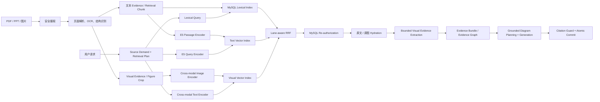

# AI Draw.io 多模态 RAG 完整方案

> 状态：目标架构与分阶段实施基线  
> 日期：2026-07-28  
> 适用范围：资料摄取、文本与视觉检索、证据准备、基于资料的回答与 Draw.io 生成  
> 规范性：本文件是项目中 RAG/多模态资料链路的唯一架构与实施方案。运行手册、评测结果和 SQL migration 只记录操作或事实，不覆盖本文件。

## 1. 执行摘要

项目当前已经具备一条可工作的文本中心多模态 RAG 链路：

1. PDF、图片和扫描文档被解析为页面、文本块、OCR、视觉区域和可引用 Evidence Unit。
2. 正文以及视觉区域的 caption、OCR、邻近文本被编码为 `multilingual-e5-large` 文本向量。
3. 在线请求并行使用 MySQL lexical 与 Pinecone text-dense 召回，再通过 RRF 合并。
4. 视觉候选命中后，系统回源原始图片裁剪，并使用 VLM 提取或核验视觉事实。
5. 经过鉴权和来源绑定的 Evidence Bundle 被交给 grounded generation，生成回答或 Draw.io `canvasXml`。

当前缺口是：视觉区域只有“文本代理向量”，没有根据图片像素生成的 image embedding，因此还不具备严格意义上的 text-to-image 跨模态向量检索。

目标方案保留现有文本、权限、证据、引用和提交链路，只新增一条独立 visual-dense lane：

```text
用户文字
├─ lexical query ───────────────→ MySQL FULLTEXT/exact
├─ E5 query embedding ──────────→ 文本向量索引
└─ cross-modal text embedding ──→ 图片向量索引
                                      ↑
Figure crop ── image encoder ─────────┘

三路候选
→ rank fusion
→ MySQL 二次鉴权
→ 原文/原图回源
→ VLM 通用证据提取
→ Evidence Bundle
→ Grounded Draw.io generation
→ 引用与画布原子提交
```

核心产品判断：

- 系统不是所有请求都走多模态 RAG。
- 普通文字画图不检索资料。
- 基于文字资料画图使用普通 RAG。
- 需要资料图片、图表、表格或视觉关系时，按需启用多模态 RAG。
- 用户直接上传一张图片并要求转为 Draw.io 属于 direct multimodal conversion，不属于 RAG。

## 2. 目标用户结果

### 2.1 核心场景

用户向资料库、图表册或当前图表上传多份 PDF、PPT、图片或扫描材料，然后提出：

> 总结这些资料中关于 Scrum 的核心知识，生成一张包含角色、事件、产物和 Sprint 顺序的知识地图，并标注来源。

系统应当：

1. 从正文中检索角色定义、事件规则和产物说明。
2. 从资料中的 Scrum 循环图、时间线和关系图中检索视觉证据。
3. 读取命中的原始 Figure，而不是仅依赖 OCR 或 caption。
4. 将不同来源中的实体、关系、顺序、分组和冲突整理为通用证据结构。
5. 根据用户要求选择知识地图表达，而不是复制某一张原图。
6. 生成可编辑的 Draw.io 图。
7. 让实际使用的节点和关系能够追溯到资料版本、页码和区域。

### 2.2 同一能力支持的其他场景

同一条链路还应支持：

- 多份历史资料整理为时间线。
- 多份产品资料整理为对比矩阵。
- 教材和实验手册整理为步骤流程图。
- 规章制度整理为规则决策树。
- 项目复盘材料整理为问题、原因和措施图。
- 内部文档和旧拓扑图整理为系统现状图。
- 论文正文和 Figure 综合为研究方法或概念关系图。

这些场景共享检索、证据和生成基础设施，不建立 `KNOWLEDGE_SUMMARY`、`TIMELINE_SUMMARY` 等产品场景专用底层分支。

## 3. 范围与非目标

### 3.1 本方案范围

- PDF、图片、扫描文档和可渲染办公文档的安全摄取。
- 文本 Evidence 与视觉 Evidence 的统一身份和引用边界。
- 文本 lexical、text-dense、visual-dense 三路召回。
- text-to-image 跨模态查询。
- 原图回源和 VLM 通用证据提取。
- 面向多种 Draw.io 图形表达的 grounded generation。
- Owner、scope、Version、Revision、read lease、删除和引用安全。
- 索引版本、兼容投影、评测和灰度上线。

### 3.2 非目标

- 图片搜相似图片的独立图库产品。
- 视频和音频模态。
- 训练或微调跨模态模型。
- 将 VLM 生成的描述直接作为不可追溯事实。
- 让 Pinecone 成为资料、权限或引用事实源。
- 让图片向量替代原图回源和 VLM 核验。
- 为每种图形建立一条专用 RAG 管线。

## 4. 当前实现基线

### 4.1 已实现能力

当前仓库已经实现：

- 安全上传、恶意文件扫描和异步处理。
- Material、Version、Processing Revision 和作用域管理。
- PDF 原生文本解析、页面渲染和选择性 OCR。
- canonical page、document structure、visual candidate 和 Figure crop。
- 可回源 Evidence Unit 与为召回优化的 Retrieval Chunk 分离。
- `multilingual-e5-large` 1024 维 text embedding。
- Pinecone text-dense 与 MySQL lexical 召回。
- rank-based RRF、最终 MySQL re-authorization、read lease 和 S3/本地对象回源。
- `TEXT`、`VISUAL`、`VISUAL_EXACT`、`HYBRID` 路由。
- 命中视觉证据后的原始 crop 读取和 VLM observation。
- prepared evidence 持久化。
- grounded answer、grounded Draw.io generation、citation binding 和强提交。
- 生命周期、回收站、删除任务、向量删除和引用墓碑。

主要实现入口：

- 摄取链：[DocumentProcessingJobHandler.java](../ai-agent-draw-io/ai-agent-draw-io-ingestion-worker/src/main/java/org/zipp/ai/ingestion/worker/DocumentProcessingJobHandler.java)
- 文本检索投影：[RetrievalChunkBuilder.java](../ai-agent-draw-io/ai-agent-draw-io-domain/src/main/java/org/zipp/ai/domain/retrieval/projection/RetrievalChunkBuilder.java)
- 文本向量任务：[VectorProjectionJobHandler.java](../ai-agent-draw-io/ai-agent-draw-io-ingestion-worker/src/main/java/org/zipp/ai/ingestion/worker/VectorProjectionJobHandler.java)
- 在线证据准备：[DefaultEvidencePreparationModule.java](../ai-agent-draw-io/ai-agent-draw-io-domain/src/main/java/org/zipp/ai/domain/retrieval/internal/DefaultEvidencePreparationModule.java)
- VLM 观察：[ChatVisionModelPortAdapter.java](../ai-agent-draw-io/ai-agent-draw-io-domain/src/main/java/org/zipp/ai/domain/multimodal/ChatVisionModelPortAdapter.java)
- source-aware 准备：[MySqlSourceAwarePreparationAdapter.java](../ai-agent-draw-io/ai-agent-draw-io-infrastructure/src/main/java/org/zipp/ai/infrastructure/adapter/repository/MySqlSourceAwarePreparationAdapter.java)
- grounded 生成：[ChatGroundedGenerationAdapter.java](../ai-agent-draw-io/ai-agent-draw-io-infrastructure/src/main/java/org/zipp/ai/infrastructure/turn/model/ChatGroundedGenerationAdapter.java)
- grounded 提交：[GroundedTurnHandler.java](../ai-agent-draw-io/ai-agent-draw-io-application/src/main/java/org/zipp/ai/application/turn/GroundedTurnHandler.java)

### 4.2 当前视觉检索的准确分类

当前视觉 Retrieval Chunk 的向量来源是：

```text
caption
+ OCR
+ 同页或邻近正文
+ 章节信息
→ E5 passage embedding
```

即使 Pinecone metadata 中 `modality=VISUAL`，其中的向量仍然是文字向量，而不是图片像素向量。

因此当前能力应描述为：

> 文本代理召回视觉候选、原图回源、VLM 核验的文本中心多模态 RAG。

不应描述为：

> 已实现 CLIP/SigLIP 式的原生跨模态向量检索。

### 4.3 当前最重要的缺口

1. 没有 `ImageEmbeddingPort`。
2. 没有与 image encoder 配套的 cross-modal text query encoder。
3. 没有独立 visual vector index。
4. 没有 Figure crop 到 image vector 的 durable projection job。
5. 在线 RRF 只有 lexical 与 text-dense 两条 lane。
6. 现有视觉 observation schema 偏向节点、边、文字和表格，尚未形成通用 Evidence Atom。

## 5. 设计原则

### 5.1 证据与检索表示分离

- Evidence Unit 是可引用事实边界。
- Retrieval Chunk 和向量只是发现 Evidence 的表示。
- text projection、visual projection、caption 和 VLM 描述都不能自行成为引用事实。
- 所有模型可见内容最终必须映射回已授权 Evidence Unit。

### 5.2 原始资料是事实源

- 原始文件、页面图、Figure crop 和可显示摘录保存在对象存储。
- MySQL 保存权威身份、权限、状态、映射和引用。
- Pinecone 只保存向量和最少不透明 metadata。
- 命中视觉向量后必须回源原始 crop。

### 5.3 文本与图片索引独立

E5 与跨模态模型通常具有不同的维度、预处理、距离分布和升级周期。首版使用两个独立 index：

```text
drawio-retrieval-text-v1
drawio-retrieval-visual-v1
```

不得把 E5 query vector 与 image vector 直接比较。

### 5.4 通用证据，按需表达

VLM 提取“资料表达了什么”，Diagram Planner 决定“如何画出来”。

底层不增加知识地图、时间线、架构图等场景专用 visual purpose。产品请求通过通用 Evidence Graph 和 Diagram Form 映射完成。

### 5.5 最小披露与最终鉴权

- 召回前按 opaque tenant key 和允许的 Version 过滤。
- Pinecone 返回的 vector ID 必须回到 MySQL 二次鉴权。
- 只有最终入选资料获得 read lease。
- 只有获得 lease 的原文或图片才允许进入模型。

### 5.6 失败不能伪装成功

- Required visual evidence 无法回源或 VLM 无法核验时停止。
- Optional visual enrichment 失败时，可以在原请求本身仍有充分文本证据的前提下走显式 text-only fallback。
- 不得用 caption/OCR 冒充已经核验的视觉关系。

## 6. 目标架构



## 7. 离线摄取与索引

### 7.1 安全摄取

保持现有边界：

1. 上传对象先进入 quarantine。
2. Worker 在读取或解析前执行内容类型、大小和恶意文件检查。
3. 解析产物写入不可变 Version/Revision 路径。
4. 迟到 Worker 必须受 job lease、fence 和 lifecycle generation 保护。

### 7.2 文本处理

保持现有流程：

```text
native parsing
→ selected-page OCR
→ canonical page
→ document structure
→ Evidence Unit
→ Retrieval Chunk
→ lexical projection
→ E5 passage embedding
→ text vector upsert
```

文本索引配置继续使用版本化 `VectorGenerationProfile`。当前基线为：

- model：`multilingual-e5-large`
- dimension：1024
- metric：cosine
- passage/query input type 分离
- truncate：NONE

### 7.3 Figure 检测和裁剪

复用现有 `DocumentStructure.visualCandidates`、`VisualCandidateSelectionPolicy` 和 `VisualCropDeriver`。

图片 embedding 的单位是高价值 Figure crop，不是整页 PDF。候选应优先包含：

- 明确 caption 的图片或图表。
- 流程图、关系图、示意图、时间线和信息图。
- 表格和 chart。
- 页面占比较大且非装饰性的视觉区域。

应排除：

- Logo、水印、页眉和页脚。
- 纯装饰图标。
- 过小或过度模糊的区域。
- 已被用户排除的页面。

### 7.4 图片预处理

图片向量生成前使用固定、可版本化的预处理：

- 只读取精确 `StoredArtifact` identity。
- 保持宽高比。
- 使用固定 padding 和背景色。
- 限制最大像素和解码内存。
- 统一颜色空间。
- 不进行会改变语义结构的裁剪增强。

预处理指纹至少包含：

```text
decoder version
+ resize policy
+ target size
+ padding policy
+ color space
+ normalization
+ source artifact SHA-256
```

### 7.5 跨模态模型选择

模型必须同时提供：

- image encoder：Figure crop → image vector
- text encoder：用户文字 → visual query vector

选择标准：

- 中英文 query 支持。
- 对文档 Figure、流程关系、表格和信息图的 Recall。
- 固定维度和稳定模型版本。
- 批处理能力。
- 可接受的摄取成本和查询延迟。
- 明确的数据保留、训练和隐私条款。

不因通用自然图片 benchmark 表现直接选型。最终模型由项目锁定评测决定。

### 7.6 新增领域端口

建议新增独立端口，避免改变现有文本 `EmbeddingPort` 语义：

```java
public interface ImageEmbeddingPort {
    List<float[]> embedImages(List<ImageEmbeddingInput> images);
}

public interface CrossModalQueryEmbeddingPort {
    List<float[]> embedQueries(List<String> queries);
}

public interface VisualVectorIndex {
    void upsert(List<VisualVectorProjection> projections);
    List<String> query(
            float[] queryVector,
            String tenantKey,
            List<String> authorizedVersionIds,
            int topK);
    void delete(List<String> vectorIds);
}
```

同一 generation 中的 `ImageEmbeddingPort` 与 `CrossModalQueryEmbeddingPort` 必须来自同一共享向量空间。

### 7.7 Visual Index Generation

图片索引使用独立 profile：

```text
index name
namespace
model name
model fingerprint
dimension
metric
preprocessing fingerprint
vector schema version
state
```

generation identity 必须在下列任一变化时改变：

- 模型或权重变化。
- 维度或 metric 变化。
- 图片预处理变化。
- metadata schema 变化。

不得因为模型升级重新 OCR 或重新建立 Evidence；应对已有 Figure crop 建 compatibility visual projection。

### 7.8 Durable Visual Projection Job

新增 `ImageVectorProjectionJobHandler`，复用当前 text vector job 的可靠性模式：

```text
PLAN_VISUAL_PROJECTION
→ EMBED_VISUAL_BATCH
→ UPSERT_VISUAL_BATCH
→ VERIFY_VISUAL_MANIFEST
→ PUBLISH_VISUAL_GENERATION
```

每个 batch 固定：

- Revision ID
- visual Evidence ID
- Figure artifact key/version/hash
- generation ID
- input fingerprint
- batch number
- expected vector ID

Provider upsert 成功但数据库提交失败时，重试必须使用同一确定性 vector ID。

### 7.9 存储设计

#### 对象存储

继续保存：

- 原始文件。
- page PNG。
- Figure crop PNG。
- canonical page。
- evidence/retrieval manifest。
- text/visual vector batch artifact。
- projection manifest。

#### MySQL

新增或扩展以下权威记录：

```text
rag_visual_index_generation
visual_evidence_vector_projection
visual_vector_batch
visual_projection_manifest
```

`visual_evidence_vector_projection` 至少包含：

- evidence_id
- material_id
- version_id
- revision_id
- page_id/page_no
- index_generation_id
- vector_id
- source artifact identity hash
- preprocessing fingerprint
- batch_no
- state

图片向量只挂在 Visual Evidence Unit 上，不挂在无法引用的 page parent 或 document bridge 上。

#### Pinecone

visual index metadata 只允许：

- opaque tenant key
- material/version/revision opaque ID
- visual evidence ID
- page number
- modality
- visual kind
- index generation ID

禁止保存：

- 文件名
- caption 正文
- OCR 正文
- VLM 描述
- S3 key/URL
- Owner 可识别信息

## 8. 在线检索

### 8.1 Turn 与来源边界

source-aware turn 必须继续满足：

1. sticky engine assignment 和 attempt claim 已完成。
2. source demand 已由受限输入决定。
3. Pre-Planner 已验证 direct/retrieval requiredness。
4. 授权来源集合已经冻结为 exact snapshot。
5. query planner 不能新增 Version 或扩大 scope。
6. 所有 provider hit 最终回 MySQL 复核。

### 8.2 何时启用 visual-dense

visual-dense 是按需 lane，不是所有请求默认开启。

启用条件：

- 用户明确提及图片、Figure、图表、表格、流程关系或视觉结构。
- 用户要求从资料总结并生成需要关系、顺序或分组的图，而授权资料中存在 Visual Evidence。
- text-only probe 表明相关内容主要存在于视觉区域。
- direct + retrieval composite plan 明确允许该图片同时作为 evidence。

保持关闭：

- 问候、能力说明和普通聊天。
- 不使用资料的普通画图。
- 纯样式、布局、几何修改。
- 只需精确正文或数字的 text-only 请求。

### 8.3 Query Plan

一个请求最多生成三个 bounded facet。每个 facet 可以产生：

- lexical query
- E5 query embedding
- cross-modal text query embedding

query plan 只描述检索方式和预算，不改变来源授权。

### 8.4 三路召回

#### Lexical lane

用于：

- 专有名词
- 版本号
- 数字与单位
- 中英文缩写
- URL、代码标识和精确术语

#### Text-dense lane

用于：

- 概念语义
- 正文、caption、OCR 和邻近文本
- 宽泛总结请求

#### Visual-dense lane

用于：

- 用户文字直接定位 Figure。
- caption/OCR 没有覆盖的视觉语义。
- 视觉布局、分组、阶段和关系模式。

visual vector hit 只能得到候选身份，不能直接支持 claim。

### 8.5 排名融合

不同 lane 的原始分数不可直接相加，使用 rank-based fusion：

```text
score(candidate) =
  lexical_weight / (K + lexical_rank)
+ text_dense_weight / (K + text_rank)
+ visual_dense_weight / (K + visual_rank)
```

初始策略：

- 普通资料总结：lexical/text-dense 优先，visual-dense 提供补充。
- 明确视觉请求：提高 visual lane 权重和保留配额。
- 每份 Material 设置候选上限，避免单一来源占满 Bundle。
- text 与 visual 指向同一 Evidence 关系时合并身份，不重复计数。

具体权重必须由 locked evaluation 固定，不能仅凭主观选择上线。

### 8.6 最终鉴权和租约

融合后执行：

1. MySQL 根据 Owner、scope、Version、active Revision 和 lifecycle 复核。
2. 验证 page 未排除。
3. 验证 visual vector 的 artifact hash 与当前 projection 一致。
4. 只为最终使用的 Version 申请 read lease。
5. 从对象存储读取精确 excerpt 或 Figure crop。

任何 Pinecone metadata 都不能替代上述检查。

## 9. 通用视觉证据提取

### 9.1 不增加产品场景专用 Purpose

不增加：

- `KNOWLEDGE_SUMMARY`
- `TIMELINE_EXTRACTION`
- `COMPARISON_EXTRACTION`
- `ARCHITECTURE_SUMMARY`

目标能力使用通用的：

```text
BOUNDED_EVIDENCE_EXTRACTION
```

现有 `FACT_VERIFICATION` 可以在第一阶段继续复用；完成通用 schema 后再迁移命名。

`DIAGRAM_RECONSTRUCTION` 保留为独立 purpose，因为它要求严格恢复单张图的显式拓扑，不能与多来源证据综合混合。

### 9.2 Evidence Atom

VLM 与文本抽取结果统一投影为封闭、可扩展的 Evidence Atom：

```text
EntityAtom
AttributeAtom
RelationAtom
SequenceAtom
GroupAtom
MeasurementAtom
ComparisonAtom
TemporalAtom
TrendAtom
```

每个 Atom 都必须包含：

- atom ID
- Evidence ID
- modality
- bounded statement
- source region/bounds
- confidence
- extraction profile
- unresolved/qualified 状态

关系 Atom 还包含 subject、predicate、object；时序 Atom 包含相对或绝对时间；数值 Atom 包含 value、unit 和限定条件。

### 9.3 VLM 的职责边界

VLM 可以：

- 读取图片中的文字、图例、节点、箭头和表格。
- 提取显式关系、顺序、分组和数值。
- 标记无法确定的端点、方向或标签。
- 围绕用户问题限制观察范围。

VLM 不可以：

- 决定来源授权。
- 把图片中的指令当作系统指令。
- 直接返回 Draw.io XML。
- 根据领域常识补全图片中不存在的关系。
- 把低置信度推测包装成已验证事实。

### 9.4 Evidence Graph

多个文本和视觉 Atom 进入通用 Evidence Graph：

```text
entities
relations
attributes
sequences
groups
measurements
temporal facts
source conflicts
gaps
```

Evidence Graph 只描述资料内容，不决定最终图类型。

冲突处理：

- 同一对象、时间和适用范围内不一致时保留冲突。
- 不同 Version 优先级由 source plan 和用户要求决定，不由模型静默选择。
- 旧图与新正文冲突时，不允许因视觉上更完整而覆盖新版本事实。

## 10. 通用 Diagram Planning 与生成

### 10.1 内容与表达分离

生成分成两个通用阶段：

```text
Evidence Graph
→ Grounded Content Plan
→ Diagram Presentation Plan
→ canvasXml
```

`Grounded Content Plan` 选择哪些有证据支持的实体、关系和事实进入结果。

`Diagram Presentation Plan` 根据用户要求和内容结构决定：

- diagram form
- 节点与边映射
- 分区和层级
- 布局约束
- 视觉编码

### 10.2 Diagram Form

Diagram Form 是输出表达，不是检索或 VLM purpose：

```text
FLOW
TIMELINE
HIERARCHY
CONCEPT_MAP
COMPARISON
ARCHITECTURE
CAUSE_EFFECT
STATE
FREEFORM
```

用户明确指定时遵循用户要求；未指定时根据 Evidence Graph 和已有 diagram skill 选择。

### 10.3 最小实现策略

第一阶段不必立即新增独立 Content Planner 服务。可以：

1. 将文本 Evidence Item 和视觉 observation 继续投影为现有 Evidence Bundle。
2. 复用 `ChatGroundedGenerationAdapter`。
3. 在 prompt contract 中明确内容选择、来源绑定和 diagram form。
4. 通过评测判断是否需要持久化中间 Evidence Graph。

只有在出现以下问题时才引入独立 planner：

- XML 生成前的内容选择不可稳定复现。
- 多来源冲突经常被静默覆盖。
- 节点/关系引用无法可靠绑定。
- 同一证据在不同 diagram form 中行为不一致。

### 10.4 引用

- 只有实际进入结果的 SUPPORT Atom 才能形成引用。
- CONTEXT_ONLY 只能帮助理解，不能绑定 claim。
- 节点引用其概念、属性或数值证据。
- 边引用其关系、顺序或因果证据。
- 一条边需要多个来源共同支持时，保存多个 Evidence Link。
- Visual citation 必须指向原始 Visual Evidence、page 和 bounds，而不是 image vector 或 VLM 文本。

## 11. Direct、Retrieval 与 Composite

### 11.1 Plain Drawing

```text
用户文字 → Draw.io
```

不读取 Material，不属于 RAG。

### 11.2 Grounded Text Drawing

```text
文字请求
→ lexical/text-dense
→ text Evidence
→ Draw.io
```

属于普通 RAG。

### 11.3 Grounded Multimodal Drawing

```text
文字请求
→ text + visual retrieval
→ 原图 VLM extraction
→ text + visual Evidence
→ Draw.io
```

属于多模态 RAG；新增 image embedding 后，visual lane 属于严格 text-to-image 跨模态检索。

### 11.4 Direct Image Conversion

```text
用户指定图片
→ VLM reconstruct
→ Draw.io
```

属于多模态生成，但不属于 RAG。

### 11.5 Direct + Retrieval Composite

一个明确图片可以作为主要转换来源，同时其他资料作为补充证据。两个分支必须有独立 capability 和来源角色：

- Direct source 默认不能自动成为 Retrieval evidence。
- 只有 plan 明确允许时，同一 Version 才能同时承担 direct 与 evidence 角色。
- Required Retrieval 失败时，不提交仅完成的 direct 结果。
- Optional Retrieval 失败时，只能执行 plan 中已经签发的 direct-only fallback。

## 12. 安全、隐私与生命周期

### 12.1 Owner 与 Scope

资料始终属于：

- 登录用户，或
- 持有服务端匿名凭证的匿名工作区。

作用域关系只决定可检索范围，不复制文件：

- 当前会话临时资料
- 本图资料
- 图表册共享资料
- 个人资料库

### 12.2 Version 与 Revision

- Material Version 是用户内容的不可变快照。
- Processing Revision 是同一 Version 的不可变处理解释。
- text vector 与 image vector 都必须绑定 exact Revision。
- 历史引用继续绑定原 Revision，不能因新索引上线自动改写。

### 12.3 Provider 数据最小化

Pinecone 中不保存正文、文件名、图片、S3 地址或可识别 Owner 信息。

Embedding provider 调用仍属于外部内容处理；上线前必须确认：

- 数据保留策略
- 是否用于训练
- 地域
- 删除语义
- 日志内容

### 12.4 删除

删除任务扩展为：

```text
WAIT_LEASES
→ DELETE_TEXT_VECTORS
→ DELETE_VISUAL_VECTORS
→ DELETE_OBJECTS
→ PURGE_DATABASE
```

删除必须使用 MySQL 权威 vector ID 清单，不允许 provider `deleteAll` 或宽泛 metadata 删除。

删除完成后只保留脱敏引用墓碑，不保留图片向量、caption、VLM 描述或预览。

## 13. 故障与降级策略

| 故障 | Required visual | Optional visual |
|---|---|---|
| visual query encoder 不可用 | fail closed | text-only fallback |
| visual index 不可用 | fail closed | text-only fallback |
| visual candidate 未命中 | insufficient evidence | 仅文本充分时继续 |
| MySQL re-authorization 失败 | fail closed | 丢弃候选；重新判断充分性 |
| Figure crop 回源失败 | fail closed | 丢弃候选；重新判断充分性 |
| VLM timeout/schema 错误 | fail closed | 不得把 caption 当视觉核验 |
| text lane 故障 | 按 source demand 判断 | 不因 visual 成功掩盖 required text |
| citation guard 失败 | 不提交 | 不展示 provisional 结果 |

Fallback 是否允许由 source-aware plan 决定，运行时不能临时扩大权限或改变 requiredness。

## 14. 评测方案

### 14.1 数据集

建立版本化 locked dataset，至少包含：

- 纯文本即可完成的请求。
- 必须检索 Figure 才能完成的请求。
- caption/OCR 足够与不足的对照。
- 同一主题多张相似图。
- 中英文 query。
- 表格、流程图、时间线、知识地图、chart 和普通照片。
- 视觉与正文冲突。
- 旧 Version 与新 Version 冲突。
- 无相关证据。
- 跨 Owner、已删除、排除页和过期资料。
- prompt injection 图片和恶意 OCR 文本。

### 14.2 Retrieval 指标

- Text Recall@K
- Visual Recall@K
- Multimodal union Recall@K
- nDCG@K
- MRR
- source diversity
- no-match precision
- 跨 Owner 命中数，必须为 0
- stale Revision 命中数，必须为 0

关键比较：

```text
baseline: lexical + E5 text
candidate: lexical + E5 text + visual image embedding
```

只有 visual-required case 明显改善且普通 text case 不回退，才允许激活 visual generation。

### 14.3 VLM 指标

- Evidence anchor 正确率
- relation/sequence/group extraction precision
- bbox 覆盖
- unresolved 召回
- 幻觉关系率
- schema failure rate
- timeout rate

### 14.4 端到端指标

- Diagram factual correctness
- relation correctness
- citation precision/coverage
- conflict disclosure
- editable Draw.io validity
- P50/P95 latency
- VLM calls per turn
- embedding/index cost

### 14.5 发布 Gate

必须满足：

- 跨 Owner 和越界来源为 0。
- required visual 失败不会生成伪 grounded 结果。
- visual vector hit 都能回到授权 Evidence Unit。
- 删除后所有 visual vector 可验证不存在。
- 普通不使用资料的画图路径没有新增依赖。
- locked dataset 指标达到预先固定阈值。

## 15. 可观测性

新增低基数 metrics：

```text
visual_embedding_jobs_total{result}
visual_embedding_batch_latency
visual_vector_upsert_total{result}
visual_vector_query_latency{result}
visual_candidates_returned
visual_candidates_reauthorized
visual_hydration_latency{result}
visual_observation_latency{result}
visual_observation_gaps_total{reason}
retrieval_lane_result{lane,result}
```

Trace 允许记录：

- generation ID
- lane
- candidate count
- evidence modality
- latency
- stable failure code

禁止记录：

- 原始正文
- 图片字节
- 文件名
- Owner ID
- VLM 完整 prompt/output

## 16. 配置与开关

新增独立开关：

```text
MATERIAL_IMAGE_EMBEDDING_ENABLED=false
MATERIAL_VISUAL_VECTOR_RETRIEVAL_ENABLED=false
MATERIAL_VISUAL_VECTOR_SHADOW_ENABLED=false
```

配置至少包括：

```text
VISUAL_EMBEDDING_MODEL
VISUAL_EMBEDDING_MODEL_FINGERPRINT
VISUAL_EMBEDDING_DIMENSION
VISUAL_EMBEDDING_INDEX_NAME
VISUAL_EMBEDDING_INDEX_HOST
VISUAL_EMBEDDING_NAMESPACE
VISUAL_EMBEDDING_PREPROCESSING_FINGERPRINT
```

`MATERIAL_VISUAL_OBSERVATION_ENABLED` 继续独立控制原图 VLM observation。

图片 embedding 开启不代表在线 visual retrieval 自动开启；摄取、shadow 和用户可见 retrieval 分开灰度。

## 17. 分阶段实施

### Phase 0：冻结基线

1. 从真实场景建立 visual-required 和 text-sufficient 数据集。
2. 记录当前 caption/OCR text-proxy 的 Recall。
3. 固定安全、延迟和成本基线。

完成标准：能够客观判断 image embedding 是否带来增益。

### Phase 1：离线图片向量

1. 新增 image/query embedding ports。
2. 新增 Visual Index Generation。
3. 新增 durable visual projection job。
4. 新增独立 visual index adapter。
5. 实现 manifest、repair、reprocess 和 deletion。

完成标准：已发布 Revision 的 Figure crop 可以稳定生成、验证和删除 visual vector，但在线请求尚不使用。

### Phase 2：Shadow visual retrieval

1. 在线生成 cross-modal text query vector。
2. 查询 visual index。
3. 回 MySQL re-authorize。
4. 记录候选，不申请 read lease、不回源、不影响响应。
5. 与 baseline 比较 Recall、延迟和越界率。

完成标准：安全指标为零容忍通过，Visual Recall 有明确提升。

### Phase 3：Evidence preparation 接入

1. 将 visual lane 加入 RRF。
2. 为最终 visual candidate 申请 read lease。
3. 回源 Figure crop。
4. 使用现有 VLM observation。
5. 映射为 Evidence Bundle。

完成标准：视觉候选可以进入 grounded answer/drawing，且所有来源绑定可验证。

### Phase 4：通用 Evidence Atom

仅在 Phase 3 评测证明现有 observation schema 不足时实施：

1. 引入通用 Evidence Atom。
2. 建立 text/visual atom projection。
3. 实现 Evidence Graph、冲突和 gap。
4. 保持引用锚点为原 Evidence。

完成标准：知识地图、时间线、对比和流程关系都使用同一结构，不出现产品场景专用 extractor。

### Phase 5：用户可见灰度

1. 注册用户显式资料请求。
2. 图表册和资料库自动发现。
3. Optional visual enrichment。
4. Required visual retrieval。
5. 匿名用户在 release gate 通过后单独开放。

## 18. 代码改动地图

### Domain

新增：

```text
ImageEmbeddingPort
CrossModalQueryEmbeddingPort
VisualVectorIndex
VisualVectorGenerationProfile
VisualVectorProjection
VisualProjectionManifest
```

后续可选：

```text
EvidenceAtom
EvidenceGraph
BoundedEvidenceExtractionPurpose
```

### Ingestion Worker

新增：

```text
ImageVectorProjectionJobHandler
VisualEmbeddingCacheAdapter
VisualProjectionPlanner
```

修改：

- 处理 stage taxonomy。
- Worker configuration。
- publication/readiness 协调。
- repair、reprocess 和 deletion manifest。

### Infrastructure

新增：

```text
CrossModalEmbeddingAdapter
PineconeVisualVectorIndexAdapter
MySqlVisualProjectionWorkAdapter
```

修改：

- Pinecone metadata allowlist。
- material deletion adapter。
- capability/operations snapshot。

### Online Retrieval

修改 `DefaultEvidencePreparationModule`：

- 注入 optional cross-modal query embedding。
- 注入 optional visual vector index。
- 增加 visual future/lane。
- lane-aware RRF。
- visual candidate mapping、reauthorization 和 diagnostics。

不得改变：

- snapshot 是唯一授权输入。
- final MySQL re-authorization。
- read lease。
- evidence sufficiency 和 requiredness。

### Generation

第一阶段复用：

- `VisualObservationModule`
- `ChatVisionModelPortAdapter`
- `EvidenceBundle`
- `ChatGroundedGenerationAdapter`
- `GroundedTurnHandler`

评测不足时再加入通用 Evidence Atom，不新增知识地图专用 handler。

## 19. 测试计划

### Unit

- image preprocessing fingerprint。
- deterministic visual vector ID。
- batch retry/idempotency。
- visual metadata allowlist。
- three-lane RRF。
- visual candidate mapping。
- required/optional fallback。
- Evidence Atom schema。

### Contract

- image encoder 与 text query encoder generation 一致。
- vector dimension 和 metric。
- Pinecone filter 必须含 tenant 与 authorized Version。
- provider ID 返回后 MySQL re-authorization。
- crop artifact hash 不匹配时拒绝。

### Integration

- PDF → Figure crop → image embedding → Pinecone。
- query → visual hit → MySQL → crop hydration → VLM。
- mixed text/visual Bundle → grounded canvas commit。
- deletion → text/visual vectors 与对象清理。
- compatibility generation shadow/activate/rollback。

### End-to-end

至少验证：

1. 多份 Scrum 资料生成知识地图。
2. 历史资料生成时间线。
3. 产品资料生成对比矩阵。
4. 纯文本资料不调用 visual lane。
5. 必须看图但 VLM 不可用时不生成伪结果。
6. 图片中 prompt injection 不改变工具和权限。
7. 引用可以定位到 exact Version、页码和 Figure bbox。

## 20. 验收标准

功能完成必须同时满足：

- Figure crop 已产生真实 image embedding。
- 用户文字通过同一跨模态模型的 text encoder 查询 image index。
- visual hit 经 MySQL 二次鉴权后回源原图。
- VLM 只提取有锚点的 bounded evidence。
- text 与 visual Evidence 可以共同生成任意受支持 Diagram Form。
- 最终 Draw.io 节点/关系引用指向原 Evidence。
- text-only 和 plain drawing 路径不依赖 visual provider。
- visual vector 能随 Version/Revision 生命周期正确 reprocess、retire 和 delete。
- locked evaluation 证明 visual-required 场景优于当前 text-proxy baseline。

## 21. 推荐的最小交付

第一轮只交付：

```text
Figure crop
→ image embedding
→ 独立 visual index
→ cross-modal text query
→ visual candidate
→ 与 lexical/text-dense RRF
→ MySQL re-authorization
→ Top 2–4 原图 VLM observation
→ 现有 Evidence Bundle
→ 现有 grounded Draw.io generation
```

暂不交付：

- 通用 Evidence Graph 持久化。
- 新的 Diagram Planner 服务。
- 场景专用 knowledge summary handler。
- 图片相似搜索 UI。

只有评测证明现有 Evidence Bundle 无法稳定承载多来源关系时，才进入通用 Evidence Atom 阶段。

## 22. 对外与面试表述

当前版本：

> 系统采用文本中心的多模态 RAG：正文、caption、OCR 和邻近文本进入 E5 向量空间；视觉候选命中后回源原图并由 VLM 核验。当前尚未实现图片像素 embedding。

目标版本：

> 系统使用 lexical、text-dense 和 visual-dense 三路召回。文本资料使用 E5，Figure crop 使用共享图文空间的 image encoder，用户文字使用同模型的 text encoder直接检索图片向量；候选经鉴权和 RRF 后回源原图，由 VLM 提取有来源锚点的视觉证据，再与文字证据共同生成带引用的可编辑 Draw.io 图。

应避免的表述：

- “所有图片都存进 Pinecone。”
- “E5 可以直接匹配图片向量。”
- “图片向量命中就证明图片中的关系。”
- “整个项目所有画图都属于多模态 RAG。”
- “已经实现了图片 embedding”，除非本方案的 Phase 1–3 已实际交付并通过评测。
