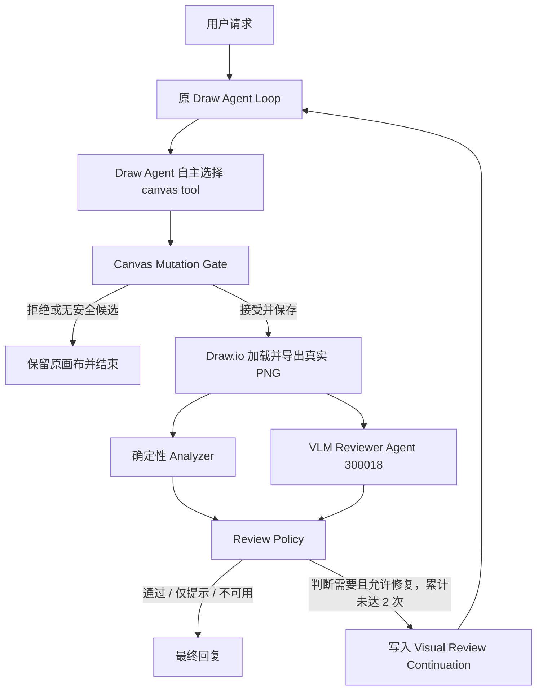

# VLM Reviewer 回到原 Draw Agent Loop 实施方案

> 编写日期：2026-07-16
> 适用仓库：`ai_draw_io`
> 状态：新的唯一后续实施方案
> 取代：`2026-07-15-diagram-quality-validation-and-repair-engine-plan.md` 中的多修复器架构

## 1. 结论

后续不再建设 `VisualIssueLocator → typed directive → Repair Engine / Targeted Router / Drawer` 这一组并行修复链路。它把一次本应自然发生的 Agent 迭代拆成了过多 Module，也会让 Orchestrator 知道工具选择和 XML 修改细节。

目标链路统一为：



这里的“回到原 Draw Agent Loop”有严格含义：

- 使用同一个 Drawer agent 配置 `300000`。
- 使用同一个用户 session，使 Drawer 保留原始任务和前一轮上下文。
- 复用 `AgentConversationService` 已有的流式 drawing/tool loop。
- 不创建 Repair Agent，不让 Reviewer 获得 canvas tool。
- 不由 Orchestrator 直接调用 `modify_diagram` 或 `optimize_diagram`。
- 不重新调用 Intent Router；原始意图已经确定，重新路由既浪费一次模型调用，也可能把内部修复说明误判成新建任务。
- Reviewer 反馈作为服务端生成的 continuation context 进入 Drawer；Drawer 自己选择合适工具。

外层视觉循环最多允许两次已保存的自动修复，每次 VLM 后都由 Policy 判断，而不是由 VLM 直接决定是否执行：

```text
Draw → Render → Review(round 0) → [Policy] → Drawer repair 1
     → Render → Post-repair review(round 1) → [Policy] → Drawer repair 2（如仍需要且安全）
     → Render → Verify-only(round 2) → Finish
```

Drawer continuation 内部仍可保留一次确定性 self-repair，因为读取 tool 的 `analysis/repairBrief` 后立即修正，比再次截图并调用 VLM 更便宜。

## 2. 为什么采用这个方案

### 2.1 与现有 Agent 运行模型一致

当前 `AgentConversationService` 已经提供完整的 Drawer loop：构造 drawing context、绑定 skill、设置 tool policy、调用 Drawer、读取 function response，并根据 tool 返回的确定性 `repairBrief` 决定是否继续。视觉审阅后的修复不需要另一套执行引擎，只需要以一种明确的 continuation 形式重新进入这条路径。

### 2.2 保持 Reviewer 与 Drawer 的职责分离

VLM Reviewer 负责回答：

- 用户需求是否在像素结果中可见；
- 布局、文字、样式和连线是否容易理解；
- 哪个可见区域、标签或关系存在问题；
- 建议 Drawer 朝什么方向修复。

VLM Reviewer 不负责：

- 选择 canvas tool；
- 编写或修改 XML；
- 决定 mutation 是否保存；
- 在无法定位时猜测 cell id。

Drawer 负责理解当前 XML、Reviewer 反馈和原始任务，并决定如何修改。Mutation Gate 负责接受或拒绝候选。这三个职责不能合并。

### 2.3 避免过度设计

不再新增以下生产 Module：

- `VisualIssueLocator`；
- 通用 `Canvas Repair Engine`；
- `DETERMINISTIC / TARGETED_ROUTE / MODEL_ASSISTED` 多执行器分发；
- 由 Orchestrator 维护的工具级 repair workflow。

如果已有 deterministic analysis 能把唯一标签映射到 cell id，可以把这些 id 作为安全提示和授权输入；这只是现有 Orchestrator 内的轻量转换，不值得成为独立 Module。

## 3. 当前代码与目标之间的差距

当前生产代码已经接近目标：

1. `CanvasVisualReviewOrchestrator` 在 `REPAIR` 时构造新的 `ChatRequestDTO`。
2. 它固定 Drawer agent id，并复用原 session id。
3. `AgentConversationService.streamVisualRepair(...)` 跳过 Intent Router，再进入内部 `stream(...)`。
4. 内部 `stream(...)` 使用和首轮相同的 `chatService.handleMessageStream(...)`，因此实际上已经复用了原 Drawer loop。

仍需修正的地方：

### 3.1 名称表达成了“特殊 Repair 流”

`streamVisualRepair` 容易被理解成独立修复 Agent 或专用工具调用。它实际应表达为“继续原 Drawer”。后续将其改成清晰的 continuation interface，例如：

```java
continueDrawing(
    ChatRequestDTO request,
    DrawerContinuationContext continuation,
    ResponseBodyEmitter emitter
)
```

该 interface 隐藏 forced route、tool policy、session ownership 和 telemetry 细节。调用方只需知道“将 Review 反馈交还 Drawer”。

### 3.2 Orchestrator 过早替 Drawer 选择工具类别

当前 `shouldOptimizeLayout(result)` 将视觉问题预先转换成 `optimize_layout` 或 `edit_existing`，随后 tool policy 只开放一个工具。这正是需要删除的耦合：Reviewer issue type 不足以判断最终应使用哪个 canvas tool。

目标是为 continuation 开放：

- `modify_diagram`
- `optimize_diagram`

但始终禁止 `create_diagram`。Drawer 根据当前 XML 和反馈选择其中一个。

### 3.3 continuation prompt 仍像一次新的用户请求

当前 `CanvasVisualRepairBriefComposer` 生成一段命令式 repair message，再经过普通 routed drawing message 组装。目标 prompt 应明确标记为内部 continuation，避免 Drawer 将其解释成新的用户任务：

```text
[Visual Review Continuation]
Original task: <original task>
Reviewed canvas: version=<version>, contentHash=<hash>
Review round: <completed repair rounds>/2

Visible issues:
1. type=EDGE_TRACEABILITY, severity=MAJOR
   anchors=[账号密码正确?, 显示错误并允许重试]
   region=right
   evidence=...
   requested improvement=...

Continue the original drawing task using the current canvas.
Choose modify_diagram or optimize_diagram yourself.
Do not create a new diagram.
Preserve unmentioned labels, ids and relationships.
```

### 3.4 当前授权依赖唯一标签，但不能覆盖所有视觉问题

当前 `repairAuthorization(...)` 只对唯一精确 label 生成 cell id，歧义时 fail closed。第一版继续保留这个安全策略，不建设通用 Locator：

- 唯一映射成功：允许自动回到 Drawer。
- 重复标签、空 anchor、whole-canvas 问题或映射失败：只展示 Review，不自动修改。
- 第一版自动 continuation 只处理既有 cell 上的 `TEXT_READABILITY`、`LAYOUT_HIERARCHY`、`EDGE_TRACEABILITY` 和 `STYLE_COHERENCE`；`TASK_NOT_VISIBLE`、`MISSING_REQUESTED_ELEMENT` 与关系错误只报告，不以视觉 Review 的名义自动改变业务语义。
- 后续如果真实数据证明大量可修问题因定位失败被拦截，再单独设计更小的 manifest 映射增强；不能预先引入完整定位子系统。

## 4. Module 职责和 Interface

| Module | 唯一职责 | 明确不负责 |
|---|---|---|
| Intent Router | 只处理用户最初的意图与图表类型 | 不参与 Review continuation |
| Draw Agent `300000` | 理解原任务、当前 XML 和反馈，自主选择绘图工具并迭代 | 不决定候选是否安全保存 |
| Canvas tools | 根据 Drawer 参数生成 mutation candidate | 不执行 VLM、不决定最终通过 |
| Canvas Mutation Gate | 比较 before/after、限制字段和 cell scope、保存被接受候选 | 不生成修复方案 |
| Deterministic Analyzer | 输出 XML、结构、几何、连线和 profile-aware evidence | 不做像素美学判断 |
| VLM Reviewer `300018` | 根据真实 PNG 和任务输出结构化视觉事实 | 不拥有 canvas tool、不修改 XML |
| Review Policy | 将 Reviewer 结果转换为 finish 或 continue Drawer | 不选择 `modify_diagram` / `optimize_diagram` |
| Visual Review Orchestrator | 校验 version/hash、调用 Reviewer、构造 continuation、控制外层轮数 | 不解释 XML、不直接修图 |
| Frontend render coordinator | 加载已保存版本、导出对应 PNG、触发 review/verify | 不自行决定 Review 结果 |

最重要的 seam 是 Drawer continuation：

```java
record DrawerContinuationContext(
    String sourceRunId,
    String originalUserTask,
    String diagramType,
    long reviewedVersion,
    String reviewedContentHash,
    List<CanvasVisualIssue> issues,
    CanvasMutationAuthorization authorization,
    int visualRepairRound,
    int maxVisualRepairRounds
) {}
```

这不是一个新的 Agent，也不需要一个新的 tool。它只是调用原 Drawer loop 所需的最小上下文。

## 5. 完整状态机

### 5.1 首轮绘图

1. 用户请求进入 Intent Router。
2. Router 选择 `create_new / edit_existing / optimize_layout`、diagram type 和 skill。
3. 原 Draw Agent Loop 运行。
4. Draw Agent 调用 canvas tool。
5. tool 返回 deterministic analysis 和 repair brief。
6. 若存在可修确定性问题且内部预算未用完，Draw Agent 在同一 loop 中再修一次。
7. Mutation Gate 接受候选并保存唯一版本。
8. 前端加载该版本并导出真实 PNG。

### 5.2 Review 后回到 Drawer

1. Orchestrator 校验 PNG 对应的 diagram version 和 content hash。
2. Deterministic Analyzer 分析同一份已保存 XML。
3. VLM Reviewer 审查 PNG。
4. Review Policy 返回：
   - `APPROVE`
   - `APPROVE_WITH_NOTES`
   - `UNAVAILABLE`
   - `NEEDS_HUMAN_REVIEW`
   - `REPAIR`
5. `POST_MUTATION + round=0` 或 `POST_REPAIR + round=1` 时，只有 Policy 返回 `REPAIR`，且全部问题 local、类型在白名单、可唯一授权，才创建 continuation。
6. continuation 使用相同 Drawer agent id 和 session id，跳过 Intent Router。
7. Drawer 收到当前 XML、原始任务和结构化 Review 反馈。
8. Drawer 自主选择 `modify_diagram` 或 `optimize_diagram`。
9. Mutation Gate 拒绝越权、退化、stale 或无实际候选的修改。
10. 接受后保存新版本，前端重新加载并导出 PNG。
11. 第一次修复后进行 `POST_REPAIR + round=1` Review；Policy 重新判断是否需要且允许第二次修复。
12. 第二次修复后进行 `VERIFY_ONLY + round=2` Review；该阶段只给最终结论，不再授予 mutation。

### 5.3 停止条件

以下任一条件成立即停止：

- Reviewer 通过或只有 minor notes；
- Reviewer 不可用；
- Reviewer 建议人工确认；
- issue 不是 local；
- issue 不在第一版视觉自动修复白名单；
- cell 授权不能唯一确定；
- Mutation Gate 拒绝候选；
- version/hash 已变化；
- 已完成两次视觉 continuation；
- verify-only 仍发现 major/critical 问题（报告并建议人工确认）。

## 6. Draw Agent 效率设计

### 6.1 跳过不必要的 Intent Router 调用

视觉反馈不是新用户意图。continuation 直接复用已知 diagram type 和 Drawer agent，减少一次模型调用，也避免内部 repair text 被误路由。

### 6.2 复用 session，但创建独立 run

- `sessionId` 保持不变，让 Drawer 保留原始任务和先前上下文。
- repair 使用新的 `runId`，并记录 `sourceRunId/parentRunId/visualRepairRound`，便于观测和限额。
- 新 run 开始前必须确保上一 drawing run 已释放 session ownership；不能并发修改同一个 session/canvas。

### 6.3 continuation 不重复注入完整 Skill

初次 create/large optimize 已经加载 diagram skill。continuation 默认不再附加完整 skill 文本，只保留：

- 原任务摘要；
- 当前 diagram type；
- 最多 3 个需要修复的 issue；
- 当前 XML/context；
- 工具与 mutation scope 约束。

只有 session 丢失或 diagram type 发生变化时才重新注入 skill。

### 6.4 区分两个工具的职责

`modify_diagram`：

- 增删或替换明确 cell；
- 修改 label、业务关系或节点/边内容；
- 对指定 cell 做局部 patch。

`optimize_diagram`：

- 只做非语义的 geometry、style、waypoint 和 routing 调整；
- `route_only` 必须给出 `targetEdgeIds`；
- 不得改变 label、source/target 或新增业务节点。

上述是普通用户编辑请求中的工具职责。对于 Visual Review continuation，两种工具都额外受到同一份 authorization 限制：第一版只允许修改已授权 cell 的 `STYLE`、`GEOMETRY` 和 `WAYPOINTS`，不允许新增/删除 cell，也不允许改变 label、source/target。Drawer 自己选择工具，但 Mutation Gate 依据实际 diff 执行约束。Orchestrator 不根据 issue type 硬编码工具。

### 6.5 两层预算

- 外层 VLM continuation：最多 2 次，每次都必须重新经过 Review Policy 和独立持久化 claim。
- continuation 内 deterministic self-repair：最多 1 次。

这样最多产生三次 VLM Review（首轮、第一次修复后、最终复核）和两个已保存的外层视觉 repair 版本，不会无限循环，同时优先利用廉价的确定性反馈。

### 6.6 只在新版本产生后重新 Review

`NO_SAFE_CANDIDATE`、scope violation、quality regression 和 stale mutation 都不触发新截图/VLM 调用。只有 Mutation Gate 实际保存了新 version/hash，前端才进行下一轮 `POST_REPAIR` 或最终 `VERIFY_ONLY`。

## 7. Phase 1–4 审计结论

### Phase 1：Typed quality profiles —— 保留

保留内容：

- `DiagramType`
- `LayoutFamily`
- `DiagramQualityProfile`
- `DiagramQualityProfileCatalog`
- typed issue/evidence/severity/repairability

原因：它们让 Analyzer、prompt 和测试拥有相同图表类型语言，也能避免用 flowchart 规则误判 radial、sequence、ER 等图。

调整：`automaticallyRepairableIssueTypes` 以后表示“允许自动回到 Drawer 的非语义视觉问题范围”，不表示必须由确定性 Repair Engine 执行。第一版限于 `TEXT_READABILITY`、`LAYOUT_HIERARCHY`、`EDGE_TRACEABILITY` 和 `STYLE_COHERENCE`。

### Phase 2：Deterministic quality analysis —— 保留

保留 `CanvasDocumentModel`、profile-aware rules、edge/overlap/port/corridor evidence 和 repair brief。

原因：

- 给 Drawer tool loop 提供快速、低成本反馈；
- 给 VLM 提供有限的结构证据；
- 给 Mutation Gate 提供 before/after 比较；
- 可发现像素 Review 不擅长的精确 XML 和几何问题。

不再扩展为一个自动修改所有问题的 Repair Engine。

### Phase 3：Canvas Mutation Gate —— 完整保留

这是整个链路最值得保留的实现：

- optimistic version/hash；
- canonical candidate；
- changed cells/fields；
- scope violation；
- deterministic regression；
- accepted/no-safe-candidate/rejected 状态；
- 唯一保存 seam。

后续只需要将 `CanvasMutationPurpose.VLM_REPAIR` 更准确地命名为 `VISUAL_REVIEW_CONTINUATION`，行为仍表示“候选由 Drawer 生成，但起因是 VLM Review”。

### Phase 4：Targeted edge router v2 —— 保留但降级

保留 `TargetedEdgeRouter` 及历史右侧回流线测试，因为它解决了真实问题：

- route-only 不应全局改写所有边；
- 已有合法 waypoint 应保留；
- 回流边可根据图表 profile 选择左右外侧 lane；
- 没有安全路线时返回 `NO_SAFE_CANDIDATE`。

但它不再处于固定主链路，也不由 Reviewer/Orchestrator 直接调用。它只是 `optimize_diagram(mode=route_only, targetEdgeIds=...)` 背后的内部实现。当 Drawer 判断一个明确 edge 适合定向重路由时才使用。

Router v2 初期继续默认关闭；在历史 fixture 和真实 shadow 数据通过前不全局启用。若后续发现 Drawer 很少使用它或质量没有收益，再独立删除，不把删除与 Agent loop 改造混在一起。

### 不再实施的旧设计

- 独立 `VisualIssueLocator`；
- 独立通用 `Canvas Repair Engine`；
- 多 execution mode 的 Repair Directive；
- Orchestrator 直接调用 Router；
- VLM 根据自由文本直接授权 whole-canvas mutation；
- Reviewer、确定性修复器和 Drawer 之间的多级分发状态机。

## 8. 分阶段实施与提交边界

### Phase 5A：定义 Drawer continuation interface

修改目标：

- 增加 `DrawerContinuationContext` value object。
- 将 `streamVisualRepair` 重命名/收口为 `continueDrawing`。
- 明确同 agent、同 session、新 run、跳过 Intent Router 的不变量。
- 先补 contract tests，再调整实现。

验收：

- Reviewer repair decision 最终调用 agent `300000`。
- continuation 复用原 session id。
- Intent Router 调用次数不增加。
- 当前 canvas XML、version/hash 来自最新 state。

建议提交：

```text
refactor(agent): model visual repair as drawer continuation
```

### Phase 5B：让 Drawer 自主选择修复工具

修改目标：

- 删除 `shouldOptimizeLayout(...)` 和 `LAYOUT_REPAIR_TYPES`。
- 删除 `optimizeLayout` 参数。
- 收紧 `CanvasVisualReviewPolicy` 的自动 continuation 白名单，排除缺失元素和业务关系修改。
- continuation tool policy 同时允许 `modify_diagram`、`optimize_diagram`。
- 明确禁止 `create_diagram`。
- 更新两个工具的 prompt/schema 职责，避免重叠。

验收：

- edge/layout issue 不再被 Orchestrator 强制映射到 `optimize_diagram`。
- 精确 node/edge patch 可由 Drawer 选择 `modify_diagram`，纯布局/路由可选择 `optimize_diagram`。
- missing element、关系错误等语义问题只报告，不以 VLM repair 权限自动修改。
- continuation 中调用 `create_diagram` 被 tool policy 拒绝。
- 不再出现 `Canvas tool is not allowed for this routed session: modify_diagram`。

建议提交：

```text
refactor(agent): let drawer choose review repair tools
```

### Phase 5C：压缩 continuation prompt 与完成外层循环

修改目标：

- 将 `CanvasVisualRepairBriefComposer` 调整为明确的 continuation composer。
- 最多发送 3 个 issue，清理图片 data URL 和冗余自由文本。
- 默认不重复加载完整 diagram skill。
- 透传 `sourceRunId/parentRunId/visualRepairRound`。
- 只有保存了新 version/hash 才触发修复后审阅。

验收：

- Draw Agent 能看到原任务、当前版本、Review evidence 和约束。
- Review continuation 的 prompt 不伪装成用户新请求。
- 第一轮修复后审阅仍可由 Policy 判断；最终 verify-only 不会再次触发 continuation。
- VLM unavailable、stale、Mutation Gate rejection 都正确结束。

建议提交：

```text
feat(review): close the reviewer drawer loop
```

### Phase 5D：Policy 驱动的有界二次修复

修改目标：

- 增加 `POST_REPAIR` 中间审阅阶段，保留 `VERIFY_ONLY` 作为最终只读复核。
- VLM 只返回结构化 findings；`CanvasVisualReviewPolicy` 在 round 0 和 round 1 分别判断是否需要且允许修复。
- 将 durable repair claim 从 source-run one-shot 改为 `sourceRunId + repairRound`，并验证每个已保存 Drawer run 的 version/hash lineage。
- 前端只在 repair 确实产生新 version/hash 后继续，最多执行两次 Drawer continuation。
- 每一轮 review/repair 使用独立 UI key、日志 round 和 telemetry metadata。

验收：

- 第一次 repair 后的 major local finding 可以触发第二次 Drawer continuation。
- notes、unavailable、human review、Mutation Gate rejection 或无新版本立即停止。
- 第二次 repair 后必定进入 `VERIFY_ONLY + round=2`，无法签发第三个 claim。
- 重放任一 repair round 的 claim 都失败，其他 source run、parent run 或 snapshot 不能借用 lineage。

建议提交：

```text
feat(review): allow bounded reviewer drawer retries
```

### Phase 6：真实画布覆盖与前端表达

状态：已实现。

实现边界：

- 前端 Evidence Producer 从当前 version 对应的 Draw.io XML 读取 page manifest，并逐页导出真实 PNG；最多覆盖 4 页。
- 单页图在节点/边密集，或 XML 中存在小于 12px 的显式字号时，额外导出 3200px 图并切成 2×2 高清 tiles。
- 后端只接受 4 张 supplemental evidence，逐张验证 PNG、尺寸、role、page 和 tile metadata，并以已保存 XML 的 page manifest 校验页数、顺序和覆盖率；Reviewer 通过 image manifest 区分 overview 与 tile。
- Reviewer 必须逐页检查，并用主导语言生成的 `languageHint` 输出与原始用户请求一致的语言；它仍只返回 findings，不获得 canvas tool。
- 如果页数超过证据预算，Reviewer 可以报告已见问题，但 Orchestrator 强制转为 `NEEDS_HUMAN_REVIEW`，不能批准或触发自动修复。
- 前端把截图导出失败标记为 `EXPORT_FAILED`，不调用 VLM；截图成功但模型不可用标记为 `VLM_UNAVAILABLE`。
- Thinking 单独展示“准备视觉证据”、被审 version、已覆盖页数和高清局部图数量；即使 Drawer 已返回普通结束文本，最终回复仍复用同一语言并合并具体 Review 结果。

这部分只增强 Review evidence，不改变“两次 repair、三次 review、Policy 授权”的有界 Drawer loop。

建议提交：

```text
feat(review): expand visual evidence coverage
```

### Phase 7：灰度、指标和死代码清理

- 先打开 Reviewer，关闭 automatic continuation。
- 再对小流量打开 automatic continuation，先观察 round 1，再单独观察 round 2 的增量收益。
- 统计各 round 的 Review repair 接受率、Mutation Gate 拒绝原因、预算耗尽率、verify pass、人工再次修改率、token/latency。
- 达标后扩大流量。
- 删除改造产生的旧方法、旧参数、旧注释和旧测试分支。
- Router v2 根据独立指标决定启用或删除。

建议提交：

```text
chore(review): complete drawer loop rollout cleanup
```

## 9. 必需测试矩阵

### 9.1 Orchestrator / continuation

- `REPAIR` 回到同一个 Drawer agent 和 session。
- 不调用 Intent Router。
- `APPROVE/NOTES/UNAVAILABLE/HUMAN_REVIEW` 不回到 Drawer。
- `POST_REPAIR + round=1` 可由 Policy 继续第二次修复。
- `VERIFY_ONLY + round=2` 不继续循环，也不能创建第三个 durable claim。
- 重复 label、空 anchor、whole-canvas issue fail closed。
- version/hash 在 provider 前后变化时丢弃 Review。

### 9.2 Tool policy

- continuation 初次调用允许 `modify_diagram`。
- continuation 初次调用允许 `optimize_diagram`。
- continuation 禁止 `create_diagram`。
- tool 完成后允许一次 deterministic self-repair。
- 不属于当前 run 的 session tool call 被拒绝。

### 9.3 Mutation Gate

- 未授权 cell/field 被拒绝。
- label/source/target 非预期变化被拒绝。
- deterministic issue 变严重被拒绝。
- `NO_SAFE_CANDIDATE` 不保存新版本。
- accepted mutation 只保存一次并产生新 hash。
- stale version 不覆盖最新画布。

### 9.4 端到端场景

- 登录流程图右侧回流线：Reviewer → Drawer → `optimize_diagram(route_only)` → post-repair review；必要时再进行一次局部修复 → final verify。
- 长文字节点：Reviewer → Drawer → `modify_diagram` 或 layout optimize → verify。
- 缺少用户要求节点：Reviewer 只报告并请求用户确认，不自动进入 Drawer continuation。
- 重复标签无法定位：只报告，不自动改。
- VLM 超时：保留当前画布并给出 unavailable 提示。
- 第一次 repair 后仍有可定位、local、白名单内的 major：Policy 允许第二次 repair。
- 第二次 repair 后仍有 major：final verify 报告并建议人工确认，不进行第三次自动 repair。

## 10. 配置、数据和观测

继续使用现有开关：

```properties
ZIPP_VISUAL_REVIEW_ENABLED=true
ZIPP_VISUAL_REVIEW_AUTO_REPAIR_ENABLED=false
```

实现和测试完成前，`AUTO_REPAIR` 默认保持 `false`。Router v2 使用独立开关，不能因为开启 Reviewer loop 而同步全局开启。

不需要数据库迁移。当前 request、canvas state、version/hash 和 trace 已足够。Telemetry 至少记录：

- `sourceRunId`
- `continuationRunId`
- `sessionId` 的脱敏标识
- `visualRepairRound`
- Reviewer decision 和 issue counts
- Drawer 选择的 tool
- Mutation Gate decision/rejection reason
- before/after version/hash
- post-repair 与 verify-only decision
- 各 round 的 claim granted/replayed/budget exhausted
- token、VLM latency、Drawer latency

禁止把 PNG base64、完整 XML 或完整 system prompt写入普通日志。

最终 verify-only 如果仍发现视觉问题，只报告并停止，不自动回滚已经通过 Mutation Gate 的非语义局部修改。自动视觉回滚需要候选预览或版本回退协议，会显著增加状态复杂度；是否值得实现应由灰度数据中的“verify 后视觉变差率”决定。

## 11. 完成定义

只有同时满足以下条件，新的 Reviewer/Drawer loop 才算完成：

1. VLM 始终是独立无 canvas tool 的 Reviewer Agent。
2. `REPAIR` 会回到原 `300000` Draw Agent 的现有 tool loop，而不是进入新 Agent 或固定工具调用。
3. continuation 不再次调用 Intent Router。
4. Drawer 可在 `modify_diagram` 和 `optimize_diagram` 中自主选择，`create_diagram` 被禁止。
5. Mutation Gate 是唯一保存 seam，拒绝结果不会产生新画布版本。
6. 外层视觉自动修复最多两次；每次由 Policy 授权并拥有独立 durable claim，verify-only 不再循环。
7. Phase 1–3 的质量与安全能力全部复用。
8. Phase 4 仅作为可选 route-only 内部能力，不侵入主编排。
9. 所有旧专用 repair 参数、未使用方法和过时架构文档被删除。
10. 单元测试、相关集成测试和登录流程 golden fixture 全部通过。
